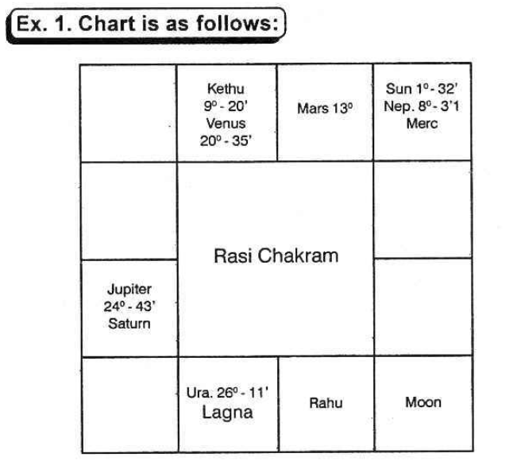

## Physical Features
Generally, the sign occupied by the lord of the constellation in which the sublord of the Lagna at birth is, indicates whether one is tall or short, stout or thin-build, etc. These details are given under each sign in Volume 1.

If we classify the 12 signs into 3 groups, then the signs Gemini, Leo, Sagittarius, and Aquarius contribute to good height. Aries, Virgo, Libra, and Scorpio indicate average height. Taurus, Cancer, Capricorn, and Pisces denote shortness. Lord of Lagna, in the beginning of a sign, indicates tallness. As it proceeds to the middle of a sign, the person is above average height; between the middle of the sign and the end of the sign, one becomes shorter. If it is in the fag end of a sign, one is short.

Robson says that the lord of the Ascendant and Moon without latitude, posited in the end of a sign produce short persons. Ptolemy mentions that lord of the ascendant with greater latitude causes stout persons. The greater the latitude, the more stout one will be.

Also, in practice, it will be observed that the physical description varies from the normal in many respects, especially in twin births. According to Krishnamurti Padhdhati, one's height, weight, etc. depends on the sign occupied by the lord of the star in which the sublord of Lagna is deposited. The sign denotes the physical feature in general. The constellation modifies it. The lord of the sub decides whether one is tall or short, plumpy or wiry, and so on.

Further, one should include the aspects from other planets to the cusp of the ascendant and judge according to the nature of the planet. Good aspect from Jupiter to the cusp of Lagna inclines to overweight whereas Saturn to emaciation. Mars and Sun offer muscular and robust body. Venus contributes for grace, charm, and beauty. Mercury denotes plumpy with pale appearance. Moon gives prominent features, long nose, piercing and wandering eyes. Uranus inclines to long limbs. Rahu produces tall people. Kethu causes shortness. Saturn and Sun contribute for bushy growth of hair.

One's physical feature is governed mainly by the sublord and the sign occupied by the lord of the constellation in which the sublord is situated. Hindu astrologers judge the beauty of a person from the lord of the Navamsa Lagna. The complexion is ascertained from the lord of the Navamsa sign occupied by Moon. The conduct and character is judged from the lord of Trimsamsa. Varahamihira advocates this method of judgement. Mahadeva in Jataka Tatva says that one’s appearance will be like that of the planet which is the strongest in the horoscope: the hue depends on the lord of the Navamsa sign occupied by Moon and the behaviour and character depends on the Trimsamsa position of Sun.
Marks, Scars, or Moles on the Body

Mahadeva has mentioned that Mars and Sun cause red marks; Rahu and Saturn black scars; Moon, Mars, and Venus produce marks on the head; Venus in Lagna and Rahu in 8th house cause a mole in the head or right ear. Mars in Lagna and Saturn in trine indicate a mole or mark in the generative system. Jupiter in 8th house produces a mole in the belly. Royal marks or moles on the palm or on the foot will be found in persons who have to enjoy Rajayoga.

According to Westerners, one will have a mark or a scar in that part of the body indicated by the sign:

1. Aries - head
2. Taurus - ears, neck, throat
3. Gemini - arms, hands, shoulders
4. Cancer - breast
5. Leo - heart, sides, back
6. Virgo - belly
7. Libra - reins and loins
8. Scorpio - secret parts
9. Sagittarius - hips and thighs
10. Capricorn - knees
11. Aquarius - legs and ankles
12. Pisces - feet and toes

(a) in which Lagna falls  
(b) in which lord of Lagna is deposited  
(c) in which Moon is situated  
(d) in which Saturn, Mars, or Uranus are posited and at the same time afflicted by evil aspects, and  
(e) the sign where the 6th cusp falls.  

According to me, moles are found from birth and scars and marks are formed due to disease, cuts, operations, boils, etc. A male will have a mole on the right side if the Lagna and lord of Lagna occupy a masculine sign. If the Lagna is masculine and the lord of Lagna is in a feminine sign, the mole in that part of the body signified by the Lagna sign will be on the right side, whereas the sign tenanted by lord of Lagna shows the part of the body and the mole will be on the left side. But if a male member is born in a feminine sign and its lord is also in a feminine sign, the mole will be on the left side. If the lord is in a masculine sign, the mole will be on the right. For ladies, the reverse is the order.

If in that sign, the cusp or the lord of the Ascendant is in the first ten degrees, the mark will be in the upper one third portion of the part indicated by the sign; if it is in the middle 10 degrees, the mark will be in the centre of that part of the body; if it is between 20 and 30 degrees, it will be in the lower part of that portion.

As regards scars, one is to note which planets will cause disease or danger; which sign they occupy and afflict; which part of the body will be affected; and also judge when it is to happen. For example, if Venus and Jupiter are in Visaka Nakshathra-constellation 21 degree Libra in the 6th house to Taurus born, one expects appendicitis or hernia during the conjoined period of Jupiter and Venus. As the surgery is to be done in the lower abdomen, one is to predict a scar in the lower abdomen. Similarly, one is to offer a precise and correct prediction.
### Longevity

According to Western system:

1. If a malefic comes to the cusp of any angular house
2. If a malefic forms an evil aspect with the Ascendant
3. If a malefic progresses in the 6th house and afflicts the 4th cusp
4. If a malefic progresses in the 8th house and adversely aspects the 7th cusp
5. If a malefic throws an evil aspect from the 12th house to the meridian
6. If Jupiter, though a benefic, forms an evil aspect with Neptune (Moksha)
7. If Neptune forms an evil aspect with malefics
8. If Uranus, Saturn, or Mars receive a strong unfavourable aspect from other evil planets
9. If they afflict the Lord of the Ascendant or the Ascendant: danger for longevity is to be protended

So also, during transit, such aspects are to be taken to fix the exact time.

According to Hindus, the span of life of a person may be classified into 3 groups:

1. Short life (0 to 33% years)
2. Middle life (33% to 66% years)
3. Long life (66% to 100 years)

Our sages have grouped the following combinations:

**Short Life:**

1. Moon conjoined with a malefic, not mitigated by the aspect from a benefic and malefic in Lagna and 7th Bhava
2. Moon in a Kendra (either in 1st, 4th, 7th, or 10th) and malefics in other Kendra Sthana
3. Weak Moon in 12th; evil planets in 8th and 1st - no benefic in Kendra
4. Benefics in 3rd and 8th afflicted by malefics
5. Moon in Lagna and malefic in 7th
6. Moon, Sun and Saturn in 8th
7. Mutual exchange between lords of 1st and 8th
8. Lord of Lagna in 3rd, 6th, or 12th - malefics in 6th or 8th - no favourable aspect from benefics
9. Moon, Sun and Mars in 5th house - devoid of beneficial aspects and so on

(The above is a general principle. It needs further consideration. One should not declare hastily the results applying the above rules alone.)

**Middle Life:**

1. Saturn in Lagna, Moon in 4th, Mars in 7th, Sun in 10th, benefics in evil houses
2. Jupiter in Lagna in Sagittarius, Mars and Node in 8th
3. Saturn in Lagna, Moon in 8th or 12th
4. Venus in Lagna, Saturn in Kendra, most of the other planets in 3rd and 11th
5. Sun in 7th, Mars in 5th and Saturn in Aries

**Long Life:**

1. No evil planet in Kendra: Jupiter in a Kendra position counted from lord of Lagna
2. Moon in 9th, no evil in 8th, benefics in Kendra
3. Benefics in between first and 6th houses and malefics above horizon
4. Leo Lagna - majority of planets in Kona - Trine houses
5. Cancer or Taurus Lagna: Jupiter deposited in Lagna. Three more planets exalted.
6. Cancer Lagna occupied by Jupiter. Two planets in exaltation.
7. Leo Lagna with Jupiter. Venus in Cancer - Mercury in Virgo - malefics in Upachaya Sthana 3rd, 6th, or 11th.
8. Moon in Pisces, Sun in Cancer, Aries Lagna, Saturn in Capricorn, Mars in Libra.
Thus, various combinations are given. To my knowledge, there are 284 such rules. Readers cannot remember all these combinations; each rule can be applied only to a few births. These are general and fail miserably in the case of twins.

But our sages have propounded various methods to calculate the age of a person. They involve so much calculation that a person needs hours and days to arrive at one figure. Those who have gone through a few magazines would be knowing many methods, as a symposium is given. This is the theory; it has confused many to know which one is correct and to follow. God alone has to help the reader; publishers do not advocate any one of the various calculations, giving reasons.

The following examples and explanations will be useful. This method is applicable to all births, including twins.

1. Note the correct time of birth and the time of query.
2. Erect a horoscope using Raphael Ephemeris and Table of Houses.
3. Deduct Krishnamurti Ayanamsa.
4. Note the Ascendant-Nirayana position, referring to the table given in the first volume, and ascertain the lord of the lagna, the lord of the constellation, and the lord of the sub. The Dasa lord is the lord of the constellation; the Bhukti lord is the lord of the sub.
5. If any person has to run the conjoined periods of these three planets, what would be the result? Will he lead a healthy life or will he suffer? If the sub belongs to a benefic, he lives long; when the sub is governed by a malefic, his life is short. This is very clear in the case of twin births, where one lives and the other dies. The sub lord is the deciding factor.
6. If the sub lord is a benefic, then it is necessary to calculate and find the span of life. Lords of 1, 5, 9, and 10 are benefics; lords of 6, 8, and 12 are malefics. If lords of 1, 5, 9, and 10 also rule 5 or 8 or 12, consider the planet as mostly a benefic. The planets owning other houses are considered as benefics or malefics by noting the other house which they own.
7. How to judge the longevity is explained with two examples. Bhadakasthana, Kendraadhipathya, and Marakasthanas are explained.
Ex. 1. Chart is as follows:

Mars, lord of the Lagna, rules the sub of the Ascendant. Health, vitality, resistance against infectious diseases, immunity, and activity are judged from the strength of the Ascendant, planets in the Lagna Bhava, those occupying their constellation, the good or bad aspects to the Ascendant and to the lord of the Ascendant. Benefics in the Ascendant contribute to a long span of life.

Lord of the Ascendant forming a favourable aspect with the Ascendant and receiving harmonious aspect from benefics promises a long life. Ascendant is Scorpio. Its lord is Mars. As per Hindu System, it is aspecting the Lagna and fortifying it. Therefore, health and longevity are assured by Mars.

Disease is indicated by the 6th Cusp, 6th house, planets in the constellation of the occupants of the 6th house, the occupants of the 6th house, the planets in the constellation of lord of 6, the owner of the 6th house, planets conjoined with them or aspected by them affect the health and cause such diseases signified by them when they operate their dasa or bhukti or anthra and there is an aspect to them by progression and by transit.

In this case (so also for Taurus borns), lord of 1 is also the lord of the 6th house. So the same planet owns both the Ascendant indicating health and also the 6th house threatening disease. Then when Mars (lord of 1 and 6) dasa or bhukti or anthra is on, how to say whether one will maintain robust health or one will fall ill as Mars has to offer health and cause disease also? Note down which planets form favourable aspects with Mars and the Ascendant and which form (a) adverse aspects with Mars, (b) good aspect with the 6th house and (c) adverse with Ascendant.

He will maintain good health during the dasa or the conjoined period of Mars and the benefic who form harmonious aspects with the Ascendant and the lord of the Ascendant. He ought to have fallen ill and he will have an ailment during the dasa of the planet forming an evil aspect with Ascendant or good aspect with 6th cusp or lord of 6 or planet in 6. According to K.P., Significators of 6th house ruling the Sub period in Mars dasa will cause disease and significators of 11 give cure.

The 8th house is called the house of “Longevity”. Therefore, planets in the constellation of evil planets in the 8th house, except Saturn, occupants of the 8th house, planets in the constellation or in the sub of lord of 8, lord of the 8th Cusp and planets in any manner connected with them indicate (a) danger to one’s life (b) the cause of death and (c) the place of death.

But houses 2 and 7 are Maraka houses and the 12th house indicates Moksha. The reason is as follows. Houses 1, 8 and 3 are judged for longevity and benefics in these houses contribute to a long life. 12th house to any Bhava is the negation of the Bhava. Therefore, the 12th house to 1, 8 and 3 are 12, 7 and 2 and they are evil for one’s longevity. That is why, houses 2 and 7 are said to be Marakasthanas and 12 is called the Moksha Sthana.

So one is to judge the houses 1, 8 and 3 and then 2, 7 and 12. First of all one is to judge whether a person is promised “Poorna Ayush” - i.e., full course of life running between 66 and 100 or Madyama or Middle life (age between 33 and 66) or short life between 0 and 33.

Then one is to work out, calculate and ascertain (a) which planet will rule the dasa in that age and the area covered by the maraka planets; (b) according to progression, the time when the Lagna, the lord of the Lagna and the very slow moving planets Saturn, Uranus and Neptune receive evil aspects; (c) according to transit (Gocharam) when evil aspects are formed to the Ascendant, its lord etc. as per K.P., when Significators transit in such sensitive points ruled by the significators.

Also, erect a chart for the moment at which there is the urge for one to answer the query and note the evil planets for that moment. Ruling planets for that moment reveal.

Finally, ask the person to mention a number within 249, consider the position of the planets and judge. These are for confirmation and confidence.
### Bhadhaka Sthana

According to the Hindus, Bhadhaka Sthana Adhipathis are the worst malefics who will never hesitate to put an end to one's life. Of the twelve signs, Aries, Cancer, Libra and Capricorn are movable-chara-signs, and the 11th house counted therefrom are Bhadhaka-Sthanas i.e., to Aries born, Aquarius is the Bhadhakasthana and the lord of Aquarius, Saturn is the Bhadhakasthana Adhipathi. To Cancer-born, Taurus, is the Bhadhakasthana and the lord of Taurus, Venus is the Bhadhakasthana Adhipathi. Similarly to Libra, the sign Leo and the Luminary Sun and to Capricorn, the sign Scorpio and its lord, Mars are Bhadhakasthanas and Bhadhakasthana adhipathis.

For people born in fixed signs Taurus, Leo, Scorpio and Aquarius, the 9th sign from those houses are Bhadhakasthanas and their lords are Bhadhakasthana adhipathis. For people born in common signs Gemini, Virgo, Sagittarius and Pisces, the 7th house therefrom and the lords of those houses are Bhadhakasthana and Bhadhakasthana adhipathis.

How to Judge

1. Of all the planets, those which occupy the constellation of the occupants of the Bhadhaka Sthana are the most evil. Next, the occupants of Bhadhakasthana; the Planets occupying the Constellation of the lord of the Bhadhakasthana, and the lord of that evil sign. The planets conjoined with them or being aspected by them also acquire unfavourable effects.

### Kendrasthana

2. Next, the Hindus consider Kendhra adhipathyam as harmful. Waxing Moon, unafflicted Mercury, Venus and Jupiter owning the houses 1, 4, 7 or 10 counted from Lagna are regarded as Kendhra adhipathis and a few astrologers are terribly afraid of them, as they have not collected materials and studied from the facts and figures. There are hundreds of people, born in the years 1909 & 1923, in the Ascendant Virgo with Moon in Hastham star, having Jupiter in the marakasthana, 2, owning the Kendhra houses 4 and 7 who are now living having enjoyed their lives for 16 years of Jupiter dasa and are now running Saturn dasa. Therefore to decide one's longevity, taking Kendhradhipathyam is not correct. Many other methods are to be included.

### Marakasthana

3. Next consider the planets in the constellation of those in Maraka sthanas, the occupants of Maraka sthanas, those in the constellation of Maraka sthana adhipathis, the lords of Maraka Sthanas, and those conjoined with or aspected by them. Thus one is to analyse and judge.

The lagna of the example horoscope is Vrischika. It is a fixed sign. The 9th house is the Bhadhakasthana. Moon is the lord of the 9th house. No planet in the Bhadhakasthana. Hence one is to consider its lord Moon after judging the strength of the planets in the constellation of Moon i.e., Rohini or Hastham or Sravanam. Only Mars is in Rohini star. Venus is a Kendradhipathi owning the 7th house. Venus alone is in Bharani governed by Venus. But there is a node Rahu in one of the signs of Venus and Ketu in the sign of Mars. Rahu represents Venus; Kethu represents Mars. Therefore Rahu and Kethu are definitely evil. Tenant is stronger than owner.

As purna Ayush is promised by the aspect of Mars on Lagna, Jupiter's aspect to lord of Lagna etc, and as it is, he is now running 63 years of age, consider which dasa will prove to be evil. Mercury dasa, Venus Bhukti from 4-6-1962 will operate upto 4-4-1965. Venus in the 6th Bhava, in the dasa of lord of 8 can cause cataract in the eye. It will be developing in this period and in the bhukti of sun, who is in the constellation of the lord of Lagna Mars, will give vision with the aid of a surgeon. Later Moon Bhukti will be pleasant which will be continuously enjoyed during Mars sub period.

Rahu Bhukti begins on 7-7-1968. Rahu is undoubtedly evil. Dasanatha Mercury, lord of 8, in the constellation of Rahu, in Mokshasthana, representing Kendradhipathi Venus, is also undesirable. Kethu in the constellation of Mars is not favourable. Kethu is in the 6th sign, but in the 5th Bhava, it is said that Kethu in the 5th house conjoined with Marakasthana-adhipathi will inflict death. Therefore Budha dasa, Rahu bhukti, Ketu anthra will be the end. Budha dasa Rahu bhukti commences on 7-7-68: Ketu anthra will be between 2-1-70 and 25-2-70. As per transit on 18-2-70, Saturn will be in Ketu star Saturn sub and conjoins exactly Kethu (the anthranatha) opposing Rahu the Bhukti natha. Therefore longevity upto 18-2-1970 is promised. (Actually this native passed away at 7.30 a.m. on 18-2-70).

Sublord of the Ascendant shows one's health, vitality, immunity and longevity: Planets, benefic, by lordship, occupying Lagna, do not guarantee for long span of life so also Malefics to affect health. Though Cancer-natives are considered to be fragile in their youth, they pick up health later and lead a healthy life, yet longevity depends upon the exact position of the Lagna, the sublord and the lord of the constellation in which the sublord is deposited.

6th house shows disease. Planets occupying or owning the house are weaker in strength than the planets in the constellation of the occupants and owner.

8th house shows unexpected and minor or serious incidents affecting one's health and causing anxiety to life.

12th house threatens with danger, hospitalisation and end of life (Moksha).

Houses 1, 8 and 3 are to be examined to ascertain, whether one will live long or is blessed with short life. The houses 12th to 1st, 8th and 3rd are 12th, 7th and 2nd. Twelfth house to any house is the house of negation to that house. Hence, houses 1, 8 and 3 are the houses of longevity whereas house 12th, 7th and 2nd are the “Maraka Houses”.

The planets, in the constellation of the occupants of the Bhadhakastiana, are the stronger evils: next, the occupants of Bhadhakasthana; next those in the constellation of the lords of the Bhadhakasthana and lastly the lords of these evil houses.

Next, one is to judge the Maraka sthanas, the second and seventh houses, whatever be the sign, in which ascendant falls.

Having considered and selected the strong evils, note, when they will operate conjointly (according to Udu Dasa System).

Lagna is Cancer, it is a movable sign. 11th house to Cancer is the Bhadhaka Sthana, i.e., Taurus. Neptune alone is in Taurus. As Neptune is not allotted any star, no planet is in the constellation of the planet in Bhadhaka Sthana.

Venus is the lord of the sign Taurus. Bharani, Poorvapalguni and Poorvashada are ruled by Venus. No planet occupies the constellation of Venus. So Venus itself is a significator. It is in the constellation of Rahu which occupies Maraka Sthana. Therefore Venus is a very strong evil planet.

Leo is the 2nd house, and its Lord is Sun. It is the Maraka Sthanadhipathi to Cancer-borns. No planet is found in the second house. Rahu is in Sun's star. Sun is in the constellation of Saturn. Saturn is Maraka Sthana-adhipathi. Sun is another significator.

Capricorn is the 7th house, another Maraka Sthana. Its lord is Saturn. It is in its own constellation. Therefore it is evil. Saturn’s stars are Pushya, Anuradha and Utharattadi (Uthrapathrapada). Majority of the planets are under the sway of Saturn. Ketu is in Pushyam star. But all the planets in Scorpio, i.e. Sun, Mars, Mercury, Saturn and the Uranus are in Anuradha star. None is in Uthrapathrapada. When the majority of the planets are in the same star find out in which sub according to Krishnamurti Padhdhati they are. Those planets in the star of Saturn and the sub of the other significators for death, are definitely EVILS. Mars is the strongest malefic. (a) as it is in its own sign; (b) as it occupies the constellation of Saturn, and (c) the sub of Mercury.

Hence Mercury, Mars, Saturn, Venus, Rahu, Keth and Sun are evil. As Mercury Dasa is operating, select Mars sub period. In that sub period, the conjoined sub sub of Saturn, Venus and Sun will operate. It will be after 19-12-1972 and in the second half of February 1973.

Sun will transit in the 24th degree of Nirayana Aquarius, which constellation is ruled by Mars and the sub ruled by Mercury. Hence when Sun transits in the 8th house, i.e., in Satu sign Aquarius, in Dhanista star governed by Mars, and the sub of Mercury, in the 3rd week of February 1973, health will fail.

Therefore planets promise long life till at least 15-2-1973. This person is yet alive.