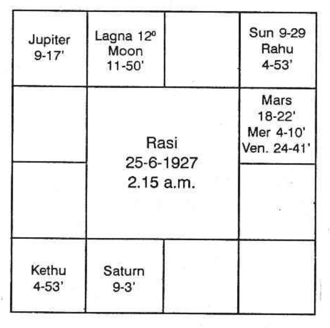

## Brothers and Sisters 
### (Hindu Traditional Astrology)

Third house counted from Lagna, if it is not afflicted, or from Moon sign, if it is more auspicious and strong, indicates all about brothers and sisters. Third house denotes the next conception by mother: the 5th indicates the second conception: the 7th shows the third younger brother or sister and so on.

“Karako Bhava Nasaya” fails miserably, as many people having Mars in the 3rd house, are born with many brothers both younger and elder. But one is to judge the 3rd house counted from the position of Mars. If Mercury, Moon, Mars and Jupiter are in 3rd and 11th from Lagna or lord of Lagna there will be many brothers. Ketu therein shows sisters.

The number of brothers and sisters is ascertained from the strength of the third house and its lord, the rasi and the navamsa of the 3rd house. Also it is guessed from the navamsa of the occupant of the 3rd house and Karaka, Mars. The number of sisters is found from the female planets in 9th and the brothers from the male planets in the 9th house.

### Krishnamurti Padhdhati

According to Krishnamurti Padhdhati it is the sublord of the cusp of a house which indicates whether the matters of the houses are positive or negative. If the sublord of the third cusp is in the constellation of a planet occupying a dual sign or it itself is in a dual sign or if the cusp receives good aspects from a planet in a dual sign (e.g., Mars from Gemini by the 8th aspect aspecting the 3rd house Capricorn where the 3rd cusp falls), only in these cases there will be plurality of brothers or sisters or both. In case of twins, when one of them happens to be a boy, the other a girl then even though according to traditional system the Lagna remains in the same sign, star and navamsa, yet to each the number of brothers or sisters will be found. Traditional Astrology cannot be helpful. Because the twin brother will have among brothers one less and among sisters one more. But the twin sister will have among brothers one more and among sisters one less. That is, if other than the twins whose parents would have had two sons and two daughters then the twin boy will have two brothers and three sisters whereas the twin sisters will have three brothers and two sisters. Therefore, it is the cusp of a Bhava which will decide whether there will be plurality of brothers or sisters and at the same time according to K.P it is not yet found possible to find out a single rule to give the number of brothers or sisters and also the sex. No doubt the research is being done by very able and intelligent astrologers at Delhi. And I am sure that it would be possible to give correctly the results which will be 100% successful. It will be published in the Magazine ASTROLOGY & ATHRISHTA.

If one is to find out the longevity of the next younger born it is advisable to take the 3rd cusp as the ascendant of the next younger and then for that locality of birth (Latitude) one is to find out the cusps of the other houses keeping the 3rd cusp as the ascendant. Then only the sub lord of the 3rd cusp will vary. Otherwise when the 9th cusp indicates Father then the younger one’s partner in life will also be indicated by 9th cusp (7th to 3rd). The ruling planets at the moment of the birth of father, and sister's husband or brother’s wife will not be the same. So by research it has been decided that the 3rd cusp must be taken as the lagna of the younger and then for that Latitude the other cusps should be worked out. Now the 9th cusp according to one’s horoscope indicates father, the 7th cusp to the 3rd (which forms the lagna of the younger) indicates the partner. Here both the results are correct.

According to K.P. Significator of the 3rd house if connected with the 2nd (though 12th to 3rd) and also the significator of the 11th house one will have co-borns.

### No. Brothers (Hindu)

- Sun in Leo in 9th
- Rahu in 3rd
- Malefic in 2nd
- Saturn in 3rd
- Saturn in 9th or Ketu in 3rd

### Death of Brother (Hindu)

1. Lord of 3rd in 6th or 8th or 12th or
2. Lords of 8th or 10th or 2nd in 3rd bring death to brothers while they are young.
3. Benefics in 3rd or 6th or 8th or 12th to the 3rd house show their death late in life.

Two brothers may be born to a person. The brother who is born with the malefic ruling planet threatening short life will die and that brother, whose ruling planet is a benefic occupying the house, will live long.

### Death of Brother (K.P.)

Consider the Longevity as per the dicta of K.P taking 3rd house as Lagna to Youngs.

### Danger to Brother (Hindu)

Count the 3rd house from Mars. If malefics occupy the 3rd from Mars, its lord and Mars are weak, it is most undesirable to one's brother. Beneficial planets in 6th shows unhappiness to brothers, but malefic planets in 6th are prosperous to them.

### Danger to Brother (K.P.)

If the sublord of 3rd is the Significator of 8th or 10th there is danger.

### Prosperity to Brother (Hindu)

1. Benefics in 8th, 9th and 10th (Adhiyoga to him);
2. Mercury, Jupiter and Venus in 3rd;
3. Jupiter in 9th or in 3rd;
4. Lord of 3rd in a Kendhra with a benefic

### Prosperity to Brother (K.P.)

If the Significator of 4th is also Significator of 12th and 1 brother will be lucky.

### Brother to Become Hostile

Lord of 3rd in 6th or both the lords in any manner connected with each other or Mars in 6th or 8th or 12th or lord of 1st and lord of 3rd in evil aspect, occupying 6th or 8th or 12th to each other; Lord of 9th weak and adversely aspected leads to enmity.

### Brother to Become Hostile (K.P.)

If the Significator of 1st is also Significator of 3rd, 6th and 8th they will be enemies.

### Ever Friendly and Inseparable

If lord of 9th is in its own sign receiving good aspects of lord of 1st, forming good aspect with lord of 3rd allows to maintain good relationship.

### Ever Friendly and Inseparable (K.P.)

If the Significator of 3rd is also significator of 11th and 1, there will be harmony.

When brothers are many, note down the planets which will cause death. When the person runs its dasa and bhukti, that brother or sister born with that planet as his or her ruling planet will pass away. Suppose Saturn and Rahu are in 3rd and a brother is born with Saturn and Rahu as ruling planets either in Sathabhisha or on a Saturday with Rahu in Lagna or in Saturn's Star Pushya, Anuradha or Uthrattadhi conjoined with Rahu. Then he will pass away during the conjoined period and sub period of Saturn and Rahu. Another brother born with ruling planets not including Rahu and Saturn will live.

### Partition

Difficulty about property will be in the conjoined periods of lords of 2nd, 4th, 6th, 8th or 12th; but partition will take place during the conjoined periods of the significators of the houses of 3rd, 9th, 12th and 4th or 10th.

## Sorrow Through Brothers

1. If the sublord of 3rd cusp is in the constellation of Jupiter in 11th, or
2. Mars in 11th, aspected by Saturn, or
3. Mars conjoined with or hemmed-in between malefics, it causes worry through brothers and sisters.

### Acquires Brother’s Property

1. Lord of 3rd, strong and posited in the constellation of significator of 2nd.

### Expenses Through Brothers and Sisters

Lord of 3rd, planets in 3rd, planets in their constellation, in any manner connected with lord of 12th shows expenses through youngsters. He has to shoulder the responsibility.

## Mother

For people born during day time, the Sun represents the father and Venus indicates the mother; but for those born during night time, Saturn governs the father and the Moon rules the mother.

According to Hindus, the 4th house denotes the mother; but Westerners say that the 10th house represents the mother. But if one considers the ruling planets of one’s mother and the significators of the 4th house, one will find that they invariably agree; whereas if one finds the significators of the 10th house and judges the ruling planets of one’s mother, it fails. Hence one is to take the 4th house alone as that which indicates the mother.

The longevity, health, finance, etc. are to be judged, taking the 4th house as the Ascendant of the mother and, as each aspect is considered to the native by counting from the Lagna, so also it should be done for the mother, from the 4th house. The beneficial aspect to the 4th house and Moon promises her health and longevity, whereas evil aspect to them will tell upon her ill health. Bhadhakasthana, Kendhradipatya, and Makarasthanas from the 4th house indicate the evil planets affecting her longevity.

Houses 2, 10 and 11 counted from the 4th house, i.e. 5, 1 and 2 counted from the Lagna of the native, indicate her possessions, income, pleasure and profit; 6th from the 4th house, i.e. 9th house, shows her disease, debts and difficulty. Thus, results to the mother are judged taking the 4th house as her Lagna. The position of the planets are to be counted from the 4th house. The dasa, Bhukti, and anthra ever remain the same.

Mother abandons her child if:

1. Moon in 7th is in trine to Mars and Saturn and is devoid of beneficial aspect from Jupiter. This applies to such children who are left in nursing homes or who are taken away from mother and brought up by other relatives.
2. If Mars and Saturn are conjoined together and if Moon is in 5th, 7th or 9th to them.
3. If Sun is similarly posited.
4. Moon in Lagna, Mars in 7th and another malefic afflicting Moon threatens that mother abandons the child, which dies later.
5. Moon in the second house and Mars as well as Saturn in 11th offers above results.
6. If benefics aspect, then a good relative, as is indicated by the benefic, takes away the child from mother; malefics forming good aspect shows bad people take away the child.
7. The mother dies along with the child, if Moon is hemmed in between malefics, occupies 1st or 7th house and 8th house and is not aspected by benefics.
8. Saturn in Cancer is unfavourable to mother’s health and longevity.
9. Moon, in Leo indicates that one will ever be obedient to his mother.
10. Moon conjoined with Mars shows that one will disobey his mother.
11. Moon in the tenth house indicates gains through mother.
12. Saturn in 2nd, Jupiter in 1st and Rahu in 3rd, is danger to mother.
13. Saturn in Taurus, Rahu in Gemini, Venus in Virgo and Mars in Leo, is danger to mother.
14. Saturn in 10th, aspected by Moon in 4th will prove destructive to mother.
15. Malefic in 11th and Venus and Moon in 5th shows that the mother will be unhappy.
16. Moon in 4th, strong and full, Venus in 7th and Mercury in 10th show that one will have happiness through mother.
17. One derives the qualities of mother if Moon is stronger than Sun.
18. Lord of 12th in 2nd or 4th shows an unhappy mother.
19. Saturn in 12th is danger to mother.
    - HINDU
20. The fateful degrees of Moon from Aries to Pisces are as follows: 26, 12, 13, 25, 24, 11, 26, 14, 18, 25, 5 and 12. If Moon is in the fateful degree, conjoined with malefics, devoid of beneficial aspect, or if it is in 8th or in a Kendra position, both mother and child will die together.
    - K.P.
21. If the 4th Cusp and Moon occupy the constellation of the significators of the 9th, 11th or 3rd house, and if the sub belongs to Bhadhakasthanadhipati or Marakasthanadhipati, to the 4th house, the mother will be unhealthy and unhappy; she will not live long after the birth of the child. Death of mother and her longevity is to be ascertained taking the 4th cusp as the Lagna of mother and confirm from her chart, if available.

## House to Dwell In

The fourth Bhava (house) in a horoscope signifies the permanent possessions, viz., land, building, or vehicle, the mother as well as one's education. Mahadeva in Jataka Tatwa says that a person will reside in many houses if the 4th house is a movable sign; or if its lord occupies a movable sign or the Karaka Mars is in a movable sign. It means that during the periods and sub periods of the planet in 4th which is a movable sign, one will change their residence; if the 4th sign is fixed, but its lord is in a movable sign, the person will change their quarters; or during the period of Mars, one has to change their dwelling, if Mars were to occupy a movable sign; In Saravartha Chintamani, Venkatesa says that movable signs indicate houses in many localities. “If the 4th house, its lord or Mars were to be in a fixed sign, the person will live permanently in the same house.” The 4th house may be a fixed sign. So planets in 4th Bhava and in fixed signs, will not allow one to change their quarters. If the lord of the 4th house, which may even be movable, occupies a fixed sign during their period, the native cannot shift. If Mars occupies a fixed sign, the native will remain in the same house during its period.

“If the lord of the 4th house is in a benefic Amsa, he will live permanently in one building (Chap. III, Sl. 98 to 100.”) He says “Find out who owns the first, second and fourth houses? Note how many of them occupy either Kendhra or Kona, (Kendhra means 1, 4, 7, 10; Kona means 1, 5, 9.) Depending on the number of planets, one is to predict the number of good houses resided in and to be resided in by the person.”

In Jataka Parijata it is said that the acquisition of houses is to be determined from the 4th Bhava. He says: If the fiery planets, Sun or Mars, occupy the 4th Bhava and be in depression or in enemy's camp, the person will not own a house.”

“If the lord of the 4th Bhava is in the 12th house, the native will live in other's houses in a foreign place.” “If the lord of the 4th house is in 8th,” the author says, “there will be no dwelling house owned or tenanted by the native.” “If the lord of the 4th house be in the 6th house, he will lodge in a house owned by uncle, cousin, etc. He adds “if the lord of the 4th house is in a Dushsthana (i.e., 6, 8 or 12) or if an evil planet occupies the 4th house, then the house owned by him will be haunted.”

“The lords of 2nd, 4th and 12th in 3rd, 6th, 8th, or 12th indicate the number of houses to be lost by the native”. He encourages by saying that one will be lucky to own as many strong houses in good condition as the number of beneficial planets in the Trikonas and Kendras.

Mahadeva is of opinion that the lord of the 4th house, in combination with the lords of 6th and 8th, causes the destruction or loss of the house. Varahamihira in brihat Jataka says that people, born with Moon in Cancer or in Virgo, will own houses. It does not mean that all those born in Cancer Rasi will build houses and those born with Moon in Virgo will own them. Here one is to note whether Moon was in a favourable sub and constellation. Also one should note the lordship of Moon. Otherwise, in many cases, it will not come true. But those born with Moon in Gemini or Virgo, Libra or Scorpio, Pisces or Aries, own good houses. If Moon is also strong and beneficial, it will give a house to the person during its period.

Kalidas also has said in Uthrakalamrita, that beneficial Moon and Jupiter will bless one with a house. Prithuyasas mentions that a person will acquire a dwelling house during the dasa of a planet, if the dasa commences on the day when Moon transits in Jupiter's sign.

One lives in other's houses during the period of Mercury, if it would have been debilitated at the time of birth. Also he says that persons, born in Meena Navamsa, live in other's houses. He is of strong opinion that people born in Meena Navamsa, live in other's houses and people born in Karthikai Nakshathra will own many houses.

One can have a strong house, if a benefic occupies the third house and the lord of 4th is also strong. The house will have a compound wall if there is a benefic in the 3rd house and when the lord of 1st and 4th are both strong.

Thus, various authors have mentioned about the dwelling houses.
According to K.P., the 4th house signifies mother, vehicle, education, and building. Mars is the planet which governs buildings, Moon the mother, Venus the vehicle, and Mars as well as Moon, the land. Therefore, planets connected with the 4th house and Mars will indicate a dwelling house. The 4th house and Venus indicate conveyance; the 4th house and Moon govern mother; the 4th house and Mercury indicate education. So, the planet occupying the 4th house or the planet in the constellation of the occupant, having connection with Mars, the lord of the 4th house, if connected with Mars, and planets in the constellation of the 4th house connected with Mars indicate buildings. If these planets are not connected with Mars, but are connected with Venus, one will have a vehicle. If they have a connection with Moon, the results refer to mother. If Mercury has a connection, it indicates education. (By connection with Mars, it is meant that a planet may) (a) occupy the sign owned by Mars, or (b) occupy the star ruled by it, or (c) the sub (according to Krishnamurti Padhdhati) governed by Mars, (whatever be the sign and the star.)

Therefore, if one judges about one’s house to dwell in, one has to consider the planets connected with the 4th house and also Mars:

1. The planets occupying the 4th house (whatever be the sign) and are either in Mars’ star or Mars’ sub.
2. Planets in the constellation of such occupants.
3. Lord of the 4th house in the constellation or sub of Mars.
4. Planets in the constellation of such lords.
5. And the favourable situation of Mars to the 4th house.

Acquisition of a house may be by inheritance, legacy, or by purchasing one. Hence, if the 4th house receiving good aspects from the lord of 10th, the native gets a building by inheritance. Here, he does not withdraw money from a bank or borrow, and then buy or build. But if the 4th house has a connection with the lords of 1st and 12th, the native will invest the money he has, and convert liquid cash to a solid permanent possession. The second house indicates bank position, one’s movable property, liquid cash, etc. The first house indicates that he makes efforts. Twelfth house shows that he spends and invests. But if the 4th house has a connection with the lords of 1st, 6th, and 12th, one will borrow and invest or one may acquire a house through a co-operative society, etc. If the lord of 1st is also the significator of 2nd and 6th has no connection with Mars, one borrows money by mortgage. If the lord of 1st has no connection, but if the lord of 4th and lord of 8th are connected, he will sell away the property. The purchaser is represented by the 7th house; 8th house will be the second house to the purchaser. So he acquires.

If the lord of 4th is connected with the lord of 12th and also Sun, either he loses the house by fire accident or through public auction; one uses much of wood if the planet which gives the house is connected with Jupiter. Kethu and Mars indicate that one will use well-burnt bricks; Saturn and Venus indicate cement. Saturn, Venus, and Mars indicate reinforced concrete; Sun, connected with the planet offering the house, shows that the roof may be thatched and grass might have been used; Moon indicates that there will be copious supply of wholesome water; Mercury indicates that he may have twin houses or servant quarters, outhouse, etc. Venus and Moon indicate that one will use lime and render it to give the appearance like marble; Mars and Venus indicate mosaic flooring; Venus gives a garden, furniture, glass, etc. Saturn gives air-conditioning, frigidaire, etc. Mars improves the kitchen; Venus the bedroom; Jupiter the cash-treasury room; Mercury the reading room; Saturn indicates that he may have a locker, an underground room, cellar, etc.

When one lets the house for others, Sun indicates that it will be let to a government department or government officials; Moon for nurses, midwives, Navy people; those who work in water supply, etc; Mars indicates surgeon, industrialist, police, military, etc.; Mercury shows business people, agents, journalists, post office, etc.; Jupiter for bank, school; Venus for hotels, silk shop, silver shop, for ladies; Saturn for servants, labourers, etc. That is why, some people build houses and let them out for a bank; some let them out for silk and silver shops; some for laundry; some for saloon, etc. This can be clearly seen in the horoscope of the native. So also one can find out that the owner of the house where one lives, belongs to one of a particular caste or profession or the quarters belong to a government or local body, etc. by scrutinising the position of the lord of 4th, the Dasanatha and Bhuktinatha; i.e. the lords who rule the Dasa, Bhukti, Anthra, etc.

The following horoscope will explain the sale and purchase of house during the different dasa that operated: 

Mars Dasa Balance 1 year, 9 months 23 days. While this native was running Rahu Dasa, Rahu Bhukti, Mars sub period in the first week of July, 1912, the house belonging to his father was sold away. He purchased a house on 5-11-1940, when Jupiter Dasa, Mars Bhukti, Jupiter Anthra was operating. He sold this house on 8-6-1958 during Sani Dasa, Rahu Bhukti, Sani Anthra. Again on 4-7-1960 he purchased a building during Sani Dasa, Guru Bhukti, Budha Anthra.

Explanation for the transactions:

1. Rahu was in the 4th house—Evil planets in the 4th house indicate loss of a house, if one possesses already. That is why, during Rahu Dasa, Rahu Bhukti and later in Saturn Dasa, Rahu Bhukti he disposed off the houses.
    a. Rahu was in Rahu’s star and Mars sub. That is why, during Rahu Dasa, Rahu Bhukti Mars Anthra, his father sold away the house, when he was young.
    b. Sani is lord of 11th and also 12th; therefore, during evil sub period the results indicated by evil house 12th will operate. During the Bhukti of beneficial planets, in Sani Dasa, beneficial results will be enjoyed as lord of 11th. If a planet owns both good and bad house, one should not divide a dasa into two halves and then say first half is good, the other half is bad or first half is bad and the other half is good. But the correct method of prediction would be that during the sub of beneficial planets (not according to their nature, but judging whether one is a benefic or not, by considering its occupation and lordship) to declare agreeable results and also in the sub period of planets owning good houses counted from Lagna and occupying favourable houses counted from Lagna and Dasanatha house;
    c. during Sani Dasa, Rahu Bhukti, Sani Anthra he sold away the house on 8-6-1958 and
    d. during Sani Dasa, Guru Bhukti (in 4th Bhava) Budha Anthra (lord of 4th house) he purchased a beautiful house. During Sani Dasa, Guru Bhukti, Mars Anthra he extended the building.

Future Prediction: In December 1971, he will purchase one more house during Mercury Dasa, Mars Bhukti, Mercury Anthra, sell away one in Mercury Dasa, Rahu Bhukti, Sani Anthra and have one more in Jupiter Bhukti, Mercury Anthra.
### Letter to Author

Respected Sir,

You will recollect that I consulted you last February 1966, regarding “Purchase of a New House”. You gave appointment for only 10 minutes; within the short time, you corrected my horoscope, dasa bhukti calculations etc., and predicted that I will surely purchase a house between 4 and 7 March, 1967. You also published the details of the prediction in your Magazine April 1966 issue, and also in your Padhdhati, Volume II, pages 143 to 145 (titled “Purchase of a House”) with my horoscope, without mentioning the name, and also discussed the various points for your making a particular prediction.

Proper indications came, during November 1966 and I purchased a fine house bearing No. 5 at Mundakanni Amman Koil Street, Mylapore, Madras-4 and occupied the same during the period mentioned by you, i.e., by 5 March 1967.

I am highly pleased to write to you this letter as the prediction given by you is found to be quite correct, and I assure you, Sir, that no other Astrologer gave such a correct and accurate prediction mentioning the date etc., nor I think any can give.

In this circumstance, I would also request you to continuously conduct the lectures on every Sunday at Bharatiya Vidya Bhavan at Mylapore to enable more friends to get in touch with you, benefit through your valuable predictions, who in turn will offer correct prediction to others and be useful to the public.

On this New Year’s Day, we sincerely pray Lord Uchishta, Maha Ganesh to bless you and your family with long life, happiness and prosperity to enable you to continue this great service, you are now doing to the common people like me, and by introducing a new simple method of this “Krishnamurti Padhdhati” which is really very useful for us.

Once again, thanking you, Sir,

Yours sincerely,

A.V.K. Murthy
### Purchase of a House

To purchase a house, one has to scrutinise the 4th house, as the 4th house indicates permanent possession, land and building, other than vehicle, etc. The 11th house shows the gains which one can have. The 12th house indicates the cheque to be issued in favour of one who sells the house. Therefore, one has to look to the houses 4, 11 and 12.

The 11th house indicates the acquisition. It may be either a movable or an immovable one. Since building or land comes under immovable property, one has to judge both the 4th and 11th houses. Unless we pay, we cannot possess a house. Payment is indicated by the 12th house. So, the houses 4, 11 and 12 are to be judged.

While judging the houses, we have to find out which planets occupy these houses and if so, note down the stars governed by these planets. Ascertain which planets occupy the constellation of the occupants of these houses. Whether there is any planet in such a constellation or not, note down also the occupants. Undoubtedly, the planets in their constellations are strong significators.

So, note down the planets occupying the constellation and also occupying these bhavas. As you have got majority of the planets occupying the houses 11 and 12 and no planet is in the 4th house, we can very well take that those planets which occupy these houses and also which aspect these houses or rule these houses will surely bless you with a house. For people born in Capricorn (Makara) lagna, Venus (Sukra) is Rajayogathipathi. By Rajayogathipathi, one understands that one can have his desires fulfilled. Saturn who is lord of 1 and 2, can contribute to one’s success and acquisition. Saturn is occupying the constellation Poorvashada which is ruled by Venus (Sukra), who is the Rajayogathipathi and Venus at the time of birth was occupying the constellation Jyeshta ruled by Mercury (Budha), lord of 9. According to me, there will be to some extent such beneficial results similar to Darmakarmathipathiyoga (Lord of 10, occupying the constellation of lord of 9).

One is to note that unless the 9th or 6th house also operates, it is not possible for one to take possession of the building which one purchases. Why? 6th house is 12th to the 7th; which denotes the person who sells. 9th house is the 12th to the 10th (which is the 4th to the 7th). In the constellation of lord of 6 and 9, Venus is posited. Therefore, Venus is a strong significator. Lord of the 12th house is Jupiter and it is in exaltation and it is also in the constellation of Mercury which also indicates that the seller will lose his property as Mercury rules the 3rd and 12th houses counted from 7th house. What is the 3rd house? 3rd house is Vyaya to the 4th, 4th house indicates permanent possession. Vaya to 4th house would mean to give away land or building. Therefore, planets occupying the stars of the significators of the 3rd house are strong enough to indicate.

Sukra Dasa, Sun Bhukthi, Guru Anthra will be the period when you will purchase a house and occupy it. When a doubt arises whether a particular anthra will give a result or not, the best thing would be to note down the moment at which the person puts the question. Moon is called Mathi. It indicates the mind. It gives the urge to put a question. Note where Moon is transiting at the time when the native puts the query. To-day, it is 21st February, 1966. Moon is in Aquarius (Kumba) and in Poorvapadrapada Nakshathra. Aquarius (Kumba) is ruled by Saturn and Poorvapadrapada is governed by Jupiter (Guru). Therefore, Saturn and Jupiter must rule the time when it will materialise. Again lagna at which you put the query is Libra (Thulam) and it is owned by Venus (Sukra). Therefore, the present moment is Thula lagna and Poorattathi Nakshathra. Therefore, Sukra Dasa, Sukra Bhukti, Guru Anthra will be the period when you will have it.

But, there is another school of thought that when Moon transits in a particular position, the native puts the query and when the significators transit that particular degree the native will have that ambition realised. Now Moon is around 22 in Aquarius. Therefore, on the day when Sun or Sukra is in 22 of Aquarius, you will possess the house, i.e., around 5th March 1967. He did buy on 4th March 1967.
### Disposal of a House
Kethu Dasa balance 0 year, 9 months, 13 days. During Moon Dasa, Saturn Bhukti on 6-2-1960 a new house was built and occupied. When can this building be disposed of?

Acquisition of a house: Judge the second, fourth and eleventh bhavas. Disposal of a house: 3°, 5" and 10" bhavas. A building is indicated by the 4" house counted from Lagna. Always count from Lagna. Never consider whether Moon sign is strong or Lagna is strong.

The research after 1967 found that we have to take always the Lagna alone. We should never judge which is stronger, whether Moon sign or Lagna. The main reason is that in a twin birth, only the cusps of the house including ascendant change whereas Moon is in the same position. What we had been following in K.P. printed in 1966, is to be given up.

Sun and Rahu are in second bhava. Mars and Venus are in the 4" and Jupiter is in the 11" bhava. Stronger than Sun is Rahu as they are conjoined. Stronger than Jupiter is Ketu as it occupies the sign ruled by Jupiter. Further, Ketu is to give the results of Sun as it is aspected by Sun. Mars and Venus show matters connected with buildings as they are in 4" house. Rahu’s stars are Arudhra, Swathi and Sathabisha. Sun alone is in Arudhra.

Ketu governs Aswini, Makam and Moolam. Moon and Ketu are in Aswini and Moolam. Mars rules Mrigasira trine stars-no planet in any. Venus governs Bharani trine stars-no planet in any of the three stars. Venus owns 2"4 house; Moon 4" house and Saturn 11" house. No planet is in any of the three stars of Venus. None in the three stars of Moon. But in the constellation of Saturn, Mercury is in Pushya. Saturn in Anuradha and Jupiter in Uthrapathrapada. Hence, Mercury, Saturn and Jupiter are for offering the results indicated by 11" house. Therefore, Moon (in Kethu’s star who represents Jupiter, strong in his own sign, occupies 11" bhava and is in the constellation of lord of 11 Saturn) Ketu, Saturn, Rahu are the strong significators to acquire own house; to occupy a new premises, etc.

Actually, you had a new house built for you during Moon Dasa, Saturn Bhukthi, Rahu Anthra on 6-2-1960 - a Saturday ruled by Saturn who is the lord of the sub period bukthi, Rohini star day governed by Moon, whose dasa was running.

For disposal, study the houses 3, 5 and 10. Mercury is in the 3 house; no planet occupies 5 or 10. Mercury's stars are Ashlesha, Jyeshta and Revathi. Asilesha is occupied by Mars and Venus. Lord of 3 is Mercury; lord of 5 is Sun and lord of 10 is Saturn. Mars and Venus are in Mercury’s star; none in Sun’s star; Saturn, Mercury and Jupiter are in Saturn’s star. Hence, Mars, Mercury, Saturn, Venus and Ketu are strong significators.

Further, one can judge in the following manner. Saturn as lord of 10 has the effect to cause the sale. Moon, representing Ketu (as Moon was in Ketu’s star) in its dasa offered a building, as Ketu denotes 11" bhava results. Mars, under the sway of Mercury, as it was in Ashlesha, causes sale of a house in its dasa.

Hence, in Mars Dasa, Saturn Bukthi, Mercury Anthra, you will enter into an agreement and during Mars Dasa, Saturn Bhukti, Venus Anthra you will hand over the possession on a Dhanishta or Anuradha star day. You can receive advance in the beginning of March 1967 and finish the sale deed by June 1967. As Mars is in the constellation of lord of 11 during Mars Dasa, there can be no desperate sale, but you will make up satisfactorily.