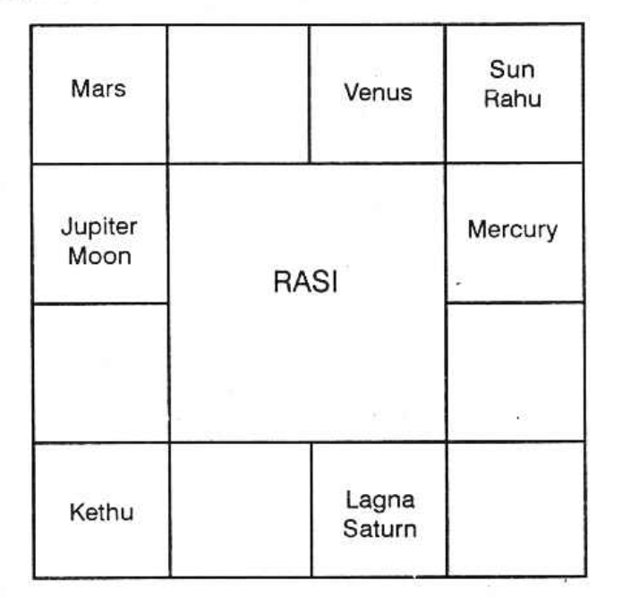
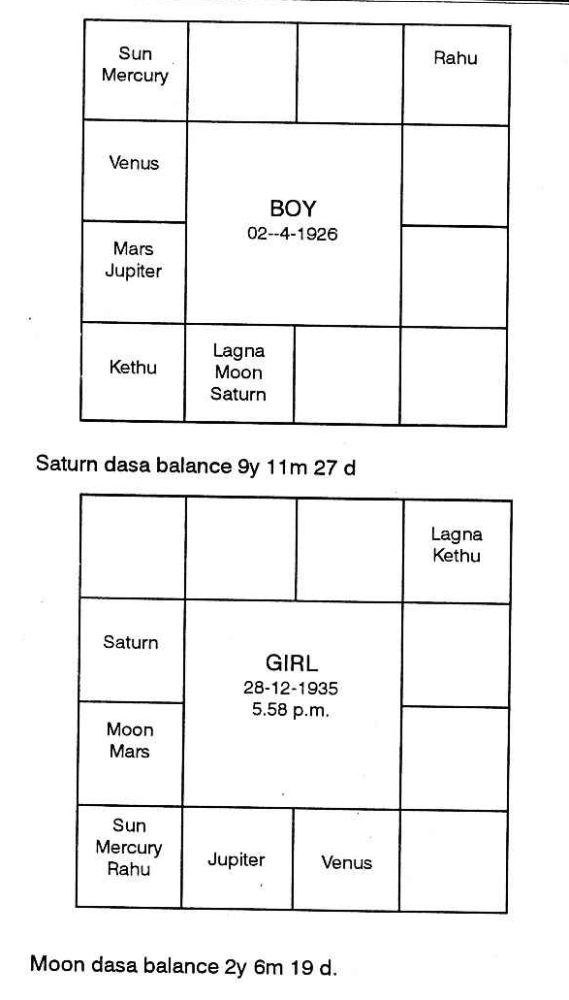
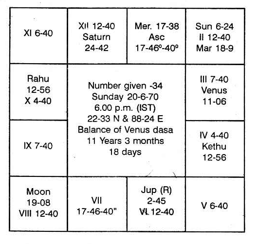
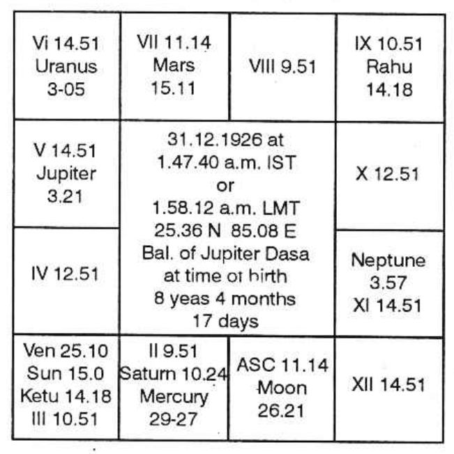
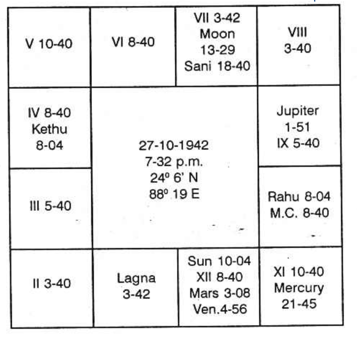

## Time of Marriage (KP)

By marriage, it is meant that one more member is added to the family which is indicated by the second house. This addition is an agreement which is denoted by the seventh house and such an additional member brings permanent tie of friendship for pleasure and progeny, shown by the eleventh house. That is why houses 2, 7 and 11 are examined to find out whether:

1. Marriage is promised or not;
2. The description of the partner, his or her ruling planets, whether already related or not; his or her features, characteristics, profession, etc.;
3. Time of marriage; and
4. State of married life;
    1. Whether it is a harmonious one promising an inseparable temperament or
    2. The couple without any attachment, simply to maintain the prestige of the family, manage to live in the same premises or
    3. To lead the life like cat and rats, especially during daytime even though the couple may become the parents of many children or
    4. To be going on marrying and divorcing.

### Marriage is promised or not?
Marriage is celebrated in youth or in proper age if (according to Hindu system):

1. Moon and Venus occupy fruitful signs. Taurus-Rishaba, Cancer-Kataka, Scorpio-Vrischika, Pisces-Meena and also Sagittarius-Dhanus;
2. Or if the seventh cusp falls in any of these signs;
3. Or Jupiter-Guru or Venus-Sukra occupy the houses 2, 7 or 11;
4. Or Jupiter is conjoined with Moon in 1, 5, 10, 11;
5. Or Venus is conjoined with Moon in 1, 5, 10 or 11;
6. And Moon as well as Venus is not-aspected by Saturn but is stronger than Saturn;
7. Or lord of Lagna is conjoined with lord of 7 and occupies a favourable house;
8. Or lord of Lagna and lord of 7 are in 3 and 11 or 5 and 9 to each other;
9. Or benefics occupy 2 or 7 or 11 counted from Lagna and Moon sign;
10. Or the houses 2 or 7 or 11 have favourable connections with benefics;
11. Or benefic in 7 and both lord of Lagna and lord of 7 are strong and well posited;
12. Or Venus is in his own or exalted sign and lord of 7 in beneficial house;
13. Or Mercury in 7 and Venus conjoined with lord of 7;
14. Or lord of 7 is in 11 and Venus in 2;
15. Or Venus is in Lagna and Lord of Lagna is in 7;
16. Or if there is mutual exchange between lords of 1 and 7 when it is termed as Madhana Gopalyoga;
17. Or Jupiter is strong in the seventh house conjoined with benefics;
18. Or Venus is strong in the seventh house;
19. Or lord of 7, Venus occupies the second house;
20. Or lord of Lagna is in 10 and lord of 2 is in 11;
21. Or benefics in 1 or 2 or 7;
22. Or lords of 2 and 11 in mutual exchange;
23. Or lord of 2 and 7 in 11;
24. Or (according to Western system) Moon and Venus occupy beneficial houses and receive harmonious aspects, in the male’s map;
25. Or Sun and Mars in bride’s chart occupy favourable houses and receive good aspects from other planets;
26. Or a benefic is transiting very close to the Ascendant or seventh Cusp at the time of birth in the twelfth house or sixth house.

If it is arranged marriage, the parents may or may not take much pains to find out the bridegroom, if it is a love marriage; then also, the couple may or may not take a long time to give expression to their love to celebrate it.

The following chart is that of a girl who got married at the age of 12; her birth was on 29-6-1926 at 19 Gathis 45 Vikathis. Balance of Mars dasa was 2 years, 10 months and 19 days. The date of marriage was 11-7-1938, on a Monday in Moolam star. She was running Rahu dasa Mercury Bhukti Moon Anthra.

The Lagna is weak as its lord is in the 8th house and the Lagna is occupied by Saturn. Moon sign is stronger as it is conjoined with the benefic, Jupiter, and the lord of the rasi is in the 9th sign in exaltation. Hence, Moon sign is stronger.

Second house is occupied by Mars. Its stars are Mrigasirisha, Chitra and Dhanishta. No planet is in Mrigasirisha, none in Chithrai, but Moon and Jupiter are in star Dhanishta. Both of them are significators, i.e. Moon and Jupiter, Mars by occupying the second house is next in strength.

11th house is occupied by Ketu. Its stars are Aswini, Makam and Moolam. No planet is found in any of these three stars.

7th house is vacant. Lord of 2 and 11 is Jupiter. Its stars are Punarvasu, Visakam and Poorvapathra. Rahu was in Punarvasu, Sani in Visaka and none in Poorvapathra. Hence, Rahu and Sani are also significators of the two. Rahu is conjoined with Sun, the lord of 7. So, Rahu has greater influence.

Sun, the lord of 7, rules Karthikai, Uthrapalguni and Uthrashada. Venus alone was in Karthikai. As Sun conjoined with Rahu gets weakened, Venus also will be offering the results of the 7th house. Hence, Moon, Jupiter, Rahu, Saturn and Ketu are the significators, Mercury in the constellation of Saturn, and aspected by Saturn, is also auspicious. It gains strength to give marriage.

Anode, conjoined with a planet gives the results of the planet. As Sun rules the 7th house, Rahu is to bless her with marriage since Rahu is conjoined with Sun. Further, it is under the sway of Jupiter, lord of 2 and 11, counted from the Moon sign. Saturn in Lagna cause delay in marriage. It can, till its period is over. Even though Budha is aspected by Sani according to Hindu method by the 10th aspect, yet they are 108° away and form good aspect. If it were to be 90°, Mercury cannot give the wedding. Being 108° away, Mercury will be helpful. To dasanatha Rahu, Mercury is, in advance, in the second house. Therefore, Rahu Dasa Mercury Bhukti was the period of marriage.

1. Moon and Jupiter in close conjunction is auspicious for early marriage;
2. Moon and Jupiter in 5th to Lagna is favourable to celebrate the marriage in youth;
3. Venus, lord of Lagna and Mars, lord of 7, are in 3rd and 11th to each other.

This horoscope is illustrated to show that very early marriage can take place, even though exalted Saturn was in the ascendant as Jupiter by its aspect to Saturn reduces its malefic results and the conjunction of Moon and Jupiter is very beneficial.

### Marriage is promised but it comes late in life:

(a) If Saturn is in 1, 3, 5, 7, or 10 counted from the Lagna or Moon sign and does not own beneficial houses; 
(b) If malefics are in the 7th Bhava, receiving adverse aspects from Jupiter or Uranus; 
(c) If Mars is in the 8th house; 
(d) If Moon and Saturn conjoin together, especially in 1, 2, 7, or 11; 
(e) If Mars and Venus are conjoined together in 5, 7, or 9 and both receive evil aspects from Jupiter or Uranus; 
(f) If the lord of 7th and Venus are aspected by Saturn; 
(g) If Moon and Venus are squared by Jupiter or Uranus. 

There will be many proposals, one after another they will fall through and years will pass. The parents and the bride will get so dejected and vexed that the bride decides to remain unmarried. But at last, a fresh negotiation will come up with a new party and the marriage will be fixed and celebrated suddenly.

The following are the charts of two individuals; one male and another female and both are to be married.

Born on 2-4-1926 Friday at 39°G, 40°V, in Anuradha star with a balance of Saturn dasa for 9 years 11 months and 27 days. Saturn is not a Rajayogathipathi, nor does he own the rasi.

In the chart of the boy:

Second house is occupied by Ketu and it delays marriage. Lords of 2nd and 11th are in debilitation. Venus, lord of 7th, in 4th will offer the marriage. Moon and Jupiter forming favourable aspect, will on a later date settle a family life on you. Saturn dasa balance 9y 11m 27d. Moon dasa balance 2y 6m 19d. Hence, Venus Dasa, Moon Bhukti, Jupiter Anthra will give the marriage at the end of January 1965 itself.

In the girl's horoscope:

(a) Evil node in 7th shows delay (Rahu); 
(b) Mars in 8th shows hindrances and obstacles; 
(c) Saturn aspects the 11th house; 
(d) Moon in Capricorn is afflicted by Saturn, the relative position between the two being 22 1/2 degrees. 

The above are the indications showing that the marriage will be accomplished with great difficulty. The time of marriage will be during Jupiter Dasa, Jupiter Bhukti, Rahu Anthra on or around 14th July, 1965. Actually the marriage was fixed in June and celebrated on 14-7-1965.

### Longevity of Partnership

A gentleman who is the partner of a firm asked the longevity of his partnership. The relationship with partners were going from bad to worse day by day. The querist gave Number 34 and the Chart was prepared as follows:

Moon indicates the position of mind. She is in 2nd from 7th Bhava in the Star of Venus and in the sub of Rahu. Venus is the Asc. Sign lord and Rahu is posited in 10th in his own star and in Mercury sub. 1st Cusp is in Moon star and in Mercury sub. Chandra star Lord Venus is in Moon sign, Saturn star and Moon sub. 7th Cusp falls in Mercury star and sub, so the query is related to himself for business partnership and its longevity.

For partnership 7th Bhava is to be judged and for its longevity the Maraka and Bhadhakasthana of 7th are to be judged. 7th cusp falls in Scorpio which is a fixed sign. So 9th from it is the Bhadhakasthana for it. It is 3rd from the Asc and falls under Cancer sign, Saturn star and Ketu sub. The Maraka Sthanas are in Sagittarius and Taurus signs in Ketu star, Mercury sub and Moon Star, Mercury sub respectively. Let us judge each House separately.

Bhadhakasthana is under Cancer sign, Saturn star and Ketu sub, Venus is posited there. Moon and Saturn are in Venus stars and hence they are the strong significators of this Bhava. Besides these, Venus is also the significator of this Bhava.

2nd Bhava from 7th is under Sagittarius sign. Ketu star and Mercury sub. Moon is posited there and Mercury, the only planet in her star, is the strong Significator of the Bhava. Moon is the second grade significator and Jupiter being the sign lord is the 3rd grade significator of this Bhava. Second Marakasthana is in Taurus sign, Moon star and Mercury sub. Sun is posited there. No planet is in Sun star. Hence it is the strong significator of this Bhava. Moon and Saturn are the 2nd grade significators being in the star of Venus who is the sign lord of this Bhava. Rahu and Ketu are also the Significators of these Houses. Hence Moon, Saturn, Venus, Mercury, Jupiter, Sun, Rahu and Ketu are the significators of Bhadhakasthana and Marakasthanas. To select the few strongest and to eliminate the rest, Prof. K. S. K. suggests to see the Ruling Planets at the time of Judgement and these are as follows:

- Saturn - Day-lord for Saturday
- Venus - Moon Star 
- Jupiter - Moon Rasi Lord and Asc Lord
- Rahu - Lagna Star Lord.

Now he is running Venus Dasa, Rahu Bhukti and Mercury Anthra. Now I was disturbed by some visitors and the work had to be stopped. Again on 26-6-1970 Friday at 5.30 PM. the Judgement was considered. The ruling planets were as follows:

- Venus = Daylord
- Saturn - Moon star Lord 
- Jupiter Moon Rasi Lord 
- Mars = Asc. Lord 
- Mercury - Asc. Star Lord

On 13-8-1970 he will run Venus Dasa Rahu Bhukti Mercury Anthra and Saturn Sookshma till 8-9-1970 and this period favours the desolation of Partnership.

Here Anthara Lord Mercury is very important as it is the sub-lord of 11th Cusp from Asc. as well as for seventh. Besides this Mercury is also the sub-lord of Asc., 2nd, 5th, 6th, 7th, 8th, 41st and 12th Cusps. Nodes are in the sub of Mercury. So Mercury being the chief among the Karaka Planets of Business, promises for the desolation of Partnership, but besides this it also promises that the querist will not close the firm out right and he will do his business under the same name and style by making another partnership deed and this event will happen between 13-8-1970 to 8-9-1970. Now let us check the transit period and see whether it tallies with ruling planets or not. Mercury will be retrograde on 31st August, and hence she will contribute the results before 31st August.

In transit on 28th August Friday, Sun will be in Ketu star and Mercury sub. Moon will be in Saturn star, Saturn sub and in own sign. Dasanath Venus will be in Mars star, Jupiter sub and Mercury sign. Bhuktinath Rahu will be in his own star, own sub and in Saturn sign. Antharanath Mercury will be Sun star, Saturn sub and in own sign having a rapt conjunction with Sun who is deputised by Ketu. Sookshmanath Saturn will be in Mars sign, Sun star and Rahu sub. Thus the transit agrees with the fructification of results.

### Letter to the Editor

Respected Sir,

These days I am reading your “Krishnamurti Padhdhati”. Really, as much as I read it, so much I am being impressed by your profound knowledge in Astrology. Truly speaking, you are an incarnation of some great Maharishi. Your magazine “Astrology & Athrishta” is unparalleled. You and your method are unique, original and great. Really you are proud of Mother India. I find no words to thank you for writing a great book like “Krishnamurti Padhdhati” which would prove to be a unique work and make your name ever shining in golden words in the world of Astrology. Please accept my humble respects.

Yours Devotee,

(Sd.) B.M. Sharma, M.Sc.,
Indore.
---
Name: P.K. Rangachari
Profession: Doctor

I must acknowledge Mr. Krishnamurti’s remarkable accurate predictions based on my horoscope. He had told me that I would be in a foreign country from the 15th August, 1968. At the time of my consulting him, my chances of going abroad were far remote. But it so happened that as he had predicted, I left Delhi and touched Teheran on the morning of 15th August 1968. This appears to me quite remarkable.

P.K. Rangachari
419th Aug.’68
University of Alberta
Edmonton, Canada
---
Learned Dear Sir,

Excuse the delay in conveying my thanks. As predicted by you, I started only on the 16th May from Nagapattinam. Even though the ship was due to start on 15th and I boarded the ship on the 15th, the ship started only on 16th owing to delay in loading cargo. I came here on 21-5-68. People here have come to know that I am an astrologer and want to consult me.

(Sd.) V.S. Mani
C/o A. Ramiah
1869 Thana List, Bukit Martayam
P.M. Central Malaysia.
---
From

S.C. Deb, B.A., C.A., L.I.N., A.C.L.S. (Lond.)
Chartered Secretary, Calcutta

To

Jyotish Marthand K.S. Krishnamurti
12 Brahmin Street
Saidapet, Madras-15.

Dear Sir,

Last year you predicted that my friend Sri Sukumar Bhattacharjee, one of the officials in Labour Bengal, would proceed to a foreign country on the 15th April 1968 and I am delighted to inform you that he left Calcutta, for Canada on the same day as predicted by you. I received his first letter today.

While I was talking to another officer of the same department, he said that you predicted to him that he would visit many countries in 1967 and actually he went, as predicted by you. The only comment I dare make is that you are wonderful and how accurate your predictions are.

Thanking you,

Yours faithfully,

S.C. Deb.

---

Dr. T.T. Padmanabha Rao
Lecturer in Chemistry
5/953-Krishanpura
Hanamkonda
Warrangal

Shri Pujya Krishnamurti Garu,

Namasthe!

I am happy to inform you that I have been selected for West German Scholarship and the schedule of journey is on 9th June 00:20. I am happy to inform you that what you predicted for me, when you came to our college recently, came true. I request I may have your guidance in my path.

Thank you,

Yours faithfully,

T.V. Padmanabah Rao
11-4-68.

## Overseas — Example

It is quite a unique feature of Krishnamurti Padhdhati that the Nirayana cusps are considered in quite a different way from the old traditional system. The way Mr. Krishnamurti attaches importance to the constellations and subs of different cusps and their proper application to any particular chart is really marvelous. He is quite right to say that the cusps denote exclusively the indications of Bhavas reflected for the native. This is scientific and appealing to any intelligent mind. In case of twins or children born in near proximity of time, what is that which changes? All the planets and their degree positions remain almost the same. It is only the cusp and the cusp alone, which changes so rapidly with the lapse of the most minimum period of time. Hence cusps must be given their due importance in analysis of any chart.

At times, when the analysis of Bhavas does not point out a particular planet as a significator or wherever there is some confusion in regard to selection of significators for a particular point in consideration, the cusps alone come to our rescue and solve our problem. Now the principle to be commonly applied is very simple.

Mark where a particular cusp lies, what is its constellation and what is its sub. Further mark whether any planet is posited in the constellation of the constellation lord of the cusp. If so, take the planet as a significator. If no planet is posited in its constellation, consider that very planet alone. Similarly mark who is the sub lord of a particular cusp. Further notice whether any planet is posited in its constellation. If so, that planet will be a very strong significator, because according to K.P; it is the sub and sub alone which decides a particular matter.

In this article, it has been my sincere endeavour to highlight this consideration.

### Astrological Analysis

This chart is to be studied from the point of view of foreign travel or overseas. Let us first of all know the principle according to K.P for this consideration. “One will have the opportunity to go overseas only when the 12th Cusp sublord is a significator of house 3 or 9 or 12 and the event would take place during the conjoined periods of the significators of houses 3, 9 & 12.”

In the above chart, the 12th cusp sub lord is Jupiter and he is a significator of 3rd house (by ownership of the house). Hence this native has got the opportunity to go overseas. Let us find out the time of event.

Consider houses 3, 9 and 12. 3rd house is occupied by Kethu, Sun & Venus. No planet is in the constellations of Kethu & Sun. Kethu, Sun, Venus and Mars are in the constellations ruled by Venus. Jupiter is owner of 3 and no planet is in its star. So Kethu, Sun, Venus & Mars and Jupiter are the significators of 3.

9th House is occupied by Rahu. Rahu alone is tenanted in its own star. Owner of 9th house is Mercury. Only Mercury is in its own star, So Rahu & Mercury are the significators of 9th house.

12th house is occupied by none-Mercury is the owner, in its own star. Hence the significators of houses 3, 9 & 12 according to the above analysis are Kethu, Sun, Venus, Mars, Jupiter, Rahu & Mercury. The nodes are stronger than the planets. Here Kethu is conjoined with Sun & Venus and also in the houses of Jupiter. So Kethu is stronger and can be substituted for Venus, Sun & Jupiter. So also Rahu for Mercury. Hence the strong significators are Kethu, Rahu and Mars.

Actually, the native left for UK on 3.10.1951 during Saturn dasa, Rahu bhukti, Mars antara and Saturn shodashamsha. The day is ruled by Mercury, Moon's sign is Libra, ruled by Venus, Moon's star is Swathi, ruled by Rahu.

It may be slightly surprising to note that Saturn has come as dasa lord as well as shodashamsha lord, at the time of fructification of the event because he is not finding a place as one of the strong significators during our analysis of houses 3, 9 & 12. Though he qualifies himself as one of the significators, by virtue of being aspected by Mars and also conjoined with Mercury but it is only feeble.

Please note that Saturn is the sublord of 3rd and 9th cusp and no planet is tenanted in his star except himself. So as mentioned in the beginning of this article, Saturn has emerged as a strong significator in the above case, by owning the sub of relevant cusps and not from analysis of bhavas. Thus the importance of cuspal sublord is portrayed through this example.

## Scholarship for Higher Studies
Higher studies is indicated by the 9th house. During the period or subperiod of the significator of the 9th house, one will pursue studies further.
Stay in a foreign country is to be judged from the 12th house for further studies in the 9th house and for job in the 6th and 10th houses.
Scholarship is a non-refundable loan with a string attached to it. Hence judge the 6th and 11th houses.

Horoscope is as follows:

- Moon Dasa balance years 9-11-7 days.
- Jupiter Dasa Saturn Bhukti is from 16-5-1967 to 28-11-1969.
- 9th cusp is at 20° 39' Capricorn-Nirayana. It is in Moon star and Venus sub. 
- Moon is the lord of 3rd house. It alone is in its constellation, and own sub. It shows one’s inclination. 
- Sub lord of 9th cusp is Venus. It is in 11th house. It is in its own constellation. It shows fulfilment of one’s desire and success in efforts. Therefore you will have higher studies. 
- There is no planet in 9th house. Saturn is the owner. Mars is in Saturn star, Mars is the significator of 9th house. Rahu is to act as an agent of Mars. So, long journey and higher studies are shown by Saturn and Mars.
- 12th house shows life in a foreign place. Jupiter is in 12th house. No planet is in Jupiter star. Hence Jupiter will give life in a foreign place.
- 6th house is unoccupied. It is owned by Venus. Kethu represents Venus. Sun and Rahu are in Kethu star, Saturn is in Venus star.
- 11th house is occupied by a majority of planets. Of them, Rahu is the strongest. It is in the sub of Saturn. Hence Rahu will offer the result of taking loan - 6th house matter.
- Rahu and Kethu give 6th and 11th house results. Both will contribute for scholarship. Therefore Jupiter Dasa Saturn Bhukti Rahu Anthra Kethu Shookshma gives scholarship, long journey, life in a foreign place, higher studies, etc. It will be around 24-5-1969.
- Transit: Saturn, lord of 9th house conjoins lord of 4th house Sun. Jupiter will be stationary and take direct course in the constellation of Moon indicating 3rd house for short journey and leaving one’s permanent place of residence.

## Higher Studies in Foreign Country

The horoscope is as follows:

Moon Dasa balance 7 years 4 months 20 days.

For high school and college studies which need regular attendance to learn the subjects by hearing the lectures from the beginning to the end, one is to judge the houses 4 and 11. If one has to work himself, do research, submit thesis etc., or if one is to leave his native place, remain in a hostel in the foreign land, leaving his kith and kin and enjoying new surroundings and environments, one is to judge the houses 9 and 12 and to come out successful. The house significator should also be the significator of either 9th or 12th house, or both.

Here, lagna is 3° 42' Scorpio. 9th house extends from 5° 40' Cancer to 8° 40' Leo. Occupant is stronger than owner. According to K.P., occupant of a constellation is stronger than the lord of the constellation. Constellation is stronger than the sign. Occupant of a sign is stronger than the lord of the sign. Planets conjoined with or aspected by a planet gains the strength to offer those results which those planets signify. Thus, a planet becomes the significator of a few matters. The source of the result is shown clearly by the bhava-house occupied by the planet and the house or houses which it owns (owner of a house means owner of the sign where the cusp or cusps of a bhava or bhavas fall).

Rahu is the occupant of the 9th bhava. Its constellations are Arudhra, Swathi and Sathabisha. Sun and Kethu are in Rahu's star. Moon is the lord of the sign where 9th cusp falls. Rohini, Hastham and Sravanam are governed by Moon. Moon, Sani and Mercury are in Moon's star.

When so many planets indicate a result, it means that they are connected with this 9th house result. If they happen to be the significator of 7th house also, it means it is the 11th to the 9th. 9th house indicates the father of the native; hence the 7th house, which is the 11th to 9th, indicates success in father's attempts, cure from the disease and realization of his ambition, other than what it denotes the native, i.e. to have a partner in life or to enter into a contract with another. Moon is in 7th. It is in its own constellation. So Moon indicates 9th and 7th house matters. Saturn is in 7th, Saturn is in Moon's star which occupies 7th house. So Saturn presages matters signified by 7th and also the 9th house.

Therefore, during Moon and Saturn sub-periods, not only the native will enjoy 7th and 9th house matters, but the native's father will achieve his aim.

As regards overseas, judge the house 12th as it promises separation from family, living in new surroundings and environments. 12th house extends from 8° 40' Libra to 3° 40' Scorpio. Sun is deposited in the 12th house.

Now one should remember that in everybody's horoscope there are the houses 3, 9 and 12. There must be few significators of 3, 9 and 12 at least two. Why? Any one planet may own the houses 3 and 12 or 9 and 12 and the other can own the third house. These two planets may not have any planet in their constellations and also no planet in these 3 bhavas. Then only these two planets will be the owners and significators. When every individual has got at least 2 planets, why should not everybody make long journeys, go overseas and stay in the foreign land during their conjoined periods and sub-periods.

Majority do not go overseas. Simply to satisfy themselves, just like what I did when I was very young, they can take a big world map, spread it on the ground. Then stand where Africa is shown. Say, “I am in Africa.” Take away the footsteps, keep them in Australia. Map and say “I am now in Australia.” Lift your legs and keep where America is drawn. Say “I am now in America.” That is all. But the surrounding and environments remain the same. One can go only when the sub-lord of the 12th cusp is connected in any manner with 3rd or 9th house; preferably 9th house.

In this chart, 12th cusp is in 8° 40' in Libra. The constellation is ruled by Rahu; the sub is also governed by Rahu. Rahu is in the 9th bhava. If he would have been born one minute later, the sub-lord will be Jupiter who is in the 8th bhava (in his own constellation) which is Vyaya to the 9th house, in which case he cannot go overseas. If twins are born, one with Rahu as the sub-lord of the 12th house cusp and the other twin with the sub-lord of the 12th cusp as Jupiter, then even though:

1. The planets are in the same bhava
2. Dasa and Bhukti same
3. Ashtaka Varga same
4. Gochara same

One enjoys and the other is disappointed. When two people have the same chart with less than 2° differences in lagna position one is able to differentiate by applying K.P. As Rahu is the lord of the sub of the 12th cusp, this native will and must live in a foreign place. When Rahu is the occupant of the 9th house in the constellation of Kethu in 3rd it is connected with land journeys, and long journeys. Hence this native has got the opportunity to go overseas.

Now comes the question of finding out the time of event. It will be Rahu Dasa, Moon Bhukti, Saturn Anthra. Consider the ruling planets at the moment of judgement. Today it is Thursday. It is ruled by Jupiter. As anode — Rahu — representative Jupiter by occupying his sign, take Rahu Dasa. Now the lagna that is rising in the East is 12° 30'. It is Saturn's sign and Moon constellation as the time is 6:51 a.m. on Thursday 23-1-1969 at Madras. Hence Rahu acting as an agent of Jupiter, Saturn and Moon are the significators (star is also Uthrapadra where Moon transits and it is Jupiter sign Saturn star). Hence he will go overseas during Rahu Dasa, Moon Bhukti, Saturn Anthra, Third week April 1973.