## Change in Job, Ninth House Explains

Letter to Author:

Dear Professor Krishnamurti,

Through the courtesy of my friend at New Delhi, you were kind enough to prepare my horoscope and predict that I will change jobs in November and move to a new location. This has come true and I have shifted.

Yours faithfully,

(Sd) Seth,
Vienna.
## Profession

In Jataka Parijata, Vaidhyanatha Dikshita says:

Count from the Lagna or from the Moon sign and note which planets occupy the 10th house. One can acquire wealth through the father if the Sun is in the 10th house. The Moon in the 10th indicates wealth through the mother; Mars shows that which he gains through a foe. Similarly, Mercury through a friend; Jupiter through a brother; Venus through a wife; Saturn through servants.

Find out the lords of the 10th house counted from the Lagna, Moon and Sun. Judge the strongest of the lords. Note in which navamsa sign the strongest of the lords of the 10th house is counted from the Lagna, Sun or Moon. Then find out who rules the navamsa sign. This lord is the indicator of the profession.

But Bhattotpala is of the opinion that one should not make a selection among the lords of the 10th house counted from the Lagna, Sun and Moon and among the occupants of the 10th house counted from the Lagna and Moon sign. All must be taken for consideration. Sage Garga holds this view and Bhattotpala supports this.

If the navamsa sign is owned by:

- Sun: medicine, wool, grass, water, grain, gold, pearls, respectable post under the government including ministers.
- Moon: dealing in things derived from water, agriculture, earth, indulging in controversial matters, apparel etc.
- Mars: metallurgy, war, robber, using fire, daring action etc.
- Mercury: arts, poetry, astrology, vedas to recite mantras for the benefit of others, priests, etc.
- Jupiter: teacher, purohit, law etc.
- Venus: gold, ruby, elephants, horses, cattle, jaggery, cooked rice, salt, curdled milk, female, etc.
- Saturn: woodcutter; carpenter, servants, etc.

Beneficial planets owning the navamsa sign occupied by the lord of the 10th house in the navamsa chart shows that the person will be beneficial to others. He will have authority. But malefic planets owning the navamsa sign indicates that the person is evil-minded or a hard task-master and he has to serve another.

If the 10th house from the Moon is occupied by:

- Sun: the person is successful in his enterprises.
- Mars: he will be wicked and rash.
- Mercury: he will be learned.
- Jupiter: he will be royal.
- Venus: he will be voluptuous.
- Saturn: he will be pessimistic.

Sun in conjunction with Mars: he will be addicted to wine and women.
Sun in conjunction with Mercury: astrology, valuable articles obtained from liquids, ladies and jewels.
Sun in conjunction with Jupiter: respected by government.
Sun in conjunction with Venus: favour from government, wife with good wealth.
Sun in conjunction with Saturn: he will be depressed and dejected.
Mars in conjunction with Mercury: he will be a scientist.
Mars in conjunction with Jupiter: he will dominate over others.
Mars in conjunction with Venus: foreign trade.
Mars in conjunction with Saturn: bold action, fearless job.
Mercury in conjunction with Jupiter: he will be famous and favoured by government.
Mercury in conjunction with Venus: he will be learned and will earn wealth.
Mercury in conjunction with Saturn: he will be a copyist, dirty job.
Jupiter in conjunction with Venus: he will be helpful to good-natured people, respected by government and learned.
Jupiter in conjunction with Saturn: mischief monger, promoter of quarrels.
Venus in conjunction with Saturn: he will manufacture fragrant powder, cosmetics, will practise medicine and do business.

If Mars and the lord of the 4th house are in the 1st, 4th, 5th, 7th, 9th, 10th or 11th house and if the lord of the 10th house is conjoined with or aspected by Venus and the Moon, the person will have cattle and will attend to agriculture.

Thus, an idea is given by Vaidhyanatha Dikshita in Jataka Parijata.
Let us refer to Mantreswara's Phala Deepika. He also advocates noting the lord of the navamsa occupied by the strongest of the planets owning the 10th house counted from the Lagna, Moon, and Sun. If the lord were to be:

1. Sun: Fruit trees, mantras, by fraudulent action or by gambling, by speaking untruth, dealing in wool, medicine, metals, government service, or service under some noble person.
2. Moon: Business, pearls, corals, agriculture, cattle, farming, pilgrimage, serving a damsel, textiles.
3. Mars: Metals, military service, cooking, agriculture, gold, troubling or black-mailing others, weapons, bold actions, wicked company, spy, thief.
4. Mercury: Poet, reader, clerk, magician, astrologer, vedanthi, priest, etc.
5. Jupiter: Favour from good people, government service, reciting mantras and Puranas, studying sastras, money-lending, law.
6. Venus: Women, cows, buffaloes, elephants, horse, dance, silver, scents, silk, milk, jewels, aid de-camp, kavi.
7. Saturn: Fruits, labour, serving with low morality, bad grains, cooly, dirty jobs, sculpture, carpenter, butcher, etc.

The place of acquiring wealth is indicated by the sign representing the 10th house or the navamsa sign occupied by the ruler of the 10th house. A person can make money in his own place if the 10th sign is occupied by its owner or at least aspected by him. If the lord of the 10th rasi occupies in Navamsa a fixed sign, he earns in his own place. If this navamsa sign receives aspect from planets other than the owner, the native will earn money in a foreign place.

If we take a twin birth, we find one looks after agriculture and remains in the village, whereas the other roams about and, like a rolling stone, does a variety of service and never stays in one place. Take another twin birth where the Lagna, the position of Sun and Moon should be the same for both. The lord of the 10th house would also be the same. The Navamsa sign occupied by it would also be the same. Yet, one is a very famous medical practitioner remaining in his own residence and making money, whereas the other twin brother is an advocate, an orator, a vice chancellor, an educationist, and an industrialist moving from one place to another and earning in all places which he visits and wherever he stays.

Let us take another twin birth at Delhi. One is a government official and the other is a speculative businessman. Suppose the parents of the twins show both the horoscopes, how will you predict:

1. In which college—medical, engineering, arts, or technical—they will get admission?
2. Which profession they will have?

Mind you, there is no choice for the individual. Planets portray. They promise whatever they presage. That alone will happen. When one is doubtful because he himself is not sure of anything, one may offer advice and say that he may study medicine. But if the boy is keen, he may join engineering; if he does not like either, put him in arts college. But if you follow the principles propounded by Krishnamurti, you can predict only that which is to happen. Elimination is easy. Fixation is simple. Rules are very clear. Result is correct. No laborious calculation for days is needed on one horoscope. It is after all a matter of a few minutes.
- Krishnamurti Padhadhati
Let me state very briefly the combinations etc. to fix a profession. It will give the readers an idea about the method.

1. Study what each sign indicates e.g.
Aries: Police, Defence, Military, Industry, Land Brick kiln, Soldiers, Surgeons, Chemists, those who deal in metals, iron, steel, etc., butchers, barbers, cooks, those who use sharp instruments, etc. (These details are available to the student in the first Reader).

2. Understand what each planet denotes, as for instance:
- Jupiter: Law, administration, religion, finance, education, physician, judge, political career, production, expansion.
- Venus: Music, art, paint, poet, actor, union, flower, scent, silk, milk, embroidery, fancy articles, costly ones, jewels, etc.
- Saturn: Land, property, mine, coal, lead, jail, cremation, burial ground, digger, watchman, cooly, etc. (The details are available to the students in the first Reader).

3. Now combine the Rasi and the planet. Aries-Mesha is ruled by Mars. In it there are 2 stars. First is Aswini, ruled by Ketu. The second is Bharani governed by Venus. The third is Karthikai, lord of which is Sun. Hence, according to Krishnamurti Padhdhati suppose the meridian falls between 20° 6’ 40” and 21° 53’ 20” then this area is in the sign Aries owned by Mars, in the star Bharani governed by Venus and the sub ruled by Jupiter. Therefore Mars, Venus and Jupiter indicate his profession.

Suppose one is born with the meridian between 21° 53’ 20” and 24° 0’ in Aries, then Mars rules the sign, Venus the star and Saturn the sub. To note the position of meridian and the lords of the sign, star and sub will not take even a minute. You can invariably find that people working in Animal Husbandry or as a Judge will have some connection between Mars, Venus and Jupiter. Why? Venus and Mars indicate kama and strength and will to unite. Jupiter is the chief governor for progeny. So he will have something to do with Animal Husbandry or work as a veterinary doctor also. Mars indicates authority and power; Jupiter, law and Venus, assessment, Judgement, balancing the merits and demerits of the case. So he can be a Judge. But if the meridian is in the sub of Saturn, Mars-Venus-Saturn show that he works in a slaughter house or deals in skins and hides or manufactures shoes, etc. Why? Mars and Venus indicate “animals”. Saturn is called ‘yama’ the chief governor for slaughter. So he may work in a slaughter-house. Or Venus is for ‘Thejas’-skin (beauty), Saturn denotes the dead, Mars shows industry; an industry dealing in skins and hides.

Hence every point in the zodiac indicates a profession. 21° in Mesha-Aries shows Animal Husbandry. 22 in Mesha-Aries indicates slaughter house. When a twin is born, having their meridian in this manner it may appear funny when one is told that one of the twins would breed cattle while the other destroy them. Consider well! For both, the Lagna is the same. The positions of planets etc. do not change in the interval of 5 minutes between the time of birth of one child and the other. But look at the results.

After fixing the meridian, consider in which position the significator of profession is. Suppose Sun is in 21° Aries, then he serves in a place where there is security of service as Sun is to give a steady life; it indicates maximum labour and minimum wages. He may be a Veterinary Surgeon. If Moon is in 21° Aries, then the light of Moon is modified by Mars, Venus and Jupiter. Therefore he may be a captain of a ship, as Moon indicates ocean, Venus the vehicle, Mars, to handle with authority and power, Jupiter to manage and administer. Or one who supplies water to animals. If Mercury is in 21°, Aries, the combination is Mercury, Mars, Venus and Jupiter, when he may be a building contractor, Sanitary Engineer or an Accountant or Clerk in Animal Husbandry or a Law Court-Selection of any of these depends on the strength of a planet. Thus one is to take into consideration:

- Which planet signifies one’s profession;
- In which sign, star and sub it is;
- With which planet it is conjoined; or
- By which planet it is aspected.

Above all, note the dasa and Bhukti running. Never miss to find the position of the Dasa lord and Bhukti lord. A person may be a teacher to start with, during Jupiter Bhukti. Then he may be a legal adviser in a company dealing with labour during Saturn, Mercury and Ketu, sub periods. Later he can be taken as a Public Prosecutor in Venus sub period. Therefore, the sub periods indicate the changes and one should be careful while passing a judgement.

Further one should apply the mind and select the correct profession. As Aries represents the profession of a surgeon, a barber, butcher etc. can any one be merely following the tradition, simply repeat and recite the Sloka? Every one should know that a barber removes the hair (indicated by Saturn) bring back beauty (by Venus) using sharp instrument (Mars). A butcher is to kill (Saturn stronger than Venus) an animal (Venus) using a sharp instrument (Mars). A surgeon who is allowed to cut open the body, is expected not to kill the patient, but try to end his troubles and not his life. So a Surgeon should have Sun (for medical-Dhanvantry), and Mars (to use sharp instrument). Therefore the area of the sub of Sun in Aswini star or Bharani star and Karthik star in Aries indicates surgeons. The sub of Saturn in Aswini or Bharani indicates butcher. The sub of Venus denotes a barber. See, how clear and convincing it is.
- Profession (Combination of Planets)

The nature of profession has to be judged by taking into consideration the strongest significator which promises entry into service or indicates independent business or adding something more to the existing business. Extensive research has been conducted by the intelligent students of the Modern Astrological Research Institute, Madras, and it has been found possible for us to lay down certain groupings or combinations of planets to determine one's profession. The classification is given in brief.
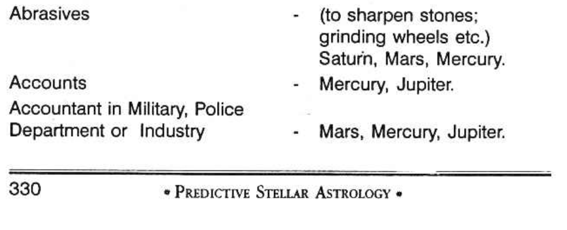
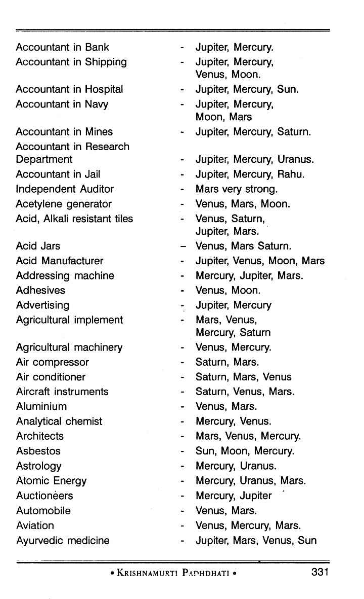
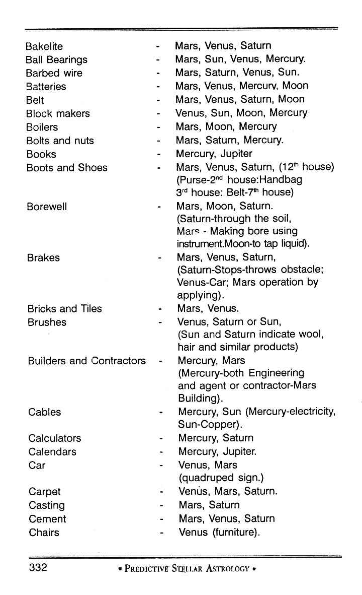
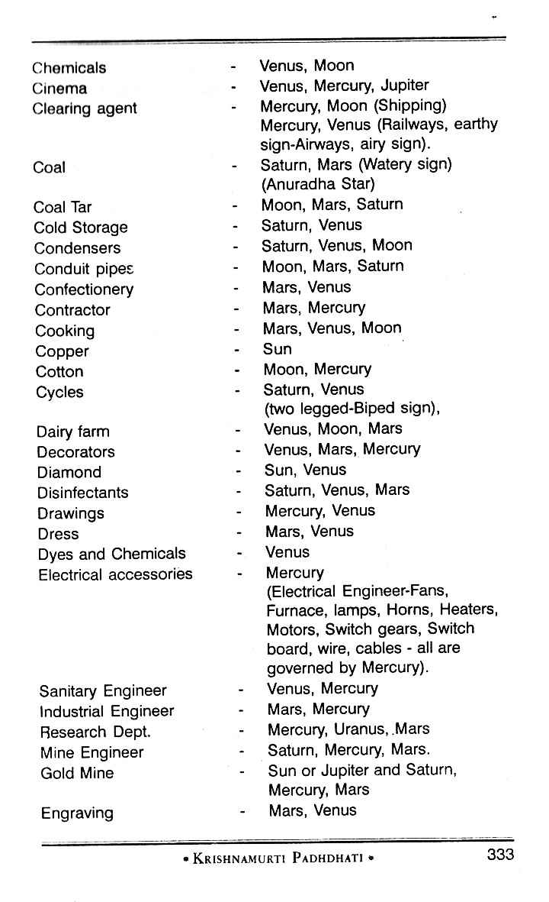
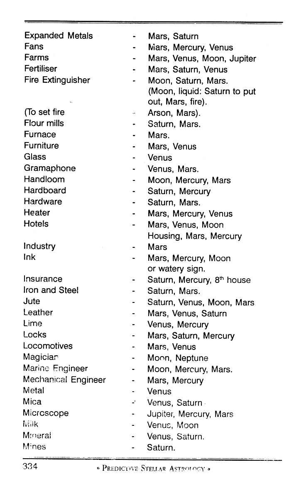
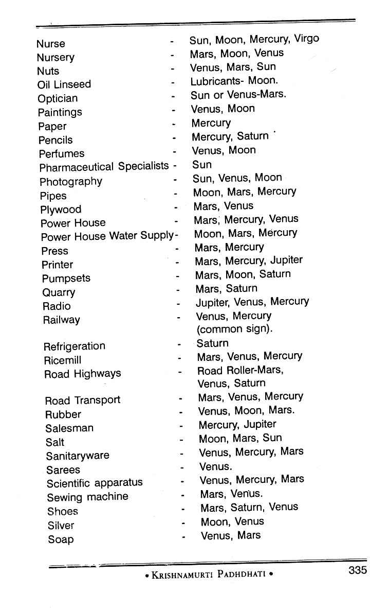
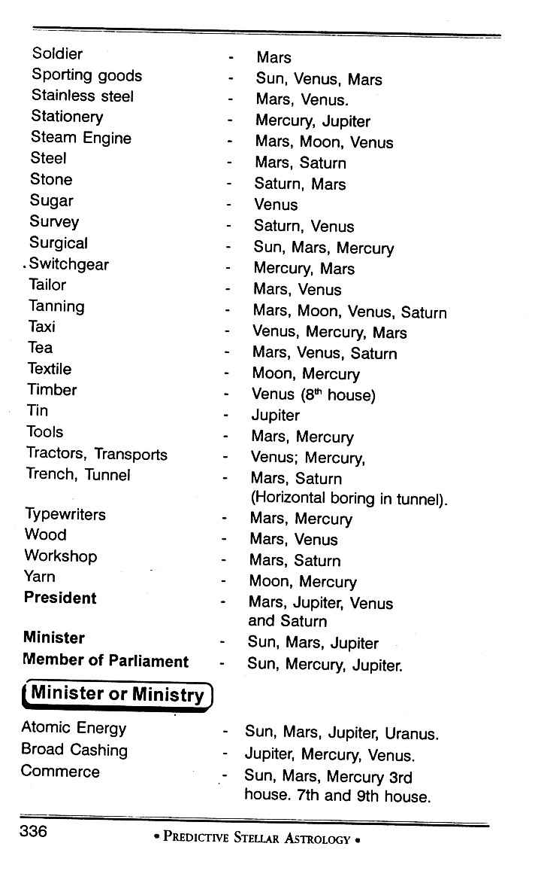
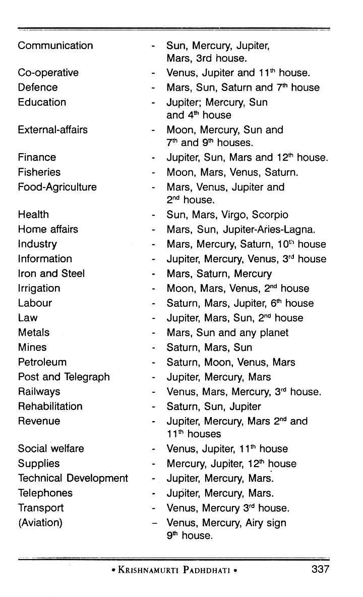
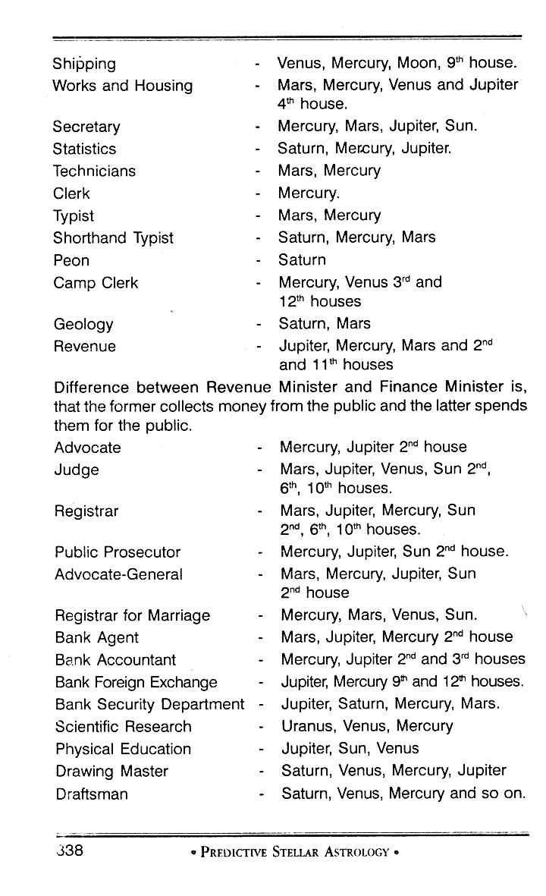

### Nature of Service

Following is the horoscope of a person born on 19th March 1937 at 6.14 PM at Madras: 

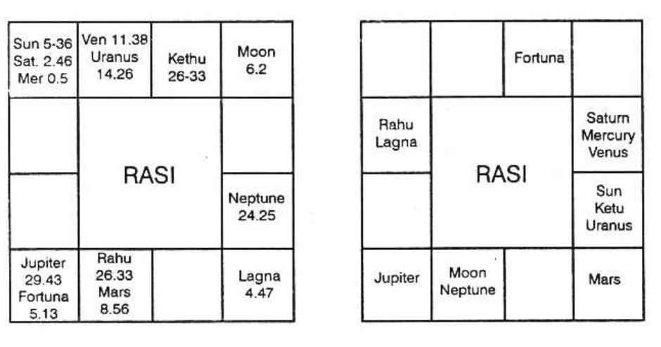

He is a surgeon practising in Bombay. Normally, when one tries to find out the profession of a person, he has to note:

1. The planet occupying the 10th house and also the lord of the 10th house
2. The Navamsa signs occupied by them
3. The lords of the Navamsa signs in which the occupant of the 10th house and the lord of the 10th house were
4. Judge the profession signified by the lords of the Navamsa signs occupied by the occupant of the 10th house and the lord of the 10th house.

This is the principle which is being generally followed but requiring correction by the application of Krishnamurti Padhdhati. According to K.P. method:

1. One should note where exactly the meridian falls
2. The lord of the sign, the star, and sub. Also take into account the planet very close to the meridian. The profession is indicated by the combination of these planets and the dasa lord in progress.

Applying Krishnamurti Padhdhati, the meridian in Gemini 5 degrees means that the sign is ruled by Mercury, the star by Mars and sub by Sun. Therefore, his profession will be indicated by Mercury, Mars and Sun. Sun and Mercury give him the intelligence, quick understanding, grasp, and because both of them were in a watery sign, correct intuition is indicated. One of the main occupations indicated by Sun is medicine. Mars is for surgery and Mercury for quick action and also correct diagnosis. Hence, from the position of the meridian, one can say that he is a surgeon.

The other alternative would be that Mars and Mercury indicate mechanical engineering, and Sun for service in the Government. Also one can predict that he may be serving in a Government Press, as Sun indicates Government, Mercury paper as communication and Mars machinery. Thus, a few avocations may be indicated by the combination of the lord of the sign, star, and sub, where he had his meridian (10th Bhava). By applying Krishnamurti Padhdhati one can minimise the alternatives and determine the exact nature as disclosed by Sub lord.

The 10th house is occupied by Moon. Moon governs the stars Rohini, Hastham, and Sravanam. No planet is found occupying any of the three stars. Therefore, Moon must be taken as one of the significators of profession. Consider what Moon can do. It is in the constellation of Mars and aspected by Mars and Jupiter (both are in their own signs and strong). Therefore, Moon is to offer the results of Mars and Jupiter. Mars and Scorpio suggest chemical or medical and Jupiter in Sun's constellation suggests medical. Mars in the constellation of Saturn and in Scorpio indicates that he will carry out post-mortem also as Saturn denotes the dead. Hence, the occupant Moon also promises that he will be a surgeon.

But if we were to apply the general principle, the lord of the 10th house is Mercury. It occupies Cancer in Navamsa which is owned by Moon. Moon is posited in the 10th house and it is in Scorpio Navamsa. Therefore, the lords of Cancer and Scorpio (Moon and Mars) indicate the profession. Normally, one cannot expect medical profession for the combination of Moon and Mars as the rule is to find the lord of the Navamsa sign and read out the profession in the traditional way.
- Length of Service
Let us examine the following chart to determine the length of service. Balance of Moon Dasaat the time of birth is 6 years, 2 months, 26 days. Self-acquisition is judged from the houses 2, 6 and 10. So one has to consider the strength of the significators in the following order:

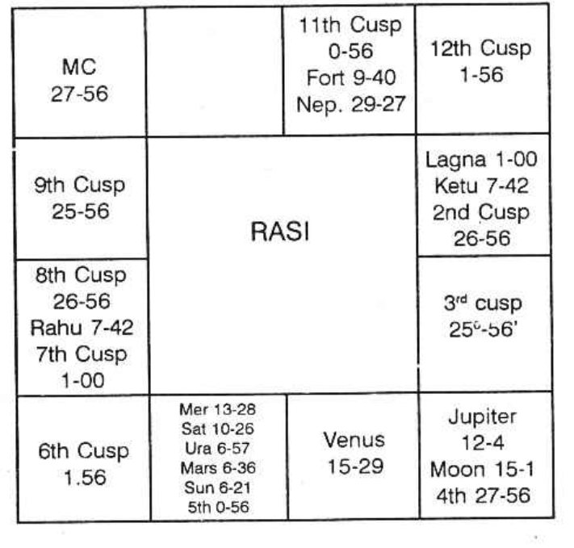

1. The planets in the constellation of the occupants of the houses 2, 6 or 10.
2. The occupant of these three houses 2, 6, or 10.
3. The planets in the constellation of the lords of the houses 2, 6 and 10.
4. The lords of these houses.
5. The planets conjoined with the significators.
6. Those receiving aspect from the significators.

Before proceeding further, it is necessary to mention clearly what a Bhava-House is, and which planet is to be taken as the lord of a Bhava-House. A house commences from the cusp of a house and ends with the succeeding cusp. The cusp of the ascendant is 1° 00’. So the Lagna commences at 1° 00’ Cancer. The next cusp falls at 26° 56’ cancer. Hence Lagna Bhava is ruled by Moon. It extends from 1° 00' to 26° 56’ in cancer. Further Moon is also the lord of the second house as the second cusp falls at 26°56’ cancer. The cusp of the 3rd house is 25°56’ in Leo. Hence the 2nd house extends from 26° 56' cancer to 25° 56’ Leo. Even though only 3°-4’ in Cancer happens to be in the second Bhava and 25° 56' is the extension of the second house in Leo owned by Sun, the lord of the second house for predicting finance, fortune etc. is Moon only.

Further, the traditional method of erecting the Bhava Chakra - Chaleeth as it is called in North India - needs some consideration as it is misleading. Suppose one’s Lagna Bhava commences at 21° in Cancer and extends up to 20° in Leo; also presume that the planet ‘A’ was in 10° Cancer, the planet ‘B’ was in 25° Cancer and the planet ‘C’ in 10° Leo. In the chart which is erected by the Hindu astrologers in Bhava-Chakra, they show the planet ‘A’ in Gemini, and planets B and C in Cancer. It is misleading.

No doubt planet ‘A’ is in the 12th Bhava. Planets B and C are in Lagna Bhava. To represent these clearly and correctly, it is advisable to follow the table as under.

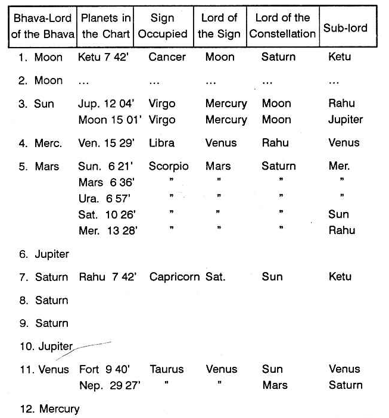

In the above horoscope, it will be seen that the second house extends from 26° 56' in Cancer to 25° 56' in Leo and the second house is owned by Moon. The sixth cusp commences from 1° 56' in Sagittarius and extends up to 1° in Capricorn and the 6th house is governed by Jupiter. The Meridian, i.e., the cusp of the 10th house falls at 27° 56' in Pisces, extends all the 30° of Aries and ends at 0° 56' Taurus and the lord of the tenth house is Jupiter.

No planet occupies any of the three houses 2, 6 or 10. Hence there is no need to note the constellation ruled by the occupants and also the planets occupying those constellations. Therefore take the planets in the constellation of the lords of 2, 6 or 10. Moon rules the second house. Jupiter governs 6 and 10. Moon's stars are Rohini, Hastha and Sravana. Moon and Jupiter alone occupy Hastha. The stars of Jupiter are Punarvasu, Visaka and Poorvapathra. There is no planet in any of the three stars. Therefore, Moon and Jupiter are the significators.

Nodes are stronger than the planets. Hence find out whether Rahu or Ketu occupies their houses or conjoin with them or receive aspects from either Moon or Jupiter. Then, they also will be the significators. Ketu is in Cancer in Moon's sign. So Ketu is stronger than Moon. Rahu receives the beneficial 5th aspect from Jupiter. Hence Rahu acquires the strength of Jupiter, other than what it has to offer, as an agent of Saturn, by occupying Capricorn owned by Saturn and also by receiving aspect (3") from Saturn.

Moon and Jupiter, the significators, are in the third house, in a common sign showing that you will be having a transferable post. Moon and Jupiter indicate Departments of Finance, Education or Politics. The third house does not show Education. Generally the fifth house indicates Politics. Third house occupied by Moon and Jupiter in Mercury’s sign indicate short tour, transfer, inspection of accounts, auditing etc. Further, the Meridian was in Jupiter's sign, Mercury star, and Saturn sub. It is clear that the native will be a journalist, correspondent or working in the department of Finance.

When was the first appointment? Find out the dasa that runs between the age of 16 and 30 to all persons, as, generally people enter service only then. This native was running Rahu Dasa from the age of 13 years 2 months and 26 days, till 31 years, 2 months and 26 days. It is found that Rahu and Ketu are the strongest significators. Hence the native ought to have entered service during Rahu Dasa, Ketu Bhukti, Ketu Anthra, or Rahu Anthra on the day when Moon was transiting in one of the 3 stars governed by Rahu, viz., Arudhra, Swathi and Sathabhisa. Actually the native joined the Finance Department during Rahu Dasa, Ketu Bhukti, Ketu Anthra on Swathi star day. Viz., 6-9-1921.

When he was running Jupiter Dasa, Saturn Bhukti, Mercury Anthra, he was selected and from Ketu Anthra promoted in 1932. For 9 months during the Bhukti ruled by Ketu in Jupiter Dasa, the native had a transfer with an additional allowance in 1936. Again during Jupiter Dasa, Venus Bhukti, Ketu Anthra the native was offered a special duty in the Central Board. During Jupiter Dasa, Sun Bhukti, Ketu Anthra, he was posted to a far off place. In 1955, the native retired once for all during Saturn Dasa, Sun Bhukti. In Saturn Dasa, Moon Bhukti, Ketu Anthra he set up practice.

What next? This native was running Mercury Dasa from 16-2-64. Mercury Bhukti ended on 13-7-66 when the very favourable Ketu Bhukti started. Popular and prosperous Venus Bhukti followed Ketu’s period for 34 months from 10-7-67. Only from 10-5-70 Sun Bhukti commences. It is Sun which will give the native the mind to take rest and give up private practice.

## Business

The main difference between business and service is that in business, there is speculation in income; it is unsteady; but in service, for honest people, not receiving bribery, the income is steady and it is once a month, a week, or daily. For dishonest people, plurality of income is shown and such a planet will have connection with Saturn, Mercury, and a dual sign.

Sun in 7 shows steady business with a little fluctuation. Moon in 7 indicates a change in the nature of business and income, most unsteady. Even the business locality will be changed now and then. Mars in 7 shows impulsive action. In auction, you may pay a fancy price and lose ultimately. Indiscreet and rash action bring loss. You will start in a flash, to end in a crash. Mercury in 7 indicates speedy turnover and larger profits. Jupiter in 7 indicates honesty, improvement, expansion, and thriving. Venus in 7 indicates good luck and popularity. Saturn in 7 is very bad for business. Uranus and Neptune in 7 are not favourable.

For partnership, judge the horoscopes of the partners for harmony, happiness, profit, luck, etc., just like it is done for marriage. Judge the 7th house. The above appears to be as advice. But one should know whether one will do business or not. Also, one should understand how the above general rule is to be applied according to Krishnamurti Padhdhati. Planets in 7 in the constellation of lords of 2, 10, and 11 show success, whereas whatever be the planet, if it is in the constellation of lord of 8 or 12, it is bad.

Will it continue in service? Or will one take up business?

An active and ambitious person who puts the above query was born at 7 PM on 15-11-1933, a Poppy Day. His chart is furnished below: At the time of birth, Ketu dasa Balance was 2 years, 11 months, and 5 days.

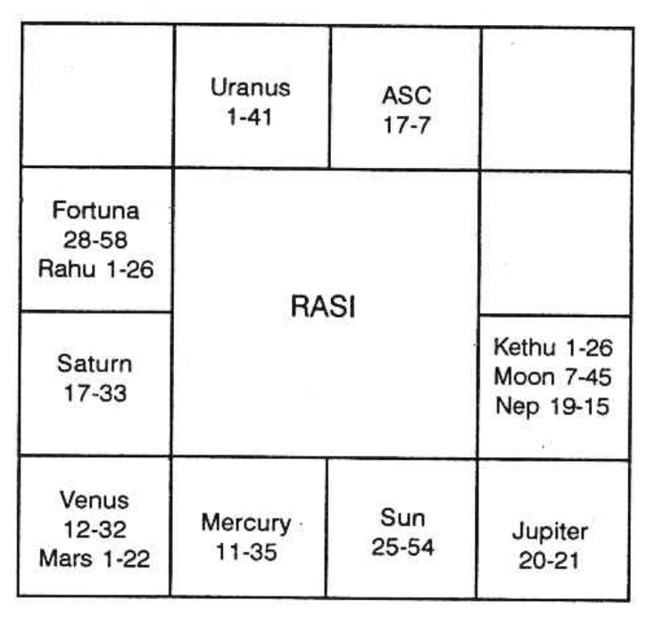

## Profession: Principle Judge

The houses 2, 6, and 10 should be judged: No planet is in 2 and 10. Mercury is in the 6th Bhava, and its stars are Ashlesha, Jyeshta, and Revathi. No planet is in any of the 3 stars, so take Mercury as the strongest significator.

The lords of 2, 6, and 10 are Mercury, Venus, and Saturn. Rahu is in Saturn's sign, so take Mercury, Venus, and Rahu as the 3 significators. 3, 9, and 12 indicate changes. Ketu and Moon, conjoined with Ketu, are in 3. Saturn is in 9 in the constellation of Moon. Therefore, Moon, Saturn, and Ketu show changes.

Mercury, Venus, and Rahu indicate that you will be attached to Sanitary Engineering or Public Health Engineering. You will be dissatisfied when Moon (a planet for changes, contemplation, planning, and scheming) dasa is on, and dissatisfied when Saturn sub period operates. At the same time, Saturn does not give courage and confidence to kick off the job, as it is in its own sign and the wavering Moon's constellation, Sravana. Jupiter, lord of 11, aspecting Saturn shows that friends and benefactors will suggest and encourage you to entertain hopes and be optimistic, especially when Jupiter Anthra rules. Immediately after Saturn Anthra, Mercury follows, which is in the constellation of Saturn. Mercury in Mars' sign gains courage, though it is in the constellation of Saturn. Moon brings about change in career, and Mercury creates chances. Mars fulfils his desire.

Therefore, during Moon Dasa, Mercury Bhukti, Moon Anthra, he will leave the service, and during Moon Dasa, Mercury Bhukti, Mars Anthra, he will start a business. Therefore, he will leave the job in April 1969 in Ashlesha or Hastha Nakshatra day. He will take up business in May 1969 when Mrigasira star second half will be transited by Moon.

Mercury, Venus, and Rahu show that he will take up contract business connected with water supply fittings. Mercury in a watery sign and in Scorpio, as the 8th sign of the Zodiac, and the 8th denotes lavatory, waste, squatting, etc. Does not the 8th house indicate in the part of the body, rectum and anus? Therefore, one should take that the 8th house denotes water-closet. Therefore, he will quit the job and do business. Mercury in 7th, in the constellation of lord of 10 and 11, is very good. Sub of Moon shows speculative income.
General Rules Followed by Westerners:

1. If the Meridian or tenth cusp falls in a fiery sign, the person is ingenious, active, learns mechanism, bold and takes ventures.
2. If the Meridian or tenth cusp falls in an airy sign, the person is likely to be involved in science, literature, agency, advising, art, reporting, or publishing.
3. If the Meridian or tenth cusp falls in a watery sign, the person is likely to be involved in liquid, spirit, shipping, or overseas.
4. If the Meridian or tenth cusp falls in an earthy sign, the person is likely to be involved in land, agriculture, building, mining, politics, or business.
5. If the Meridian or tenth cusp falls in a movable sign, the person is likely to have the ability to be a leader, pioneer, or discover something new and original.
6. If the Meridian or tenth cusp falls in a fixed sign, the person is likely to be perseverant, industrious, and involved in service or well-established concerns.
7. If the Meridian or tenth cusp falls in a common sign, the person is likely to be a broker, tour agent, or involved in public commodities.

Sri V.S. Ramaswamy, B.E., Superintending Engineer, PW.D., Parambikulam Project, Pollachi, wrote to Mr. K.S. Krishnamurti regarding a double event and uncanny prediction.

Ramaswamy consulted Krishnamurti in the first week of January 1966 regarding his promotion to the post of Superintending Engineer from Executive Engineer, and for some reason or the other the proposal was shelved. As a regular reader of Krishnamurti's magazine "Astrology and Athrishta", Ramaswamy fixed up an appointment with him and was pleased to hear that he would receive his order of promotion on 1-2-1966, which he did. Krishnamurti also predicted that Ramaswamy would take charge on 3-3-1966 on Thursday and Punarvasu star day since he was running Rahu Dasa, Guru Bhukti, which also happened.

Krishnamurti also predicted that Ramaswamy's son-in-law would get a better job on a salary of Rs.1800/- plus allowance in an Engineering firm at Bombay in Sani Dasa soon after Mars Bhukti commenced, which also happened.

Ramaswamy expressed his wonderstruck at the exactness of Krishnamurti's predictions and thanked him, saying that he was not able to express his feelings in words regarding the accuracy of the predictions. He also said that he found that none could predict the date of event so exactly, giving out satisfactory scientific explanations. He wished Krishnamurti a very long and prosperous life so that he may enrich the sublime science more and enlighten the public.
- **Profession: Principle-K.P**

In the Hindu Traditional Astrology, we take Brihat Jataka as the greatest authority and therefrom we quote and offer our predictions. Then there are various books written by various authors and also so many translations with their comments. Let me reproduce that which is mentioned in the text-book Brihat Jataka as regards the acquisition of wealth.

Count from the sign where your lagna falls or where Moon was. Find out the tenth sign counted from these two signs, if Moon is not in the lagna. If Sun occupies the 10th house counted from the lagna, sign or Moon sign then one gets wealth through father; if Moon is so deposited one gets from mother; if Mars, from foe; if Mercury from friend, if Jupiter from brother; if Venus wife; if Saturn through inferiors.

The other rule is, note the ruler of the 10th house. Also find out in which navamsa sign it is deposited and not the owner of the navamsa sign in which lord of the 10th house is situated; You should not forget to note that the 10th house that you have to count is from (a) Lagna sign, (b) Moon sign, (c) and the sign occupied by the Sun. Hence you have got three signs. So the tenth house will be three. The navamsa signs occupied by them will be three. The owners of the signs occupied by the three planets in rasi and in navamsa sign will be six. Then you should find out what the lord of the navamsa sign indicates.

If Sun indicates then one will make money by dealing in grass, gold, wool, medicine and the like. If Moon is the lord of the sign then one will gain through agriculture, pearls, fish etc. If it is Mars, metallurgy, by violent actions, like fighting etc. If Venus one makes money by dealing in gems, silver and cows and buffaloes. If Saturn, one will do tiresome work, cooly in prison, dealing with criminals, etc. Again the author emphasises saying that a person does such a work as is indicated by the owner of the navamsa sign occupied by the lord of the 10th house.

More or less in the same lines the other books written by Hindu sages give us the knowledge to ascertain one’s profession. Actually the text books are not helpful. Twins are born. One is a medical person and the other a lawyer, educationist. If we follow the tradition, you cannot answer. You must and must fail. But follow K.P and you get the real answer.
- Note the Meridian i.e., the 10" Cusp:

If the sub-lord of the Meridian is in the constellation of the planet in Aries, generally you are attached to the Army or military or Police or Fire-brigade or any such job. In the boundaries you can volunteer yourself to carry out the territorial work; otherwise you will be inclined to use the nature of Mars and metal indicated by Mars who is the lord of your sign; that is, if you will manipulate with fire and also with metal, steel. Many butchers, barbers, surgeons, chemists, gum-makers, cutlers, engine-drivers, stokers, chauffeurs, smiths, cooks and all workers using sharp instruments or using fire are governed by the sign Aries. Therefore, you would have one of these avocations.

Even though you are really one of the most able executive types, yet it is advisable that you leave the management to somebody else and you take up planning, scheming and putting through the same, because you never stop working till you get exhausted; and also you take up some other work while the previous one is half done. Therefore, you should be above the manager directing others to carry on your ideas. You should be a pioneer. Do not think that other people cannot do the work as perfectly as you can. Leave some of your work to them and try to reduce your amount of work which you think that you should do yourself personally. If by chance, you are not the head of the show but you accept a subordinate post, there will be a tendency for you either to be insubordinate or to be undiplomatic with your higher officials. If anyone would like to know your weakness then if you are given a subordinate position, your weakness will be brought to the front.

You are really a leader to plan for new business and also apply your mind to produce more or extend the existing industry. Your ability is more to contemplate, plan and scheme yourself; so leave the other work as regards administration, organisation, etc. to others. Be a pioneer. You hate to apply for any clerical post or any secretarial post. You do not like to accept any routine work which you have to carry on for long number of hours. You do not partake in any other office affairs or strike or politics. If you are appointed as secretary in a branch office, you can shine better than in any other place. You are an able worker. You grasp the work of the whole business gradually and it is sure that when time arises you will be able to run the whole show singly if needed.

A great defect in you is that while your work has been appreciated by the boss, you thereby gain the confidence and also influence. Slowly you develop such a mind to boss your boss. As an office manager you prove to be a good disciplinarian and also an able administrator. As a salesman you will never allow the customer to think for a minute but you will be going on talking so fast that the customer will be convinced and he will make purchases. No person can leave you without having some transactions with you. Any customer coming to your business shop will totally miss to buy what he wanted to, but he will be carried away by your ability. You will thrust on him those to your gains and to his satisfaction. As an advertisement agent, you will prove to be an able director. As a tailor, you will have new designs and you can command a good market. As a dealer in instrumental music, you will find successful commercial artist and painter. You will be able to perform any duty far above average and satisfy the customer. You find that work keeps you always alive as you find the pleasure therein and you never get exhausted.

You are a good mechanic, even any new machine handed over to you for repairs, will be handled by you, will set right whenever something goes wrong. You do not waste much time; you consider that there is no charm in returning an article or a tool or machinery, after delaying for a long time. You believe that speedy turnover and quick return will be most welcome to the customer; you know that it increases the number of customers. Some of you (unfortunate group) may take up an ordinary mechanic’s post or an operator's post in an industry. You may be most popular mechanic in that shop; but there can be no opportunity when your ability is recognised and appreciated by the top person. So you may not have your promotion when you expect it.

If you take up medicine or engineering or law, you will shine. It is very important that you forget about your independence, authority and superiority complex. You cannot be very blunt and straight forward but you should develop diplomacy. Neither the customer nor the executive head of the department where you serve, cannot relish such an outspoken and blunt way of dealing with people. You should know how to move with others; be patient. You should be smiling and encouraging them, otherwise you cannot be a successful businessman. If you are tactful and diplomatic, you will be the leader among the surgeons or among the advocates or the engineers.

If you take up the educational line you have got very good opportunities to show your abilities. You are best fitted to handle higher classes. You are capable of explaining things in a simple way and demonstrate to them in the most impressive manner and give enough of practical instructions. You are not fit to coach up students who are dull-witted and very slow to grasp.

If you take up independent business it is absolutely necessary to have either a partner or immediately next to you an assistant who will be offering advice, now and then and whenever you go at top speed, he will retard it. You are so ambitious and also impulsive that you want to do all the work in a very short time. Is it possible to put all the eggs in one basket at one stroke? When you select the partner in business try to choose the good natured person who is patient and persevering.

As a technician you will be very able to carry out the work in a stylish way. Even a barber can be a very capable person but his style in using the knife or the blade will threaten the customer.

As a nurse, you will attend to the child or the patient patiently for some time but if you are irritated, then you will never hesitate to retort; normally this duty does not suit you but when once you have passed this stage and you continue to be a nurse then you will be the topmost. As a housewife you should avoid to dominate and also to dictate; but cultivate modesty and whenever something is to be done, you put forth your suggestion in such a way that he thinks that the whole idea is his. This is the way how you have to get happiness through such a person who will be less strong minded than yourself. This is nothing but your tact and in a way without his knowledge, you fool him. You can have greater pleasure in this life if you prove yourself to be an excellent hostess by entertaining his higher officials and friends. Actually your independent nature and irritant temperament must vanish.

You do not find much pleasure in moving with people and you do not want to go to society and waste your time, so you will be using your leisure time on useful hobbies and in sports, to have health and peace.

When many jobs are mentioned for one sign, how to select a few and thereby be useful to the querist.
You note the sub-lord of the meridian; the lord of the constellation in which it is and the lord of the sign. Then you have three planets, i.e. the lord of the sub; its star lord and the sign lord. This combination gives a correct clue. It eliminates many and guides to select a few.

Aries: Lord is Mars. If the other two planets, i.e. lord of the sub and the constellation lord were to be:

1. Both Sun, then Government service, Defence department or surgical department.
2. Sun and Moon: i.e. either Sun or Moon is the sub-lord and the other is the lord of constellation, then Navy, Boiler feed, Steam engines, Nurse in the surgical wards.
3. Sun and Mars: One who goes to the front during war, Military; Sun and Mars connected with Jupiter, Law and order, Police. Connected with Venus also, Traffic Police.
4. Sun and Mercury: Postal, communication, telegram, telephone. If Jupiter is connected press and publicity, journalism. If Venus is also connected Radio, Mechanical Engineering, Works and Housing.
5. Sun and Jupiter: Education department. Even in Military, Military School, Law department, Judge, Religious Endowment Board, Finance department, Nationalised banks, Reserve Bank.
6. Sun and Venus: Transport, Air force, Music, Medicine, Chemical, Veterinary department; if Saturn is connected leather industry or birth control. If Jupiter is connected, animal husbandry. Saturn shows slaughter house, lethal chamber and cremation ground, burial ground.
7. Sun and Saturn: mines, metals, coal, mine ores, jailers, sextons, grave diggers, watchmen, night duty.
8. Moon and Mars: Navy, Sailors, dealing in petroleum products.
9. Moon and Mercury: interpreters, secretaries, Marine engineers, messengers.
10. Moon and Jupiter: Physicians, overseas bank, foreign exchange.
11. Moon and Venus: Painters, Milk dairy farm, Toilet makers, silk mercers, Tailors for woman, nurses, butlers, cooks.
12. Moon and Saturn: Excavation of wells, reinforcing the bund of the lakes, geologists, Petrol dealers, Oil Pumpsets, etc.
13. Mercury and Jupiter: Councilors, clergymen, advertising agents, Press, Accountants in Finance as bank.
14. Mercury and Venus: Music, Radio, Sanitary engineering, artists, automobile engineers.
15. Mercury and Saturn: Hand-writing experts, thumb impression experts, mine engineers, geologists.
16. Jupiter and Venus: Income-tax, Sales-tax, commercial-tax Judges, Law Court, Food Department. Agriculture, fertiliser.
17. Jupiter and Saturn: Philosophy department, politicians, Trustees especially for the money of the deceased.
18. Venus and Saturn: Leather, skins and hides, Slaughter house, Lethal Chamber, etc.

For Rahu and Ketu, one is to note in which constellation it is and then according to the lord of the constellation in which Rahu or Ketu were, one is to offer the prediction.
- Which profession will suit me? - K. P.

To ascertain one's profession, note whether the sub-lord of the meridian is Sun, and the Ascendant of the gentleman is Aries (for Aries-borns):

1. If Sun is the significator of the first house and it is the sub-lord of the 10th cusp, then you will gain by your own efforts and personal contacts. Your frank and outspoken nature will bring you success in your matters. You will not depend on others to act on your behalf. You will prove to be a good organiser and administrator. If you are an advocate, appear in the court of law and do not entrust the job with your juniors. If you are a surgeon, you should attend the patients personally. You understand the mind of the seniors and that of the colleagues and carry out your work efficiently and have harmony. You prefer to be independent and firm. As a doctor, you will prove to be good for treating cerebral cases, neuralgia, coma and head injuries. Avoid rash action.

2. If Sun is the significator of the second house, you will be industrious and you gain money by your work, hard work and that too for long number of hours. You will deal in cash and you can serve in a bank in the currency exchange department. You are also best suited to be an auditor or cost accountant etc. As years pass on, you will be promoted as Director. You are good in collecting the public money for any cause. Your sincere work and earnestness will be amply rewarded. You will find it to save much as you are generous and you find pleasure in social intercourse. It is good for trade and business. You will gain through investment and speculation.

3. If Sun is the significator of the third house, you can be a good journalist. You can edit and publish books; or serve in the transport department or postal or telegraph or any other “communication departments. You will prove to be a good salesman. Clearing agency for shipping, supplies to transport and traffic departments or to serve in bus, tram, railway or in any press or paper mill will be advantageous. You can rise to a good position in the university by having the goodwill of the seniors. Your relatives and neighbours will contribute for your success. As a lawyer, you can draft intelligently, contracts, agreements, notices, correspondence, etc. As a liar, you will be very clever in drafting false reports or writing anonymous letters. You can thrive as an ambassador or messenger or one to inspect the branches from the headquarters or to be a camp clerk or a tourist guide. Hence, travel, transport, sport and drama are advantageous.

4. If the sub-lord of the 10th cusp is Sun and he is also the significator of the 4th house, you are best fitted to have your residential quarters and your office in the same building. You can own boarding and lodging house or manage them. You can prove yourself to be an expert in interior decoration. You can make fortune by being the broker for buildings, lands, estates, cars, etc. Further, you can manufacture such of those materials useful to furnish the house or for kitchen purposes. You can gain through mother or her relatives and take them as partners. You can invest money on constructing living quarters as colonies, instead of building for office purpose. You can deal in real estates.

5. If the sub-lord of the 10th cusp is Sun and it is the significator of the 5th house, you can work in stock exchange or in any other speculative market; also you can work in cinema-theatres, dramatic field and other places of amusements. You also can work in family planning. As a doctor, you will specialise in paediatrics; you, as a manufacturer, produce things, toys, etc. for the use of children. As an author of books, you will be fortunate in publishing those useful for children. Also in love affairs and matters chiefly connected with every day life. As a teacher to young children, you will shine more than for adults. If Sun is strong, you can become a cinema star. You can also invest and become famous. You can become the leader of the scouts.

6. If Sun is the significator of the sixth house, you are best suited for the labour or public health department. 6th house gives the desire to serve all, especially those who are suffering from physical ailment or mental torture: You can have promotions in service if you are attached to the medical relief in any concern. In a factory, you can specialise in repairing instruments and tools and machines. You will prove to be a good agent in emigration department. In a bank, you prefer to be in the deposit department. Speculation will pay. Music, opera and cinema can be a good source of income.
If the Sun is the significator of the 7th house, you are best fitted to be a peacemaker. You are invariably fair in your dealings; you consider both sides and do justice. Therefore, you can be a judge, or you can hold the post of a public relations officer or one to mediate between two enemies or an officer for arbitration. In the government, the best position for you is the embassy. As a social worker, you can undertake to bring about marriage among couples. You can work as a marriage broker. If you are an advocate, you gain by appearing for divorce cases, or of such crimes committed on the sexual side. You can manage with all in a friendly way so that you are the friend of all. As a doctor, you gain through the other sex. One defect is that there can be loss by theft.

If the sub-lord of the 10th cusp is also the significator of the 8th house, you gain by partnership and legacy. You will have steady fortune after marriage. You work very hard and you do business using other's money. You can be an executive director. You may deal in public funds, pension papers, gratuity, bonus, taxes, etc. If you are an advocate, you will deal in estates and wills. In government service, finance and revenue departments are beneficial. As an independent person, you practice income tax and you are the best advisor. As an auditor, you can make fortune. You can deal with the money of the dead and insurance. You may attend to death duty, estate duty, etc. Do not speculate.

If the Sun is the significator of the 9th house, you are ever hopeful and charitable. You will have the desire to investigate science. As a businessman, you will make long tours and have connections with foreigners. Export, import, foreign trade and to have branches in the foreign are all advantageous. University is the best place for you. Service in religious places is also well suited. Make fortune in a foreign land. You can even permanently shift to foreign. You will reach a covetable position in any technical line of business. Branches in the foreign will give you larger profits than all the business put together in your native land. You will develop taste for fine arts, handicrafts and science.

If the Sun is the significator of the 10th house, you can manage and execute whatever you wish. You work hard for long period and realise your ambition. You can plan and put through your schemes to a great magnitude. Though you do not meet with any disappointment, you will continue to be industrious. You can have a business of your own. You can deal with foreigners. Export and import will also pay you satisfactorily. In government service, you will have your legitimate improvement in status; your claim will never be ignored. You will have advancement in your career. You can reach the topmost rung of the ladder to which you are entitled to. In politics also, you will hold a decent position commanding respect from others. In speculation or in theatrical field, you will be successful with good gains.

If the Sun is the significator of the 11th house, one can be a successful politician and businessman, as you will have lofty ambitions, desires and dignity and also many friends who are reliable and faithful and be the benefactors. Your colleagues will co-operate and they will never betray you. You can serve in clubs, societies, restaurants, lodging houses, so that you will have many opportunities to come in contact with new people and increase the number of friends. You will succeed in such a pursuit where you have to apply your mind and concentrate. You will show your inventive genius in every action of yours. You can be a legislator or ambassador or messenger or peace maker or arbitrator or a sportsman.

If the sub-lord of the 10th cusp is Sun and it is also the significator of the 12th house, then you will prefer to work singly, undisturbed in an unfrequented place. You can do your job successfully and most satisfactorily by avoiding the company of others. As an organiser, you will instruct others politely and calmly. You will prefer to serve in jails or hospitals or asylums. If you are an advocate, you furnish all points to the senior and you remain behind the scene. You will have one tuitioned by you; and let him represent you. In an army, you remain in headquarters and give instructions to the people in the war front. If you start a factory, it will be away from the town and also the industrial estate. Invest on government bonds to have steady gains than to take a risk of buying other speculative shares. Speculation causes ruins. You will find pleasure through investigation of things of mysterious or research nature. You can carry on such a work without anybody's knowledge and collect information. For secret activities, you are best fitted.

Thus, one should know the sub-lord of the 10th cusp. Then to each lagna-born, how that particular planet will behave and how its indications get changed according to the houses which it signifies. When the profession is in millions, to classify and group them into nine alone is never helpful to the querist. But in this method, you can find that there are 249 cusps and each may be ruled by any of the nine planets and each planet can be the significator of any of the 12 houses. Hence, you have 249 x 9 x 12 classifications. It comes to nearly 26,892 divisions. This is the only proper method.

One cannot commit all the 26,892 combinations. But one should understand how it is analysed and then the result arrived at. If one understands the principle, then it is easy to pinpoint.
## Independent Business

The horoscope is as follows:

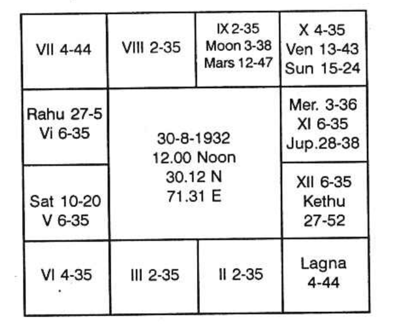

Sun dasa balance 2 years 10 months 1 day.

On 11-5-1970, Jupiter dasa has started.

For business, judge houses 2, 7, and 10. The second house shows self-acquisition. The seventh denotes customers and partners. It gives good indication about the nature of the people with whom you will have to deal; houses 6 and 7 indicate those from whom you buy; 7 and 12 denote those to whom you sell.

Further, one is to note the dasa period which one runs. Because in one period and sub period, one may be in service; in another subperiod in the same major period keep idle; in the third subperiod do business; in the next subperiod, have gains, in another lose and so on. Hence one is to note what each planet can contribute. Always consider the sublord.

Western authors say that Saturn in the 7th house is not favourable to undertake any business. But according to Krishnamurti Padhdhati, Saturn sub occupied by lord of 7 or significator of 7 is disadvantageous for a successful business. Opposition and loss in public affairs are threatened. Whether there is success or not, whether one will do business, is to be judged from the significator of 7 and the 7th cusp sublord. Mars gives one the courage to undertake. Mercury shows one’s tact, skill, ability and publicity. Venus indicates that due to his sweet smile, pleasing words and social success by being a Lion, a Rotary Club member, or Cosmopolitan Club member, or a member in any club or society, due to friendship and contact, one can be successful; if Venus is evil, it will spoil him due to such activities. Thus, for each planet according to its nature and disposition one is to judge how one can thrive or will meet with loss and failure.

Further, planets occupying earthy signs make a person businesslike and care for material welfare by doing business. If the earthy sign happens to be 12th, 5th, or 8th, and the sublord of the 7th cusp is in 5th, 8th, or 12th in the earthy sign, one loses. If the significator of the 7th house is in the sub of a planet who is either by occupying the 5th house or deposited in the constellation of a planet in 5th, 8th, or 12th, winds up business due to loss.

In this chart, 7th cusp is in 4° 44' in Pisces. It is in Saturn’s star and Saturn's sub. Further, Saturn is in earthy sign in 5th to the ascendant i.e. in 11th to 7th. No planet is in 7th. Lord of the sign in which 7th cusp falls is Jupiter. It is in the sub of Saturn in 5th. Hence business is no good to this person.

As neither the dasanath, nor the sublord is connected with Mars, this native will not have the courage to start a business. “Neither there is opportunity, nor there can be success if he does independently the business” is the promise of the planets. This person will not do business.

Since years, he wants to do business. At the same time he is hesitant. Yet he has not started (K.S.K. 3-7-71).
## Music
Music is an art. It has its own beauty. It directly appeals to one of the five senses, i.e. the sense of hearing. A musician changes the rhythm and observes that the audience is much pleased. Also, the musician finds that the variations of the pitch are enjoyed by those who listen to it and can follow it. Blending of notes in harmony is an art.

In instrumental music, rhythm is very essential, especially in stringed ones. But in wind instruments such as nadaswaram and flute, pitch adds beauty. It offers the power of melody. One can develop harmony very nicely in stringed instruments.

According to Krishnamurti Padhdhati, the 5th house indicates whether one can learn music, one can appreciate music, one can become a musician, one hates music, or one is reluctant.

1. If the sublord of the 5th cusp is deposited in the constellation of a planet situated in Leo or Aquarius, one will be a popular musician. Venus will also contribute to one’s grand success in the field of music.
2. If the lord of the constellation in which the sublord of the 5th is deposited is connected with Moon and Venus, one will have the taste for improving their talent in music. If it is connected with Venus and Mercury, one will be supremely intelligent even to compose songs for musicians. If it is also connected with Mars (i.e. if these planets are the significators of the 5th house), one will be bold and will never have stage fear. Much of harmony is indicated by Neptune. In Krishnamurti Padhdhati, we do not include Neptune. Yet if a planet, the significator of the 5th house, is conjoined with Neptune, then they will render it with great harmony and will be able to present fine notes. For thalam, rhythm, Mercury should be predominant.
3. If the lord of the constellation in which the sublord of the 5th is posited occupies either Gemini or Sagittarius, one can render the music to appeal to the senses of the audience.
4. If it were to occupy Cancer or Capricorn, one can simply enjoy music by hearing and Saturn will be predominant.
5. For changes in the rhythm, the lord of the constellation in which the sublord of the 5th is situated should be in Aries or Libra.
6. The pitch can be changed at appropriate time if the lord of the constellation in which the sublord of the 5th cusp is deposited is in Aries or Libra.
7. Notes can be blended and harmony can be produced if that lord is tenanted in Virgo or Pisces.

Music had its origin even in Vedic age. Sama Veda is rendered in such a melodious tune that it is said that Lord Siva, the Destroyer, could be pleased with reciting Sama Veda (notorious Ravana pleased Lord Siva only by reciting Sama Veda). It has got its own peculiar rhythm, tune, and melody. Goddess Saraswathi is known as the only Goddess having the most melodious veena held in her hands. Lord Krishna is known for his melodious tune in flute which enthralled not only the Gopis but also all the creations of God.

Even in Western countries, there is a story that Muses instructed how to play the lyre which was obtained from Apollo and when he played, even the trees and the rocks on Olympus along with the wild beasts enjoyed the music from his golden harp. When Thracian ladies killed him, Zeus kept the lyre in the heavens and the constellation is called ‘LYRA’. All these go to show that music was there in some form or the other from the very great antiquity.

In history, the first significant period for music was that of David. His psalms were sung by groups of people wonderfully. It was about 1000 B.C. Later, around 1100 A.D., modern music had its origin in the North. In 585 B.C., Pythogoras found the inter-connection between the rhythm of the music and the disposition of the planets. He created interest to study music and astronomy. Kepler developed his knowledge by musical parallels which led to his important three laws. Herschel was first a great musician, then only he became an astronomist.

In Shakespeare's period, only six notes were prevalent. In ‘The Taming of the Shrew’, Act III Scene I, he personifies the six notes. The astrologers then omitted Saturn and attributed each note to one planet. They did not know Uranus and Neptune then. Further, the references made by Shakespeare about astrology in his own line were not correct. One commits a mistake if one relies on it.

Around 550 A.D., Boetius published a book on music which was the textbook in English universities. Later, Sebastian Bach developed the music in 1700 A.D. He was called the father of modern music. Mozart began to render music in a very enchanting manner and he started composing from his age of 9.

In India, the greatest flutist Mr. T. R. Mahalingam also proved himself to be a genius with great talent. None was born before him and it is doubtful whether anyone will be born after him. So also, Mrs. M. S. Subbalakshmi had hypnotized the whole world by her gifted melodious tune and the scientific rendering of the music. It is only Mrs. M.S. Subbalakshmi who had pocketed innumerable honors from various nationalities, and also given away most of the collections for improvement of institutions.

Nowadays, famous Radha Jayalakshmi are forward in the field and people leave even their urgent works to attend their concert. The greatest devotee of Sri Rama, Sri Thiagaraja was both a great musician and composer of songs of Lord Rama. Venkata Subbiah of Uthukuli and Shri Deekshadar are the other two devotees who have composed prayers.

Astrologers can predict which variety of the instrument or vocal is suited to one. Astrologers may not be musicians but mostly be talkative people as Mercury and Uranus will be predominant in their chart for their profession. They will not allow the consultant to talk. But the astrologer will talk and talk. A few astrologers alone can compose astrological principles in poems and render it in melodious tune. But many traditional astrologers commit to memory the slokas and render them.
## When Will I Get My First Salary?

Number given: 150  
Place of judgment: 28°-38' N.  
Time: 7-30 A.M.  
Date: 14.08.1970

Position of 12 cusps and the planets are tabulated below:

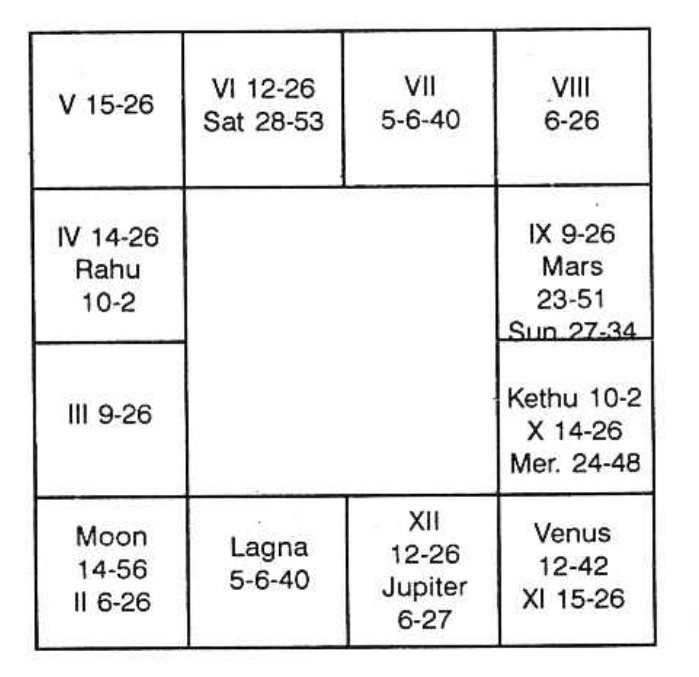

Second house indicates receipt of money; it may be by any means: by drawing salary, by borrowing, by selling anything, etc.  
Sixth house denotes getting money by loan or loan repaid by one who borrowed or by receiving one’s dues due to service rendered to another.  
Tenth house brings money by profession. Eleventh is the net profit - the gains.  
Second house is occupied by Moon; Venus is in the constellation of the occupant of the second house.  
Sixth house is occupied by Saturn. No planet is in its star.  
Tenth house is occupied by Mercury and Venus; Mars and Sun are in Mercury star; Mercury and Moon are in Venus star.  
Jupiter is owner of second house.  
Hence Venus, Moon, Saturn, Mercury, Mars, Sun and Jupiter are the Significators. Rahu acts as an agent of Saturn; Sun is represented by Kethu.  
Venus is in the sub of Rahu; Moon in the sub of Venus; Saturn in the Sub of Mars; Mercury in its own sub; Mars in its own sub; Sun in the sub of Jupiter, Jupiter in the sub of Moon.  
Venus, Mercury, Sun, Jupiter and Moon are the most fruitful ones.

Ruling Planets (on 14.08.70):

Friday governed by Venus  
Moon's star lord Venus  
Rasi lord Jupiter  
Lagna lord Sun  
Lagna constellation lord Venus  

Hence consider Venus, Jupiter and Sun. None is retrograde, none in the constellation of retrograde planet.

There are three sensitive points governed by the above:

(a) Sun sign Venus star Jupiter sub 21° Leo.  
(b) Venus sign Jupiter star Sun sub 29° Libra.  
(c) Jupiter sign Venus star Sun sub 16° Sagittarius.

Hence when the strongest fruitful Significator of the luminaries pass any or many of sensitive points, the matter fructifies. Further, Sun, lord of Lagna at the time of query, is lord of 10. It is in the sub of Jupiter, lord of 2 in 11. Hence, take the transit of Sun. It is in the movable and fruitful sign. So, it will yield the result quickly. Hence out of the 3 sensitive points, it will pass through the first sensitive point on Monday 7th September, 1970. Sun will be in his own sign in Venus star Jupiter sub. Moon will be in Jupiter star.

Therefore on 7-9-1970 he will receive his first salary.

It is not uncommon that some are appointed or transferred and they are not sure of the date on which they will receive their salary.
## Reinstatement in Service
At 10:28 PM on 23-7-'70, a person asked, "Sir, I have been placed under suspension from my service for more than two years. Please, tell me whether I shall be reinstated in my service or not; if so, when?"

"Give me a number within 249 please."

"Take it as 145."

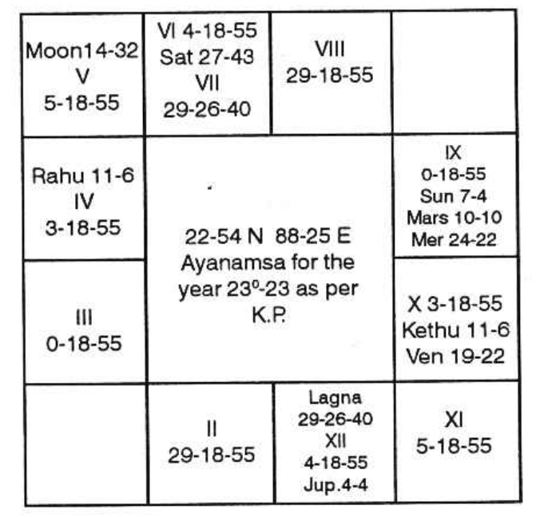

The time, at the time of judgment was noted as 10:31 PM on 23-7-'70. The lagna falls in Libra 29°26'40" with the number 145. And, the other cusps calculated as per rule of K.P. Balance of Saturn Dasa 3 yrs. 14 days as on 23-7-'70.

### Planetary Conditions

| Planet & Bhava | Constellation Lord | Sub Lord |
| -------------- | ----------------- | -------- |
| Sun (9)        | Saturn            | Mercury  |
| Moon (5)       | Saturn            | Rahu     |
| Mars (9)       | Saturn            | Venus    |
| Mercury (9)    | Mercury           | Rahu     |
| Jupiter (11)   | Mars              | Venus    |
| Venus (10)     | Venus             | Rahu     |
| Saturn (6)     | Sun               | Moon     |
| Rahu (4)       | Rahu              | Saturn   |
| Ketu (10)      | Ketu              | Saturn   |
| XI Cusp        | Sun               | Mercury  |

### Analysis of the Horary Chart

The moon indicates the mind of the consultant. Here Moon is posited in 5. The houses 5, 9, 1 indicate suspension, Thus the Moon has the relation with suspension of the consultant.

Again, Moon is in the constellation of Saturn. The Saturn is posited in 6 and is aspected by the Jupiter posited in 11. The sub of Moon is Rahu which is aspected by the Venus and Jupiter. They are posited in 10 and 11 respectively. The houses 6, 10, 11 and 2 indicate promotion or reinstatement as per K.P. Hence the query is justified which related with the Question of reinstatement in the service as well.

The sub lord of the cusp of 11 is connected with any one of the houses 2, 6, 10 and 11 in any manner, the consultant will have the positive answer. Here Mercury is the sub lord of the 11th cusp. Mercury is conjoined with Sun and Mars, the lord of 10 and 6 respectively. Mercury is the sign lord of 11. The sub of Mercury is Rahu- represents Saturn as well as Venus and Jupiter by aspect and occupation. Saturn, Jupiter and Venus are posited in 6, 11 and 10 respectively. Hence, the consultant must have a positive answer and he will be successful in his attempt. Ultimately, he will be reinstated in his former position without any monetary loss.

### Reinstatement - When?

"Judge the significators of the house 2, 6, 10 and 11 for promotion or reinstatement in service." The reinstatement is a kind of promotion as it enhances the status of a person from the position of suspension; income also increases.

2nd House is vacant; lord is Mars. Jupiter is in Mars star, 6th house is occupied by Saturn. Sun, Moon and Mars are posited in Saturn star. Lord of 6 is Mars.

10th house is occupied by Ketu and Venus. Ketu and Venus are posited in their respective stars. Lord of 10 is Sun. Saturn is in Sun's star.

11th house is occupied by Jupiter. No one is in Jupiter star. Lord of 11 is Mercury. Mercury is its own star.

Hence, all the planets have come under the list of Significators, except Rahu. But Rahu by aspect will also become a significator. Jupiter and Venus both aspect Rahu. Rahu is in the sign of Saturn.

When this position arises, our Gurujee has suggested to us to eliminate those which are not the ruling planets at the time of judgment. The ruling planets at the time of judgment are as follows:

- Rising lagna Pisces Lord Jupiter
- R/Lagna star U.P. Pada Lord Saturn
- Moon’s sign Pisces Lord Jupiter
- Moon's star U.P. Pada Lord Saturn
- Day Thursday Lord Jupiter

Hence, take Jupiter and Saturn. As Rahu occupies Saturn sign and is aspected by Jupiter take Rahu as the strong significator with the above. Therefore, during the conjoined period of the above, the consultant will be reinstated without fail and the transit will agree.

At present, the consultant is running Saturn dasa Rahu bhukti Sun anthra and it is up to 30-8-1970 (around) Sun is the constellation lord of 10-signifies the 6th house matter. During this period, Saturn shukshma will start from 3-8-1970 will be up to 11-8-1970. Moon will transit Scorpio on 11-8-70 through Saturn star. Mars is the sign lord of 2 and 6, and signifies the 6th house matter. Its sub signifies the 10th house matter. Saturn is the dasa lord and is posited in the 6th house. On 10th August, Moon will transit in Venus sign Libra, (Venus is the sign lord of 1, 8 and 12) and in the star of Jupiter (posited in 11th house). Besides this, all other planets on 11-8-70 are in the sign or star of the significators of 2, 6, 10 and 11.

So, it is declared to him after the selection of the date. "Sir, don’t worry! You will be reinstated on 11-8-70", and you will rejoin duty on 11-8-70", "Sure, Sir" "Certainly". "Thanks".

Days passed on. On 10-8-70, in the evening, that very gentleman came and said, "Your prediction is very correct. I have received the reinstatement orders today. I have been asked to rejoin on 11-8-70".
## Photography

Can I do photography?

Horoscope is as follows:

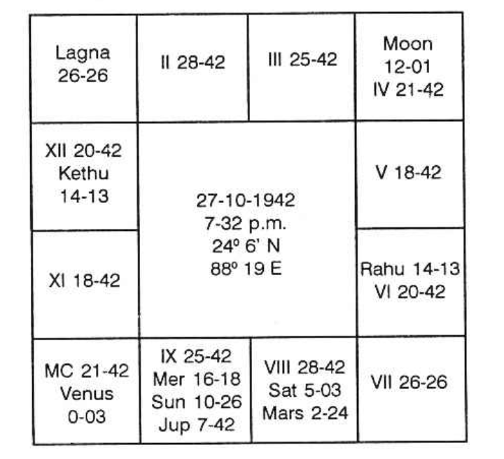

- Rahu Dasa balance 10 years 9 months 10 days
- Mercury Dasa starts on 6-9-69

Let us judge why he took photography. 10th cusp is in Venus star Jupiter sub. Venus, by nature, denotes photography. Prosperity depends on the period which is to run. If we analyse, Mercury (11th cusp sub lord) and its results, then one can know how the gains would be. Mercury is posited in the 8th house. It is in Saturn star Jupiter sub. Saturn is lord of 11th and 12th. It is in 7th house. It is exalted. Saturn shows that one will invest money (lord of 12th and no planet is in 12th). Saturn as lord of 11th promises gains. It is in 7th. So it threatens that you should not have any partner for any business. Because it is significator of 7th and also 12th. Mars suggests independent venture. Saturn and Mars encourage your independent business and denote mixed results as Saturn owns the 11th and 12th houses. But in 11th Bhava Ketu is deposited. Venus alone is in Ketu stars. Hence Venus promises success and prosperity through the matters which Venus indicates. Photography is one of those which Venus indicates. Hence during Mercury Dasa, there will be speedy turnover, larger profits, satisfactory bank position, etc., and also during the sub periods of Saturn in July, August 1983 some worry especially through Tax Department. Otherwise, the whole of Mercury Dasa from 6-9-69 is beneficial. Customers increase. You will appoint more assistants. You will not be in difficulty to get materials. Costly ones will be purchased by you during Mercury Dasa Venus Bhukti Saturn Anthra in November 1974. Expansion and improvement from November is promised. Between 1969 and 1974 every year will show steady improvement.

According to Western System Sun just progresses in 10th house. It will be there for 25 years more when name, reputation, prestige, prosperity in profession, etc. are promised. Moon by progression, now passes in 12th house, after 2 years Moon assures that Luck starts. According to transit, from 7 March, 1969, financial position will be good - photography will be your profession.
## Transfer

Example 1

A lady puts a question about transfer and promotion of her husband. She furnishes her horoscope which is given below:

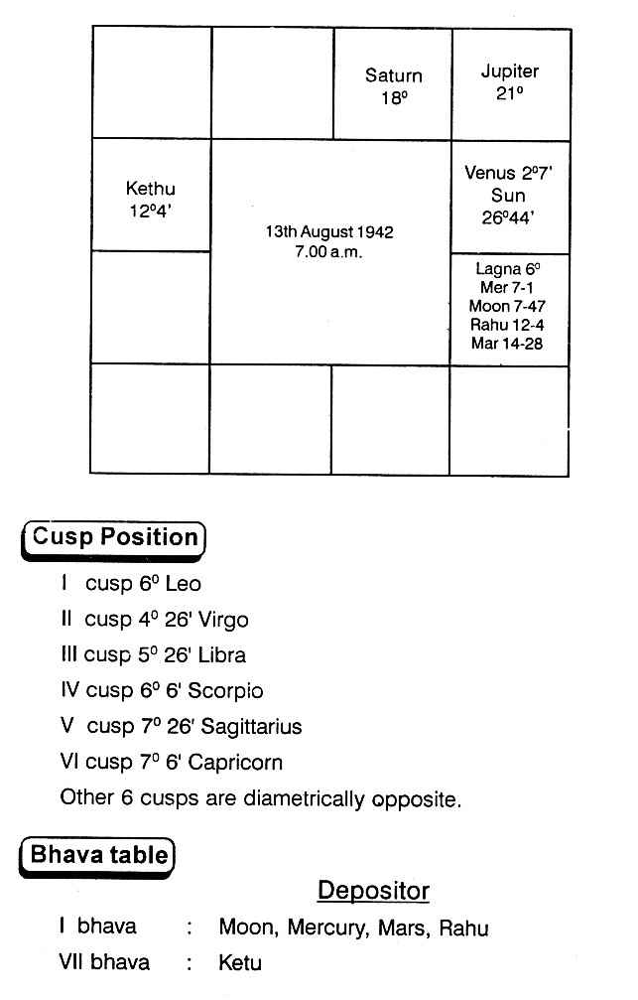
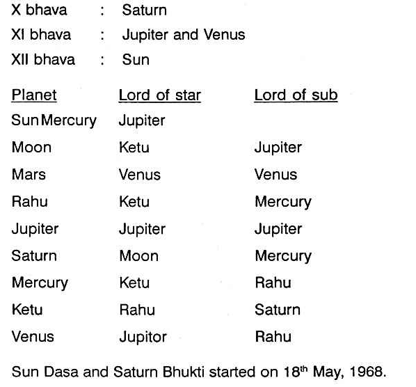

For transfer we have to consider houses 3, 9, and 12. Therefore for husband’s transfer, consider houses 3, 9, and 12 from 7th house, i.e. 9th, 3rd, and 6th.

9th house: It is vacant. Lord of 9th is Mars. No planet in any of the three stars of Mars. So take Mars. But Rahu is conjoined with Mars. So take Rahu and Ketu in the constellation Sathabisha of Rahu. Therefore Rahu and Ketu are significators.

3rd house: It is vacant. Lord of 3rd is Venus. Mars is in Venus star. We have already discussed Mars.

6th house: It is vacant. Lord of 6th is Saturn. No planet in any of the three stars of Saturn. Take Saturn. Saturn’s sign is occupied by Ketu who is aspected by Saturn and in the sub of Saturn. Therefore take Ketu and Rahu, Moon and Mercury are in Magha ruled by Ketu.

Planet showing transfer are Rahu, Ketu, Saturn, Moon and Mercury. As Moon and Mercury are conjoined with Rahu, reject them and take Rahu. Therefore, Rahu, Saturn and Ketu are very strong significators.

Sun Dasa (Sun is with Venus in the same sign) and Saturn Bhukti is on. Select Rahu Anthra and Ketu Shookshma. Ketu Anthra cannot be taken as Ketu is in Saturn’s sign and aspected by Saturn, a planet of delay.

Dasa Bhukti = Anthra Period

- Sun Sat Sat 18th May to 12th July 1968
- Sun Sat Mercury 12th July to 1st Sept. 1968
- Sun Sat Ketu 1st Sept. to 20th Sept.1968
- Sun Sat Venus 20th Sept. to 17th Nov.1968
- Sun Sat Sun 17th Nov. to 4th Dec.1968
- Sun Sat Moon 4th Dec. 1968 to 3rd Jan.1969
- Sun Sat Mars 3rd Jan.69 to 23rd Jan. 1969
- Sun Sat Rahu 23rd Jan.1969 to 14th March 1969

Rahu Anthra operates from 23rd January 1969 to 14th March 1969. Ketu Shookshma rules between 23rd Feb. 1969 to 27th February, 1969. Look at Sun’s transit. Sun on 19th February enters Saturn’s sign Rahu star. Select Ketu sub, i.e. on 27th February, 1969. Sun will be in Saturn’s sign, Rahu star, Ketu sub. Moon will be in Mercury's sign Rahu star. Mars in Mar's sign, Saturn star. Saturn will travel in Mercury star, Saturn sub. Rahu will transit in Saturn star. So he will be transferred on 27th February 1969. As Rahu operating as Anthra lord, is conjoined with Mars, lord of 9th house which happens to be 3rd from 7th (husband’s) he will be transferred to a place not far off. A short travel is shown.

For promotion take houses 2, 6, 10 and 11 from 7th house i.e., 8th, 12th, 4th and 5th from lagna of the lady.

8th house: It is vacant, Lord of 8th is Jupiter. Jupiter and Venus are in Punarvasu ruled by Jupiter. Jupiter is in its own sub and so gains strength. Take Jupiter and Venus.

12th house: Occupied by Sun. No planet in Sun’s star, Sun in Jupiter's sub. So take Sun: Sun's sign is occupied by Rahu: Take Rahu and Ketu in Rahu star: Rahu and Ketu, Sun are significators;

4th house: Owned by Mars. We have already discussed Mars;

5th house: Owned by Jupiter; We have discussed Jupiter. So significators are Jupiter, Venus, Rahu, Ketu, Sun.

Sun Dasa Saturn Bhukti is going on. Saturn Bhukti lord is in constellation Rohini ruled by Moon owner of 12th house. So Saturn Bhukti will give promotion. We would have selected Jupiter's Anthra as Jupiter is very powerful in its own constellation and sub and aspecting 5th bhava. But Rahu a node is transiting in Pisces a sign ruled by Jupiter and hence whatever Jupiter has to give Rahu will give in his period. Therefore the period of transfer and promotion coincides and he will be promoted at the same time. As Rahu is in lagna, i.e. 7th house from 7th his immediate boss will be helping him in transfer.

Example 2

Horoscope is given in the next Page.

Budha Dasa Balance 16 years 2 months 9 days.

Moon Dasa started on 18th-12-68.

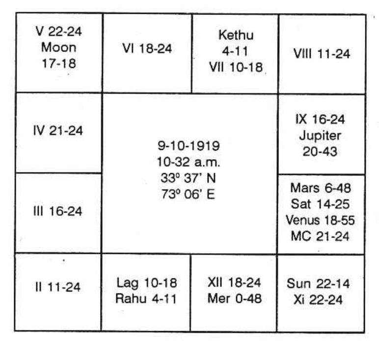

For transfer judge houses 3, 9 and 12 which includes change of residence also. They should be connected with house 6 or 10. If connected with 11th house, it shows increase in income and improvement in status.

Third house is vacant. It is owned by Saturn; Pushya, Anuradha and Uthrapadra are governed by Saturn-Rahu is in Anuradha.

Ninth house is occupied by Jupiter, Mars, Saturn and Venus. No planet is in Jupiter star. Mercury is in Mars star. Rahu is in Saturn star; Saturn and Venus are in Venus star. Rahu is in 12th. No planet is in Rahu star. Rahu is the strongest.

When majority of planets denote a particular matter, how to eliminate many and select those which will act. A matter may be indicated by any number of planets. That particular affair may be one which repeats now and then in one's life, just like birth of child, purchase of jewel, transfer, change of residence, journeys, etc. Then the significators at the moment of judgement clearly shows the immediate next repetition of the matter. In one's life birth and death alone happen only once. Other affairs repeat themselves according to one’s horoscope.

Today it is Tuesday, ruled by Mars. Lagna is in Cancer, owned by Moon, Star is Poorvapadra governed by Jupiter in whose sign, at the time of judgment, Rahu is deposited who represents Jupiter. Rasi is owned by Saturn. Hence Moon, Mars, Rahu, Jupiter and Saturn are the significators. Lord of lagna is the strongest and his dasa is on.

Lord of star represented by Rahu. So take Rahu Bhukti. Next select Jupiter, lord of the star, i.e., Jupiter Anthra, Saturn Shookshma is the last sub sub period (that it will be around 17th August, 1970.)
## Termination of Service

Birth Details

A Native - Male.  
Born on 18th July, 1922, Tuesday at 8:18 A.M. I.S.T. (8:28:40 A.M. L.M.T.)  
Place - Lat. 24° 48'N. Long. 85° 01'E.  
K.P. Ayanamsa - 22° 40'  

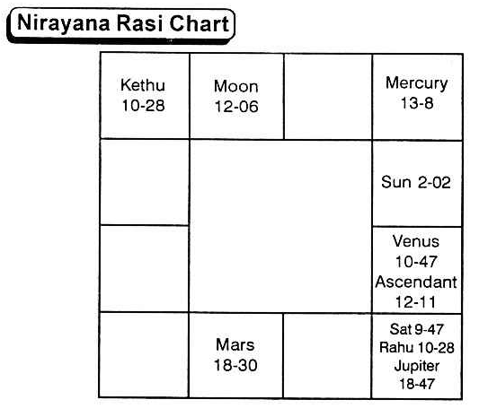

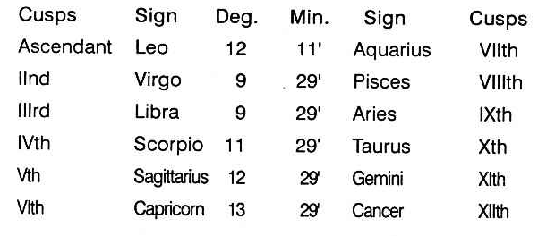

| Planets | Star    | Sub     |
|---------|---------|---------|
| Moon    | Ketu    | Mercury |
| Mercury | Rahu    | Mercury |
| Venus   | Ketu    | Saturn  |
| Sun     | Jupiter | Rahu    |
| Mars    | Mercury | Mercury |
| Jupiter | Moon    | Mercury |
| Saturn  | Sun     | Venus   |
| Rahu    | Moon    | Moon    |
| Ketu    | Saturn  | Sun     |

For termination of service, the houses 1, 5, 9 & 12 are to be judged. The 1st house is negation of 2nd (self-acquisition). The 5th is negation of 6th (service). The 9th is negation of 10th (status). The 12th is the general house of loss. Termination of service takes place under the conjoined period of the planets connected with these houses. The following Scientific Method is to be pursued uniformly to judge such a problem. Let us take up one by one.

The 1st house is unoccupied. Its lord is Sun. In its constellation Saturn is posited. Therefore, Saturn is a strong significator.

The 5th house is also unoccupied by any planet. Its lord is Jupiter. Sun is in Jupiter’s star, but it happens to be in the 11th house - the house of gains. Jupiter being in the constellation of the Moon, lord of 12 and occupant of 9th is stronger than the Sun.

The 9th house is occupied by the Moon. Rahu and Jupiter are in the constellation of the Moon. Mars, the lord of 9th, in the constellation and sub of Mercury - lord of 2 and 11, is in 4th and so only a feeble significator.

The 12th house is occupied by Venus. Saturn is posited in the Sub of Venus. The Moon rules the 12th and is placed in the 9th, Rahu and Jupiter, in the constellation of the Moon are stronger than the Moon, to give the effects of the 9th and 12th houses.

The readers will be surprised to note that the significators discussed above conjointly brought about Termination of Service during Rahu Dasa, Jupiter Bhukti, Saturn Anthra, i.e., from 18th March, 1969 to 5th August, 1969. The houses 1, 5, 9 & 12, fully played their role. It is a sufficient proof of the efficacy of K.P.
## When Will I Retire?

Horoscope is as follows:

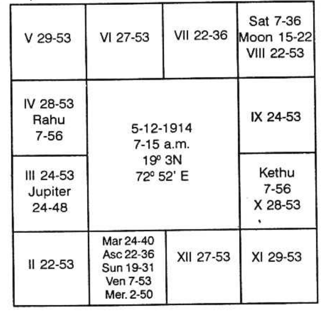

Rahu Dasa balance 6 years 3 months 2 days.

Sir, retirement from service shows permanently ceasing connection with the office in which you were hitherto employed and also a thorough change in one's surroundings and environment. It includes, also change of one's residence. This is applicable to Govt. Employees who surrender the quaotens allotted to them, after retirement. Therefore, the houses to be examined are 5 and 9, i.e., 12 (negation) to 6 and 10, ruling service and occupation, as well as the 3rd house which is the 12th counted from 4. In your chart, 3rd house is occupied by Rahu. Saturn and Moon are posited in Rahu's constellation. The fifth house is unoccupied. Its owner is Jupiter, and Mercury alone is in Jupiter's constellation. The ninth house is occupied by Ketu with no other planet in its star. Thus, the significators are Saturn, Moon, Rahu, Mercury and Ketu. So in Mercury Dasa, Saturn Bhukti, and Mercury Anthra, when Sun, by transit, passes the position 6 occupied at birth by Mercury, i.e., around 20th November, 1970, will cause your retirement.

Jupiter, whose period you are now running, happens to be lord of 2 and is deposited in the constellation ruled by Mars, lord of 1 and 6 and hence has to benefit you financially which would not otherwise be the case if you were to retire. Jupiter in the constellation of lord of 6 (service) shows continuity in that respect.

In fact, it is because of Mars connection you found yourself into the Navy - Mars occupying a watery sign and owning the 6th house aspects Saturn as well as the Moon (Mars-Moon: Navy).

Further, in my experience, I have found that if two or three planets together indicate a department and also entering into service in youth, whenever their conjoined periods operate in future there will be definite improvement or change or retirement.

In your case, the planets which are connected with houses 3, 5 and 9 are also connected with houses 6 and 2; because Rahu is to offer the results of the planet with which it is in conjunction or by which it is aspected. Rahu is not conjoined with any planet but it is aspected by Mars who, by virtue of its governance over the 6th house, denotes monetary gains as a result of service in departments connected with Army, Navy, Air Force, Police, etc. Rahu thus gains strength to indicate the 6th house results also.

I am sure that, as in the case of many other people, the three planets - Saturn, Mercury and Moon which saw you entering service on 21st May, 1941, will, in their conjoined period again (Saturn Bhukti, Mercury Dasa), indicate retirement.

In traditional astrology, the rule is that planets which are in shasthashtama (quincunx or 150 degree aspect according to Western astrology) to each other, i.e., in 6 and 8 to each other, cannot offer desirable results whenever their conjoined periods operate. Actually, you entered service and also got married only when you were running Saturn Dasa, Mercury Bhukti, - the two planets which are in 6 and 8 to each other. Again, you were confirmed in the Commission when you run the bhukti of Venus which was in 6 to dasanatha Saturn. Another planet, Sun which is also in 6 to Saturn offered, in its bhukti, a voyage to a foreign country at the end of 1947. Also the same Sun's period, before it ended, saw your promotion. Again, in traditional astrology, planets in the 8th house threaten untold miseries, but actually Saturn and Moon in 8 to your lagna which operated when you entered the Navy, again caused another promotion in December 1948 (Saturn Dasa, Moon Bhukti, Saturn Anthra). Has traditional astrology been helpful in explaining your events? You enjoyed diametrically opposite results.

Since Mercury Dasa, Saturn Bhukti and Mercury Anthra is the period of retirement and Mercury is the lord of 8 and 11 houses, it shows that when one retires during Mercury Anthra one will have his accounts settled quickly and will get his accumulated provident fund, etc. no sooner after retirement date. (Mercury is a speedy planet and connected with accounts, etc.) In many cases, people having accumulated arrears during Saturn sub period have their arrears received or entangled money obtaining during Mercury sub period.
## Regaining Lost Position and Retirement

Time of birth was 5:45 PM on 20th February, 1924 at 8° 11' North and 77° 29' East. The horoscope is as follows:

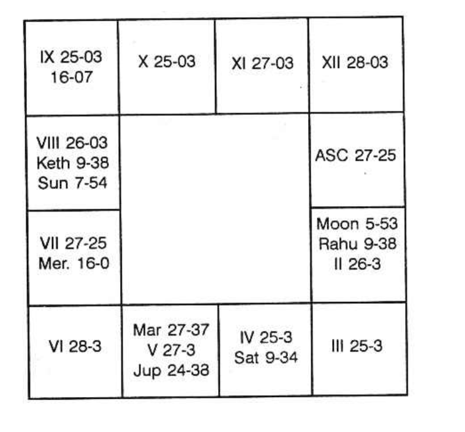

Ketu Dasa balance at the time of birth is exactly 4 years.

Sir, the query is to find out whether your seniority will be restored, if so when? Or will you resign and leave the job, if so when?

To regain one's position, one has to judge the 10th and 11th houses, as the 10th house indicates the position, fame, reputation and honour in profession and also the 11th shows one's realization of ambition. Both the houses are vacant. The lords of the cusps of the 10th and 11th are ruled by Mars and Venus. It will be surprising for you to note that I am taking your horoscope at a time when Bharani Nakshatra is on. It means Moon is transiting in Mars' sign and Venus' star. Therefore the two planets which are to fulfill your desire will be Mars and Venus. The other planet which will also contribute for your success will be the lord of the day and the lord of the lagna in which I am now dictating. Now the lagna is Kataka, ruled by Moon and the day is also ruled by Moon, being Monday. Therefore, one can boldly declare that you will have your desire fulfilled. You are running Mars Dasa, Ketu Bhukti up to 14th January, 1969. Mars Dasa, Venus Bhukti commences on the happy Pongal day of the Hindus. Moon sub period in Venus will be in April-May, 1969. I am sure that the day of order for regaining the lost position would be 3rd May, 1969, when Sun transits in Bharani Nakshatra.

According to this horoscope, there is no planet in Mars' star, no planet in Venus' star. Therefore, Mars and Venus are the two, who in their conjoined period, will do good. No node is conjoined with either of the two or occupying any of the four signs owned by those two planets. Therefore, it must come through and you must regain as the sub lords are favorable.

Regarding the second question, one has to find out when you will be running the period of the significators of the 1st, 5th and 9th houses. Moon and Rahu are in 1st. Mars alone is in 5th and no planet is in 9th. The lord of the 9th is Jupiter. Budha is in Moon's constellation. Sani and Ketu are also in Rahu's star, Guru's star is not occupied by any planet and Mars' star is also not tenanted by any. Taking the ruling planet at the moment of judgment as lagna is in 2° of Cancer, you will retire from the service after the full term during Rahu Dasa, Budha Bhukti, Ketu Anthra, i.e. in 1979. Hence the question of resigning the present post during Mars Dasa or in the first half of Rahu Dasa is out of question.

## Time of Sanction of Pension

Even though one is entitled to pension from the time of retirement, why is there a delay in a few cases? Whose fault is it? Government or your action in the previous birth or your service in this birth?

A member puts this question to himself after he has become dejected with the slow speed of the authorities concerned regarding the settlement of his pension. His horoscope and the facts are as follows:

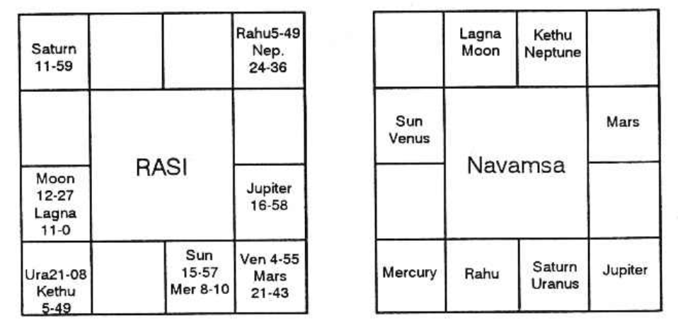

- Born on 1-11-1908
- Entered into service on 14-7-1927
- Gave notice for retirement in June 1961
- Retired on 19-9-1961
- Pension is not yet settled

Indeed, four years and three months have passed and the pensioner has waited for 51 long months in these costly days. Now, he puts the question: “Whose fault is it?”

The correct answer is his “Fate”. Why? When some are receiving their pension regularly and their accounts are settled around the time of retirement, if this person is put into inconvenience, what will a few philosophers and fatalists say except to confirm that he would have been working probably as an officer in his previous birth and he would not have paid in time either the salary or the pension to the servants, then. That is why, his delayed action in his previous birth has caused this undue delay in this birth. This is the appropriate answer in accordance with Karma and Reincarnation Theory.

In practical life, the above is for consolation. But the same can be explained by the astrologers applying the various principles of astrology.

The appointment was made when the person had been running Rahu Dasa, Jupiter Bhukti and Venus Anthra on 14-7-1927, on a Poorvashada star day when Moon was transiting (though in the 12th sign) yet in the sign owned by Jupiter and the star governed by Venus, lord of the 10th house, indicating profession.

The date of retirement came in Saturn Dasa, Mercury Bhukti, Venus Anthra, Rahu Shookshma. Mercury is the lord of 6, indicating service and is also lord of 9 (12th house to 10), i.e. retirement or leave.

Now, when can he have his account settled? Saturn is lord of 1 and 2. It is in its own constellation. It is strong and hence it can never deny; but, according to its nature it must delay. Generally for settlement of an account one has to scrutinize the houses 2 and 11. If it is pension, as it is concerned with benefit through service the 10th house also is to be included. The 2nd house is not occupied, but it is owned by Saturn. Saturn governs the three stars, Pushya, Anuradha and Uthrapathrapada. No other planet except Saturn occupies the constellation of Saturn.

So, Saturn is a very strong indicator. Therefore, the astrologer can boldly declare that whatever may be the delay and however much it can throw obstacles, Saturn must give the full pension before its dasa is over as it is the lord of finance and it is beneficial for money matters. The total dasa period of Saturn is only 19 years and so far the pensioner has enjoyed nearly 8 1/2 years, and another 10 1/2 hopeful years alone are left over. As regards the 11th house, there is no planet situated in the 11th bhava. But the node Ketu is in 11th house and the stars governed by Ketu are Aswini, Makam and Moolam; Ketu alone is in Moolam. Ketu is a significator. Mars is the lord of the 11th cusp. It governs Mrigasirisha, Chitra and Dhanishta stars. Of the planets and the nodes posited in any group of constellations, the nodes are always stronger than the planets and therefore, Rahu in Mrigasirisha is to be taken. When the horoscope is scrutinized, Venus conjoined with Mars and aspected by Saturn and also in the constellation of Sun - representing the Government - shows that in Venus Bhukti itself, it will be settled and sanctioned.

Therefore, Saturn Dasa, Venus Bhukti and Rahu Anthra commencing on 12th December, 1965 shows that in its period of 171 days it will receive the attention of the authorities and will be disposed. Mostly the date of disposal would be in Ketu Shookshma. So, the pensioner gains confidence that he will have the pension between 10-3-66 and 18-3-66.

According to transit, the so-called sade-sati i.e. the evil 7 1/2 years Saturn period will be coming to an end and Saturn, the dasanatha will be in Jupiter's star and Ketu sub. Jupiter will be transiting in the constellation of Mars and in the sub of Saturn which is the lord of 2nd house. Venus, the bhukti lord, will conjoin with the Ascendant in direct motion and transit in Lagna Bhava.

Therefore, astrology offers both peace of mind and also a consolation for the delay as well as the mind to live on hopes till 42-3-1966, when it will be sanctioned. Even here Saturn will play its role, 12th March happens to be a Saturday. What if? A second Saturday in the month of March. So, it is a holiday and hence one is to wait for next Monday. Now one may ask “Is not the lord of the star stronger than the lord of day”? If it is to be strictly followed, should not one find out where Moon will be transiting on that Saturday and note the lord of the star. “Oh God!” says the astrologer, leaning back on the easy chair - The star is Anuradha. It is governed again by the delaying Saturn. That is why probably, our ancestors have given Saturn, the last day of the week, to be governed by it. Otherwise, in the middle of the week, it may throw obstacles and cause difficulties. Saturn is a friend for people who are very slow and a foe for fair deal.

If this paper moves slowly similar to Saturn in the Heavens it is only due to his Saturn Dasa and not the Government. He gathers courage and asks the astrologer “If my pension will be settled before this official year, then shall I get the increment due to me, when I was in service? The authorities regularly gave me increment in the same scale of pay for the same post held by me from September, 1955 till 1960. Only the increment for 1961 remains to be paid”.

The astrologer says within himself “I pity with you. God also hears your prayers. Authorities are reminded periodically. But what God or the Government can do, when your fate is so strong that the authorities cannot settle your account in these 51 months and another couple of months to come.

At any rate, on the above date, Saturn will knock at your gate and say “Late is due to your fate”. Actually, the date of sanction was 26-3-66.