## Politics

Politics is not poly tricks played for one's prosperity, but it is a science of or a treatise on the organisation of a nation and execution of the policy after discussion for the welfare of the nation and not the native alone. As one is to live happily in this world and enjoy ika loka-sukha-venus, the chief governor for worldly pleasures is called one of the ministers of the celestial bodies. Since the uplift of the soul and para-lokha sadhana are the ultimate aims, Jupiter, the karaka for these is said to be the chief minister of the celestial bodies. If a person is expected to be the representative of the public, Mercury, called the winged messenger of God or agent, should indicate in one's chart whether he will be a member, a councilor, a mayor, a minister and so on.

As ministers are empowered with power and authority, Mars must be well placed and strong. As ministers hold the position of trust, Saturn also must be beneficially posited and strong. A politician needs mostly oration, convincing tactics, popularity and mainly fortune to come out successful. One can be a good orator, if Jupiter and Mercury are favourable and if Mars is auspicious then he can place before the public, the facts in meticulous detail, analyse and explain, whether one is right or wrong, one will be capable of convincing the people and carry the mass with him.

Vaidhyanatha Dikshita says in Jataka Parijatha that one can become a minister:

1. If Sun, Mars, Mercury and Saturn are conjoined, the person will be a minister. (If you want to apply Krishnamurti Padhdhati Sun in Saturn sign, Mars star, Mercury sub or Mercury in Aquarius in Sun Sub, in Mars star, or in Anuradha star governed by Saturn, in Mars sign and the sub belonging to either Sun or Mercury at the time of birth makes one a minister in the period or sub period of the occupant).
2. If Moon, Mercury, Jupiter, Venus and Saturn are conjoined in a House (not a sign) they make the person a minister. [According to Krishnamurti Padhdhati Venus in Jupiter sign, Mercury star, Moon sub, aspected by Saturn by 3" aspect produces the above result: or Saturn in Mercury sign, Jupiter star, Moon sub aspected by Venus causes the above effect; or Saturn in Venus sign, Moon star, Venus sub aspected by Mercury etc. They need not be conjoined. What results are promised by conjunction will be produced by being situated in a position where the sign lord, star lord and sub lord are the same planets.]
3. Jupiter in 9 contributes: aspect of Mars is also beneficial.
4. Three planets in their own sign (Swakshetra) makes one a minister. He or she may be tactful, diplomatic and clever or cunning and hypocrite.

In Sanketanidhi, Ramadayalu says that one becomes a minister even in youth, if lord of 5 is in 4. He will be honest. (Lord of 5 in the constellation of lord of 4 is good). One a minister. So also Jupiter in 6, or Venus in 5, or Venus in 10.

In Horasara, Prithuyasas that Sun in the 6" house makes gives a lift to the person to become a minister. Also he says that when all the benefics are situated in 3 or 6 or 10 or 11 and the malefics in 1 or 10, one can become the chief minister.

In Jataka Dasa Marga, Podumanni Chomadiri says that benefics in 6, 7 and 8 counted from the sign occupied by Moon, causing Chandra Adhiyoga makes one a minister. So also one born in Lagnadhiyoga will be benefitted. He also adds that lord of 10 in exaltation makes one a minister.

Mantreswara in Phaladeepika mentions that Mercury makes one a good politician, The 5" house is to be judged to find out whether one can become a minister and also Jupiter, Sun and Moon.

To become a minister or a politician, first of all, one should be lucky. One need not be rich to spend money on elections. One need not be educated much. Among ministers do not we see, engineers, doctors, lawyers, teachers, officials, business people, etc. Caste and creed do not count excepting in certain cases.

As per Krishnamurti Padhdhati, Fortune to become a minister is to be judged as follows. Cusps of the Houses 1, 6, 9 and 10 should receive beneficial aspects. The occupants of those houses must be in the constellation of benefics by lordship and the sub is to be ruled by such benefics connected with houses 1, 6, 9, 10 and 11. House 1 shows that he enjoys the benefit. 6" house promises failure and loss to the opponent, thereby victory over enemies. 9" house is the bank position of the meritorious deed done in the previous birth, thereby there is the Bagya, the Providential help etc. 10" house indicates name, fame, reputation, popularity and profession. 11 house promises success in election, realisation of ambition and fulfilment of one's desire. Thus one is to judge.

[How planets portray the ministers resigning with black mark, ministers re-entering service again, ministers resigning honourably on a policy with prestige, ministers again called for to occupy a better position, changes in their portfolio, lift in rank, honest or otherwise will be discussed in my magazine Astrology and Athrishta.]

Dated 6-12-1968.

Dear Sir,

Please refer to your letter dated 10-12-67 in reply to my letter dated 6-12-67 wherein you had written that “I will not be given ... ... ticket for Rajya Sabha Seat”. This proved to be correct. Is there any astrological indication of my getting any Political uplift in 1969?

Yours sincerely,

(Sd.) B. Prasad, M.A.

## Will Politics Suit Me?

A young man with a keen aptitude for politics wants to know if he would be successful in political ventures. The number furnished by him for analysis is 206. The question is taken up for analysis at Lat. 16° 31' N and Long. 80° 39' E on 13-9-1969, 8.30 A.M. I.S.T.

Since the querist has given number 206, the nirayana horary ascendant is the commencement of 206° sub of Krishnamurti Padhdhati. Hence the lagna is Capricorn 26° 6' 40". Adding 23° 20' being Krishnamurti ayanamsa for 1969, we find that the sayana ascendant is Aquarius 19° 26' 40". The other cusps are obtained from Raphael's Table of Houses as usual. The values given by Raphael are tropical. But, we work with sidereal (nirayana) values. Hence, from each of the sayana cusps, we must deduct Krishnamurti ayanamsa (23° 20' for 1969). The following chart shows the different cusps and planetary positions at the moment of analysis.

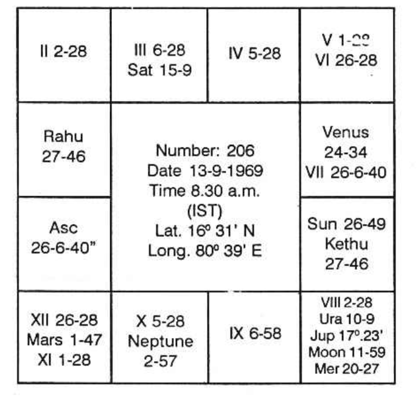

Balance of Moon Dasa: 8 years; 6 months 5 days.

Rahu represents... Saturn

Ketu represents... Sun

| Planet & Bhava | Star Lord | Sub Lord |
|----------------|-----------|----------|
| Sun (7)        | Jupiter   | Venus    |
| Moon (8)       | Moon      | Rahu     |
| Mars (11)      | Ketu      | Venus    |
| Mercury (8)    | Moon      | Venus    |
| Jupiter (8)    | Moon      | Saturn   |
| Venus (6)      | Mercury   | Rahu     |
| Saturn (8)     | Venus     | Venus    |
| Rahu (1)       | Jupiter   | Venus    |
| Ketu (7)       | Jupiter   | Venus    |

The essential qualifications for a successful politician are:

1. He must be a good orator
2. He must be able to tactfully win over masses by meticulously placing before them facts and figures and explaining in detail
3. He must win public confidence
4. He should have an element of fortune to bless him with popularity and prosperity

Well-placed Jupiter, Mercury and Mars give oratory capabilities and Saturn gives positions of trust. For politics, the most auspicious houses are 1, 6, 9, 10 and 11. Winning over rivals is indicated by house 6 because it is the 12th to 7th, the rivals. Popularity and prosperity are to be read from houses 10 and 11. An element of fortune and benefits are shown in houses 1 and 9.

Therefore, if Jupiter, Mercury, Mars and Saturn are strong and signify houses, 1, 6, 9, 10 and 11, either jointly or independently, then the querist will be a successful politician. In the present chart, Jupiter and Mercury are in conjunction, Jupiter owns 11 and Mercury owns 6. Both are in the constellation of Moon, lord of 7 in 8. This indicates victory of opponents. Lord of 10 Mars is in 11 and in the star of Ketu who is in 7. This shows popularity that gains. Lord of 1, Saturn is in the star and sub of Venus, who owns 9 and is in 6. By this, the querist will win over his rivals by luck and will be benefitted. Lord of 9, Venus is in the star of Mercury in 6 and sub of Rahu in 1 indicating gains to opponents.

We therefore find that Mars and Saturn are well placed for politics, Jupiter and Mercury, though apparently well placed, do not promise success. Saturn signifies 1 (by lordship), 3 (by occupation), 6 and 9 (by position in Venus's star, who owns 9 and is in 6). So, houses 1, 6 and 9 are brought out by Saturn. Mars signifies 10 (by lordship), 11 (by occupation), 7 (by occupation of Ketu’s star), 6 and 9 (by a position in the star of Venus, who owns 9 and is in 6). So, Mars signifies houses 6, 9, 10 and 11.

Mars and Saturn will bless the querist with success in politics. He can, therefore, go ahead confidently. But look! What is the dasa now running? It is Moon Dasa, Rahu Bhukti. Moon Dasa runs up to 18th March, 1978. Therefore, the querist should not be in haste. He should wait till that date in 1981. Whenever Mars and Saturn offer a result, it will be at a time when Sun transits Anuradha or Dhanishta star.

## Will I Be Selected as a Minister?

A popular person, hoping to become a minister, anxiously puts the question “Will I be selected as a minister? Give number 37 for your analysis by Krishnamurti Padhdhati”. The question is taken up on 29-8-1969 at 9.20 A.M. IST at Lat. 16° 31' N and Long. 80° 39' E.

Number 37 implies that the horary ascendant is Taurus 22° 40' on the nirayana zodiac. The sayana lagna is, therefore, Gemini 16° 0', since Krishnamurti ayanamsa for 1969 is 23° 20'. From Raphael's Tables of Houses, we find that the other sayana cusps at the Lat. 17° N are:

Adding 6 signs to each of the above, we get the cusps for the other 6 houses. Since we require nirayana cusps, we should deduct 23° 20' from each of the above values. The following chart shows the complete horary nirayana map of the Heavens at the moment of analysis.

Nirayana Horary Chart

| Planet & Bhava  | Star Lord | Sub Lord |
|-----------------|-----------|----------|
| Sun (3)         | Kethu     | Mercury  |
| Moon (10)       | Saturn    | Mercury  |
| Mars (7)        | Mercury   | Mars     |
| Mercury (4)     | Sun       | Venus    |
| Jupiter (4)     | Moon      | Jupiter  |
| Venus (2)       | Saturn    | Mercury  |
| Saturn (11) (R) | Venus     | Sun      |
| Rahu (10)       | Jupiter   | Venus    |
| Kethu (4)       | Sun       | Mars     |

Saturn represent Rahu  
Kethu represents Sun  

Analysis: Moon in 10 in the star and sub of Saturn, lord of 9 and 10 in 11 shows the mind of the querist concentrated on political success. According to Krishnamurti Padhdhati, Jupiter, Mercury, Mars and Saturn signifying houses 1, 6, 9, 10, 11 indicate political prosperity and also ministership.

In the chart, lord of 1 and 6, Venus is in 2 in the star of Saturn, lord of 9 and 10 in 11 and sub of Mercury, lord of 2 and 5 in 4. Hence Venus promises success. Lord of 11 Jupiter is in the star of Moon, who is occupant of 10 and sub of Jupiter himself. Jupiter therefore promises success. Saturn, lord of 9 and 10, is in 11 in the star of Venus, lord of 1 and 6 and sub of Sun, occupant of 3. So, Saturn provides positions of confidence.

Mars owns 7 and 12 and is in 7. He is in the star of Mercury in 4 and sub of Mars himself. Therefore, Mars is not well placed for political prosperity. The meridian falls in the star of Rahu and sub of Saturn. Rahu is in Saturn’s sign and so represents Saturn. Since the sub lord of the 10th cusp, Saturn is retrograde, the result will be negative inspite of apparently favourable development.

The querist need not entertain any hope of becoming a minister, even though he will enjoy popularity and prosperity.

## Choice of Friends (Friend or Foe)

By friendship, it does not mean that everyone can expect something or other from the friend; either by his physical labour or correct advice or by assisting at the time when one needs. But a person is to be considered as a friend:

1. If he never thinks evil, never does harm, or be observing the mischievous action of the evil-doers, though he may not connive at it;
2. If he gives moral support and acts as an intelligent minister;
3. If possible, lend assistance when one demands or needs it.

One is a real and useful friend if he understands the situation of a person and helps the person to fulfil his desire. Astrologically, 11th house indicates realisation of one’s ambition. It also denotes elder brother, real friends, permanent friends, one’s gains or the assistance received by one.

1. If lord of 11 is in the constellation and sublord of 1, 2, 3, 6, 10 or 11, that person will have friendship with one who will be helpful.
2. If lord of 11 is in the constellation and sub of planets signifying the matters of a houses 4, 5, 7, 8, 9 or 12, the person be a loser through his friend. Lord of 11 or planet signifying 11th house matters in the sub of 1 denotes sincere and permanent friend who will materially help. Lord of 11 or planet signifying 11th house matters in the constellation of lord of 2 or sub of 2 indicate that one can make money and gain through friends.

Some will give encouragement by offering mental solace while the person is depressed and in many words give the person confidence. Lord of 11 or planet connected with 11th house matters in the constellation of lord of 3 or sub of 3, give chance to make friends during short journey or by correspondence and it may be for a short time. If lord of 3 is also lord of 12, then this person, on a later date will prove to be a scoundrel, cheat and secret enemy. Never talk to such rogues. In weak moment if you hint anything they will build up, give shape to it and either write anonymous letters or betray the person.

A person born in Cancer Lagna, had his Venus in Revathi constellation ruled by lord of 3 and 12. He had a friend born in Virgo owned by Mercury. The friend knowing every secret of the person gave information at such a time that the person was arrested a couple of hours before his daughter's wedding, when there was a large gathering. This scoundrel did not attend the marriage. Hence those who are born in Cancer or Capricorn should never make friendship with those whose ruling planets are Mercury and Jupiter, respectively. If lord of 11 or significator of 11th house matters were to be in the constellation of lord of 4 and 9, do not make friendship with those whose ruling planets are the lords of 4 and 9. Such friends are for taking money and material and never remaining grateful.

If it were to be in the constellation of lord of 5, you will always lose, the so-called friend will ever gain. It is very true, if lord of 5 is also lord of 8 or 12. This is invariably true for Gemini borns who will ever lose through friends born in Venus constellation, so also Sagittarius-born through those born in Mars constellation; similarly Aquarius-borns lose through those whose ruling planet is Mercury; Leo borns lose through Jupiterians. If it were to be in the constellation of the lord of 6, he never loses: the native gains. The friend gives and the native receives. Suppose you are weak minded and you want to play cards. You play with such people who are born in that constellation, lord of which is the lord of either 1 or 2 or 3 or 6 or 10 of 11. You will win. But if you play with those born in that star (Nakshathre) lord of which rules the houses 4, 5, 7, 8, 9, or 12 in your chart you have to lose.

If the lord of 11, or planet signifying 11th house is in the constellation of lord of 7 or 8 or 9, you cannot rely on him. He will be time-serving. Lord of 11 in the constellation of lord of 10, most helpful and faithful friends. Reputation, honour, and prestige will be on the increase. Such persons born in the constellation of lord of 10 will be a good propagandist to make the person popular. Lord of 11 in its own constellation brings permanent friends who are very useful. Lord of 11 in the constellation of lord of 12 is dangerous. Never rely on persons born in the constellation of lord of 12. They are your secret enemies. They cannot but be silly towards you. They will behave as though they are low-born and ill-bred. They will talk pleasantly but be planning to do harm. Never allow them inside. Stop them near the gate. Talk and send them away. They do not deserve a better treatment from you.

Generally one can have good friends if lord of Lagna and lord of 11 form good aspects. Planets forming adverse aspects with lord of Lagna show that people born with those planets as their ruling planets cannot be good friends. Malefics in the constellation of lord of 12 threaten that those born in their constellation can never be a faithful friend. Ketu in 11 is also not auspicious. Cheating will be the motto. Benefics in the constellation of lord of 12 indicate expenses with pleasure or purchases or investment. Planets in the constellation of lord of 12 (benefics) show pleasant expenses, buying materials or investing on lands, building, business, etc. But if lord of 12 is a malefic and a planet is in its constellation whichever house the planet may own or occupy, the ultimate result is loss.

If lord of 3 is in the constellation of lord of 12, the loss or waste or anxiety or secret inimical activity will be through neighbours or cousins or while making a short journey or by editing publishing, etc. If lord of 4 is in the constellation of lord of 12, the loss may be through mother, conveyance, change of residence, building, failure in education etc. if it is lord of 5, loss may be through visitors, companions, music or musicians or children or through speculation or pleasurable pursuits. 6th house lord denotes loss due to disease; 7th house lord denotes loss through litigation, partner, wife or husband; 8th house lord denotes loss by repaying prohibitive interest on the money borrowed. Lord of 9 indicates expenses through strangers, father, long journey, high studies, etc. Father himself may prove to be untrue to the person especially when lord of 9 is also lord of 12. A friend of mine is born in Libra. Lord of 9 Mercury owns the 12th house also. Saturn was in Ashlesha ruled by Mercury. During Saturn dasa, Mercury Bhukti, his father gave away his possessions to another son and did not give anything to my friend.

Lord of 10 shows change in service: illegal gratification given for promotion. Lord of 11 in the constellation of lord of 12 indicates loss through elder brother or friend or son-in-law or daughter-in-law. If lord of 12 is stronger than lord of 1 or 11, the secret enemy is more powerful. If lord of 7 is stronger than lord of Lagna, opponent is powerful. If lord of 1, 2, 6 and 11 are stronger than lords of 7, 8, 12 and 5, the native ever gains, wins the litigation, comes out victorious in election, passes through competitive examination, wins in competition, etc.

## Giving or Receiving

Says that a person will give gifts liberally if Moon is in 7th Bhava. But I say that planet in the constellation of Moon when Moon is in 7th or when it owns the 7th house, will give opportunities to the person to donate liberally during the period and subperiod of such planets. Similarly, Mercury in the 10th house shows that the person liberally gives gifts. Sun, Venus and Jupiter conjoined in any house show that the person will offer gifts. People born in Punarvasu give gifts beyond their capacity. Moon in Gemini is favourable to offer gifts. Also people born having their Lagna in Virgo Navamsa will be liberal in gifts.

(Mahadev: Jataka Tatwa says that:

1. If lord of 9th aspects Mercury in exaltation in 11th or in a Kendra one gives liberally.
2. Lord of 9th in exaltation and also aspected by a benefic.
3. Lord of Lagna in a Kendra and lord of 9th in 1st or aspecting Lagna.
4. Lord of 9th in Simhasanamsa aspected by lords of 1st and 10th.
5. Lord of 9th in good Varga, aspected by Jupiter and lord of Lagna aspected by Venus.
6. Lord of 9th in 4th, lord of 10th in Kendra, lord of 12th, aspected by Jupiter gives rich presents (Donates landed property gives away building).
7. Lords of 1st and 2nd in mutual exchange-liberal in gifts.
8. Jupiter in the Navamsa sign occupied by Atmakara.
9. Jupiter in 1st or 5th and Moon in 10th.

Suggests that one is to judge gifts from 7th house. Saturn indicates receipts of gifts; but 5th house indicates feeding others; gift for people affected by natural catastrophe.

(Vaidyanatha in Jataka Parijata says:

1. Jupiter in the second house, or
2. Moon in 9th or if one’s horoscope, 5 planets occupy their own sign, or
3. If one is born during cool season, winter, giving or accepting.

## Accepting Gifts

1. If the planet signifying the 10th house matters were to be in Navamsa either in Sagittarius or Pisces, one has their living by accepting gifts.
2. Lord of Lagna strong in 11th and aspected by lords of 9th and 10th.
3. Lord of 5th in 9th, lord of 9th in 10th and aspected by lord of Lagna.
4. Lord of 9th in a Kendra or Kona and aspected by lord of 10th.

Gifts according to Westerners are to be judged from the 8th house. According to me, receipts are judged from the houses 2nd, 3rd, 6th and 11th; giving away is to be judged from the houses 8th, 9th, 12th and 5th.

Second house indicates increase in bank position. Third house shows Sahaya (assistance, help etc.) from others (represented by 7th house). Sixth house denotes parting away by the person who gives and 11th house is the gains. 7th house shows one who receives or one who gives i.e. a transaction done with another: the person with whom one transacts. Therefore, houses 2nd, 3rd, 6th and 11th counted from the 7th indicate the benefit to the other, i.e. giving the gift to another. Therefore, houses 8th, 9th, 12th and 5th indicate giving the gift.

Rule is ever universal to find out the significators: 

1. The strongest significator is that planet which is situated in the constellation of the occupants of the houses 2nd, 3rd, 6th or 11th. 
2. If none, the occupants of these houses. Their strength is less than those in their constellations. 
3. The planets in the constellation of the lords of these houses. 
4. The lords of these houses. 
5. Planets conjoined with or aspected by them. 

All these give opportunities to give gifts. The strength is to be judged in the above manner. Similarly, planets connected with houses 8th, 9th, 12th and 5th indicate the gift one gives.

## Imprisonment

Hindu sages give various conditions under which one will be imprisoned. Ganesa, son of the artist Gopal and grandson of Kanhajee, the Court astrologer in Gujarat, in Jataka Alankara says that a person will be imprisoned if all the malefics are posited in 2, 5, 9 and 12. If the Lagna is Aries or Taurus or Sagittarius he will suffer rigorous imprisonment. Mahadeva in Jataka Tatwa gives the same rulings. He adds that persons born in Scorpio having malefics in 2 and 12, and 5 and 9 will be kept in cellars. If malefics are in 2 and 12, also 5 and 9 to Aries, Gemini, Virgo and Libra-borns they will be put in fetters. Cancer, Capricorn and Pisces-born will be kept in a fort without fetters if the Lagna is hemmed between malefics, occupying 2 and 12, and also forming trine aspect to Lagna from 5 and 9 i.e. they will not be tied over the legs or chained.

If lords of 1 and 6 are conjoined with Saturn in a Kendra (1, 4, 7 or 10) or in a Kona (1 or 5 or 9) one will be imprisoned. In Brihat Jataka Varahamihira says that a man will be lathi charged and imprisoned if Saturn is in Scorpio. Vaidyanadha Dikshitha in Jataka Parjjata mentions that one will suffer imprisonment during the period of the Chakradasa of the 6th rasi. Kalidas in Uthra Kalamitra says that one is to judge imprisonment from 12th house. Ramadayalu in the Sanketanidhi says that a person will commit murder and undergo imprisonment if Venus is in 2, Moon in 1, Sun and Mercury in 12 and Rahu in 5. He also suggests that one should judge the houses 6 and 12 for imprisonment.

Thus these authors are of opinion that 12th house signifies imprisonment; 5, 6, 8 and 9th houses are also to be judged. The scientific explanations for imprisonments and how to judge according to Krishnamurti Padhdhati are given below:

Will I ever go to Jail? If so, what is the duration? When will I be released? Will I be imprisoned off and on? Why?

Imprisonment includes separation from the family, not having free movement, being confined within 4 walls, change of residence and bedding, and no Suka Sayana. 2nd house shows life with the members of family. Restrictions in the movement are indicated by the 12th house. Change of residence: 3 and 12. Bedding: Desirable or undesirable, 12th house.

Therefore, malefics occupying the constellation of the planets situated in the houses 2 and 12, occupants of these two houses owning evil houses, evil planets in the constellation of the lords of these houses, and lords of these bhavas threaten imprisonment. If lord of 1 is also connected with any of these, one courts imprisonment. If lord of 6 is connected, due to inability to return the loan, civil suit and imprisonment. Jupiter, Venus or lord of 9 and 1 connected with the significator, indicates imprisonment on political grounds. Mars, lord of 8 connected with any of these significators show that one will be punished for theft. Saturn and Mercury threaten imprisonment due to forgery, falsification of accounts and misappropriation. Mars, Saturn and Venus threaten imprisonment due to rape, kidnapping and brothel. Mars and Saturn give imprisonment due to murder.

Release includes reunion with kith and kin, free movement and independence: 24th and 11th house indicate the above results. Therefore, benefics in the constellation of the significators of the houses 2 and 11 indicate the release. Hence the period or subperiod governed by evils connected with the houses 2 and 12 show the time of imprisonment and the period and subperiod of the benefics connected with the houses 2 and 11 indicate the time of release. The interval is the duration of the imprisonment.

If the evil planet connected with the houses 2 and 12 were to be in 3 or 6 or 9 or 12 and in a fixed sign, the duration is long. If the evil planet be lord of 1 (like Saturn for Aquarius Lagna) and owning another evil house 6 or 12 and is in 4 or 7, or 8 or 12, connected with the significators for imprisonment, is combust or retrograde, one will be a jail bird. If lord of 8 is strong and afflicted one will die in the jail. Rahu, the ascending node is the chief significator for jails. Good aspects to 12th cusp or to the significator of the 12th house and evil aspect to the second cusp or the significators of the second house forebode confinement.

In the course of my official tours to inspect the water supply to the prisoners in the jails in Madras State, I had the occasion to collect materials, horoscopes, etc., from both the supervisory staff and convicts. In majority of the cases, there was strong indication of imprisonment because of the occupation of an evil planet in 2 or 12 and in the constellation or sub of Rahu which is also connected with 2 or 12. Again I checked my horoscope and found how mysteriously the periods agree whenever I visit jails without committing any crime and without being so punished. So, whether on duty or due to punishment, only when the periods agree, then alone one can visit a jail.

## Spiritual Life

Spiritual life brings about an attachment to the unknown and unseen, but about which we have read or heard much. It also brings about, slowly and steadily or surprisingly and suddenly, separation from the family or detachment towards material worldly pleasures.

Mostly, all of us get initiated by a person - a Guruji - who has been experienced in those lines, who had the dynamic urge within him to seek the Truth by penance and deep meditation, regularly, systematically, and continuously for a pretty long period. Only a few solitary individuals have the urge from birth and even without a Guruji, they attain a high status in spiritual life. They will be a very few in many, many millions of people, who will have Mukti or progressive emancipation. Of them, a few will merge themselves with Nirguna Braman.

For such an attainment, one has to cultivate serenity, sincerity, and simplicity. No university degree or diploma can give this, but these are to be either inborn or obtained by cultivating these virtues. Also, one should avoid audacity, irritability, cruelty, and impurity.

One should keep the body fit, hale, and healthy by regular habits and practice. One can enjoy fullness, peace, and bliss only through meditation by trying to attain God-realisation, developing a detached attachment feeling towards wife, etc. It does not mean that one should ignore her or forget her or get separated from her. The noblest way of enjoying bliss by developing spiritual side is (as is said in Tamil ‘Illaramay Nallaram’) to give due respect and regard to one’s wife, considering her as Goddess Lakshmi, as the embodiment of patience, sacrifice, service, and love, as one who contributes for the building up of the nation by moulding the children, as one who assists in our attempts. So one can lead a family life and at the same time go on progressing on the spiritual side.

There are a very few people who desert the family, run away, and wait for the choultry bell for their daily meal - wretched! What a Sanyasi he is! Nowadays, criminals after committing the crime try to hide themselves and hence lead a Sanyasin life without allowing anyone to know their whereabouts. Saffron dress alone does not make one a Sanyasin. Development of the spiritual side by regular meditation and prayers is needed. ‘If one becomes a Sanyasi, in true sense, he is not denied of absolute necessities. He will be respected and honoured. In that situation, if need be, without a pie in the bank in his name, he can operate on the purses and cheques of the rich people, without a car, he can travel in latest modern car, without a house of his own, he can be in a palace, though he does not pray for it, but it comes automatically.

Hence, lead a family life and at the same time reduce Ika-Lokha-Sukha and improve the Para-Lokha-Sadhana. (Therefore, one has to judge a horoscope for the above virtues and vices). Let us take an example. Can this native achieve his aim in spiritual side? The horoscope is as follows:

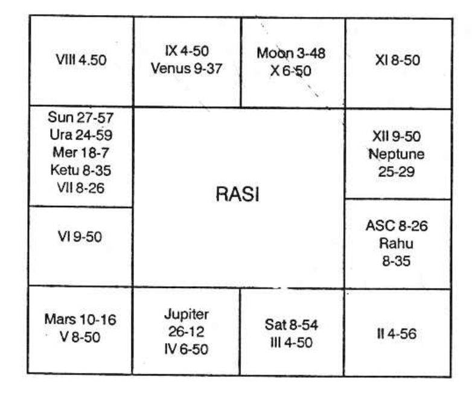

- Sun Dasa balance 2 years 9 months 11 days. Now he is running Jupiter Dasa Ketu Bhukti from 1-12-68.
- (a) Will he be sincere? Benefic in the 4th house, in the constellation of another benefic and sub of a benefic makes one true, reliable, and sincere. In this chart, Jupiter is in the 4th Bhava. It is in Mercury’s star and Jupiter sub. So he cannot afford to entertain evil thoughts.

Westerners claim that Saturn helps concentration. According to their theory, Saturn forms sextile aspect with the ascendant and it promises that he will be able to concentrate. But according to Krishnamurti, mind which is normally ever wavering is never at rest.

Hence, one is to find out the sub lord of the position occupied by Moon. Moon is in 3° 48’ in Taurus. Hence, Moon is in the sub of Saturn. So anyone having Moon in the sub of Saturn can concentrate. This native also will meditate and concentrate. It is possible.

## Will He Be Arrogant?

One can be arrogant only when Mars is connected with the ascendant, or at least with the lord of the ascendant. As Mars has no connection at all, he will neither be arrogant, nor have the egoism. If Mars is in Saturn sub, one will be unassuming and simple. Here, Mars is in Saturn sub. So, he will not have the vices which are to be avoided.

So, when one has no vice, but has the necessary virtues, then we have to judge whether one will have the opportunity to have a good Guruji to initiate; if so, when. The fifth house denotes initiation. It is occupied by Mars. No planet is in Mars' star. The fifth house is owned by Jupiter. Sun alone is in Jupiter's star. Therefore, he will have initiation during Jupiter Dasa, Sun Bukti, Mars Anthra, i.e., in September 1972.

Will He Practise?
Whenever Saturn is in the third house, there will be interruption. Yet, it is the tenth house which shows one’s Yoga, Karma, Yagna, etc. No planet is in the tenth house. Venus is the lord of the tenth cusp. It is in Ketu star, Saturn sub. Therefore, he will practise.

Progress depends on the eleventh house. It is not occupied by any planet. Mercury is the lord of the eleventh cusp. Jupiter alone is in Mercury's star. Therefore, during Jupiter Dasa itself, he will have satisfactory progress. Saturn Dasa follows. Saturn is in Jupiter's sub. Hence, it will continue - progress during Saturn Dasa will be like an inclined plane ever increasing in height.

According to Westerners, Jupiter forming a trine aspect with Neptune in the twelfth house is very favourable for the awakening of spiritual faculties. The inspirational nature will be marked. This aspect is good for material success, worldly pleasures, and vast advancement in spiritual life.

## About Dress

Dress helps you to retain an air of distinction in a party or gathering. You can eat to please yourself; but you have to please others by dress. You may be a great orator. Yet if you do not dress properly people will laugh at you rather than admire your eloquence. For that reason, one should not be the first for fashion nor the last. But one should use comfortable, cheap and tasteful dress. Only fools will have the variety of loving fine clothes and new fashions and value themselves by such dress. Avoid all things extravagant. Exquisite neatness is required. Outsiders can see only how we dress but they can’t see how we live or what we eat.

So, you should be clever in making selection of perfume, cosmetics, dress, etc. Your dress should be much pleasing and also attracting the attention of others. You should have the knack for choosing clothes which are not only attractive but also serving you long; others should try to copy you. To enhance the personality, buy diamonds, jewellery, flowers, etc. Your appearance will be stately if you put on such a colour which suits your birth sign. Dignity is to be maintained.

The colour of the dress varies with the birth sign so also the perfumery, jewels, etc. It is not only the attractive colour that is to be chosen but one should find out, astrologically, such a colour which will bring fortune and which will be helpful to enjoy life with peace and pleasure.

Further, each sign-born should know which day is the best to put on new dress. You should know that one should observe the day when a new thing is used for the first time. One can buy on any day but choice of the day to use it alone should be strictly observed.

If one puts on a new cloth when Moon is in Aswini, one will have the fortune to get more and more dress. If Moon is in Bharani and one uses a new cloth then it will be stolen. If it is in Karthik there is danger from fire. Moon in Rohini improves the bank position. Moon in Mrigasirisha threatens that the dress will be spoiled by rats. If Arudra is the star then one loses money. If the day is Punarvasu, there can be no trouble. Pushyam star promises wealth. Avoid Aslesha which will destroy the cloth. Magham star threatens danger to life. Poorvapalguni day threatens troubles from Government. Uthrapalguni increases income and offers good health. Hastham gives success. Chitra shows that one will have more and more new clothes. Swathi is good for rich food. Visakam increases popularity. Anuradha is for good friendship and social success. Jyeshta shows loss. Moolam star loss of dress in water through dhoby. Poorvashada, health lost. Uthrashada, sumptuous feast. Sravanam star-eye disease. Dhanishta star-good yield from field. Sathabhisha star-danger from poison. Poorvapathrapada star-danger through water. Uthrapathrapada star-child birth; those who have no children make it a point to use new cloth on Uthrapadra star day. Revathi star becomes rich, purchases gems.

Therefore the auspicious stars are Aswini, Rohini, Punarvasu, Pushyam, Uthrapalguni, Hastham, Chitrai, Swathi, Visakam, Anusham, Uthrashada, Danishta, Uthrapathrapada and Revathi.

The inauspicious asterisms are Bharani, Krithika, Mrigasirisha, Arudhra, Ashlesha, Magha, Poorvapalguni, Jyeshta, Moolam, Poorvashada, Sravana, Sathabisha and Poorvapathrapada.

Exceptions:

If a star day is considered to be inauspicious one can use new clothes if the happy occasion is a marriage or birth day at the time when others give them as presents.

## Which Gem Can I Use?

Gems look like fragments of Heaven. They are beautiful, costly, and attractive. Their colors penetrate deeply like the perfumeries. Some believe that by using the gem, the disclosed knowledge is gained by divine grace or supernatural agency. Some believe that one can dodge fate by using them. Such a superstition or belief was transmitted to us from time immemorial.

Thousands of years ago, Aaron, the Priest of Israel, used to put on a breastplate in which 12 different gems were set and these 12 gems were assigned to the 12 signs of the Zodiac, the pathway of the planets in the Heavens. Nowadays, most of the people use the gems mainly for two reasons: it is beautiful and during the time of emergency it can fetch currency. Only some use that particular gem which will suit him or her so that they can have peace, pleasure, prosperity, and success. The fact is that the planets radiate different colors. Each stone is sympathetic to the nature and vibrations of each planet.

* Agate: pleases God; confers wisdom and eloquence; safeguards from deception; strengthens the heart; cures fever, scorpion bites, and snake-bites. Removes obstacles in receiving the legitimate inheritances.
* Amethyst: is a preventive for the evil results of devils and ghosts. If one keeps this gem in the water and drinks, one will be cured from sterility. If one drinks intoxicating liquid and spoils his or her health, by using amethyst one will have his thoughts subdued and gradually give up drinks. Health improves. Warriors become calm and act wisely even during danger.
* Aquamarine: It is very rare gem. It is considered to be a pure one and it was generally given to the girls at the time of their wedding with the belief that both of them can lead a happy and harmonious wedded life. Some believe that Aquamarine prevents one from suffering from the throat, liver, and stomach. Musicians, wise people, and those who lack courage can have advantage by using Aquamarine.
* Beryl: Keep it in water and drink; mutual affection will be increasing.
* Caral: It gives one courage, success in litigation, cure from epidemic disease. It is a preventive for the evil effects of devils and ghosts; it protects one from lightning and thunder.
* Diamond: No doubt a costly one; it makes the wearer purer and more virtuous. It repeals poison, gives firm mind and promises pleasant family life. If a lady puts it round her neck, safe delivery is assured. Diamond also adds beauty to the person and protects the wearer from many diseases.
* Emerald: is used by chaste people. It improves one's memory, retentive power, and reproductive ability. Some believe in grinding emerald to powder and give it as a curative measure for the bites of venomous animals. Some administer it for dysentery, hysteria, and epilepsy. Some believe that one can discover any evil, as emerald will lose its brilliance, if there is deception and treachery. Emerald is best suited for those who undertake higher studies, overseas travel, and foreign trade. It increases domestic happiness.
* Garnet: It is believed that this gem protects one from poison and plague. It contributes for health and peace. It saves one from lightning. There is also this danger in garnet. If a person is not entitled by his birth sign to put garnet, it will bring misfortune. But if proper person uses it, it cures ulcer and inflammation. It improves the business, increases the income, and adds reputation as well as popularity. It is auspicious for the married couple. One can be successful in his dealings with the Government.
* Opal: is generally used by astrologers and such of those who want the power of foresight to enable one to predict. It also improves one's ambition. It is helpful to form permanent tie of friendship. It adds happiness to the married couple. Mediators to settle any dispute will find success by using this gem. One can win in litigation and give fresh life to the business. The brilliance of opal if affected by weather and by humidity whenever it is brilliant and very bright, it is sure that the wearer comes by good fortune.
* Pearl: Pearl is useful to preserve chastity by wearing it round the neck.
* Perth (yellow color): If a person holds it firmly in his hand it will burn the hand. It is useful to cure gout.
* Ruby: It is good for gathering courage and banishing gloom as long as it is bright. It will attract friends and offer good fortune. If the luster is gone, misfortune will follow. Ruby drives out dirty thoughts, give the mind to control passion, allows one to preserve health. It brings good cheer. It helps to form good friendship and also have permanent love.
* Sapphire: It has deep religious significance. Even in olden days it was in use and King Solomon had it set in his jewel. This is dedicated to God. It is useful to maintain harmony and good relationship among the partners. Saints and pious people who would like to concentrate, meditate, and pray to God wear it for the realization of their ambition on the Spiritual side. So it is good for fortune, peace, and pleasure.
* Sardonix: This gem is a carved one. In it some figure is generally engraved. It protects one from poisonous animals, reptiles, and insects. It is used as a curative when one suffers from infectious disease. This gem will be useful to form new good friend, improve self-control, etc. It is also used by lawyers, actors, orators, and educationists.
* Topaz: Topaz is the island in the Red Sea. This gem was first of all found here. It works as a talisman to cure various diseases including mental derangement, hysteria, madness, suicidal tendency, etc. One becomes sane, generous, and wealthy. It is also used in the necklace or in the left arm. One becomes more brilliant and intelligent and leads a peaceful, pleasant, and contented life. Dreams also will be pleasant. There will be real attachment between husband and wife and each will be faithful to the other.
* Turquoise: The meaning of this word is Turkish. It was originally found in Turkey and taken to Europe, later. This is very powerful in curing headache and reducing enmical activity. This gem will also change its color if either the health or life of the person who used it or his life is in danger. As soon as the health is cured and the danger comes to an end this gem regains its original color. It makes one generous, magnanimous, liberal, dutiful, honest, and be a Jupitarian.

Which of the gems can I use? Note the sub-lord of the ascendant and that of the 11th cusp. Note which houses are signified by them. If they are not at all connected in any manner with 6 or 8 or 12 then use that color or that gem which is indicated by the sub-lord of 1 or 11 or both. If the sub-lord of the ascendant or the 11th cusp happens to be the significator of 6 or 8 or 12, reject the color indicated by such a sub-lord. Similarly, one has to make selection of the color and also the metal.
If such a minute calculation could not be done, then one can note the sign in which the ascendant has fallen and one can make his selection according to the gems suitable for each sign as given below:

1. Aries: Amethyst, Diamond
2. Taurus: Emerald
3. Gemini: Aquamarine, Agate
4. Cancer: Ruby
5. Leo: Ruby, Diamond, Sardonix
6. Virgo: Sapphire
7. Libra: Opal, Diamond
8. Scorpio: Topaz
9. Sagittarius: Turquoise
10. Capricorn: Garnet
11. Aquarius: Sapphire, Amethyst
12. Pisces: Aquamarine

If one knows which planet is favourable to him, then according to the nature of the planet he can use that gem, which is mentioned below:

1. Sun: Ruby
2. Moon: Pearl
3. Mars: Coral
4. Mercury: Emerald
5. Jupiter: Topaz
6. Venus: Diamond
7. Saturn: Sapphire
8. Rahu & Ketu: Agate or Turquoise

The metal which is considered to be governed by each planet is as follows:

1. Sun: Gold and Copper
2. Moon: Silver
3. Mars: Copper
4. Mercury: Quick-Silver
5. Venus: Silver and Copper
6. Jupiter: Tin
7. Saturn: Lead
8. Rahu & Ketu: Alloy

## Which houses are we to judge for the engagement of marriage?

The significators of the houses 2, 7, and 11 denote marriage in their conjoined periods. But if the planets which are the significators of 2, 7, or 11 are also the significator of 3 and 9, then marriage will be engaged in their conjoined periods. Because the third house shows the agreement of the native and the ninth house indicates the consent and agreement of the other party.

## To Proceed on Deputation with an Increase in Emoluments

This shows that there is a transfer, a change in the surrounding, colleagues, etc. and also an increase in income. Here, Houses 5, 9, and 11 are to be judged. The significators of 11 will also be the significator of the 12th, denoting life or service in a new place.

## Selection of a Person for a Higher Post

This selection will be given effect to either immediately or at a later date. Yet, once one is selected for a post, it is the decision of the appointing authority and the news is good to the native. Therefore, one will hear about the selection when the significator of the 11th house is also the significator of the 3rd house. Actual promotion will come when the conjoined periods of either the 2nd, 6th, 10th, or 11th house operate.

## Confirmation in a Post

It will be done during the conjunct period of the planet, which is deposited in the sub of the planets in a fixed sign.

## When will the CBI take action 

and find out, without our knowledge, what crime we have committed, what bribe we have received, or what illegal gratification was received? The planets connected with your 10th and 12th houses will operate. When will they take action and suspend us? When the conjoined period of the planets connected with the 5th, 9th, and 12th houses operate.

## When Will One Person's Desire Not Be Fulfilled in Horary?

If the sub-lord of the 11th cusp is retrograde, then whatever the person desires to have will not be had. Ambition cannot be realized.

## How to Find Out Whether a Man Speaks Truth or Not?

Shakespeare has said, “The cheek is apter than the tongue to tell an errand.” This means that truth makes the face of a person who speaks shine. It is the second house which governs the face and also the tongue. 

If the sub-lord of the second cusp is governed by Mars in any manner connected with Mercury, then one speaks untruth. If the sub-lord is Saturn, who is in any manner connected with Mercury, then one hides some news and thereby omits to mention it. 

If the sub-lord is Mercury and no other planet is connected with it, then one gives the information in meticulous detail. If Venus governs, then he is the peacemaker. If Venus is connected with Mercury, then as a peacemaker he will be clever to find out the strength and weakness of both parties. 

If the Sun governs the sub of the second, then one does his duty nobly and never lies. Thus, one is to find out whether one utters a lie, whether one carries the information and presents it correctly, or how he conducts himself.

## How to Find Out Whether One Will Be Economical or a Spendthrift?

Note the sub-lord of the 2nd cusp. If it is either Mars or deposited in the constellation of Mars, one will be a spendthrift. If Mars is also the significator of the 10th house, then one will earn more and also spend more. But if the sub-lord of the 2nd cusp is Saturn, one will be economical. One is overly liberal and spends away much more than one's income if the sub-lord of the 12th is Mars, which is also connected with Jupiter.

## Will I be bold enough to undertake this job?

First one should know whether what they do is right. If they find it is right and if they do not do it then they lack courage. True courage is not the brutal force; but is the firm resolve of virtue and reason.

For this you should judge the sub-lord of the third cusp. It shows consideration of pros and cons. One can weigh the merits and demerits and then take a decision. True courage is the result of reasoning. Resolution lies more in the head than in the veins.

Mental calibre and courage are shown by the third house. Consider the sub-lord of the 3rd house. Any planet being the sub-lord of 3rd is also the significator of 2nd, 10th, or 11th, one will surely undertake, do, come out successful and gain thereby.

## Who is Contented and Who is Not?

A poor man wants only something, and if they are given he is contented. The luxurious person wants many things which he may or may not get, so he cannot have contentment. An avaricious man wants everything, so he will ever remain discontented.

Contentment or otherwise depends on one's mind. The fact is that the contented man is never poor, whereas the discontented person is never rich.

One should judge only the sub-lord of the third cusp. One is never contented if the sub-lord of the third house is Mars. Legitimate and reasonable ambition will be there if the sub-lord is Jupiter, but Saturn shows no ambition at all, nor does it give contentment. Lazy, sluggish temperament or jealousy will be there. Thus, we should judge from the nature of the planets connected with the third cusp in the horary chart.

## When can I get rid of the present partner?

Partner is indicated by the 7th house, permanent tie is shown by the 11th house. The significators of the 6th house show when he will leave. The significator of the 12th house indicate when you will drop him. Also, those significators of the 7th house is in the sub of the significator of the 6th house; one leaves in that period; if the significator of the 7th house is in the sub of 12th, partnership will be broken by you. Or, if the significators of the 7th house is also the significator of the 6th house, then in its period one gets separated. But if the significator of the 7th house is also the significator of the 12th, you sever connection with him. Similarly, the significator of the 11th house indicates.

## When can I have a new partner in business?

You can have a new partner when the period of the planet signifying the 7th house is also the significator of the 11th house and the significator of the 11th should be connected with 2nd or 10th house. Or the significator of the 7th house should be in the sub of the 11th house and the 2nd or 10th.

## Will I meet with any accident in my journey?

You have to consider the 3rd house for a short journey, and the 9th house for a long journey. If the significator of the 3rd house for a short journey and the significator of the 9th house for a long journey happen to be the significator of the 6th and 8th houses, one must meet with an accident. The injury will need hospitalization if it is also the significator of the 12th house.

## When will my tenant vacate?

The 6th house indicates tenant. The 4th and 11th houses counted therefrom, denote the occupation of your house. If he is to vacate, the 3rd from the 6th should operate. Hence the significator of the 8th (3rd from the 6th) should, be connected with the 6th, i.e. the significator of 6th also. Hence during the conjoined period of such of the significators of both 6th and 8th he must vacate.

## When can I get a tenant for my newly built house?

When the period of the significators of 6, 9, and 11 from 6, i.e. 4, conjointly operate. That is, the significators of 6, 9, and 4 must rule conjointly for a time.

## Am I the first person whom the other person loves?

If the lord of the sign, lord of the star and the lord of the sub, of the 8th cusp is your ruling planets at the moment of your birth, then you are not the first. You will be `N` plus 1. You can request the other person if you decide to marry him, to stop with `N` plus one and do not add any more. But if the lord of the sign, the star and the sub of the Ascendant happen to be the ruling planets of yourself at the moment of your birth then you are the first person.

One thing you should also know. From your query the astrologer can find out whether you were in love with anybody else. How?

Sir, if the star lord, sign lord and sub-lord of the second cusp happens to be the lover's ruling planets at the moment of his birth, then you had already intimacy with another person. This person will be `N` plus 1 to you. Oh God! Then to consult an astrologer is dangerous. Really, if one wants to keep his or her secret activities within himself or herself then for them an astrologer is dangerous as per your term.

I have borrowed so much that the liabilities are much more than my assets. Now the creditors bring pressure on me every moment. What shall I do?

Do not consult astrologer at this stage. Go to the court and have relief by filing an insolvency suit after necessary arrangements, etc. with your advocate and friends. Astrologer ought to have been consulted before you borrowed. Then you would have been given proper advice. He knows that poverty is hard but debt is horrible. It is a horror to be going on borrowing like some speculators. To live in a smoky house with ants, cockroaches, rats, scorpions, bugs, mosquitoes and flies or to live with a scolding and violent wife is much better than to live on borrowing. You lose your liberty. When you return home late in the night, your wife submits a list of the creditors who were waiting till late in the night and narrate all what they told. She will exaggerate also. You will be ashamed to see the creditors. You avoid taking the route passing through the creditor's house or office, with great fear you talk to him if accidentally you are met by him. You have to make poor pitiful sneaking excuses. It leads you to utter falsehood and speak lie without any admixture of single truth. Your spirit and virtue are deprived. You are like a squeezed orange. How can it maintain its beautiful shape? Rather you will be like an empty bag. How can you stand erect? Do not you know that out of debts, is out of danger. That is, debt is said to be a danger to one. Hence before proceeding to borrow consult an able astrologer. He will suggest you a time to take the cheque from the creditor, so that loan will not multiply and you will come by fortune to repay that which you have borrowed on the advice of the astrologer.

## Is the 8th House Ever Evil?

It is said that the 8th house indicates receipt of gifts, legacy, money of the deceased, unearned income, insurance, bonus, gratuity, provident fund, arrears of pay, entangled money, etc. Also it is said that the repayment of loan is indicated by the 8th house. If the period of the planet owning and occupying the 8th house operates, will I receive money or will I issue a cheque towards the loan amount which I borrowed?

The 8th house is the second to the 7th and the 7th house indicates those with whom you transact. Either he who pays you or he who receives from you, both are indicated by the 7th house. The 8th house shows the money of the person with whom you transact.

If the significator of the 8th house is also the significator of the 12th house, then you issue the cheque and the other person puts the cheque in his bank. If the significator of the 8th house is also the significator of the 6th and 11th houses, then he gives (6th) and you gain (11th). Therefore, the significator of 8th and 12th show repayment of loan or lending loan whereas the significator of 6th, 8th and 11th indicates gain of money.

## 8 and 12" houses indicate imprisonment:

Is it not? Unless the third house operates, imprisonment will never take place. Imprisonment or confinement in prison means leaving one's permanent place of residence and making a short journey. Therefore, 3, 8, and 12 indicate imprisonment. Detention in one's own house is judged from the houses 4, 8, and 12.

## Will I submit a thesis for a Ph.D.?

You can submit a thesis for a Ph.D. only when the conjoined period of the significators of 4 and 9 operate. If the significator of 9 is also the significator of 11, you will pass and get the Doctorate. But if the significator of 9 is the significator of 12, you cannot come out successful in your attempt. Again, if you add something more and submit again because of Saturn's connection, then if the period of the significator of 9 and 11 operates, you will get through.

Sir, you say that an 11th house indicates success in the examination. When the 4th house shows study, then is not the 11th house 8th to the fourth? Correct. If you pass the examination because of the 11th house significator, does it not mean that the course of study you had due to the fourth house significator ends?

Can you study again the same course when you have completed once?

## According to you, the 5th house is gain to the opponent, but you say that the 5th house significator must operate to make money by speculation. How do you reconcile?

If the significator of the 5th (giving you the mind, money and opportunity to speculate) is also the significator of the 6th and 11th, you gain in speculation. But if the significator of the 5th is the significator of the 8th and 12th, you lose. The 5th house shows the mode of gain or loss. The other houses indicate how you fare.

How to declare that one cannot have a child at all?

Ask for a number within 249. Erect a map for that latitude of the place of judgement. Note the sub lord of the 5th cusp. If it is the significator of the 2nd or 5th or 11th, he will have a child. But if the sub lord of the 5th cusp is the significator of the 1st, 4th or 10th, he can never have a child at all. Houses 1, 4, 10 are detrimental to the birth of children, being the 12th (negation) to houses 2, 5 and 11.

## Can I publish a book?

You must put the query in the following manner: Will I be able to write a book? Will I complete the manuscript? Then you should know if you will be able to publish. Hence you should ask for two numbers. The first will refer to the completion of the book. The second number will indicate whether you can print and publish. 

One can complete writing a book if the significator of the third and the eleventh houses operate and Mercury is in any manner connected with them. It can be published if Jupiter is one of the planets connected with the third and the eleventh house. One can print it only when Mars and Mercury are connected with the third and the eleventh house. Hence the above rule is applicable both to the natal horoscope and to the horary chart. If you take it as a business, then the significator of the third should also be the significator of the tenth house. Even to write articles and hand them over to the publisher, one should have the significator of the third to be the significator of the tenth house also. The tenth house is for earning some money or for having the publicity, or for becoming popular.

## Tap Water from a Well

1. Want to have a well sunk. Should get water even during drought season. Where and when can drive a borewell? First you should know whether you would be going on spending and continuing to drive the borewell till you tap the subsoil water-bearing strata; if it is very deep whether you will patiently preserve or not. Then only the question arises whether you will have it and if so at what depth. Natal Astrology will not help you much. Take Horary. Ask for a number. Query is to be taken as “Will my desire to tap water, within my means be fulfilled?

2. It is said that in the year Paridhabi there will be much of dearth for water. If you want to have water at all times, then it is better to have a well erected in this year as you can go very deep into the earth and never it will get dried up because you operate when the subsoil water bearing strata will be at the bottom most level.

3. Whenever Saturn is in Sathabisha or Ashlesha or Jyeshta or Moola, there will be less of rain and hence the water-bearing strata will go down. At that time you can dig.

4. Again select that year when the year lord is Sun. If you would like to know where to make a bore and at which depth you will get water, you read Brihat Samhita Chapter 54 on the finding of water springs. There are 125 slokas. These give an idea of finding out a place where you can have a well and at what depth you can get water. Also it tells you whether the quantity of water will be copious or not. It also gives you information whether the water will be wholesome, potable and palatable or not. When one goes through all the rules, he will find that it cannot be used where the land is without a plant or tree or anthill.

5. Only when one goes through these slokas, one can realise the difficulty. Further one should try these rules, verify and then give one's opinion. But what I had been doing and I do nowadays is as follows: Ask for a number between one and two hundred and forty-nine. If the sub-lord of the 11th cusp or the lord of the constellation in which the sub-lord of the 11th cusp was situated, were to be in a watery sign, one will tap water. If it is in a barren sign, one cannot tap water. He will leave it. If the sub-lord is deposited in the constellation of Moon or Venus or Mercury, one will get water quickly. If Moon is in any manner connected with Jupiter then there will be copious supply. If Moon is connected with Venus, the water will be sweet and palatable. If Moon is connected with Saturn then the spring will not be sufficient enough to maintain the head and the level of water will fall down quickly, so that one should resort to intermittent pumping. If Saturn and Mars are connected with the sub-lord then there will be free ammonia and much of nitrites threatening that the water has been recently polluted; if it is connected with Mars alone there will be iron in the water; though at the time of pumping the water may appear to be clear, in a few minutes it will turn to be red due to the formation of ferric salts. If Moon is connected with nodes there will be much of sulphates so that the water is both brackish and also there would be much of permanent hardness thereby total solids will be beyond permissible limits. If Saturn and Sun are connected with Moon, the flourine content will be more than 1 part per million and continuously drinking such a water will cause mottied enamel, overgrowth of bones, rigid bones, indigestion and rigid vertebral column. If Mercury is connected with the sub-lord, one will have another well also sunk so that there will be plurality of wells. The depth at which one can get, cannot be predicted by me. It is just like asking how many miles will I travel. Is it a long journey or short journey? Are we to consider the distance or the time taken to cover the distance? One will be able to go to Bombay and come back to Delhi before one who goes to a village near Meerut and come back. Astronauts went to Moon and returned before the train leaving Delhi arrived at Madras in that week. Here who has made a short journey, and who has gone a long journey. Similarly, one may take days to blast the rock and find out water at a depth of 30 feet whereas another can find water even 40 or 50 feet below the ground level and he can tap water much earlier than the other person, who has to bore through the rock. Therefore, it is possible to say whether one can get water with less of exertion or after great efforts. Research must be done to find out the exact depth where one can find water.

6. Sub-soil water level, will be gradually changing according to season.

## Which Child Will Help Me in My Last Days? With Whom Will I Live?

One may have many children and none may help. So the query should be whether I will be a dependent on my children in my old age; if so, which of my children will support me. It is both from the natal horoscope and horary one can find out whether one will have sufficient finance in his old days to meet his expenses or one will borrow or have the deficient amount supplemented by the children or friends.

To know which child will support, one has to note down the dasa and bhukti running. These planets offer the results of the lord of the constellation in which they are deposited. Hence, note down the dasa lord, bhukti lord, the lords of the constellation where they were at the time of birth in the birth chart. That child who has been born with such ruling planets at the time of his birth who happen to be the dasa lord or bhukti lord or the lords of the constellation where the dasa lord and bhukti lord were situated, will support, provided they are advantageous to you, promising help; but if the dasa and bhukti indicate separation then there will be separation from that child then.

In the same dasa ruled by a planet, one child may invite the father to the place of his residence depending on his job. He can keep him and be of great assistance during a particular bhukti. When the bhukti changes, the son will show negligence, silence, and reluctance, and the father will feel embarrassed to further stay. It means the previous bhukti lord promises help whereas the next bhukti lord indicates withdrawal of support. Both the lord of the bhukties will be the ruling planets of that son or daughter, indicating what one experiences through that individual i.e., son or daughter.

Similarly, in a particular dasa a fellow marries a girl. They live happily. But in the same dasa in another bhukti or anthra, there is a difference of opinion; dispute arises and both get separated. This is shown by that sub-lord who operates, whereas dasa lord has both portfolios; i.e. wedding and also separation.

If the sub-period is ruled by the planet connected with harmony and life with wife, then he lives together and her ruling planets at the time of her birth will be the lords of the dasa bhukti or the lords of the constellation in which they are deposited. When separation comes, he gets separated with the same lady. Therefore, now also the period that runs will be governed by her ruling planets; but the sub-period lord will be the significator of 6 or 10 or 12. Therefore, one has to take into consideration the ruling planets of a person with whom we will be friendly or not, who will lend support or not.

## Will that person vote for me or vote against me?

Note the ruling planets of the person about whose action you doubt. If his ruling planets are to support you, i.e., if they happen to be the significator of 6 or 11 you can be sure that he will vote for you. You need not doubt. But if the ruling planet of that person is the significator of your houses 5 and 12 he will vote against you. If the planet is the significator of both 11 and also 12, then find out the sub-sub period which is to run for you. If the sub-sub period lord is connected with 6 or 11 you are sure to get his vote. But if the sub-sub period is ruled by a planet which is the significator of 5 or 12 in that sub-sub period he will vote against.

Have we not seen people who support one now and then the other? It is not his or her wish. It depends on the period which one runs. Therefore the readers should note that the events change according to the lord of the dasa, bhukti, anthra etc. and such an advantageous or disadvantageous results can be had through the friendship or enmity of the person depending on his ruling planets and the houses to which they are the significators.

While comparing the horoscopes of bride and bridegroom, how to predict that this boy will marry only this girl or whether this girl will marry only this boy?

Answer: First of all, erect the horoscope according to my instruction. Judge individually all the horoscope and find out the time of wedding. When the time of marriage of both agree then there is the likelihood of both getting married. But if a chart shows that for years the marriage cannot come up but either of the two will get married now, reject that chart which indicates late marriage on a different date.

Note the significators of marriage in all the charts. If either is running A dasa, B bhukti and C anthra, note whether A, B and C are the ruling planets at the moment of the birth of the other; or the planets deposited in the constellation of A or B or C will be the ruling planets at the moment of the birth of the partner. This is a certainty.

When a child is born, the father runs A Dasa B Bhukti C Anthra and the mother X Dasa Y Bhukti and Z Anthra. The child will have the ruling planets at the moment of the birth which will agree with the period which the father and the mother run or those deposited in the constellation of the dasa lord, bhukti lord and anthra lord. This rule also will never fail.

For a business you may be in search of a partner. A few may come forward. You have to make the selection as follows: When do you take a partner? What are the planets ruling this period? Either these planets or those deposited in the constellation of these lords must be his ruling planet. If the other party's ruling planet is not one of the significators according to your chart then he cannot be your partner. Finally, follow Horary astrology as expounded by me. Ruling planet at the moment of judgement will correctly guide.

Sir, how to find out why a marriage which was about to be settled was prevented from fructifying?

In Horary astrology the querist gives a number and you calculate the nirayana position of the lagna. Exactly 180° away is the seventh cusp. The sub-lord of the 7th cusp should be the significator of the houses 1, 6, 10 or 12. It shows that the marriage will not take place with the party in question. If the sub-lord is not only the significator of 1 or 6 or 10 or 12 but also the significator of 2, then the marriage is stopped due to want of money to meet the expenses. It is mainly due to lack of means. If the sub-lord of 1 or 6 or 10 or 12 is also the sub-lord of the 3rd house, then the marriage is dropped due to interference of neighbours or cousins or due to any information received by the other party, against the interest of the querist. If the sub-lord is also the significator of the 4th house, then the mother is on the way of fixing the marriage; or it may be due to disagreement in giving a house or estate or vehicle. If the sub-lord is also the significator of the 5th house; then the previous love affairs of the querist will be brought to light and due to his bad reputation, the marriage will not take place.

If the sub-lord is also the significator of the 7th, then on hearing that a law suit pending against the querist, the other party will disagree. If the sub-lord is also the significator of the 8th house, then the marriage is stopped as the querist does not get as much dowry as he demands from the other party. Or it may be due to the death of the relative which will be taken as an ill-omen.

If the sub-lord is also the significator of the 9th, marriage will not take place as the party could not come in time and he does not get leave or in a foreign country and could not come or one's examination will be taking place or the relations of the other party will stop it.

If the sub-lord is the significator of both 1 and 10 then the wedding does not come through the interference of elders or officers or superiors or due to his professional status which in the eyes of the other party is inadequate.

If the sub-lord of these houses 1 or 6 or 10 or 12 is also the significator of the 11th house, the marriage is stopped due to the interference of friends or elder brother.

If the sub-lord of the 12th is also the sub-lord of 1 then it is certain that there is some tale carrying, and secret enemies hover round making false propaganda. So the marriage does not come up.

## Why is Lagna Considered Alone?

Dear Sir,

I have noticed in your magazine that for the past couple of years, you have not suggested taking the Moon sign into account if the Lagna is afflicted and the Moon sign is not. Why is this?

Answer: Sir, I had been following the method of taking the unafflicted ascendant or Moon sign. However, in my research, I only understood in late 1965 that when twins are born, the Moon does not move even a single minute, whereas the Lagna alone moves. When my research on the sub-lord yielded diametrically opposite results for the twins, I gave up the idea of taking the Moon sign if the Lagna is afflicted. This needed reconsideration. Therefore, we must take only the exact position of the Lagna, whether it is afflicted or not. If the Lagna is afflicted, then the horoscope has certain defects, and we should not jump to the Moon sign which is auspicious simply because of this defect. After having found this out, I have stopped writing in the manner mentioned by you.

Therefore, I request all readers to take only the Lagna and never the Moon sign, whether the Lagna is afflicted or not. Not only is the Lagna important, but the exact position of all 12 cusps is also important to note the advantageous or disadvantageous results signified by the houses (Bhava). The sub-lord of the cusp above offers the correct solution of that house. The significators show the time of event when the matter will be favourable or not.

## Road to Success

We want peace and pleasure; progress and prosperity. How can we have them? All of us have some weakness or fault or defect in us. Never mind what they are; never worry about them; waste no time in learning them and correcting ourselves. Can anybody have sound sleep having bug in the bed and lice in the head? Do not we try to eradicate them? Similarly, we should take all measures to correct ourselves and cultivate desirable habits. Otherwise, look how they appear in others.

Find out one’s weakness and what he should do. The sign occupied by the lord of the constellation in which the sublord of the Ascendant is situated will give the clue. That is, you note who is the lord of the sub in which the lagna falls. As a planet offers the result of the lord of the constellation in which it is deposited, note in which constellation, the sub lord of the Ascendant is tenanted. Then find out in which sign the lord of the constellation is. The characteristic of that sign is to be understood and noting down the weaknesses one should improve. The argument is that when twins are born within 10 minutes difference and the lagna is in the same sign and in the same star which is it that changes, except the sub in that star. This method is really surprising, correct and useful.

1. If the sub-lord of your Ascendant is in the constellation of a planet in Aries:
You would change your views quite suddenly without any consideration; at last you will realise that such a change has not done any benefit to you. Hence, consider every matter deeply, calmly and wisely. You will not relish others’ suggestion. But cultivate to take the advice of the wise and experienced persons who proceed steadily in all matters. You will be dogmatic in religious matters. You will be a fanatic and an extremist. This will create many enemies and cause varieties of troubles. Whenever you meet with opposition, you lose your temper. Use your militant nature and abuse others. You will sweep aside every obstacle that confronts your way without scrutinising the means you employ to get rid of it. So, give up that fighting tendency and be considerate. Whenever there is litigation about your land or building or the boundary, try to compromise. In married life, do not widen the gap by repeatedly finding fault with your partner for silly things and picking up quarrels. So, have a control over your temper. Do not get elated when someone talks high of you. Consider why he talks so and judge properly. Neither be extravagant nor impulsive. Suppose you do, as you like then you yourself will say that you had wasted a great deal of time, energy and money. Do not you realise that hasty action takes you by wrong route and the whole attempt was a waste? Hurriedly, only one thing which you can do, is to catch flies, as the Russians say. So, cultivate Patience, Perseverance will follow. Prosperity will be the result. But if you never hear others, how can you expect others to answer your call when you need it? That is why, in politics, none can be a successful person for a long term. Always you should have a long range policy. Follow the above advice. Will you do? Then you are the Leader.  
2. If the sub-lord of your Ascendant is in the constellation of a planet in Taurus:
Your feelings will be extremely concentrated and they will create many enemies —all undesirable. Further, hatred and jealousy will be the outcome. You are generally stubborn, rigid and reserved. But there should be the occasions when you should relax also. Always to be very stubborn will surely do you harm. People with this position may be perverse also. It is not as bad as another, born being very obstinate. You do not admit that you are a fatalist. But you are always more or less a fatalist. Do not be very selfish. You are called selfish not for pursuing your own good but for neglecting your neighbour. However virtuous you may be, the virtues will not shine if you are selfish just as the sweet water in the river loses its quality by emptying into the brackish sea water. It is good that you do not lose your temper quickly. But it is very bad of you when you are vindictive, revengeful as you retain it for a long period. Even after some years have passed, you can't forget. The sign Taurus (Bull) represents this also, i.e., even after biting the grass once, it brings back the cud and minces it again and reduces grass to nothing. Thus, due to your slow, steady and solid attack, you do much harm to your opponent. This is too much. You should cultivate forgiving habit. Without any pain and strain you want to do everything easily. You never work hard and are never painstaking. So, you meet with failure. At least necessary activity is essential. Heavens will never help you if you do not act. Be active, you will be happy. Also, do not be over cautious and exasperatingly deliberate. Do not be fond of easiness and thereby develop laziness. Sloths will smother many virtues. When you develop such a habit and lead such a life for some years then, you will find when necessity for work arises, that you are unfit and every thing will appear to be difficult. So, cultivate industry; everything will become easy. So, get up early; be active, cultivate to help others. Forget others’ faults and Forgive. You will be blessed with a pleasant good life.  
3. If the sub-lord of the ascendant is in the constellation of the planet occupying Gemini:
You will be prone to speedy and thorough changes in your point of view. You are deplorably lacking in persistence and also in taking a quick decision in any matter. You will consider the pros and cons, merits and demerits for such a long time that you miss the bus. The father of a Gemini boy suggested his son to select one of the three girls whom he had contacted. Before the Geminian could take a decision, all the three girls got married and when this boy wrote that he would prefer to marry one of them, he was surprised to be informed by the other party “sorry, he was too late”. You do not have the deliberate determination to do any job and stick to it till it is completed. But none can do things more easily, gracefully and successfully than yourself. So also none can be a better adviser than you. When such is the case why should you take undue time to take any decision in your personal matters? The other great defect in you is that when once you have started to do any work, you are very nasty and anxious to know the results then and there. Suppose you have sown some seeds, you will irrigate, nurture and do all that is needed. It is good. But your anxiety or curiosity would be to dig the earth and note then and there, how far it has progressed. As you are intelligent you always find out shortcuts to finish a job. You cannot work in the same way as others do in their routine method. You adopt improved methods to do it quickly. It is, no doubt, advantageous. But you do not take rest; nor you take exercise. Your health fails due to restlessness. So, if you develop coherence, steadiness, quick decision and patience to hear others without resenting their suggestions and give up irritability, impatience, etc., then you will be the best intellectual to offer advice and to successfully complete many projects, big or small.  
4. If the sub-lord of the ascendant is deposited in the constellation of the planet situated in Cancer:
You have the tendency to imagine slights, think over and over again about others' failure in showing courtesy or respect to you. So you have your feelings and get hurt easily. Ignore failures on other's part. As you ponder over again and again before making any attempt, you miss many opportunities like the Gemini occupants. Before you decide which state lottery ticket you can buy, that would have already been drawn. If you will think and think and at last decide to buy a raincoat, the season will end. Hence the delay has not served you any purpose; within yourself, you will feel that your delayed action ended in a waste. You are completely ruled by emotions and imagination. So it leads to a wandering and restless life. Rolling stone never gathers moss. A stenographer applied for a post. To prove his experience, he had enclosed certificates received from the departments where he had served previously. The number of the companies he had served was much more than the number of years of his service, on the whole. You may be moody, so you waste your time, energy, and talent. You always think of the future and worry about money matters. You become old prematurely because of such anxiety from youth. Take out an insurance policy and open a recurring deposit account in a bank. Avoid anxiety.  
It is a pity that you are a constant prey to sensationalism and exaggerated emotion. So for days, you shun your friends and relatives and then emerge out as usual. You have a good memory. You never forget the past. You can tell how you lived in a very poverty-stricken condition in youth and how you built up by steady savings, etc. Again, you will never forget any harm done to you by anybody; nor do you have the mind to forgive. In the case of Scorpio occupants, they then and there retort and forget. But, oh God! You will be going on pinching like a wicked mother-in-law. Hence, read this and improve yourself. God will grant you fortune.  
5. If the sub-lord of your Ascendant is in the constellation of a planet in Leo:
Your thirst for personal glory is unquenchable. Even though you are absolutely unfit to hold a very high responsible position with authority, you are over-ambitious and it is ridiculous. Can everybody expect to marry a princess? You will attack your enemies when unguarded and that too from behind. Even though such tactics are good for a military officer, they are not good in civil life. You should not pose yourself like a lion and attack others. Cultivate being modest and polite. Some authors view that lion is not a warrior but a fraud. You will show favoritism to some. It means you deny the legitimate claim to the other. It is never honorable nor agreeable. You do not consider both sides of the question. You do, as you decide to do. Whenever you are crossed, you become contumacious. Just like the sun is always in direct motion and never retrograde, so also you always go on and on, and never look back. You wrongly feel that those whom you had helped remain ungrateful and over-liberal. So you will be ever in want. Cultivate cutting the coat according to the cloth. You hate mean petty actions and you expect others also to follow your footsteps. Your type is ever in the minority in this world just like the lions among all animals. You become bitter, suspicious, and over-critical as you find that you had been deceived. Otherwise, you are proud; you presume much of self-importance and gradually become arrogant. Hence, other reasonable people view this with contempt. You are over-ambitious; you have your own fears whether you would be overlooked; so, you forcibly make your presence felt. You try to develop the mind to love one and all, universally, and judge things impartially. Avoid forcing conclusions at your own risk. Do not spend away all that you have and all that you get. Manage to maintain a comfortable-sized bank position. Try to have an attractive home. Then you are the king, the uncrowned king.  
6. If the sub-lord of your Ascendant is in the constellation of a planet in Virgo:
Your nature is to be chatty. You will be analytical and during conversation, you generally give disgustingly lengthy descriptions, including all meticulous detail which will be boring to others. You keenly observe others' faults and idiosyncrasies and you find pleasure in passing your remarks. You cannot be at rest until such time the criticism is passed by you. Members of your family will never relish. You should not have nervousness and self-doubt. You are intelligent. You quickly perceive. Yet you need steadiness in going after what you want. Remember, you can achieve your goal only when you avoid changing tactics, now and then whenever needed. Try to complete one work and then take up the other. Your bad habit of consulting everybody and confusing yourself should be given up. Therefore, you should consult only one doctor, only one astrologer, and so on. Otherwise, you will be confused. Develop true consistency of purpose. Forget and forgive others' faults. In married life, unless great care is taken to avoid the failings of your type, there is always the danger of matrimonial shipwreck. You care more for money and hence you will be absorbed in your business. You always think of it, work very hard and return home very late and go next morning very early which creates an impression in your wife's mind that you are indifferent. Hence, your partner looks outside for sympathy and company. So if you continue to live a strongly personal life, it will lead to selfishness and, at the same time, another walk of life will get shattered. Do not neglect hygiene. You need much relaxation. Prefer walking or swimming. If not, keep the company of books which you may relish. Do not waste your energy. Try to encash the same. No man in this world is perfect. So you congratulate yourself for your good qualities and note down your weaknesses. Correct yourself by avoiding the undesirable qualities and your lot will definitely improve.  
7. If the sub-lord of your Ascendant is in the constellation of a planet in Libra:
You have to keep your emotions in check. You should not allow things to get out of your hands. You should not appoint persons of opposite sex as your private secretaries, as you will be wasting much of your time. You generally mix business and pleasure, which will prove to be harmful in the long run.  
You have a fertile brain; many ideas will flash in your mind and they spring up one after another quickly. Therefore, you should try to take quick decisions then and there and act. It is your habit to observe how others dress; also you note the mannerisms of others. You try to copy them and waste a lot; it is advisable to know your ability and have a limit. You are generally unassuming and simple. Therefore, clever people will take advantage of your innocence and try to fool you. So, you have to consider carefully and make the best choices of the associates. You should deal with them carefully because you have a broad outlook and even when you find them to be wrong, you forgive and forget the faults of such people; they may act against your interest; you can come to know of it and forgive them, but don't forget their action.  
You should know what harm is done by a person and how he had misbehaved, understand that the individual cannot be relied upon. You also believe that every new occasion demands a new dress and, therefore, you will spend much more than what you can afford, on cosmetics and perfumes. You should know that God has given you enough charm. A little of the makeup may do, but you do not require so much as you use. You waste money on that score. You have to be very careful with the other sex as you are gentle, soft and weak with the opposite sex; if you remain for a long period unmarried and if you live in a hostel or away from your home for some length of time, then you will be tamed by an unscrupulous person of opposite sex who has desire to dominate and possess you. In case of a woman, the peril is graver. Therefore, try to avoid the company of the other sex. You may have appendicitis or uterus trouble; kidney may be affected. To maintain good health it is necessary for you to take rest and retire whenever you feel like that; have balanced diet; keep yourself cheerful; be happy; enjoy life by listening to light music.  
8. If the sub-lord of your Ascendant is in the constellation of a planet in Scorpio:
You generally over-estimate yourself and thereby invite trouble. You do not care for others’ opinion or how others would receive your criticism. So, it is better to have a control and do not pass any sarcastic remark. You wrongly expect that everybody should be as intelligent as you are. And, therefore, there will be dissatisfaction and irritation. So, do not expect all your subordinates to be either as clever or as hardworking as you are. Don't be over critical; they will feel dejected. So, whenever there are occasions for you to lose your temper, try to overcome them. Whenever you move with ladies, be a little careful; try to avoid the secret enmity of the other sex. Don't stoop to foul play or wrong accounting or any other unlawful action. Even if you have to lose, allow the loss; if you wait for sometime, you can regain all that lost by you. For that purpose, do not adopt any unfair means.  
Do not cultivate the habit of drinking, otherwise you would require a swimming pool of the intoxicating drinks. As you do everything with energy and might, if you are bad, you are really very bad and there is no mistaking about it. Your courage never fails, your will is ever strong and your patience is many-fold stronger than those of others. Don’t make shipwreck of your life, developing into that of a reckless insatiable drinker or heartless profligate. If you are a doctor, generally you give strong dose of medicine weakening the patient's heart while dosing him for rheumatism and also you weaken his digestion. So, always try to give the minimum dose to your patients. Whenever your health fails, you have to strictly follow the instructions of your medical attendant. Whenever you suffer from dysentery etc. you generally take hot stuff with much chilly, pickles etc. You must avoid. In your office, you must avoid mixing with people who advocate to go on strike. If you take any part in it, then you will lead them. Naturally, you will become a social fire-brand and a dangerous person in the eyes of the community.  
9. If the sub-lord of your Ascendant is in the constellation of a planet in Sagittarius:
Generally, you are inherently selfish and inconsiderate. You may lack loyalty and sympathy. You easily forget the good done to you in the past by others. You may do anything to please yourself which may be undesirable and you do not care for your prestige or honour, yet, the faults of your type are not serious. They are flimsy and hence easily pardonable. You will be excused; you do not forget and leave it. You continue to feel jealous and remain vindictive. You are absolutely incapable of uttering a lie cogently and coherently or cheat anybody successfully. You will have no face to meet them again, since you will be caught during your attempts. Otherwise, whenever you talk, you go tangentially and also during the conversation introduce needless extraneous matter which will bore others.  
Lack of purpose, shallowness, lack of ability to concentrate are your weaknesses. You waste a lot, not realising that it is a great sin. You ever waste your energy, your money and also your materials. You go round a circle without serving any purpose.  
You are very courageous and you act; you feel satisfied if the result follows your own boasting. If you are unable to fulfil, if there is opposition, you lose your temper. You have vanity. You do not accept failure. You do not enjoy that much which you can because of your hasty actions.  
You may be indifferent to your family life. You do not attend upon them properly. You create such an impression that you forget to do your duty. It is also not uncommon to commit a blunder while selecting a partner.  
You are in a haste while settling the marriage and later in leisure and in solitude, you repent. Why? You could have gone slow, have some persons in view, observe them before taking a decision and then select the best out of the lot. You may say “Hanging and wiving go by destiny”. Let it be, you try to improve and make your honest attempts to avoid troubles in future. As regards health, you have to take care of your pulmonary system. Bronchitis is your common disease. Do not expose to severe cold. Do not give much of over-activity to your mind or body. There should be a limit in having exercise also. Read the above carefully. Correct yourself properly. Never be in a hurry. Then no more worry. Be ever merry.  
10. If the sub-lord of your Ascendant is in the constellation of a planet in Capricorn:
You are overambitious both to make money and to acquire power. You assert yourself in your work where you serve and you always think of yourself alone. You are not unaware of your worth and your capacity. You are efficient and realistic; you are very selfish, especially in search of power. You contemplate, dream, and you make efforts entertaining hopes. You live on hopes, you are mostly optimistic. But you become desperate and broken-hearted whenever you meet with failure and when there is undue delay in the realization of your ambitions; this leads you to overwork and exert too much. Your health will not permit so much strain. Further, mentally also you always contemplate, meditate, and tax yourself very much. Due to overstrain, you will feel fatigued. You should develop dignity and diplomacy and avoid nervousness and discontent. You have an intense desire to influence others, to manage them, direct them, and also persuade them. You meddle with others in one way or the other. This causes irritation in your friends and also in your close relatives. You must learn to understand and control yourself. As regards sex, you are incorrigible. You should know that you will have the best period between your age of 56 and 70, therefore, you have to be working without much expectation in your early days and ultimately you will find that your patience has paid you amply in the end. You may become lazy and sluggish due to the poor results you have in earlier days; but cultivate activity. Never be worried and be gloomy; otherwise, your digestive system will become weak and flatulence may be caused. Your health is also so fragile and weak that very easily you are upset by pulmonary affection also. It is also not uncommon that people working with much anxiety and overstrain at last suffer from heart disease. None has gained anything by merely worrying. Be active. Do not be selfish. You will have grand success in your life.
11. If the sub-lord of the Ascendant is in the constellation of the planet in Aquarius:
You always prefer solitude; generally, you do not relish being in the midst of a crowd nor work in the midst of a group of workers where there is much noise. You try to be lonely, but you should know that you would become lazy and lethargic when you are left alone. You should cultivate activity and promptness, especially when things do not shape as you expect. What is the use of getting worried or feeling gloomy? Do not be a pessimist; but you have to repeat the process with greater earnestness, when you will surely be successful. You should never lack in the push nor in the courage. Be alert, have confidence, and work with pleasure. You may not follow the tradition; you may act in a way which indicates that the laws are not intended for you. You will not hesitate to do any unusual and irregular things. Even in dress, you are a peculiar person. You have your own individuality and mannerism. You should know that we have to live in a world where we have to keep with certain standards and we have to be one in the society. On some occasions, you have the tendency to vacillate and thereby take a long time to do a thing since you cannot come to a decision before judging the advantages and disadvantages of anything that you have to undertake or do. You may have sluggish circulation of blood, manifesting in cold hands and feet. The best remedy would be to have fresh air and good friendship. It is advisable to walk amidst beautiful scenery with a pleasant companion. Do not be contemplating and planning over and over again; give rest to the mind and to the body. Then a pleasant life is promised.
12. If the sub-lord of the Ascendant is in the constellation of the planet in Pisces:
You have a very bad tendency of brooding over things and becoming gloomy whenever matters don't come up as you expect. All can't have artesian wells. You have to exert yourself, pump, and get water. You also mistake that to whomsoever you have rendered help, they have not reciprocated to you properly in time. Therefore, whatever you want to do for the people, do it without any thought of reward or gratitude. You are sensitive, timid, and afraid of any trouble. There is also another defect in you; you approach friends, one after another, for advice, but later, you do not make use of any of the advice offered to you; you pay no attention to it. It is really very bad. You try to gain sympathy from others by narrating your series of troubles. This ultimately weakens your position.
You are aware that you are moody. So what is the use of worrying for some time and becoming normal again? Never belittle yourself nor be slow in your action; have confidence, be pushful; be generous; you need not be over-liberal; don't entertain hopes on other's promises, as some of them may be fulfilled, whereas others may be found to take promises. Don't be building castles in the air. You should also realize that it is really very difficult for your partner to understand you and equally difficult to cope up with you. Have a control upon your romantic life. Otherwise, like a rudderless boat, you will be drifted on into the sea of sensual pleasures. Every wind which blows, will bring you new experiences to spoil you more and more. You will be very sensitive to the influence of alcohol. Your health will be weak and muscular power deficient. Pay attention to cleanliness of your person, habitation, and clothing. Try to have plenty of fresh air and sunshine. This will react favorably on the emotional and mental plan. A simple vegetarian diet is often advisable, include cereals and fruit. You may develop your psychic power. You will enjoy your life with good health having a large number of friends. Peace and pleasure be upon you.

## Vimshothari Dasa - Udu Dasa

Calculation etc. is given in Reader No. 1. Now in Reader No. 3 let us know the principle and the method to be followed:

The following principle is to be strictly and universally applied. Suppose planet 'D' rules the dasa.

1. What is the nature of the planet? It indicates how the result happens; how a matter is fulfilled. If the dasa lord is Jupiter, and if the result is “gains i.e., profit” one has lawfully by honest means that which one is entitled to it, legitimately, by fair deal he gets. But suppose the dasa lord is Saturn, he gains by foul means, the unaccountable money by receiving under the table or by knocking away without other's knowledge or uttering falsehood or committing forgery, etc. Thus how one enjoys a result is indicated by the general nature of the planet who rules the period or sub period.

2. Which houses are owned by dasa lord ‘D’? Which are the matters signified by those houses owned by dasa lord? (The dasa lord may own only one house or 2 or 3 depending upon the number of cusps falling in the signs owned by them). The source of the results is indicated by the house or houses, owned by it. One may gain or lose, come out successful or meet with failure whatever it is, how this happens, who brings about such results who are the cause or which is the cause is clearly shown by the matters signified by the houses owned by Dasa Lord ‘D’.

3. In which constellation is ‘D’ posited? Who rules this constellation? Which houses are owned by the lord of the constellation? What are the matters signified by those houses. The dasa-lord ‘D’ will predominantly offer those results indicated by the Houses owned by the lord of the constellation in which the dasa lord was posited at birth. Suppose a person is born in Leo. Taurus is the 10th sign. Suppose Meridian is in the beginning of Taurus. Planets in Karthikai ruled by lagnadhipathi give or affect health depending on the sub. One comes out victorious or loses miserably depending on the sub. Planets in Rohini, give changes, threatens loss, or repays loan or invests on property, issues cheques or goes on pilgrimage lives in secluded place or is admitted in the hospital or given a room in the prison. Because Rohini is ruled by Moon who owns the 12th house. The sub decides whether the results are desirable or undesirable. Planets in Mrigasira governed by Mars owning houses 4 and 9 give higher education, professional study, etc.
Suppose to the same Leo-born a planet is in the 12th house Cancer, in Ashlesha ruled by Mercury which owns the houses 2 and 11, he will make profits by speedy turn over, gets married, has a child born, makes new friendship and realises his ambition. Also imagine that a planet, even Mercury lord of 2 and 11, in exaltation in 2nd to Leo, is in Hastham star, he enjoys such results- mostly-as is indicated by the planet in Rohini. [Readers must observe, study and ultimately agree. One sharebroker lost all he had during Mercury dasa [Lagna Leo-Mercury in Virgo in 10 - 36’)]

4. If the sub occupied by the planet ‘D’, the dasanatha, belongs to a benefic, there is no disappointment. The native realises it. But if the sub belongs to a malefic, in its conjoined period, it does harm, it denies, disappoints and causes anxiety, misery, etc.

5. If the dasa lord is a benefic and the bhukti lord is also a benefic, as judged above, and if they form, according to Western system good aspects among themselves, one enjoys.

6. If the dasa lord ‘D’ is a benefic according to its occupation of a constellation belonging to a planet, owning good houses and if it forms evil aspect with another benefic, in the subperiod of the latter in the dasa of ‘D’, every matter will appear to be advantageous but ultimately, one cannot enjoy any beneficial result. It will cause delay; it will deny and disappoint.

7. If the dasa lord is a malefic by occupying the constellation of an evil planet, and the bhukti lord is similarly a malefic their good aspect is dangerous. It is similar to two common enemies agree to cooperate with each other, become friends and both jointly attack the native.

8. If the dasa lord is a malefic and it receives adverse aspect from another malefic, the ultimate result is favourable to the native during their conjoined period.

9. Do not be carried away by kendra, kona, shasta ashtama and so on. The above rules strictly observed will prove to be correct, provided the cusps are also included.

10. The cusp receiving good aspect improves the matters of the house. The cusp exclusively indicates that house matters alone. But planets, in any manner connected with the matters of those houses have something more to offer, by lordship, by constellation, sub and house. Thus, if one judges, one can get the clue even in twin births where their experiences are opposite.

In the text books available, the literature is not sufficient to categorically predict the events in ‘A’ dasa and ‘B’ bhukti. Such rules which are available, unfortunately, fails in the case of births at short intervals in the same Lagna.
The general rules given in Padma Deepika by Mantreswara are as follows (these are general, but K.R. does not advocate these, as they fail):

1. Results of Dasas of Planets in Retrogression, own sign, Exaltation and Friend's camp:
   1. During the period of the lord of Lagna, if Janma Lagna of the native be strong, he will enjoy prosperity like the waxing Moon. He will have increased wealth. His bodily strength will improve. He will have worldly fame. His complexion will be good.
   2. During the dasa of the Lord of the second house, the marriage of the native will take place if he is not already married. If married, good-natured daughters will be born. He will get wholesome food. His profession will be through speech (lawyer, teaching and the like). He will be an eloquent speaker. He will acquire wealth.
   3. If the 3rd bhava be strong, during the dasa of the Lord of that bhava, the native will receive help through brothers. He will be always hearing of good and auspicious things. He will act courageously. He will have good command over men. He will win the affections of great men. He will serve the public well. He will be in possession of virtuous qualities.
   4. During the period of the lord of the 4th house, the native will receive help through relatives. He will get good income through land. He will have association with the other sex. He will have pleasure through conveyance. He will acquire a new house and/or land. He will accumulate wealth. His prestige in profession will increase.
   5. During the dasa of the lord of the 5th house, the native will be blessed with the birth of children. His relatives will be happy. He will give timely and useful advice to government. He will be the recipient of royal favour. He will get wholesome food. He will receive praise from great men in recognition of his good deeds and hospitality.
   6. During the period of the lord of the 6th house, he will overcome his enemies tactfully. He will be free from diseases. He will have a noble outlook. He will possess rare courage. He will have much wealth.
   7. During the period of the lord of the 7th house, the native will effect purchases of clothes and ornaments. He will have comfortable bedding. His vitality will increase and he will derive pleasure from sexual union. He will experience pleasure through celebration of marriages and other auspicious functions in the house. He will make journeys and pilgrimages.
   8. The period of the powerful lord of the 8th house will be marked by rise in the prestige of the native. He will clear his debts. He will have no quarrel with anybody. He will get income through cattle and servants.
   9. During the dasa of the lord or the 9th house, the native will enjoy good fortune and will have long-lasting happiness with his wife, children, grand-children and near and dear relatives. He will be favoured by Government. He will be engaged in virtuous acts and divine worship.
   10. During the period of the lord of the 10th house, the native will realise the successful completion of all acts of benefience commenced during the dasa. He will have honourable means of livelihood. He will engage himself in acts of lasting benefit to mankind and earn name and fame for himself.
   11. During the dasa of the lord of the 11th house, the native will enjoy unmitigated wealth. He will have happy association with friends, relatives and servants. He will experience increased happiness with his wife and children.
   12. During the period of the lord of the 12th house, the native will spend his wealth on virtuous acts. He will be inclined to do auspicious rites. He will be the recipient of royal favour.
2. Results of Dasas of Planets in inimical signs, in Debilitation, in eclipse and posited in 6th, 8th or 12th House
   1. During the dasa of the lord of lagna posited in 6th, 8th or 12th house, the native will lead the life of a recluse. He will be bodily and mentally afflicted. He will engage himself in funeral rites. He will have change of place. He will have change of position for the worse. He will experience danger.
   2. The lord of the 2nd house posited in 6th, 8th or 12th house will make the native act foolishly in public and in the midst of respectable persons. He will indulge in harsh words. He will be miserable at home. He will receive discouraging letters. He will suffer from eye disease. He will incur wasteful expenditure. He will court royal displeasure.
   3. The lord of the 3rd house posited in 6th, 8th or 12th house will cause during his dasa death or misery to the brothers of the native. Bad thoughts will always cross his mind. He will experience secret inimical activities, insults and loss of pride through respected persons.
   4. During the dasa of the lord of the 4th house, if afflicted, the native's mother will suffer from illness. He will receive news of death of near and dear relatives. There will be sale of house or lands. There will be loss of cattle. He will experience danger through water.
   5. The lord of the 5th house, if weak, will cause danger to the child of the native. He will experience mental affliction. He will be the victim of deception. He will have disease of the stomach. He will incur royal displeasure. There will be loss of energy. He will be roaming about.
   6. The lord of a weak 6th house, during his dasa will cause fear through robbers. There will be danger and imprisonment. He will commit sinful acts. He will be engaged in servile acts. He will receive insults. He will have bodily injury. He will experience loss of prestige.
   7. The lord of the 7th house, devoid of strength, will cause to the native, during his period, sorrow through his son-in-law. He will be away from his wife. He will experience danger through women. He will evince a desire for indecent things. He will suffer from disease in his private part. He will feel the strain of out-door life.
   8. During the dasa of the lord of 8th house, if weak, the native will experience mental anguish and depression. He will be arrogant and jealous. He will be stricken with poverty. He will be roaming about aimlessly. He will experience loss of prestige. He will suffer from illness, shame and danger.
   9. A weak 9th house lord during his period will cause evil results to the native. He will incur the wrath of his family deity. Danger will be caused to his wife and children, father and preceptor. He will be disposed to do vile acts. He will be stricken with poverty.
   10. A weak 10th house lord during his period will make the native engage himself in unproductive and fruitless activities. The native will experience loss of reputation. He will have evil disposition. He will live in a foreign place. He will undergo danger through indulging in ignoble deeds.
   11. During the dasa of the lord of the 11th house the native will hear unpleasant and sinful news. He will experience misery through brothers. He will be stricken with poverty. He will suffer from ear trouble.
   12. During the dasa of the lord of 12th there will be all round decrease in wealth and prosperity to the native. He will suffer from increased illness. He will experience loss of reputation. He will undergo danger like the waning Moon.
3. 
   1. A planet that has attained Vargottamamsa will do well during its dasa. If that planet is eclipsed or in debilitation, mixed results will be enjoyed during the dasa of that planet. If that planet happens to be the lord of 6th, 8th or 12th house then bad results are to be predicted.
   2. During the dasa of a benefic planet, the bhukti of the lord of the 3rd, 5th and 7th star to the star of birth and the bhukti of the lords of 1st and 8th houses will cause misery through robber and the enemy and the native will undergo lot of troubles.
   3. Counting from the Dasa of the native at the time of birth, if the 4th dasa be Saturn, the 6th Jupiter, the 5th Mars or Rahu, then these dasas will prove harmful. Likewise, the dasa of a planet at the end of a Rasi (i.e. if posited at 30°) and the dasa of the Lord of 6th, 8th or 12th house will be harmful.
   4. If Capricorn happens to be the 10th or 11th house and if Mars were to be posited therein which is its house of exaltation, then during the dasa of this planet the native will have all-round prosperity, victory over enemies and vehicular comforts. He will command an army, will attain high status in life and will have a charitable disposition. Note: Natives born in Aries and Pisces will have Capricorn as the 10th & 11th houses respectively. If in their horoscope Mars were to be posited in Capricorn and if Mars dasa, be not the 5th dasa, then the results enumerated above will be enjoyed by the native during Mars dasa.
   5. If Venus is posited in his exaltation sign Pisces and if Pisces happened to be the 12th, 10th or 11th house then, during Venus dasa, if he is not eclipsed or associated with malefics, the native will enjoy good reputation, will possess great wisdom and intellect, will obtain costly ornaments and pearls and will be very wealthy and popular. Note. The above result is applicable to the natives who have Aries, Taurus or Gemini as Lagna.
   6. Benefic planets in debilitation or posited in the 6th, 8th or 12th house will give inauspicious results during their dasas. Malefic planets similarly situated will give inescapable misery during their Dasas. Note: From the above the inference is that the inauspicious results effected by benefic planets could be warded off by performance of Shanti whereas the misery caused by malefic planets will certainly have to be experienced and cannot be warded off by performance of Shantis, etc.
   7. During the Bhukti of a planet who is inimical to Dasa lord or who is posited in enemy's camp of the Dasa lord or who is inimical to Lagna lord the native will experience fear from enemy. There will be change of dwelling or profession. Even the erstwhile friend will turn out to be an enemy.
   8. During the period of the Bhuktinatha, the result experienced will be that of the Bhava in which the Bhukthinatha is placed, counted from the house of the Dasanatha. If the enemy’s camp of the Dasa lord happens to be 6th, 8th or 12th house, the native will have inauspicious results. If in other houses, the results will be good.
   9. If a planet is posited in his house of exaltation, Moolathrikona, own house, friend’s house, enemy's camp or in debilitation, the auspicious results experienced by the native will be full, three quarters, half quarter, very little and negligible, respectively. If the planet is to give inauspicious results, then the proportion given above will be reversed, i.e. in the house of exaltation inauspicious result is zero, in Moolathrikona very little, own house one-fourth friend’s house one-half, enemy’s camp three quarters and in debilitation full. Further, if the planet is eclipsed, the result that will be obtained will be as for the planet in debilitation.
   10. Death will occur to the native during the period of the planet which is the weakest of the following and when Saturn transits evil signs: 
       - Saturn, Gulika, Rahu, Lord of 22nd Drekkana (counted from the Drekkana at the time of the birth), Lord of 8th or,
       - Lord of Navamsa of Saturn, Gulika, Rahu, Lord of 22nd Drekkana and Lord of 8th.
   11. Death will occur to the native during the period in the strongest of the following and when Jupiter transits the trine of the sign and navamsa of the lord of 8th.
       - Lord of sign and navamsa in which the lord of 8th is posited, lord of 22nd Drekkana and Janma Drekkana.
   12. During the dasas of Jupiter, if the lord of Chandra lagna and the lord of Janmalagna occupy kendra positions, the result will be enjoyed in the middle of the dasa. Planets situated in Prishtodaya Rasis will give their results at the end of the Dasa, those in Udayodhaya rasi in the middle of the Dasa and those in Sirshodaya rasis at the beginning of the Dasa.  
       Note:
       1. Aries, Taurus, Cancer, Sagittarius and Capricorn are Prishtodaya Rasis.
       2. Gemini, Leo, Virgo, Libra, Scorpio and Aquarius are Sirshodaya Rasis.
       3. Pisces is Ubadhaya Rasi.
   4. The Dasa lord transiting in a Bhava counted from the Chandra Lagna happens to be his own house, exaltation house or friend's camp then he gives strength to that bhava. Further, in nativity, if the Dasa lord was strong, he will give strength during his dasa in whichever bhava he transits.
   5. In nativity if the Dasa lord is eclipsed or is in debilitation or posited in enemy's camp, then during his dasa, he spoils the bhava in which he transits, counted from Chandra lagna.
   6. If Moon, during his transit passes through the Dasa lord's exaltation sign, friend's sign or the 3°, 6°, 10°, 11°, 5°, 9° and 7° house of the Dasanatha, he will improve the auspicious results. If he transits in other houses the results will be reversed.
   7. When the Bhuktinatha, during transit, passes its house of debilitation or enemy's camp or is eclipsed, he will cause misery. On the other hand, if the Bukthinatha, during its transit, passes through its exaltation house or own house or if he is retrograde, he will give auspicious results.
   8. When Sun transits the exaltation sign of the lord of the benefic dasa the native will get the good results of the dasa lord. Similarly is the case of Jupiter's transit. On the other hand, when Sun transits the debilitation sign or enemy's camp of the lord of the malefic dasa, the native will experience bad results of the dasa lord.
   9. Rahu will give good or bad results according to the good or bad effects attributed to the planet with which it is conjoined. The planet that is conjoined with Rahu even if he be a benefic will cause misery particularly at the end of the dasa.
   10. The 2° and 4° house and the 7° house are death inflicting houses. If the lords of the 2° or 7° house be strong and if posited in the same 2° or 7° house then that planet will cause death during his dasa. If the lord of 8° or 12° house be very weak and if posited in 2° or 7° house this planet will cause death during his dasa.
   11. If the Lord of a quadrant be a benefic he will give bad results during his dasa. On the other hand, if he be a malefic, good results will accrue. If the lord of 3°, 6° or 11° even though he be a benefic he will cause only misery during his dasa. If the lord of the 8° house happens to be the Lagna lord also, then he will give good results during his dasa.
   12. Kendra lord posited in Kona and a kona lord posited in Kendra will cause yoga. These two planets during their dasas and bhuktis will act in co-operation with each other and will give yoga.
   13. All planets do not give good or bad results attributed to their bhava during their dasas or bhuktis.
   14. All planets will give good or bad results associated with their dasas in the bhuktis of planets that are conjoined with them, or aspect them. Also results similar to those associated with the Dasa lord will be experienced in the Bhuktis of planets that are by lordship placed similar to dasa lord.
   15. The association of a strong quadrant or trine lord will cause yoga even though these planets become malefic by virtue of their lordship of the other house.
   16. If a strong kendra lord gets the association of any one of kona lord, then the associated planet gives raja yoga.
   17. If the same planet be the quadrant as well as the trine lord, then that planet cause raja yoga. If, in addition to this, this planet gets the association of another trine lord, there is certainly no doubt about the raja yoga result.
   18. Planets, even though they become malefic by lordship of the 3°, 6°, 8° or 11° house, will give raja yoga results according to the results indicated in their Bhukthis if they get the association of the yoga - producing planets.
   19. A trine lord, if he does not happen to own the 3°, 6° or 41° house also, will give auspicious results during the sub period of kendrathipathi even though the planet does not get the association of the kendrathipathi.
   20. Jupiter and Venus by virtue of their lordship of houses 1, 4, 7 and 10 are strong in doing harm. The harmful effects are intensified if they also happen to occupy Marakasthanas 2 and 7; Mercury as lord of Kendra is next to Jupiter and Venus in the order of strength in doing harm. Next to Mercury in strength to do harm is Moon. But malefics, if they happen to own houses 1, 4,7 and 10 will increase the good effects.
   21. Rahu and Ketu, if posited in Kendra or Kona, will give tajayoga based on the association of the Lord of Kendra or Kona with the planets.
   22. Rahu and Ketu, if posited in an auspicious rasi and unassociated with any other planet, will give rajayoga results during the period of benefic planets.
   23. During the period of planets producing raja yoga the beginning of the raja yoga will take place. This beginning will be improved upon during the sub period of malefic planets.
   24. The planet that is posited in the 8° house, the planet that aspects the 8° house, the lord of the house where Gulika is posited all these will cause misery. Among these planets the weakest planet will cause danger during its period and sub period.
   25. The period of planet that has left its exaltation sign and is in a house on its way to its depressing sign is termed Avarohi. The period of a planet that is posited in its exaltation sign or friend's camp is termed Madhya. The period of a planet that has left its depression sign and is in a house on its way to its exaltation sign is termed Arohini. The period of a planet in its debilitation sign, enemy's camp, in debilitation navamsa or inimical navamsa is termed Athama.
   26. Death will be caused during the period of the week planet by the planet posited in the 12° bhava and the lord of the 12° bhava.
   27. While judging the results, occasionally interpretations are found to be incorrect. Doubts arise. So they are discussed below.

## Kendra Adhipathyana

Q: What is Kendra Adhipathyam? Are benefics, by nature, owning Kendra signs, always evil in their dasas? Do they invariably end one's life?

Answer: "Kendra" is a Sanskrit word. It is also called Chatustaya and Kantaka. The sign in which the Ascendant (Lagna) falls, the fourth sign counted from the birth sign, the seventh sign from the Ascendant (Lagna) and the tenth sign counted from the Ascendant are termed Kendra signs or Kendra houses. It may also be used with reference to the position of the sign occupied by Moon or other planets. On such occasions, it is said that a planet is in a Kendra to Moon or in a Kendra to any other planet. By that, it is meant that they are conjoined with it in the same sign, or in the fourth, seventh or tenth signs counted from the sign occupied by the Moon or any other planet.

1. The exact longitude of the Ascendant in a sign or that of the Moon is not at all taken for calculation. But only the sign in which the Ascendant falls is taken whether it is zero degree one minute or 29 degrees 59 minutes in that sign. So also when counted from Moon or any other planet, only the sign occupied will be taken for judgment and not the Bhava (the House). In most of the horoscopes, the first part of a sign may be included in a House (or Bhava); whether the planet is in the first part or in the second part of the Sign and in whichever house it is, it is not at all taken to find Kendrasthana, but only the sign in which the planet is found. For example: There are two births. One is born in Mithuna Lagna in the 29th degree and the other in the 3rd degree in Pisces (Meena) Lagna. The former has Moon in the second degree in Sagittarius (Dhanus), and the latter has Moon in the 25th degree in Gemini (Mithuna). In the first instance, Moon is said to be in the seventh Kendra even though the longitude is only 153 degrees and in the other case, the longitude is 112 degrees and Moon is said to be in the fourth Kendra.

In the first birth chart, as Gemini happens to be the Lagna, the Kendra houses are Gemini (the First), Virgo (the Fourth), Sagittarius (the Seventh) and Pisces (Meena the Tenth). In the second case, Pisces the Lagna is called Lagna Kendra, Gemini the fourth, Virgo the seventh and Sagittarius the tenth Kendra.

Meridian according to one's latitude of birth may fall in the neighbouring sign to the tenth sign; yet the tenth sign alone should be taken as the Kendra sign. For example, one may be born in the second degree in Cancer (Kataka Lagna) at Lucknow. Actually, the meridian will be 24 degrees (Meena) Pisces. But, yet Mesha should be taken as the tenth sign or otherwise called Dasama Kendra House and not Pisces (Meena) as calculations are made, sign to sign and not house (Bhava) to house.

Therefore, when one counts the Kendrasthanas from Lagna, the Ascendant, the fourth sign, the seventh sign and the tenth sign are the four Kendra houses. Each sign has its own lord and the owners of the first, fourth, seventh and tenth houses are called as Kendra-Athi-Pathis. When one desires to assess the nature of a planet, whether it is a benefic or a malefic by owning a Kendra house, it is to be counted only from the Lagna and not from the Moon or any other planet.

It is said that Jupiter (Guru), Venus (Sukra), the waxing Moon (Chandra) and the unafflicted Mercury (Budha) are the natural benefics and if they happen to own either the first or the fourth or the seventh or the tenth house, they turn out to be unfavourable in their disposition. It is also added that if they occupy either the second or the seventh house, they cause untoward results and death to the native. It is further stressed that Jupiter and Venus are more evil than Moon and Mercury when they own the Kendra signs.

The malefics by nature, Sun (Surya), waning Moon, Mars (Sewai), afflicted Mercury (Budha), and Saturn by owning the Kendra houses become auspicious and will offer desirable results.

Kendrathipatya Dosha refers only to one's health and longevity, whereas it will not prove to be either ineffective or undesirable as regards the results indicated by the houses they own. Ascendant denotes one's health and longevity. Lord of the Ascendant will invariably protect the native and improve his health and position provided he does not occupy the evil houses i.e., sixth or eighth or twelfth. Lord of the fourth house indicates one's permanent possession, one's vehicle and one's mother. The seventh house shows the characteristics of the partner in life, the time of marriage, and other matters indicated by the seventh house. The tenth house indicates one's profession, name, fame, reputation, honour, ancestral property, etc.

When one does research, taking the horoscopes of people born in Mithuna (Gemini) and in Virgo (Kanni), Mercury is considered to be a Kendhrathipathi by owning the Kendra houses, one and four for Gemini-born and one and ten for Virgo; Jupiter (Guru) becomes the owner of the seventh and the tenth houses to Gemini and fourth as well as the seventh houses to Virgo. People born in Gemini generally take up a profession indicated by Jupiter being lord of ten and prosper, especially during Jupiter's Dasa. One is born in Mrigasirisha Nakshathra third pada when Gemini was rising in the east. When he completed 22 years during Guru dasa, he appeared for the competitive examination and passed the I.A.S. at the first attempt itself. He got married at his age of 26 during Mercury sub-period he had a child born in Visaka Nakshathra (Jupiter's star in Venus sign Libra). The birth of the child coincided with his promotion. During Mars sub-period he enjoyed another promotion and during Rahu sub-period he had the opportunity to go overseas. Horoscopes of such favourable experiences show that Kendrathipathya does not make a planet necessarily evil, offering only adverse and unfortunate results, even though there are a few instances of death during the Dasa or Bhukti of the Kendradhipathi.

Many with their Ascendant in Virgo (Kanni) having Jupiter in the second or in the seventh house have out-lived Jupiter Dasa. Similarly, many people born in Aquarius (Kumba), Leo (Simha) and Scorpio (Vrischika) have Venus in the second or in the seventh house. They also enjoyed satisfactorily during Venus Dasa and a few are now running Sun Dasa, a few Moon Dasa, and a few Mars Dasa, etc. Therefore, one need not unnecessarily entertain any fear when an astrologer repeats the proverbial Kendrathipathya Dosha of Jupiter and Venus and says that they are very evil and one will not survive these Dasas. They will be at a loss if they come across with people out-living such so-called Kendrathipati's Dasa. Dy. Prime Minister Shri Morarji Bhai Desai aged 75, Dr. A. Lakshmanaswami Mudaliar aged 85, Sir Dr. A. Ramaswamy Mudaliar aged 85.

A person born in Aquarius Ascendant (Kumba Lagna) and Poorvabatra Patha (Purattadhi) Nakshatra third Pada (Kumba Rasi) was able to have his own car only when he entered into Venus Dasa (who owns the fourth Kendra house) at his age of 52, whereas in the earlier Dasas he could not own even a bicycle. How far Venus as Lord of four has denied him the beneficial results which it indicates by owning the fourth house, is for you, to judge.
Another person born in Scorpio as Ascendant and in Jyeshta Nakshathra third pada gets married during Venus Dasa, Jupiter sub period (Bhukti-apahara) and Mercury sub sub-period (anthara) with a bride born in Poorvashada Nakshathra, Lord of which is Venus. Has Venus as Lord of seven denied him the pleasure through marriage in his Dasa? Also, who is the lord of the constellation Poorvashada in which the bride is born? Is it not Venus? Yes, as the lord of 7, it has done its good, by offering the person a beautiful wife born in its own star.

It is known that the Lord of the eighth house is the worst evil, but the exception is that the lord of 8th house cannot be a malefic if it is also owns the Ascendant or Lagna (Jathakchandrika) when the 8th house indicates one’s longevity, death, etc. When such an evil can be warded off by owning the first house, why will not Kendrathipatya Dhosha be mitigated if a planet owning either the 4th or the tenth house also happens to be the lord of the Ascendant or Lagna? We are of strong conviction that planets owning the Ascendant and not ill-posited can never do harm, but ever be a saviour just as a father will protect his child, whether he is a butcher or a robber.

It is also mentioned that a planet becomes evil by owning 3rd, 6th, 8th, or 11th house; if they have any connection with Rajayoga Athipathis either as Lord of 9 or Lord of 10, they also will cause beneficial results in their sub-periods, in the Dasa of the Rajayoga Athipathi. From this, one can understand that Lord of 10 is capable of rendering the evil planets favourable. Lord of 10 is to offer the most desirable and lucky results causing Rajayoga. Therefore, if they own any other Kendra house they not only offer beneficial results indicated by the 10th house but also reduce the evil attributed to the results of the other Kendra house. For example, to Gemini Lagna, Jupiter is Lord of 7 and 10. He will invariably do good to the native in matters relating to the 10th house and to a great extent modify any evil indicated by the 7th house, if Jupiter is not afflicted otherwise.

Therefore, only when they own the houses 4th and 7th they may be considered as evil for one’s health as well as longevity and not to the other results denoted by the 4th or the 7th house.

### Doubt 2

Have you heard people say that the birth of a child at an auspicious time may modify the troublesome period of the father and bring him fortune; the favourable and lucky period to the wife will compensate for the miserable one of the partner; and that marrying a girl in whose horoscope birth of children is strongly indicated, will be advantageous for a man of evil influence unfavourable to the begetting of children? What is your opinion?

Answer: I differ, it is not correct to say that the varying fortunes of the parents get modified by the birth of the child. Whatever a native is to enjoy or suffer from is already pre-destined, and it will run its own course. Birth of children on a particular date is also already found in his horoscope. If one enjoys luck only after the birth of a particular child, it is clear that according to his own horoscope, the evil days have ended and lucky days have started; unless this statement is correct, he cannot have a child at the commencement of his fortunate days. The birth of the child at the auspicious moment and the beginning of his brilliant times are indicated in his map.

If fate is otherwise termed as something written on the head by Brahma, then the Creator will not be going on changing the fate as and when one elects a propitious time to undertake any venture or by marrying or by birth of children, etc. Once written is never erased or modified.

If a person is to suffer, while his wife has to enjoy favourable results, according to their horoscopes, each will have the results as indicated by the planets at the time of their birth, and one cannot cancel the other’s fortune or misfortune. If ‘A’ has married ‘B’ and ‘A’ runs the most unfavourable period, whereas ‘B’ has a lucky time, and if both were to go to races and bet, ‘A’ will be going on losing, whereas ‘B’ will gain. The loss of ‘A’ cannot be prevented by 'B’. Nor the benefits to 'B’ can be robbed away by the evil influence of ‘A’.

If the husband's chart denies children and the wife’s chart promises many issues according to the prediction offered by an Astrologer, we have to say that the so-called Astrologer has not understood the science of Astrology, or there is something wrong somewhere. Anyhow, when an expert Astrologer were to scrutinise the horoscopes, he will boldly declare that both the horoscopes indicate birth of children or the children born may be a ‘ara Putra” or natural children. But, to say that marrying a lady whose horoscope promises children whereas that of her husband has no clear indication of it, is not wise.

Therefore, one’s luck or ill-luck cannot be altered or modified, by electing a propitious time for the commencement of any venture, or by marrying one, or by birth of children, and so on. Everything is an occurrence as predestined.

It is correct to predict that a native will go overseas at the age of 26, and he will have a child at his 25th year of age, whereas it is not wise to say that because the native had a child at a brilliant time at his age of 25, it is due to the luck of the child the father had the fortune to go overseas. In the wife’s chart, it will be shown that the husband will go overseas; in the boy's chart, planet will portray that the father will go overseas at his birth anniversary, and in his own chart, he will find that he has to go overseas at the age of 26.

If the results may be compared to that of a flower, then the indications from each chart may be compared to the light thrown from the torch (horoscope). Nobody's light can change the flower to fruit or to seed. Every light will show that it is a flower. Similarly, every horoscope will indicate the same result and never change it.

### Doubt 3

Except for the Sun and Moon, each planet is assigned two houses. If a planet, owning two houses, occupies a particular sign in the chart of a person, and if its dasa operates, what will be the nature of the results enjoyed by him? Is it the result of the houses owned by the planet, or that occupied by it? Or is it the result of the first house which it owns in the first half of its period and that of the other house, ruled by it in the second half? The results of which house will be favourable and which will prove to be evil? Or will both be good or both be bad?

Answer: Sun owns the house Leo (Simha) and Moon rules Cancer (Kataka). Mars governs Aries (Mesha) and Scorpio (Vrischikam), Mercury is assigned Gemini (Mithuna) and Virgo (Kanni), Jupiter governs Sagittarius (Dhanus) and Pisces (Meena), Venus rules over Taurus (Rishaba) and Libra (Thulam), and Saturn owns Capricorn (Makaram) and Aquarius (Kumba). Rahu and Ketu are omitted by the Westerners but Hindus include them, though they have not agreed in allotting any house for them.

There is difference of opinion about their ownership. Let us confine ourselves to these seven planets who also rule the seven days in the week. The owners of a house indicate the source of certain results, as each house governs certain affairs. So, it is necessary to note for what houses counted from the ascendant, the planet in question is the lord, whichever house it may accidentally occupy, at the time of the birth of the native. For example, to Vrischika Lagna, Saturn is the lord of the third and the fourth houses, and whatever may be the house it occupies, Saturn has, by its lordship, the strength to give the results through the sources signified by the third and the fourth houses (i.e. brothers and mother; short journeys and permanent place of residence; communication and transport respectively). The same Saturn if it is in its own constellation to Mithuna Lagna-Gemini Ascendant, will be the lord of the 8th and 9th houses, and so Saturn as lord of 8th indicates mental worries, difficulties, sickness and mode of death whereas lord of 9th it shows Father (according to Hindus which is to be followed), higher education, long journey, overseas, etc. In the case of Scorpio or Vrischika Lagna Saturn in its own constellation shows gain or loss, through brother as lord of 3, and through mother as lord of 4. To Gemini-borns gain or loss through father as lord 9, and through insurance, bonus, gratuity, legacy, etc., as lord of 8 are indicated. Also friendship or enmity with such a relative, is indicated by lordship. Favourable or unfavourable results are to be judged by the house which it occupies. Here, the question is whether it is favourable to the native of the chart or adverse to him; and also to the matters or relatives indicated by the houses owned by the planet? One is to note the various houses owned by a planet and include this also into account while interpreting the results.

The results of the house occupied by a planet will be indicated more by the planet which occupies the house, than by that which owns the house. In giving the results of a house, the planet occupying it is considered as the strongest. The owner is taken as next only in strength. The results of the house occupied by the planet will get modified by the planet which aspects it, and also by the planet which is conjoined with the lord and which aspects the lord of the house.

If a planet occupies a sign which is the 6th or the 8th or the 12th from the sign which it owns, it loses strength to offer such results as are indicated by that house, but will give results just opposite to the indications of the house owned by it.

1. If the 6th house indicates dispute and drain of purse, the 6th therefrom shows harmony, friendship and profit which is the 12th from the ascendant. If the 8th house denotes obstacles, hindrance and difficulties, the 8th to the eighth denotes “Sahaya”, assistance and courage. If the 12th house shows loss the 12th to the 12th house shows gains, by that, it may be observed that planets occupying a sign which is 6th or 8th or 12th to what it owns, will offer results opposite to what they indicate by ownership.
Lord of 1st shows health. If he occupies the 6th house, it indicates ill-health to the native. If it occupies the 8th, longevity is not much promised. If it is 12th, he will spend away whatever he has, and the planet does not allow him to continue to live in his own place and keep up the bank position.
2. The occupant is stronger than the owner of the sign:
a. only when the lord of the sign does not gain more strength by occupying its exalted sign or by being Vargothama
b. when the lord of the sign is not conjoined with the planet or is occupying its other sign, and
c. when the occupant is exalted, whether the owner is in its own sign, or exaltation or Vargothamamsa.
3. The occupant is weaker than the owner:
a. if the occupant is in its enemy's camp or neecha, i.e., debilitated.
b. If the lord of the sign is exalted and the occupant is not,
c. If the lord of the sign is conjoined with the planet in its own sign and the occupant is not exalted there i.e., the owner is in swakshethra, whereas the occupant is neither exalted nor Vargothama there.

For example, if Moon and Jupiter are conjoined in Cancer (Katakam), moon, even though it is in its own sign, yet the exalted Jupiter is stronger in giving the results (in its period) indicated by the house Cancer (Katakam) than what Moon can do in its period. Mars and Moon conjoined in Cancer denote that Moon is stronger. Moon's exaltation in Taurus (Rishaba) and Jupiter exalted in Cancer (Kataka) and Venus exalted in Pisces (Meena) in a horoscope, indicate that Jupiter, the tenant, will give the results of the house Cancer in his period, much more than Moon who rules Cancer; the results indicated by Taurus to that native will be offered by Moon, as he occupies, to a greater extent, in its period, than Venus, the lord of the Sign; Venus bestows on him the results indicated by Pisces (Meena) to a greater extent, that Jupiter who owns the house, in Venus periods, than what he enjoys in Jupiter's periods and sub-periods. That is, if the strength of the planets remains more or less the same by their occupation, then the occupant is really stronger than the owner in offering the results of the house to that person, whenever its periods and sub-periods operate.
The results of the house given by the planet occupying a house will be modified by its nature, ownership of the house, and other connections, like conjunction with, or aspect from other planets.

Nature of the planet: If the lord of the 3rd house is in the 11th and its period is running, then he will gain (11th house) through his brother (3rd house). If the owner of the third house is Saturn, then the brother who helps him will be economical and calculative (nature of Saturn), whereas if the third house is ruled by Mars, the help will be received with pleasant surprise and the brother will be extravagant, and over-liberal (nature of Mars). Jupiter as lord of the 2nd in 11th indicates gains by lawful means (nature of Jupiter), whereas Saturn as lord of the 2nd in 11th, may give profit by fair or foul means (nature of Saturn). So, the nature of the planet also should be included when one interprets the results.

Ownership of various houses: Again the ownership of a house suggests, through which source he will have the gain or loss. If the lord of the 5th is in the 11th, one can predict that at the time he runs the period of the lord of the 5th house who is in 11th, the person will have the gains through speculation or cinema or pleasurable pursuits or through children, as these are indicated by the 5th house. So, the occupant offers the results of the house it occupies including the above indication.

Let us see how the results of the house it owns, will improve or get destroyed. If it is either weaker or stronger than the planet occupying its house, or if there is no planet in its house then one is to note the relative disposition between this planet and the houses it owns. If it is not in 6th, 8th, or 12th from the house which it owns, it will give the results of the house in the manner which the house indicates. But if it occupies a sign 6th, 8th, or 12th from the house it owns, the planet will give adverse results to the matters indicated by the house.

Suppose one’s Lagna is Scorpio (Vrischika) and Saturn, the lord of the 3rd and the 4th houses, occupies the 11th house Kanni (Virgo), then the matters indicated by the 3rd house, will flourish, as it is in the 9th from the 3rd house, and it is a very favourable disposition. But during the period of Saturn the matters indicated by the 4th house will suffer. The 4th house indicates mother, the 8th from it is the 11th house. So, mother will have difficulties and worries though the native will gain then through brother. The native may study in a school and he may receive a letter from the mother that she is ill, and also money order remitted by her, whereas the younger brother may write saying, that he has got a seat in the college for higher studies, or that he is selected to go overseas. Here the mother will send money and not brother, because it is only to the 4th house, the 11th house happens to be the 8th. But to the 3rd house, it is the 9th. His purse cannot be drained. Brother and correspondence (indicated by the 3rd house) give him pleasure, (shown by the 11th house).

Further, one having lord of the 3rd in 11th, may have gains through editing, publishing, publicity, correspondence, or working as a sales representative, agent, or by making short journeys or through youngsters and neighbours. Further the 3rd house results also will thrive, and brother will have prosperity. But the lord of the 4th house, while occupying the 11th house, is in the 8th from its own. In such cases, the native, no doubt, will gain through the 4th house matters i.e., he may gain through permanent possessions, through mother (according to Hindus, which alone is to be followed) and also by dealing in vehicles, etc., or through produce of mine. But mother's health will be affected and her mind will be disturbed.

Similarly, Saturn as lord of the 6th and 7th occupying the 11th house shows that he may come out successful in the litigation, which will end in that planet's sub-period, whereas his partner may have a child born at that time, as 11th house is the 5th from the 7th.

Therefore one has to note whether the planet which occupies a beneficial house in the chart, is in the 6th, 8th, or 12th from the house which it owns or occupies a favourable position from its house. If the house occupied happens to be 6th, 8th, or 12th from the house which it rules, the indications of the house which it governs, will turn contrary; otherwise through the matters indicated by the other house the native will gain.

If the house occupied is favourable to one of the houses owned by the occupant, and unfavourable to the other, then, not only will he gain through the house to which the planet is in a favourable position, but also the results of the house owned by the planet, will prosper. But if the house occupied is unfavourable to its own house, the results of the house owned will suffer, deteriorate and the relatives, indicated by that house, will undergo difficulties, when the native runs the period of the planet. These results will not operate throughout one's lifetime. They can be enjoyed only when its period runs.

If the planet may be compared to a light, the house it occupies to that of a coloured slide (the colour depending on the house), then, the extent of the result will depend on the strength of the planet, and the source of the result will be indicated by both the houses which it owns, and its Karakathvam, i.e., certain matters and events of which the planet is the chief governor. The nature of the result will depend on the house it occupies. As per Krishnamurthi Padhdhati, the nature depends mainly on the lord of the constellation. The occupation will show gain or loss, whereas the house owned shows the source. It is similar to the light which illuminates the slide, and throws that colour of the slide, indicating the house occupied.

House — Vacant: If a house is not occupied at all, then the owner of the house, the planets aspecting the house, indicate the results of the house. They will get modified by the planets which conjoin or aspect the lord of the house. According to Krishnamurti Padhdhati, planets in the constellation of the lord of the house will bestow the matters signified by that vacant house.

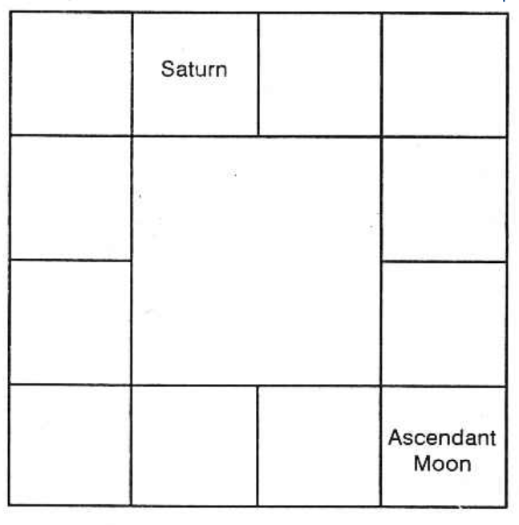

A father is born in Virgo Ascendant (Kanni Lagna) and he runs Sani Dasa (Saturn's period). His Nakshatra is Chithra 1* pada, and Moon occupies the Ascendant. At the time of birth, Saturn was in Aries and in the 8th house. In this instance, one is to interpret as follows:

- Saturn owns Capricorn and it is the 5th house from the Lagna, Virgo. By occupying Aries, it squares the 5th house. (Various authors have declared that planets, evil by nature occupying the 4th or the 8th house, spoil the results of the house and will do harm to that native). Hence, difficulties experienced by the person, will be related to, and signified by, the 5th house. Thus he loses in games and incurs loss through his children, especially the first issue. His son will not keep mental equilibrium and good health. He will be worried about his self-acquisition. (Saturn also owns the second from the 5th house). Saturn as lord of 6 in the 8th, forms favourable aspect with its house from the 8th, and hence he will have to raise loan, and he will not find it difficult to do so, as the disposition is favourable.

If a planet owns both the house of profit and that of loss in its period, during the sub-period of beneficial planets, he will then gain, and during the sub-period of the evil planets, he will lose. Some divide the period into two halves, and predict that, during the first half of the period, the planet will be giving such results as are indicated by the house which is nearer to the ascendant, counting the houses from lagna, 1, 2, 3 and so on and the second half of the period will indicate the results governed by the other house. For example, if Jupiter owns the 5th and the 8th houses to the ascendant Leo (Simha), it is incorrect to foresee that the first half of Jupiter's period will be good, because it will be the results of the 5th house, Dhanus-Sagittarius, and the second half of the period will be harmful, as it is the effect of the 8th house Pisces. Actually, he has not enjoyed anything during the first half of Jupiter’s period, except during Mercury sub-period. Whereas Venus, Moon and Rahu sub-periods, covering most of the second half of Jupiter's Dasa, proved to be very auspicious, by giving marriage, promotion, children, voyage with family to foreign land and satisfactory increase in income, by keeping him in good cheer, and by making him feel jubilant, buoyant, and contented.

Some are of the opinion that the beneficial effects which result by owning a favourable house, will get cancelled, as it owns the unfavourable one also. This statement is not correct. He will have both the results experienced. He will gain through one source and also lose through the other source. In his ledger, he should have two entries, one crediting to his account and another debiting him. It will not pass on without giving both the results. The ultimate balance sheet may show zero. If one house denotes health, and the other house threatens accident, during its period, and the sub-period of an evil planet, he will meet with an accident and have some injuries and during the sub-period of a beneficial planet, he will have the cure and maintain good health. The good results of a house will not get cancelled by the evil results of the bad house, if a planet owns both the houses.

Malefics in 4th, 6th, 8th and 12th to any house, will destroy the indications of the house, whereas planets in other houses, improve the matters of the house.

### Doubt 4

Will a native born at a time, having Raja yoga in his horoscope, enjoy the yoga results throughout his life? Does the Raja yoga promise no difficulties to him and will he lead a princely and aristocratic life throughout?

Answer: Hindus alone judge the prosperity of a horoscope considering the various yogas present in it. The ancient Hindu astrologers have mentioned (a) certain combinations of planets, or (b) lords of certain houses, or (c) the relative disposition of a planet to the ascendant, or to the Moon are termed as Rajayogas, and such combinations will produce most brilliant results. Those who are born in the royal family will become Emperors and those born in the middle class family will attain power, be popular and prosperous, enjoying all the fruits of life in this world.

It is regrettable that the readings given by a few of the present astrologers who reproduce the slokas relating to the yoga, without considering whether or not all the conditions mentioned therein fit in with the charts they have taken for reading, and have translated those slokas only which are pleasing to the consultant at the time of going through them, and do not mention about the unpleasant things indicated therein. But the beneficial results predicted do not come to pass. People, having similar combinations of planets, will be quoted by these astrologers, to arouse confidence in the minds of the consultant, without going into greater detail as to why, in their cases, events came true, while in the case of the querist, similar favourable results have not come about in spite of strong planetary combinations, indicating Rajayoga and the other planets occupying different houses.

There are a few important facts which are to be taken into consideration. A thorough study is needed:

1. One should note circumstances, environments and surroundings, under which a native is born.
2. Whether in his life time, he runs the Dasa of the planets which cause Rajayoga.
3. Whether there are planets in 6 or 8 or 12 to the planet producing Rajayoga.
4. Whether the planet causing Rajayoga is conjoined with Nodes, Rahu or Ketu or with lords of 6, 8 and 12.
5. Whether Rahu or Ketu occupies the sign owned by the planet which produces Rajayoga.
6. Whether he will live to the age at which the mutual dasas and bhuktis of the planets, producing Rajayoga will operate, and lord of 6 or 8 or 12 is not conjoined with them; or majority of planets are not in 6 or 8 or 12.
7. Whether the planet producing Rajayoga is not in the constellation (nakshathra) of the fords of 6 or 8 or 12, to them or in their sub.

It is said that person who has Rajayoga by the combination of a few planets, will have the following results—“The person who has his birth in Rajayoga will be a king who will be accompanied by elephants, horses, litters, palanquins and the like, the roaring of the kettle drums and the sounds of the conch shell with a circular umbrella made of soft woolen cloth, held over him, praised by bards and ministrel, and solicited by eminent men with various kinds of presents in their hands. The person will enjoy all comforts in the company of many beautiful damsels”. Honestly, the majority of these can be noticed, when some people, belonging to a few Indian communities, pass away and use such drums and conch shells, umbrella, palanquin, or cot, etc. But one should consider how many can become kings, though not of a country, yet at least at home, where normally they can be. How long can they continue to be so? And in a country where brothel is more or less eradicated, how can one be in the company of many damsels. Has he no other work?

The astrologer has to consider the limitations and then assess the extent to which the combination can do good to the native. If he were to interpret correctly, in the majority of the cases, where the other planets are not strong, and very favourably posited, but only this yoga exists, he can predict that the native will get over all the difficulties he had suffered from the time, the Rajayoga planet commences to operate and during its period he will be able to realise his ambition and fulfil his desire. He may enjoy desirable results, and look forward to a satisfactory advancement in his life. The percentage of improvement may be common to those, having the same Rajayoga, but the extent of its enjoyment will vary according to the environments in which he is born. A person, worth a million, may be having a lakh as profit for a year, whereas, another with a similar planetary combination born at the same time, in a middle class family, can have a few thousands or hundreds a year. The swelling in the little finger, due to witlow, will be proportionately less than the swelling in the thumb, when the witlow affects the thumb.

1. A person may not see the bright days at all in his life time, and pass away, if he does not run the period of the planets which cause such a Rajayoga.
2. Planets in 6, 8 or 12 to the planet producing Rajayoga, will destroy the beneficial results in their sub-periods in the dasa of the Rajayoga planet and in their periods the Rajayoga results will be absolutely absent. (Vipareetha Rajayoga is exempted).
3. Lords of 6 or 8 or 12, conjoined with planets producing Rajayoga will rob away the beneficial results of the yoga adhipathis.

Let us take, for example, one who is born with Aries as his ascendant, and Moon and Mars posited in Kumbha (Aquarius). The combination of Moon and Mars termed as Chandramangala yoga, has to produce favourable results to him. It will not be correct to argue that this native will become an engineer and will amass wealth due to this yoga.

An astrologer should first note the nakshatra in which he is born, what dasa he has at the time of birth, and what dasas follow. Next, he has to find out in what age, he will enter into the dasa of the yoga-producing planets. In this case, even if one born with Moon in the first degree of Kumbha of Aquarius, he can enjoy the period of Mars to a maximum of 3¾ years during his life time; then he can have Moon dasa only after 96¾ years of his age. If one would have been born when Moon was at the 30th degree of Kumbha (Aquarius), then he would have had 4 years of Jupiter dasa to start with and only at the age of 69, he will enter into Moon dasa. Therefore this native would not have become an engineer or earned and saved money as an engineer, because of Moon/Mars combination. A yoga caused by two planets will be enjoyed only when their periods operate in one’s lifetime.

There is a Rajayoga in a person's chart, it does not guarantee that he will never suffer in his life, and that he will ever prosper.

### Doubt 5

SWA BHUKTI

At present, I am running Saturn dasa Venus bhukti. During Saturn dasa, Saturn bhukti, in those three years and three days, on the whole, I was fortunate. My salary was increased satisfactorily and my status also improved very much.

A student of astrology threatened me saying: “If a planet does good to a person in its swa-bhukti, i.e., own Bhukti (own sub-period); the remaining eight sub-periods will be harmful.” Is it a fact? What is your opinion and scientific explanation?

Answer: The statement of that student may be forgotten. That is incomplete and incorrect. Let me suggest to you the best method of finding out the beneficial sub-periods and also the adverse ones.

1. Have your horoscope correctly cast.
2. Have a dasa-bhukti reference table in which the period of Saturn bhukti running for three years and three days is sub-divided and let the duration of each antara of sub-sub-period be also calculated and submitted for your use.
3. From your diary, note down in which antara (sub-sub-period) you had fortune and in which antara you had disagreeable results. Similar results alone will repeat when their bhukties operate for longer periods.

Suppose, you entered Saturn dasa on 10-3-1956. The first sub-period, otherwise called bhukti or apahara, is ruled by Saturn, the dasa lord himself, for 3 years and 3 days from 10-3-56. So, from 10-3-56, you had Saturn dasa, Saturn bhukti. Then, for 2 years 8 months and 9 days from 13-3-59 to 22-11-61 Saturn dasa, Mercury bhukti operated. For 1 year 1 month and 9 days from 22-11-61 to 1-1-63, Saturn dasa Ketu bhukti had been running.

Then in Saturn dasa of 19 years from 1-1-63 to 1-3-66 Venus bhukti, from 1-3-66 to 13-2-67 Sun bhukti, from 13-2-67 to 10-9-68 Moon bhukti, from 13-9-68 to 22-10-69 Mars bhukti, from 22-10-69 to 28-8-72 Rahu bhukti and finally, from 28-8-72 to 10-3-75 Jupiter bhukti.

If you sub-divide Saturn bhukti in Saturn dasa, Saturn antara extends from 10-3-56 to 1-9-56. Saturn bhukti Mercury antara 1-9-56 to 4-2-57 Saturn bhukti Ketu antara 4-2-57 to 8-4-57 Saturn bhukti Venus antara 8-4-57 to 8-10-57 Saturn bhukti Sun antara 8-10-57 to 2-12-57 Saturn bhukti Moon antara 2-12-57 to 3-3-58 Saturn bhukti Mars antara 3-3-58 to 6-5-58 Saturn bhukti Rahu antara 6-5-58 to 18-10-58 Saturn bhukti Jupiter antara 18-10-58 to 13-3-59

Note all the events between 10-3-56 and 13-3-59. Suppose you had promotion in January, 1957, it was in the fag end of Mercury sub-sub-period. Therefore, during Saturn dasa, Mercury sub-period (or bhukti) which ran between 13-3-59 and 22-11-61, in the last portion, you ought to have been promoted. If during Saturn dasa, Saturn bhukti, Ketu antara, running between 4-2-57 and 8-4-57, if any of your close relatives had passed an anxious time, then mostly the same person or a similar relative will again cause anxiety during Saturn dasa, Ketu bhukti in between 22-11-61 and 1-1-63.

If during Venus sub-sub-period between 8-4-57 and 8-10-57 you had your wedding, during Venus Bhukti, between 1-1-63 and 1-3-66, you will lead a happy and harmonious life with your wife. Or, if you had fallen in love in the middle of 1957, then in Venus bhukti, it will be intimate and marriage will take place.

If during the next sub-sub-period of Sun between 8-10-57 and 2-12-57 you were transferred to a mining department, then during Sun bhukti, you will surely have a decent promotion in such a department. If during Moon's sub-sub period, your younger sister got married, then during Moon bhukti, between 13-2-67 and 13-9-68, she will lead a pleasant life and she may give birth to a child.

If during Mars sub-sub period, between 3-3-58 and 6-5-58 you purchased a plot of land with the idea of constructing a house at a later date, you will surely build one during Mars bhukti, between 13-9-68 and 22-10-69. If Saturn dasa, Saturn bhukti, Rahu antara, caused you trouble through eczema; you can look for similar troubles in Saturn dasa, Rahu bhukti, between 22-10-69 and 28-8-72.

If you had a child in Saturn dasa; Saturn bhukti, Jupiter antara, between 18-10-58 and 13-3-59, the child will be fortunate when you run Saturn dasa, Jupiter bhukti between 28-8-72 and 10-3-75.

### Will it be correct?

Why not? Any event in your life is indicated by the relative position between two planets, or one planet and the cusp of a house. They are the significators and they indicate the results. Such occurrences will happen to you whenever those planets jointly rule your time. Similar ones will repeat whenever their periods again and again operate.

This is the simplest and most accurate method of finding out how the dasa will be, provided your horoscope is correct. There are many general rules. They should not be strictly applied; modifications are many and they are to be included. When a particular dasa runs for many years, during that period, by transit, all the planets move in many signs and houses. They will indicate separately some results. By progression, Moon will be forming various aspects. Other planets also will form some aspects. They will only confirm the results obtained by following the simplest method suggested by me. There will never be a contradictory indication; they will agree. That is the wonder of vimshodhari system.

Suppose one runs Saturn dasa, Saturn bhukti and Saturn transits in the 8th house, or happens to be ardhaashtama (the 4th), or there is seven and a half years Saturn otherwise called sade-sati one should not conclude that the time is evil and the person will suffer. There are various other aspects to be taken for consideration before passing a judgment.

For beginners my suggestion is the best, fairly accurate and the simplest. An author has said that if a planet were to offer Rajayoga result and has also to cause Maraka, it gives the yoga first and then alone death. By that, the author means that the Rajayoga planet is your strong benefic and hence it allows you to enjoy the fruits of this life to your satisfaction and then alone, it will do harm to your life. Even in law, there are many rules. The spirit of the law is to be properly understood. One has to apply it properly and be practical. Analytical study, correct intuition and good judgement are needed for successful astrologers. Good astrologers will have in their horoscopes strong and favourable Mercury conferring all the qualities of a good astrologer. Moon-natives, devoid of beneficial aspects from Mercury, cannot become scientific astrologers. Moon may be compared to a mirror and Mercury to a lens. Moon can simply reproduce those which are committed to memory, just as a mirror shows the image of the object without any alteration or improvement. But a lens is different. So also, unlike Moon, Mercury gives sharp intelligence, thorough study, practical application and correct judgment.

Read the results given by sages for the sub-periods of Jupiter in Jupiter dasa, Mercury bhukti in Mercury dasa, Venus bhukti in Venus dasa, and so on. All the authors give pleasant results. Why? They are natural benefics. For you, Saturn, by ownership becomes a benefic. Further, note down whether the entire period of two years, one month and eighteen days of Jupiter bhukti, in Jupiter dasa was good. No, only certain sub-sub-periods in Jupiter bhukti would have been favourable while a few might have been troublesome. Yet, on the whole, it will be good. If you observe, you will understand that the antaras of those planets which were good in Jupiter bhukti, will prove to be very beneficial to a great extent when their bhuktis in Jupiter dasa operate. Similarly, the adverse antaras of the few planets will be undesirable during their bhuktis to a great extent.

A thorough study of Dasa system, progression and annual horoscope are needed to pass correct judgment. As proper and exhaustive explanation is needed and each may cover many pages, separate books on “Dasa Phala Nirnayam”, “Progression”, and “Annual Horoscope” will be published one after the other if possible by me or by my son guided by me.

## Progression

What is Progression?

The birth chart, or the Radix, is the fountain from which springs events in one's life. What is promised in the radical chart in accordance with one's karma will unfold itself in the form of good or bad events at some time or other in one's life. Hindu sages have devised several methods to predict the time of events, of which the Udu (Nakshathra) Dasa system propounded by Maharishi Parasara is most widely followed. In the West, however, they resort to a system known as Progression or Directions to find out when the events indicated by the natural horoscope will crystallize.

The planets are ever moving in the Zodiac, each in its own orbit and are never stationary though at times they appear to be standing or still, retrograde as viewed from the Earth. No two planets perform a revolution in the Zodiac in the same period, speed being varied. Thus, when we observe from the Earth a planet sometimes appears to overtake and pass another planet, then stop and later begin to move forward. After birth, the planets move away, each at a different rate, from the original positions occupied by them at the time of birth. In this process, they take up new places in the signs (Zodiac) and in the houses wherefrom they form certain aspects not only among themselves producing certain events in the mundane sphere but to their own radical positions, the positions of other planets at birth and to other sensitive points in the radical horoscope such as the Fortuna and the cusps of the houses. The movement of the planets after birth measures the time when the events denoted by the birth chart will culminate. This motion of the planets after birth is called Progression.

The birth horoscope is all important. The progressed horoscope is only a projection of the birth chart and indicates the changes taking place in the individual within the imposed limits at birth. As Sepharlimits says, “It is the root in the soil which the tree of life grows”.

Progression is one of the useful methods to time events. In India, we mainly follow the Vimshodhari Dasa system which offers astoundingly accurate results when Krishnamurti Padhdhati is employed. Progression can help supplement the Udu Dasa system. Transits also serve a very useful purpose in finding out the actual month and date when a certain event will crystallize.

A separate book on progression is being published shortly.

## Annual Horoscope

A horoscope is erected for the moment when the Sun during its course comes back to the original degree, minute, and second of the zodiac where it was at the time of the birth of a native. To find out such a moment, it is necessary to have the ephemeris of that year for which one is to read the results and erect a map for that year. But those who follow Krishnamurti Padhdhati find the difference in the ayanamsa between the year of birth and the year chosen for the annual horoscope, add this to the Sayana in of Sun at birth, and note the time when Sun comes to this position.

Using the ephemeris and Raphael's Table of Houses, one has to calculate, deduct the Ayanamsa given by Krishnamurti, and make out a map. [Only when an ephemeris with “Sayana position of planets” is used, the above exercise is needed.]

It may be asked, at the moment when Sun enters into the original degree and minute, if the person were to be in a foreign place, then how to erect the horoscope; is it for the latitude and longitude of the birth place or are we to take the latitude and longitude of the place where the person is at that time? We have to erect only to the locality where the person is at that moment and not the original birth place.

While judging the annual horoscope, the astrologer has to give the orb (a range) of 5° for the aspects among Sun and Moon, and the aspects among the major planets should be only 2°. The conjunction, the opposition, the trine, etc., give only one degree. Other aspects are considered to be weak.

Compare the original horoscope with the position of the planets for that particular year. Beneficial aspects between those in the radical chart and in the annual horoscope promise fortune in that year. The position of the luminaries Sun and Moon are considered to be vital. If either of the luminaries were to be either in 1, 4, 7, or 10 and if they form good aspects with each other, then the coming year is to be declared as a fortunate one. If the majority of planets are deposited in the angles, it is also an indication that the year is an important one. If Jupiter or Venus or lord of 2, 10, or 11 were to occupy the 10th house or both exactly in the meridian and if they also receive beneficial aspects either from Sun or Moon, that promises prosperity in that year. But if the lagna is occupied by Saturn, Mars, Rahu, or Ketu or Uranus and Neptune, then it indicates that in that year there will be disease, difficulty, dispute, debt, etc. If evil planets occupy the 6th house and also form evil aspect to lagna, it is sure that one will suffer in that year both in health condition and in financial position.

Luminaries Sun and Moon, if they are conjoined with benefics both by nature and by lordship, the year is in general a pleasant one. Moon, if it were to be afflicted by malefics, then it is a bad year. If Moon with Mercury or Uranus happen to occupy the lagna bhava, then the native will be making frequent travels and he cannot stick on to one place. If they occupy the 12th house along with lord of 2 or 10, he will have a change in the profession. Saturn has a peculiarity. Whenever it occupies the lagna bhava, the chronic disease from which one had been suffering will in that year frequently flare up and cause misfortune.

If lord of lagna occupies the 7th house in the annual map, there is a chance for marriage. If one is already married, if the wife had gone on camp or tour, she will come and rejoin. The lord of the 2nd house in the annual map, if it were to be either in lagna or the 10th or the 11th house, it shows peace, pleasure, and prosperity. If lord of 5 has such similar disposition and if it receives good aspects from the lords of 2, 6, and 11, one can come by fortune, unexpected advantages will accrue. If the lord of 8 were to occupy either the lagna or the 6th house, there is always difficulty and danger. If lord of lagna similarly occupies 6 or 8 and if it is afflicted, it is also dangerous. If the lagna in the annual horoscope happens to be the 7th house in the radical horoscope, then that year will prove to be adverse.

If Moon or lord of 12th were to occupy the 9th house, it indicates long journey, overseas, and life in a foreign place; if evil planet with Mercury owning the 12th house is afflicted and occupies the 7th house, one will lose by transaction or by theft or cheating.

To find out the time of an event according to an annual horoscope, it is said that every result in one's life is indicated by at least a house and a planet. Therefore, whenever the luminaries either conjoin or square or oppose a planet, one will face difficulties. But if the Sun, Moon, and the significator form beneficial aspects to the house signifying the matter in query, or if they form good aspects with the lords of those houses, then his desire will be fulfilled. 

So one has to take the transit of the planets from the moment of the erection of the horoscope till it again comes to the same degree next year. One has to judge taking into consideration the various aspects formed by the transiting planets to the position of the planets erected in the annual horoscope, and this is what the Westerners generally do.

In the Hindu system, Kalidas has given one in the book Uthra Kalamirtham. There is another system, 'Tajik'. Let me give what Kalidas says. Erect the horoscope as mentioned above. Give importance to the position of the Moon at that moment. Calculate the portion that is to be covered by the Moon. Work out the following periods as the dasa period of the planets for that year: Sun is allotted 110 days, Moon 60 days, Mars 32, Mercury 40, Jupiter 45, Venus 56, Saturn 4, Rahu 5, and Lagna 10 days. These periods, just like Udu Dasa, follow in a cyclic order. 

To find out which dasa commences first and how many days it has to run, note the position of the Moon in the star. The dates allotted to each planet is to be multiplied by the portion that is left over that is to be covered by the Moon, divided by the whole star which is equal to 13° 20’. This gives the number of days of a particular dasa which is to run from the time of the erection of the horoscope.

The star in which the Moon was does not indicate the first dasa lord. To find out which dasa operates, follow a separate system. In which star the Moon was at the time of the Solar year day. Count it from the natal star. So the Natal star is taken as I, then 2, 3, and so on. Find out in which number of the star the Moon is posited. Divide by 9. Note the remainder. Sun dasa starts first. If the remainder is 2, Moon dasa of 60 days; if 3 is the remainder then 32 days of Mars. If 9 is the remainder, or 0 is the remainder, take lagna and 10 days for lagna dasa. That portion which is to be covered multiplied by the total number of days allotted to the planet, divided by 13° 20’ will be the number of days of the dasa left over. It is to operate first from the moment of the erection of the chart. 

Suppose the remainder is 4, then Mercury Dasa will be the 1st, and suppose 1/4 of the asterism is left over then of the 40 days 1/4 is 10 days. Therefore 10 days of Mercury Dasa is to run from the time of the birth. After Mercury, Jupiter, Venus, and Saturn follow, pass on, and then Sun, Moon, Mars. Now only 335 days will be over. So the other 30 days will be the 30 days of Mercury Dasa which was first rejected. Because that portion was already traveled by the Moon. Thus one is to find out the dasa period.

Kalidas says that one has to include the transit result of the planet during that year in relation to the position of the Moon in one's horoscope and then the results of the various dasas in that year.

If the Sun is beneficial, accumulation of wealth, purchase of jewels, and new house. Weak Sun threatens committing of sin, loss by enemies, litigation, loss of wealth, and troubles. Beneficial Moon gives royal favour, improvement in bank position, prestige, and honour. Weak Moon shows that there will be inimical activities and irritation, disease, change of residence, and misunderstanding with all. Favourable Mars indicates favour from the Government, success in attempts, happiness, purchase of land, etc. (commencement of an industry may be included). Weak Mars shows dispute, litigation, quarrel even with own children, partition, no harmony among the couple, extra expenses, etc. 

Mercury well posited shows an active, alert, energetic action to enjoy one's life and have larger profits. Weak Mercury brings misunderstanding with one's cousin or uncle and also gives the mind to take all bad ways and be unfriendly with good-natured people. Strong Jupiter indicates purchase of vehicle, house, property, and also come out successful in education and litigation. Weak Jupiter indicates change of residence and expenses outweighing income, take bad ways, and associate with dirty fellows. Strong Venus shows that the native will enjoy the fruits of life in the world with much wealth and fame. Venus also indicates that there is every probability of marriage in that year during its dasa period. Weak Venus threatens loss of health, enmity, disharmony, dispute, disease, etc. Strong Saturn indicates that one can acquire estate, building, house, and may hold a position of trust, and the chronic disease which he had been suffering from will flare up. Strong Rahu shows that the native may marry in its dasa period and he will have promotion and prosperity. If it is bad, it may include the demise of the parents.

When the lagna dasa is on, generally the result will be good. But it depends upon the planets which occupy the lagna. While predicting, include the various aspects to the cusp of the ascendant and also the planets in the ascendant. So far, both the Western and Hindu systems of erecting the annual horoscope and reading out the result have been given.
But according to Krishnamurti Padhdhati, the erection of the horoscope remains the same. One has to follow the following principles. Note down:

1. What can Sun contribute to you? Where is your lagna? To which Bhava is Sun the lord? In which house is it posited and in which constellation and sub? So note down what Sun can contribute for you. Similarly, note down what Moon, Mars, Mercury and so on indicate by their nature, lordship, occupation of a bhava, constellation, sub etc.
2. What are the constellations governed by these planets? That which is indicated by Sun will be given by the planets situated in or transiting in the constellation belonging to Sun i.e., Karthika, Uttaram, Uttradam; Moon representing certain matters will be given by the planets to one, according to annual horoscope posited in or transiting Rohini or Hastham or Sravana. Each planet rules three stars according to Udu dasa system. Whatever a planet signifies, the same is indicated by the stars governed by them. Those results will be enjoyed while a planet transits there and the source is shown by the transiting planet. So, whenever a planet transits in a constellation, the planet is the source of the result; the constellation lord indicates the nature of the result and the sub lord shows how he enjoys, what the source is and whether such a result contributes for pleasure or displeasure; whether it is successful or failure.

For example, if Venus indicates one’s marriage and if Venus star Barani is transited by lord of 2 or 7 or lord of 11 in that year, then whenever the significator moves in favorable sub, negotiations regarding marriage will come nearer and whenever it transits unfavourable sub, result at that time will be delayed or one may reject the offer and a fresh attempt will be made when it moves into another beneficial sub.

Though the matter relates to marriage as is indicated by the lord of the constellation, the various events about marriage is clearly shown by the sub, transited by the significator. Annual horoscope is made use of by the majority of the people in North India. But this annual horoscope is not worked out to that extent in South India, especially in Tamilnad and Kerala. So many people were under the wrong impression that Solar map was introduced by Westerners. It is not correct. In olden days, even Kalidas in Uthra Kalamritham has mentioned ‘Tajik’ system is an elaborate one. Whether the results are beneficial or adverse, in full they agree with Udu Dasa system, progression etc. One does not contradict the other. It is mysterious.

## Ashtaka Varga

In Hora Makaranda it is said that planets moving in the zodiac produce such results which they indicate as they pass from one sign to the other and in the twelve signs. By Janma Rasi, it is meant that the Moon was in a particular sign for that person. They take the Lagna and only the seven planets from Sun to Saturn which rule the seven days of the week. Therefore, they judge from the eight positions. So, the astrologer is to prepare different maps called Sun Ashtaka Varga; Moon Ashtaka Varga; Mars Ashtaka Varga and so on up to Saturn Ashtaka Varga.

While calculating, one need not consider whether the planet is in the beginning or in the middle or in the end of the sign. Calculations are made from sign to sign. The houses are not taken (this is defect number one). Let me take for any one planet and explain. When one prepares Sun Ashtaka Varga; one makes a map of the zodiac with twelve signs in it. Sun contributes beneficial results as are indicated by it when it passes in the signs one, two, four, seven, eight, nine, ten and eleven counted from the sign it occupied in the birth chart. Similarly, Moon contributes for beneficial results in Sun Ashtaka Varga when Sun passes through the signs three, six, ten and eleven counted from the sign occupied by Moon. Mars contributes for favourable results in Sun Ashtaka Varga when Sun passes through the signs one, two, four, seven, eight, nine, ten and eleven counted from the sign occupied by Mars in the birth chart; similarly for Mercury, three, five, six, nine, ten, eleven and twelve from the position of Mercury; for Jupiter, count from Jupiter's sign, the signs five, six, nine and eleven; for Venus six, seven and twelve; for Saturn one, two, four, seven, eight, nine, ten and eleven. The seven planets are over. But Ashtaka Varga means eight vargas. So, the eighth varga belongs to Lagna. Lagna contributes in Sun Ashtaka Varga, the signs counted from Lagna - three, four, six, ten, eleven and twelve. Mark it as ‘L’.

Satyacharya says — ‘Janma kalae, Graha yatra Sthitha Thath Sthana tho’ nganyaeth Raeka Bindhooscha Thathrarkshae Chara ch chaeth Palam Graha”. Bhadarayana, Devakirti, Yavaneswara, Gunakara have advocated this method. Varahamihira and Vaidyanatha Dikshithar have mentioned in the books Brihat Jataka and Jataka Parijata.

Modern Astrological Research Institute, Madras has found —

1. Ashtaka Varga is incomplete: hence incorrect.
2. It needs more research to make it correct.

Therefore, full details are not furnished. But why I declare that the literature available at present is insufficient to get correct results is given below:

(a) Longevity or Ayus is calculated from Ashtaka Varga. Let one calculate for three people born on the same day, in the same hospital at an interval of 40 minutes, all the three having the same Lagna. Then the Lagna sign is the same. The positions of planets also remain same. Hence, by calculation, all the three will get the same Ashtaka Varga figure. Ekadipatya reduction, Rasi Gunakara, remain the same. Therefore, if we calculate longevity, all the three persons should have the same figure, same span of life. Of the twins born in the same sign as Lagna, one lives and one dies. Longevity is not the same. They do not die on the same day after having lived for some years. When such is the case, days of toil to erect so many Varga tables, reduction, calculation etc., will be found to be useless. For transit results also it is not applicable to twins.

My first principle is that one can follow any system which is applicable to twins or persons born in the same sign as Lagna on the same day in the same locality.

As regards prosperity, it is said that persons born in Mesha-Aries Lagna having Sun in Aries - Mesha in exaltation and Jupiter in four in Cancer-Karkata in exaltation will become a King and will have 100,000 horses in his command. Jupiter remains for one year in Cancer, on an average. In that year, Sun will be in Aries for a month. In that month on an average 1/12 of the births may be in Aries. Therefore, one in 1728 births will be having such a disposition. How the above rule can be quoted? To whom and when? Probably, one living or dead centuries ago, having had such a position, will be taken and this rule applied and appreciated. I pose this. There are horoscopes of persons living and suffering born in 1955, 1943, 1932, 1920, 1907 and so on, between 13 April and 13 May at the time of sunrise in Aries Lagna. Just like this rule is not universally applicable to all, Ashtaka Varga is.

(b) Take the horoscopes of husband and wife born on different dates. Calculate the number of the children. Harmony among the couple will be affected as the figures never tally. Hence, Ashtaka Varga is not explained. Yet to convince the readers, in my magazine Astrology and Athrishta, we shall deal three different cases and convince the readers. If by God's Grace any improvement to make it perfect, dawns in our mind, we will publish.

## Horary Astrology

This is the sublime art of predicting events from the position of the heavenly bodies, the signs and houses occupied by them at the moment of query. Any question may be seriously or anxiously propounded, and a correct solution can be had by following this system. One must know all about the signs, houses, aspects, planets, etc. After thoroughly understanding them and clearly following the principles of judgment mentioned in this book, one must erect a map at the time the astrologer has the urge to answer, take the houses which signify the matter (the question) and judge.
The constellation and the sub play an important role and they guide one to come out correctly.
As this branch of the Science takes a minimum of 400 pages, important questions, illustrations and examples are published in a separate book titled "Horary Astrology - Advanced Stellar System (K.P.)". The main problems with examples are treated.

## Rains and Electric Supply

Rains to relieve the pains of the public and the government to have its normal gains is the desire of one of the highest officials in Madras. Agricultural, food, water supply, and the electricity departments, depending on the impounded reservoirs and lakes on the hills, want timely rains.

The meteorological department is mostly similar to a newspaper, giving the particulars after the event, such as maximum and minimum temperature, rainfall, etc. If at all, they can only expect a storm after a depression in the bay. They can say how much it has rained, but they cannot foresee how much it would rain.

Astrology, after developing it by carrying out a little research, can clearly state when and where, and how much rain the people can have, years, decades, and centuries in advance. Research is to be done by collecting the rainfall charts, noting down the position of planets, and applying the rules given in Brihat Samhita, to definitely state the rainfall.

If it is found that there will be breaches, engineers may be forewarned. Prevention is better than cure. A small sum spent on reinforcing the bund of the lake and the bank of the river will save the people from varieties of difficulties; no loss of life of the villagers in the inundated areas; no loss of life of animals, etc.; no loss of vegetables and other crops; no loss of buildings; no dislocation, etc. It prevents loss and saves money.

The water supply department can regulate the supply. The food department can avoid famine. The electricity department can also make wide publicity much in advance and regulate the supply. If mills are closed, so much of labour suffers without a job. The newspaper cuts the news; publishers delay in bringing out the books - (I am one of the sufferers) - those who want to buy electric motors for pump-sets may go in for diesel oil engines and irrigate their fields from wells in that year. Next year they can switch on to electric motors. What is the use of appointing one when one knows astrologically that he will fall ill from typhoid and for a month he will be absent? Instead, appoint someone first and have your own man after he recovers from the disease.

Thus, astrology can be made very useful to the government and to the public. Indeed, some more research is needed.

To-day at 11.50 a.m., one of the important members, holding a very high position and desirous of serving the public, most anxiously phoned and wanted to know how this year will be. He asked, “Please say when there will be rain in the Nilgiris and in Mercara. Will it be sufficient? Will it be better than last year or worse?” “Please give a number within 249, Sir.” “206 please.” “I shall give a ring at 1 p.m. after my calculation.” “Good or bad, please state as the planets portray.” “Certainly.” “Alright.”

The horoscope is as follows: For number 206, the Lagna will be 26°.6’.40” in Capricorn. Moon represents the nature of query. It is in its own constellation. It is a watery planet. So the question may be about water. Varahamihira, Garga, Parasara, Kasyappa, Maya, Brihaspati have discussed about the Moon’s conjunction with Rohini to predict the good and bad effects of rain. Therefore, Rohini indicates ‘Rains’.

To-day, it is Monday, ruled by Moon (28-2-66). The star is ruled by Moon-Rohini. The sign is governed by Venus. Hence, Venus and Moon rule the moment of query. Rohini is the star in which Lord Krishna was born, and in His time there was plenty of milk and food. Rohini itself suggests “Plenty”.

According to progression, Moon conjoined Rahu seven months ago; therefore, from August and up to this time, the rains were scanty. By progression, Moon conjoins Jupiter in a year, and next year, 1967 March, there will be unusual, unprecedented, uncommon heavy rains.

“It is a good news. But what will happen in between?” Benefit is denoted by 11th house. 11th house to the 7th is the 5th house. It is occupied by Jupiter. Hence, planets in the constellation of Jupiter and Jupiter itself indicate that in their conjoined periods and sub-periods, and whenever planets transit their constellations, there will be good rains at the time they are in the sub of the significators.

It is found that unusually there will be clouds and occasional showers between 22-3-66 and 3-4-66. On 6-4-6, there will be good rains. Between 24-4-66 and 19-5-66, there is no rain. Between 19-5-66 and 1-6-66, it starts raining. It increases. On 18-7-66, the lakes overflow.

Normal supply of electricity will be resumed on 10-7-66, and there will be no cut in the near future. Further, Moon conjunction with Jupiter indicates that there will be expansion, improvement, and addition to the present power houses. Mars, as lord of 11th, aspecting Moon indicates (being a fiery planet) that you will erect a thermal station also. Mars, conjunction Saturn and Sun portray that from mine areas (Neyvell) you will get electricity to augment the supply. (All these predictions came true).

## Rectification of Birth Time

When one is doubtful about their exact time of birth, but says that it may be around 15 minutes this way or that, is there any method by which one can find out the exact moment of birth? I shall give some of the methods which are available. How far you can rely on them is left entirely to you, to the readers, and to the research scholars.

1. Convert the approximate time of birth given in I.S.T., to Vighatis after Sunrise (Sunrise will be given in L.M.T. convert to L.S.T.). Multiply by 4 and divide by 9. The remainder is the number of the star counted from Aswini, Makham, or Moolam. Suppose Sun rises at 6 A.M. Birth is at 8 A.M. That is, the birth took place 2 hours after Sunrise. Remainder is 3. That is, it means that Moon at the time of birth should be in the Nakshathra which is the 3° from Aswini, Makham, or Moolam i.e., it may be Karthikai, Uthrapalguni, or Uthrashada.
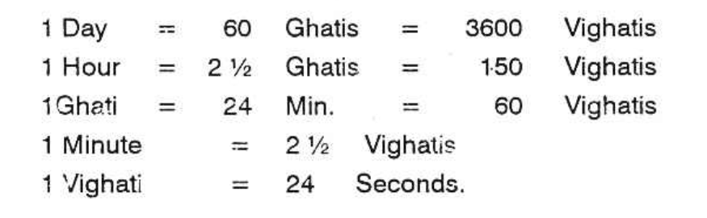
But, suppose the star is Chithra, then one is to find out that Vighati, next to the number of Vighatis given by consultant. He mentioned 8 a.m. = 300 Vighatis after sunrise. So you should add or subtract 1 Vighati or 2 or 3 and so on till you get the remainder 5 which shows the three stars Mrigasirisha, Chithra, and Dhanishta. Therefore, if one is born at 305 Vighatis or 296 Vighatis, the remainder after multiplying by 4 and dividing by 9 will be only 5.
But the person says that it may err to a maximum of fifteen minutes either way. Then find how many Vighatis will yield the same result. The following Vighatis will give the remainder 5. 278; 287; 296; 305; 314; 323; 332; 341 and so on. 278 Vighati is after 7.45 A.M. and 341 Vighati is before 8.15 A.M. Which will you give?
2. Another method mentioned is as under -- Note where Mandi was at the time of birth. The Lagna sign will be either 5 or 7 or 9 or 1 when counted from the sign occupied by Mandi (Then alternatives are given — either to Moon or Lagna, either in Rasi or Navamsa). If Mandi and Lagna are to be in 1, 5, 7 or 9 the consultant asks, why then the same author gives the results of Mandi occupying any house from Lagna i.e., the first, second, third, fourth etc., up to 12. How to reconcile?
If the sign is to be either 5 or 9 (for example) it can be useful to find the Lagna, correct to 30. If Navamsa is taken, the position of Lagna is correct to 3° 20’. As the Navamsa Lagna changes roughly once in 13 or 14 minutes, how far will this calculation give a precise answer?
3. In Uthra Kalamrita, it is said that the interval between Sunrise and the time of birth is to be converted into Vighatis. Divide by 225. Then males are born if the remainder is between 0 and 15; or 45 and 90; or between 150 and 225. Females are born if the remainder is between 15 and 45 or between 90 and 150.
“According to this method, we have to multiply 53 % Ghatis by 60 (he has taken the time of birth as 53 % Ghatis) to convert them to Vighatis, thus 53 % x 60 or 215 x 15. This has to be divided by 225. Thus, 215 x 15 divided by 225 gives a quotient of 14 and remainder of 75. This falls within the second Group (45 to 90) which shows that the sex is ‘Male’.  
In the first example taken, when a first principle is applied, the birth may be between 278 and 341 Vighatis. So the remainder may be 53 or 62 or 71 or 80, or 89 or 98 or 106 or 115. So if the consultant is male (presuming that the horoscope belongs to the consultant) then 55; 62 or 71; 80 will be one of the timings. If the consultant is a lady, then the number of Vighatis will be 98 or 106 or 115 when both the rules 1 and 3 will be satisfied.  
4. Pre-natal-Epoch. Much is said about this. Very briefly let me state how it is not useful to one and all. Suppose two persons are born with the Ascendant and Moon as shown below, say they are born at an interval of 30 minutes on the same day. According to the rules, find where Lagna and Moon at the time of Epoch to A and B are. Moon is passing 10° and 17° in Aquarius, on the same day, which is the position of Moon on the day of Epoch.

What is the rule, find out the exact time on the day of epoch when Lagna for A will be Gemini 6 and for B Lagna will be Gemini 6° 15’. It can be only one minute. If the Lagna of Epoch were to be, say 2 PM. to A, then for ‘B’ it will be only 2-01 PM. Now we have to calculate where Moon would be, on the day of epoch, for A at 2 PM. and for B at 2.01 PM. It is more or less the same position; probably it moves by 0.5 minute.

So, in the Epoch Chart it is worked out and found that when Gemini 6 rises, on the day of Epoch, Moon was actually in 13° 15’ 40”. Whereas for B, when the ascendant is in 6° 15’ Moon was in 13° 16’ 20”. Now, we have to take that, for ‘A’ in his horoscope, the Lagna should be 13° 15’ 40” and for the chart B, Lagna is 13° 16’ 20”. Think, awhile. If one’s Lagna on a particular day is 13° 15’ 40” and the other’s Lagna on the same day is 13° 16’ 20” what should be the interval between one's birth and the other. It can only be two minutes. But what is the actual interval, 30 mts. Then how far we can boldly declare this to be a method for rectification is to be judged by the readers.

Let us take two births actuals. In a hospital on 8-11-1945 there were two births. One child was born at 5.30 PM. the same nurse went to the next room and attended upon another lady and another child was born at 6 PM. on 8-11-1945. Both want to find out the correct time of birth by applying Prenatal Epoch. The horoscope of the child born at 5.30 PM. on 8-11-1945 at 25° 19’ N and 82° 30’ E and that of the other at 6 PM. in the same hospital are as under:

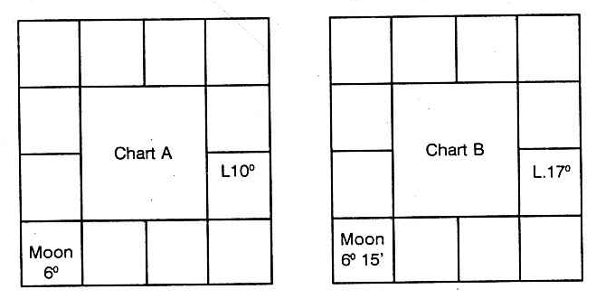
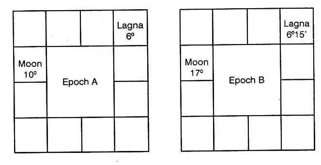

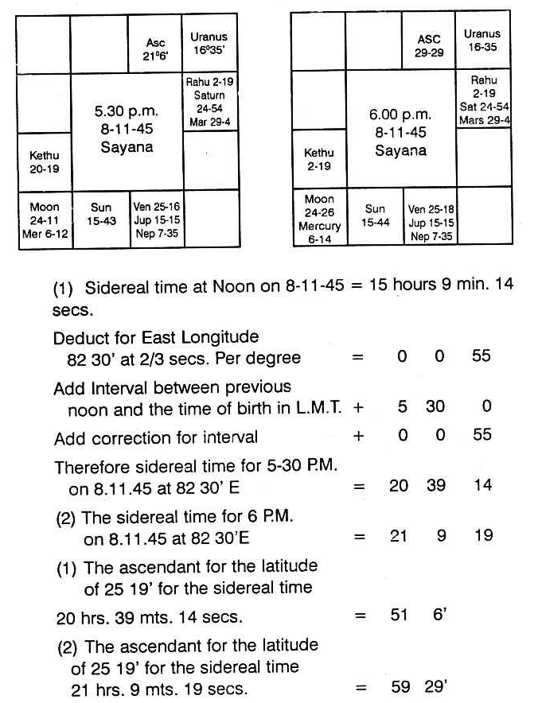

A couple may have a pleasant time every night, yet one cannot say which night would have been fruitful. The day itself is not definite. Further, the male spermatozoa can enter into female ova at any time after copulation within a period of 38 hours. Therefore, at which moment the epoch commences, nobody can say, even though one knows the period of few minutes of pleasure.

Generally, from the time of epoch, the growth commences and the intra-uterine life will be around nine months, i.e. nine solar months or ten lunar months. There may be an increase or decrease in this period. It is found that it depends upon four factors:

Whether the Moon was waxing (Sukla Paksha, increasing in light) or waning (Krishna Paksha, decreasing in light), and

Whether the Moon is found above the horizon (in houses 12, 11, 10, 9, 8, or 7) or below the horizon (in houses 6, 5, 4, 3, 2, or 1).

Then, the period of intra-uterine life is above nine solar months if (a) the Waxing Moon is below the horizon (houses 1 to 6) or (b) the Waning Moon is above the horizon (houses 7 to 12), and it is less than nine solar months if (a) the Waxing Moon is above the horizon (houses 7 to 12) or (b) the Waning Moon is below the horizon (houses 1 to 6).

To find out which sign would have been occupied by the Moon on the day of Epoch and which part of the Zodiac will be rising at the time of Epoch, one is to follow the following rules. Suppose, at the time of birth, it was Sukla Paksha (i.e. Waxing Moon), then the Ascendant at the time of Epoch will be the sign and the position of Moon at the time of birth. The day of Epoch is that day on which (around 9 months prior to birth) Moon transited in that sign and around the degree of the Lagna at the time of birth.

In the above examples, Moon gets separated from the Sun. The New Moon was over and it was increasing in light (i.e. Waxing Moon). As the Lagna in the first example is 21° 6' Taurus, the 7th Cusp will be 21° 6' Scorpio. Therefore, Aries, Pisces, Aquarius, Capricorn, Sagittarius, and the portion between 30° Scorpio and 21° 6' Scorpio are above the horizon. Hence, the position of Lagna at the moment of Epoch should be 24° 11' Sagittarius (which was the position of Waxing Moon at the time of birth). Further, the day of Epoch will be 18th February 1945 (9 months before the birth time) when Moon was transiting around 21° 6' Taurus.

In the second example, the position of Lagna at the time of Epoch will be 24° 26' in Sagittarius (as it was Waxing Moon at the time of birth) and the day of Epoch will be 19th February 1945 when Moon transited 29° 29' Taurus.

To find the exact time on the day of Epoch when that part of the Zodiac will rise in the East on the day of Epoch (which is the position of Moon at the time of birth), one is to take the table of houses for the Latitude at which the mother stayed during those pleasant days. Here in these examples, the mother was during the pleasant days and the painful day, all along, in the same place. So from the table of Houses for Latitude 25° 19', note the sidereal time given for the Ascendant in Sagittarius 24° 11'. When you come to the 7th line on the right side page, you will find Asc. 24° 15' Sagittarius when the sidereal time would be 12 hours 22 minutes and 2 seconds. If you calculate, you will find that 24° 11' Sagittarius would have risen when the sidereal time was 12 hours 21 minutes 44 seconds. Suppose a child is born on 18th February 1945 and you find the sidereal time at the time of birth of a child is 12 hours 21 minutes 44 seconds, then what is the actual time of birth.

If you calculate the rectification for the interval at 10 seconds per hour, you will get the figure 14 hours 27 minutes as the interval between previous noon and the time of birth, i.e. 2:27 am on 19-2-1945.

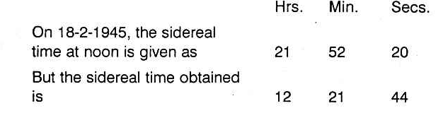

Find out the position of the Moon at 2:27 am on 19-2-1945. The Moon at 2:27 am on 19-2-1945 will be 23° 30' in Taurus.

Similarly, if one works for the time on 19-2-1945 when Asc. 24° 26' Sagittarius rises, it will be found that the sidereal time would be 12 hours 22 minutes 50 seconds. And the time of birth will be 14 hours 30 minutes 30 seconds added to previous noon, i.e. 2:28:05 am on 19-2-1945.

Calculate the position of the Moon for this time 2 hours 28 minutes 5 seconds am 19-2-1945. It is 23° 36' 1" in Taurus. Therefore the Lagna at the time of birth for one born at 5:30 pm is arrived at as 23° 30' Taurus and for the other born at 6 pm it is found to be 23° 36' 1", as the position of the Moon at the time of Epoch is the position of Lagna at the time of birth, if the Moon at birth was waxing.

Will this method of rectification be useful? According to Krishnamurti Padhdhati and the simplest method of multiplying the number of Vigatis from sunrise to the time of birth by 4, dividing the product by 9 and counting the star from Aswini trine will give the exact Vigati. This method gives confidence, convinces one and proves to be correct.

In Brihat Jataka, written by Varaha Mihira in Chapter 26, there are 17 stanzas to cast the horoscope of a person whose time of epoch (impregnation) and also the time of birth is not known. He gives the method to erect a horoscope from the time of query. From this, one can understand that the time of birth and the urge to work out and erect the horoscope of a native from the moment of query has a direct bearing. They are inter-linked. There can be no second opinion.

Therefore one is to follow the following method:

1. Note the lord of the day when the query is answered;
2. Note the star at that time, i.e. the lord of the constellation in which the Moon transits;
3. Find the lord of the sign in which the Moon is;
4. Who is the lord of the Lagna.

These planets will be the same who govern the sign in which the Lagna is, the constellation in it, the sub and the sub sub.

### Examples

1. A person wanted to know whether his Lagna is Taurus last degree or Gemini first degree, so that he may know whether Venus or Mercury is the lord of the Lagna. This person visited at 9-5 A.M. on 27-4-1966. The Lagna at the time of query was Gemini owned by Mercury. The day is Wednesday governed by Mercury. Moon is in Punarvasu star ruled by Jupiter. It is in its own sign and is aspected by Mars. Hence Mercury, Jupiter, Moon and Mars are the ruling planets at the time of query.  
The doubt is whether it is Venus sign, Mars star, Saturn sub i.e. between 27° 53' 20" and 30° Taurus or between 0° and 1° 53' 20" which is jointly ruled by Mercury lord of the sign. Mars is the lord of the constellation and Mercury lord of the sub. The ruling planets at the time of query having nothing to do with Venus and Saturn. But Mercury and Mars agree. Then what about Jupiter and Moon. As Jupiter is in Lagna at the time of query, take as Jupiter sub sub. Calculate the time when sub sub of Jupiter will rise on the day of the birth of the native. That is the time of his birth. His Lagna is Gemini and its lord is Mercury. Venus is not the lord. No other rule can categorically eliminate one and correctly give the true Lagna. Is not this method convincing? 32 of my students who are very intelligent tried to put this method to test. They tested on their horoscopes and their children which they know. They are convinced and this is published for the readers to use this method and be benefited.  
2. Another person on 3-5-66 asked whether he is born in Scorpio or Sagittarius. The day is Tuesday ruled by Mars, Moon in Virgo owned by Mercury, the constellation is Chitra governed by Mars; Moon is aspected by Saturn, Mercury and Venus. The doubt is whether the lord of the sign is Jupiter or Mars. Actually the birth will be at Mars sign, Scorpio, Mercury star Jyeshta Saturn sub between 27° 53' 20" and 30° Scorpio. It cannot be Sagittarius as the time of query has nothing to do with Jupiter.
Next after finding out the sub, one is to calculate when that sign, constellation and sub will rise in the East on the day of birth and when it will be over. In the first case, Gemini sign rose in the East 5 Ghatis 16 Vigatis after sunrise i.e. 316 Vigatis after sunrise. Multiply 316 by 4 and divide by 9. 4 is the remainder. Count from Aswini trine. His star in which Moon transited at the time of birth should be, according to this calculation Rohini or Hastham or Sravanam. But his star is Jyeshta. The remainder should be 9. Then you add or deduct one, one Vigati from the time of birth. The nearest one shows the actual Vigati of birth. If you add one to 316, multiply by 4 and divide by 9, balance is 8; if you add one more, balance is 3. If you add one more and do the process remainder is 7 and so deduct one from 316. You get 315. Multiply by 4. The product is 1260. Divide by 9. It goes 140 times which may be taken as 139 times and the remainder is 9 when you count from Aswini trine, it agrees. Therefore, declare that his time of birth was 315 Vigatis after sunrise on that day to that locality.  
The above method alone can clearly fix the position of Lagna, give the correct time of birth and convince the consultant.  
(An Astrologer has to pray: gain the Divine Grace: develop intuition: but treat this science scientifically: God never fails to guide. He gives the tip to correctly eliminate the incorrect one and select the right one accurately).  
3. Another example to decide time of birth:
 
Note down the time of analysis, It is 7-35 A.M. on 7-4-66. Find out the ruling planets. Since the chart is taken only to find out whether it is correct or not, the ruling planets at the time of analysis should have ruled the birth time also. In other words, the analysis is to find out the birth time only. Hence when the birth occurred, the planets ruling should also rule the moment of analysing the horoscope also; otherwise the horoscope is wrong.

By ruling planets, it is meant as follows:

1. The lord of the day.
2. Lord of the star in which Moon transits.
3. Lord of the sign (Rasi) in which Moon transits.
4. Lord of the lagna sign or the sign in which the Ascendant transits.
5. The lord of the star rising in the east i.e. the star, in which the Ascendant transits.

On 7-4-66 at 7.35 a.m., the ruling planets are as below:

1. Jupiter - Lord of the day Thursday
2. Rahu - Lord of the star Swathi.
3. Venus - Lord of Libra-Thulam (Rasi) in which Moon was transiting.
4. Mars - Lord of the lagna Aries-Mesha.
5. Venus - Lord of the star Bharani rising in the east at 7.35 a.m.

Rahu, unaspected by any planet, represents lord of the sign Taurus - Rishaba in which it is posited. Lord of Taurus - Rishaba is Venus. Rahu represents Sun, since it is in the constellation Karthik ruled by Sun on 7-4-66. Hence, Sun, Mars, Jupiter and Venus should have ruled native's time of birth. The native was born on Sunday ruled by Sun.

At 4-26 a.m. on 9-11-1942 (birth day) exact time, the lagna was Libra-Thulam. Star rising was Chitrai. The sign Libra-Thulam is ruled by Venus. The constellation rising is ruled by Mars. Moon was transiting in Visakam star ruled by Jupiter at the time of birth. Hence at 4-26 A.M. exact time on 9-11-1942 the ruling Planets were Sun, Mars, Jupiter and Venus.

If the birth were to be at 3-26 a.m. (exact time) lagna would have been in Virgo-Kanni ruled by Mercury, the star rising in the east would have been Hastham ruled by Moon. Since Mercury and Moon do not rule the moment of analysis, the native could not have been born at 3-26 a.m. exact time.

Let us find out whether 5-26 a.m. exact time corresponding to clock time of 6-26 A.M. might have been the birth time. At 5-26 A.M. (exact) the star rising was Swathi ruled by Rahu in the sign Libra-Thulam ruled by Venus. Since Rahu and Venus rule the present moment this could have been the birth time.

Now how to select? Was it 4-26 a.m. or 5-26 a.m. (both) time exact time, when the birth took place?

1. Find out the lord of the lagna at the moment of analysis. This should have been the sub sub lord rising in the east at the time of birth.
2. At 4-26 a.m. on 9-11-1942 find out lord of star rising, lord of the sub rising and lord of the sub sub rising. Lord of the sub sub should be Mars (lord of lagna at the moment of analysis) if 4-26 a.m. exact time were to be correct.
3. At 5-26 a.m. on 9-11-1942 (exact time) sub sub lord of the star rising in east was not Mars. Hence the native should have been born at 4-26 a.m. on 9-11-1942 corresponding to the clock time 5-26 A.M. since the clock showed one hour in advance of actual of exact time.

## Hora and Its Use

The ecliptic is the apparent pathway of the Sun in the heavens. The planets and the other luminary, the Moon, follow their own individual tracks which lie along the ecliptic, north and south of it. This width on either side is about 7°12' and hence the pathway of the planets is around 15° in width, having the ecliptic in its centre. This is called the Zodiac.

If one observes, it will appear that the whole Zodiac goes round the earth once a day, i.e., once in 24 hours and the same portion of the Zodiac rises in the east in 23 hours 56 minutes and a few seconds.

As the Zodiac is divided into 12 equal parts called Solar mansions (signs or rasis) (Mesha-Aries to Meena-Pisces), each division will be appearing in the east, roughly for a duration of 2 hours. In other words, the previous sign will appear to rise up in the heavens and the next sign will commence to rise nearly two hours after the previous sign began to rise. Hence the 12 signs rise in the east, roughly at an interval of 2 hours.

The Hindu astrologers have subdivided each sign into two halves and called such a division as a Hora. Hence roughly one hour is needed for each Hora to rise in the east or pass through the Meridian. But the Hindu astrologers, in olden days, did not calculate the time in hours and minutes. They used to measure in Ghatis and Vigatis or Naligai and Vinadi. Hence a day is of 60 Ghatis. Hence each sign is approximately 5 Ghatis and half a sign or a Hora will be about 2¼ Ghatis.

Pharos in Chaldean star lord says: In remote and ancient Chaldean, the knowledge of the stars and the framing of the Zodiac were the results of the divinely inspired gifts to the wise men. The books of Genesis, the Mosaic Era, the Babylonian and Hindu Empires were non-existent when the Chaldean sages laid down the axiom that ‘Astral spheres exert continual influence on terrestrial life.’ Chaldeans followed the Hora and found out the influence of the planets over the affairs of the people. Also, it was said that certain hours are advantageous for certain matters and certain hours are unfortunate for some affairs. This method of prediction is called ‘Hora’.

The ‘Hindus’ also were aware that certain matters thrive in some hours (i.e. 2¼ Ghatis periods) and some fail in certain hours (2¼ Ghatis periods).

Both the Hindus and the Chaldeans do not follow the same calculations to find out which planet rules a particular time though the order of the planets is the same.
First, let us know something about the days and then about the hour or otherwise called ‘Hora’. The names of the days are derived from both the luminaries and the other five planets, e.g.

1. Sunday — Tamil (Nyayiru) Telugu (Adhivaram) others — Bhanu varam, Ravi varam etc. in India. Planet in English (Sun), Tamil- Suryan, Sanskrit-Ravi, German-Sonnag (Sonne), Dutch Zondag (Zon).
2. Monday — Thingal, Somavaram, etc. in India. English (Moon). German Montag (Mond), French Lundi (Lune), Italian Lunedi (Luna), Dutch Maandag (Maan) etc.
3. Tuesday — Sevvai-Mangalvar etc. English (Mars), French Mardi (Mars), Italian Martedi (Mars).
4. Wednesday — Bhuda; English (Mercury), Italian Mercoledi (Mercury), French Mercredi.
5. Thursday - Guru, Brihaspathi, Viyazhan, English (Jupiter), Italian Glovedi (Jove), Dutch (Donderdag), German (Thor).
6. Friday - Sukra, Brigu, Velli; English (Venus), Italian Venerdi (Venus), French Vendredi (Venus).
7. Saturday — Sani, Mandha, English (Saturn), Dutch Zaterdag (Saturn).

The results signified by the planets do predominate in the above order. Hence the names of these days are arrived at according to the effects agreeing with the particular planet. Probably, the same effects repeat once in 7 days and hence only seven days in the week are fixed; e.g., on Sunday some matters flourish; on Monday some other affairs thrive and after 7 days the same matters have advantage on Sundays, Mondays, etc.

As regards the Hora division, the Hindus do not take the time of sunrise for their calculations. They follow strictly according to the time mentioned below. 

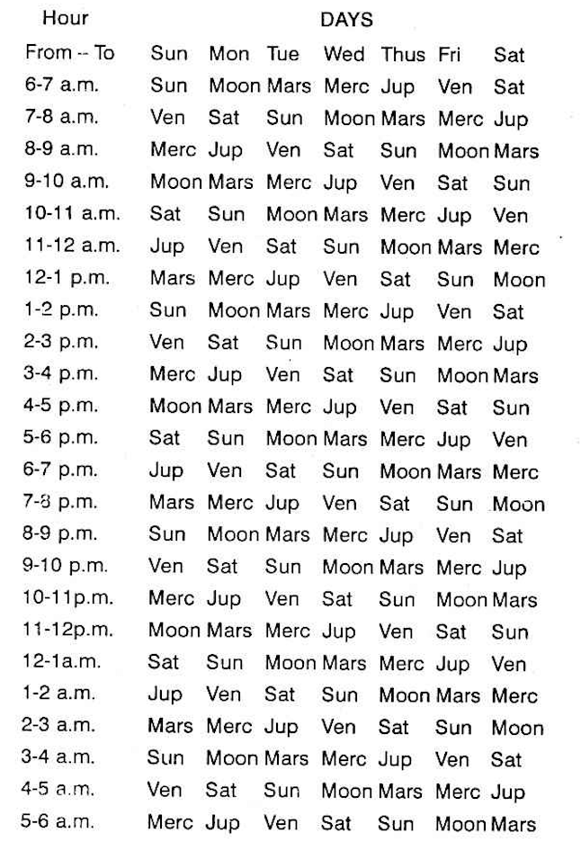

From the table it may be observed that the planets rule the hours in an order which is the alternate days in the reverse order, Suppose Sun rules a particular hour. Then note in the reverse order, the days of the week. The alternate one is Friday ruled by Venus. Hence Venus rules the hour, after that of the sun. Similarly, Thursday is before Friday and Wednesday is the alternate one in the reverse order to Friday. Wednesday is ruled by Mercury. Hence Mercury rules the hour after Venus. Thus the order of the hours is worked out.

It will be a pleasant surprise to note that after 24 hrs. that planet which rules between 6 and 7 A.M. is the same planet which governs the day. Therefore, irrespective of sunrise, the locality and the part of the year in which one wants to find the planet ruling a particular time, simply refer to the above table.

But Westerners and Chaldeans calculate in a different manner. They divide the interval between the time of sunrise and noon into 6 equal parts and each will be little more or less than an hour depending upon the interval between sunrise and noon. Similarly the interval between moon and sunset is divided into 6 equal parts. Likewise, the time from sunset to midnight and from midnight to sunrise is worked out. But the order of the planet ruling the first hour (a little more or less according to this calculation) is ruled by the lord of the day. The other hours are ruled by the other planets in the same order as is followed by the Hindus. Only the duration of each planetary hour division varies. (Readers are also expected to note that the Hindus adopt this hora division in an arbitrary manner and it has no connection with the rising of the sun Hora or Moon Hora in the East. Kala Hora or planetary hours are different from Hora division of a solar sign.)

Then, the doubt arises whether the hours mentioned are the standard time or the local meantime. What is an astrological day? It is the interval between the sun-rise on a day at a particular locality to the next succeeding sunrise. As a planetary hours commence from the time of sunrise which varies according to the Latitude and Longitude of the place, one is to take the timings in the local meantime.

As we to take that each planet rules exactly one hour or are we to find out the interval between sun-rise and noon and divide it by 6, likewise noon to sunset, sunset to mid night and midnight to sun-rise? So, a research was necessary to ascertain which is to be followed. The Modern Astrological Research Institute has found that ine second method is correct and the one hour systematic division needs modification.

The sun rises in the northern latitudes, according to the season, any time between 4.30 a.m. and 7.30 a.m. If one is to consider that a day commences from sunrise and the first hour is governed by the lord of the day, then one is to follow the Chaldeans and should not follow the table published in almanacs etc., which is also reproduced in this article to learn and unlearn. Therefore, planetary hours will be exactly one hour, throughout the world only on two days in a year, i.e., when Sun passes the vernal and autumnal equinoxes on or around 22nd March and 23rd September. On other days, the duration of each planetary hour varies.

When one calculates the interval between sunrise and noon, divides by six and takes the first portion as the hora of the Lord of the day, it does not matter whether it is Local Mean Time or Standard Time. It is preferable to follow Standard Time, as the clocks are set to Indian Standard Time.

Further division of the day will be the division of the Hora. To trace the exact time when the various events in the planetary hours governed by different planets occur, it is necessary to know not only the main division day and night called Hora hours or planetary hours but also the subdivision of the planetary hours of different duration. Suppose one wants to note the time when Saturn will rule its hour on Wednesday, so that one can avoid (a) to sign an agreement in that period or (b) to fix the marriage during that time or (c) to meet a person to negotiate any transaction etc. Adopt the following principle:

1. What is the Indian Standard Time of sun-rise in that locality on that day? Let it be 5-10 A.M.
2. What is the Indian Standard Time at noon in that locality on that day? Let it be 11-59 A.M.
3. Therefore, the difference between sun-rise and noon will be 6 hrs. 49 min.
4. Divide this by 7. Then you get 1 hour 7 min. for each division.
5. The day selected is a Wednesday. Hence from sunrise 5-10 a.m. to 6.17 a.m. Mercury rules the time. The next is governed by Moon. Hence 6-17 a.m. to 7-24 a.m. is ruled by Moon. The next belongs to Saturn; i.e. Saturn is the lord for the duration from 7-24 a.m. to 8-31 A.M. Therefore this period is governed by Saturn on a Wednesday ruled by Mercury. Therefore this conjoined period of Saturn and Mercury are to be avoided for such actions as mentioned above.

When this conjoined period operates in the night and one spends his pleasant time with his wife, he can avoid birth of children. This is an effective method of ‘Birth Control’ as both Saturn and Mercury are effeminate planets. But people, planting fruit bearing trees in such conjoined planetary hours, will have very poor yield; the loss will be not only due to locust, pest, rats, etc., but also due to the scarcity of water-supply and fertiliser. Hence for every action, one is to note which planet will contribute for peace, prosperity, success, etc., and which planets are detrimental. Accordingly one can make a selection and enjoy the fruits.
Now the question arises, whether one can come out successful by selecting such periods, even though he runs a very bad period according to dasa or according to progression. People, running bad time (a) will never follow this, or (b) even if he tries to follow he will do in the evil sub-division of the planetary hour.

What is the sub-division? The planetary hour is sub-divided among the 7 planets (just as, a dasa is divided among 9 planets as Bhuktis and each Bhukti is again subdivided among the same 9 planets called antharams). The first subdivision belongs to the planet which rules the hour and then the subdivisions are governed by the other planets in the same order. Suppose the hora hour is ruled by Venus, then the first subdivisions belong to Venus and the other 6 subdivisions will be governed by Mercury, Moon, Saturn, Jupiter, Mars and Sun.

What is the use of this sub-division?

1. Just as on a Wednesday, the hora of Saturn is to be avoided for some actions and transactions, so also, in the few minutes of the conjoined periods of Saturn sub-division in the Mercury hora and Mercury sub-division in Saturn’s hora are to be avoided.
2. If a person enjoys Jupiter Dasa, Moon Bhukti, he can undertake to do any important work during the Hora of Jupiter and sub of Moon.
3. If Mars Dasa, Jupiter Bhukti operate to one, and if the judge announces the judgment favourable to one, then the time at which he passes it, will be during Mars hora, Jupiter sub or Jupiter hora Mars sub or Mars day (Tuesday) and Jupiter Hora or Jupiter day (Thursday) and Mars Hora. In the latter case the sub will be ruled by either of the two or any other significator contributing to his success.
4. If one wants to construct a building, he prefers the conjoined Hora of Mercury and Mars.
5. One desiring to get married, will select the conjoined Planetary Hour of Venus and Jupiter.

The above is general. Further while selecting a Hora, the most important factor is omitted. Which is a serious mistake, i.e. (a) one does not take into consideration which part of the Zodiac rises in the East and what the Lagna is (b) nor does one consider the position of planet at the time and their relative position to the ascendant, to the cusp or that house which signifies the particular matter and to the Karaka planet which also rules the same matter. Indeed, these three are the important investigations to be made while electing a Muhurtha.

But for common undertakings and the usual daily business, Hora will be helpful to offer confidence, peace of mind and mostly success.

### Sun Hora

Sun is the lord of Sunday. The Hora of Sun will be most potent whenever Sun is strong: i.e. whenever Sun transits in its exalted or own sign and in its constellation, Karthikai, Uthram, Uthradam.

Sun governs vitality, immunity and speedy recovery from disease. Hence, to take medicine or to undergo surgical operations, the solar hour is auspicious.

As Sun indicates power, authority, influence, dignity, honour and reputation, either to take charge of the following posts or to meet such people for assistance, select Sun Hora:

1. Father, Government officials, President (Sun, Mars and Jupiter combination);
2. Vice-President (Sun, Mercury and Mars);
3. Governor (Sun, Mercury and Jupiter);
4. Mayors, Judges (Sun, Jupiter and Venus);
5. Physicians (Sun, Mercury and Jupiter);
6. Surgeons (Sun, Mercury and Mars), etc.

Sun Hora is beneficial for signing contracts (Sun, Mercury and Jupiter); to commit forgery or to undertake Hand-writing, Thumb impression expert post (Sun, Mercury and Saturn); to register documents, to approach for favour, to execute a will, to let on lease, to appeal for promotion, to complain to the Police about the lost property, to have mantras initiated and to concentrate, to enter into politics, etc., to purchase rice, cardamom, pepper, chilly, almond, groundnut, coconut, aromatic herbs trees with thorns, orange coloured articles, etc.

One can commence praying to Suryanarayana Lord Vishnu and also give gold to make jewels, etc. For vaccination, inoculation etc., prefer this hour. Also, people who are governed by Sun or who have Sun as their ruling planet may pray to God for peace and prosperity during Sun's Hora.

### Moon Hora

Moon is the lord of Monday. The Hora of Moon will be very predominating on:

1. Monday
2. Rohini star day
3. Whenever Moon transits in its own sign, exalted sign and in Hastham and Sravanam star days.

Also it is advantageous to note whether Moon occupies the Kendra position counted from the ascendant during the Hora of Moon, when it is strong.

Approach people during Moon Hora. Even the strong-willed persons will yield. If you have to carry out the orders of a lady and if she is a strict, straightforward lady who may be moody also, arrange an interview during Moon Hora. The hard paraffin will become the soft paraffin.

If you are an agriculturist, all wet land cultivation, plantation, digging wells, excavating canals may be done in these hours. Moon Hora on Friday is good for harvesting sugarcane.

If you deal in milk and milk products, dairy farm etc., Moon Hora on Sundays, Tuesdays and Thursdays are auspicious to sell boiling milk. Fridays are auspicious to deal in genuine milk. On Mondays for adulterated milk, Saturdays for ice cream, etc.

Those who deal in resins, greens, food materials, gur, and those who do business in oils, kerosene, petrol, acids, etc., can start business during Moon Hora. Moon Hora on a Monday and Rohini star day is ideal especially during Gothooli Lagna.

Pearls, jewels, ornaments, corals, salt, fish etc., can be purchased in this Hora. Suppose you buy a marshy land, knowingly or unknowingly during Moon Hora, you will have much appreciation of capital value.

Moon, the fastest moving planet, suggests that Moon Hora is advantageous for safe and successful overseas journey. Divers should select Moon Hora, but the Lagna should not be afflicted by Saturn, if they want fortune.

Musicians select Moon Hora, on Mondays or Fridays for fertile imagination and melodious tune. Tuesdays are beneficial for those who use drum, Mridangam Thabla, etc. On Wednesdays Moon Hora is favourable for Jalatharangam. If Neptune is in 5" from Lagna, during Moon Hora and if it is in a sign of long ascension, learn Veena. If it is of short ascension, take to Fiddle. If Moon is in an airy sign and it is of long ascension, start Nagaswaram; if the ascendant is of short ascension prefer flute. Thus, analyse and judge.

Moon Hora is preferable for those who get appointment as midwife, nurse, etc. Also it is good to take up service in the Defence Department. You can plan, contemplate and scheme during Moon Hora when the merits and demerits will dawn in your mind and you cannot decide on an impulse or rashly. Moon Hora in the night is good. What for, need not be elaborated.

For public activities and popularity, for platform speeches etc. Moon Hora is good, especially Thursday. If your mother is rich or your maternal relatives, discuss during Moon Hora, you will become their favourite and you will have gains without pains.

On Wednesdays during Moon Hora, you can take appointment in the Textile Department and you may put on new dress. Hotels may be opened on Tuesdays during Moon Hora. So also for drinks.

During Moon Hora, pray to Goddess Gouri and Lalitha for peace.

### Mars Hora

Mars rules over Tuesdays. It governs Aries-Mesha and Scorpio-Vrischika. It is the lord of the star Mrigasirisha, Chitra and Dhanishta. It gets exalted in Capricorn-Makara. Hence the Hora of Mars will be most potent whenever Mars is strong by transiting in its own or exalted signs or in its stars and on Tuesdays. 

Suppose on a Tuesday, when Mars is in 23° 20’ to 24°-6'-40” in Capricorn in exaltation, in its own star and own sub it is in its most potent position, especially when it happens to be the 10th house to the Lagna rising then during Mars Hora.

It is auspicious for the Commander-in-Chief to prepare for war. It is good to file any suit in a court of law. It is advantageous to argue during Mars Hora and win the case. On a Thursday, during Mars Hora try for compromise and fair settlement; purchase lands, start a brick kiln. On Saturdays commence trench or tunnel work. (Trench means, you excavate the earth vertically down whereas Tunnel is horizontal earth rather rock, removal mostly for railways, Saturn and Mars indicate Trench and Tunnel).

If you want to use manure, Mars Hora on a Monday is auspicious. To purchase surgical instruments. Sunday-Mars Hora or the day of the lord of 12 and Mars Hora. To join duty in the Military, Police or Factory, Mars Hora on Tuesday is advantageous it is lucky to start a press, mechanical engineering, industry, building, construction, or open electronics shop on a Wednesday in Mars Hora. To join duty in a court of law or take oath as a President, Judge etc., Thursday is propitious.

Goldsmiths, jewellers, may have opening ceremony on Thursdays, Fridays are also good. Mars Hora on a Thursday is beneficial for executive officers of temples or industry or church or colleges and schools and those who say that they relinquish the world and start preaching to others whether they practise or not. But those who want to practise, but are not very anxious to reach other can have it on a Saturday. On Friday, Mars Hora gives vitality and satisfies the partner. It is good for union, for jewellery, for animal husbandry, for leather and hides, for coffee, tea boarding, lodging, cinema theatre, games, luxury goods, automobile, bullock carts, jutkas, agriculture, timber, furniture etc., to learn telegraphy: to deal in telephone accessories. To open a mill or factory prefer Wednesday. To prepare arms, spears, instruments, dagger to excavate, to construct a slaughter house, lethal chamber, to have lead or copper industry, to deal in hides, skins, shoes, etc., Saturdays are fortunate.

Those who buy land during Mars Hora, and sign the document in the morning, say, between 6-30 A.M. and 7-30 A.M. having Sun in the 12th Bhava will not enjoy the benefit of the appreciation of land value, as the Government will acquire the land. But those who sign and purchase the property between 8 and 10 A.M. having Sun in the 11th house supposing that Sun rises at 6 A.M. will have the full advantage of the high price.

You can buy coral, ruby and red coloured articles. Best time to construct a house would be at a time when Mars is exalted; when Mars Hora is on and the ascendant is Scorpio and the degree in Scorpio is between 0° 33’ to 1° 20’ which will be Vishaka 4th pada governed by Jupiter and the sub is Mars. In that case there will be no difficulty for the availability of money, building materials etc. There will be the Blessing of Providence.

For peace and prosperity pray Lord Subramanya or Muruga or Narasimha or Kali or Ganesh. For Subramanya — Begin on Sunday or Tuesday especially when you serve in a military department. On Mondays, start Kali; Badrakali. On Tuesdays-Ganesh or Muruga-Veerabhadran; on Wednesdays-Narasimha; On Thursdays-Dhakshinamurthi, Raja Rajeswari; On Fridays-Veera Lakshmi and Lakshmi Narasimha. On Saturdays-Venkatesa, Venkatachalapathy, Iyyappan.

### Mercury Hora

Budha (Mercury) is the lord of Wednesday. Mercury Hora is very strong and powerful on Wednesdays during the time when Mithuna or Gemini or Kanni-Virgo, rises in the East and on Ashlesha, Jyeshta and Revathi star days especially Revathi.

1. Admit boys and girls in schools and colleges on a Mercury day during Mercury Hora. Even the dull witted will come out in rank.
2. One can start memorising from poetry, important stanzas, etc. Prefer Mercury Hora to deliver a speech especially on Thursdays. So also, accept the post of a teacher or professor.
3. Accountants, auditors, mathematicians can select Thursdays and Mercury Hora. Painters, drawing masters, artists and dancers can commence on Fridays in Mercury Hora. Editors, publishers, book-sellers, printers, press owners, publicity organisations can start functioning on Tuesdays in Mercury Hora — most efficient work will be done if one commences during Mercury Hora.
4. Daily newspapers, almanacs, ephemeris, ambassadors, agents, representatives, brokers, auctioneers can begin on Wednesdays in Mercury Hora.
5. Typists should prefer Tuesdays, and shorthand writers should select Saturdays.
6. Treat neurasthenic patients and those who suffer from Vitamin B deficiency during Mercury Hora.
7. Those who commit forgery or fraud, do it during Saturdays, Mercury Hora or Wednesdays Saturn Hora.
8. Those who take service in the Postal department, Telegraph and Telephone Offices, overseas communication, Engineering, correspondence, etc. or purchase lottery tickets, bonds, securities, shares, or prize bonds etc., must do so on Wednesdays in Mercury Hora or on the day of the lord and Mercury Hora.
9. If you desire to float a company or to underwrite, Mercury Hora is the best.
10. For those who deal in paper, stationery, oil seeds, jute, wheat, quick-silver, emerald, green stone, onions, green gram, watches, telescopes and microscopes, Mercury Hora is very advantageous.
11. If you proceed overseas as an ambassador or as a representative or for foreign studies or for foreign collaboration, prefer Wednesdays or Thursdays and never miss Mercury Hora.
12. Important documents can be drafted during Mercury Hora with advantage.
13. Pray to Lord Vishnu, Rama, Krishna, Anjaneya, etc.
14. Try to concentrate. Vacillation is the only defect.

### Jupiter Hora

It is otherwise called Guru, Viyazhan, Brahaspathi, etc. It rules over Thursday. The Hora or Jupiter will be very predominating on:

1. Thursdays
2. When Moon transits in Poorvapathrapada 4th quarter
3. When Moon transits in Cancer (exalted sign of Jupiter) and in Sagittarius and Pisces (owned by Jupiter)
4. When Moon transits in Punarvasu, Visakha and Poorvapathrapada stars.

Approach people during Jupiter Hora. Do you want overdraft facilities from a bank? Meet the proper authorities during Jupiter Hora. Is Jupiter a benefic to you? Are you running Jupiter's period? Then, never miss to meet the ministers or high officials in the Government during Jupiter Hora. Success in your attempts is certain. Have you the desire to study Veda, Astrology, Philosophy, Religion, Law, Economics, Banking etc.? Purchase books and begin to read on a Thursday, preferably on Jupiter's star day and in Jupiter Hora.

Do you deal in Gold and Silver? Is your income not satisfactory? Are you depressed? Open a branch on a Thursday in Jupiter Hora when Jupiter is in direct motion and is strong. You must have decent increase in income. Always make it a point to meet commercial tax and Income-tax officials during Jupiter Hora. The interview will be pleasant, peaceful and profitable.

If you are ill and if a physician offers any specific medicine to be taken internally, prefer this Hora. Even to buy a tonic, to take ayurvedic medicine, Jupiter Hora on a Tuesday is advantageous. Establishment of Stri Sadhana office for the prevention of prostitution, animal husbandry, construction of temples and charitable institutions, colleges, mutts, libraries, banks, etc., in Jupiter's Hora will prove to be advantageous.

This Hora is very essential to purchase vehicles especially on Fridays during Jupiter Hora, or refrigerators on Saturdays during Jupiter Hora or lay foundation for houses on Fridays during this hour or take up minister's post on Sundays or Tuesdays in this hora or borrow money on Thursdays or invest on shipping or Petrol Shares on Mondays or take up a job in the educational department or air travel on Wednesdays, etc.

Depending on the God or Goddess on its day, during Jupiter Hora, have the initiation of mantras. Note down Jupiter's hora in the night hours. Be friendly with your partner in life, wife or husband. Even if you had no chance to have a child so far, Jupiter will not let you down. It will fulfil your desire by giving you a child. If you have already many, avoid this hour.

Open bank account, take up the junior auditor's post or accept the profession signified by Jupiter during its Hora. Take up Insurance policy on Saturdays during Jupiter Hora. Your endowment policy will mature and you can enjoy the benefit. But if the insurance agents were to obtain the signature of a person, in a Life Policy during the conjoined period of Saturn and Mars, the Insurance company will lose heavily, whereas it will be a fortune to the members of the family who outlive the person who has signed his policy during Mars Hora on a Saturday or Saturn Hora on a Tuesday.

The Government has to choose Jupiter Hora if they lay foundation for hospitals (on Sundays), Shipping (on Mondays); Buildings for Police, Military Magistrate-Court, Law Courts, Industry etc. (on Tuesdays); for educational Institution, Postal Departments, Communication, All India Radio, Textiles Engineering, etc. (on Wednesdays); for Law College or legal department, Temples, Churches, charitable institutions, Banks, Treasury, Revenue department, International Trade, etc. (on Thursdays); Animal Husbandry, Food department, Agriculture, Tea Board, Coffee Board, Prohibition department, Gold Decontrol etc. (on Fridays); Insurance Corporation, Labour department, mines and minerals, control department, Intelligence Dept. Retrenchment, famine, refugee, quarters for servants, slaughter house, etc. (on Saturdays). Such a beginning promises:

1. No delay and difficulty in completing the project
2. Expansion and improvement
3. Co-operation from the public and their wholehearted support
4. Fulfilment of the desire of the Government and benefit to the subjects.

### Venus Hora

It is otherwise called Sukra, Birgu, Velli, etc. It governs Friday.

The Hora of Venus is very strong for Venusian matters:

1. On Fridays
2. On the days when Moon transits in Bharani, Poorvapalguni and Poorvashada constellations
3. When Moon transits in Taurus or Libra or Pisces which is its exalted sign

If on a Friday, during Venus Hora, when Moon transits in its own star, one commences to do any of the matters signified by Venus, knowingly or unknowingly, success is sure. Peace and prosperity are promised. Harmony and happiness can be had.

Prefer Venus Hora if you want to meet an officer who is generally impatient, who is a hard task-master and who is moody. You will find that he is calm and co-operating. Even a militant type of person, arrogant, foolhardy and rash will give a patient hearing and will be helpful. The temper gets softened during this hour. A cobra may be ferocious due to Mars. But if it takes its food, which is shown by Venus, it is harmless. The fiery nature of Mars will be toned down by Venus.

If you have to look at the girl or at the boy before fixing up your marriage, you select Venus Hora if you want to select this partner, but if you do not like the alliance you select Mars or Satum Hora when the negotiation will fall through and you can be happy. Venus Hora promises harmony and happiness.

If you feel that you are exhausted and you have lost much of your vitality, take medicine, especially Ayurvedic (especially from Sadhana Ayurveda ashramam at Calcutta) on Thursday or Friday during Venus Hora: it will rejuvenate you.

Write love letters during Venus Hora: You start writing after this hour starts and finish it before this hour is over. Even though you may not normally have command of language to give expression to your love, during Venus Hora, appropriate words will be used by you which will appeal to the partner. If you receive a reply during other Horas, do not be impatient. Wait till Venus Hora starts. Then open the sealed cover and read. You will be very happy.

Now you may ask, “She had already written and posted the letter. How can the Hora change the contents of the letter”? The answer is this. Knowingly or unknowingly you can open the letter at any Hora. According to the Hora, you will find the letter. If it is Saturn Hora, then the partner would have mentioned the inability to meet you and she will fix up some other time. If it is Mars Hora, the tone of the letter will upset you. So, why should you take a chance? Venus Hora will arrange for tea, dinner, cinema, music party, meeting in an unfrequented place, etc.

Those who would desire to cultivate love, must prefer Venus Hora. Buy jewels, silk sarees, costly dress, diamond and costly gems, sandalwood, glass, powder, scented oils and scents, eyelash, lipstick etc., during Venus Hora. It will add beauty by moderate use.

Buy a scooter or car or any vehicle during Venus Hora, preferably on a Friday. Start agricultural operations or open the industry to manufacture agricultural implements for tilling, ploughing, etc., especially on a Tuesday. If you desire to have a poultry farm, cattle breeding or possessing race horses, etc., prefer Venus Hora. Contractors to supply spare parts, etc., to Railway, shipping, airport, etc., have to sign the agreement during Venus Hora on a Wednesday and those who would like to have honey-moon, have to commence their journey during Venus Hora.

During Venus Hora, have the initiation of Manthras on Goddess, especially Goddess of Wealth, Lakshmi. On Sunday during Venus Hora, you can worship Chaya Devi; on Monday, Parvathi; on Tuesday Lalitha; Raja Rajeswari, Kali; on Wednesday, Lakshminarasimha; on Thursday, Dhana Lakshmi; on Friday Sowbagya or Dhanyalakshmi; On Saturday, Alamelumangai thayar, etc.

Those who start milk dairy should have it during Venus Hora on a Monday. For rice business, Venus Hora on a Tuesday. For story writing, love letters, pleasant journey, shipping clearance agency, agency for Textiles, Rayons, silk, perfumery, toilet, pharmaceutical products, cotton, fancy articles, hosiery for woman, biscuits, chocolates, confectioner, fruits, flowers, vegetables, etc., on Wednesday during Venus Hora.

Lay foundation for women and children Hospital, animal husbandry, accountant-General’s office, Income-tax office, Law court, etc. during Venus Hora on Thursdays. Or join duty in such departments on those days and hours.

Music Colleges, Cinema Theatres, Studios, Photographic Studios, Railway, Air Travel, Shipping, Stri Sadhana Hostels for ladies, Schools and Colleges for girls may, with advantage, be started during Venus Hora on Fridays.

Vigilance Home, Famine Shed, refugee Campus, Slaughter house, leather, skin and hides departments on Saturdays during Venus Hora.

### Saturn Hora

Saturn is otherwise called Neelan, Mandhan, Sani, or Yama. The Hora of Saturn is strong for the matters signified by Saturn:

1. On Saturdays
2. On the days when the Moon transits in Saturn's signs Capricorn and Aquarius
3. When the Moon transits in Pushya, Anuradha, or Uthrapadra stars
4. When the Lagna at that hour is in Saturn's sign or star

If you want to handle a violent person, prefer the hour of Saturn. You can practice yoga or meditate during Saturn Hora so that you will be able to concentrate. Write letters to Saturnians, Yogis, sages, mine-owners, landowners, etc. in this hour. Sow the seed-bulbs, potato, tapioca, groundnut, or sesame in this Hora. If you want to sever connection with anybody, this hour will help you. For illegal intimacy, this is the best hour. Start petrol, oil, coal, skin, leather, and hide business in Saturn Hora. Lay the foundation for such business then.

If you find it impossible to lead your life with your wife, do not tell her your programme but disappear during Saturn Hora. If you tell her, she will come to the secluded place selected by you and continue to give trouble. Pray for Lord Venkateswars or Lyappa during Saturn Hora. Prefer this Hora to become a Sanyadi.

## Dictionary for astrological terms
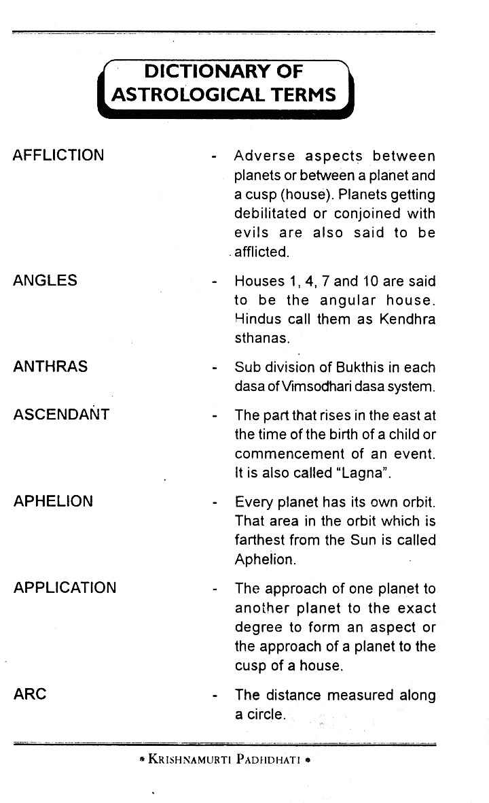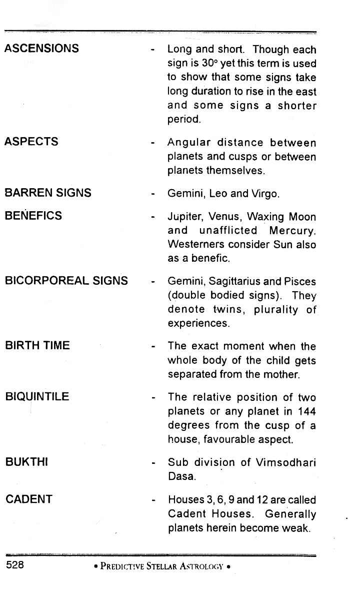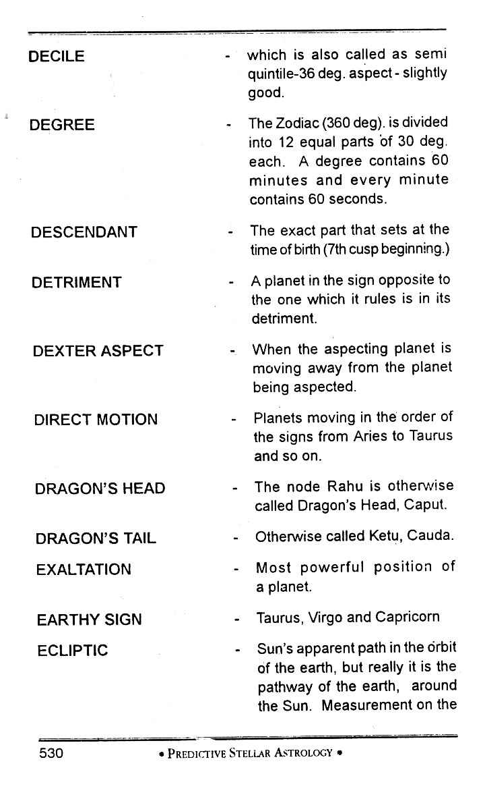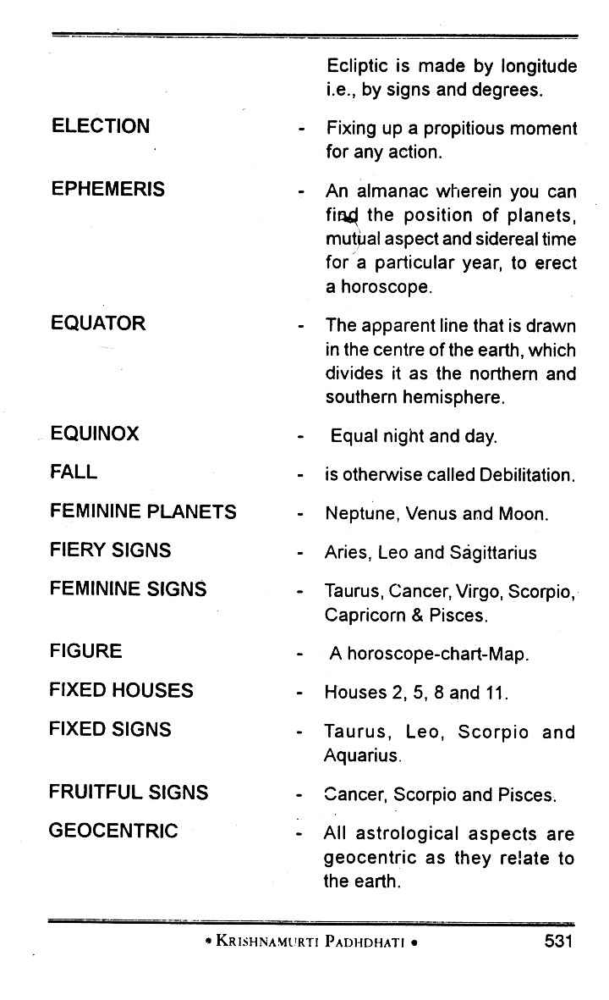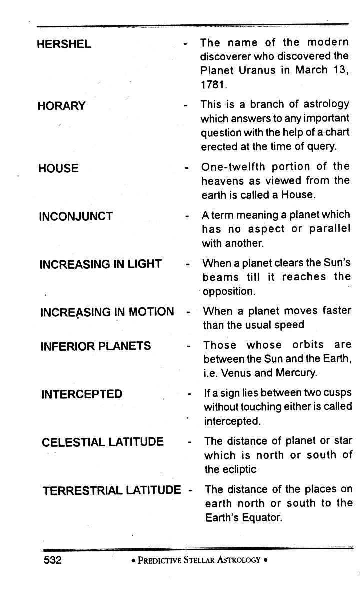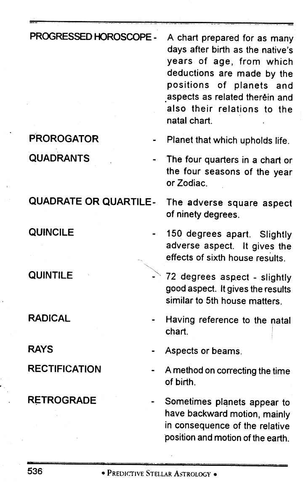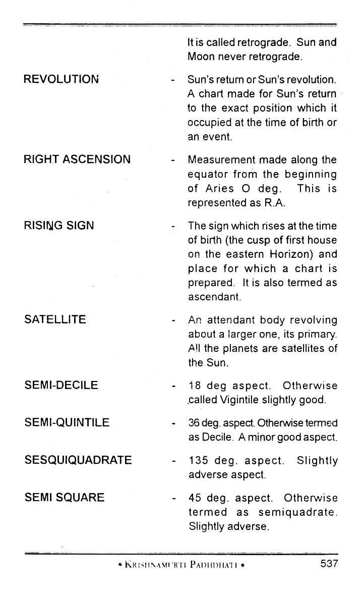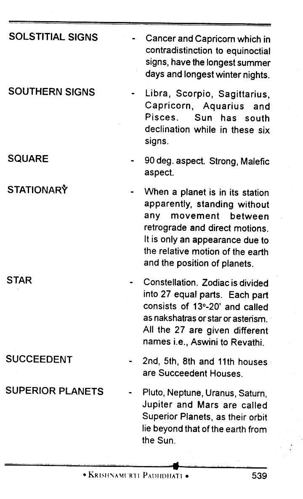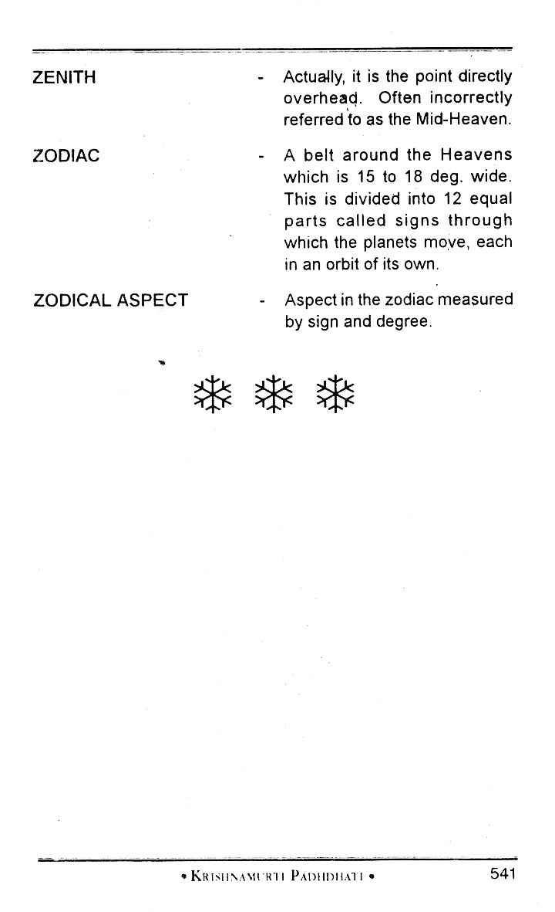