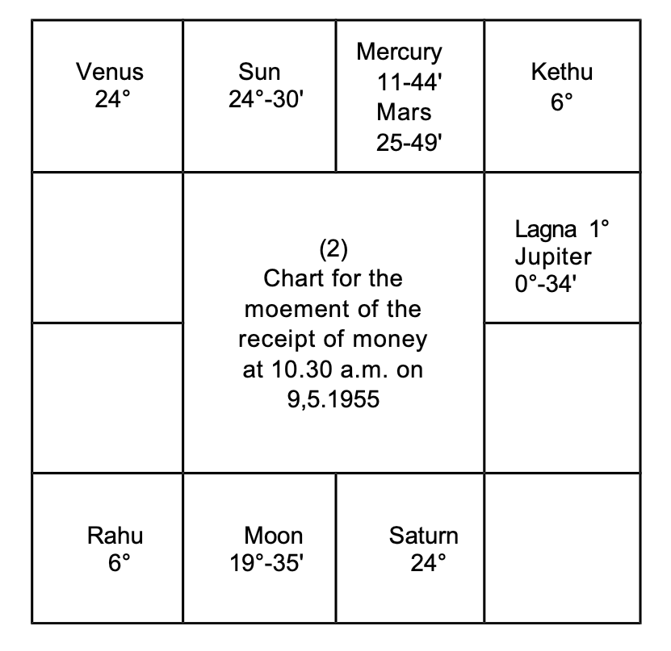
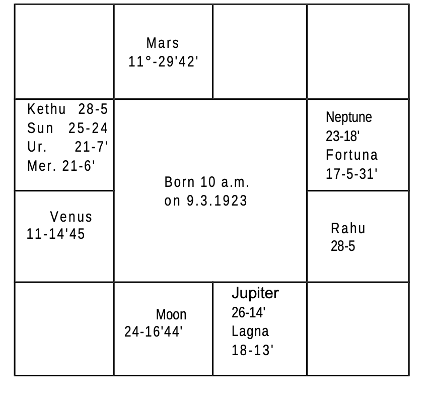
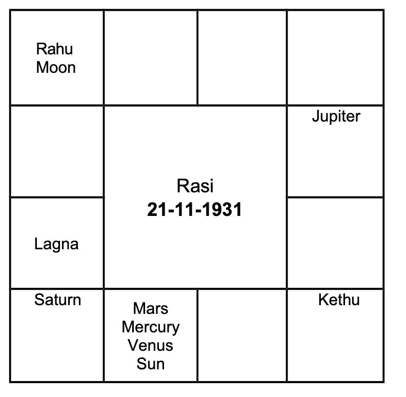
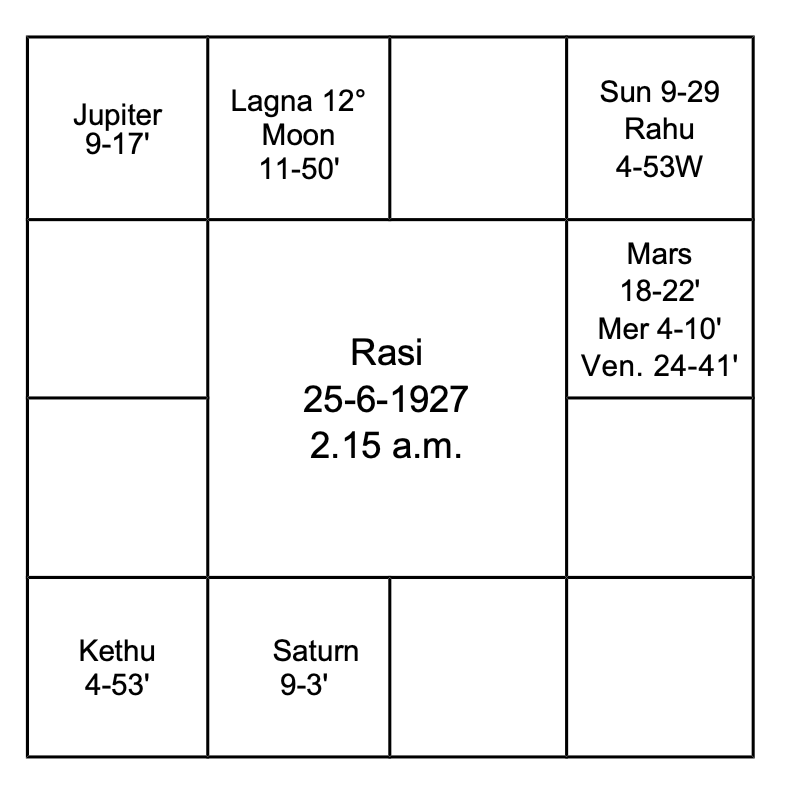

## Physical features

Generally, the sign occupied by the lord of the constellation in which the sublord of the Lagna at birth is, indicates whether one is tall or short, stout or thin-build, etc. These details are given under each sign in vol.1.  
If we classify the 12 signs into 3 groups, then the signs Gemini, Leo, Sagittarius and Aquarius contribute to good height. Aries, Virgo, Libra and Scorpio indicate average height. Taurus, Cancer, Capricorn and Pisces denote shortness.  
Lord of Lagna, in the beginning of a sign, indicates tallness. As it proceeds to the middle of a sign, the person is above average height; between the middle of the sign, and the end of the sign, one becomes shorter. If it is in the end of a sign, one is short.  
Robson says that the lord of the Ascendant and Moon without latitude, posited in the end of a sign produce short persons. Ptolemy mentions that lord of the ascendant with greater latitude causes stout persons. The greater the latitude the more stout one will be.  
In practice, it will be observed that physical description varies from the normal in many respects, especially in twin births. According to Krishnamurti Padhdhati, one's height, weight, etc. depends on the sign occupied by the lord of the star in which the sublord of Lagna is deposited. The sign denotes the physical feature in general, the constellation modifies it. The lord of the sub decides whether one is tall or short, plumpy or wiry and so on.  
Further, one should include the aspects from other planets to the cusp of the ascendant and judge according to the nature of the planet. Good aspect from Jupiter to the cusp of Lagna inclines to overweight, whereas Saturn to emaciation. Mars and charm and beauty. Mercury denotes plumpy with pale appearance. Moon gives prominent features, long nose, piercing and wandering eyes. Uranus inclines to long limbs. Rahu produces tall people. Kethu causes shortness. Saturn and Sun contribute for bushy growth of hair. One's physical feature is governed mainly by the sublord and the sign occupied by the lord of the constellation in which the sublord is situated. Hindu astrologers judge the beauty of a person from the lord of the Navamsa Lagna. The complexion is ascertained from the lord of the Navamsa sign occupied by Moon. The conduct and character is judged from the lord of Trimsamsa. Varahamihira advocates this method of judgement. Mahadeva in Jataka Tatva says that one's appearance will be like that of the planet which is the strongest in the horoscope: the hue depends on the lord of the Navamsa sign occupied by Moon and the behaviour and character depends on the Trimsamsa position of Sun.

### Marks, Scars, or Moles on the Body
Mahadeva has mentioned that Mars and Sun cause red marks; Rahu and Saturn black scars; Moon, Mars, and Venus produce marks on the head; Venus in Lagna and Rahu in 8 cause a mole in the head or right ear. Mars in Lagna and Saturn in trine indicate a mole or mark in the generative system. Jupiter in 8 produces a mole in the belly. A royal mark or mole on the palm or on the foot will be found in persons who have to enjoy Rajayoga.

According to Westerners, one will have a mark or a scar in that part of the body indicated by the sign: (Aries-head; Taurus- ears, neck, throat; Gemini-arms, hands, shoulders; Cancer- breast, Leo-heart, sides, back; Virgo-belly; Libra-reins and loins; Scorpio-secret parts; Sagittarius-hips and thighs; Capricorn- knees; Aquarius-legs and ankles; Pisces-feet and toes.)

1. in which Lagna falls,
2. in which lord of Lagna is deposited,
3. in which Moon is situated,
4. in which Saturn, Mars, or Uranus are posited and at the same time afflicted by evil aspects, and
5. the sign where the 6th cusp falls.

According to me, a mole is found from birth and scars and marks are formed due to disease, cuts, operation, boils, etc.

A male will have a mole on the right side if the Lagna and lord of Lagna occupy a masculine sign. If the Lagna is masculine and the lord of Lagna is in a feminine sign, the mole in that part of the body signified by the Lagna sign will be on the right side, whereas the sign tenanted by lord of Lagna shows the part of the body and the mole will be on the left side. But if a male member is born in a feminine sign and its lord is also in a feminine sign, the mole will be on the left side. If the lord is in a masculine sign, the mole will be on the right. For ladies, the reverse is the order.

If in that sign, the cusp or the lord of the Ascendant is in the first ten degrees, the mark will be in the upper one-third portion of the part indicated by the sign: if it is in the middle 10 degrees, the mark will be in the center of that part of the body: if it is between 20 and 30 degrees, it will be in the lower part of that portion.

As regards scars, one is to note which planets will cause disease or danger; which sign they occupy and afflict; which part of the body will be affected; and also judge when it is to happen. For example, if Venus and Jupiter are in Visaka Nakshathra-constellation 21 degree Libra in the 6th house to Taurus born, one expects appendicitis or hernia during the conjoined period of Jupiter and Venus. As the surgery is to be done in the lower abdomen, one is to predict a scar in the lower abdomen. Similarly, one is to offer a precise and correct prediction.
### Longevity:
According to Western system:

1. By progression, if a malefic comes to the cusp of any angular house,
2. if a malefic forms an evil aspect with Ascendant,
3. if a malefic progresses in the 6th house and afflicts the 4th cusp,
4. if a malefic progresses in the 8th house and adversely aspects the 5th cusp,
5. if a malefic throws an evil aspect from the 12th house to the meridian,
6. if Jupiter, though a benefic, forms an evil aspect with Neptune (MOKSHA),
7. if Neptune forms an evil aspect with malefics,
8. if Uranus, Saturn, or Mars receive strong unfavourable aspect from other evil planets,
9. if they afflict the Lord of the Ascendant or the Ascendant, danger for longevity is to be predicted. So also, during transit, such aspects are to be taken to fix the exact time.

According to Hindus: the span of life of a person may be classified into 3 groups:

1. short life (0 to 33 1/2 years),
2. middle life (33 1/2 to 66 1/2 years),
3. long life (66 1/2 to 100 years)

Our sages have grouped the following combinations:
### Short Life:
1. Moon conjoined with a malefic-not mitigated by the aspect from a benefic and malefic in Lagna and 7th Bhava.  
2. Moon in a Kendra (either in 1 or 4 or 7 or 10) and malefics in other Kendra Sthana.  
3. Weak Moon in 12; evil planets in 8 and 1 - no benefic in Kendra.  
4. Benefics in 3 and 8 afflicted by malefics  
5. Moon in Lagna and malefic in 7  
6. Moon, Sun and Saturn in 8  
7. Mutual exchange between lords of 1 and 8  
8. Lord of Lagna in 3 or 6 or 12 - malefics in 6 or 8 - no favorable aspect from benefics.  
9. Moon, Sun and Mars in 5th house - devoid of beneficial aspects and so on.  
The above is a general principle. It needs further consideration. One should not declare hastily the results applying the above rules alone. 
### Middle Life:
1. Saturn in Lagna, Moon in 4, Mars in 7, Sun in 10, benefics in evil houses.  
2. Jupiter in Lagna in Sagittarius, Mars and Node in 8  
3. Saturn in Lagna, Moon in 8 or 12  
4. Venus in Lagna, Saturn in Kendra, most of the other planets in 3 and 11.  
5. Sun in 7, Mars in 5 and Saturn in Aries.  
### Long Life
1. No evil planet in Kendra: Jupiter in a Kendra position counted from lord of Lagna
2. Moon in 9, no evil in 8, benefics in Kendra
3. Benefics in between first and 6th houses and malefics above horizon
4. Leo Lagna-majority of planets in Kona-Trine houses
5. Cancer or Taurus Lagna: Jupiter deposited in Lagna. Three more planets exalted.
6. Cancer Lagna occupied by Jupiter. Two planets in exaltation.
7. Leo Lagna with Jupiter. Venus in Cancer-Mercury in Virgo malefics in Upachaya Sthana 3 or 6 or 11.
8. Moon in Pisces, Sun in Cancer, Aries Lagna, Saturn in Capricorn, Mars in Libra.

Thus various combinations are given. To my knowledge there are 284 such rules. Readers cannot remember all these combinations. Each rule can be applied only to a few births. These are general. They fail miserably in case of Twins.

But our sages have propounded various methods to calculate the age of a person. They involve so much of calculations that a person needs hours and days to arrive at one figure. Those who would have gone through a few magazines, would be knowing many methods as a symposium is given. This is the theory. It has confused many to know which one is correct and follow. God alone has to help the reader. Publishers do not advocate any one of the various calculations, giving reasons.

The following examples and explanations will be useful. This method is applicable to all births including twins. 

1. Note the correct time of birth and the time of query
2. Erect horoscope using Raphael Ephemeris and Table of houses.
3. Deduct Krishnamurti Ayanarnsa
4. Note the Ascendant-Nirayana position-referring to the table given in the first volume, ascertain the lord of lagna, the lord of the constellation and the lord of the sub. Dase lord is the lord of the constellation: Bhukti lord is the lord of the sub.

If any person has to run the conjoined periods of these three planets, what would be the result? Will he lead a healthy life or will he suffer? If the sub belongs to a benefic, he lives long. When the sub is governed by a malefic, his life is short. This is very clear in the case of twin births where one lives and the other dies. The sub ford is the deciding factor.

If the sub lord is a benefit then it is necessary to calculate and find the span of life. Lords of 1, 5, 9 and 10 are benefics. Lords of 6, 8 and 12 are malefics. if lords of 1, 5, 9 and 10 also rule 5 or 8 or 12 consider the planet as mostly a benefit.

The planets owning other houses are considered as a benefics or a malefic, by noting the other house which they own. How to judge the longevity is explained with 2 examples. Bhadakasthana, Kendraadhipathya and Marakasthanas are explained.

Mars, lord of Lagna rules the sub of the Ascendant. Health, vitality, resistance against infectious diseases, immunity, activity are judged from the strength of the Ascendant, planets in the   
 Lagna Bhava, those occupying their constellation, the good or bad aspects to the Ascendant and to the lord of the Ascendant.  
Benefics in the Ascendant contribute for long span of life.  
Lord of the Ascendant forming favourable aspect with the ascendant and receiving harmonious aspect from benefics promises long life.  
Ascendant is Scorpio.  
Its lord is Mars. As per Hindu System it is aspecting the   
 Lagna and fortifying it. Therefore health and longevity are assured by Mars.  
Disease is indicated by the 6' Cusp, 6th house, planets in the constellation of the occupants of the 6th house, the occupants of the &l' house, the planets in the constellation of lord of 6, the owner of the 6th house, planets conjoined with them or aspected by them affect the health and cause such diseases signified by them when they operate their dasa or bhukti or anthra and there is aspect to them by progression and by transit.  
in this case (so also for Taurus barns) lord of 1 is also the lord of the 6th house. So the same planet owns both the ascendant indicating health and also the 6th house threatening disease. Then when Mars (lord of 1 and 6) dasa or bhukti or anthra is on, how to say whether one will maintain robust health or one will fall ill as Mars has to offer health and cause disease also? Note down which planets form favourable aspects with Mars and the ascendant and which form  

1. adverse aspects with Mars,  
2. good aspect with the 6th house and  
3. adverse with ascendant.   

He will maintain good health during the dasa or the conjoined period of Mars and the benefic who form harmonious aspects with the Ascendant and the Ford of the Ascendant. He ought to have fallen ill and he will have ailment during the dasa of the planet forming evil aspect with Ascendant or good aspect with 6th cusp or lord of 6 or planet in 6. According to K. P. , Significators of 6th house ruling the Sub period in Mars dasa will cause disease and significators of 11 give cure.  
8th house is called the house of "Longevity". Therefore planets in the constellation of evil planets in the 8th house, except  
Saturn, occupants of the 8th house, planets in the Constellation or in the sub of Lord of 8, lord of the 8th Cusp and planets in any manner connected with them indicate (a) danger to one's life (b) the cause of death and (c) the place of death.  
But houses 2 and 7 are Maraka houses and the 12th house indicates Moksha. The reason is as follows. Houses 1, 8 and 3 are judged for longevity and benefics in these houses contribute for long life. 12th house to any BHAVA is the negation of the Bhava. Therefore the 12th house to 1, 8 and 3 are 12, 7 and 2 and they are evil for one's longevity. That is why, houses 2 and 7 are said to be Marakasthanas and 12 is called the Moksha Sthana.   
 So one is to judge the houses 1, 8 and 3 and then 2, 7 and 12.  
First of all one is to judge whether a person is promised "Poorna Ayush - i.e., full course of life running between 66 and 100 or Madyama or Middle life (age between 33 and 66) or short life between 0 and 33.  
Then one is to work out, calculate and ascertain (a) which planet will rule the dasa in that age and the area covered by the maraka planets; (b) according to progression, the time when the 
 Lagna, the lord of the Lagna and the very slow moving planets Saturn, Uranus and Neptune receive evil aspects; (c) according to transit (Gocharam) when evil aspects are formed to the ascendant, its lord etc. as per KR, when Significators transit in such sensitive points ruled by the significators.  
Also, erect a chart for the moment at which there is the urge for one to answer the query and note the evil planets for that moment. Ruling planets for that moment reveal.  
Finally ask the person to mention a number within 249,  
consider the position of the planets and judge. These are for confirmation and confidence.  

### Bhadaka
According to Hindus, Bhadhaka Sthana Adhipathis are the worst malefics who will never hesitate to put an end to one's life. Of the twelve signs, Aries, Cancer, Libra and Capricorn are movable-chara-signs, and the 11th house counted therefrom are Bhadhaka-Sthanas. 

For Aries-born, Aquarius is the Bhadhakasthana and the lord of Aquarius, Saturn is the Bhadhakasthana Adhipathi. To Cancer-born, Taurus is the Bhadhakasthana and the lord of Taurus, Venus is the Bhadhakasthana Adhipathi. Similarly, to Libra, the sign Leo and the Luminary Sun, and to Capricorn, the sign Scorpio and its lord, Mars are Bhadhakasthanas and Bhadhakasthana adhipathis.

For people born in fixed signs Taurus, Leo, Scorpio and Aquarius, the 9th sign from those houses are Bhadhakasthanas and their lords are Bhadhakasthana adhipathis. For people born in common signs Gemini, Virgo, Sagittarius and Pisces, the 7th house therefrom and the lords of those houses are Bhadhakasthana and Bhadhakasthana adhipathis.

### How to Judge
Of all the planets, those which occupy the constellation of the occupants of the Bhadhaka Sthana are the most evil. Next, the occupants of Bhadhakasthana; the planets occupying the constellation of the lord of the Bhadhakasthana, and the lord of that evil sign. The planets conjoined with them or being aspected by them also acquire unfavourable effects.

### Kendrasthan
The Hindus consider Kendhra adhipathyam as harmful. Waxing Moon, unafflicted Mercury, Venus and Jupiter owning the houses 1, 4, 7 or 10 counted from Lagna are regarded as Kendhra adhipathis and a few astrologers are terribly afraid of them, as they have not collected materials and studied from the facts and figures. To decide one's longevity, taking Kendhradhipathyam is not correct; many other methods are to be included. Examples of this include people who have enjoyed their lives for 16 years of Jupiter dasa and are now running Saturn dasa.

### Marakasthana
Next consider the planets in the constellation of those in Maraka sthanas, the occupants of Maraka sthanas, those in the constellation of Maraka sthana adhipathis, the lords of Maraka Sthanas, and those conjoined with or aspected by them. Thus one is to analyse and judge.

The lagna of the example horoscope is Vrischika. It is a fixed sign. The 8th house is the Bhadhakasthana. Moon is the lord of the house. No planet in the Bhadhakasthana. Hence one is to consider its lord Moon after judging the strength of the planets in the constellation of Moon i.e., Rohini or Hastham or Sravanam. Only Mars is in Rohini star.

Venus is a Kendradhipathi owning the 7th house. Venus alone is in Bharani governed by Venus. But there is a node Rahu in one of the signs of Venus and Ketu in the sign of Mars. Rahu represents Venus; Kethu represents Mars. Therefore Rahu and Kethu are definitely evil. Tenant is stronger than owner.

As puma Ayush is promised by the aspect of Mars on Lagna, Jupiter's aspect to lord of Lagna etc, and as it is, he is now running 63 years of age, consider which dasa will prove to be evil. Mercury dasa, Venus Bhukti from 4-6-1962 will operate upto 4 4 1965. Venus in the 6th Bhava, in the dasa of lord of 8 can cause cataract in the eye. It will be developing in this period and in the bhukti of sun, who is in the constellation of the lord of Lagna Mars, will give vision with the aid of a surgeon.

Later Moon Bhukti will be pleasant which will be continuously enjoyed during Mars sub period. Rahu Bhukti begins on 7-7-1968. Rahu is undoubtedly evil. Qasanatha Mercury, lord of 8, in the constellation of Rahu, in Mokshasthana, representing Kendradhipathi Venus, is also undesirable. Kethu in the constellation of Mars is not favourable. Kethu is in the 6th sign, but in the 5th Bhava, it is said that Kethu in the 5th house conjoined with Marakasthana-adhipathi will inflict death. Therefore Budha dasa, Rahu bhukti, Ketu anthra will be the end. Budha dasa Rahu bhukti commences on 7-7-68: Ketu anthra will be between 2-1-70 and 25-2-70. As per transit on 18-2-70, Saturn will be in Ketu star Saturn sub and conjoins exactly Kethu (the anthranalna) opposing Rahu the Bhukti natha. Therefore longevity upto 18-2-1970 is promised. (Actually this native passed away at 7.30 a.m. on 18-2-70).

Sublord of the Ascendant shows one's health, vitality, immunity and longevity: Planets, benefic, by lordship, occupying Lagna, do not guarantee for long span of life so also Malefics to affect health. Though Cancer-natives are considered to be fragile in the youth, they pick up health later and lead a healthy life, yet longevity depends upon the exact position of the Lagna, the sublord and the lord of the constellation in which the sublord is deposited.

6th house shows disease. Planets occupying or owning the house are weaker in strength than the planets in the constellation of the occupants and owner.

8th house shows unexpected and minor or serious incidents affecting one's health and causing anxiety to life.

12th house threatens with danger, hospitalisation and end of life (Moksha).

Houses 1, 8 and 3 are to be examined to ascertain whether one will live long or is blessed with short life. The houses 12 to 1, 8 and 3 are 12, 7 and 2. Twelfth house to any house is the house of negation to that house. Hence, houses 1, 8 and 3 are the houses of Longevity whereas house 12, 7 and 2 are the "Maraka Houses".

The planets, in the constellation of the occupants of the Bhadhakasthana, are the stronger evils: next, the occupants of Bhadhakasthana; next those in the constellation of the lords of the Bhadhakasthana and lastly the lords of these evil houses.

Next, one is to judge the Maraka sthanas, the second and seventh houses, whatever be the sign, in which ascendant falls. Having considered and selected the strong evils, note, when they will operate conjointly (according to Udu Dasa System).

Lagna is Cancer, it is a movable sign. 11th house to Cancer is the Bhadhaka Sthana, i.e., Taurus. Neptune alone is in Taurus. As Neptune is not allotted any star, no planet is in the constellation of the planet in Bhadhaka Sthana.

Venus is the lord of the sign Taurus. Bharani, Poorvapalguni and Poorvashada are ruled by Venus. No planet occupies the constellation of Venus. So Venus itself is a significator. It is in the constellation of Rahu which occupies Maraka Sthana. Therefore Venus is a very strong evil planet.

Leo is the 2nd house, and its Lord is Sun. It is the Maraka Sthanadhipathi to Cancer-borns. No planet is found in the second house. Rahu is in Sun's star. Sun is in the constellation of Saturn. Saturn is Maraka Sthana-adhipathi. Sun is another significator.

Capricorn is the 7th house, another Maraka Sthana. Its lord is Saturn. It is in its own constellation. Therefore it is evil. Saturn's stars are Pushya, Anuradha and Utharattadi (Uthrapathrapada). Majority of the planets are under the sway of Saturn. Ketu is in Pushyam star. But all the planets in Scorpio, i.e. Sun, Mars, Mercury, Saturn and the Uranus are in Anuradha star. None is in Uthrapathrapada. When the majority of the planets are in the same star find out in which sub according to Krishnamurti Padhdhati they are. Those planets in the star of Saturn and the sub of the other significators for death, are definitely EVILS. Mars is the strongest malefic.

* as it is in its own sign;
* as it occupies the constellation of Saturn, and
* the sub of Mercury.

Hence Mercury, Mars, Saturn, Venus, Rahu, Keth and Sun are evil. As Mercury “asa is operating, select Mars sub period. In that sub period, the conjoined sub sub of Saturn, Venus and Sun will operate. It will be after 19-12-1972 and in the second half of February 1973.

Sun will transit in the 2nd degree of Nirayana Aquarius, which constellation is ruled by Mars and the sub ruled by Mercury. Hence when Sun transits in the 8th house, i.e., in Saturn sign Aquarius, in Dhanista star governed by Mars, and the sub of Mercury, in the 3rd week of February 1973, health will fail. Therefore planets promise long life till at least 15-2-1973. This person is yet alive.

## MODE OF DEATH
Hindu sages give many combinations and mention how one meets with one's end. 
One need not apply the same strictly; it is to be modified to suit our age.

### Death through a lion:
- Sun and Moon in 6th or 8th house
- Mars in 4th or 10th house
- Mercury in Jupiter's sign, Mars in Saturn's sign
- Sun and Moon in Mars' sign 8 and Sun in 10

### Death through cobra bite, septic, or poisoning:
- Rahu and Venus in 10th house
- Rahu and Sun in the Navamsa of Atmakaraka, aspected by evil planets
- Mars in 4th house, Saturn in 8th house, and Sun in 10th house
- Saturn in 2nd house, Moon in 4th house, Mars in 8th house, and Sun in 10th house

### Dogbite: 
- Sun in 4, Jupiter and Mars in 10
- Malefic in 12 and 8

### Fire Accident:
Fire accident can occur when the Moon is in Aries or Scorpio and is hemmed in between malefics..

### Lathi:
Mars in 10, Sun in 4 aspected by Saturn; waning Moon in 8, Mars in 10, Saturn in 4 and Sun in 1.

Moon in 10, Mars in 9, Saturn in 1, and Sun in 5 - gas, smoke, carbon monoxide.

### End: Pleasant, Painful, good or bad
Benefics in the 8th house at birth show a peaceful and pleasant end. Malefics, especially Saturn, threaten prolonged illness and long suffering or an accident due to falling down. Uranus threatens an unexpected, sudden end, mostly due to an accident, electrocution, sunstroke, or aircrash. Neptune indicates poisoning, drowning, and unnatural death.

- Mars in the 6th house indicates a bad end.
- Mars in the 12th house and Saturn in the 8th house indicate a dirty death.
- Sun with the lord of the Lagna in Capricorn or Aquarius indicates lightning or electrocution.
- Moon and lord of the 9th house in the 8th house indicate a peaceful death.
- Saturn in the 4th house, Moon in the 7th house, and Mars in the 10th house indicate drowning.
- Sun and Moon in a dual sign indicate drowning.

Many yogas are given by our sages. To commit them to memory and to recollect them at the time of scrutiny of a horoscope is a problem, almost close to impossibility.

Also, they say, find out the 22nd decanate from the Lagna and judge the characteristics of this decanate lord and predict the mode of death. Or find out the decanate occupied by the lord of the 8th house. Its lord will reveal the mode of one's end. As, at the outset, it fails in the case of births with a short interval of time between the two, like twins, the above is to be taken as a general principle alone.

But according to Krishnamurti Padhdhati one is to take that:
- Danger is indicated during the conjoined periods and subperiods of the lord of the sign, lord of the star, the lord of the sub where the 8th cusp falls, and the lord of the constellation in which the sublord is deposited.
- If the sub is ruled by a benefic, promising long life or cure, even though there is danger, one will escape and survive. If the sub lord is a malefic and a Significator of death, one will succumb to it.
- Jupiter sub shows a pleasant end; Mars' a sudden one; Saturn's a chronic and lingering one.

### Place of Death
If the sublord of the 8th cusp is the significator of the houses 1, 4, and 10, it shows that the end is in his own place.
If the sublord of the 8th cusp is the significator of the 3rd house, it shows that while one is making a short journey, mostly on his return journey, one passes away. Sublord of 8th cusp if significator of the houses 6 or 8 or 12 indicate death in the jail or in the hospital or in an unknown place.
If the sublord of the 8th cusp is the significator of the 9th house, death will happen during a long journey or in a far off place.

### Air Accident
The horoscope of one who was born with Moon and Jupiter in Cancer like Lord Shri Rama, having a similar name, was one of the 117 passengers by the Air India Boeing 707 reported to have crashed; is as under:

Jupiter dasa - Balance 3 years, 8 months, 28 days.
The following is the chart of the wife who has survived her husband: Mercury dasa - Balance 4 years, 5 months, 24 days.

By air crash it is meant:

- one has the opportunity to go by air, on a long journey
- the unexpected end
- in husband's chart, a far off place.

Long journey is indicated by the 9th house. Planets in the Stn house are Moon and Jupiter. Rohini, Hastham and Sravanam are ruled by Moon. Ketu alone is in Hastham. Venus, Mercury and Moon are in Jupiter's constellation. Mercury is lord of 9. It is in Shookshma Parivarthana yoga with Jupiter. Jupiter alone is in Mercury's constellation. Hence, Mercury, Jupiter, Moon, Venus and Kethu are the significators.

Find out whether there is a node occupying the sign of the significators. Rahu is in Pisces ruled by Jupiter. Hence take Rahu as the strong significator. Therefore, the conjoined periods of Mercury, Rahu, Ketu, Venus and Moon should create a chance to go overseas.

Actually he left India during Mercury Dasa, Rahu Bhukti, Venus Anthra, Saturn Shookshma, as Mercury is in 12, in his own Sub, Rahu is in Bhadhakasthana adhipathi Sun's Sub, Venus in the constellation of Jupiter and Sub of Moon (both in 9), Saturn is in the constellation of Venus owner of 12th cusp. All these are connected with 3, 9 and 12: hence he made the journey.

Why should there be an unexpected end? Danger and death are denoted by the Sublord of the Cusp of the 8th house. Sublord is Jupiter, Lord of 3 in 9 in the constellation of Lord of 9, Mercury who is always for travels. Venus denotes the vehicle, Mercury the travels. Hence, his end was far away from native place. As the same planets rule the Sub of 8th house there was danger.

Let us note the ruling planets then. 

- It was a Monday ruled by Moon. 
- The star was Sathabhisha governed by Rahu. 
- The might be 11° Capricorn, in the constellation of Moon and it would have coincided with Mercury i.e., to the place of accident, Mercury would be rising in the East then.
- Why should the lady lose her husband in a far off place?
- She was running Venus Dasa, Mercury Bhukti, Venus Anthra. 
- The 7th cusp is to be taken as the ascendant of the husband. 
- Then Venus is in the constellation of lord of 6 Mercury who is in the constellation of Lord of 8 Sun. This disposition is danger to husband.
- For her, the 8th house shows Mangalyam. It receives aspect from Mercury, Sun and Mars. This combination indicates Mercury, during travels; Sun by fire accident; Mars, sudden end to him causing Shur Bagyam to her.
- Look at the Yogas in her chart: 
    - Chandra Mangala Yoga
    - Sunapha Yoga
    - Lagna Adhi Yoga
    - Nipuna Yoga
    - Vesi Yoga
- What have they done to her; Let traditional astrologers consider these and correct themselves. Is there any amangalya Yoga?

Thank you very much for your letter of May 21, 1969 in which you discussed the horoscopes of myself and my friend. Here I am amazed by the accuracy of your prediction. Your lucid and logical approach to Astrology is very impressive and certainly commendable.

Some of your predictions are amazingly accurate. I did have an automobile accident in the third week of May 1968 which I escaped with no injury and damaged vehicle. Also I did buy a car around 16-2-68 as you had said.

I wish to keep in touch with you and I intend to meet you when I visit India. If you should ever consider the possibility of visiting the US, I shall be delighted to help you in every possible manner. I believe your trip to this country can be very interesting and rewarding if planned properly. Astrology as a hobby has helped me a lot in all walks of my life in the US.

### ESCAPE FROM AN ACCIDENT
A friend says, "The following is my chart. On 1-9-1962, Saturday while returning from office, a truck dashed my vehicle. I fell on the left and escaped. If I had fallen on the right, I would have been run over and crushed. Do you expect any injury or similar accident, in future?

Mercury dasa Balance at birth 9 years, 3 months, 5 days"

Generally people born in the sign owned by Mercury (Gemini and Virgo) will have accidents, injury, fracture, dislocation, etc. as:
* To Gemini-borns, Mars rules the 6th house and Saturn the 8th house
* To Virgo-borns, Saturn rules the 6th house and Mars the 8th house. Of the two signs, Virgo is the worst as Mars rules the 8th house.

On 1-9-1962, you were running Sun dasa, Mars Bhukti, Saturn anthra.
* Sun, lord of 12, in the constellation of Mars (Ashtarnadhipathi) in the sub of Mercury and in the sign of Mercury causes hospitalisation and separation from family.
* Mars, lord of 8 causes danger.
* Saturn, lord of 6 in 2 gives separation from family, expenses, disease and also borrowing money.

On 1-9-1962, the day was Saturday. The Nakshathra was Uthrapalguni, governed by Sun and the Lagna was in Mars sign Scorpio, in the star of Anuradha 4th pade governed by Saturn.
As the dasanatha and bhuktinadha were in the 10th and 11th houses respectively and above the horizon, you fell on the left side. As Jupiter was aspecting the lord and was below the horizon, the providential aid came from right side. That is why, the truck went on the right side and you thereby escaped. If Jupiter would have been in the 9th house and above the horizon, the truck would have come on the left and would have gone at a distance. If Jupiter would have been in Lagna, the truck would have stopped just in front of you.

I had the chance to see the horoscope of my friend who had Jupiter in Lagna. He was in a scooter. The signal was red. He stopped his scooter. When the yellow light was on, he tried to start once, twice, thrice. No, it did not start. To his luck, the driver of the car in which I went, thinking that he will move, started and picked up, say, 5 miles speed. As he did not move, the car gave a push to the scooter. Ah! It started at once and my friend drove away. Even to start a vehicle when it is not perfectly all right, God helps in this manner.

As long as, well placed Jupiter aspects your Lagna, there is no fear."

### Health and Disease
Good health is maintained when:
- the cusp of the Ascendant receives good aspect from the lord of the ascendant, luminaries and other benefics
- neither the cusp of the Ascendant nor the lord of the ascendant is adversely afflicted
- lords of 6, 8 or 12 neither occupy Lagna, nor conjoin lord of Lagna nor form favourable aspects
- lord of Lagna does not occupy 6 or 8 or 12.

Krishnamurti Padhdhati says that if a person is born with the cusp of ascendant in the constellation of the lord of 6 or 8, he will not have sufficient immunity and resistance against infectious diseases and is easily susceptible especially during epidemics. If the sublord of the ascendant is in the constellation of significator of 6, the person will be sickly. Therefore if the ascendant and the lord of the ascendant and the sub are in the constellation of planets who are significators of houses other than 6 or 8 or 12 the native will live long and good health will be maintained.

Planets posited in the constellation of lord of 6 or in the sub of lord of 6 cause disease. Planets in any manner connected with 11th house cure the disease as the eleventh house is the 6th to the 6th. Whenever one suffers from any disease, one will be running the period of the planet connected with 6th house. He can expect the cure only during the sub period of the planet connected with Ascendant or 11th house.

To judge the nature of the disease, one is to refer to Vol. 1, where it is exhaustively dealt with and explained, what each sign signifies and what each planet indicates. Suppose one runs the periods of a planet in Scorpio in the constellation of Saturn (Anuradha) and in the sub of Moon, for the Leo-born, Sign Scorpio indicates generative system. Being the 4th house to Leo born, it shows the breast or lungs. Saturn, the lord of the constellation, denotes that it is a chronic complaint. Saturn in a watery sign or Saturn star Moon sub indicates Pustulation. Hence, boil in the breast or Pustulation in the secret parts is threatened. Gonococci infection, may be expected. If the sub belongs to Venus, it indicates Fibroid Tumour. If Jupiter rules the sub, one suffers from cancer. Mars sub warrants surgical aid. Thus having the sign, the star and the sub one has to decide the nature of the disease.

Whenever one is to know when a disease will be cured, it is to be found first of all whether there is a cure at all. Then only ascertain when it could be cured. No person can have a cure from the chronic disease, if there is no planet in 11, no planet in the constellation of the owner or occupant of 11th house and if the 11th cusp and lord of 11th are in the sub of evil planets. Lepers and a few mentally deranged patients ever suffer till death. Horoscopes of such persons reveal that the lords of the dasas which they experienced after they contracted the disease are all in the sub of lord of 6 and the 11th house is not strong. Lord of 11 and 1 are also spoiled.

People suffer from various diseases at different ages. These depend on both the dasa lord and bukti lord. Planets in any manner connected with the 6th house have to cause disease. Hence, in their conjoined periods they produce the sign and the house occupied by these planets show the part of the body afflicted and the complaint.

Planets in movable signs cause diseases of short duration; common signs indicate neither short nor long, but there are chances of relapse; fixed signs threaten diseases of prolonging, chronic, loathsome and tedious nature. Any planet can own the 6th house or occupy the constellation or sub of lord of 6, therefore all planets are capable of causing ailment. Hence, what each planet can produce, which part of the body each can affect, etc. are dealt with in Volume 1. One is to be well conversant with the diseases signified by signs and planets.

## FINANCE AND FORTUNE (General)

According to Westerners the fortune of a male is judged from the strength of Moon, its position, the aspects received by Moon and the applying aspect of Moon immediately after birth. For ladies, one is to consider the above in relation to Sun.

Planets owning and occupying the house 2 and 10, harmonious aspect between Sun and Moon, advantageous disposition of Jupiter and Venus in the Ascendant or in elevation, and beneficial aspect from any planet to the second cusp, are promising factors for one to make fortune.

Evil aspects to the Meridian and to the lord of the Ascendant threaten difficulties and throw obstacles in inheriting the patrimony. Benefits by nature, occupying the houses 1, 4, 7 or 10, and evil planets in 3 or 6 or 12 promises, and if none is afflicted one can have a pleasant and prosperous life.

If slow moving planets form mutual favourable aspects and the luminaries also are strong and receive harmonious aspects, smooth and successful career throughout life is assured. Planets close to second cusp with beneficial aspects from other make one rich, planets close to meridian receiving good aspects improve one's status and luck. Strong planets in the 8th house promise legacy, inheritance and sudden windfall. Benefics in movable signs give sudden and substantial wealth; if they are in fixed signs, the income is steady; but if they are in common signs, it is difficult to hoard up money. Mercury increases liquid cash, share certificates and documents, Jupiter indicates all varieties of property; palatial building, gold etc. Venus offers jewels, vehicles, furniture, garden; Saturn shows landed property; mine and antiques; Mars gives land and building; Sun for authority, power and gold; Moon for liquid cash and wet lands.

Uranus or Neptune in 5 gives the tendency to speculate. Good aspect to lord of 1, 2 and 11 promise unexpected gains by betting, race etc. Fortuna causes fortune through the source indicated by the house occupied by it. The lord of the sign containing Fortune will make one rich if it receives beneficial aspect. Note which planets forms favourable aspect with Fortuna. One becomes rich, through the matters signified by those planets. Uranus gives high position, covetable posts, honour etc. Also one may float big companies or follow novel and uncommon enterprises. If Neptune forms good aspect with Fortuna one will deal in big trade, smuggling, cheating, fraud, deception, swindling etc.

Pearce says that planets rising before Sun and setting after Moon promise one's income. Planets above the horizon, strong by sign give determination and opportunity to come to the front of the public, be popular and be prosperous.

If Saturn or Jupiter rule the 8th house and if there is good aspect with Uranus, they produce gifts, legacies; if they rule the 4th or 10th house, they give inheritance (to majority of people nowadays, it can be taken as provident Fund; Gratuity, Compulsory savings etc.).

If Moon aspects adversely Mars or Saturn or Uranus in the second house, there will always be financial trouble, endless and life long. Jupiter and Moon in adverse aspect threatens loss by imprudence and over liberal actions; Mars makes one extravagant and impulsive; though one may earn more and more, yet one will spend away everything.

According to Hindus, one becomes rich or poor depending on the various Rajayogas and Avayogas propounded by them. In practice, however, this is not always true. For example, Hindus declare that one born with Gajakesari yoga or Lakshmi yoga will be popular, prosperous and rich. While a few rich people may have this combination, the majority of people suffer from penury and lead an obscure life.

Traditional astrologers often encourage the consultant by giving false hopes and not appraising them of the advantages, the extent to which it can help and when. For example, a cook may have both Chandramangala yoga and Gajakesari yoga in their chart from birth, yet due to financial trouble, they could not study and lost what little property they had. They then took up a profession in a tea-stall and slowly qualified themselves to be a cook. Despite this, they remain a cook in a labour canteen and these yogas have not helped them to be at least a cook in any officers mess or quarters whereby they can gain some influence.

If one studies these hundreds of yogas and applies them practically, one will conclude the following:

- Existence of Rajayoga in a horoscope is not a guarantee that one will enjoy one's life. It is not universally applicable; it fails miserably and hence it is meaningless.
- There are people rolling in wealth, holding responsible positions without any yoga - as is said by Hindus.
- It is not clearly stated by the authors when such a yoga will be fruitful and how long, the extent to which it can give a lift, how far it is capable of mitigating other afflictions, or if it can completely ward off other evils.
- When one considers the horoscope of Lord Rama, one finds many yogas. Can such yogas get him separated from his wife, passing anxious times, having irregular food, taking whatever is available, etc.? If a soothsayer were to meet him prior to the time when Hanuman was introduced, and if the soothsayer were to narrate all the Rajayogas in His Horoscope, what would be the reply of the person to whom the horoscope belongs?

In Bombay, I met an industrialist. He pays lakhs and lakhs as income tax and saves equally. In his horoscope there are three debilitated planets and no Rajayoga. When I came out of his room, his clerk showed his horoscope. Four planets were found in yogas. Look at his fate? He asked the astrologer to recommend to his officer for a petty increment. If both the horoscopes were given to someone, following these Rajayogas, he would promote the clerk as the proprietor of the industry and revert the proprietor as the clerk. Let me not write volumes on this unscientific method of examining a horoscope.

The following is the general method followed by Hindus to ascertain whether one can earn and save or lose and suffer:

- One commands money if the second house is strong; if the lord of 2 is exalted; or if it is in a Kendhra or Kona; but if it is weak, afflicted and ill-posited, one loses money, prestige and position;
- Lord of 2 conjoined with or aspected by Jupiter, Mercury or Venus, makes one rich or an intelligent orator or a popular wealthy person;
- Mutual exchange between the lords of 1, 2 and 11;
- Lords of 2 and 9 in a Kendhra;
- Lords of 9 and 10 in any manner connected with each other;
- Lords of 2, 6 and 11 in a Kendhra or a Kona;
- Lords of 2, 10 and 11 in similar position;
- Jupiter and Venus in an angle, lord of 2 in Gopuramsha or Simhasanamsa; or
- Benefics in 3 or 6 or 10 or 11 counted from Moon sign make one rich;
- Four planets in their own quarters make the person wealthy;
- Conjunction of Moon and Mars produces a rich person;
- If the owner of the Navamsa sign occupied by the lord of the 10th house is in Vaiseshikamsa, and if it is aspected by benefics, one becomes rich;
- If benefics are posited in all the four angular houses, one amasses wealth;
- Mercury in Cancer and Saturn in 11 make one very rich;
- Sun in 5 in Leo, Jupiter in Aquarius make one rich.

Mahadeva in Jataka Tatva states that general rules cannot apply to all. For example, between 17th August and 17th September every year the Sun will be in Leo, and once in 12 years Jupiter will be in Aquarius. During this period of one month, many children will be born in both poor and pleasant families, but not all of them will become rich.

Krishnamurthi Padhdhati suggests judging one's finance and fortune as follows:

- Planets posited in the constellation of the occupants in the houses 2, 6, 10 or 11 are the strongest to give wealth to a person, even if they are debilitated or in enemy's house. Their periods and sub-periods will still improve one's status if they are in the sub of the Significators of 2 or 6 or 11.
- The planets tenanted in the above said houses and occupying the sub of the significators of 2, 6 or 11 should not be afflicted by the lord of the constellations in which they are. They indicate an increase in income and savings.
- The planets in the constellation of the lords of the houses 2 or 6 or 10 or 11 and is in the Sub of Significators of 2, 6 or 11.
- The lords of these houses in the Sub of the significators of 2, 6 or 11.
- Those which are conjoined with the significators or aspected by them.

Planets contribute to one's riches:
- Provided the sub occupied by them are governed by the Significators of 2 or 6 or 11.
- Provided they are not adversely aspected.

If the sub lord is evil, one loses or is unable to make money during the conjoined period of the planet and the sublord. The planet adversely aspecting robs away the beneficial result during their conjoined periods.

Further, majority of planets either posited in the constellation of lord of 8 or 12 or in their subs in other constellations, threaten loss and poverty. They also indicate issue of cheques to repay loan or give away the share of profit.

If a planet owns 8 and 11, or 12 or 11 houses, then one can expect beneficial results during its period, in the sub period of other benefics being the Signifiactiors of 2, 6 and 11; in the sub period of evil planets one will lose. The ownership of an evil house and that of a favorable one by the same planet does not cancel one another and becomes neutral, but actually one will gain during its period, in the sub period of benefic and one will incur loss during other sub periods. Ultimately the profit and loss may be adjusted and the balance sheet may show 'NIL'. Yet there should be both the entries in the ledger; pleasure and profit as well as pain and loss.

One is fortunate, if majority of planets are strong, occupy beneficial constellation in movable sign and are in angular houses. Also the mutual aspects should be harmonious.

### Either poor or should work for 
* Sun in Aries, other than Parama Ucha point.
* Sun in Cancer - passionate and poor.
* Sun in Capricorn or Aquarius - poor.
* Mars in Leo - cannot save.
* Mars in Aquarius - miseries - poor.
* Mercury in Aries or Scorpio - swindles other's money, poor.
* Mercury in Leo - penniless.
* Mercury in Capricorn Aquarius - debts, overdraft.
* Jupiter in Capricorn - poor, unhappy.
* Venus in Cancer - expects help from others.
* Saturn in Gemini, Virgo - loss of money - poor.
* Saturn in Cancer - poor; in Leo - mean.
* Lords of 1, 4 and 9 occupying 8th Bhava - very poor - loses wealth.
* Lord of 2 in 12 and lord of 12 in 2 - poor.
* Lord of 2 in 12, lord of 12 in Lagna, aspected by lord of 7.
* Lord of 5 or 6; lord of 9 in 8 aspected by lord of 2 or 7.
* Malefics in 2, 4 or 5 counted from the sign occupied by Jupiter.
* Even though benefics may be posited in the 10th house, malefics in the second house produce poverty.
* Malefics in 3, lord of 12 in 2 and lord of 9 in 12 - very poor.
* Moon, Jupiter and Saturn in Kendra signs, Mars in 5 or 8 or 12 - make one very poor.
* Sun and Moon in Aquarius, other planets in debilitated signs - makes even a King a poor person.
* Venus in Capricorn, and the following planets in debilitation i.e. Mercury, Moon, Mars and Saturn - show that even a Prince will lose his property and become poor.
* Lord of 2 being weak, conjoined with or aspected by malefics - makes one poor, especially when lord of Lagna is also weak.
* Moon in the Sayana avastha - poor.
* Mars in Nidra avastha - poor, distressed.
* Malefics in 12 connected with Moon - loss of wealth by floods.

### Riches
- The source of one's wealth is from father, mother, enemy, friend, brother, wife or servant if Sun, Moon, Mars, Mercury, Jupiter, Venus or Saturn occupy the 10th house respectively.
- How one acquires wealth is to be judged taking into consideration whether a planet is in its own sign, friendly or enemy's camp.
- Benefics in 1, 2 and 11 show that a person acquires wealth by various means.
- One commands moderate wealth, if Saturn is in Libra.
- One rolls in money, if Jupiter is in Cancer or Sagittarius or Pisces, or if Saturn occupies either of the signs of Jupiter.
- Venus conjoined with Mercury or Jupiter conjoined with Venus make one very rich.
- Sun in Sagittarius make one rich.
- Mars though debilitated in Cancer and exalted in Capricorn-in both signs contributes for wealth.
- Sun either in 9 or in 11 endows one with wealth.
- Mercury, Jupiter and Venus in Lagna shows that one will become very rich.
- Moon conjoined with Mercury or Jupiter make one rich.
- People born with Moon in Punarvasu, Pushya, Makham, Moolam, Sravanam, Poorvapadra and Fievathi become rich.
- Sun in Gemini, Mars in Aries or Scorpio, Jupiter in Aries or Scorpio, Venus in Gemini contribute for further riches.
- Moon in Aries aspected by Mars, Moon in Taurus aspected by Venus. Moon in Sagittarius aspected by Jupiter marker one rich.
- Jupiter in Prakasavastha is good for wealth.
- Lord of 11 allows to save. Lord of Lagna permits to enjoy. If they are conjoined and also aspected by Moon, one becomes wealthy suddenly.
- If the third Bhava is a beneficial sign and it is occupied or aspected by benefics one acquires wealth.
- Benefics in the 4th house give ancestral property land, house, conveyance, etc. and contribute for further riches.
- The mutual exchange between lords of 2 and 5.
- Lord of 5 in 5 and lord of 9 in 9.
- Conjunction of lords of 2, 5, 9 and 11.
- Connection between lords of 2, 4, 9 or 11 and Full Moon aspecting any of the four lords.
- Jupiter and Mercury in the second house.
- Lords of 1, 2 and 11 in their own signs or in mutual exchange.
- Lords of 2 and 11 in Lagna; (Mercury in Leo Ascendant, is good. But for other Lagna-horns, Mercury in Leo show loss of money.
- Venus and Moon in 3, or Rahu in 4, 5, 10 or 11; Ketu in 8, will give wealth during their periods.
- Sun in Devalokamsa and the lord of Lagna strong, endows with all kinds of wealth.
- Lord of Lagna conjoined with Kendra lord gives wealth.
- Lord of Lagna in 10, Sun in Lagna aspected by benefics.
- Lord of Lagna conjoined with Jupiter in 2 or Kona or kendhra house.
- Benefics in 5 or 11.
- Lord of 2 in Gopuramsa.
- Mars or Mercury in Kantukavastha gives wealth.
- Lord of 7 or 5 is auspicious to command wealth at all times.

### Loss of wealth: (Hindu)
- Sun in Bhojanavastha or Nidhraavastha,
- Jupiter in Netrapanya avastha,
- Venus in Aagamavastha threaten loss of wealth.

### Recovery of lost wealth: (Hindu)
- If the lord of the seventh house occupies the second house, one will regain any wealth that has been lost. 
- If the lord of the seventh house is in the sub of the lord of the second house, the same result will occur.

### Never can one regain what is lost
If the lord of the 8th house is in the 2nd or 3rd house, one's property will dwindle and they cannot regain anything that is lost. Malefics in the 8th house destroy wealth, and malefics in the 8th and 12th house afflicting the second house threaten loss. In horary astrology, malefics in the 6th, 7th, or 8th house conjoined with the lord of the ascendant show loss of wealth and the lost cannot be recovered.

Examples of horoscopes of rich persons who gain crores of rupees every year, very intelligent and noble gents, are given for students to study whether there are the so-called Rajayogas:

- How many planets are exalted?
- What are the Yogas?
- Note in which constellation the planets were posited. Sun in the constellation of lord of 2 and 11.

These four examples are given for students to study. Note whether there are the so-called Rajayogas.

The above horoscopes belong to the richest person in India. The future promises more riches.

### FORTUNE IN SERVICES

Born on Saturday at 7-10 A.M. L.M.T. on 7-8-1920 at 22'0' North and 73° 16' East.

Finance:
- Second house indicates bank position and self acquisition.
- Sixth house denotes one's personal exertion, labour work and thereby earning money, or raising loan.
- Tenth house shows one's profession either in service or in independent business as well as one's inheritance.
- Sun is the chief governor for profession. Jupiter indicates the bank position. Fortuna portrays how one will be fortunate. (Always take the Bhava [house] and not the signs to find out results as each house signifies certain matters.)

No planet is in the second, or the 6 or the 10th house. But Fortuna is in 10th sign and 9th Bhava. As Fortuna gives fortune to one in the period of the lord of the constellation in which it was posited and as it represents the lord of the star, Fortuna is to give the results of Sun, who rules the Lagna and Significator of houses 2 and 11 being deposited in Mercury Constellation. Fortuna was 9° 6' in Taurus. So according to Krishnamurti Padhdhati, Fortuna was in Venus sub and in the constellation of Sun. Therefore during the conjoined periods and sub periods of Sun and Venus, he will be fortunate. (Actually he took up service only in Sun Dasa, Venus Bhukti).

Mercury rules the second house. Its stars are Ashlesha, Jyeshta and Revathi. Sun alone was in Ashlesha star. Sun in Cancer, in the 12th house in Mercury's star, indicates that he will have security of service, permanency, mostly service under Government in a place, far away from his native place. It is in a movable sign. Therefore there will be change in the department and in the nature of work during the periods and sub periods of Sun, from one institution to another. He will be transferred with lien in the previous department or completely severing connection with the previous job. Also, Sun indicates that it will end his educational career and offer official life.

During Sun Dasa, Venus Bhukti, Jupiter Anthra in the end of December 1941, when Sun transited in Poorvashada star (governed by Venus in Jupiter's sign) he joined a Bank. Sun also causes changes: on 1-5-1942 during Sun dasa, Venus Bhukti, Kethu Anthra he went to Rajkot: during Mercury sub in Kethu anthra, on 6-5-42 he joined the International Bank.

Again during Moon Dasa, Mars Bhukti, Sun Anthra, he left service in the Bank and joined Government service in the Revenue Department. During Moon Dasa, Sun Bhukti he was promoted as class Officer with a change in the place. Thus Sun had been uniformly doing good in service matters.

Again, when he will run Rahu Dasa, Sun Bhukti, Jupiter Anthra, in the middle of March 1974, he can expect a higher rank with confidence. There will be increase in income and improvement in status.

Let us take the V house. As Leo is the ascendant, V house is Capricorn. Its lord is Saturn. Pushyam, Anuradha and Utharapadrapadha are the three stars governed by Saturn. Mercury is the only planet occupying Pushya. Hence Mercury indicates that:

- he will be inspecting the accounts submitted by others or carrying out the instructions of other officials;
- as it is in a movable sign, there will be transfers and changes;
- Mercury will give long journey including overseas; and
- he may have to serve in international trade or foreign exchange or in exports and imports.

Saturn, as lord of 6, in the ascendant in the sign owned by Sun, in the constellation of lord of 10 Venus, and in the sub of Rahu who is an agent of Venus, indicates that he will be holding a position of trust and that he has to keep secrets. He will work in a department where the official matters are to be kept in strict confidence and should not be disclosed. Therefore, during the period of Saturn, he will be entrusted with such a work. He may be asked to unearth some facts which were unaccounted, but possessed by the parties. As Saturn was in the constellation of Venus, lord of 10, he will be crowned with success. Not only will he be able to do the job most satisfactorily, but it will also be recognised and he will have an outstanding confidential report during Saturn's sub periods. When he was running Rahu dasa, Jupiter bhukti, Saturn anthra in May 1962, he came to this department. Saturn Bhukti commenced on 13-6-1964. Thereafter, he had been doing such a work and it is sure that he will be establishing a good name.

Generally, the 10th house is termed as Karmasthana. It includes doing the last rites to father and mother, to do religious functions, yagnas, etc., and to work and make money. That is why, those who enjoy promotion during the period of lord of 10, also lose either of the elders. The 10th house is the second to the 9th (denoting father) and the seventh to the 4th (indicating mother). 2 and 7 are Maraka Sthanas. Hence death of either of the parents and promotion in services come together. 

It is worthy to note that his father passed away immediately after Saturn Bhukti started, as it was in the constellation of lord of 10. Since 9th house indicates father, and birth was in Leo, Aries is the 9th house and Saturn is the Bhadhaka Sthanadhipathi to Aries. Hence, Saturn affected the longevity of father, on 27-6-'64 on Saturday in Uthrashada star when Moon transited in Saturn's sign and in the constellation of the chief governor for father-Sun. Also Saturn transited in Sathabhisha star in Saturn's sign and Rahu's star. When one is running Rahu dasa Saturn bhukti, one will realise those results which are indicated by the planets in birth-chart, when they transit in the star of Rahu in Saturn's sign, i.e., Sathabhisha. This is an important ruling of the editor. (If the Bhukti is ruled by Mercury, the significator is to transit in Mercury's sign and Rahu's star Arudhra. If the sub period is ruled by Venus, the significators have to transit in Rahu's star Swathi in Venus sign-Libra.)

The 10th house is Taurus. It is ruled by Venus. No planet occupies Taurus. Therefore consider Venus and planets occupying Venus star-Bharani, Poorvapalguni and Poorvashada are the three stars under the reign of Venus. Moon and Kethu are in the star Bharani; Saturn is in Poorvapalguni. No planet in Poorvashada star. Hence Saturn, Moon and Kethu are under the sway of Venus and whatever Venus is to offer, would be given during the periods of Moon, Kethu and Saturn.

Moon indicates changes, transfers and life in a far-off place. Ketu shows a thorough change. Saturn offers responsible position. Venus owns two houses, Taurus and Libra. Taurus is the 10th house. As Venus owns it, find out whether Rahu or Kethu occupies either Taurus or Libra. Then the node is stronger than Venus. As Rahu was in Libra, at the time of birth, Rahu will prove to be fortunate. Actually, he had a good lift on 15th July, 1959, when Rahu Dasa, Rahu Bhukti, Rahu Anthra was operating; Swathi was the Nakshathra on that day.

- Rahu is the strongest benefic
- Mercury gives good opportunity to show the talent during inspection
- Mars adds authority and power
- Venus bestows on him social and financial success
- Sun offers a permanent position in the Government
- Jupiter increases income, changes the residence and office and improves status. It gives service in the Revenue Department
- Moon indicates fortune in a foreign place, and so on.

### FUTURE PROSPECTS
- Rahu Dasa, Sani Bhukti, Rahu Anthra, Sukra Shookshma November 1966 - promotion.
- Rahu Dasa, Budha Bhukti, Moon Anthra June 1968 - overseas.
- Rahu Dasa, Budha Bhukti, Rahu Anthra October 1968 - promotion.
- Rahu Dasa, Kethu Bhukti, Sani Anthra May 1970 - worries and anxieties.
- Rahu Dasa, Venus Bhukti, Jupiter Anthra November 1972 - very popular and climax in career, different nature of work.
- Rahu Dasa, Mars Bhukti, Jupiter Anthra July 1976 - covetable post will be offered.
- Jupiter Dasa, Sani Bhukti, Ketu Anthra March 1980 - retirement.

## RETIREMENT - BY WHEN

Houses 2, 6, and 10 indicate service. So, 12th house to the above, i.e. 1, 5, and 9, show the end of service or retirement.

Signification of 1, 5, 9: Saturn is in 1 and Mercury is in Saturn's star. Sun is the owner of 1 and there are no planets in Sun's star. There are no planets in 5; Jupiter is the owner. Mars is in Jupiter's star. Moon and Kethu are in 9; there are no bodies in Moon's star. Venus and Jupiter are in Kethu's star. Rahu is also to be taken as a significator, as it represents Venus and is also aspected by Saturn and Moon. So, all nine planets come as significators. Remember, nodes are stronger than planets.

At the time of retirement (normally around 60 years of age), he will be running Jupiter dasa Saturn Bhukti (from 28.5.79). Among the significators, Kethu is the strongest and hence choose Kethu Anthra. So, at the time when Sun transits in the sign governed by Jupiter (dasa Lord) in the star Uthrapadra (Bukthi Lord) and Kethu Sub (Anthara lord), on or around 21-3-1980, he will retire from service.

## GAIN BY LOTTERY - LUCK
Sir, when I wrote to you last month asking you to explain how one could be honoured at a time when one had sadesathi (seven and-half), I had my horoscope in mind, as in Bombay all were frightening me by saying that I was having 7 1/2 years Saturn. You may remember that when you visited Bombay in April, 1960, you predicted that I should have gains without pains on various occasions in my life and one of the dates was in December, 1964, inspite of the so-called sade-Sati. It is really a pleasant surprise that I have got Rs.500/- as a prize for the prize bond of Rs.5/- denomination purchased by me on 16-4-1960 (on your advice) and the draw was held in Bombay on 1-12-64. The number of my prize bond is A.H. 268076. This is for your information.

Answer:
Very happy to know that you had come by fortune and thereby the prediction also has proved to be true. Sade-Sati is an excuse for the astrologer with half-baked knowledge, to explain the never ending difficulties and worries of native! It is a meaningless 'Slogan'.

You are now running Rahu Dasa, Moon Bhukti, Sun Anthra. Actually you received the cash on Monday ruled by Moon, in Swathi Star, ruled by Rahu. Why?

- Houses 1, 2, 3, 6, 10 and 11, receiving favourable aspects promise victory over enemies; success in litigation; win in competition and gain in lottery, games, etc.
- 5th house shows the mind to speculate; the tendency, the opportunity to bet, etc. Houses 4, 5, 7, 8, 9 and 12 receiving good aspects are adverse, promise gain.
- The fifth house is Cancer. It is owned by Moon. It was in Sravanam star, governed by Moon itself. So Moon gives you the mind to speculate. Moon was in Capricorn, in the eleventh sign and the 11th Bhava. Therefore, gain without much effort is assured during its sub-period.
- Sun Owns Leo, the 6th house. It is in its own constellation. What is the 6th house? Many, by mistake, think that it indicates only debts and diseases. They miss to note that it causes luck also. 7th house shows those who make similar attempts in speculation-your competitors. Is not the 6th house, twelve to 7? Does it not indicate loss to them? Therefore, loss to competitors means gain to you. During Sun Bhukti, you had promotion.
- Further, Sun in 11, in Capricorn, will ever offer you success.
- Rahu, the beneficial node, representing Jupiter was in Pisces; in your ascendant. It was in Revathi star in the constellation of Mercury who occupies the 10th house and receives the aspect from Jupiter. Mercury, as lord of 4, if it would have been in 4, 5, 7, 8, 9 or 12 to your lagna, will cause loss to you and show disappointment. But planets in 1, 2, 3, 6, 10 and 11 indicate gains to you.

Moon and Sun are in 11, so as predicted during Rahu Dasa, Moon Bhukti, Sun Anthra on a day governed by Moon and when Moon transited in Rahu's star, Swathi, you received the prize. Saturn was transiting in the other constellation of Rahu-Sathabisha, and Saturn is lord of 11 and 12, showing that you will gain and make purchases or spend away.

When trying to find results by transit, it is necessary to note primarily the transit of the Dasanatha, Bhuktinadha, etc. and then, of all other planets. You are running Rahu Dasa, and Rahu is transiting (according to Krishnamurti system) in Taurus, in Mrigasirisha star governed by Mars and in Saturn sub ruled by Saturn. Mars owns the second house and Saturn the 11th, so you gain. Mars owns the 9th house; Saturn rules the 12th; so you make a long journey to a holy place. Mars owns the 2nd house and Saturn owns the 12th, so you make purchases. Mars owns the 9th house and Saturn the 11th house, so you renew the friendship and enjoy your life.

During the next year, such changes will not repeat. But after Rahu Dasa ends on 17-1-1966, during Jupiter Dasa, Saturn Bhukti, as already predicted, after March 1968 you will have fortune to a greater extent. As Mercury's sign Gemini is occupied by Jupiter, and Gemini is the third sign of the Zodiac, try lottery. Never go to races.

## LUCK BY RACES
The ascendant was LIBRA. There was sudden gain during the period when he was running Moon Dasa, Moon Bhukti and Jupiter Anthra, on 8th May, 1955. But the money was received on May 1955 (Monday, Jyeshta star, and in Cancer lagna).

Given below are two charts, namely, the native's birth chart and the chart for the moment when he received money.

Generally it is said that houses 2 and 5 offer one the opportunity to make money by speculation, lottery, betting etc. The other houses do not indicate such sudden gains. If that is so, how can Moon in its dasa especially, in its bhukti, give gains without pains? 10th house indicates profession. Moon rules the 10th house. It also occupies its own rasi. How then has it given unexpected fortune?

The prediction was based on Krishnamurti Padhdhati. A planet may own any house. It may occupy any house. But the sources of one's income and his efforts in any direction are indicated by the lord of the sub-portion in the star. Moon was in Pushyam star ruled by Saturn. Pushyam extends from 3 degrees 20 minutes to 16 degrees 40 minutes in Katak. But Moon was in 13 degree 2 minutes. If you refer to the table you will note that between 12 degrees 53 minutes and 14 degree 53 minutes in the star Pushya ruled by Saturn, Rahu rules the sub. Therefore Moon is under the sway of both Saturn and Rahu. Saturn is lord of 5 and it is in the second bhava though in the third sign Dhanus. Hence, it gives the mind to speculate. Seven planets are in the sign Scorpio and also in the second bhava. It is a truism that Rahu or Kethu will ever be stronger than the lord of the house in which they are posited and also the planets with which they are conjoined. Hence, Rahu in Vrischika is to give the results of the lord of the sign in which it was posited (which in this case is Mars), and also the results of the other planets with which it was conjoined. Rahu is stronger than the other planets in the second house and its lord, Mars. As Moon was in Saturn's star Pushyam and the sub of Rahu, Moon derives the power to give its results through the affairs indicated by the 5th and the 2nd house.

When Moon's dasa was on, the planet in the Moon's star or Moon's sub could offer those results indicated by Moon. The only planet thus gaining the strength of Moon is Jupiter, which was in Scorpio (Vrischika) in its own star Visakam and in the sub of Moon.

If one is to gain in a competition or in betting, the opponent will lose equally. The opponent is indicated in all horoscopes by the seventh cusp and house. Loss is indicated by the 12th house. Therefore, the 12th house to the seventh is the 6th house, to the native. Therefore, the lord of the 6th house and the planet in 6 will bring about loss to the opponent and the native will gain. Jupiter is the lord of the sixth house. No planet in Jupiter star. Hence, Jupiter and Moon alone can give this result. That is to bring about loss to the opponent and gain, suddenly to the native through betting etc., provided the dasa lord has anything to do with the fifth and the second houses.

According to the Udu dasa system and according to Gochara, why should he have the beneficial result on 9-5-1955? All along, it was discussed that the planets, Moon and Jupiter, promise gains by speculation. That Swabhukti will be indifferent or bad, is generally predicted by astrologers who simply reproduce the slokas without doing research based on actual facts. It should be noted that during the time when Jupiter transits the sign ruled by the lord of dasa, the dasanatha will confer favourable results. Therefore, in the present case, at the time Jupiter transits in Cancer ruled by Moon, lucky time has to be predicted. According to Krishnamurti Padhdhati, the sub-portion should be ruled by Moon. Actually on 8th and 9th May, 1955, Jupiter was in 3 degrees 25 to 30 minutes in Cancer.

One may ask why this native should not again similarly secure such a gain in Moon dasa, Jupiter sub-period and Moon or Jupiter sub-period. He is correct but hasty. He has to note whether, at that time Jupiter will transit in the sign ruled by dasanatha Moon or Bhuktinatha Guru. This position will not be repeated. But during that period, the native had larger income from his permanent possessions and improvement in service.

Always the dasa system, and Gocharam, will agree. One will enjoy the results without fail if K.P. is followed. At the moment the native received the cash, the lagna was the first degree in Cancer and Moon was in Jyeshta Mercury's star in Mars sign Vrischika. The day was Monday ruled by the dasanatha Moon.

## FINANCE BY BORROWING
Loan is raised when one spends or has to spend more than what they have on hand, as well as their income. To understand why and when debt is incurred, the horoscopes are examined to ascertain how money is earned or received, the cause of one's necessity to spend, and the extent to which they must meet expenses.

The second house indicates one's bank position, cash on hand, and readily cashable movable property. The tenth house shows one's profession and inheritance. The eleventh house is the balance sheet indicating one's net profit. One may earn money through the sources indicated by houses 1 to 10:

- 1st house, by their exertion
- 2nd self-acquisition
- 3rd through brother, short journey, touring, agency, editing
- 4th education or transport department or through mother
- 5th through speculation, cinema, music, children
- 6th by serving others
- 7th by business and through partners
- 8th by insurance, legacy
- 9th long journey, connection with foreigners
- 10th through their own profession, business or ancestral property

The twelfth house indicates expenses. The benefits from houses 1 to 10 are added together and the loss from house 12 is deducted; the net balance is called the profit which is shown by the eleventh house.

Generally, houses 2, 10 and 11 are studied to understand how one makes money. The sixth house denotes why, when, and the extent to which one borrows; it indicates either loss and misery or unexpected gains, or clearing off loan or lending money. The twelfth house indicates one's expenses, investments, repayment of loan or lending money, etc. Therefore, a careful consideration of the houses 6, 8 and 12 will indicate one's commitments, expenses, loss and the necessity to borrow.

The Ascendant indicates the person who borrows. The seventh house from their Lagna denotes the gentleman or the lady or the banker who advances the loan. Sixth house denotes debts. What is a loan? It is an income to the person. Their bank position improves by borrowing. To the person lending money, the sixth house is the twelfth (seventh being their ascendant), i.e., it is a deterioration in their bank position to the extent to which they advance the loan. Therefore, debt is the receipt of money by the person who borrows and expenses to one who lends.

As parting with money for expenses may be to discharge one's debts, the twelfth house of a person shows clearing off loans or part payment towards the debts already incurred. Is not the twelfth house the sixth from the seventh? Hence, to the native who borrows from this person or who receives back the loan already lent, the twelfth house indicates the receipt to the man with whom the transaction is done and who is indicated by the seventh house.

Hence the sixth house indicates raising of loan (receipt of money) and the twelfth house denotes repayment of loan or expenses. Kalidasa in Uthra-Kalamritha has said that the twelfth house is to be judged for clearing off loans.

What about the 8th house?
- The 8th house is the second to the 7th. The second house shows one's finance, whereas the 7th house denotes one with whom a transaction is done. 
- If there is an evil planet in the 8th house of a person, it means that the evil is in the second house to one who transacts, and it threatens that the person with whom the money transaction is done, will lose money and there will be difficulty. 
- But, if a benefic is in the 8th house, it promises the regaining of money with pleasure. 
- Everybody in this world will try to maintain prestige, and none would wish to borrow unless circumstances force him to do so. If one has borrowed, he would desire to return it much earlier than the time required by him to repay. 
- If the sublord of 8th cusp is the significator of houses 5, 6, 8 and 12, difficulties come as a battalion and he has to face them by borrowing from his friends. 
- But if the sublord of the 8th cusp is the significator of 2, 10 or 11 houses and if its period or sub-period runs, with pleasure, he returns the money. 
- The tenth house shows one's profession, receipt of money, etc. Tenth house to the 7th opponent or lender is the fourth house to the native. Therefore, 4th house also indicates return of money, by the person, and the discharge of debts. 
- The eleventh house shows profit. The principal and the interest are indicated by the 11th house in the native's chart if he has lent money. But if he has borrowed, the 11th to the 7th shows the return of the amount. Therefore 5th house indicates discharge of debts. 
- Therefore receipt of money is indicated by the houses 2, 6, 10 and 11 whereas the discharge of debts can be read from the houses 4, 5, 8 and 12. 
- If benefice planets occupy, own or aspect favourably the houses 2, 10 and 11, one will make money in their periods and sub periods, in their star days and week days. 
- So also, benefics occupying the houses 4, 5, 8 or 12 or owning or aspecting these houses, or planets in the constellation of the occupants and owners of these houses indicate the discharge of the loan in their dasa, bhukti and anthara, in their week days and star days. 
- Planets in 2, 10 and 11 and in the sub of significators of 4, 5, 8 or 12 reduce one's income and there will be difficulty to make money. Similarly, planets in 4, 5, 8 and 12 will increase the expenses if the sublord is the significator of 4, 5, 8 or 12 and they will not allow one to discharge the loan. But in their dasas and bhukties the native will suffer mental agony, anxiety, pressure, worry, depression, irritation, illrepute, humiliation etc. 
- This is the scientific explanation for a few houses being considered for the raising of funds and the rest for repayment.

Now, let us find out why one has to borrow and when.
When the sublord of the cusp of the 6th house is also the Significator of the 12th house, debt is incurred due to:

- one's ill-health or the expenses of their partner
- unexpected loss
- investment

When the lord of the 2nd house is also the Significator of the 6th, 8th or 12th house, debt is caused by:

- expenses in the family
- medical bill for eye or throat treatment of the person
- danger to partner
- loss of a younger brother
- payment to mother
- payment to one's children at the time of their appointment or promotion
- loan to father either for his business or to meet his loss

When the sublord of the cusp of the 3rd house, or its lord is also the Significator of the 6th or 12th house, debt may be incurred due to the native's brother (if posited in a male sign) or sister (if posited in a female sign). It may be raised to help a neighbour, or one may stand surety for another, or may borrow money to make short journeys, purchase a printing press or take up any agency or contract. Some may pledge shares, certificates and documents or jewellery to raise the loan if the 3rd house is connected with the 6th house. If however houses 8 and 12 are associated, the sale of these jewels is indicated.

Should the significator of the 4th house and Moon be associated with the 6th, 8th or 12th house, debt may be raised either through mother or for purchase of cattle or animals. If the significator of the 4th house and Mars are associated with the 6th, 8th or 12th house, one may borrow for the purchase of land, buildings, etc. Even raising a loan by pledging a house or land is indicated by the significator of the 4th house connected with the 6th house. The lord of the 4th house connected with the houses 3, 8 or 12 indicate generally the disposal of the property. or sister.

If the lord of 6 has no connection with any benefic, but occupies the 9th house, then during the period of the lord of 4, the property may be brought to auction, sold or appropriated by the opponent.

- If the significator of 5 and Jupiter are connected with houses 6, 8 or 12, debts are caused on account of children (their education or danger to their lives), or due to loss in speculation, cinema or any other risky enterprises or love affairs.
- If the significator of 6 is associated with Saturn, debt is caused due to the persistent inimical activity of the opponents, or due to loss by theft, and disease. Jupiter connected with them indicates that the necessity for borrowing is due to litigation. Jupiter, Mars and Sun connected with them indicate debts due to election.
- If the significator of 7 and the lords of 2 and 10 are connected with houses 6, 8 or 12, debt is due to the partner in business. But if Venus and the significator of 7 are associated with 6, 8 or 12, the debt is caused through one's wife. If Jupiter and significator of 7 are connected with 6, 8 or 12, litigation may need a large sum of money or one may borrow to meet the expenses of the second son, such as waist belts made of gold etc.
- Should the significator of 8 be associated with the houses 1, 8 or 12, and if a malefic also aspects, debts are caused due to enemies, danger, disease, difficulties, disharmony, dispute etc.
- If the 9th house or the significator of 9 is connected with the lords of 6, 8 or 12 or the houses 6, 8 or 12, then the necessity to borrow may be due to father, or wife's younger brother or sister (there are people who incur debt to celebrate sister-in law's marriage), or due to his partner's journey, or through the third child or the native going on a long journey or overseas or for higher studies.
- If the significator of 10 and Sun are associated with the houses 6, 8 or 12, one may have to borrow to repay the debts left behind by father or due to business.
- If the significator of 11 is associated with the houses 8 or 12, the debts may be due to the native's standing surety to a friend. If the significator of 11 and Mars are associated together with the houses 8 or 12, one may incur debts due to an elder brother or sister.

Rahu dasa Balance: 9 years, 5 months and 18 days.

When this native was running Saturn Dasa, Mars Bhukti, Jupiter Anthra he stood surety to his elder brother born in Anuradha star. Unfortunately in the beginning of December 1953, his elder brother, within a month, after the transaction passed away and the native had to return the loan through his nose.

If the lord of 11 and Sun are associated with the houses 8 or 12, one incurs debt due to his father's younger brother. If the lord of 11, Jupiter and Venus are connected with the houses 8 or 12, one incurs debt due to son-in-law. Lord of 12 and Saturn generally cause loss by theft, fraud, deception, etc. and also due to the action of the secret enemies. People having Saturn in 12 and Mars or Kethu in 2, should be very careful; they should not leak out any of their secret, unlawful action, in an unguarded moment to men in power, e.g. police, Income-tax official, etc. When they run the conjoined period of Saturn in 12, and Mars or Kethu in 2, they will be taken to task. Even if Saturn is in 3, 6, or 10 it can throw aspect to the 12th house and bring about the sudden fall to the person. That is why, sages are of strong opinion that Saturn in the 10th house gives sudden rise in one's career only for a big pitfall, later. Also, lord of the 12th house may be the cause for borrowing money to celebrate the marriage of servants.

So far, why one has to borrow was discussed. Now it should be understood that the planets indicating the necessity to borrow will give the results in their dasas and bhukties and also the day, the Star on that day, the Lagna, Rasi and the constellation which will be ruled by them. (The significators will form favourable aspect with their original position at the time of birth).

How many persons there are who, even after borrowing need more money and suffer just like a person who having married a girl who has not attained age continues to be mostly a bachelor. Such persons, even in want, are born in the yoga termed as "Dharidhra yoga" i.e. the relative disposition of planets causing poverty. For them, it will be difficult even to raise funds. They have to make many attempts and at the time they receive money they get vexed and dejected as the amount received will not be sufficient. It will disappear in no time. It will be spent away. Such yogas are mentioned below:

- If the lord of lagna is connected with the lord of 7 and if the lords of 1 and 12 are in mutual exchange.
- When the lords of 1 and 6 exchange places and Moon is aspected by the lords of the 2nd and ~ houses;
- Lord of Lagna in the eighth house is associated with the lord of 2 or 7.
- The Lord of Lagna in 8 is associated with the lords 2 and 7 and a malefic;
- The lord of 5 in 6, 8 or 12, devoid of connection with a benefit;
- The lord of 5 in 6 or 10, aspected by the lord of 2, 6, 7 or 8 and 7. Natural malefics (without being the lords of gh and 10th houses) occupy Lagna associated by lords of 2 or 7.

Dharidhra yoga means that one will continue to borrow for ever. He will have a list of those who can lend money. 5th house denotes the thought of a person. Moon indicates mind. If Moon is in 5 and is conjoined with Kethu, one will be ever planning how to raise a loan, whom to approach, etc., will somehow manage to borrow only to find that his position has not improved. This is especially true in those cases where there is no planet in 2 or 12 to Moon, and no benefic in 4, 7 or 10 when counted from the Moon sign.

## FREE FROM DEBTS
### HINDU
Debt is also caused by the mere occupation of a rasi by certain planets and a few other connections:
- Mars in Pisces with Sun, Moon and Saturn;
- Mercury occupying either of the houses owned by Saturn;
- Mercury in Taurus shows debts through relations;
- Mars and Saturn in 12 denote debts through brothers and sisters;
- Jupiter in 12 associated with a malefic shows that one will borrow to pay taxes;
- Sun and Moon in 12 or Sun, Rahu and Venus in 12 show debt due to litigation;
- Pisces, Leo or Sagittarius being the ascendant with Moon in Aquarius or Venus in Scorpio or Jupiter in the 12th house, indicate loan raised for donation, charity, endowment etc.

People, who advance loans, and also borrow money due to any of the above-mentioned causes, will have the following combinations:
- Find out the house occupied by the lord of Lagna. Note in which Navamsa sign he was at the time of birth. Find out the lord of the Navamsa sign occupied by the lord of Lagna. If the lord of the Navamsa sign occupies friend's quarter and receives aspect from Jupiter, he will lend money.
- Find out the lords of the navamsa signs occupied by the lords of 2 and 11. If in the rasi Kundali, birth chart, the lords of the Navamsa signs occupy a Kendhra Stharra (1, 4, 7 or 10 counted from the ascendant) he will advance the loan.

If you find the following yogas in the horoscope of those who want you to lend money to them, be sure that you cannot have it repaid as they can never discharge the loan before they retire from service or from the world itself:

- If, in the borrower's horoscope, the lord of 2 is debilitated or eclipsed or posited at the end of a rasi governed by a malefic;
- Or if the lord of 2 is in 6 or 12, with the lord of 12 in 2 and the lord of 11 in any one of the three Dush Sthanas 6, 8 or 12;
- Or the lord of Lagna in 12, malefic in 2 and the lord of 10 is associated with the lord of 11. These combinations are found in the horoscopes of a few members of the co-operative societies who will ever borrow to the maximum eligibility by way of:
  - Permanent loans
  - Emergency loan
  - Thrift fund loan
  - Provident Fund
  - Insurance loan
  - Hand loan
  - By pledging movable property
  - By mortgaging immovable properties.

Can one discharge the loan and be free from worry?

- Find out when he will borrow; i.e., the yogas causing the need to raise a loan, the Dasa and Bhukti of those Planets.
- Find out whether he will live long after borrowing.
- Find out whether there will be time enough for the periods and sub periods of the planets promising the opportunity to wash off loans, after the yoga to borrow is over.

Debt can be realised when one runs the beneficial periods of the planets occupying or owning the houses 2, 6, 10 and 11 and when one who borrowed money, runs the period of the Significators of 2, 6, 10 or 11 counted from his 7th house. They are 8, 12, 4 and 5 counted from the lagna of the borrower's horoscope. Benefics occupying the houses 4, 5, 8 and 12 indicates that during their periods one will clear off the debts.

If one is not able to return, will he be put into trouble? Will he lose his prestige and reputation? Or will he be drawn to Civil Court and even to get imprisoned? Loss of reputation, imprisonment, etc. are threatened by the malefics posited in 2, 5, 9 and 12.

If Scorpio happens to be the 5th, 9th or 12th house and Saturn be posited therein, not only will he be unable to repay, but also he may be manhandled and drawn to the court of law. His reputation will be at stake. Kalachakra dasa of the lord of the 6th house indicates similar undesirable results.

Even though a person may be born a King or a Kubera, if his lord of Lagna is eclipsed, in enemy's camp, debilitated and is in 5th or 12th house associated with the lords of 2 and 7, without any association with a benefic, he must borrow. Similarly, a person born to a multimillionaire will borrow, if Sun and Saturn occupy the second house.

Where to go to raise a loan, will be the problem. The direction in which one can go for borrowing money is indicated by:

- the rasi in which the lord of the second house is posited,
- or by the direction of the rasi occupied by lord of 11 and
- by the lord whose Bhukti operates.

If the above lords are in direct motion, attempts made in the direction mentioned, will be helpful. If however, the lords be retrograde one can make attempts in all directions and there will be grand success in all quarters. Suppose one is born in the sign Leo as ascendant, then the lord of 2 and 11 happens to be Mercury. When one runs Mercury sub period and it was in direct motion at the time of birth, one can meet a banker in the north as Mercury indicates north direction and he will be successful only there. Even if Mercury is in the 10th house, one should try in the north. If Mercury was retrograde at the time of birth, he can try anywhere. He is sure to come out successful.

One should also consider the house (bhava) in which the lord of 1,2 and the Bhuktinatha was. If they were in the 3rd house, he may have it from his brother or neighbour and also by executing a bond. If they were in the 4th house, his close relative or one in the same locality will lend. If in the 9th house, the banker may be a stranger or one who lives far away. If in the 11th house, elder brother or sister or a friend or father's younger brother may help. If in the 10th house, either in the office or from the officer he borrow. Or one may pledge Government bonds if Mercury is in 10. If they are in the 6th house, one may take money from his subordinates as loan. The planet in the 6th house shows that one may raise a loan by pledging any of his possessions. One should judge the houses 4, 10 and 11 to redeem them: but houses 8 and 12 denote that the pledged property will be disposed of ultimately.

- Consider the beneficial periods of the planets occupying or owning the houses 2, 6, 10 and 11.
- Consider the period of the Significators of 2, 6, 10 or 11 counted from the 7th house.
- Consider the direction of the rasi occupied by lord of 11 and the lord whose Bhukti operates.
- Consider the house (bhava) in which the lord of 1,2 and the Bhuktinatha was.
- Consider the planet in the 6th house to raise a loan by pledging any of one's possessions.
- Judge the houses 4, 10 and 11 to redeem them, but houses 8 and 12 denote that the pledged property will be disposed of ultimately.

Here is the sincere advice to clear off one's loans easily, with pleasure:

Borrow an amount which is a little greater than the need; if you want Rs. 10,000 borrow Rs. 12,000. Keep separately Rs. 2,000 - the excess.

Wait for the day when the star is either Aswini or Anuradha. Select the Lagna-Aries if it is Aswini Star day or the Lagna- Scorpio, if it is Anuradha. At the time, repay these 2,000 rupees as a part-payment. This guarantees that you will be fortunate and repay the full amount in a very short period.

Or, you select either a Tuesday or a Saturday or a Sunday. On that day, the thithi should be either Chathurthi or Chathurdasi. Work out and ascertain in which sign Gulika will be on that day. If possible, calculate the correct time and repay a part of the loan at that time, so that Gulikha is exactly in Lagna. You will be surprised to see that you are able to clear the full loan in a very short period.

Or select a Saturday and let the ascendant be in a movable sign, either Aries, Cancer, Libra or Capricorn. It is always advisable to have a malefic in the 8th house to the Lagna at which time the part-payment is made. Please remember that one should never lend or borrow on eclipse days when the Yoga is Vyatheepada as it threatens danger to both the borrower and banker.

Now one may ask, whether by following the advice, one can clear off the loans quickly. The answer is 'Yes'. Everybody may try to repay at such a time. Only those who are lucky (according to their horoscope) to be free from the loan shortly, will repay knowingly or unknowingly at this hour. Experience confirms this declaration.

### FREE FROM DEBTS (KP)

When a person is born, they inherit the assets and liabilities of their parents. As years pass, even when the parents are alive, one may save some amount or incur debts. After the demise of one's parents, one may have to borrow if the expenses outweigh the income. One may have a decent bank position for some years, then they may have to borrow. Later they may return and clear off either part of the loan or discharge it in full. All of this depends on the dasa and bhukti which follow one after the other.

One deposits money in the bank when one has income more than their expenses at that time. This is indicated by the houses 2, 10 and 11. The 6th house is for borrowing and thereafter depositing. The second house is for self acquisition and bank position, the 6th house for borrowing; the 10th house means profession and the 11th house indicates profit. During the conjoined period of the Significators of 2nd and 6th one will borrow. The 8th house threatens risk, danger and loss or a windfall if the Significator of 8 is also Significator of 6th and 11th. The 12th house indicates expenses, purchases, donation, repayment of loan etc.

The Lagna represents the person to whom the horoscope belongs. The seventh house denotes the persons who either lend or borrow. As loan is an income to the borrower, it is the expenses or investment to the lender which is indicated by the 12th house to the 7th house. Therefore, one has to examine the 6th house for the debts.

Expenses include the discharge of loan. It may be a part-payment towards the debts or one may clear off the loans and be free from it. Bank overdraft is also indicated by the 6th house and discharging it is judged from the 12th house. In Uthra Kalamritha, Kalidas has said that one has to consider the 12th house for the clearance of loan.

As the second house denotes one's financial position the second to the seventh shows the finance of one with whom the native transacts. Suppose there is a benefic in the 8th Bhava, it means that the person with whom one transacts, is lucky during the period of the planet in 8. Generally, one regains the money that is lent to others. In a few cases, it so happens that one is to consider themselves lucky, if they somehow or other have their money returned by the person who borrowed. In the latter case, the persons who borrowed will have a benefic in 8. The borrower will gain without effort. So they repay. That is why, he who lent money is lucky, during the period of the benefic in the 8th house.

If circumstances force one, they borrow. Nobody would not mind maintaining one's prestige. Everybody will try to keep up their word and maintain one's family prestige honour, etc. All will make efforts to return the amount borrowed in time. They can do so, if there is a benefic in the 8th house especially the lord of 12th. The lord of 12th in 8th will cause Vipareetha Raja yoga. Suppose Jupiter is the lord of 12th, and it is in the 8th house, it can aspect one's 12th house and 2nd house. Therefore, people born in Makara-Capricorn Lagna will return their debts during Jupiter's periods and sub periods, without strain.

Suppose there is an evil in the 8th house. It means that he who lends money has a malefic in the 2nd house to the 7th. As malefics in the second house threaten loss of money during its period and sub periods, one will lend money to the native of the horoscope having a malefic in the 8th house and will be depressed, disappointed and irritated during its period as the borrower is not able to return the loan. Those who lend money should note, whether the borrower has a benefic or a malefic in 8th before lending money so that they may know where they stand.

- Consider the 6th house for debts
- Consider the 12th house for the clearance of loan
- Consider the 2nd to the 7th house to show the finance of one with whom the native transacts
- Consider whether the borrower has a benefic or a malefic in 8th before lending money
- During the period of the benefic in the 8th house, the person who lent money is lucky
- During the period of the malefic in the 8th house, the person who lent money is at risk of not getting their money back

These are the methods to be followed:

This native is born in Libra Ascendant. Mars in Aries is in the 8th house. Jupiter owns the 8th house. Therefore, note the constellations of Mars and Jupiter. Mars rules Mrigasirisha, Chitra and Dhanishta - Jupiter governs Punarvasu, Visaka and Poorvapathrapatha.

Find out the planets situated in the constellation of Mars and Jupiter; Also, note which planets are in the sub of Mars and Jupiter. They indicate (a) the necessity to borrow money, and (b) the time of raising the loan.

So also note the planets occupying the constellation of the lord of 8 (Venus, a benefic) and the lord of the 12th house. Sun: Labhadhipathi, lord of 11, who is to give you profit, who is to increase your income, as it aspects the 11th house one will normally predict, that you should gain and there is no necessity to borrow. But, actually you had been borrowing. Why? Because Sun was in the constellation of Jupiter, the lord of 6 and the sub of Mercury, lord of 12. Hence during the period of Sun, you will borrow from A, and repay it, then borrow from B, repay and so on.

Moon was in Mercury's star and Rahu sub. Hence, Moon indicates repayment by making money in your profession. Rahu in 11, in the constellation of the lord of 11 and in the sub of Moon, promises that you will have no debts in the conjoined period of Moon and Rahu.

As you had 7 years, 11 months and 26 days of Mercury Dasa at birth, you enter into Moon dasa on 5-3-'64. Therefore between 5-8-'65 and 5-2-'67 you will repay and clear off your debts. As ‘A' dasa, 'B' Bhukti, Anthra will offer the result to the full extent, Moon anthra, in Moon dasa, Rahu Bhukti shows the time when you are free from debts, i.e., 20-11-1966 to 4-1-1967.

## THEFT AND RECOVERY
Dear Sir,

You predicted in your class in Bharatiya Vidya Bhavan, Madras Kendhra on 8-11-64 that some of my jewels, silver articles, silk sarees and cash were stolen away from my house during the day time (between 8-15 a.m. and 12.30 p.m.). You took my horoscope and also asked me to give a number within 108. I told you 16.

In the class, you discussed and explained and your students took notes also. You said "your property is intact. All of them will be returned to you. One male and two females are involved in the theft. You will be called to identify the property after 10-1-‘65. The thief will be black in complexion. He is a youngman. He will be caught by the police when he makes similar attempts. Be cheerful and thank God that you are lucky to have them back. I suggest you to have a "Godrej" or "Allwyn" or "Khira" Almirah in your house. Also, let me know in February or March, what happened."

The thief was caught on 20-1-1965. He is a young man black in colour. He is an ex-convict. Two women were also involved. He is a dangerous K.D. Except 3 articles worth about 3 sovereigns, all the gold jewels, all silk sarees and all silver vessels etc., were recovered from him. Articles worth about 6 sovereigns were melted away by him and he made two pairs of bangles.

I am glad to say that the thief was convicted and sentenced to rigorous imprisonment for four years. The stolen property worth Rs. 3,000 was handed over to me.

I place on record my deep and sincere appreciation of your correct prediction about the stolen property. I thank you immensely because your uncanny prediction, boldly declared in the presence of nearly 60 students, in such a detail, gave me and my wife sufficient strength to withstand the shock when we were worried about the loss of property and with that mental strength due to the faith in your prediction, we were able to wait calmly till the thief was caught.

Yours faithfully,

(Sd) S. GOVINDAN

The number given was 16. Therefore divide 16 by 9. Quotient is 1. Remainder is 7. Therefore the first sign Aries is over: The 7th pada in Taurus is the Lagna.

Because the Zodiac is 360°, it is divided by 12 spokes. Therefore each arc is 30° in longitude. They are called Rasi: sign or solar mansion. The same Zodiac is divided into 27 equal parts; each is 13° 20'; each is called an asterism, star, constellation or Nakshathra. Each star is divided into 4 equal parts and each part called pada or quarter will be 3° 20'. Hence the Zodiac is divided into 108 equal parts. And, the number mentioned by the querist is that pada counted from Aries 0° or Mesha 0° or Aswini Nakshathra, first pada.

Hence No. 16 is to be divided by 4 (four padas in each star): 16 can be divided by 4 times and the remainder will be Zero, i.e., 4 full Stars, i.e., Aswini, Bharani, Karthika and Rohini. A doubt arises whether to take Rohini 4th pada or Mrigasira first quarter. As 16th part of the 108 divisions is to be taken, take Rohini 4th quarter.

One should divide the number given by the querist, in such a way, that there is some remainder, either 1 or 2 or 3 or 4. So 16 is to be divided by 4 only thrice and should have a remainder of 4. Therefore number 16 means Rohini 4th pada, i.e. 20° to 23° 20' in Taurus. The Navamsa Lagna is Cancer, a movable sign.

Lagna and the aspect to either the ascendant or to the lord of the ascendant indicates whether one can have a favourable answer from the astrologer or not. Moon and the aspect of Moon indicates the nature of the query, the case of his worry etc.

Taurus rises. Its ruler is Venus. It appears to be debilitated in the rasi but it is exalted in Navamsa. It is 108° away from the ascendant i.e., the aspect from the lord of the Lagna to the Ascendant is favourable. Therefore, first tell the querist that No.16 promises him "Good Luck". This is the duty of the astrologer. Then analyse, think loud, make him understand that you apply the science in full and give your prediction without any doubt. Never use the words "Likely", "May", "I think" etc.

Moon is in Sagittarius, the 8th sign, in the second quarter of Moolam. This indicates litigation or theft, as the Moon is in the 7th house. The querist has already informed that he had lost his property, so it is for the astrologer to find out:
- whether the person will have the property back or not
- the description of the thief or thieves
- the time when he can recover the stolen property

One's possessions are indicated by the 2nd, 4th and 11th houses. The 2nd house shows the movable property, the 4th house signifies the immovable property, and the 11th house denotes one's profit and savings. Lord of 2 Mercury should indicate his readily cashable possessions and other movable properties. As the node Rahu is in Gemini (though in Lagna Bhava) Rahu, automatically becomes the agent of Mercury. Hence Rahu indicates his movable property.

Sun, the lord of the 4th house, is in 6. 6th house is 12th to the 7th. Hence it indicates loss to the thief: at least no gains, no benefit to the thief by Sun who denotes permanent possession. Actually the person has not lost any property-land or building.

11th house is Pisces. No planet is in Pisces. Jupiter rules the sign. It is in the 12th house. So his saving is lost, but it is retrograde. So, the loss is only for a temporary period. If Jupiter would have been in direct motion and if the 11th house is unoccupied, he can never get the lost property. A planet, in direct motion, gives a result and confirms it. A planet, in retrograde, will produce a result which will fall through when it takes direct motion.

Jupiter owns two houses, Sagittarius and Pisces. Rahu or Ketu in either of the two, is stronger than Jupiter. Ketu is in Sagittarius. Therefore Ketu is stronger than Jupiter. It is ever retrograde. It is in the second sign to the seventh Cusp and is in the 7th house (i.e. Lagna of the thief. Ketu who is to represent Jupiter as lord of 2 to the 7th house is in the thief's Lagna Bhava in retrograde). Hence Ketu indicates that the thief cannot have the property as his own, for ever.

Therefore, the querist will get back the stolen property, without fail. So, declare that the lost ones will surely be recovered.

Similarly consider the 11th house (house of profit) to the thief i.e. 11th to the 7th. Scorpio is the 7th house. Virgo is the 11th to it. Mercury rules that sign. It is in direct motion and is in the 6th Bhava to Taurus - i.e., 12th to the 7th Cusp and 7th house. Therefore Mercury threatens that he cannot have them for ever.

The description of the thief or thieves is judged from the seventh house. Scorpio is the seventh house. Its ruler is Mars. According to the Hindus, Mars aspects Scorpio. Hence Mars, a masculine planet owning the seventh house, strong in triplicity, aspecting the seventh house indicates that the thief is a male, a young man and a bold culprit. Mars aspected by Saturn, occupying Leo suggests that he will be dark in complexion.

The seventh Bhava is occupied by Moon and Ketu. Rahu and Ketu will give first, the result of the planets with which they are conjoined and then only the results of the lord of the sign. As Moon is feminine, Moon and Ketu indicate two ladies. Ketu which is to indicate the results of Jupiter who owns the second house to the seventh, has actually done his work. Because, the fact is that the two women were involved in disposing a portion of the property (second house is to make money; convert into cash etc.) Therefore a young blackman and two other ladies should be the culprits.

When can he have the property? To regain what one has lost is a fortune. Such fortunate results can be given only by the lord of the 11th house. The eleventh house is owned by Jupiter. So he must gain strength so that the person can have his property. At the time of query, it was retrograde. So, he cannot have them, during the period of Jupiter's retrograde motion. Jupiter becomes stationary and takes direct motion on 10th January 1965. Therefore, you cannot have it before 10-1-65, so, do not worry at all. Wait. After 10-1-‘65, you must have it.

According to Krishnamurti Padhdhati Jupiter should transit in the star of the lord of the 12th house to the 7th i.e., 6th house and the sub of the second or 11th house. Jupiter, after direct motion, can transit only in the star of Venus (lord of the 12th house to the seventh) and in the sub of Mercury in Bharani star. That is, according to Nirayana system Jupiter should transit between 24° and 25°31' i.e. between 5th February 1965 and 19th February 1965. Actually you have received them only then.

When can one commit theft successfully? The Conjoined period and Subperiod of the Significators of 2, 6 and 11 and not connected with 5 or 8 or 12, show that one can gain by theft successfully..

## Brothers and sisters
### HINDU TRADITIONAL ASTROLOGY
Third house counted from Lagna, if it is not afflicted, or from Moon sign, if it is more auspicious and strong, indicates all about brothers and sisters. Third house denotes the next conception by mother: the 5th indicates the second conception: the 7th shows the third younger brother or sister and so on.

"Karako Bhava Nasaya" fails miserably, as many people having Mars in the 3rd house, are born with many brothers both younger and elder. But one is to judge the 3rd house counted from the position of Mars. If Mercury, Moon, Mars and Jupiter are in 3 and 11 from Lagna or lord of Lagna there will be many brothers. Ketu therein shows sisters.

The number of brothers and sisters is ascertained from the strength of the third house and its lord, the rasi and the navamsa of the 3rd house. Also it is guessed from the navamsa of the occupant of the 3rd house and Karaka, Mars. The number of sisters is found from the female planets in 9 and the brothers from the male planets in the 9th house.

### Krishnamurti Padhdhati

According to Krishnamurti Padhdhati it is the sublord of the cusp of a house which indicates whether the matters of the houses are positive or negative. If the sublord of the third cusp is in the constellation of a planet occupying a dual sign or it itself is in a dual sign or if the cusp receives good aspects from a planet in a dual sign (e.g., Mars from Gemini by the 8th aspect aspecting the 3rd house Capricorn where the 3rd cusp falls), then there will be plurality of brothers or sisters or both. In case of twins, when one of them happens to be a boy, the other a girl then even though according to traditional system the Lagna remains in the same sign, star and navamsa, yet to each the number of brothers or sisters will be found. Traditional Astrology cannot be helpful. Because the twin brother will have among brothers one less and among sisters one more. But the twin sister will have among brothers one more and among sisters one less. i.e., if other than the twins whose parents would have had two sons and two daughters then the twin boy will have two brothers and three sisters whereas the twin sisters will have three brothers and two sisters. Therefore, it is the cusp of a Bhava which will decide whether there will be plurality of brothers or sisters and at the same time according to KP it is not yet found possible to find out a single rule to give the number of brothers or sisters and also the sex. No doubt the research is being done by very able and intelligent astrologers at Delhi. And I am sure that it would be possible to give correctly the results which will be 100% successful. It will be published in the Magazine Astrology & Athrishta.

If one is to find out the longevity of the next younger born it is advisable to take the 3rd cusp as the ascendant of the next younger and then for that locality of birth (Latitude) one is to find out the cusps of the other houses keeping the 3rd cusp as the ascendant. Then only the sublord of the 3rd cusp will vary. Otherwise when the 9th cusp indicates Father then the younger one's partner in life will also be indicated by 9th cusp (7th to 3rd). The ruling planets at the moment of the birth of father, and sister's husband or brother's wife will not be the same. So by research it has been decided that the 3rd cusp must be taken as the lagna of the younger and then for that Latitude the other cusps should be worked out. Now the 9th cusp according to one's horoscope indicates father, the 7th cusp to the 3rd (which forms the lagna of the younger) indicates the partner. Here both the results are correct.

According to K.P. Significator of the 3rd house if connected with the 2nd (though 12 to 3) and also the significator of the 11th one will have co-borns.
### No brother 

HINDU:
- Sun in Leo in 9
- Rahu in 3 
- Malefic in 2 
- Saturn in 3;
- Saturn in 9 or Ketu in 3.

### DEATH OF BROTHER 

Hindu: 

- Lord of 3 in 6 or 8 or 12 or 2. Lords of 8 or 10 or 2 in 3 bring death to brothers while they are young.
- Benefics in 3 or 6 or 8 or 12 to the 3rd house show their death late in life.

Two brothers may be born to a person. The brother who is born with the malefic ruling planet threatening short life will die and that brother, whose ruling planet is a benefic occupying the 3rd house, will live long.

K.P.:

Consider the Longevity as per the dicta of K.P taking 3rd house as Lagna to Youngs.

### PROSPERITY TO BROTHER
Hindu: Count the 3rd house from Mars. If malefics occupy the 3rd from Mars, its lord and Mars are weak, it is most undesirable to one's brother. Beneficial planets in 6th show unhappiness to brothers, but malefic planets in 6th are prosperous to them.

K.P.: If the sublord of 3rd is the Significator of 8th or 10th there is danger.

- Benefics in 8, 9 and 10 (Adhiyoga to him); 
- Mercury, Jupiter and Venus in 3; 
- Jupiter in 9 or in 3; 
- Lord of 3 in a Kendhra with a benefic
- If Significator of 4 is also Significator of 12 and 1, brother will be lucky.

### Brother to become ENEMY:
Lord of 3 in 6 or both the lords in any manner connected with each other or Mars in 6 or 8 or 12 or lord of 1 and lord of 3 in evil aspect, occupying 6 or 8 or 12 to each other; Lord of 9 weak and adversely aspected leads to enmity.

K.P.: Significator of 1 is also Significator of 3, 6 and 8; they will be enemies.

### Ever friendly and inseparable
if the lord of 9 is in its own sign receiving good aspects from the lord of 1 and forming good aspects with the lord of 3, it allows for good relationships to be maintained.

K.R.: If the significator of 3 is also the significator of 11 and 1, there will be harmony.

When there are many brothers, note down the planets which will cause death. When the person runs their dasa and bhukti, the brother or sister born with that planet as their ruling planet will pass away.

For example, if Saturn and Rahu are in 3 and a brother is born with Saturn and Rahu as ruling planets either in Sathabhisha or on a Saturday with Rahu in the lagna or in Saturn's star Pushya, Anuradha or Uthrattadhi conjoined with Rahu, then he will pass away during the conjoined period and sub period of Saturn and Rahu. Another brother born with ruling planets not including Rahu and Saturn will live.

### PARTITION
Difficulty about property will be in the conjoined periods of lords of two, four, six, eight or twelve; but partition will take place during the conjoined periods of the significators of the houses of three, nine, twelve and four or ten.

### Sorrow through brothers:
- If the sublord of 3°d cusp is in the constellation of Jupiter in 11, or 
- Mars in 11, aspected by Saturn, or
- Mars conjoined with or hemmed in between malefics, it causes worry through brothers and sisters.

### ACQUIRES BROTHERS
* Lord of the 3rd house, strong and well-positioned in the constellation of the significator of the 2nd house.

### Expenses through brothers and sisters 
can be indicated by the Lord of 3, planets in 3, and planets in their constellation being in any manner connected with the Lord of 12. The person has to shoulder the responsibility.

## MOTHER
For people born during day time, the Sun represents the father and Venus indicates the mother; but for those born during night time, Saturn governs the father and the Moon rules the mother.

According to Hindus, the 4th house denotes the mother; but Westerners say that the 10th house represents the mother. However, if one considers the ruling planets of one's mother and the significators of the 4th house, one will find that they invariably agree; whereas if one finds the significators of the 10th house and judges the ruling planets of one's mother, it fails. Hence one is to take the 4th house alone as that which indicates the mother.

The longevity, health, finance, etc. are to be judged, taking the 4th house as the Ascendant of the mother and, as each aspect is considered to the native by counting from the Lagna, so also it should be done for the mother, from the 4th house. Beneficial aspects to the 4th house and Moon promise her health and longevity, whereas evil aspects to them will tell upon her ill health. Bhadhakasthana, Kendhradipatya, and Makarasthanas from the 4th house indicate the evil planets affecting her longevity.

Houses 2, 10 and 11 counted from the 4th house (i.e. 5, 1 and 2 counted from the Lagna of the native) indicate her possessions, income, pleasure and profit; 6th from the 4th (i.e. 9th house) shows her disease, debts and difficulty. Thus, results to the mother are judged taking the 4th house as her Lagna. The position of the planets are to be counted from the 4th. The dasa, Bhpkti, and anthra ever remain the same.

### MOTHER ABANDONS HER CHILD IF
- Moon in 7 in trine to Mars and Saturn and devoid of beneficial aspect from Jupiter indicates that the mother abandons the child, who is left in a nursing home or taken away from the mother and brought up by other relatives.
- If Mars and Saturn are conjoined together and if Moon is in 5, 7, or 9 to them, the mother abandons the child.
- If Sun is similarly posited, the mother abandons the child.
- Moon in Lagna, Mars in 7, and another malefic afflicting Moon threatens that the mother abandons the child, who dies later.
- Moon in the second house and Mars as well as Saturn in 11 offer the same results.
- If benefics aspect, then a good relative, as indicated by the benefit, takes away the child from the mother; malefics forming good aspect show that bad people take away the child.
- The mother dies along with the child if Moon is hemmed in between malefics, occupies 1st or 7th house and 8th house, and is not aspected by benefics.
- Saturn in Cancer is unfavourable to the mother's health and longevity.
- Moon in Leo indicates that one will ever be obedient to his mother.
- Moon conjoined with Mars shows that one will disobey his mother.
- Moon in the tenth house indicates gains through the mother.
- Saturn in 2, Jupiter in 1, and Rahu in 3 is danger to the mother.
- Saturn in Taurus, Rahu in Gemini, Venus in Virgo, and Mars in Leo is danger to the mother.
- Saturn in 10, aspected by Moon in 4, will prove destructive to the mother.
- Malefic in 11 and Venus and Moon in 5 show that the mother will be unhappy.
- Moon in 4, strong and full, Venus in 7, and Mercury in 10 show that one will have happiness through the mother.
- One derives the qualities of the mother if Moon is stronger than Sun.
- Lord of 12 in 2 or 4 shows an unhappy mother.
- Saturn in 12 is danger to the mother.

### HINDU
The fateful degrees of the Moon from Aries to Pisces are as follows:

- 26
- 12
- 13
- 25
- 24
- 11
- 26
- 14
- 13
- 25
- 5
- 12

If the Moon is in one of these fateful degrees, conjoined with malefics, devoid of beneficial aspect, or if it is in 8th house or in a Kendra position, both mother and child will die together.

If the 4th cusp and Moon occupy the constellation of the significators of the 9th, 11th, or 3rd house, and if the sub belongs to Bhadhakasthanadhipati or Marakasthanadhipati, to the 4th house, the mother will be unhealthy and unhappy; she will not live long after the birth of the child. Death of mother and her longevity is to be ascertained taking the 4th cusp as the Lagna of mother and confirmed from her chart, if available.

## HOUSE TO DWELL
The fourth Bhava (house) in a horoscope signifies the permanent possessions, viz., land, building, or vehicle, the mother as well as one's education. Mahadeva in Jataka Tatwa says that a person will reside in many houses if the 4th house is a movable sign; or if its lord occupies a movable sign or the Karaka Mars is in a movable sign. It means that during the periods and sub periods of the planet in 4 which is a movable sign, one will change his residence; if the sign is fixed, but its lord is in a movable sign, the person will change his quarters; or during the period of Mars, one has to change his dwelling, if Mars were to occupy a movable sign. In Jataka Chintamani, Venkatesa says that movable signs indicate houses in many localities.

"If the 4th house, its lord or Mars were to be in a fixed sign, the person will live permanently in the same house." The 4th house may be a fixed sign. So planets in 4th Bhava and in fixed signs, will not allow one to change his quarters. If the lord of the 4th house, which may even be movable, occupies a fixed sign during his period, the native cannot shift. If Mars occupies a fixed sign, the native will remain in the same house during its period.

"If the lord of the 4th house is in a benefic Amsa, he will live permanently in one building" (Chap. III, SI.98 to 100.1). He says "Find out who owns the first, second and fourth houses? Note how many of them occupy either Kendhra or Kona, (Kendhra means 1, 4, 7, 10; Kona means 1, 5, 9.) Depending on the number of planets, one is to predict the number of good houses resided in and to be resided in by the person."

In Jataka Parijata it is said that the acquisition of houses is to be determined from the 4th Bhava. He says: If the fiery planets, Sun or Mars, occupy the 4th Bhava and be in depression or in enemy's camp, the person will not own a house. "If the lord of the 4th house is in the 12th house, the native will live in other's houses in a foreign place." "If the lord of the 4th house is in 8," the author says, "there will be no dwelling house owned or tenanted by the native." "If the lord of the 4th house be in the 6th house, he will lodge in a house owned by uncle, cousin, etc."

He adds "if the lord of the 4th house is in a Dushsthana (i.e., 6, 8 or 12) or if an evil planet occupies the 4th house, then the house owned by him will be haunted." "The lords of 2, 4 and 12 in 12 in 3, 6, 8, or 12 indicate the number of houses to be lost by the native".

He encourages by saying that one will be lucky to own as many strong houses in good condition as the number of beneficial planets in the Trikonas and Kendras.

Mahadeva is of the opinion that the lord of the fourth house, in combination with the lords of the sixth and eighth, causes the destruction or loss of the house. Varahamihira in Brihat Jataka says that people born with the Moon in Cancer or Virgo will own houses. It does not mean that all those born in Cancer Rasi will build houses and those born with the Moon in Virgo will own them. Here one is to note whether the Moon was in a favourable sub and constellation. Also one should note the lordship of the Moon. Otherwise, in many cases, it will not come true. But those born with the Moon in Gemini or Virgo, Libra or Scorpio, Pisces or Aries, own good houses. If the Moon is also strong and beneficial, it will give a house to the person during its period.

Kalidas also has said in Uthrakalamrita that beneficial Moon and Jupiter will bless one with a house. Prithuyasas mentions that a person will acquire a dwelling house during the dasa of a planet, if the dasa commences on the day when the Moon transits in Jupiter's sign. One lives in other's houses during the period of Mercury, if it would have been debilitated at the time of birth. Also he says that persons born in Meena Navamsa live in other's houses. He is of strong opinion that people born in Meena Navamsa live in other's houses and people born in Karthikai Nakshathra will own many houses.

One can have a strong house if a benefic occupies the third house and the lord of the fourth is also strong. The house will have a compound wall if there is a benefic in the third house and when the lord of the first and fourth are both strong. Thus, various authors have mentioned about the dwelling houses.

### ACCORDING TO KP
4th Bhava signifies mother, vehicle, education and building. Mars is the planet which governs buildings, Moon the mother, Venus the vehicle and Mars as well as Moon, the land. Therefore planets connected with the 4th house and Mars will indicate dwelling house. 4th house and Venus indicate conveyance; 4th house and Moon govern mother; 4th house and Mercury indicate education.

So the planet occupying the 4th house or the planet in the constellation of the occupant, having connection with Mars, the lord of the 4th house, if connected with Mars, and planets in the constellation of the 4th house connected with Mars indicate buildings. If these planets are not connected with Mars, but are connected with Venus, one will have vehicle. If they have connection with Moon, the results refer to mother. If Mercury has connection, it indicates education.

By connection with Mars, it is meant that a planet may:

- occupy the sign owned by Mars, or
- occupy the star ruled by it, or
- the sub (according to Krishnamurti Padhdhati) governed by Mars, (whatever be the sign and the star.)

Therefore, if one judges about one's house to dwell in, one has to consider the planets connected with the 4th house and also Mars:

- The Planets occupying the 4th house (whatever be the sign) and are either in Mars star or Mars sub.
- Planets in the constellation of such occupants,
- Lord of the 4th house in the constellation or sub of Mars,
- Planets in the constellation of such lords,
- And the favourable situation of Mars to the 4th house.

Acquisition of a house may be by inheritance, legacy or by purchasing one. Hence, if the fourth house receives good aspects from the lord of tenth, the native gets a building by inheritance. Here, he does not withdraw money from bank or borrow, and then buy or build.

But if the fourth house has connection with the lords of first and twelfth, the native will invest the money he has, and convert liquid cash to a solid permanent possession. The second house indicates bank position, one's movable property, liquid cash, etc. The first house indicates that he makes efforts. Twelfth house shows that he spends and invests.

But if the fourth house has connection with the lords of first, sixth and twelfth, one will borrow and invest or one may acquire a house through co-operative society, etc. If the lord of first is also the significator of second and sixth has no connection with Mars, one borrows money by mortgage. If the lord of first has no connection, but if the lord of fourth and lord of eighth are connected, he will sell away the property. The purchaser is represented by the seventh house; eighth house will be the second house to the purchaser. So he acquires.

* If the lord of fourth is connected with the lord of twelfth and also Sun, either he loses the house by fire accident or through public auction; one uses much of wood if the planet which gives the house is connected with Jupiter. Kethu and Mars indicate that one will use well-burnt bricks; Saturn and Venus indicate cement. Saturn, Venus and Mars indicate reinforced concrete; Sun, connected with the planet offering the house, shows that the roof may be thatched and grass might have been used; Moon indicates that there will be copious supply of wholesome water; Mercury indicates that he may have twin houses or servant quarters, outhouse, etc.
* Venus and Moon indicate that one will use lime and render it to give the appearance like marble; Mars and Venus indicate mosaic flooring; Venus gives garden, furniture glass, etc. Saturn gives air-conditioning, frigidaire, etc. Mars improves the kitchen; Venus the bedroom; Jupiter the cash- treasury room; Mercury the reading room; Saturn indicates that he may have a locker, an underground room, cellar, etc.

When one lets a house to others, the Sun indicates that it will be let to a government department or government officials; the Moon for nurses, midwives, and Navy people; those who work in water supply, etc.; Mars indicates surgeons, industrialists, police, military, etc.; Mercury shows business people, agents, journalists, post office, etc.; Jupiter for banks, schools; Venus for hotels, silk shops, silver shops, for ladies; Saturn for servants, labourers, etc.

That is why some people build houses and let them out for banks; some let them out for silk and silver shops; some for ‘sundry’; some for saloons, etc. This can be clearly seen in the horoscope of the native. So also one can find out that the owner of the house where one lives belongs to one particular caste or profession, or the quarters belong to the government or local body, etc. by scrutinising the position of the lord of 4, the Dasanatha and Bhuktinatha; i.e. the lords who rule the Dasa, Bhukti, Anthra, etc.

The following horoscope will explain the sale and purchase of house during the different dasa that operated:

- Mars Dasa Balance 1 year, 9 months 23 days. While this native was running Rahu Dasa, Rahu Bhukti, Mars sub period in the first week of July, 1912, the house belonging to his father was sold away.
- He purchased a house on 5-11-1940, when Jupiter Dasa, Mars Bhukti, Jupiter Anthra was operating. He sold this house on 8-6-1958 during Sani Dasa, Rahu Bhukti, Sani Anthra.
- Again on 4-7-1960 he purchased a building during Sani Dasa, Guru Bhukti, Budha Anthra.

### Explanation for the
Rahu was in the 4th house, which indicates loss of a house if one already possesses one. That is why, during Rahu Dasa, Rahu Bhukti and later in Saturn Dasa, Rahu Bhukti, he disposed off the houses. Rahu was in Rahu's star and Mars sub, which is why during Rahu Dasa, Rahu Bhukti Mars Anthra, his father sold away the house when he was young.

Sani is lord of 11 and also 12, so during evil sub period the results indicated by evil house 12 will operate. During the Bhukti of beneficial planets, in Sani Dasa, beneficial results will be enjoyed as lord of 11. If a planet owns both good and bad house, one should not divide a dasa into two halves and then say first half is good, the other half is bad or first half is bad and the other half is good. But the correct method of prediction would be that during the sub of beneficial planets (not according to their nature, but judging whether one is a benefic or not, by considering its occupation and lordship) to declare agreeable results and also in the sub period of planets owning good houses counted from Lagna and occupying favourable houses counted from Lagna and Dasanatha house.

During Sani Dasa, Rahu Bhukti, Sani Anthra he sold away the house on 8-6-1958 and during Sani Dasa, Guru Bhukti (in 4th Bhava) Budha Anthra (lord of 4th house) he purchased a beautiful house. During Sani Dasa, Guru Bhukti, Mars Anthra he extended the building.

Future Prediction: In December 1971, he will purchase one more house during Mercury Dasa, Mars Bhukti, Mercury Anthra, sell away one in Mercury Dasa, Rahu Bhukti, Sani Anthra and have one more in Jupiter Bhukti, Mercury Anthra.

Respected Sir,

You will recollect that I consulted you last February 1966, regarding "Purchase of a New House". You gave appointment for only 10 minutes; within the short time, you corrected my horoscope, dasa bhukti calculations etc., and predicted that I will surely purchase a house between 4th and 7th March, 1967. You also published the details of the prediction in your Magazine April 1966 issue, and also in your Padhdhati, Volume II, page.

Proper indications came, during November 1966 and I purchased a fine house bearing No. 5 at Mundakanni Amman Koil Street, Mylapore, Madras-4 and occupied the same during the period mentioned by you, i.e., by 5th March 1967.

I am highly pleased to write to you this letter as the prediction given by you is found to be quite correct, and I assure you, Sir, that no other Astrologer gave such a correct and accurate prediction mentioning the date etc., nor I think any can give.

In this circumstances, I would also request you to continuously conduct the lectures on every Sunday at Bharatiya Vidya Bhavan at Mylapore to enable more friends to get in touch with you, benefit through your valuable predictions, who in turn will offer correct prediction to others and be useful to the public.

On this New Year's Day, we sincerely pray Lord Uchishta, Maha Ganesh to bless you and your family with long life, happiness and prosperity to enable you to continue this great service, you are now doing to the common people like me, and by introducing a new simple method of this "Krishnamurti Padhdhati" which is really very useful for us.

Once again; Thanking you, Sir,

Yours sincerely,
A.V.K. MURTHY

### PURCHASE OF A HOUSE

To purchase a house, one has to scrutinise the 4th house, as it indicates permanent possession, land and building, other than Vehicle, etc. The 11th house shows the gains which one can have, and the 12th house indicates the cheque to be issued in favour of one who sells the house. Therefore, one has to look to the houses 4, 11 and 12.

11th house indicates the acquisition, which may be either a movable or an immovable one. Since building or land comes under immovable property, one has to judge both the 4th and 11th houses. Unless we pay, we cannot possess a house. Payment is indicated by the 12th house. So, the houses 4, 11 and 12 are to be judged.

While judging the houses, we have to find out which planets occupy these houses and if so, note down the stars governed by these planets. Ascertain which planets occupy the constellation of the occupants of these houses. Whether there is any planet in such a constellation or not, note down also the occupants. Undoubtedly, the planets in their constellations are strong significators. So, note down the planets occupying the constellation and also occupying these bhavas.

As you have got majority of the planets occupying the houses 11 and 12 and no planet is in the 4th house, we can very well take that those planets which occupy these houses and also which aspect these houses or rule these houses will surely bless you with a house. For people born in Capricorn (Makara) lagna, Venus (Sukra) is Rajayogathipathi. By Rajayogathipathi, one understands that one can have his desires fulfilled. Saturn who is lord of 1 and 2, can contribute to one's success and acquisition. Saturn is occupying the Constellation Poorvashada which is ruled by Venus (Sukra), who is the Rajayogathipathi and Venus at the time of birth was occupying the constellation Jyeshta ruled by Mercury (Budha), lord of 9. According to me, there will be to some extent such beneficial results similar to Darmakarmathipathiyoga (Lord of 10, occupying the constellation of lord of 9).

One must note that unless the 9th or 6th house also operates, it is not possible for one to take possession of the building which one purchases. Why? The 6th house is 12th to the 7th, which denotes the person who sells. The 9th house is the 12th to the 10th (which is the 8th to the 7th). In the constellation of lord of 6 and 9, Venus is posited. Therefore, Venus is a strong significator. The lord of the 12th house is Jupiter and it is in exaltation and it is also in the constellation of Mercury which also indicates that the seller will lose his property as Mercury rules the 3rd and 12th houses counted from the 7th house. The 3rd house is Vyaya to the 4th, 4th house indicates permanent possession. Vyaya to 4th house would mean to give away land or building. Therefore, planets occupying the stars of the significators of the 3rd house are strong enough to indicate.

Sukra Dasa, Sun Bhukthi, Guru Anthra will be the period when you will purchase a house and occupy it. When a doubt arises whether a particular anthra will give a result or not, the best thing would be to note down the moment at which the person puts the question. Moon is called Mathi. It indicates the mind. It gives the urge to put a question. Note where Moon is transiting at the time when the native puts the query. To-day, it is 21st February, 1966. Moon is in Aquarius (Kumba) and in Poorvapadrapada Nakshathra. Aquarius (Kumba) is ruled by Saturn and Poorvapadrapada is governed by Jupiter (Guru). Therefore, Saturn and Jupiter must rule the time when it will materialise. Again, the lagna at which you put the query is Libra (Thulam) and it is owned by Venus (Sukra). Therefore, the present moment is Thula lagna and Poorattathi Nakshathra. Therefore, Sukra Dasa, Sukra Bhukti, Guru Anthra will be the period when you will have it.

But, there is another school of thought that when Moon transits in a particular position, the native puts the query and when the significators transit that particular degree the native will have that ambition realised. Now Moon is around 22 in Aquarius. Therefore, on the day when Sun or Sukra is in 22 of Aquarius, you will possess the house, i.e., around 5th March 1967. He did buy on 4-3-1967.

### Disposal of a house

- Judge the second, fourth and eleventh bhavas.
- A building is indicated by the 4th house counted from Lagna. Always count from Lagna. Never consider whether Moon sign is strong or Lagna is strong.
- Sun and Rahu are in second bhava. Mars and Venus are in the fourth and Jupiter is in the 11th bhava. Stronger than Sun is Rahu as they are conjoined. Stronger than Jupiter is Ketu as it occupies the sign ruled by Jupiter. Further, Ketu is to give the results of Sun as it is aspected by Sun. Mars and Venus show matters connected with buildings as they are in 4th house.
- Rahu's stars are Arudhra, Swathi and Sathabisha. Sun alone is in Arudhra. Ketu governs Aswini, Makam and Moolam. Moon and Ketu are in Aswini and Moolam. Mars rules Mrigasira trine stars-no planet in any. Venus governs Bharani trine stars-no planet in any of the three stars.
- Venus owns 2nd house: Moon 4th house and Saturn 11th house. No planet is in any of the three stars of Venus: None in the three stars of Moon. But in the constellation of Saturn, Mercury is in Pushya. Saturn in Anuradha and Jupiter in Uthrapathrapada. Hence, Mercury, Saturn and Jupiter are for offering the results indicated by 11th house.
- Therefore, Moon (in Kethu's star who represents Jupiter, strong in his own sign, occupies 11th bhava and is in the constellation of lord of 11 Saturn) Ketu, Saturn, Rahu are the strong significators to acquire own house; to occupy a new premises, etc.

For disposal, study the houses 3, 5 and 10. Mercury is in the V house; no planet occupies 5 or 10. Mercury's stars are Ashlesha, Jyeshta and Revathi. Ashlesha is occupied by Mars and Venus.

* Lord of 3 is Mercury; lord of 5 is Sun and lord of 10 is Saturn.
* Mars and Venus are in Mercury's star; none in Sun's star; Saturn, Mercury and Jupiter are in Saturn's star. Hence, Mars, Mercury, Saturn, Venus and Ketu are strong significators.
* Further, one can judge in the following manner. Saturn as lord of 10 has the effect to cause the sale. Moon, representing Ketu (as Moon was in Ketu's star) in its dasa offered a building, as Ketu denotes 11th bhava results. Mars, under the sway of Mercury, as it was in Ashlesha, causes sale of a house in its dasa.
* Hence, in Mars Dasa, Saturn Bukthi, Mercury Anthra, you will enter into an agreement and during Mars Dasa, Saturn Bhukti, Venus Anthra you will hand over the possession on a Dhanishta or Anuradha star day. You can receive advance in the beginning of March 1967 and finish the sale deed by June 1967.
* As Mars is in the constellation of lord of 11 during Mars Dasa, there can be no desperate sale, but you will make up satisfactorily.