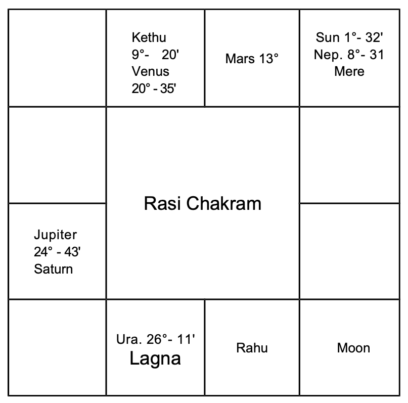
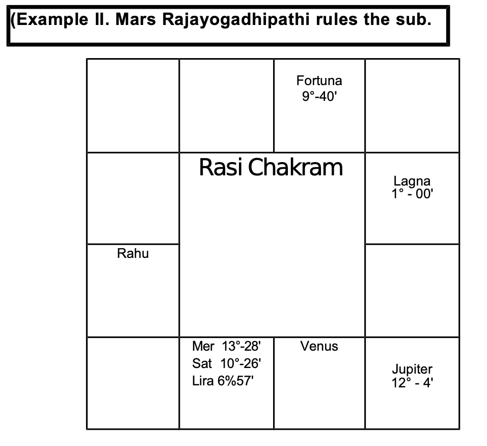
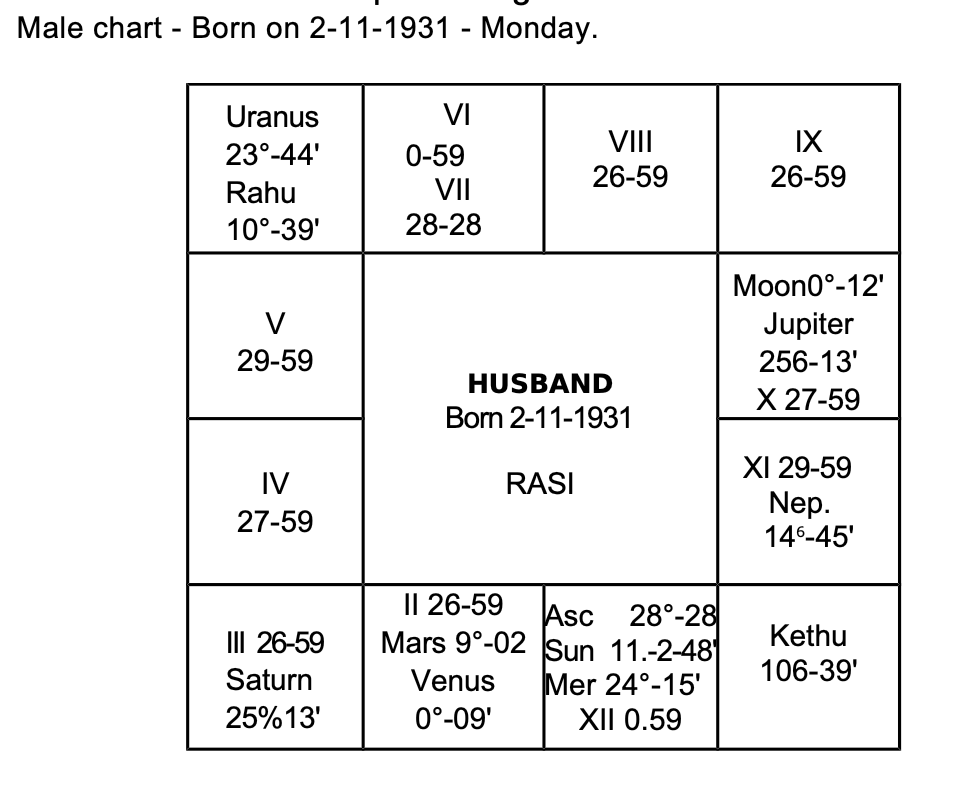
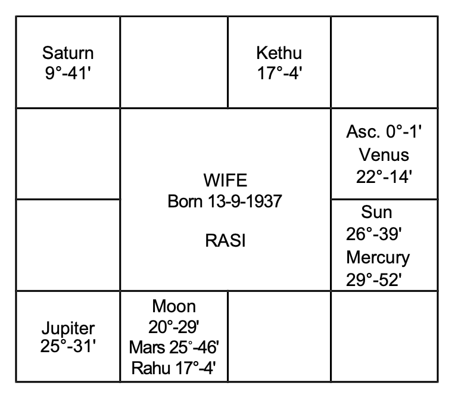
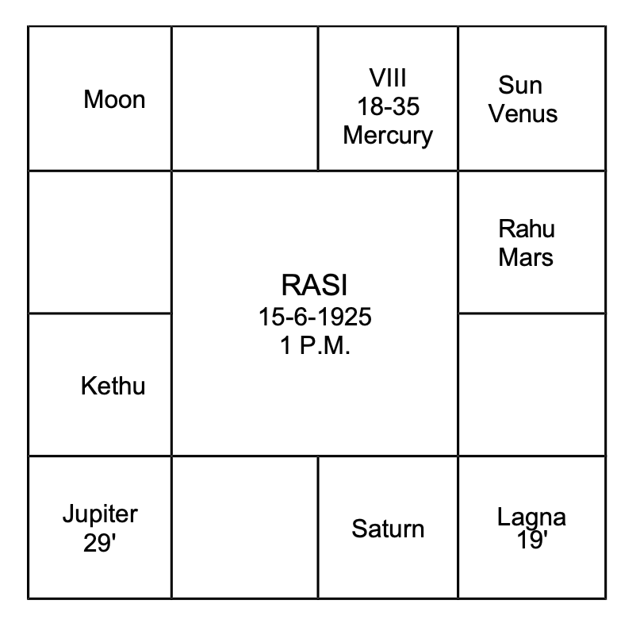
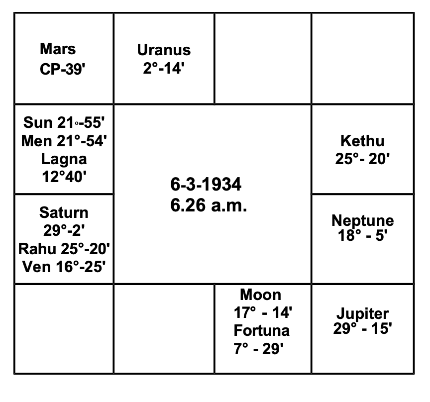
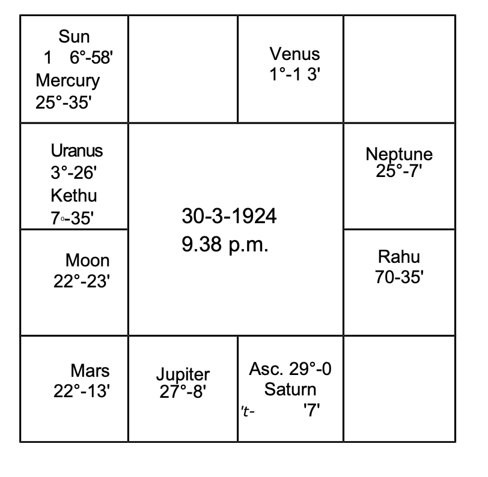
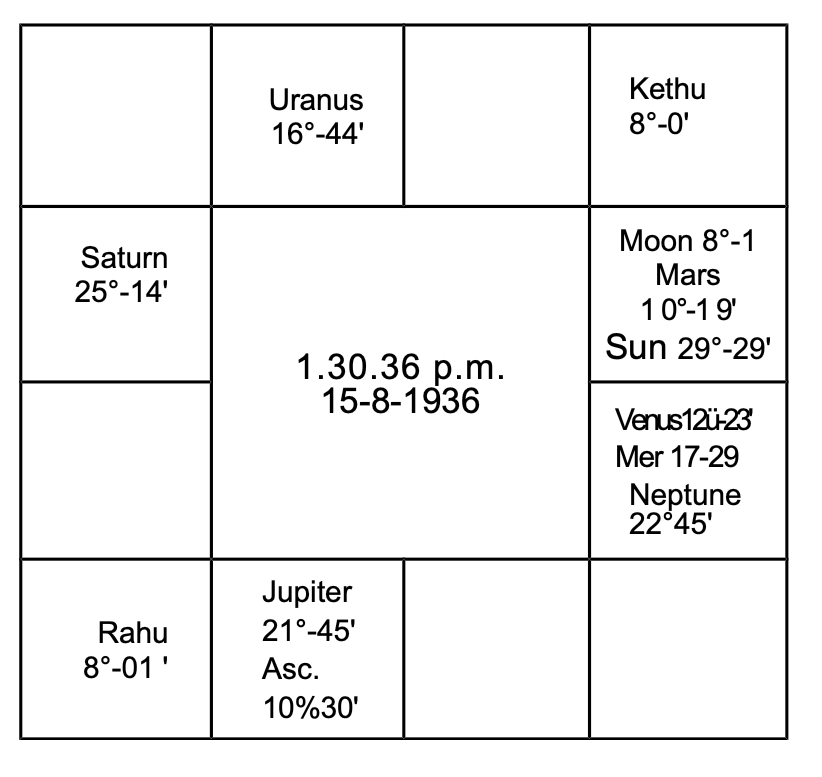
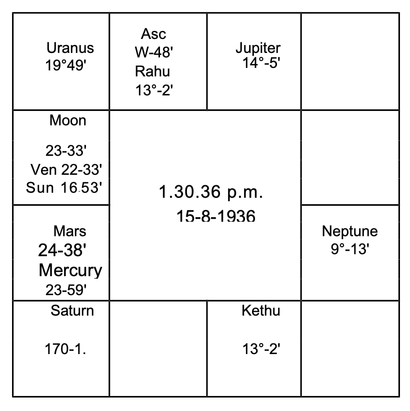
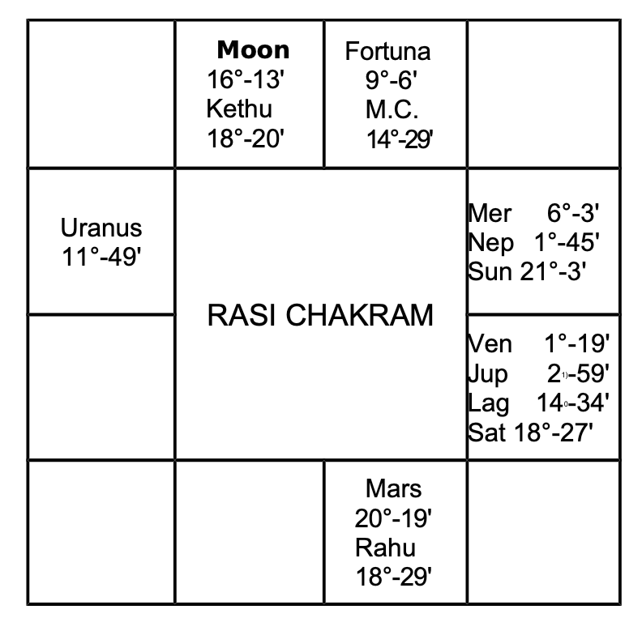

## Physical features

Generally, the sign occupied by the lord of the constellation in which the sublord of the Lagna at birth is, indicates whether one is tall or short, stout or thin-build, etc. These details are given under each sign in vol.1.  
If we classify the 12 signs into 3 groups, then the signs Gemini, Leo, Sagittarius and Aquarius contribute to good height. Aries, Virgo, Libra and Scorpio indicate average height. Taurus, Cancer, Capricorn and Pisces denote shortness.  
Lord of Lagna, in the beginning of a sign, indicates tallness. As it proceeds to the middle of a sign, the person is above average height; between the middle of the sign, and the end of the sign, one becomes shorter. If it is in the end of a sign, one is short.  
Robson says that the lord of the Ascendant and Moon without latitude, posited in the end of a sign produce short persons. Ptolemy mentions that lord of the ascendant with greater latitude causes stout persons. The greater the latitude the more stout one will be.  
In practice, it will be observed that physical description varies from the normal in many respects, especially in twin births. According to Krishnamurti Padhdhati, one's height, weight, etc. depends on the sign occupied by the lord of the star in which the sublord of Lagna is deposited. The sign denotes the physical feature in general, the constellation modifies it. The lord of the sub decides whether one is tall or short, plumpy or wiry and so on.  
Further, one should include the aspects from other planets to the cusp of the ascendant and judge according to the nature of the planet. Good aspect from Jupiter to the cusp of Lagna inclines to overweight, whereas Saturn to emaciation. Mars and charm and beauty. Mercury denotes plumpy with pale appearance. Moon gives prominent features, long nose, piercing and wandering eyes. Uranus inclines to long limbs. Rahu produces tall people. Kethu causes shortness. Saturn and Sun contribute for bushy growth of hair. One's physical feature is governed mainly by the sublord and the sign occupied by the lord of the constellation in which the sublord is situated. Hindu astrologers judge the beauty of a person from the lord of the Navamsa Lagna. The complexion is ascertained from the lord of the Navamsa sign occupied by Moon. The conduct and character is judged from the lord of Trimsamsa. Varahamihira advocates this method of judgement. Mahadeva in Jataka Tatva says that one's appearance will be like that of the planet which is the strongest in the horoscope: the hue depends on the lord of the Navamsa sign occupied by Moon and the behaviour and character depends on the Trimsamsa position of Sun.

### Marks, Scars, or Moles on the Body
Mahadeva has mentioned that Mars and Sun cause red marks; Rahu and Saturn black scars; Moon, Mars, and Venus produce marks on the head; Venus in Lagna and Rahu in 8 cause a mole in the head or right ear. Mars in Lagna and Saturn in trine indicate a mole or mark in the generative system. Jupiter in 8 produces a mole in the belly. A royal mark or mole on the palm or on the foot will be found in persons who have to enjoy Rajayoga.

According to Westerners, one will have a mark or a scar in that part of the body indicated by the sign: (Aries-head; Taurus- ears, neck, throat; Gemini-arms, hands, shoulders; Cancer- breast, Leo-heart, sides, back; Virgo-belly; Libra-reins and loins; Scorpio-secret parts; Sagittarius-hips and thighs; Capricorn- knees; Aquarius-legs and ankles; Pisces-feet and toes.)

1. in which Lagna falls,
2. in which lord of Lagna is deposited,
3. in which Moon is situated,
4. in which Saturn, Mars, or Uranus are posited and at the same time afflicted by evil aspects, and
5. the sign where the 6th cusp falls.

According to me, a mole is found from birth and scars and marks are formed due to disease, cuts, operation, boils, etc.

A male will have a mole on the right side if the Lagna and lord of Lagna occupy a masculine sign. If the Lagna is masculine and the lord of Lagna is in a feminine sign, the mole in that part of the body signified by the Lagna sign will be on the right side, whereas the sign tenanted by lord of Lagna shows the part of the body and the mole will be on the left side. But if a male member is born in a feminine sign and its lord is also in a feminine sign, the mole will be on the left side. If the lord is in a masculine sign, the mole will be on the right. For ladies, the reverse is the order.

If in that sign, the cusp or the lord of the Ascendant is in the first ten degrees, the mark will be in the upper one-third portion of the part indicated by the sign: if it is in the middle 10 degrees, the mark will be in the center of that part of the body: if it is between 20 and 30 degrees, it will be in the lower part of that portion.

As regards scars, one is to note which planets will cause disease or danger; which sign they occupy and afflict; which part of the body will be affected; and also judge when it is to happen. For example, if Venus and Jupiter are in Visaka Nakshathra-constellation 21 degree Libra in the 6th house to Taurus born, one expects appendicitis or hernia during the conjoined period of Jupiter and Venus. As the surgery is to be done in the lower abdomen, one is to predict a scar in the lower abdomen. Similarly, one is to offer a precise and correct prediction.
### Longevity:
According to Western system:

1. By progression, if a malefic comes to the cusp of any angular house,
2. if a malefic forms an evil aspect with Ascendant,
3. if a malefic progresses in the 6th house and afflicts the 4th cusp,
4. if a malefic progresses in the 8th house and adversely aspects the 5th cusp,
5. if a malefic throws an evil aspect from the 12th house to the meridian,
6. if Jupiter, though a benefic, forms an evil aspect with Neptune (MOKSHA),
7. if Neptune forms an evil aspect with malefics,
8. if Uranus, Saturn, or Mars receive strong unfavourable aspect from other evil planets,
9. if they afflict the Lord of the Ascendant or the Ascendant, danger for longevity is to be predicted. So also, during transit, such aspects are to be taken to fix the exact time.

According to Hindus: the span of life of a person may be classified into 3 groups:

1. short life (0 to 33 1/2 years),
2. middle life (33 1/2 to 66 1/2 years),
3. long life (66 1/2 to 100 years)

Our sages have grouped the following combinations:
### Short Life:
1. Moon conjoined with a malefic-not mitigated by the aspect from a benefic and malefic in Lagna and 7th Bhava.  
2. Moon in a Kendra (either in 1 or 4 or 7 or 10) and malefics in other Kendra Sthana.  
3. Weak Moon in 12; evil planets in 8 and 1 - no benefic in Kendra.  
4. Benefics in 3 and 8 afflicted by malefics  
5. Moon in Lagna and malefic in 7  
6. Moon, Sun and Saturn in 8  
7. Mutual exchange between lords of 1 and 8  
8. Lord of Lagna in 3 or 6 or 12 - malefics in 6 or 8 - no favorable aspect from benefics.  
9. Moon, Sun and Mars in 5th house - devoid of beneficial aspects and so on.  
The above is a general principle. It needs further consideration. One should not declare hastily the results applying the above rules alone. 
### Middle Life:
1. Saturn in Lagna, Moon in 4, Mars in 7, Sun in 10, benefics in evil houses.  
2. Jupiter in Lagna in Sagittarius, Mars and Node in 8  
3. Saturn in Lagna, Moon in 8 or 12  
4. Venus in Lagna, Saturn in Kendra, most of the other planets in 3 and 11.  
5. Sun in 7, Mars in 5 and Saturn in Aries.  
### Long Life
1. No evil planet in Kendra: Jupiter in a Kendra position counted from lord of Lagna
2. Moon in 9, no evil in 8, benefics in Kendra
3. Benefics in between first and 6th houses and malefics above horizon
4. Leo Lagna-majority of planets in Kona-Trine houses
5. Cancer or Taurus Lagna: Jupiter deposited in Lagna. Three more planets exalted.
6. Cancer Lagna occupied by Jupiter. Two planets in exaltation.
7. Leo Lagna with Jupiter. Venus in Cancer-Mercury in Virgo malefics in Upachaya Sthana 3 or 6 or 11.
8. Moon in Pisces, Sun in Cancer, Aries Lagna, Saturn in Capricorn, Mars in Libra.

Thus various combinations are given. To my knowledge there are 284 such rules. Readers cannot remember all these combinations. Each rule can be applied only to a few births. These are general. They fail miserably in case of Twins.

But our sages have propounded various methods to calculate the age of a person. They involve so much of calculations that a person needs hours and days to arrive at one figure. Those who would have gone through a few magazines, would be knowing many methods as a symposium is given. This is the theory. It has confused many to know which one is correct and follow. God alone has to help the reader. Publishers do not advocate any one of the various calculations, giving reasons.

The following examples and explanations will be useful. This method is applicable to all births including twins. 

1. Note the correct time of birth and the time of query
2. Erect horoscope using Raphael Ephemeris and Table of houses.
3. Deduct Krishnamurti Ayanarnsa
4. Note the Ascendant-Nirayana position-referring to the table given in the first volume, ascertain the lord of lagna, the lord of the constellation and the lord of the sub. Dase lord is the lord of the constellation: Bhukti lord is the lord of the sub.

If any person has to run the conjoined periods of these three planets, what would be the result? Will he lead a healthy life or will he suffer? If the sub belongs to a benefic, he lives long. When the sub is governed by a malefic, his life is short. This is very clear in the case of twin births where one lives and the other dies. The sub ford is the deciding factor.

If the sub lord is a benefit then it is necessary to calculate and find the span of life. Lords of 1, 5, 9 and 10 are benefics. Lords of 6, 8 and 12 are malefics. if lords of 1, 5, 9 and 10 also rule 5 or 8 or 12 consider the planet as mostly a benefit.

The planets owning other houses are considered as a benefics or a malefic, by noting the other house which they own. How to judge the longevity is explained with 2 examples. Bhadakasthana, Kendraadhipathya and Marakasthanas are explained.

Mars, lord of Lagna rules the sub of the Ascendant. Health, vitality, resistance against infectious diseases, immunity, activity are judged from the strength of the Ascendant, planets in the   
 Lagna Bhava, those occupying their constellation, the good or bad aspects to the Ascendant and to the lord of the Ascendant.  
Benefics in the Ascendant contribute for long span of life.  
Lord of the Ascendant forming favourable aspect with the ascendant and receiving harmonious aspect from benefics promises long life.  
Ascendant is Scorpio.  
Its lord is Mars. As per Hindu System it is aspecting the   
 Lagna and fortifying it. Therefore health and longevity are assured by Mars.  
Disease is indicated by the 6' Cusp, 6th house, planets in the constellation of the occupants of the 6th house, the occupants of the &l' house, the planets in the constellation of lord of 6, the owner of the 6th house, planets conjoined with them or aspected by them affect the health and cause such diseases signified by them when they operate their dasa or bhukti or anthra and there is aspect to them by progression and by transit.  
in this case (so also for Taurus barns) lord of 1 is also the lord of the 6th house. So the same planet owns both the ascendant indicating health and also the 6th house threatening disease. Then when Mars (lord of 1 and 6) dasa or bhukti or anthra is on, how to say whether one will maintain robust health or one will fall ill as Mars has to offer health and cause disease also? Note down which planets form favourable aspects with Mars and the ascendant and which form  

1. adverse aspects with Mars,  
2. good aspect with the 6th house and  
3. adverse with ascendant.   

He will maintain good health during the dasa or the conjoined period of Mars and the benefic who form harmonious aspects with the Ascendant and the Ford of the Ascendant. He ought to have fallen ill and he will have ailment during the dasa of the planet forming evil aspect with Ascendant or good aspect with 6th cusp or lord of 6 or planet in 6. According to K. P. , Significators of 6th house ruling the Sub period in Mars dasa will cause disease and significators of 11 give cure.  
8th house is called the house of "Longevity". Therefore planets in the constellation of evil planets in the 8th house, except  
Saturn, occupants of the 8th house, planets in the Constellation or in the sub of Lord of 8, lord of the 8th Cusp and planets in any manner connected with them indicate (a) danger to one's life (b) the cause of death and (c) the place of death.  
But houses 2 and 7 are Maraka houses and the 12th house indicates Moksha. The reason is as follows. Houses 1, 8 and 3 are judged for longevity and benefics in these houses contribute for long life. 12th house to any BHAVA is the negation of the Bhava. Therefore the 12th house to 1, 8 and 3 are 12, 7 and 2 and they are evil for one's longevity. That is why, houses 2 and 7 are said to be Marakasthanas and 12 is called the Moksha Sthana.   
 So one is to judge the houses 1, 8 and 3 and then 2, 7 and 12.  
First of all one is to judge whether a person is promised "Poorna Ayush - i.e., full course of life running between 66 and 100 or Madyama or Middle life (age between 33 and 66) or short life between 0 and 33.  
Then one is to work out, calculate and ascertain (a) which planet will rule the dasa in that age and the area covered by the maraka planets; (b) according to progression, the time when the 
 Lagna, the lord of the Lagna and the very slow moving planets Saturn, Uranus and Neptune receive evil aspects; (c) according to transit (Gocharam) when evil aspects are formed to the ascendant, its lord etc. as per KR, when Significators transit in such sensitive points ruled by the significators.  
Also, erect a chart for the moment at which there is the urge for one to answer the query and note the evil planets for that moment. Ruling planets for that moment reveal.  
Finally ask the person to mention a number within 249,  
consider the position of the planets and judge. These are for confirmation and confidence.  

### Bhadaka
According to Hindus, Bhadhaka Sthana Adhipathis are the worst malefics who will never hesitate to put an end to one's life. Of the twelve signs, Aries, Cancer, Libra and Capricorn are movable-chara-signs, and the 11th house counted therefrom are Bhadhaka-Sthanas. 

For Aries-born, Aquarius is the Bhadhakasthana and the lord of Aquarius, Saturn is the Bhadhakasthana Adhipathi. To Cancer-born, Taurus is the Bhadhakasthana and the lord of Taurus, Venus is the Bhadhakasthana Adhipathi. Similarly, to Libra, the sign Leo and the Luminary Sun, and to Capricorn, the sign Scorpio and its lord, Mars are Bhadhakasthanas and Bhadhakasthana adhipathis.

For people born in fixed signs Taurus, Leo, Scorpio and Aquarius, the 9th sign from those houses are Bhadhakasthanas and their lords are Bhadhakasthana adhipathis. For people born in common signs Gemini, Virgo, Sagittarius and Pisces, the 7th house therefrom and the lords of those houses are Bhadhakasthana and Bhadhakasthana adhipathis.

### How to Judge
Of all the planets, those which occupy the constellation of the occupants of the Bhadhaka Sthana are the most evil. Next, the occupants of Bhadhakasthana; the planets occupying the constellation of the lord of the Bhadhakasthana, and the lord of that evil sign. The planets conjoined with them or being aspected by them also acquire unfavourable effects.

### Kendrasthan
The Hindus consider Kendhra adhipathyam as harmful. Waxing Moon, unafflicted Mercury, Venus and Jupiter owning the houses 1, 4, 7 or 10 counted from Lagna are regarded as Kendhra adhipathis and a few astrologers are terribly afraid of them, as they have not collected materials and studied from the facts and figures. To decide one's longevity, taking Kendhradhipathyam is not correct; many other methods are to be included. Examples of this include people who have enjoyed their lives for 16 years of Jupiter dasa and are now running Saturn dasa.

### Marakasthana
Next consider the planets in the constellation of those in Maraka sthanas, the occupants of Maraka sthanas, those in the constellation of Maraka sthana adhipathis, the lords of Maraka Sthanas, and those conjoined with or aspected by them. Thus one is to analyse and judge.

The lagna of the example horoscope is Vrischika. It is a fixed sign. The 8th house is the Bhadhakasthana. Moon is the lord of the house. No planet in the Bhadhakasthana. Hence one is to consider its lord Moon after judging the strength of the planets in the constellation of Moon i.e., Rohini or Hastham or Sravanam. Only Mars is in Rohini star.

Venus is a Kendradhipathi owning the 7th house. Venus alone is in Bharani governed by Venus. But there is a node Rahu in one of the signs of Venus and Ketu in the sign of Mars. Rahu represents Venus; Kethu represents Mars. Therefore Rahu and Kethu are definitely evil. Tenant is stronger than owner.

As puma Ayush is promised by the aspect of Mars on Lagna, Jupiter's aspect to lord of Lagna etc, and as it is, he is now running 63 years of age, consider which dasa will prove to be evil. Mercury dasa, Venus Bhukti from 4-6-1962 will operate upto 4 4 1965. Venus in the 6th Bhava, in the dasa of lord of 8 can cause cataract in the eye. It will be developing in this period and in the bhukti of sun, who is in the constellation of the lord of Lagna Mars, will give vision with the aid of a surgeon.

Later Moon Bhukti will be pleasant which will be continuously enjoyed during Mars sub period. Rahu Bhukti begins on 7-7-1968. Rahu is undoubtedly evil. Qasanatha Mercury, lord of 8, in the constellation of Rahu, in Mokshasthana, representing Kendradhipathi Venus, is also undesirable. Kethu in the constellation of Mars is not favourable. Kethu is in the 6th sign, but in the 5th Bhava, it is said that Kethu in the 5th house conjoined with Marakasthana-adhipathi will inflict death. Therefore Budha dasa, Rahu bhukti, Ketu anthra will be the end. Budha dasa Rahu bhukti commences on 7-7-68: Ketu anthra will be between 2-1-70 and 25-2-70. As per transit on 18-2-70, Saturn will be in Ketu star Saturn sub and conjoins exactly Kethu (the anthranalna) opposing Rahu the Bhukti natha. Therefore longevity upto 18-2-1970 is promised. (Actually this native passed away at 7.30 a.m. on 18-2-70).

Sublord of the Ascendant shows one's health, vitality, immunity and longevity: Planets, benefic, by lordship, occupying Lagna, do not guarantee for long span of life so also Malefics to affect health. Though Cancer-natives are considered to be fragile in the youth, they pick up health later and lead a healthy life, yet longevity depends upon the exact position of the Lagna, the sublord and the lord of the constellation in which the sublord is deposited.

6th house shows disease. Planets occupying or owning the house are weaker in strength than the planets in the constellation of the occupants and owner.

8th house shows unexpected and minor or serious incidents affecting one's health and causing anxiety to life.

12th house threatens with danger, hospitalisation and end of life (Moksha).

Houses 1, 8 and 3 are to be examined to ascertain whether one will live long or is blessed with short life. The houses 12 to 1, 8 and 3 are 12, 7 and 2. Twelfth house to any house is the house of negation to that house. Hence, houses 1, 8 and 3 are the houses of Longevity whereas house 12, 7 and 2 are the "Maraka Houses".

The planets, in the constellation of the occupants of the Bhadhakasthana, are the stronger evils: next, the occupants of Bhadhakasthana; next those in the constellation of the lords of the Bhadhakasthana and lastly the lords of these evil houses.

Next, one is to judge the Maraka sthanas, the second and seventh houses, whatever be the sign, in which ascendant falls. Having considered and selected the strong evils, note, when they will operate conjointly (according to Udu Dasa System).

Lagna is Cancer, it is a movable sign. 11th house to Cancer is the Bhadhaka Sthana, i.e., Taurus. Neptune alone is in Taurus. As Neptune is not allotted any star, no planet is in the constellation of the planet in Bhadhaka Sthana.

Venus is the lord of the sign Taurus. Bharani, Poorvapalguni and Poorvashada are ruled by Venus. No planet occupies the constellation of Venus. So Venus itself is a significator. It is in the constellation of Rahu which occupies Maraka Sthana. Therefore Venus is a very strong evil planet.

Leo is the 2nd house, and its Lord is Sun. It is the Maraka Sthanadhipathi to Cancer-borns. No planet is found in the second house. Rahu is in Sun's star. Sun is in the constellation of Saturn. Saturn is Maraka Sthana-adhipathi. Sun is another significator.

Capricorn is the 7th house, another Maraka Sthana. Its lord is Saturn. It is in its own constellation. Therefore it is evil. Saturn's stars are Pushya, Anuradha and Utharattadi (Uthrapathrapada). Majority of the planets are under the sway of Saturn. Ketu is in Pushyam star. But all the planets in Scorpio, i.e. Sun, Mars, Mercury, Saturn and the Uranus are in Anuradha star. None is in Uthrapathrapada. When the majority of the planets are in the same star find out in which sub according to Krishnamurti Padhdhati they are. Those planets in the star of Saturn and the sub of the other significators for death, are definitely EVILS. Mars is the strongest malefic.

* as it is in its own sign;
* as it occupies the constellation of Saturn, and
* the sub of Mercury.

Hence Mercury, Mars, Saturn, Venus, Rahu, Keth and Sun are evil. As Mercury “asa is operating, select Mars sub period. In that sub period, the conjoined sub sub of Saturn, Venus and Sun will operate. It will be after 19-12-1972 and in the second half of February 1973.

Sun will transit in the 2nd degree of Nirayana Aquarius, which constellation is ruled by Mars and the sub ruled by Mercury. Hence when Sun transits in the 8th house, i.e., in Saturn sign Aquarius, in Dhanista star governed by Mars, and the sub of Mercury, in the 3rd week of February 1973, health will fail. Therefore planets promise long life till at least 15-2-1973. This person is yet alive.

## MODE OF DEATH
Hindu sages give many combinations and mention how one meets with one's end. 
One need not apply the same strictly; it is to be modified to suit our age.

### Death through a lion:
- Sun and Moon in 6th or 8th house
- Mars in 4th or 10th house
- Mercury in Jupiter's sign, Mars in Saturn's sign
- Sun and Moon in Mars' sign 8 and Sun in 10

### Death through cobra bite, septic, or poisoning:
- Rahu and Venus in 10th house
- Rahu and Sun in the Navamsa of Atmakaraka, aspected by evil planets
- Mars in 4th house, Saturn in 8th house, and Sun in 10th house
- Saturn in 2nd house, Moon in 4th house, Mars in 8th house, and Sun in 10th house

### Dogbite: 
- Sun in 4, Jupiter and Mars in 10
- Malefic in 12 and 8

### Fire Accident:
Fire accident can occur when the Moon is in Aries or Scorpio and is hemmed in between malefics..

### Lathi:
Mars in 10, Sun in 4 aspected by Saturn; waning Moon in 8, Mars in 10, Saturn in 4 and Sun in 1.

Moon in 10, Mars in 9, Saturn in 1, and Sun in 5 - gas, smoke, carbon monoxide.

### End: Pleasant, Painful, good or bad
Benefics in the 8th house at birth show a peaceful and pleasant end. Malefics, especially Saturn, threaten prolonged illness and long suffering or an accident due to falling down. Uranus threatens an unexpected, sudden end, mostly due to an accident, electrocution, sunstroke, or aircrash. Neptune indicates poisoning, drowning, and unnatural death.

- Mars in the 6th house indicates a bad end.
- Mars in the 12th house and Saturn in the 8th house indicate a dirty death.
- Sun with the lord of the Lagna in Capricorn or Aquarius indicates lightning or electrocution.
- Moon and lord of the 9th house in the 8th house indicate a peaceful death.
- Saturn in the 4th house, Moon in the 7th house, and Mars in the 10th house indicate drowning.
- Sun and Moon in a dual sign indicate drowning.

Many yogas are given by our sages. To commit them to memory and to recollect them at the time of scrutiny of a horoscope is a problem, almost close to impossibility.

Also, they say, find out the 22nd decanate from the Lagna and judge the characteristics of this decanate lord and predict the mode of death. Or find out the decanate occupied by the lord of the 8th house. Its lord will reveal the mode of one's end. As, at the outset, it fails in the case of births with a short interval of time between the two, like twins, the above is to be taken as a general principle alone.

But according to Krishnamurti Padhdhati one is to take that:
- Danger is indicated during the conjoined periods and subperiods of the lord of the sign, lord of the star, the lord of the sub where the 8th cusp falls, and the lord of the constellation in which the sublord is deposited.
- If the sub is ruled by a benefic, promising long life or cure, even though there is danger, one will escape and survive. If the sub lord is a malefic and a Significator of death, one will succumb to it.
- Jupiter sub shows a pleasant end; Mars' a sudden one; Saturn's a chronic and lingering one.

### Place of Death
If the sublord of the 8th cusp is the significator of the houses 1, 4, and 10, it shows that the end is in his own place.
If the sublord of the 8th cusp is the significator of the 3rd house, it shows that while one is making a short journey, mostly on his return journey, one passes away. Sublord of 8th cusp if significator of the houses 6 or 8 or 12 indicate death in the jail or in the hospital or in an unknown place.
If the sublord of the 8th cusp is the significator of the 9th house, death will happen during a long journey or in a far off place.

### Air Accident
The horoscope of one who was born with Moon and Jupiter in Cancer like Lord Shri Rama, having a similar name, was one of the 117 passengers by the Air India Boeing 707 reported to have crashed; is as under:

Jupiter dasa - Balance 3 years, 8 months, 28 days.
The following is the chart of the wife who has survived her husband: Mercury dasa - Balance 4 years, 5 months, 24 days.

By air crash it is meant:

- one has the opportunity to go by air, on a long journey
- the unexpected end
- in husband's chart, a far off place.

Long journey is indicated by the 9th house. Planets in the Stn house are Moon and Jupiter. Rohini, Hastham and Sravanam are ruled by Moon. Ketu alone is in Hastham. Venus, Mercury and Moon are in Jupiter's constellation. Mercury is lord of 9. It is in Shookshma Parivarthana yoga with Jupiter. Jupiter alone is in Mercury's constellation. Hence, Mercury, Jupiter, Moon, Venus and Kethu are the significators.

Find out whether there is a node occupying the sign of the significators. Rahu is in Pisces ruled by Jupiter. Hence take Rahu as the strong significator. Therefore, the conjoined periods of Mercury, Rahu, Ketu, Venus and Moon should create a chance to go overseas.

Actually he left India during Mercury Dasa, Rahu Bhukti, Venus Anthra, Saturn Shookshma, as Mercury is in 12, in his own Sub, Rahu is in Bhadhakasthana adhipathi Sun's Sub, Venus in the constellation of Jupiter and Sub of Moon (both in 9), Saturn is in the constellation of Venus owner of 12th cusp. All these are connected with 3, 9 and 12: hence he made the journey.

Why should there be an unexpected end? Danger and death are denoted by the Sublord of the Cusp of the 8th house. Sublord is Jupiter, Lord of 3 in 9 in the constellation of Lord of 9, Mercury who is always for travels. Venus denotes the vehicle, Mercury the travels. Hence, his end was far away from native place. As the same planets rule the Sub of 8th house there was danger.

Let us note the ruling planets then. 

- It was a Monday ruled by Moon. 
- The star was Sathabhisha governed by Rahu. 
- The might be 11° Capricorn, in the constellation of Moon and it would have coincided with Mercury i.e., to the place of accident, Mercury would be rising in the East then.
- Why should the lady lose her husband in a far off place?
- She was running Venus Dasa, Mercury Bhukti, Venus Anthra. 
- The 7th cusp is to be taken as the ascendant of the husband. 
- Then Venus is in the constellation of lord of 6 Mercury who is in the constellation of Lord of 8 Sun. This disposition is danger to husband.
- For her, the 8th house shows Mangalyam. It receives aspect from Mercury, Sun and Mars. This combination indicates Mercury, during travels; Sun by fire accident; Mars, sudden end to him causing Shur Bagyam to her.
- Look at the Yogas in her chart: 
    - Chandra Mangala Yoga
    - Sunapha Yoga
    - Lagna Adhi Yoga
    - Nipuna Yoga
    - Vesi Yoga
- What have they done to her; Let traditional astrologers consider these and correct themselves. Is there any amangalya Yoga?

Thank you very much for your letter of May 21, 1969 in which you discussed the horoscopes of myself and my friend. Here I am amazed by the accuracy of your prediction. Your lucid and logical approach to Astrology is very impressive and certainly commendable.

Some of your predictions are amazingly accurate. I did have an automobile accident in the third week of May 1968 which I escaped with no injury and damaged vehicle. Also I did buy a car around 16-2-68 as you had said.

I wish to keep in touch with you and I intend to meet you when I visit India. If you should ever consider the possibility of visiting the US, I shall be delighted to help you in every possible manner. I believe your trip to this country can be very interesting and rewarding if planned properly. Astrology as a hobby has helped me a lot in all walks of my life in the US.

### ESCAPE FROM AN ACCIDENT
A friend says, "The following is my chart. On 1-9-1962, Saturday while returning from office, a truck dashed my vehicle. I fell on the left and escaped. If I had fallen on the right, I would have been run over and crushed. Do you expect any injury or similar accident, in future?

Mercury dasa Balance at birth 9 years, 3 months, 5 days"

Generally people born in the sign owned by Mercury (Gemini and Virgo) will have accidents, injury, fracture, dislocation, etc. as:
* To Gemini-borns, Mars rules the 6th house and Saturn the 8th house
* To Virgo-borns, Saturn rules the 6th house and Mars the 8th house. Of the two signs, Virgo is the worst as Mars rules the 8th house.

On 1-9-1962, you were running Sun dasa, Mars Bhukti, Saturn anthra.
* Sun, lord of 12, in the constellation of Mars (Ashtarnadhipathi) in the sub of Mercury and in the sign of Mercury causes hospitalisation and separation from family.
* Mars, lord of 8 causes danger.
* Saturn, lord of 6 in 2 gives separation from family, expenses, disease and also borrowing money.

On 1-9-1962, the day was Saturday. The Nakshathra was Uthrapalguni, governed by Sun and the Lagna was in Mars sign Scorpio, in the star of Anuradha 4th pade governed by Saturn.
As the dasanatha and bhuktinadha were in the 10th and 11th houses respectively and above the horizon, you fell on the left side. As Jupiter was aspecting the lord and was below the horizon, the providential aid came from right side. That is why, the truck went on the right side and you thereby escaped. If Jupiter would have been in the 9th house and above the horizon, the truck would have come on the left and would have gone at a distance. If Jupiter would have been in Lagna, the truck would have stopped just in front of you.

I had the chance to see the horoscope of my friend who had Jupiter in Lagna. He was in a scooter. The signal was red. He stopped his scooter. When the yellow light was on, he tried to start once, twice, thrice. No, it did not start. To his luck, the driver of the car in which I went, thinking that he will move, started and picked up, say, 5 miles speed. As he did not move, the car gave a push to the scooter. Ah! It started at once and my friend drove away. Even to start a vehicle when it is not perfectly all right, God helps in this manner.

As long as, well placed Jupiter aspects your Lagna, there is no fear."

### Health and Disease
Good health is maintained when:
- the cusp of the Ascendant receives good aspect from the lord of the ascendant, luminaries and other benefics
- neither the cusp of the Ascendant nor the lord of the ascendant is adversely afflicted
- lords of 6, 8 or 12 neither occupy Lagna, nor conjoin lord of Lagna nor form favourable aspects
- lord of Lagna does not occupy 6 or 8 or 12.

Krishnamurti Padhdhati says that if a person is born with the cusp of ascendant in the constellation of the lord of 6 or 8, he will not have sufficient immunity and resistance against infectious diseases and is easily susceptible especially during epidemics. If the sublord of the ascendant is in the constellation of significator of 6, the person will be sickly. Therefore if the ascendant and the lord of the ascendant and the sub are in the constellation of planets who are significators of houses other than 6 or 8 or 12 the native will live long and good health will be maintained.

Planets posited in the constellation of lord of 6 or in the sub of lord of 6 cause disease. Planets in any manner connected with 11th house cure the disease as the eleventh house is the 6th to the 6th. Whenever one suffers from any disease, one will be running the period of the planet connected with 6th house. He can expect the cure only during the sub period of the planet connected with Ascendant or 11th house.

To judge the nature of the disease, one is to refer to Vol. 1, where it is exhaustively dealt with and explained, what each sign signifies and what each planet indicates. Suppose one runs the periods of a planet in Scorpio in the constellation of Saturn (Anuradha) and in the sub of Moon, for the Leo-born, Sign Scorpio indicates generative system. Being the 4th house to Leo born, it shows the breast or lungs. Saturn, the lord of the constellation, denotes that it is a chronic complaint. Saturn in a watery sign or Saturn star Moon sub indicates Pustulation. Hence, boil in the breast or Pustulation in the secret parts is threatened. Gonococci infection, may be expected. If the sub belongs to Venus, it indicates Fibroid Tumour. If Jupiter rules the sub, one suffers from cancer. Mars sub warrants surgical aid. Thus having the sign, the star and the sub one has to decide the nature of the disease.

Whenever one is to know when a disease will be cured, it is to be found first of all whether there is a cure at all. Then only ascertain when it could be cured. No person can have a cure from the chronic disease, if there is no planet in 11, no planet in the constellation of the owner or occupant of 11th house and if the 11th cusp and lord of 11th are in the sub of evil planets. Lepers and a few mentally deranged patients ever suffer till death. Horoscopes of such persons reveal that the lords of the dasas which they experienced after they contracted the disease are all in the sub of lord of 6 and the 11th house is not strong. Lord of 11 and 1 are also spoiled.

People suffer from various diseases at different ages. These depend on both the dasa lord and bukti lord. Planets in any manner connected with the 6th house have to cause disease. Hence, in their conjoined periods they produce the sign and the house occupied by these planets show the part of the body afflicted and the complaint.

Planets in movable signs cause diseases of short duration; common signs indicate neither short nor long, but there are chances of relapse; fixed signs threaten diseases of prolonging, chronic, loathsome and tedious nature. Any planet can own the 6th house or occupy the constellation or sub of lord of 6, therefore all planets are capable of causing ailment. Hence, what each planet can produce, which part of the body each can affect, etc. are dealt with in Volume 1. One is to be well conversant with the diseases signified by signs and planets.

## FINANCE AND FORTUNE (General)

According to Westerners the fortune of a male is judged from the strength of Moon, its position, the aspects received by Moon and the applying aspect of Moon immediately after birth. For ladies, one is to consider the above in relation to Sun.

Planets owning and occupying the house 2 and 10, harmonious aspect between Sun and Moon, advantageous disposition of Jupiter and Venus in the Ascendant or in elevation, and beneficial aspect from any planet to the second cusp, are promising factors for one to make fortune.

Evil aspects to the Meridian and to the lord of the Ascendant threaten difficulties and throw obstacles in inheriting the patrimony. Benefits by nature, occupying the houses 1, 4, 7 or 10, and evil planets in 3 or 6 or 12 promises, and if none is afflicted one can have a pleasant and prosperous life.

If slow moving planets form mutual favourable aspects and the luminaries also are strong and receive harmonious aspects, smooth and successful career throughout life is assured. Planets close to second cusp with beneficial aspects from other make one rich, planets close to meridian receiving good aspects improve one's status and luck. Strong planets in the 8th house promise legacy, inheritance and sudden windfall. Benefics in movable signs give sudden and substantial wealth; if they are in fixed signs, the income is steady; but if they are in common signs, it is difficult to hoard up money. Mercury increases liquid cash, share certificates and documents, Jupiter indicates all varieties of property; palatial building, gold etc. Venus offers jewels, vehicles, furniture, garden; Saturn shows landed property; mine and antiques; Mars gives land and building; Sun for authority, power and gold; Moon for liquid cash and wet lands.

Uranus or Neptune in 5 gives the tendency to speculate. Good aspect to lord of 1, 2 and 11 promise unexpected gains by betting, race etc. Fortuna causes fortune through the source indicated by the house occupied by it. The lord of the sign containing Fortune will make one rich if it receives beneficial aspect. Note which planets forms favourable aspect with Fortuna. One becomes rich, through the matters signified by those planets. Uranus gives high position, covetable posts, honour etc. Also one may float big companies or follow novel and uncommon enterprises. If Neptune forms good aspect with Fortuna one will deal in big trade, smuggling, cheating, fraud, deception, swindling etc.

Pearce says that planets rising before Sun and setting after Moon promise one's income. Planets above the horizon, strong by sign give determination and opportunity to come to the front of the public, be popular and be prosperous.

If Saturn or Jupiter rule the 8th house and if there is good aspect with Uranus, they produce gifts, legacies; if they rule the 4th or 10th house, they give inheritance (to majority of people nowadays, it can be taken as provident Fund; Gratuity, Compulsory savings etc.).

If Moon aspects adversely Mars or Saturn or Uranus in the second house, there will always be financial trouble, endless and life long. Jupiter and Moon in adverse aspect threatens loss by imprudence and over liberal actions; Mars makes one extravagant and impulsive; though one may earn more and more, yet one will spend away everything.

According to Hindus, one becomes rich or poor depending on the various Rajayogas and Avayogas propounded by them. In practice, however, this is not always true. For example, Hindus declare that one born with Gajakesari yoga or Lakshmi yoga will be popular, prosperous and rich. While a few rich people may have this combination, the majority of people suffer from penury and lead an obscure life.

Traditional astrologers often encourage the consultant by giving false hopes and not appraising them of the advantages, the extent to which it can help and when. For example, a cook may have both Chandramangala yoga and Gajakesari yoga in their chart from birth, yet due to financial trouble, they could not study and lost what little property they had. They then took up a profession in a tea-stall and slowly qualified themselves to be a cook. Despite this, they remain a cook in a labour canteen and these yogas have not helped them to be at least a cook in any officers mess or quarters whereby they can gain some influence.

If one studies these hundreds of yogas and applies them practically, one will conclude the following:

- Existence of Rajayoga in a horoscope is not a guarantee that one will enjoy one's life. It is not universally applicable; it fails miserably and hence it is meaningless.
- There are people rolling in wealth, holding responsible positions without any yoga - as is said by Hindus.
- It is not clearly stated by the authors when such a yoga will be fruitful and how long, the extent to which it can give a lift, how far it is capable of mitigating other afflictions, or if it can completely ward off other evils.
- When one considers the horoscope of Lord Rama, one finds many yogas. Can such yogas get him separated from his wife, passing anxious times, having irregular food, taking whatever is available, etc.? If a soothsayer were to meet him prior to the time when Hanuman was introduced, and if the soothsayer were to narrate all the Rajayogas in His Horoscope, what would be the reply of the person to whom the horoscope belongs?

In Bombay, I met an industrialist. He pays lakhs and lakhs as income tax and saves equally. In his horoscope there are three debilitated planets and no Rajayoga. When I came out of his room, his clerk showed his horoscope. Four planets were found in yogas. Look at his fate? He asked the astrologer to recommend to his officer for a petty increment. If both the horoscopes were given to someone, following these Rajayogas, he would promote the clerk as the proprietor of the industry and revert the proprietor as the clerk. Let me not write volumes on this unscientific method of examining a horoscope.

The following is the general method followed by Hindus to ascertain whether one can earn and save or lose and suffer:

- One commands money if the second house is strong; if the lord of 2 is exalted; or if it is in a Kendhra or Kona; but if it is weak, afflicted and ill-posited, one loses money, prestige and position;
- Lord of 2 conjoined with or aspected by Jupiter, Mercury or Venus, makes one rich or an intelligent orator or a popular wealthy person;
- Mutual exchange between the lords of 1, 2 and 11;
- Lords of 2 and 9 in a Kendhra;
- Lords of 9 and 10 in any manner connected with each other;
- Lords of 2, 6 and 11 in a Kendhra or a Kona;
- Lords of 2, 10 and 11 in similar position;
- Jupiter and Venus in an angle, lord of 2 in Gopuramsha or Simhasanamsa; or
- Benefics in 3 or 6 or 10 or 11 counted from Moon sign make one rich;
- Four planets in their own quarters make the person wealthy;
- Conjunction of Moon and Mars produces a rich person;
- If the owner of the Navamsa sign occupied by the lord of the 10th house is in Vaiseshikamsa, and if it is aspected by benefics, one becomes rich;
- If benefics are posited in all the four angular houses, one amasses wealth;
- Mercury in Cancer and Saturn in 11 make one very rich;
- Sun in 5 in Leo, Jupiter in Aquarius make one rich.

Mahadeva in Jataka Tatva states that general rules cannot apply to all. For example, between 17th August and 17th September every year the Sun will be in Leo, and once in 12 years Jupiter will be in Aquarius. During this period of one month, many children will be born in both poor and pleasant families, but not all of them will become rich.

Krishnamurthi Padhdhati suggests judging one's finance and fortune as follows:

- Planets posited in the constellation of the occupants in the houses 2, 6, 10 or 11 are the strongest to give wealth to a person, even if they are debilitated or in enemy's house. Their periods and sub-periods will still improve one's status if they are in the sub of the Significators of 2 or 6 or 11.
- The planets tenanted in the above said houses and occupying the sub of the significators of 2, 6 or 11 should not be afflicted by the lord of the constellations in which they are. They indicate an increase in income and savings.
- The planets in the constellation of the lords of the houses 2 or 6 or 10 or 11 and is in the Sub of Significators of 2, 6. or 11.
- The lords of these houses in the Sub of the significators of 2,6 or 11.
- Those which are conjoined with the significators or aspected by them.

Planets contribute to one's riches:
- Provided the sub occupied by them are governed by the Significators of 2 or 6 or 11.
- Provided they are not adversely aspected.

If the sub lord is evil, one loses or is unable to make money during the conjoined period of the planet and the sublord. The planet adversely aspecting robs away the beneficial result during their conjoined periods.

Further, majority of planets either posited in the constellation of lord of 8 or 12 or in their subs in other constellations, threaten loss and poverty. They also indicate issue of cheques to repay loan or give away the share of profit.

If a planet owns 8 and 11, or 12 or 11 houses, then one can expect beneficial results during its period, in the sub period of other benefics being the Signifiactiors of 2, 6 and 11; in the sub period of evil planets one will lose. The ownership of an evil house and that of a favorable one by the same planet does not cancel one another and becomes neutral, but actually one will gain during its period, in the sub period of benefic and one will incur loss during other sub periods. Ultimately the profit and loss may be adjusted and the balance sheet may show 'NIL'. Yet there should be both the entries in the ledger; pleasure and profit as well as pain and loss.

One is fortunate, if majority of planets are strong, occupy beneficial constellation in movable sign and are in angular houses. Also the mutual aspects should be harmonious.

### Either poor or should work for 
* Sun in Aries, other than Parama Ucha point.
* Sun in Cancer - passionate and poor.
* Sun in Capricorn or Aquarius - poor.
* Mars in Leo - cannot save.
* Mars in Aquarius - miseries - poor.
* Mercury in Aries or Scorpio - swindles other's money, poor.
* Mercury in Leo - penniless.
* Mercury in Capricorn Aquarius - debts, overdraft.
* Jupiter in Capricorn - poor, unhappy.
* Venus in Cancer - expects help from others.
* Saturn in Gemini, Virgo - loss of money - poor.
* Saturn in Cancer - poor; in Leo - mean.
* Lords of 1, 4 and 9 occupying 8th Bhava - very poor - loses wealth.
* Lord of 2 in 12 and lord of 12 in 2 - poor.
* Lord of 2 in 12, lord of 12 in Lagna, aspected by lord of 7.
* Lord of 5 or 6; lord of 9 in 8 aspected by lord of 2 or 7.
* Malefics in 2, 4 or 5 counted from the sign occupied by Jupiter.
* Even though benefics may be posited in the 10th house, malefics in the second house produce poverty.
* Malefics in 3, lord of 12 in 2 and lord of 9 in 12 - very poor.
* Moon, Jupiter and Saturn in Kendra signs, Mars in 5 or 8 or 12 - make one very poor.
* Sun and Moon in Aquarius, other planets in debilitated signs - makes even a King a poor person.
* Venus in Capricorn, and the following planets in debilitation i.e. Mercury, Moon, Mars and Saturn - show that even a Prince will lose his property and become poor.
* Lord of 2 being weak, conjoined with or aspected by malefics - makes one poor, especially when lord of Lagna is also weak.
* Moon in the Sayana avastha - poor.
* Mars in Nidra avastha - poor, distressed.
* Malefics in 12 connected with Moon - loss of wealth by floods.

### Riches
- The source of one's wealth is from father, mother, enemy, friend, brother, wife or servant if Sun, Moon, Mars, Mercury, Jupiter, Venus or Saturn occupy the 10th house respectively.
- How one acquires wealth is to be judged taking into consideration whether a planet is in its own sign, friendly or enemy's camp.
- Benefics in 1, 2 and 11 show that a person acquires wealth by various means.
- One commands moderate wealth, if Saturn is in Libra.
- One rolls in money, if Jupiter is in Cancer or Sagittarius or Pisces, or if Saturn occupies either of the signs of Jupiter.
- Venus conjoined with Mercury or Jupiter conjoined with Venus make one very rich.
- Sun in Sagittarius make one rich.
- Mars though debilitated in Cancer and exalted in Capricorn-in both signs contributes for wealth.
- Sun either in 9 or in 11 endows one with wealth.
- Mercury, Jupiter and Venus in Lagna shows that one will become very rich.
- Moon conjoined with Mercury or Jupiter make one rich.
- People born with Moon in Punarvasu, Pushya, Makham, Moolam, Sravanam, Poorvapadra and Fievathi become rich.
- Sun in Gemini, Mars in Aries or Scorpio, Jupiter in Aries or Scorpio, Venus in Gemini contribute for further riches.
- Moon in Aries aspected by Mars, Moon in Taurus aspected by Venus. Moon in Sagittarius aspected by Jupiter marker one rich.
- Jupiter in Prakasavastha is good for wealth.
- Lord of 11 allows to save. Lord of Lagna permits to enjoy. If they are conjoined and also aspected by Moon, one becomes wealthy suddenly.
- If the third Bhava is a beneficial sign and it is occupied or aspected by benefics one acquires wealth.
- Benefics in the 4th house give ancestral property land, house, conveyance, etc. and contribute for further riches.
- The mutual exchange between lords of 2 and 5.
- Lord of 5 in 5 and lord of 9 in 9.
- Conjunction of lords of 2, 5, 9 and 11.
- Connection between lords of 2, 4, 9 or 11 and Full Moon aspecting any of the four lords.
- Jupiter and Mercury in the second house.
- Lords of 1, 2 and 11 in their own signs or in mutual exchange.
- Lords of 2 and 11 in Lagna; (Mercury in Leo Ascendant, is good. But for other Lagna-horns, Mercury in Leo show loss of money.
- Venus and Moon in 3, or Rahu in 4, 5, 10 or 11; Ketu in 8, will give wealth during their periods.
- Sun in Devalokamsa and the lord of Lagna strong, endows with all kinds of wealth.
- Lord of Lagna conjoined with Kendra lord gives wealth.
- Lord of Lagna in 10, Sun in Lagna aspected by benefics.
- Lord of Lagna conjoined with Jupiter in 2 or Kona or kendhra house.
- Benefics in 5 or 11.
- Lord of 2 in Gopuramsa.
- Mars or Mercury in Kantukavastha gives wealth.
- Lord of 7 or 5 is auspicious to command wealth at all times.

### Loss of wealth: (Hindu)
- Sun in Bhojanavastha or Nidhraavastha,
- Jupiter in Netrapanya avastha,
- Venus in Aagamavastha threaten loss of wealth.

### Recovery of lost wealth: (Hindu)
- If the lord of the seventh house occupies the second house, one will regain any wealth that has been lost. 
- If the lord of the seventh house is in the sub of the lord of the second house, the same result will occur.

### Never can one regain what is lost
If the lord of the 8th house is in the 2nd or 3rd house, one's property will dwindle and they cannot regain anything that is lost. Malefics in the 8th house destroy wealth, and malefics in the 8th and 12th house afflicting the second house threaten loss. In horary astrology, malefics in the 6th, 7th, or 8th house conjoined with the lord of the ascendant show loss of wealth and the lost cannot be recovered.

Examples of horoscopes of rich persons who gain crores of rupees every year, very intelligent and noble gents, are given for students to study whether there are the so-called Rajayogas:

- How many planets are exalted?
- What are the Yogas?
- Note in which constellation the planets were posited. Sun in the constellation of lord of 2 and 11.

These four examples are given for students to study. Note whether there are the so-called Rajayogas.

The above horoscopes belong to the richest person in India. The future promises more riches.

### FORTUNE IN SERVICES

Born on Saturday at 7-10 A.M. L.M.T. on 7-8-1920 at 22'0' North and 73° 16' East.

Finance:
- Second house indicates bank position and self acquisition.
- Sixth house denotes one's personal exertion, labour work and thereby earning money, or raising loan.
- Tenth house shows one's profession either in service or in independent business as well as one's inheritance.
- Sun is the chief governor for profession. Jupiter indicates the bank position. Fortuna portrays how one will be fortunate. (Always take the Bhava [house] and not the signs to find out results as each house signifies certain matters.)

No planet is in the second, or the 6 or the 10th house. But Fortuna is in 10th sign and 9th Bhava. As Fortuna gives fortune to one in the period of the lord of the constellation in which it was posited and as it represents the lord of the star, Fortuna is to give the results of Sun, who rules the Lagna and Significator of houses 2 and 11 being deposited in Mercury Constellation. Fortuna was 9° 6' in Taurus. So according to Krishnamurti Padhdhati, Fortuna was in Venus sub and in the constellation of Sun. Therefore during the conjoined periods and sub periods of Sun and Venus, he will be fortunate. (Actually he took up service only in Sun Dasa, Venus Bhukti).

Mercury rules the second house. Its stars are Ashlesha, Jyeshta and Revathi. Sun alone was in Ashlesha star. Sun in Cancer, in the 12th house in Mercury's star, indicates that he will have security of service, permanency, mostly service under Government in a place, far away from his native place. It is in a movable sign. Therefore there will be change in the department and in the nature of work during the periods and sub periods of Sun, from one institution to another. He will be transferred with lien in the previous department or completely severing connection with the previous job. Also, Sun indicates that it will end his educational career and offer official life.

During Sun Dasa, Venus Bhukti, Jupiter Anthra in the end of December 1941, when Sun transited in Poorvashada star (governed by Venus in Jupiter's sign) he joined a Bank. Sun also causes changes: on 1-5-1942 during Sun dasa, Venus Bhukti, Kethu Anthra he went to Rajkot: during Mercury sub in Kethu anthra, on 6-5-42 he joined the International Bank.

Again during Moon Dasa, Mars Bhukti, Sun Anthra, he left service in the Bank and joined Government service in the Revenue Department. During Moon Dasa, Sun Bhukti he was promoted as class Officer with a change in the place. Thus Sun had been uniformly doing good in service matters.

Again, when he will run Rahu Dasa, Sun Bhukti, Jupiter Anthra, in the middle of March 1974, he can expect a higher rank with confidence. There will be increase in income and improvement in status.

Let us take the V house. As Leo is the ascendant, V house is Capricorn. Its lord is Saturn. Pushyam, Anuradha and Utharapadrapadha are the three stars governed by Saturn. Mercury is the only planet occupying Pushya. Hence Mercury indicates that:

- he will be inspecting the accounts submitted by others or carrying out the instructions of other officials;
- as it is in a movable sign, there will be transfers and changes;
- Mercury will give long journey including overseas; and
- he may have to serve in international trade or foreign exchange or in exports and imports.

Saturn, as lord of 6, in the ascendant in the sign owned by Sun, in the constellation of lord of 10 Venus, and in the sub of Rahu who is an agent of Venus, indicates that he will be holding a position of trust and that he has to keep secrets. He will work in a department where the official matters are to be kept in strict confidence and should not be disclosed. Therefore, during the period of Saturn, he will be entrusted with such a work. He may be asked to unearth some facts which were unaccounted, but possessed by the parties. As Saturn was in the constellation of Venus, lord of 10, he will be crowned with success. Not only will he be able to do the job most satisfactorily, but it will also be recognised and he will have an outstanding confidential report during Saturn's sub periods. When he was running Rahu dasa, Jupiter bhukti, Saturn anthra in May 1962, he came to this department. Saturn Bhukti commenced on 13-6-1964. Thereafter, he had been doing such a work and it is sure that he will be establishing a good name.

Generally, the 10th house is termed as Karmasthana. It includes doing the last rites to father and mother, to do religious functions, yagnas, etc., and to work and make money. That is why, those who enjoy promotion during the period of lord of 10, also lose either of the elders. The 10th house is the second to the 9th (denoting father) and the seventh to the 4th (indicating mother). 2 and 7 are Maraka Sthanas. Hence death of either of the parents and promotion in services come together. 

It is worthy to note that his father passed away immediately after Saturn Bhukti started, as it was in the constellation of lord of 10. Since 9th house indicates father, and birth was in Leo, Aries is the 9th house and Saturn is the Bhadhaka Sthanadhipathi to Aries. Hence, Saturn affected the longevity of father, on 27-6-'64 on Saturday in Uthrashada star when Moon transited in Saturn's sign and in the constellation of the chief governor for father-Sun. Also Saturn transited in Sathabhisha star in Saturn's sign and Rahu's star. When one is running Rahu dasa Saturn bhukti, one will realise those results which are indicated by the planets in birth-chart, when they transit in the star of Rahu in Saturn's sign, i.e., Sathabhisha. This is an important ruling of the editor. (If the Bhukti is ruled by Mercury, the significator is to transit in Mercury's sign and Rahu's star Arudhra. If the sub period is ruled by Venus, the significators have to transit in Rahu's star Swathi in Venus sign-Libra.)

The 10th house is Taurus. It is ruled by Venus. No planet occupies Taurus. Therefore consider Venus and planets occupying Venus star-Bharani, Poorvapalguni and Poorvashada are the three stars under the reign of Venus. Moon and Kethu are in the star Bharani; Saturn is in Poorvapalguni. No planet in Poorvashada star. Hence Saturn, Moon and Kethu are under the sway of Venus and whatever Venus is to offer, would be given during the periods of Moon, Kethu and Saturn.

Moon indicates changes, transfers and life in a far-off place. Ketu shows a thorough change. Saturn offers responsible position. Venus owns two houses, Taurus and Libra. Taurus is the 10th house. As Venus owns it, find out whether Rahu or Kethu occupies either Taurus or Libra. Then the node is stronger than Venus. As Rahu was in Libra, at the time of birth, Rahu will prove to be fortunate. Actually, he had a good lift on 15th July, 1959, when Rahu Dasa, Rahu Bhukti, Rahu Anthra was operating; Swathi was the Nakshathra on that day.

- Rahu is the strongest benefic
- Mercury gives good opportunity to show the talent during inspection
- Mars adds authority and power
- Venus bestows on him social and financial success
- Sun offers a permanent position in the Government
- Jupiter increases income, changes the residence and office and improves status. It gives service in the Revenue Department
- Moon indicates fortune in a foreign place, and so on.

### FUTURE PROSPECTS
- Rahu Dasa, Sani Bhukti, Rahu Anthra, Sukra Shookshma November 1966 - promotion.
- Rahu Dasa, Budha Bhukti, Moon Anthra June 1968 - overseas.
- Rahu Dasa, Budha Bhukti, Rahu Anthra October 1968 - promotion.
- Rahu Dasa, Kethu Bhukti, Sani Anthra May 1970 - worries and anxieties.
- Rahu Dasa, Venus Bhukti, Jupiter Anthra November 1972 - very popular and climax in career, different nature of work.
- Rahu Dasa, Mars Bhukti, Jupiter Anthra July 1976 - covetable post will be offered.
- Jupiter Dasa, Sani Bhukti, Ketu Anthra March 1980 - retirement.
