# Physical Features
Generally, the sign occupied by the lord of the constellation in which the sublord of the Lagna at birth is, indicates whether one is tall or short, stout or thin-build, etc. These details are given under each sign in Volume 1.

If we classify the 12 signs into 3 groups, then the signs Gemini, Leo, Sagittarius, and Aquarius contribute to good height. Aries, Virgo, Libra, and Scorpio indicate average height. Taurus, Cancer, Capricorn, and Pisces denote shortness. Lord of Lagna, in the beginning of a sign, indicates tallness. As it proceeds to the middle of a sign, the person is above average height; between the middle of the sign and the end of the sign, one becomes shorter. If it is in the fag end of a sign, one is short.

Robson says that the lord of the Ascendant and Moon without latitude, posited in the end of a sign produce short persons. Ptolemy mentions that lord of the ascendant with greater latitude causes stout persons. The greater the latitude, the more stout one will be.

Also, in practice, it will be observed that the physical description varies from the normal in many respects, especially in twin births. According to Krishnamurti Padhdhati, one's height, weight, etc. depends on the sign occupied by the lord of the star in which the sublord of Lagna is deposited. The sign denotes the physical feature in general. The constellation modifies it. The lord of the sub decides whether one is tall or short, plumpy or wiry, and so on.

Further, one should include the aspects from other planets to the cusp of the ascendant and judge according to the nature of the planet. Good aspect from Jupiter to the cusp of Lagna inclines to overweight whereas Saturn to emaciation. Mars and Sun offer muscular and robust body. Venus contributes for grace, charm, and beauty. Mercury denotes plumpy with pale appearance. Moon gives prominent features, long nose, piercing and wandering eyes. Uranus inclines to long limbs. Rahu produces tall people. Kethu causes shortness. Saturn and Sun contribute for bushy growth of hair.

One's physical feature is governed mainly by the sublord and the sign occupied by the lord of the constellation in which the sublord is situated. Hindu astrologers judge the beauty of a person from the lord of the Navamsa Lagna. The complexion is ascertained from the lord of the Navamsa sign occupied by Moon. The conduct and character is judged from the lord of Trimsamsa. Varahamihira advocates this method of judgement. Mahadeva in Jataka Tatva says that one’s appearance will be like that of the planet which is the strongest in the horoscope: the hue depends on the lord of the Navamsa sign occupied by Moon and the behaviour and character depends on the Trimsamsa position of Sun.
Marks, Scars, or Moles on the Body

Mahadeva has mentioned that Mars and Sun cause red marks; Rahu and Saturn black scars; Moon, Mars, and Venus produce marks on the head; Venus in Lagna and Rahu in 8th house cause a mole in the head or right ear. Mars in Lagna and Saturn in trine indicate a mole or mark in the generative system. Jupiter in 8th house produces a mole in the belly. Royal marks or moles on the palm or on the foot will be found in persons who have to enjoy Rajayoga.

According to Westerners, one will have a mark or a scar in that part of the body indicated by the sign:

1. Aries - head
2. Taurus - ears, neck, throat
3. Gemini - arms, hands, shoulders
4. Cancer - breast
5. Leo - heart, sides, back
6. Virgo - belly
7. Libra - reins and loins
8. Scorpio - secret parts
9. Sagittarius - hips and thighs
10. Capricorn - knees
11. Aquarius - legs and ankles
12. Pisces - feet and toes

(a) in which Lagna falls  
(b) in which lord of Lagna is deposited  
(c) in which Moon is situated  
(d) in which Saturn, Mars, or Uranus are posited and at the same time afflicted by evil aspects, and  
(e) the sign where the 6th cusp falls.  

According to me, moles are found from birth and scars and marks are formed due to disease, cuts, operations, boils, etc. A male will have a mole on the right side if the Lagna and lord of Lagna occupy a masculine sign. If the Lagna is masculine and the lord of Lagna is in a feminine sign, the mole in that part of the body signified by the Lagna sign will be on the right side, whereas the sign tenanted by lord of Lagna shows the part of the body and the mole will be on the left side. But if a male member is born in a feminine sign and its lord is also in a feminine sign, the mole will be on the left side. If the lord is in a masculine sign, the mole will be on the right. For ladies, the reverse is the order.

If in that sign, the cusp or the lord of the Ascendant is in the first ten degrees, the mark will be in the upper one third portion of the part indicated by the sign; if it is in the middle 10 degrees, the mark will be in the centre of that part of the body; if it is between 20 and 30 degrees, it will be in the lower part of that portion.

As regards scars, one is to note which planets will cause disease or danger; which sign they occupy and afflict; which part of the body will be affected; and also judge when it is to happen. For example, if Venus and Jupiter are in Visaka Nakshathra-constellation 21 degree Libra in the 6th house to Taurus born, one expects appendicitis or hernia during the conjoined period of Jupiter and Venus. As the surgery is to be done in the lower abdomen, one is to predict a scar in the lower abdomen. Similarly, one is to offer a precise and correct prediction.
## Longevity

According to Western system:

1. If a malefic comes to the cusp of any angular house
2. If a malefic forms an evil aspect with the Ascendant
3. If a malefic progresses in the 6th house and afflicts the 4th cusp
4. If a malefic progresses in the 8th house and adversely aspects the 7th cusp
5. If a malefic throws an evil aspect from the 12th house to the meridian
6. If Jupiter, though a benefic, forms an evil aspect with Neptune (Moksha)
7. If Neptune forms an evil aspect with malefics
8. If Uranus, Saturn, or Mars receive a strong unfavourable aspect from other evil planets
9. If they afflict the Lord of the Ascendant or the Ascendant: danger for longevity is to be protended

So also, during transit, such aspects are to be taken to fix the exact time.

According to Hindus, the span of life of a person may be classified into 3 groups:

1. Short life (0 to 33% years)
2. Middle life (33% to 66% years)
3. Long life (66% to 100 years)

Our sages have grouped the following combinations:

**Short Life:**

1. Moon conjoined with a malefic, not mitigated by the aspect from a benefic and malefic in Lagna and 7th Bhava
2. Moon in a Kendra (either in 1st, 4th, 7th, or 10th) and malefics in other Kendra Sthana
3. Weak Moon in 12th; evil planets in 8th and 1st - no benefic in Kendra
4. Benefics in 3rd and 8th afflicted by malefics
5. Moon in Lagna and malefic in 7th
6. Moon, Sun and Saturn in 8th
7. Mutual exchange between lords of 1st and 8th
8. Lord of Lagna in 3rd, 6th, or 12th - malefics in 6th or 8th - no favourable aspect from benefics
9. Moon, Sun and Mars in 5th house - devoid of beneficial aspects and so on

(The above is a general principle. It needs further consideration. One should not declare hastily the results applying the above rules alone.)

**Middle Life:**

1. Saturn in Lagna, Moon in 4th, Mars in 7th, Sun in 10th, benefics in evil houses
2. Jupiter in Lagna in Sagittarius, Mars and Node in 8th
3. Saturn in Lagna, Moon in 8th or 12th
4. Venus in Lagna, Saturn in Kendra, most of the other planets in 3rd and 11th
5. Sun in 7th, Mars in 5th and Saturn in Aries

**Long Life:**

1. No evil planet in Kendra: Jupiter in a Kendra position counted from lord of Lagna
2. Moon in 9th, no evil in 8th, benefics in Kendra
3. Benefics in between first and 6th houses and malefics above horizon
4. Leo Lagna - majority of planets in Kona - Trine houses
5. Cancer or Taurus Lagna: Jupiter deposited in Lagna. Three more planets exalted.
6. Cancer Lagna occupied by Jupiter. Two planets in exaltation.
7. Leo Lagna with Jupiter. Venus in Cancer - Mercury in Virgo - malefics in Upachaya Sthana 3rd, 6th, or 11th.
8. Moon in Pisces, Sun in Cancer, Aries Lagna, Saturn in Capricorn, Mars in Libra.
Thus, various combinations are given. To my knowledge, there are 284 such rules. Readers cannot remember all these combinations; each rule can be applied only to a few births. These are general and fail miserably in the case of twins.

But our sages have propounded various methods to calculate the age of a person. They involve so much calculation that a person needs hours and days to arrive at one figure. Those who have gone through a few magazines would be knowing many methods, as a symposium is given. This is the theory; it has confused many to know which one is correct and to follow. God alone has to help the reader; publishers do not advocate any one of the various calculations, giving reasons.

The following examples and explanations will be useful. This method is applicable to all births, including twins.

1. Note the correct time of birth and the time of query.
2. Erect a horoscope using Raphael Ephemeris and Table of Houses.
3. Deduct Krishnamurti Ayanamsa.
4. Note the Ascendant-Nirayana position, referring to the table given in the first volume, and ascertain the lord of the lagna, the lord of the constellation, and the lord of the sub. The Dasa lord is the lord of the constellation; the Bhukti lord is the lord of the sub.
5. If any person has to run the conjoined periods of these three planets, what would be the result? Will he lead a healthy life or will he suffer? If the sub belongs to a benefic, he lives long; when the sub is governed by a malefic, his life is short. This is very clear in the case of twin births, where one lives and the other dies. The sub lord is the deciding factor.
6. If the sub lord is a benefic, then it is necessary to calculate and find the span of life. Lords of 1, 5, 9, and 10 are benefics; lords of 6, 8, and 12 are malefics. If lords of 1, 5, 9, and 10 also rule 5 or 8 or 12, consider the planet as mostly a benefic. The planets owning other houses are considered as benefics or malefics by noting the other house which they own.
7. How to judge the longevity is explained with two examples. Bhadakasthana, Kendraadhipathya, and Marakasthanas are explained.
Ex. 1. Chart is as follows:

Mars, lord of the Lagna, rules the sub of the Ascendant. Health, vitality, resistance against infectious diseases, immunity, and activity are judged from the strength of the Ascendant, planets in the Lagna Bhava, those occupying their constellation, the good or bad aspects to the Ascendant and to the lord of the Ascendant. Benefics in the Ascendant contribute to a long span of life.

Lord of the Ascendant forming a favourable aspect with the Ascendant and receiving harmonious aspect from benefics promises a long life. Ascendant is Scorpio. Its lord is Mars. As per Hindu System, it is aspecting the Lagna and fortifying it. Therefore, health and longevity are assured by Mars.

Disease is indicated by the 6th Cusp, 6th house, planets in the constellation of the occupants of the 6th house, the occupants of the 6th house, the planets in the constellation of lord of 6, the owner of the 6th house, planets conjoined with them or aspected by them affect the health and cause such diseases signified by them when they operate their dasa or bhukti or anthra and there is an aspect to them by progression and by transit.

In this case (so also for Taurus borns), lord of 1 is also the lord of the 6th house. So the same planet owns both the Ascendant indicating health and also the 6th house threatening disease. Then when Mars (lord of 1 and 6) dasa or bhukti or anthra is on, how to say whether one will maintain robust health or one will fall ill as Mars has to offer health and cause disease also? Note down which planets form favourable aspects with Mars and the Ascendant and which form (a) adverse aspects with Mars, (b) good aspect with the 6th house and (c) adverse with Ascendant.

He will maintain good health during the dasa or the conjoined period of Mars and the benefic who form harmonious aspects with the Ascendant and the lord of the Ascendant. He ought to have fallen ill and he will have an ailment during the dasa of the planet forming an evil aspect with Ascendant or good aspect with 6th cusp or lord of 6 or planet in 6. According to K.P., Significators of 6th house ruling the Sub period in Mars dasa will cause disease and significators of 11 give cure.

The 8th house is called the house of “Longevity”. Therefore, planets in the constellation of evil planets in the 8th house, except Saturn, occupants of the 8th house, planets in the constellation or in the sub of lord of 8, lord of the 8th Cusp and planets in any manner connected with them indicate (a) danger to one’s life (b) the cause of death and (c) the place of death.

But houses 2 and 7 are Maraka houses and the 12th house indicates Moksha. The reason is as follows. Houses 1, 8 and 3 are judged for longevity and benefics in these houses contribute to a long life. 12th house to any Bhava is the negation of the Bhava. Therefore, the 12th house to 1, 8 and 3 are 12, 7 and 2 and they are evil for one’s longevity. That is why, houses 2 and 7 are said to be Marakasthanas and 12 is called the Moksha Sthana.

So one is to judge the houses 1, 8 and 3 and then 2, 7 and 12. First of all one is to judge whether a person is promised “Poorna Ayush” - i.e., full course of life running between 66 and 100 or Madyama or Middle life (age between 33 and 66) or short life between 0 and 33.

Then one is to work out, calculate and ascertain (a) which planet will rule the dasa in that age and the area covered by the maraka planets; (b) according to progression, the time when the Lagna, the lord of the Lagna and the very slow moving planets Saturn, Uranus and Neptune receive evil aspects; (c) according to transit (Gocharam) when evil aspects are formed to the Ascendant, its lord etc. as per K.P., when Significators transit in such sensitive points ruled by the significators.

Also, erect a chart for the moment at which there is the urge for one to answer the query and note the evil planets for that moment. Ruling planets for that moment reveal.

Finally, ask the person to mention a number within 249, consider the position of the planets and judge. These are for confirmation and confidence.
## Bhadhaka Sthana

According to the Hindus, Bhadhaka Sthana Adhipathis are the worst malefics who will never hesitate to put an end to one's life. Of the twelve signs, Aries, Cancer, Libra and Capricorn are movable-chara-signs, and the 11th house counted therefrom are Bhadhaka-Sthanas i.e., to Aries born, Aquarius is the Bhadhakasthana and the lord of Aquarius, Saturn is the Bhadhakasthana Adhipathi. To Cancer-born, Taurus, is the Bhadhakasthana and the lord of Taurus, Venus is the Bhadhakasthana Adhipathi. Similarly to Libra, the sign Leo and the Luminary Sun and to Capricorn, the sign Scorpio and its lord, Mars are Bhadhakasthanas and Bhadhakasthana adhipathis.

For people born in fixed signs Taurus, Leo, Scorpio and Aquarius, the 9th sign from those houses are Bhadhakasthanas and their lords are Bhadhakasthana adhipathis. For people born in common signs Gemini, Virgo, Sagittarius and Pisces, the 7th house therefrom and the lords of those houses are Bhadhakasthana and Bhadhakasthana adhipathis.

How to Judge

1. Of all the planets, those which occupy the constellation of the occupants of the Bhadhaka Sthana are the most evil. Next, the occupants of Bhadhakasthana; the Planets occupying the Constellation of the lord of the Bhadhakasthana, and the lord of that evil sign. The planets conjoined with them or being aspected by them also acquire unfavourable effects.

## Kendrasthana

2. Next, the Hindus consider Kendhra adhipathyam as harmful. Waxing Moon, unafflicted Mercury, Venus and Jupiter owning the houses 1, 4, 7 or 10 counted from Lagna are regarded as Kendhra adhipathis and a few astrologers are terribly afraid of them, as they have not collected materials and studied from the facts and figures. There are hundreds of people, born in the years 1909 & 1923, in the Ascendant Virgo with Moon in Hastham star, having Jupiter in the marakasthana, 2, owning the Kendhra houses 4 and 7 who are now living having enjoyed their lives for 16 years of Jupiter dasa and are now running Saturn dasa. Therefore to decide one's longevity, taking Kendhradhipathyam is not correct. Many other methods are to be included.

## Marakasthana

3. Next consider the planets in the constellation of those in Maraka sthanas, the occupants of Maraka sthanas, those in the constellation of Maraka sthana adhipathis, the lords of Maraka Sthanas, and those conjoined with or aspected by them. Thus one is to analyse and judge.

The lagna of the example horoscope is Vrischika. It is a fixed sign. The 9th house is the Bhadhakasthana. Moon is the lord of the 9th house. No planet in the Bhadhakasthana. Hence one is to consider its lord Moon after judging the strength of the planets in the constellation of Moon i.e., Rohini or Hastham or Sravanam. Only Mars is in Rohini star. Venus is a Kendradhipathi owning the 7th house. Venus alone is in Bharani governed by Venus. But there is a node Rahu in one of the signs of Venus and Ketu in the sign of Mars. Rahu represents Venus; Kethu represents Mars. Therefore Rahu and Kethu are definitely evil. Tenant is stronger than owner.

As purna Ayush is promised by the aspect of Mars on Lagna, Jupiter's aspect to lord of Lagna etc, and as it is, he is now running 63 years of age, consider which dasa will prove to be evil. Mercury dasa, Venus Bhukti from 4-6-1962 will operate upto 4-4-1965. Venus in the 6th Bhava, in the dasa of lord of 8 can cause cataract in the eye. It will be developing in this period and in the bhukti of sun, who is in the constellation of the lord of Lagna Mars, will give vision with the aid of a surgeon. Later Moon Bhukti will be pleasant which will be continuously enjoyed during Mars sub period.

Rahu Bhukti begins on 7-7-1968. Rahu is undoubtedly evil. Dasanatha Mercury, lord of 8, in the constellation of Rahu, in Mokshasthana, representing Kendradhipathi Venus, is also undesirable. Kethu in the constellation of Mars is not favourable. Kethu is in the 6th sign, but in the 5th Bhava, it is said that Kethu in the 5th house conjoined with Marakasthana-adhipathi will inflict death. Therefore Budha dasa, Rahu bhukti, Ketu anthra will be the end. Budha dasa Rahu bhukti commences on 7-7-68: Ketu anthra will be between 2-1-70 and 25-2-70. As per transit on 18-2-70, Saturn will be in Ketu star Saturn sub and conjoins exactly Kethu (the anthranatha) opposing Rahu the Bhukti natha. Therefore longevity upto 18-2-1970 is promised. (Actually this native passed away at 7.30 a.m. on 18-2-70).

Sublord of the Ascendant shows one's health, vitality, immunity and longevity: Planets, benefic, by lordship, occupying Lagna, do not guarantee for long span of life so also Malefics to affect health. Though Cancer-natives are considered to be fragile in their youth, they pick up health later and lead a healthy life, yet longevity depends upon the exact position of the Lagna, the sublord and the lord of the constellation in which the sublord is deposited.

6th house shows disease. Planets occupying or owning the house are weaker in strength than the planets in the constellation of the occupants and owner.

8th house shows unexpected and minor or serious incidents affecting one's health and causing anxiety to life.

12th house threatens with danger, hospitalisation and end of life (Moksha).

Houses 1, 8 and 3 are to be examined to ascertain, whether one will live long or is blessed with short life. The houses 12th to 1st, 8th and 3rd are 12th, 7th and 2nd. Twelfth house to any house is the house of negation to that house. Hence, houses 1, 8 and 3 are the houses of longevity whereas house 12th, 7th and 2nd are the “Maraka Houses”.

The planets, in the constellation of the occupants of the Bhadhakastiana, are the stronger evils: next, the occupants of Bhadhakasthana; next those in the constellation of the lords of the Bhadhakasthana and lastly the lords of these evil houses.

Next, one is to judge the Maraka sthanas, the second and seventh houses, whatever be the sign, in which ascendant falls.

Having considered and selected the strong evils, note, when they will operate conjointly (according to Udu Dasa System).

Lagna is Cancer, it is a movable sign. 11th house to Cancer is the Bhadhaka Sthana, i.e., Taurus. Neptune alone is in Taurus. As Neptune is not allotted any star, no planet is in the constellation of the planet in Bhadhaka Sthana.

Venus is the lord of the sign Taurus. Bharani, Poorvapalguni and Poorvashada are ruled by Venus. No planet occupies the constellation of Venus. So Venus itself is a significator. It is in the constellation of Rahu which occupies Maraka Sthana. Therefore Venus is a very strong evil planet.

Leo is the 2nd house, and its Lord is Sun. It is the Maraka Sthanadhipathi to Cancer-borns. No planet is found in the second house. Rahu is in Sun's star. Sun is in the constellation of Saturn. Saturn is Maraka Sthana-adhipathi. Sun is another significator.

Capricorn is the 7th house, another Maraka Sthana. Its lord is Saturn. It is in its own constellation. Therefore it is evil. Saturn’s stars are Pushya, Anuradha and Utharattadi (Uthrapathrapada). Majority of the planets are under the sway of Saturn. Ketu is in Pushyam star. But all the planets in Scorpio, i.e. Sun, Mars, Mercury, Saturn and the Uranus are in Anuradha star. None is in Uthrapathrapada. When the majority of the planets are in the same star find out in which sub according to Krishnamurti Padhdhati they are. Those planets in the star of Saturn and the sub of the other significators for death, are definitely EVILS. Mars is the strongest malefic. (a) as it is in its own sign; (b) as it occupies the constellation of Saturn, and (c) the sub of Mercury.

Hence Mercury, Mars, Saturn, Venus, Rahu, Keth and Sun are evil. As Mercury Dasa is operating, select Mars sub period. In that sub period, the conjoined sub sub of Saturn, Venus and Sun will operate. It will be after 19-12-1972 and in the second half of February 1973.

Sun will transit in the 24th degree of Nirayana Aquarius, which constellation is ruled by Mars and the sub ruled by Mercury. Hence when Sun transits in the 8th house, i.e., in Satu sign Aquarius, in Dhanista star governed by Mars, and the sub of Mercury, in the 3rd week of February 1973, health will fail.

Therefore planets promise long life till at least 15-2-1973. This person is yet alive.

# Mode of Death
  Hindu sages give many combinations and mention how one meets with one's end. One need not apply the same strictly; it is to be modified to suit our age.

## Death through a Lion
  1. Sun and Moon in 6 or 8
  2. Mars in 4 or in 10
  3. Mercury in Jupiter's sign, Mars in the sign of Saturn

## Death through Cobra Bite or Septic or Poisoning
  1. Rahu and Venus in 10
  2. Rahu and Sun in the Navamsa of Atmakaraka and aspected by evil planets
  3. Mars in 4, Saturn in 8 and Sun in 10
  4. Saturn in 2, Moon in 4, Mars in 10
  5. Saturn, Sun and Rahu in 7

## Dog-bite
  1. Sun in 4, Jupiter and Mars in 10
  2. Malefics in 12 and 8

## Fire Accident
  1. Moon in Aries or Scorpio and hemmed in between malefics
  2. Mars in 10, Sun in 4 aspected by Saturn
  3. Waning Moon in 8, Mars in 10, Saturn in 4 and Sun in 1
  4. Moon in 10, Mars in 9, Saturn in 1 and Sun in 5 - gas, smoke, carbon monoxide
## End Pleasant, Painful, Good or Bad
   Benefics, in 8th house cusp receiving beneficial aspect at birth show peaceful and pleasant end. Malefics, especially Saturn in 8th house, threaten prolonged ailment and long suffering or accident by falling down. Uranus threatens unexpected, sudden end, mostly due to accident, electrocution, sunstroke, aircrash, etc. Neptune indicates poisoning, drowning and unnatural death. Mars in 6th house-bad end. Mars in 12th house, Saturn in 8th house-dirty death. Sun with lord of Lagna in Capricorn or Aquarius-lightning or electrocution. Moon and lord of 9th house in 8th house-peaceful death. Saturn in 4th house, Moon in 7th house and Mars in 10th house, drowning. Sun and Moon in a dual sign-drowning.

Thus many yogas are given by our sages. To commit to memory and to recollect at the time of scrutiny of a horoscope is a problem, almost close to impossibility. Also, they say, find out the 22nd decanate from the Lagna and judge the characteristics of this decanate lord and predict the mode of death. Or find out the decanate occupied by lord of the 8th house. Its lord will reveal the mode of one’s end. As, at the outset, it fails in the case of births with a short interval of time between the two, like twins, the above is to be taken as a general principle alone.

But according to Krishnamurti Padhdhati one is to take that:
    - Danger is indicated during the conjoined periods and subperiods of the lord of the sign, lord of the star, the lord of the sub where the 8th house cusp falls and the lord of the constellation in which the sublord is deposited.
    - Danger shown during the conjoined period of the lord the sign, lord of the star, the lord of the sub and the lord of the constellation where the lord of the 8th house was deposited; or
    - If the sub is ruled by the benefic, promising long life or cure, even though there is danger, one will escape and survive. If the sub lord is a malefic, and a Significator of death, one will succumb to it. Jupiter sub shows pleasant end; Mars’ sudden; Saturn chronic and lingering one.

## Place of Death  
If the sublord of the 8th cusp is the significator of the houses 1, 4, and 10, it shows that the end is in his own place. If the sublord of the 8th cusp is the significator of the 3rd house, it shows that while one is making a short journey, mostly on his return journey, one passes away. If the sublord of the 8th cusp is the significator of the 6th, 8th, or 12th house, it indicates death in the jail, hospital, or an unknown place. If the sublord of the 8th cusp is the significator of the 9th house, death will happen during a long journey or in a far off place.

## Air Accident  
The horoscope of one who was born with Moon and Jupiter in Cancer, like Lord Shri Rama, having a similar name, was one of the 117 passengers by the Air India Boeing 707 reported to have crashed, is as under: The other horoscope belongs to his wife who survived him.

Male chart - Born on 2-11-1931 - Monday.
Jupiter dasa - Balance 3 years, 8 months, 28 days.

The following is the chart of the wife who has survived her husband.
Mercury dasa - Balance 4 years, 5 months, 24 days. By air crash it is meant (a) one has the opportunity to go by air, on a long journey (b) the unexpected end (c) in husband’s chart, a far off place. Long journey is indicated by the 9th house. Planets in the 9th house are Moon and Jupiter. Rohini, Hastham, and Sravanam are ruled by Moon. Ketu alone is in Hastham. Venus, Mercury, and Moon are in Jupiter's constellation. Mercury is lord of 9. It is in Shookshma Parivarthana yoga with Jupiter. Jupiter alone is in Mercury’s constellation. Hence, Mercury, Jupiter, Moon, Venus, and Kethu are the significators.

Find out whether there is a node occupying the sign of the significators. Rahu is in Pisces ruled by Jupiter. Hence take Rahu as the strong significator. Therefore, the conjoined periods of Mercury, Rahu, Ketu, Venus, and Moon should create a chance to go overseas. Actually he left India during Mercury Dasa, Rahu Bhukti, Venus Anthra, Saturn Shookshma, as Mercury is in 12, in his own Sub, Rahu is in Bhadhakasthana adhipathi Sun’s Sub, Venus in the constellation of Jupiter and Sub of Moon (both in 9), Saturn is in the constellation of Venus owner of 12th cusp. All these are connected with 3, 9, and 12: hence he made the journey.

Why should there be an unexpected end? Danger and death are denoted by the sublord of the cusp of the 8th house. Sublord is Jupiter, lord of 3 in 9 in the constellation of lord of 9, Mercury, who is always for travels. Venus denotes the vehicle, Mercury the travels. Hence, his end was far away from native place. As the same planets rule the Sub of 8th house there was danger.

Let us note the ruling planets then. It was a Monday ruled by Moon. The star was Sathabhisha governed by Rahu. The sign is owned by Saturn. The ascendant at that time of the crash might be 11° Capricorn, in the constellation of Moon and it would have coincided with Mercury i.e., to the place of accident, Mercury would be rising in the East then.

Why should the lady lose her husband in a far off place? She was running Venus Dasa, Mercury Bhukti, Venus Anthra. The 7th cusp is to be taken as the ascendant of the husband. Then Venus is in the constellation of lord of 6 Mercury who is in the constellation of lord of 8 Sun. This disposition is danger to husband. For her, the 8th house shows Mangalyam. It receives aspect from Mercury, Sun, and Mars. This combination indicates Mercury, during travels; Sun by fire accident; Mars, sudden end to him causing Dhur Bagyam to her.

Look at the Yogas in her chart; Chandra Mangala Yoga, Sunapha Yoga, Lagna Adhi Yoga, Nipuna Yoga, Vesi Yoga, etc. What have they done to her? Let traditional astrologers consider these and correct themselves. Is there any amangalya Yoga?

Thank you very much for your letter of May 21, 1969, in which you discussed the horoscopes of myself and my friend. Here I am amazed by the accuracy of your prediction. Your lucid and logical approach to Astrology is very impressive and certainly commendable. Some of your predictions are amazingly accurate. I did have an automobile accident in the third week of May 1968 which I escaped with no injury and damaged vehicle. Also I did buy a car around 16-2-68 as you had said. I wish to keep in touch with you and I intend to meet you when I visit India. If you should ever consider the possibility of visiting U.S.A., I shall be delighted to help you in every possible manner. I believe your trip to this country can be very interesting and rewarding if planned properly. Astrology as a hobby has helped me a lot in all walks of my life in U.S.A.

Sincerely Yours,
Mr. M. J.
S. Mill Street, Naperville Ill - 60540.
September 1, 1969
## Escape from an Accident

A Friend Says

"The following is my chart. On 1-9-1962, Saturday while returning from office, a truck dashed my vehicle. I fell on the left and escaped. If I had fallen on the right, I would have been run over and crushed. Do you expect any injury or similar accident, in future?

Mercury dasa Balance at birth 9 years, 3 months, 5 days."

Generally people born in the sign owned by Mercury (Gemini and Virgo) will have accidents, injury, fracture, dislocation, etc. as:

- To Gemini-borns, Mars rules the 6th house and Saturn the 8th house.
- To Virgo-borns, Saturn rules the 6th house and Mars the 8th house.

Of the two signs, Virgo is the worst as Mars rules the 8th house.

On 1-9-1962, you were running Sun dasa, Mars Bhukti, Saturn anthra.

- Sun, lord of 12, in the constellation of Mars (Ashtamadhipathi) in the sub of Mercury and in the sign of Mercury causes hospitalisation and separation from family.
- Mars, lord of 8 causes danger.
- Saturn, lord of 6 in 2 gives separation from family, expenses, disease and also borrowing money.

On 1-9-1962, the day was Saturday. The Nakshathra was Uthrapalguni, governed by Sun and the Lagna was in Mars sign Scorpio, in the star of Anuradha 4th pade governed by Saturn.

As the dasanatha and bhuktinadha were in the 10th and 11th houses respectively and above the horizon, you fell on the left side. As Jupiter was aspecting Dasalord and was below the horizon, the providential aid came from right side. That is why, the truck went on the right side and you thereby escaped. If Jupiter would have been in the 9th house and above the horizon, the truck would have come on the left and would have gone at a distance. If Jupiter would have been in Lagna, the truck would have stopped just in front of you.

I had the chance to see the horoscope of my friend who had Jupiter in Lagna. He was in a scooter. The signal was red. He stopped his scooter. When the yellow light was on, he tried to start once, twice, thrice. No, it did not start. To his luck, the driver of the car in which I went, thinking that he will move, started and picked up, say, 5 miles speed. As he did not move, the car gave a push to the scooter. Ah! It started at once and my friend drove away. Even to start a vehicle when it is not perfectly all right, God helps in this manner.

As long as, well placed Jupiter aspects your Lagna, there is no fear."
## Health Disease

Good health is maintained:

1. When the cusp of the Ascendant receives good aspect from the lord of the ascendant, luminaries and other benefics.
2. When neither the cusp of the Ascendant nor the lord of the ascendant is adversely afflicted;
3. When lords of 6, 8 or 12 neither occupy Lagna, nor conjoin lord of Lagna nor form favourable aspects;
4. When lord of Lagna does not occupy 6 or 8 or 12. 

Krishnamurti Padhdhati says that:

1. If a person is born with the cusp of ascendant in the constellation of the lord of 6 or 8, he will not have sufficient immunity and resistance against infectious diseases. He is easily susceptible especially to infectious diseases and during epidemics.
2. If the sublord of the ascendant is in the constellation of significator of 6, the person will be sickly. Therefore if the ascendant and the lord of the ascendant and the sub are in the constellation of planets who are significators of houses other than 6 or 8 or 12 the native will live long; good health will be maintained.

Of the ascendant and the lord of the ascendant, the cusp is more vital. Twins are born in the same Lagna. The constellation is also the same. But it is only the sub that varies. That twin born in the sub governed by a benefic lives long and is healthy but the other though born in the same Lagna and in the same constellation suffers and dies early as the sub is governed by lord of 8 or 6.

Planets posited in the constellation of lord of 6 or in the sub of lord of 6 cause disease. Planets in any manner connected with 11th house cure the disease as the eleventh house is the 6th to the 6th. Whenever one suffers from any disease, one will be running the period of the planet connected with 6th house. He can expect the cure only during the sub period of the planet connected with Ascendant or 11th house.

To judge the nature of the disease, one is to refer to Vol. 1, where it is exhaustively dealt with and explained, what each sign signifies and what each planet indicates. Suppose one runs the periods of a planet in Scorpio in the constellation of Saturn (Anuradha) and in the sub of Moon, for the Leo-born, Sign Scorpio indicates generative system. Being the 4th house to Leo born, it shows the breast or lungs. Saturn, the lord of the constellation, denotes that it is a chronic complaint. Saturn in a watery sign or Saturn star Moon sub indicates Pustulation. Hence, boil in the breast or Pustulation in the secret parts is threatened. Gonococci infection, may be expected. If the sub belongs to Venus, it indicates Fibroid Tumour. If Jupiter rules the sub, one suffers from cancer. Mars sub warrants surgical aid. Thus having the sign, the star and the sub one has to decide the nature of the disease.

Whenever one is to know when a disease will be cured, it is to be found first of all whether there is a cure at all. Then only ascertain when it could be cured. No person can have a cure from the chronic disease, if there is no planet in 11th, no planet in the constellation of the owner or occupant of 11th house and if the 11th cusp and lord of 11th are in the sub of evil planets. 

Lepers and a few mentally deranged patients ever suffer till death. Horoscopes of such persons reveal that the lords of the dasas which they experienced after they contracted the disease are all in the sub of lord of 6 and the 11th house is not strong. Lord of 11 and 1 are also spoiled. 

People suffer from various diseases at different age. These depend on both the dasa lord and bukti lord. Planets in any manner connected with 6th house have to cause disease. Hence, in their conjoined periods they produce. The sign and the house occupied by these planets show the part of the body afflicted and the complaint.

Planets in movable signs cause disease of short duration; Common signs indicate neither short nor long. But there are chances of relapse: Fixed signs threaten disease of prolonging, chronic, loathsome and tedious nature.

Any planet can own the 6th house or occupy the constellation or sub of lord of 6. Therefore all planets are capable of causing ailment. Hence what each planet can produce, which part of the body each can affect, etc. are dealt with in Vol. I. One is to be well conversant with the diseases signified by signs and planets.

# Finance and Fortune (General)

1. According to Westerners, the fortune of a male is judged from (a) the strength of the Moon, (b) its position, (c) the aspects received by the Moon, and (d) the applying aspect of the Moon immediately after birth. For ladies, one is to consider the above in relation to the Sun.
2. Planets owning and occupying the Houses 2 and 10.
3. Harmonious aspects between the Sun and Moon, advantageous disposition of Jupiter and Venus in the Ascendant or in elevation, beneficial aspects from any planet to the second cusp, and favourable aspects to Fortune in a beneficial House are promising factors for one to make a fortune.
4. Evil aspects to the Meridian and to the lord of the Ascendant threaten difficulties and throw obstacles in inheriting the patrimony.
5. Benefics by nature, occupying the Houses 1, 4, 7, or 10, and evil planets in 3, 6, or 12 promise, and if none is afflicted, one can have a pleasant and prosperous life.
6. If slow-moving planets form mutual favourable aspects and the luminaries also are strong and receive harmonious aspects, a smooth and successful career throughout life is assured.
7. Planets close to the second cusp with beneficial aspects from others make one rich; planets close to the Meridian receiving good aspects improve one’s status and luck.
8. Strong planets in the 8th House promise legacy, inheritance, and sudden windfall.
9. Benefics in movable signs give sudden and substantial wealth; if they are in fixed signs, the income is steady; but if they are in common signs, it is difficult to hoard up money. Mercury increases liquid cash, share certificates, and documents; Jupiter indicates all varieties of property, palatial buildings, and gold; Venus offers jewels, vehicles, furniture, and gardens; Saturn shows landed property, mines, and antiques; Mars gives land and buildings; the Sun for authority, power, and gold; and the Moon for liquid cash and wet lands.
10. Uranus or Neptune in 5 gives the tendency to speculate. Good aspects to the lord of 1, 2, and 11 promise unexpected gains by betting, race, etc.
11. Fortuna causes fortune through the source indicated by the house occupied by it. The lord of the sign containing Fortune will make one rich if it receives beneficial aspects.
12. Note which planets form favourable aspects with Fortuna. One becomes rich through the matters signified by those planets. Uranus gives high position, covetable posts, and honour; also one may float big companies or follow novel and uncommon enterprises. If Neptune forms good aspects with Fortuna, one will deal in big trade, smuggling, cheating, fraud, deception, and swindling.
13. Pearce says that planets rising before the Sun and setting after the Moon promise one’s income.
14. Planets above the horizon, strong by sign, give determination and opportunity to come to the front of the public, be popular, and be prosperous.
15. If Saturn or Jupiter rule the 8th House and if there is a good aspect with Uranus, they produce gifts and legacies; if they rule the 4th or 10th House, they give inheritance (to the majority of people nowadays, it can be taken as provident fund, gratuity, and compulsory savings, etc.).
16. If the Moon aspects adversely Mars, Saturn, or Uranus in the second house, there will always be financial trouble, endless and life-long. Jupiter and Moon in adverse aspect threaten loss by imprudence and over-liberal actions; Mars makes one extravagant and impulsive; though one may earn more and more, yet one will spend away everything.
According to Hindus, one becomes rich or poor depending on the various Rajayogas and Avayogas propounded by them. In practice, it is not at all true in all cases. For example, Hindus declare that one born with Gajakesari yoga or Lakshmi yoga will be popular, prosperous, and rich. A few rich people may have this combination, but the majority of people suffer from penury and lead an obscure life. These Rajayogas are pleasant combinations for a few traditional astrologers to encourage the consultant by giving false hopes and not appraising him of its advantages, the extent to which it can help, and when.

A cook has both Chandramangala yoga and Gajakesari yoga. They exist in his chart from his birth time. He could not study due to financial trouble; he lost what little property he had; he took up this profession in a tea-stall; slowly he qualified himself to be a cook. His grievance is that he is a cook in a labour canteen and these yogas have not helped him to be at least a cook in any officers' mess or quarters whereby he can gain some influence.

If one studies these hundreds of yogas and applies them practically, one will endorse the following:

1. The existence of Rajayoga in a horoscope is not a guarantee that one will enjoy one's life. It is not universally applicable; it fails miserably and hence is meaningless.
2. There are people rolling in wealth, holding responsible positions without any yoga, as is said by Hindus.
3. It is not clearly stated by the authors when such a yoga will be fruitful and how long, the extent to which it can give a lift, how far it is capable of mitigating other afflictions, and can it completely ward off other evils. When one considers the horoscope of Lord Rama, one finds many yogas. Can such yogas get him separated from his wife, passing anxious times, having irregular food, taking those which are available, etc.? If a soothsayer were to meet him prior to the time when Hanuman was introduced, and if the soothsayer were to narrate all the Rajayogas in his horoscope, what would be the reply of the person to whom the horoscope belongs?

In Bombay, I met an industrialist. He pays lakhs and lakhs as income tax and saves equally. In his horoscope, there are three debilitated planets and no Rajayoga. When I came out of his room, his clerk showed his horoscope. Four planets are found in yogas. Look at his fate: he asks the astrologer to recommend to his officer for a petty increment. If both the horoscopes are given to someone, following these Rajayogas, he will promote the clerk as the proprietor of the industry and revert the proprietor as the clerk. Let me not write volumes on this unscientific method of examining a horoscope.

The following is the general method followed by Hindus to ascertain whether one can earn and save or lose and suffer:

1. One commands money if the second house is strong; if the lord of 2 is exalted; or if it is in a Kendhra or Kona; but if it is weak, afflicted, and ill-posited, one loses money, prestige, and position.
2. The lord of 2 conjoined with or aspected by Jupiter, Mercury, or Venus makes one rich, an intelligent orator, or a popular wealthy person.
3. Mutual exchange between the lords of 1, 2, and 11.
4. Lords of 2 and 9 in a Kendhra.
5. Lords of 9 and 10 in any manner connected with each other.
6. Lords of 2, 6, and 11 in a Kendhra or a Kona.
7. Lords of 2, 10, and 11 in similar positions.
8. Jupiter and Venus in an angle, lord of 2 in Gopuramsha or Simhasanamsa.
9. Benefics in 3, 6, 10, or 11 counted from the Moon sign make one rich.
10. Four planets in their own quarters make the person wealthy.
11. Conjunction of Moon and Mars produces a rich person.
12. If the owner of the Navamsa sign occupied by the lord of the 10th house is in Vaiseshikamsa, and if it is aspected by benefics, one becomes rich.
13. If benefics are posited in all four angular houses, one amasses wealth.
14. Mercury in Cancer and Saturn in 11 make one very rich.
15. Sun in 5 in Leo, Jupiter in Aquarius make one rich.
So, says Mahadeva in Jataka Tatva, "How general is it? How can such rules apply to all?" Between August 17th and September 17th every year, the Sun will be in Leo. Once in 12 years, Jupiter will be in Aquarius. So, in that year, in this period of one month, both in the poor and the pleasant family many children will be born. Do they all become rich? Not at all. Not everybody. That is why, I stop here from giving further rules and dicta which are too general and not be helpful to the readers.

According to Krishnamurthi Padhdhati, one is to judge one’s finance and fortune as follows:

1. Planets posited in the constellation of the occupants in the houses 2, 6, 10 or 11 are the strongest to give wealth to a person. These planets may be debilitated or may be in enemy's house. Still one’s status will improve in their periods and sub-periods, if they are in the sub of the Significators of 2 or 6 or 11.
2. The planets tenanted in the above said houses and occupying the sub of the significators of 2, 6 or 11. These planets should not be afflicted by the lord of the constellations in which they are. They indicated increase in income and savings.
3. The planets in the constellation of the lords of the houses 2 or 6 or 10 or 11 and is in the Sub of Significators of 2, 6 or 11.
4. The lords of these houses in the Sub of the significators of 2, 6 or 11.
5. Those which are conjoined with the significators or aspected by them.

Planets contribute to one’s riches:

1. Provided the sub occupied by them are governed by the Significators of 2 or 6 or 11.
2. Provided they are not adversely aspected.

If the sub lord is evil, one loses or one is unable to make money during the conjoined period of the planet and the sublord. The planet adversely aspecting, robs away the beneficial result during their conjoined periods.

Further, majority of planets either posited in the constellation of ford of 8 or 12 or in their subs in other constellations, threaten loss and poverty. They also indicate issue of cheques to repay loan or give away the share of profit.

If a planet owns 8 and 11, or 12 or 11 houses, then one can expect beneficial results during its period, in the sub period of other benefics being the Significators of 2, 6 and 11; in the sub period of evil planets one will lose. The ownership of an evil house and that of a favorable one by the same planet does not cancel one another and becomes neutral, but actually one will gain during its period, in the sub period of benefic and one will incur loss during other sub periods. Ultimately the profit and loss may be adjusted and the balance sheet may show ‘NIL’. Yet there should be both the entries in the ledger; pleasure and profit as well as pain and loss.

One is fortunate, if majority of planets are strong, occupy beneficial constellation in movable sign and are in angular houses. Also the mutual aspects should be harmonious.
## Either poor or should work for livelihood
1. Sun in Aries, other than Parama Ucha point.
2. Sun in Cancer - passionate and poor.
3. Sun in Capricorn or Aquarius, poor.
4. Mars in Leo - cannot save.
5. Mars in Aquarius - miseries - poor.
6. Mercury in Aries or Scorpio - swindles other's money, poor.
7. Mercury in Leo - penniless.
8. Mercury in Capricorn or Aquarius - debts, overdraft.
9. Jupiter in Capricorn - poor, unhappy.
10. Venus in Cancer - expects help from others.
11. Saturn in Gemini or Virgo - loss of money - poor.
12. Saturn in Cancer - poor; in Leo - mean.
13. Lords of 1, 4, and 9 occupying 8th Bhava - very poor - loses wealth.
14. Lord of 2 in 12 and lord of 12 in 2, poor.
15. Lord of 2 in 12, lord of 12 in Lagna, aspected by lord of 7.
16. Lord of 5 or 6; lord of 9 in 8 aspected by lord of 2 or 7.
17. Malefics in 2, 4, or 5 counted from the sign occupied by Jupiter.
18. Even though benefics may be posited in the 10th house, malefics in the second house produce poverty.
19. Malefics in 3, lord of 12 in 2, and lord of 9 in 12 very poor.
20. Moon, Jupiter, and Saturn in Kendra signs, Mars in 5, 8, or 12 make one very poor.
21. Sun and Moon in Aquarius, other planets in debilitated signs makes even a King a poor person.
22. Venus in Capricorn, and the following planets in debilitation i.e. Mercury, Moon, Mars, and Saturn show that even a Prince will lose his property and become poor.
23. Lord of 2 being weak, conjoined with or aspected by malefics makes one poor, especially when lord of Lagna is also weak.
24. Moon in the Sayana avastha - poor.
25. Mars in Nidra avastha - poor, distressed.
26. Malefics in 12 connected with Moon, loss of wealth by floods.
## Riches

1. The source of one's wealth is from father, mother, enemy, friend, brother, wife, or servant if the Sun, Moon, Mars, Mercury, Jupiter, Venus, or Saturn occupy the 10th house respectively.
2. How one acquires wealth is to be judged taking into consideration whether a planet is in its own sign, a friendly sign, or an enemy's sign.
3. Benefics in the 1st, 2nd, and 11th houses show that a person acquires wealth by various means.
4. One commands moderate wealth if Saturn is in Libra.
5. One rolls in money if Jupiter is in Cancer, Sagittarius, or Pisces, or if Saturn occupies either of the signs of Jupiter.
6. Venus conjoined with Mercury or Jupiter conjoined with Venus make one very rich.
7. Sun in Sagittarius makes one rich.
8. Mars, though debilitated in Cancer and exalted in Capricorn in both signs, contributes to wealth.
9. Sun either in the 9th or 11th house endows one with wealth.
10. Mercury, Jupiter, and Venus in the ascendant show that one will become very rich.
11. Moon conjoined with Mercury or Jupiter make one rich.
12. People born with Moon in Punarvasu, Pushya, Makham, Moolam, Sravanam, Poorvapadra, and Revathi become rich.
13. Sun in Gemini, Mars in Aries or Scorpio, Jupiter in Aries or Scorpio, and Venus in Gemini contribute to further riches.
14. Moon in Aries aspected by Mars, Moon in Taurus aspected by Venus, and Moon in Sagittarius aspected by Jupiter mark one as rich.
15. Jupiter in Prakasavastha is good for wealth.
16. The lord of the 11th house allows one to save, and the lord of the ascendant permits one to enjoy. If they are conjoined and also aspected by the Moon, one becomes wealthy suddenly.
17. If the third house is a beneficial sign and it is occupied or aspected by benefics, one acquires wealth.
18. Benefics in the 4th house give ancestral property, land, house, conveyance, etc., and contribute to further riches.
19. The mutual exchange between the lords of the 2nd and 5th houses.
20. The lord of the 5th house in the 5th house and the lord of the 9th house in the 9th house.
21. Conjunction of the lords of the 2nd, 5th, 9th, and 11th houses.
22. Connection between the lords of the 2nd, 4th, 9th, or 11th houses and a full Moon aspecting any of the four lords.
23. Jupiter and Mercury in the 2nd house.
24. The lords of the 1st, 2nd, and 11th houses in their own signs or in mutual exchange.
25. The lords of the 2nd and 11th houses in the ascendant; (Mercury in Leo Ascendant is good, but for other Lagna-borns, Mercury in Leo shows loss of money).
26. Venus and Moon in the 8th house, or Rahu in the 4th, 5th, 10th, or 11th house; Ketu in the 8th house, will give wealth during their periods.
27. Sun in Devalokamsa and the lord of the ascendant strong, endows one with all kinds of wealth.
28. The lord of the ascendant conjoined with a kendra lord gives wealth.
29. The lord of the ascendant in the 10th house, Sun in the ascendant aspected by benefics.
30. The lord of the ascendant conjoined with Jupiter in the 2nd, 4th, or 5th house.
31. Benefics in the 5th or 11th house.
32. The lord of the 2nd house in Gopuramsa.
33. Mars or Mercury in Kantukavastha gives wealth.
34. The lord of the 7th or 5th house is auspicious to command wealth at all times.
## Loss of Wealth (Hindu):
Sun in Bhojanavastha or Nidhraavastha, Jupiter in Netrapanya avastha, and Venus in Aagamavastha threaten loss of wealth.
## Recovery of Lost Wealth (Hindu):
If the lord of the 7th house occupies the 2nd house, one will regain that which would have been lost. (If the lord of the 7th house is in the sub of the lord of the 2nd house, the same result will occur - K.P.)
## Never Can Regain:
If the lord of the 8th house is in the 2nd or 3rd house, one's property will dwindle down and they cannot regain anything that is lost. Malefics in the 8th house destroy wealth. Malefics in the 8th and 12th houses afflicting the 2nd house threaten loss. In horary astrology, a malefic in the 6th, 7th, or 8th house conjoined with the lord of the ascendant shows loss of wealth and the lost cannot be recovered.
## Example Horoscopes of Rich Persons Who Gain Crores of Rupees Every Year:
Very intelligent and noble gents: (a) How many planets are exalted? (b) What are the Yogas? (c) But note in which constellation the planets were posited. Sun in the constellation of the lord of the 2nd and 11th houses. These four examples are given for students to study.

Note whether there are the so-called Rajayogas. 

The above horoscopes belong to the richest person in India. Look, the future promises more riches.
## Fortune in Service

Born on Saturday at 7-10 A.M. L.M.T. on 7-8-1920 at 22° 0' North and 73° 16' East.

Finance. Second house indicates bank position and self acquisition. Sixth house denotes one's personal exertion, labour work and thereby earning money, or raising loan. Tenth house shows one’s profession either in service or in independent business as well as one’s inheritance. Sun is the chief governor for profession. Jupiter indicates the bank position. Fortuna portrays how one will be fortunate. (Always take the Bhava [house] and not the signs to find out results as each house signifies certain matters.)

No planet is in the second, or the 6th or the 10th house. But Fortuna is in 10th sign and 9th Bhava. As Fortuna gives fortune to one in the period of the lord of the constellation in which it was posited and as it represents the lord of the star. Fortuna is to give the results of Sun, who rules the Lagna and Significator of houses 2 and 11 being deposited in Mercury Constellation, Fortuna was 9° 6' in Taurus. So according to Krishnamurti Padhdhati, Fortuna was in Venus sub and in the constellation of Sun. Therefore during the conjoined periods and sub periods of Sun and Venus, he will be fortunate. (Actually he took up service only in Sun Dasa, Venus Bhukti).

Mercury rules the second house. Its stars are Ashlesha, Jyeshta and Revathi. Sun alone was in Ashlesha star. Sun in Cancer, in the 12th house in Mercury's star, indicates that he will have security of service, permanency, mostly service under Government in a place, far away from his native place. It is in a movable sign. Therefore there will be change in the department and in the nature of work during the periods and sub periods of Sun, from one institution to another. He will be transferred with lien in the previous department or completely severing connection with the previous job. Also, Sun indicates that it will end his educational career and offer official life.

During Sun Dasa, Venus Bhukti, Jupiter Anthra in the end of December 1941, when Sun transited in Poorvashada star (governed by Venus in Jupiter’s sign) he joined a Bank. Sun also causes changes: on 1-5-1942 during Sun dasa, Venus Bhukti, Kethu Anthra he went to Rajkot: during Mercury sub in Kethu anthra, on 6-5-42 he joined the International Bank. Again during Moon Dasa, Mars Bhukti, Sun Anthra, he left service in the Bank and joined Government service in the Revenue Department. During Moon Dasa, Sun Bhukti he was promoted as class I Officer with a change in the place. Thus Sun had been uniformly doing good in service matters.

Again, when he will run Rahu Dasa, Sun Bhukti, Jupiter Anthra, in the middle of March 1974, he can expect a higher rank with confidence. There will be increase in income and improvement in status.

Let us take the 6th house. As Leo is the ascendant, 6th house is Capricorn. Its lord is Saturn. Pushyam, Anuradha and Utharapadrapadha are the three stars governed by Saturn. Mercury is the only planet occupying Pushya. Hence Mercury indicates that

(a) he will be inspecting the accounts submitted by others or carrying out the instructions of other officials;
(b) as it is in a movable sign, there will be transfers and changes;
(c) Mercury will give long journey including overseas; and
(d) he may have to serve in international trade or foreign exchange or in exports and imports.

Saturn, as lord of 6, in the ascendant in the sign owned by Sun, in the constellation of lord of 10 Venus, and in the sub of Rahu who is an agent of Venus, indicates that he will be holding a position of trust and that he has to keep secrets. He will work in a department where the official matters are to be kept in strict confidence and should not be disclosed. Therefore, during the period of Saturn, he will be entrusted with such a work. He may be asked to unearth some facts which were unaccounted, but possessed by the parties. As Saturn was in the constellation of Venus, lord of 10, he will be crowned with success. Not only will he be able to do the job most satisfactorily, but it will also be recognised and he will have an outstanding confidential report during Saturn’s sub periods. When he was running Rahu dasa, Jupiter bhukti, Saturn anthra in May 1962, he came to this department. Saturn Bhukti commenced on 13-6-1964. Thereafter, he had been doing such a work and it is sure that he will be establishing a good name.

(Generally 10th house is termed as Karmasthana: it includes doing the last rites to father and mother, to do religious functions, yagnas, etc., and to work and make money. That is why, those who enjoy promotion during the period of lord of 10, also lose either of the elders. 10th house is the second to the 9th (denoting father) and the seventh to the 4th (indicating mother). 2 and 7 are Maraka Sthanas. Hence death of either of the parents and promotion in services come together. It is worthy to note that his father passed away immediately after Saturn Bhukti started, as it was in the constellation of lord of 10. Since 9th house indicates father, and birth was in Leo, Aries is the 9th house and Saturn is the Bhadhaka Sthanadhipathi to Aries. Hence, Saturn affected the longevity of father, on 27-6-'64 on Saturday in Uthrashada star when Moon transited in Saturn’s sign and in the constellation of the chief governor for father-Sun. Also Saturn transited in Sathabhisha star in Saturn’s sign and Rahu’s star. When one is running Rahu dasa Saturn bhukti, one will realise those results which are indicated by the planets in birth-chart, when they transit in the star of Rahu in Saturn’s sign, i.e., Sathabhisha. This is an important ruling of the editor. (If the Bhukti is ruled by Mercury, the significator is to transit in Mercury's sign and Rahu’s star Arudhra. If the sub period is ruled by Venus, the significators have to transit in Rahu’s star Swathi in Venus sign-Libra.)

The 10th house is Taurus. It is ruled by Venus. No planet occupies Taurus. Therefore consider Venus and planets occupying Venus star-Bharani, Poorvapalguni and Poorvashada are the three stars under the reign of Venus. Moon and Kethu are in the star Bharani; Saturn is in Poorvapaiguni. No planet in Poorvashada star. Hence Saturn, Moon and Kethu are under the sway of Venus and whatever Venus is to offer, would be given during the periods of Moon, Kethu and Saturn.
Moon indicates changes, transfers, and life in a far-off place. Ketu shows a thorough change. Saturn offers a responsible position. Venus owns two houses, Taurus and Libra. Taurus is the 10th house. As Venus owns it, find out whether Rahu or Ketu occupies either Taurus or Libra. Then the node is stronger than Venus. As Rahu was in Libra, at the time of birth, Rahu will prove to be fortunate. Actually, he had a good lift on 15th July, 1959, when Rahu Dasa, Rahu Bhukti, Rahu Anthra was operating; Swathi was the Nakshathra on that day.

Jupiter, the chief governor for finance, is conjoined with Venus. So Jupiter will be favourable. As it was in Ketu's star Makam and Ketu was in the 9th house, during Jupiter sub period, he was transferred to the north-east. Actually he was transferred to the administrative head office, in a town north-east of the place where he was, and became popular. The officials, the colleagues, and all those with whom he came in contact, speak highly of his straightforward, honest, and fair dealings. Integrity and sincerity stand to his credit. Thus it will be seen that:

1. Rahu is the strongest benefic;
2. Mercury gives good opportunity to show the talent during inspection;
3. Mars adds authority and power;
4. Venus bestows on him social and financial success;
5. Sun offers a permanent position in the Government;
6. Jupiter increases income, changes the residence and office, and improves status. It gives service in the Revenue Department;
7. Moon indicates fortune in a foreign place, and so on.
## Future Prospects
1. Rahu Dasa, Sani Bhukti, Rahu Anthra, Sukra Shookshma - November 1966 - Promotion.
2. Rahu Dasa, Budha Bhukti, Moon Anthra - June 1968 - Overseas.
3. Rahu Dasa, Budha Bhukti, Rahu Anthra - October 1968 - Promotion.
4. Rahu Dasa, Kethu Bhukti, Sani Anthra - Worries and anxieties - May 1970.
5. Rahu Dasa, Venus Bhukti, Jupiter Anthra - Very popular and climax in career - November 1972 - Different nature of work.
6. Rahu Dasa, Mars Bhukti, Jupiter Anthra - A covetable post will be offered in July 1976.
7. Retirement: Jupiter Dasa, Sani Bhukti, Ketu Anthra - March 1980.

# Retirement - When?
Houses 2, 6, and 10 indicate service. So 12th house to the above i.e. 1, 5, and 9 show end of service or retirement.

Signification of 1, 5, 9:
- Saturn is in 1 and Mercury is in Saturn's star. 
- Sun is owner of 1 and no planets in Sun's star. 
- No planet in 5. Jupiter is the owner. Mars is in Jupiter's star. 
- Moon and Kethu are in 9 - No body in Moon's star. Venus and Jupiter are in Kethu's star. 
- Rahu also to be taken as Significator as it represent Venus and also aspected by Saturn and Moon. 
- So all the nine planets come as significators. Remember nodes are stronger than planets.

At the time of retirement (normally around 60 years of age) he will be running Jupiter dasa Saturn Bhukti (from 28.5.79). Among the significators, Kethu is the strongest and hence choose Kethu Anthra. 
So at the time when Sun transits in the sign governed by Jupiter (dasa Lord) in the star Uthrapadra (Bukthi Lord) and Kethu Sub (Anthara lord), on or around 21-3-1980 he will retire from service.

# Gain by Lottery - Luck
Sir, when I wrote a letter to you last month asking you to explain how one could be honoured at a time when one had sadesathi (seven and-half), I had, in fact, my horoscope in my mind, as, in Bombay all are frightening me by saying that I am having 7 1/2 years Saturn.

The chart is as under:

You may remember that when you visited Bombay in April, 1960, you predicted that I should have gains without pains on various occasions in my life and one of the dates was in December, 1964 inspite of the so-called sade-Sati. It is really a pleasant surprise that I have got Rs.500/- as a prize for the prize bond of Rs.5/- denomination purchased by me on 16-4-1960 (on your advice) and the draw was held in Bombay on 1-12-64. The number of my prize bond is A.H. 268076. This is for your information.

Answer:
Very happy to know that you had come by fortune and thereby the prediction also has proved to be true. Sade-Sati is an excuse for the astrologer with half-baked knowledge, to explain the never ending difficulties and worries of native! It is a meaningless ‘Slogan’.

You are now running Rahu Dasa, Moon Bhukti, Sun Anthra. Actually you received the cash on Monday ruled by Moon, in Swathi Star, ruled by Rahu. Why?

Houses 1, 2, 3, 6, 10 and 11, receiving favourable aspects promise victory over enemies; success in litigation; win in competition and gain in lottery, games, etc. 5th house shows the mind to speculate; the tendency, the opportunity to bet, etc. Houses 4, 5, 7, 8, 9 and 12 receiving good aspects are adverse, promise gain.

The fifth house is Cancer. It is owned by Moon. It was in Sravanam star, governed by Moon itself. So Moon gives you the mind to speculate. Moon was in Capricorn, in the eleventh sign and the 11th Bhava. Therefore, gain without much effort is assured during its sub-period.

Sun owns Leo, the 6th house. It is in its own constellation. What is the 6th house? Many, by mistake, think that it indicates only debts and diseases. They miss to note that it causes luck also. 7th house shows those who make similar attempts in speculation-your competitors. Is not the 6th house, twelve to 7? Does it not indicate loss to them? Therefore, loss to competitors means gain to you. During Sun Bhukti, you had promotion.

Further, Sun in 11, in Capricorn, will ever offer you success. Rahu, the beneficial node, representing Jupiter was in Pisces; in your ascendant. It was in Revathi star in the constellation of Mercury who occupies the 10th house and receives the aspect from Jupiter. Mercury, as lord of 4, if it would have been in 4, 5, 7, 8, 9 or 12 to your lagna, will cause loss to you and show disappointment. But planets in 1, 2, 3, 6, 10 and 11 indicate gains to you.

Moon and Sun are in 11. Therefore, you had this, as predicted, during Rahu Dasa, Moon Bhukti, Sun Anthra on a day governed by Moon and at the time when Moon transited in Rahu’s star, Swathi.

While Saturn was transiting in the other constellation of Rahu- Sathabisha, you received the prize. Saturn is lord of 11 and 12. It shows that you will gain and at once make purchases or spend away.

Whenever one tries to find results by transit, it is necessary to note primarily the transit of the Dasanatha, Bhuktinadha, etc. and then, of all other planets. You are running Rahu Dasa. Rahu is transiting (according to Krishnamurti system) in Taurus, in Mrigasirisha star governed by Mars and in Saturn sub ruled by Saturn.

Mars owns the second house and Saturn the 11th. So you gain. Mars owns the 9th house; Saturn rules the 12th; so you make a long journey to a holy place. Mars owns the 2nd house and Saturn owns the 12th. Hence, you make purchases. Mars owns the 9th house and Saturn the 11th house. So you, renew the friendship and you enjoy your life.

During the next year, such changes will not repeat. But after Rahu Dasa ends on 17-1-1966, during Jupiter Dasa, Saturn Bhukti, as I already predicted, after March 1968 you will have fortune to a greater extent. As Mercury’s sign Gemini is occupied by Jupiter, and Gemini is the third sign of the Zodiac, try lottery. Never go to races.

# Luck by Races

The ascendant was Libra. There was sudden gain during the period when he was running Moon Dasa, Moon Bhukti and Jupiter Anthra, on 8th May, 1955. But the money was received on 9th May, 1955 (Monday, Jyeshta star, and in Cancer lagna).

Given below are two charts, namely, (1) the native's birth chart and (2) the chart for the moment when he received money.

Generally it is said that houses 2 and 5 offer one the opportunity to make money by speculation, lottery, betting etc. The other houses do not indicate such sudden gains. If that is so, how can Moon in its dasa especially, in its bhukti, give gains without pains? 10th house indicates profession. Moon rules the 10th house. It also occupies its own rasi. How then has it given unexpected fortune?

The prediction was based on Krishnamurti Padhdhati. A planet may own any house. It may occupy any house. But the sources of one's income and his efforts in any direction are indicated by the lord of the sub-portion in the star. Moon was in Pushyam star ruled by Saturn. Pushyam extends from 3 degrees 20 minutes to 16 degrees 40 minutes in Katak. But Moon was in 13 degree 2 minutes. If you refer to the table you will note that between 12 degrees 53 minutes and 14 degree 53 minutes in the star Pushya ruled by Saturn, Rahu rules the sub. Therefore Moon is under the sway of both Saturn and Rahu. Saturn is lord of 5 and it is in the second bhava though in the third sign Dhanus. Hence, it gives the mind to speculate. Seven planets are in the sign Scorpio and also in the second bhava. It is a truism that Rahu or Kethu will ever be stronger than the lord of the house in which they are posited and also the planets with which they are conjoined. Hence, Rahu in Vrischika is to give the results of the lord of the sign in which it was posited (which in this case is Mars), and also the results of the other planets with which it was conjoined. Rahu is stronger than the other planets in the second house and its lord, Mars. As Moon was in Saturn's star Pushyam and the sub of Rahu, Moon derives the power to give its results through the affairs indicated by the 5th and the 2nd house.

When Moon's dasa was on, the planet in the Moon's star or Moon’s sub can offer those results indicated by Moon. The only planet thus gaining the strength of Moon is Jupiter which was in Scorpio (Vrischika) in its own star Visakam and in the sub of Moon.
If one is to gain in a competition or in betting, the opponent will lose equally. The opponent is indicated in all horoscopes by the seventh cusp and house. Loss is indicated by the 12th house. Therefore, the 12th house to the seventh, is the 6th house, to the native. Therefore, the lord of the 6th house and the planet in 6 will bring about loss to the opponent and the native will gain. Jupiter is the lord of the sixth house. No planet in Jupiter star. Hence, Jupiter and Moon alone can give this result. That is to bring about loss to the opponent and gain, suddenly to the native through betting etc., provided the dasa lord has anything to do with the fifth and the second houses.

According to the Udu dasa system and according to Gochara, why should he have the beneficial result on 9th May, 1955? All along, it was discussed that the planets, Moon and Jupiter, promise gains by speculation. That Swabhukti will be indifferent or bad, is generally predicted by astrologers who simply reproduce the slokas without doing research based on actual facts. It should be noted that during the time when Jupiter transits the sign ruled by the lord of dasa, the dasanatha will confer favourable results. Therefore, in the present case, at the time Jupiter transits in Cancer ruled by Moon, lucky time has to be predicted. According to Krishnamurti Padhdhati, the sub-portion should be ruled by Moon. Actually on 8th and 9th May, 1955, Jupiter was in 3 degrees 25 to 30 minutes in Cancer.

One may ask why this native should not again similarly secure such again in Moon dasa, Jupiter sub-period and Moon or Jupiter sub-period. He is correct but hasty. He has to note whether, at that time Jupiter will transit in the sign ruled by dasanatha Moon or Bhuktinatha Guru. This position will not be repeated. But during that period, the native had larger income from his permanent possessions and improvement in service.

Always the dasa system, and Gocharam, will agree. One will enjoy the results without fail if K.P. is followed. At the moment the native received the cash, the lagna was the first degree in Cancer and Moon was in Jyeshta Mercury's star in Mars sign Vrischika. The day was Monday ruled by the dasanatha Moon.

# Finance by Borrowing

Loan is raised either when one spends or has to spend more than what he has on hand as also his income. Therefore, to know why and when debt is incurred, the horoscopes are to be examined to ascertain how money is earned or received and the cause of one’s necessity to spend as well as the extent to which he is to meet the expenses.

Second house indicates one’s bank position, cash on hand and readily cashable, movable property. Tenth house shows one’s profession and inheritance. Eleventh house is the balance sheet indicating one’s net profit. One may earn money through the sources indicated by houses 1 to 10 (i.e., 1st house, by his exertion; 2nd self-acquisition; 3rd through brother, short journey, touring, agency, editing; 4th education or transport department or through mother; 5th through speculation, cinema, music, children; 6th by serving others; 7th by business and through partners; 8th by insurance, legacy; 9th long journey, connection with foreigners; 10th through his own profession, business or ancestral property.) The house 12 indicates the expenses. Hence the benefits from houses 1 to 10 are added together and the loss from house 12 is deducted; the net balance is called the profit which is shown by the 11th house.

Generally, houses 2, 10 and 11 are studied to understand how one makes money: 6th house denotes why, when, and the extent to which one borrows; 8th house indicates either loss and misery or unexpected gains; or clearing off loan or lending money; 12th house indicates one’s expenses, investments, repayment of loan or lending money, etc. Therefore, a careful consideration of the houses 6, 8 and 12 will indicate one’s commitments, expenses, loss and the necessity to borrow.

The Ascendant indicates the person who borrows. The 7th house from his Lagna denotes the gentleman or the lady or the banker who advances the loan. Sixth house denotes debts. What is a loan? It is an income to the person. His bank position improves by borrowing. To the person lending money, the sixth house is the twelfth (7th being his ascendant). i.e., it is a deterioration in his bank position to the extent to which he advances the loan. Therefore, debt is the receipt of money by the person who borrows and expenses to one who lends.

As parting with money for expenses may be to discharge one's debts, 12th house of a person shows clearing off loans or part payment towards the debts already incurred. Is not the 12th house, the sixth from the 7th? Hence, to the native who borrows from this person or who receives back the loan already lent, the 12th house indicates the receipt to the man with whom the transaction is done and who is indicated by the 7th house.

Hence the 6th house indicates raising of loan (receipt of money) and the 12th house denotes repayment of loan or expenses. Kalidasa in Uthra-Kalamritha has said that 12th house is to be judged for clearing off loans.

What about the 8th house? The 8th house is the second to the 7th. Second house shows one’s finance, whereas 7th house denotes one with whom a transaction is done. Suppose there is an evil planet in the 8th house of a person: it means that the evil is in the second house to one who transacts. It threatens that the person with whom the money transaction is done, will lose money and there will be difficulty. But, if a benefic is in the 8th house, it promises the regaining of money with pleasure. “Sowmyae Ranthrae Dhanapthi” says Mahadeva. Everybody in this world will try to maintain prestige. None would wish to borrow unless circumstances force him to do so. If one has borrowed, he would desire to return it much earlier than the time required by him to repay.

If the sublord of 8th cusp is the significator of houses 5, 6, 8 and 12 difficulties come as a battalion and he has to face them by borrowing from his friends A to Z. But if the sublord of the 8th Cusp is the Significator of 2, 10 or 11th houses and if its period or sub-period runs, with pleasure, he returns the money.

The tenth house shows one’s profession, receipt of money, etc. Tenth house to the 7th opponent or lender is the fourth house to the native. Therefore, 4th house also indicates return of money, by the person, and the discharge of debts.

The eleventh house shows profit. The principal and the interest are indicated by the 11th house in the native’s chart if he has lent money. But if he has borrowed, the 11th to the 7th shows the return of the amount. Therefore 5th house indicates discharge of debts.

Therefore receipt of money is indicated by the houses 2, 6, 10 and 11 whereas the discharge of debts can be read from the houses 4, 5, 8 and 12.

If beneficial planets occupy, own or aspect favourably the houses 2, 10 and 11, one will make money in their periods and sub periods, in their star days and week days. So also, benefics occupying the houses 4, 5, 8 or 12 or owning or aspecting these houses, or planets in the constellation of the occupants and owners of these houses indicate the discharge of the loan in their dasa, bhukti and anthara, in their week days and star days.

Planets in 2, 10 and 11 and in the Sub of Significators of 4, 5, 8 or 12 reduce one’s income and there will be difficulty to make money. Similarly planets in 4, 5, 8 and 12 will increase the expenses if the sublord is the significator of 4, 5, 8 or 12 and they will not allow one to discharge the loan. But in their dasas and bhukties the native will suffer mental agony, anxiety, pressure, worry, depression, irritation, ill-repute, humiliation etc.

This is the scientific explanation for a few houses being considered for the raising of funds and the rest for repayment.

Now, let us find out why one has to borrow and when. When the sublord of 6th is also the Significator of 12th and associated with the houses 6, 8 or 12 the debt is incurred due to (1) one’s ill-health or the expenses of his or her partner (12th to 7th), ill-health of partner (6th to 7th), unexpected loss, (8th and 12th) investment, etc.

By association, is meant that, (a) the house may be occupied by or aspected by a planet or (b) the lord of the house may occupy the houses 6, 8 or 12 or be conjoined with them or aspected by them. The following is the chart of a person who is ever in debts.
1. Lagna is occupied by Saturn, the lord of 8, in the constellation of the lord of 6 (Punarvasu star ruled by Jupiter). The lord of Lagna is in the constellation of Jupiter, the lord of 6, occupying the 8th house. Mercury, the lord of 12, aspects the Ascendant. So, the Ascendant is occupied by the lord of 8 and aspected by the lord of 12. The lord of the Lagna is 8 in the constellation of the lord of 6. Here, the lord of Lagna is associated with the lord of 6. Lagna is associated with the lords of 8 and 12.

2. When the lord of the second house is also the Significator of 6th, 8th or 12th house, debt is caused by (a) expenses in the family, (b) medical bill for eye or throat treatment of the person, (c) danger to partner, (d) loss of a younger brother, (e) payment to mother, or (f) to one’s children at the time of their appointment or promotion, or (g) as loan to father either for his business or to meet his loss. There will not be much difficulty to raise the loan. It may be a hand loan or one kept in the suspense account.
3. When the sublord of the cusp of 3rd house, or its lord is also the Significator of 6th or 12th, the debt may be incurred due to the native’s brother; if posited in a male sign, and to sister if posited in a female sign. The lord of 3rd in a male sign and Mars in a female sign indicate expenses through both brother and sister. It may be raised to help a neighbour; or one may stand surety for another; or may borrow money to make short journeys, purchase a printing press or take up any agency or contract. Some may pledge shares, certificates and documents or earrings, necklace, bangles, rings etc., to raise the loan if the 3rd house is connected with 6th house. If however houses 8th and 12th are associated, the sale of these jewels is indicated.
4. Should the Significator of 4th and Moon be associated with house 6th, 8th or 12th, the debt may be raised either through mother or for purchase of cattle or animals. If the Significator of 4th and Mars are associated with 6th, 8th or 12th, one may borrow for the purchase of land, buildings, etc. Even raising a loan by pledging a house or land is indicated by the Significator of 4th connected with the 6th house. The lord of 4th connected with the houses 3rd, 8th or 12th indicate generally the disposal of the Property. If the lord of 6th has no connection with any benefic, but occupies the 9th house then, during the period of the lord of 4th, the property may be brought to auction, sold or appropriated by the opponent.
5. If the Significator of 5th and Jupiter are connected with houses 6th, 8th or 12th, debts are caused on account of children (their education or danger to their lives). Or one may borrow due to the loss in speculation, cinema or any other risky enterprises or love affairs.
6. If the Significator of 6th is associated with Saturn, debt is caused due to the persistent inimical activity of the opponents, or due to loss by theft, and disease. Jupiter connected with them indicates that the necessity for borrowing is due to litigation. Jupiter, Mars and Sun connected with them indicate debts due to election.
7. If the Significator of 7th and the lords of 2nd and 10th are connected with houses 6th, 8th or 12th, debt is due to the partner in business. But if Venus and the Significator of 7th are associated with 6th, 8th or 12th, the debt is caused through one’s wife. If Jupiter and Significator of 7th are connected with 6th, 8th or 12th, litigation may need a large sum of money or one may borrow to meet the expenses of the second son. Waist belts made of gold etc. may be pledged.
8. Should the Significator of 8th be associated with the houses 1st, 8th or 12th, and if a malefic also aspects, debts are caused due to enemies, danger, disease, difficulties, disharmony, dispute etc.
9. If the 9th house or the Significator of 9th is connected with the lords of 6th, 8th or 12th or the houses 6th, 8th or 12th then the necessity to borrow may be due to father, or wife’s younger brother or sister (there are people who incur debt to celebrate sister-in law's marriage), or due to his partner’s journey, or through the third child or the native going on a long journey or overseas or for higher studies.
10. If the Significator of 10th and Sun are associated with the houses 6th, 8th or 12th one may have to borrow to repay the debts left behind by father or due to business.
11. If the Significator of 11th is associated with the houses 8th or 12th the debts may be due to the native's standing surety to a friend. If the Significator of 11th and Mars are associated together with the houses 8th or 12th one may incur debts due to an elder brother. If the lord of 11th and Sun are associated with the houses 8th or 12th, one incurs debt due to his father's younger brother. If the lord of 11th, Jupiter and Venus are connected with the houses 8th or 12th, one incurs debt due to son-in-law.

12. Lord of 12th and Saturn generally cause loss by theft, fraud, deception, etc. and also due to the action of the secret enemies. People having Saturn in 12th and Mars or Kethu in 2nd, should be very careful; they should not leak out any of their secret, unlawful action, in an unguarded moment to men in power, e.g. police, Income-tax official, etc. When they run the conjoined period of Saturn in 12th, and Mars or Kethu in 2nd, they will be taken to task. Even if Saturn is in 3rd, 6th, or 10th it can throw aspect to the 12th house and bring about the sudden fall to the person. That is why, sages are of strong opinion that Saturn in the 10th house gives sudden rise in one's career only for a big pitfall, later. Also, lord of the 12th house may be the cause for borrowing money to celebrate the marriage of servants.

When? So far, why one has to borrow was discussed. Now it should be understood that the planets indicating the necessity to borrow will give the results in their dasas and bhukties and also the day, the Star on that day, the Lagna, Rasi and the constellation which will be ruled by them. (The significators will form favourable aspect with their original position at the time of birth). How many persons there are who, even after borrowing need more money and suffer just like a person who having married a girl who has not attained age continues to be mostly a bachelor.
Such persons, even in want, are born in the yoga termed as “Dharidhra yoga” i.e. the relative disposition of planets causing poverty. For them, it will be difficult even to raise funds. They have to make many attempts and at the time they receive money they get vexed and dejected as the amount received will not be sufficient. It will disappear in no time. It will be spent away. 

Such yogas are mentioned below (Hindu):

1. If the lord of lagna is connected with the lord of 7 and if the lords of 1 and 12 are in mutual exchange.
2. When the lords of 1 and 6 exchange places and Moon is aspected by the lords of the 2nd and 7th houses;
3. Lord of Lagna in the eighth house is associated with the lord of 2 or 7.
4. The Lord of Lagna in 8 is associated with the lords 2 and 7 and a malefic;
5. The lord of 5 in 6, 8 or 12, devoid of connection with a benefic;
6. The lord of 5 in 6 or 10, aspected by the lord of 2, 6, 7 or 8;
7. Natural malefics (without being the lords of 9th and 10th houses) occupy Lagna associated by lords of 2 or 7.

Dharidhra yoga means that one will continue to borrow for ever. He will have a list of those who can lend money. 5th house denotes the thought of a person. Moon indicates mind. If Moon is in 5th and is conjoined with Kethu, one will be ever planning how to raise a loan, whom to approach, etc., will somehow manage to borrow only to find that his position has not improved. This is especially true in those cases where there is no planet in 2nd or 12th to Moon, and no benefic in 4th, 7th or 10th when counted from the Moon sign.
- Hindu

Debt is also caused by the mere occupation of a rasi by certain planets and a few other connections:

1. Mars in Pisces with Sun, Moon and Saturn;
2. Mercury occupying either of the houses owned by Saturn;
3. Mercury in Taurus shows debts through relations;
4. Mars and Saturn in 12 denote debts through brothers and sisters;
5. Jupiter in 12 associated with a malefic shows that one will borrow to pay taxes;
6. Sun and Moon in 12 or Sun, Rahu and Venus in 12 show debt due to litigation;
7. Pisces, Leo or Sagittarius being the ascendant with Moon in Aquarius or Venus in Scorpio or Jupiter in the 8th house, indicate loan raised for donation, charity, endowment etc.

People, who advance loans, and also borrow money due to any of the above-mentioned causes, will have the following combinations:

1. Find out the house occupied by the lord of Lagna. Note in which Navamsa sign he was at the time of birth. Find out the lord of the Navamsa sign occupied by the lord of lagna. If the lord of the Navamsa sign occupies friend’s quarters and receives aspect from Jupiter, he will lend money.
2. Find out the lords of the navamsa signs occupied by the lords of 2 and 11. If in the rasi Kundali, birth chart, the lords of the Navamsa signs occupy a Kendhra Sthana (1, 4, 7 or 10 counted from the ascendant) he will advance the loan.

If you find the following Yogas in the horoscope of those who want you to lend money to them, be sure that you cannot have it repaid as they can never discharge the loan before they retire from service or from the world itself:

1. If, in the borrower's horoscope, the lord of 2 is debilitated or eclipsed or posited at the end of a rasi governed by a malefic;
2. Or if the lord of 2 is in 6 or 12, with the lord of 12 in 2 and the lord of 11 in any one of the three Dush Sthanas 6, 8 or 12;
3. Or the lord of Lagna in 12, malefic in 2 and the lord of 10 is associated with the lord of 11. These combinations are found in the horoscopes of a few members of the co-operative societies who will ever borrow to the maximum eligibility by way of (a) Permanent loans, (b) Emergency loan, (c) Thrift fund loan, (d) Provident Fund (e) Insurance loan, (f) Hand loan, (g) By pledging movable property and (h) By mortgaging immovable properties.

Can one discharge the loan and be free from worry?

1. Find out when he will borrow; i.e., the yogas causing the need to raise a loan, the Dasa and Bhukti of those Planets.
2. Find out whether he will live long after borrowing.
3. Find out whether there will be time enough for the periods and sub periods of the planets promising the opportunity to wash off loans, after the yoga to borrow is over.
Debt can be realized when one runs the beneficial periods of the planets occupying or owning the houses 2, 6, 10, and 11, and when one who borrowed money runs the period of the significators of 2, 6, 10, or 11 counted from his 7th house. They are 8, 12, 4, and 5 counted from the lagna of the borrower's horoscope. Benefics occupying the houses 4, 5, 8, and 12 indicate that during their periods one will clear off the debts.

If one is not able to return, will he be put into trouble? Will he lose his prestige and reputation? Or will he be drawn to civil court and even to get imprisoned? Loss of reputation, imprisonment, etc. are threatened by the malefics posited in 2, 5, 9, and 12. If Scorpio happens to be the 5th, 9th, or 12th house and Saturn be posited therein, not only will he be unable to repay, but also he may be manhandled and drawn to the court of law. His reputation will be at stake. Kalachakra dasa of the lord of the 6th house indicates similar undesirable results.

Even though a person may be born a king or a Kubera, if his lord of lagna is eclipsed, in enemy's camp, debilitated, and is in 6th, 8th, or 12th house associated with the lords of 2 and 7, without any association with a benefic, he must borrow. Similarly, a person born to a multimillionaire will borrow, if Sun and Saturn occupy the second house.

Where to go to raise a loan will be the problem. The direction in which one can go for borrowing money is indicated by (a) the rasi in which the lord of the second house is posited, (b) or by the direction of the rasi occupied by lord of 11, and (c) by the lord whose Bhukti operates. If the above lords are in direct motion, attempts made in the direction mentioned will be helpful. If however, the lords be retrograde, one can make attempts in all directions and there will be grand success in all quarters. Suppose one is born in the sign Leo as ascendant, then the lord of 2 and 11 happens to be Mercury. When one runs Mercury sub period and it was in direct motion at the time of birth, one can meet a banker in the north as Mercury indicates north direction and he will be successful only there. Even if Mercury is in the 10th house, one should try in the north. If Mercury was retrograde at the time of birth, he can try anywhere. He is sure to come out successful.

One should also consider the house (bhava) in which the lord of 1, 2, and the Bhuktinatha was. If they were in the 3rd house, he may have it from his brother or neighbour and also by executing a bond. If they were in the 4th house, his close relative or one in the same locality will lend. If in the 9th house, the banker may be a stranger or one who lives far away. If in the 11th house, elder brother or sister or a friend or father's younger brother may help. If in the 10th house, either in the office or from the officer he borrow. Or one may pledge government bonds if Mercury is in 10. If they are in the 6th house, one may take money from his subordinates as loan. The planet in the 6th house shows that one may raise a loan by pledging any of his possessions. One should judge the houses 4, 10, and 11 to redeem them; but houses 8 and 12 denote that the pledged property will be disposed of ultimately.

Here is the sincere advice to clear off one's loans easily, with pleasure:

1. Borrow an amount which is a little greater than the need; if you want Rs. 10,000 borrow Rs. 12,000.
2. Keep separately Rs. 2,000 - the excess.
3. Wait for the day when the star is either Aswini or Anuradha.
4. Select the Lagna-Aries if it is Aswini Star day or the Lagna-Scorpio, if it is Anuradha.
5. At the time, repay these 2,000 rupees as a part-payment.
6. This guarantees that you will be fortunate and repay the full amount in a very short period.
7. Or, you select either a Tuesday or a Saturday or a Sunday.
8. On that day, the thithi should be either Chathurthi or Chathurdasi.
9. Work out and ascertain in which sign Gulika will be on that day.
10. If possible, calculate the correct time and repay a part of the loan at that time, so that Gulikha is exactly in Lagna. You will be surprised to see, that you are able to clear the full loan in a very short period.
11. Or select a Saturday and let the ascendant be in a movable sign, either Aries, Cancer, Libra, or Capricorn.
12. It is always advisable to have a malefic in the 8th house to the Lagna at which time the part-payment is made.
13. Please remember that one should never lend or borrow on eclipse days when the Yoga is Vyatheepada as it threatens danger to both the borrower and banker.

Now one may ask, whether by following the advice, one can clear off the loans quickly. The answer is ‘Yes’. Everybody may try to repay at such a time. Only those who are lucky (according to their horoscope) to be free from the loan shortly, will repay knowingly or unknowingly at this hour. Experience confirms this declaration.

# Free from debts

1. When a person is born, they inherit the assets and liabilities of their parents. As years pass, even when the parents are alive, one may save separately some amount or incur debts. After the demise of one's parents, one may have to borrow if the expenses outweigh the income. One may have a decent bank position for some years, then they may have to borrow. Later they may return and clear off either part of the loan or discharge it in full. All of this depends on the dasa and bhukti which follow one after the other.
2. One deposits money in the bank when one has income more than their expenses at that time. It is indicated by the houses 2, 10, and 11. The 6th house is for borrowing and thereafter depositing. The second house is for self acquisition and bank position, the 6th house for borrowing, the 10th house for profession, and the 11th house for profit.
3. During the conjoined period of the significators of the 2nd and 6th houses, one will borrow. The 8th house threatens risk, danger, and loss or a windfall if the significator of the 8th house is also the significator of the 6th and 11th houses. The 12th house indicates expenses, purchases, donation, repayment of loan, etc. The lagna represents the person to whom the horoscope belongs, and the 7th house denotes the persons who either lend or borrow. As loan is an income to the borrower, it is the expenses or investment to the lender which is indicated by the 12th house to the 7th house. Therefore, one has to examine the 6th house for the debts.
4. Expenses include the discharge of loan. It may be a part-payment towards the debts or one may clear off the loans and be free from it. Bank overdraft is also indicated by the 6th house and discharging it is judged from the 12th house. In Uthra Kalamritha, Kalidas has said that one has to consider the 12th house for the clearance of loan.
5. As the second house denotes one's financial position, the second to the seventh shows the finance of one with whom the native transacts. Suppose there is a benefic in the 8th Bhava, it means that the person with whom one transacts is lucky during the period of the planet in 8. Generally, one regains the money that is lent to others. In a few cases, it so happens that one is to consider themselves lucky if they somehow or other have their money returned by the person who borrowed. In the latter case, the persons who borrowed will have a benefic in 8. The borrower will gain without effort, so they repay. That is why, he who lent money is lucky during the period of the benefic in the 8th house.
6. If circumstances force one, they borrow. Is there anybody who would not mind maintaining their prestige? No, everybody will try to keep up their word and maintain their family prestige, honour, etc. All will make efforts to return the amount borrowed in time. They can do so, if there is a benefic in the 8th house, especially the lord of 12. The lord of 12 in 8 will cause Vipareetha Raja yoga. Suppose Jupiter is the lord of 12, and it is in the 8th house, it can aspect one's 12th house and 2nd house. Therefore, people born in Makara-Capricorn Lagna will return their debts during Jupiter's periods and sub-periods, without strain.
7. Suppose there is an evil in the 8th house. It means that he who lends money has a malefic in the 2nd house to the 7th. As malefics in the second house threaten loss of money during its period and sub-periods, one will lend money to the native of the horoscope having a malefic in the 8th house and will be depressed, disappointed, and irritated during its period as the borrower is not able to return the loan. Those who lend money should note whether the borrower has a benefic or a malefic in 8 before lending money so that they may know where they stand.
8. These are the methods to be followed. This native is born in Libra Ascendant. Mars in Aries is in the 6th house. Jupiter owns the 6th house. Therefore, note the constellations of Mars and Jupiter. Mars rules Mrigasirisha, Chitra, and Dhanishta - Jupiter governs Punarvasu, Visaka, and Poorvapathrapatha. Find out the planets situated in the constellation of Mars and Jupiter; also, note which planets are in the sub of Mars and Jupiter. They indicate (a) the necessity to borrow money, and (b) the time of raising the loan.
9. So also note the planets occupying the constellation of the lord of 8 (Venus, a benefic) and the lord of the 12th house. Sun is Labhadhipathi, lord of 11, who is to give you profit, who is to increase your income, as it aspects the 11th house one will normally predict that you should gain and there is no necessity to borrow. But, actually you had been borrowing. Why? Because Sun was in the constellation of Jupiter, the lord of 6 and the sub of Mercury, lord of 12. Hence during the period of Sun, you will borrow from A, and repay it, then borrow from B, repay and so on.
10. Moon was in Mercury's star and Rahu sub. Hence, Moon indicates repayment by making money in your profession. Rahu in 11, in the constellation of the lord of 11 and in the sub of Moon, promises that you will have no debts in the conjoined period of Moon and Rahu.
11. As you had 7 years, 11 months, and 26 days of Mercury Dasa at birth, you enter into Moon dasa on 5-3-1964. Therefore, between 5-8-1965 and 5-2-1967 you will repay and clear off your debts. As 'A' dasa, 'B' Bhukti, 'A' Anthra will offer the result to the full extent, Moon anthra, in Moon dasa, Rahu Bhukti shows the time when you are free from debts, i.e., 20-11-1966 to 4-1-1967.

# Theft and Recovery

Madras-4, 5-2-65.

Dear Sir,

You predicted in your class in Bharatiya Vidya Bhavan, Madras Kendhra on 8-11-64. Some of my jewels, silver articles, silk sarees and cash were stolen away from my house during the day time (between 8:15 a.m. and 12:30 p.m.). You took my horoscope and also asked me to give a number within 108. I told you 16.

In the class, you discussed and explained and your students took notes also. You said “your property is intact. All of them will be returned to you. One male and two females are involved in the theft. You will be called to identify the property after 10-1- ’65. The thief will be black in complexion. He is a young man. He will be caught by the police when he makes similar attempts. Be cheerful and thank God that you are lucky to have them back. I suggest you to have a “Godrej” or “Allwyn” or “Khira” Almirah in your house. Also, let me know in February or March, what happened.”

The thief was caught on 20-1-1965. He is a young man black in colour. He is an ex-convict. Two women were also involved. He is a dangerous K.D. Except 3 articles worth about 3 sovereigns, all the gold jewels, all silk sarees and all silver vessels etc., were recovered from him. Articles worth about 6 sovereigns were melted away by him and he made two pairs of bangles.

I am glad to say that the thief was convicted and sentenced to rigorous imprisonment for four years. The stolen property worth Rs. 3,000 was handed over to me. I place on record my deep and sincere appreciation of your correct prediction about the stolen property.

I thank you immensely because your uncanny prediction, boldly declared in the presence of nearly 60 students, in such a detail, gave me and my wife sufficient strength to withstand the shock when we were worried about the loss of property and with that mental strength due to the faith in your prediction, we were able to wait calmly till the thief was caught.

Yours faithfully, 

(Sd) S. Govindan

On 8-11-64, the map of the heavens was as follows. The number given was 16. Therefore, divide 16 by 9. The quotient is 1 and the remainder is 7. Therefore, the first sign Aries is over and the 7th pada in Taurus is the Lagna.

Because the Zodiac is 360°, it is divided by 12 spokes. Therefore, each arc is 30° in longitude and they are called Rasi, sign, or solar mansion. The same Zodiac is divided into 27 equal parts; each is 13° 20' and each is called an asterism, star, constellation, or Nakshathra. Each star is divided into 4 equal parts and each part called pada or quarter will be 3° 20’. Hence, the Zodiac is divided into 108 equal parts. And, the number mentioned by the querist is that pada counted from Aries 0° or Mesha 0° or Aswini Nakshathra, first pada.

Hence, No. 16 is to be divided by 4 (four padas in each star): 16 can be divided by 4 times and the remainder will be zero, i.e., 4 full stars, i.e., Aswini, Bharani, Karthika, and Rohini. A doubt arises whether to take Rohini 4th pada or Mrigasira first quarter. As 16th part of the 108 divisions is to be taken, take Rohini 4th quarter.

One should divide the number given by the querist in such a way that there is some remainder, either 1, 2, 3, or 4. So, 16 is to be divided by 4 only thrice and should have a remainder of 4. Therefore, number 16 means Rohini 4th pada, i.e. 20° to 23° 20' in Taurus. The Navamsa Lagna is Cancer, a movable sign.

Lagna and the aspect to either the ascendant or to the lord of the ascendant indicates whether one can have a favourable answer from the astrologer or not. Moon and the aspect of Moon indicates the nature of the query, the case of his worry, etc. Taurus rises. Its ruler is Venus. It appears to be debilitated in the rasi but it is exalted in Navamsa. It is 108° away from the ascendant, i.e., the aspect from the lord of the Lagna to the Ascendant is favourable. Therefore, first tell the querist that No. 16 promises him “Good Luck”. This is the duty of the astrologer.

Then analyse, think loud, make him understand that you apply the science in full and give your prediction without any doubt. Never use the words “Likely”, “May”, “I think”, etc. Moon is in Sagittarius. No doubt, it is the 8th sign. But it is in Moolam second quarter. So it comes to 7th Bhava or house as the Lagna is between 20° and 23° 20’. Moon in the 7th house indicates litigation or theft. Moon in Ketu’s Star Moolam and in conjunction with Ketu shows that the querist is confused and is very much worried.

As the querist has already informed that he had lost his property, it is for the astrologer to find out (a) whether the person will have the property back or not, (b) the description of the thief or thieves and (c) the time when he can recover the stolen property. One's possessions are indicated by the 2nd, 4th, and 11th houses. The second house shows the movable property, the 4th house signifies the immovable property, and the 11th house denotes one’s profit and savings. Lord of 2nd, Mercury should indicate his readily cashable possessions and other movable properties. As the node Rahu is in Gemini (though in Lagna Bhava) Rahu, automatically becomes the agent of Mercury. Hence, Rahu indicates his movable property.

Sun, the lord of the 4th house, is in 6th. 6th house is 12th to 7th. Hence, it indicates loss to the thief: at least no gains, no benefit to the thief by Sun who denotes permanent possession. Actually, the person has not lost any property-land or building. 11th house is Pisces. No planet is in Pisces. Jupiter rules the sign. It is in the 12th house. So, his saving is lost, but it is retrograde. So, the loss is only for a temporary period. If Jupiter would have been in direct motion and if the 11th house is unoccupied, he can never get the lost property. A planet, in direct motion, gives a result and confirms it. A planet, in retrograde, will produce a result which will fall through when it takes direct motion.

Jupiter owns two houses, Sagittarius and Pisces. Rahu or Ketu in either of the two, is stronger than Jupiter. Ketu is in Sagittarius. Therefore, Ketu is stronger than Jupiter. It is ever retrograde. It is in the second sign to the seventh Cusp and is in the 7th house (i.e. Lagna of the thief. Ketu who is to represent Jupiter as lord of 2nd to the 7th house is in the thief's Lagna Bhava in retrograde). Hence, Ketu indicates that the thief cannot have the property as his own, for ever. Therefore, the querist will get back the stolen property, without fail. So, declare that the lost ones will surely be recovered.

Similarly, consider the 11th house (house of profit) to the thief i.e. 11th to the 7th. Scorpio is the 7th house. Its ruler is Mars. According to the Hindus, Mars aspects Scorpio. Hence, Mars, a masculine planet owning the seventh house, strong in triplicity, aspecting the seventh house indicates that the thief is a male, a young man and a bold culprit. Mars aspected by Saturn, occupying Leo suggests that he will be dark in complexion.

The seventh Bhava is occupied by Moon and Ketu. Rahu and Ketu will give first, the result of the planets with which they are conjoined and then only the results of the lord of the sign. As Moon is feminine, Moon and Ketu indicate two ladies. Ketu which is to indicate the results of Jupiter who owns the second house to the seventh, has actually done his work. Because, the fact is that the two women were involved in disposing a portion of the property (second house is to make money; convert into cash etc.) Therefore, a young blackman and two other ladies should be the culprits.

To regain what one has lost is a fortune. Such fortunate results can be given only by the lord of the 11th house. The eleventh house is owned by Jupiter. So, he must gain strength so that the person can have his property. At the time of query, it was retrograde. So, he cannot have them, during the period of Jupiter's retrograde motion. Jupiter becomes stationary and takes direct motion on 10th January 1965. Therefore, one cannot have it before 10-1-’65, so, do not worry at all. Wait. After 10-1-’65, one must have it.

According to Krishnamurti Padhdhati Jupiter should transit in the star of the lord of the 12th house to the 7th, i.e. 6th house and the sub of the second or 11th house. Jupiter, after direct motion, can transit only in the star of Venus (lord of the 12th house to the seventh) and in the sub of Mercury in Bharani star. That is, according to Nirayana system Jupiter should transit between 24° and 25°31’ i.e. between 5th February 1965 and 19th February 1965. Actually, one has received them only then.

When can one commit theft successfully? The Conjoined period and Subperiod of the Significators of 2nd, 6th, and 11th and not connected with 5th, 8th, or 12th, show that one can gain by theft successfully.

# Brothers and Sisters 
## (Hindu Traditional Astrology)

Third house counted from Lagna, if it is not afflicted, or from Moon sign, if it is more auspicious and strong, indicates all about brothers and sisters. Third house denotes the next conception by mother: the 5th indicates the second conception: the 7th shows the third younger brother or sister and so on.

“Karako Bhava Nasaya” fails miserably, as many people having Mars in the 3rd house, are born with many brothers both younger and elder. But one is to judge the 3rd house counted from the position of Mars. If Mercury, Moon, Mars and Jupiter are in 3rd and 11th from Lagna or lord of Lagna there will be many brothers. Ketu therein shows sisters.

The number of brothers and sisters is ascertained from the strength of the third house and its lord, the rasi and the navamsa of the 3rd house. Also it is guessed from the navamsa of the occupant of the 3rd house and Karaka, Mars. The number of sisters is found from the female planets in 9th and the brothers from the male planets in the 9th house.

## Krishnamurti Padhdhati

According to Krishnamurti Padhdhati it is the sublord of the cusp of a house which indicates whether the matters of the houses are positive or negative. If the sublord of the third cusp is in the constellation of a planet occupying a dual sign or it itself is in a dual sign or if the cusp receives good aspects from a planet in a dual sign (e.g., Mars from Gemini by the 8th aspect aspecting the 3rd house Capricorn where the 3rd cusp falls), only in these cases there will be plurality of brothers or sisters or both. In case of twins, when one of them happens to be a boy, the other a girl then even though according to traditional system the Lagna remains in the same sign, star and navamsa, yet to each the number of brothers or sisters will be found. Traditional Astrology cannot be helpful. Because the twin brother will have among brothers one less and among sisters one more. But the twin sister will have among brothers one more and among sisters one less. That is, if other than the twins whose parents would have had two sons and two daughters then the twin boy will have two brothers and three sisters whereas the twin sisters will have three brothers and two sisters. Therefore, it is the cusp of a Bhava which will decide whether there will be plurality of brothers or sisters and at the same time according to K.P it is not yet found possible to find out a single rule to give the number of brothers or sisters and also the sex. No doubt the research is being done by very able and intelligent astrologers at Delhi. And I am sure that it would be possible to give correctly the results which will be 100% successful. It will be published in the Magazine ASTROLOGY & ATHRISHTA.

If one is to find out the longevity of the next younger born it is advisable to take the 3rd cusp as the ascendant of the next younger and then for that locality of birth (Latitude) one is to find out the cusps of the other houses keeping the 3rd cusp as the ascendant. Then only the sub lord of the 3rd cusp will vary. Otherwise when the 9th cusp indicates Father then the younger one’s partner in life will also be indicated by 9th cusp (7th to 3rd). The ruling planets at the moment of the birth of father, and sister's husband or brother’s wife will not be the same. So by research it has been decided that the 3rd cusp must be taken as the lagna of the younger and then for that Latitude the other cusps should be worked out. Now the 9th cusp according to one’s horoscope indicates father, the 7th cusp to the 3rd (which forms the lagna of the younger) indicates the partner. Here both the results are correct.

According to K.P. Significator of the 3rd house if connected with the 2nd (though 12th to 3rd) and also the significator of the 11th house one will have co-borns.

## No. Brothers (Hindu)

- Sun in Leo in 9th
- Rahu in 3rd
- Malefic in 2nd
- Saturn in 3rd
- Saturn in 9th or Ketu in 3rd

## Death of Brother (Hindu)

1. Lord of 3rd in 6th or 8th or 12th or
2. Lords of 8th or 10th or 2nd in 3rd bring death to brothers while they are young.
3. Benefics in 3rd or 6th or 8th or 12th to the 3rd house show their death late in life.

Two brothers may be born to a person. The brother who is born with the malefic ruling planet threatening short life will die and that brother, whose ruling planet is a benefic occupying the house, will live long.

## Death of Brother (K.P.)

Consider the Longevity as per the dicta of K.P taking 3rd house as Lagna to Youngs.

## Danger to Brother (Hindu)

Count the 3rd house from Mars. If malefics occupy the 3rd from Mars, its lord and Mars are weak, it is most undesirable to one's brother. Beneficial planets in 6th shows unhappiness to brothers, but malefic planets in 6th are prosperous to them.

## Danger to Brother (K.P.)

If the sublord of 3rd is the Significator of 8th or 10th there is danger.

## Prosperity to Brother (Hindu)

1. Benefics in 8th, 9th and 10th (Adhiyoga to him);
2. Mercury, Jupiter and Venus in 3rd;
3. Jupiter in 9th or in 3rd;
4. Lord of 3rd in a Kendhra with a benefic

## Prosperity to Brother (K.P.)

If the Significator of 4th is also Significator of 12th and 1 brother will be lucky.

## Brother to Become Hostile

Lord of 3rd in 6th or both the lords in any manner connected with each other or Mars in 6th or 8th or 12th or lord of 1st and lord of 3rd in evil aspect, occupying 6th or 8th or 12th to each other; Lord of 9th weak and adversely aspected leads to enmity.

## Brother to Become Hostile (K.P.)

If the Significator of 1st is also Significator of 3rd, 6th and 8th they will be enemies.

## Ever Friendly and Inseparable

If lord of 9th is in its own sign receiving good aspects of lord of 1st, forming good aspect with lord of 3rd allows to maintain good relationship.

## Ever Friendly and Inseparable (K.P.)

If the Significator of 3rd is also significator of 11th and 1, there will be harmony.

When brothers are many, note down the planets which will cause death. When the person runs its dasa and bhukti, that brother or sister born with that planet as his or her ruling planet will pass away. Suppose Saturn and Rahu are in 3rd and a brother is born with Saturn and Rahu as ruling planets either in Sathabhisha or on a Saturday with Rahu in Lagna or in Saturn's Star Pushya, Anuradha or Uthrattadhi conjoined with Rahu. Then he will pass away during the conjoined period and sub period of Saturn and Rahu. Another brother born with ruling planets not including Rahu and Saturn will live.

## Partition

Difficulty about property will be in the conjoined periods of lords of 2nd, 4th, 6th, 8th or 12th; but partition will take place during the conjoined periods of the significators of the houses of 3rd, 9th, 12th and 4th or 10th.

# Sorrow Through Brothers

1. If the sublord of 3rd cusp is in the constellation of Jupiter in 11th, or
2. Mars in 11th, aspected by Saturn, or
3. Mars conjoined with or hemmed-in between malefics, it causes worry through brothers and sisters.

## Acquires Brother’s Property

1. Lord of 3rd, strong and posited in the constellation of significator of 2nd.

## Expenses Through Brothers and Sisters

Lord of 3rd, planets in 3rd, planets in their constellation, in any manner connected with lord of 12th shows expenses through youngsters. He has to shoulder the responsibility.

# Mother

For people born during day time, the Sun represents the father and Venus indicates the mother; but for those born during night time, Saturn governs the father and the Moon rules the mother.

According to Hindus, the 4th house denotes the mother; but Westerners say that the 10th house represents the mother. But if one considers the ruling planets of one’s mother and the significators of the 4th house, one will find that they invariably agree; whereas if one finds the significators of the 10th house and judges the ruling planets of one’s mother, it fails. Hence one is to take the 4th house alone as that which indicates the mother.

The longevity, health, finance, etc. are to be judged, taking the 4th house as the Ascendant of the mother and, as each aspect is considered to the native by counting from the Lagna, so also it should be done for the mother, from the 4th house. The beneficial aspect to the 4th house and Moon promises her health and longevity, whereas evil aspect to them will tell upon her ill health. Bhadhakasthana, Kendhradipatya, and Makarasthanas from the 4th house indicate the evil planets affecting her longevity.

Houses 2, 10 and 11 counted from the 4th house, i.e. 5, 1 and 2 counted from the Lagna of the native, indicate her possessions, income, pleasure and profit; 6th from the 4th house, i.e. 9th house, shows her disease, debts and difficulty. Thus, results to the mother are judged taking the 4th house as her Lagna. The position of the planets are to be counted from the 4th house. The dasa, Bhukti, and anthra ever remain the same.

Mother abandons her child if:

1. Moon in 7th is in trine to Mars and Saturn and is devoid of beneficial aspect from Jupiter. This applies to such children who are left in nursing homes or who are taken away from mother and brought up by other relatives.
2. If Mars and Saturn are conjoined together and if Moon is in 5th, 7th or 9th to them.
3. If Sun is similarly posited.
4. Moon in Lagna, Mars in 7th and another malefic afflicting Moon threatens that mother abandons the child, which dies later.
5. Moon in the second house and Mars as well as Saturn in 11th offers above results.
6. If benefics aspect, then a good relative, as is indicated by the benefic, takes away the child from mother; malefics forming good aspect shows bad people take away the child.
7. The mother dies along with the child, if Moon is hemmed in between malefics, occupies 1st or 7th house and 8th house and is not aspected by benefics.
8. Saturn in Cancer is unfavourable to mother’s health and longevity.
9. Moon, in Leo indicates that one will ever be obedient to his mother.
10. Moon conjoined with Mars shows that one will disobey his mother.
11. Moon in the tenth house indicates gains through mother.
12. Saturn in 2nd, Jupiter in 1st and Rahu in 3rd, is danger to mother.
13. Saturn in Taurus, Rahu in Gemini, Venus in Virgo and Mars in Leo, is danger to mother.
14. Saturn in 10th, aspected by Moon in 4th will prove destructive to mother.
15. Malefic in 11th and Venus and Moon in 5th shows that the mother will be unhappy.
16. Moon in 4th, strong and full, Venus in 7th and Mercury in 10th show that one will have happiness through mother.
17. One derives the qualities of mother if Moon is stronger than Sun.
18. Lord of 12th in 2nd or 4th shows an unhappy mother.
19. Saturn in 12th is danger to mother.
    - HINDU
20. The fateful degrees of Moon from Aries to Pisces are as follows: 26, 12, 13, 25, 24, 11, 26, 14, 18, 25, 5 and 12. If Moon is in the fateful degree, conjoined with malefics, devoid of beneficial aspect, or if it is in 8th or in a Kendra position, both mother and child will die together.
    - K.P.
21. If the 4th Cusp and Moon occupy the constellation of the significators of the 9th, 11th or 3rd house, and if the sub belongs to Bhadhakasthanadhipati or Marakasthanadhipati, to the 4th house, the mother will be unhealthy and unhappy; she will not live long after the birth of the child. Death of mother and her longevity is to be ascertained taking the 4th cusp as the Lagna of mother and confirm from her chart, if available.

# House to Dwell In

The fourth Bhava (house) in a horoscope signifies the permanent possessions, viz., land, building, or vehicle, the mother as well as one's education. Mahadeva in Jataka Tatwa says that a person will reside in many houses if the 4th house is a movable sign; or if its lord occupies a movable sign or the Karaka Mars is in a movable sign. It means that during the periods and sub periods of the planet in 4th which is a movable sign, one will change their residence; if the 4th sign is fixed, but its lord is in a movable sign, the person will change their quarters; or during the period of Mars, one has to change their dwelling, if Mars were to occupy a movable sign; In Saravartha Chintamani, Venkatesa says that movable signs indicate houses in many localities. “If the 4th house, its lord or Mars were to be in a fixed sign, the person will live permanently in the same house.” The 4th house may be a fixed sign. So planets in 4th Bhava and in fixed signs, will not allow one to change their quarters. If the lord of the 4th house, which may even be movable, occupies a fixed sign during their period, the native cannot shift. If Mars occupies a fixed sign, the native will remain in the same house during its period.

“If the lord of the 4th house is in a benefic Amsa, he will live permanently in one building (Chap. III, Sl. 98 to 100.”) He says “Find out who owns the first, second and fourth houses? Note how many of them occupy either Kendhra or Kona, (Kendhra means 1, 4, 7, 10; Kona means 1, 5, 9.) Depending on the number of planets, one is to predict the number of good houses resided in and to be resided in by the person.”

In Jataka Parijata it is said that the acquisition of houses is to be determined from the 4th Bhava. He says: If the fiery planets, Sun or Mars, occupy the 4th Bhava and be in depression or in enemy's camp, the person will not own a house.”

“If the lord of the 4th Bhava is in the 12th house, the native will live in other's houses in a foreign place.” “If the lord of the 4th house is in 8th,” the author says, “there will be no dwelling house owned or tenanted by the native.” “If the lord of the 4th house be in the 6th house, he will lodge in a house owned by uncle, cousin, etc. He adds “if the lord of the 4th house is in a Dushsthana (i.e., 6, 8 or 12) or if an evil planet occupies the 4th house, then the house owned by him will be haunted.”

“The lords of 2nd, 4th and 12th in 3rd, 6th, 8th, or 12th indicate the number of houses to be lost by the native”. He encourages by saying that one will be lucky to own as many strong houses in good condition as the number of beneficial planets in the Trikonas and Kendras.

Mahadeva is of opinion that the lord of the 4th house, in combination with the lords of 6th and 8th, causes the destruction or loss of the house. Varahamihira in brihat Jataka says that people, born with Moon in Cancer or in Virgo, will own houses. It does not mean that all those born in Cancer Rasi will build houses and those born with Moon in Virgo will own them. Here one is to note whether Moon was in a favourable sub and constellation. Also one should note the lordship of Moon. Otherwise, in many cases, it will not come true. But those born with Moon in Gemini or Virgo, Libra or Scorpio, Pisces or Aries, own good houses. If Moon is also strong and beneficial, it will give a house to the person during its period.

Kalidas also has said in Uthrakalamrita, that beneficial Moon and Jupiter will bless one with a house. Prithuyasas mentions that a person will acquire a dwelling house during the dasa of a planet, if the dasa commences on the day when Moon transits in Jupiter's sign.

One lives in other's houses during the period of Mercury, if it would have been debilitated at the time of birth. Also he says that persons, born in Meena Navamsa, live in other's houses. He is of strong opinion that people born in Meena Navamsa, live in other's houses and people born in Karthikai Nakshathra will own many houses.

One can have a strong house, if a benefic occupies the third house and the lord of 4th is also strong. The house will have a compound wall if there is a benefic in the 3rd house and when the lord of 1st and 4th are both strong.

Thus, various authors have mentioned about the dwelling houses.
According to K.P., the 4th house signifies mother, vehicle, education, and building. Mars is the planet which governs buildings, Moon the mother, Venus the vehicle, and Mars as well as Moon, the land. Therefore, planets connected with the 4th house and Mars will indicate a dwelling house. The 4th house and Venus indicate conveyance; the 4th house and Moon govern mother; the 4th house and Mercury indicate education. So, the planet occupying the 4th house or the planet in the constellation of the occupant, having connection with Mars, the lord of the 4th house, if connected with Mars, and planets in the constellation of the 4th house connected with Mars indicate buildings. If these planets are not connected with Mars, but are connected with Venus, one will have a vehicle. If they have a connection with Moon, the results refer to mother. If Mercury has a connection, it indicates education. (By connection with Mars, it is meant that a planet may) (a) occupy the sign owned by Mars, or (b) occupy the star ruled by it, or (c) the sub (according to Krishnamurti Padhdhati) governed by Mars, (whatever be the sign and the star.)

Therefore, if one judges about one’s house to dwell in, one has to consider the planets connected with the 4th house and also Mars:

1. The planets occupying the 4th house (whatever be the sign) and are either in Mars’ star or Mars’ sub.
2. Planets in the constellation of such occupants.
3. Lord of the 4th house in the constellation or sub of Mars.
4. Planets in the constellation of such lords.
5. And the favourable situation of Mars to the 4th house.

Acquisition of a house may be by inheritance, legacy, or by purchasing one. Hence, if the 4th house receiving good aspects from the lord of 10th, the native gets a building by inheritance. Here, he does not withdraw money from a bank or borrow, and then buy or build. But if the 4th house has a connection with the lords of 1st and 12th, the native will invest the money he has, and convert liquid cash to a solid permanent possession. The second house indicates bank position, one’s movable property, liquid cash, etc. The first house indicates that he makes efforts. Twelfth house shows that he spends and invests. But if the 4th house has a connection with the lords of 1st, 6th, and 12th, one will borrow and invest or one may acquire a house through a co-operative society, etc. If the lord of 1st is also the significator of 2nd and 6th has no connection with Mars, one borrows money by mortgage. If the lord of 1st has no connection, but if the lord of 4th and lord of 8th are connected, he will sell away the property. The purchaser is represented by the 7th house; 8th house will be the second house to the purchaser. So he acquires.

If the lord of 4th is connected with the lord of 12th and also Sun, either he loses the house by fire accident or through public auction; one uses much of wood if the planet which gives the house is connected with Jupiter. Kethu and Mars indicate that one will use well-burnt bricks; Saturn and Venus indicate cement. Saturn, Venus, and Mars indicate reinforced concrete; Sun, connected with the planet offering the house, shows that the roof may be thatched and grass might have been used; Moon indicates that there will be copious supply of wholesome water; Mercury indicates that he may have twin houses or servant quarters, outhouse, etc. Venus and Moon indicate that one will use lime and render it to give the appearance like marble; Mars and Venus indicate mosaic flooring; Venus gives a garden, furniture, glass, etc. Saturn gives air-conditioning, frigidaire, etc. Mars improves the kitchen; Venus the bedroom; Jupiter the cash-treasury room; Mercury the reading room; Saturn indicates that he may have a locker, an underground room, cellar, etc.

When one lets the house for others, Sun indicates that it will be let to a government department or government officials; Moon for nurses, midwives, Navy people; those who work in water supply, etc; Mars indicates surgeon, industrialist, police, military, etc.; Mercury shows business people, agents, journalists, post office, etc.; Jupiter for bank, school; Venus for hotels, silk shop, silver shop, for ladies; Saturn for servants, labourers, etc. That is why, some people build houses and let them out for a bank; some let them out for silk and silver shops; some for laundry; some for saloon, etc. This can be clearly seen in the horoscope of the native. So also one can find out that the owner of the house where one lives, belongs to one of a particular caste or profession or the quarters belong to a government or local body, etc. by scrutinising the position of the lord of 4th, the Dasanatha and Bhuktinatha; i.e. the lords who rule the Dasa, Bhukti, Anthra, etc.

The following horoscope will explain the sale and purchase of house during the different dasa that operated: 

Mars Dasa Balance 1 year, 9 months 23 days. While this native was running Rahu Dasa, Rahu Bhukti, Mars sub period in the first week of July, 1912, the house belonging to his father was sold away. He purchased a house on 5-11-1940, when Jupiter Dasa, Mars Bhukti, Jupiter Anthra was operating. He sold this house on 8-6-1958 during Sani Dasa, Rahu Bhukti, Sani Anthra. Again on 4-7-1960 he purchased a building during Sani Dasa, Guru Bhukti, Budha Anthra.

Explanation for the transactions:

1. Rahu was in the 4th house—Evil planets in the 4th house indicate loss of a house, if one possesses already. That is why, during Rahu Dasa, Rahu Bhukti and later in Saturn Dasa, Rahu Bhukti he disposed off the houses.
    a. Rahu was in Rahu’s star and Mars sub. That is why, during Rahu Dasa, Rahu Bhukti Mars Anthra, his father sold away the house, when he was young.
    b. Sani is lord of 11th and also 12th; therefore, during evil sub period the results indicated by evil house 12th will operate. During the Bhukti of beneficial planets, in Sani Dasa, beneficial results will be enjoyed as lord of 11th. If a planet owns both good and bad house, one should not divide a dasa into two halves and then say first half is good, the other half is bad or first half is bad and the other half is good. But the correct method of prediction would be that during the sub of beneficial planets (not according to their nature, but judging whether one is a benefic or not, by considering its occupation and lordship) to declare agreeable results and also in the sub period of planets owning good houses counted from Lagna and occupying favourable houses counted from Lagna and Dasanatha house;
    c. during Sani Dasa, Rahu Bhukti, Sani Anthra he sold away the house on 8-6-1958 and
    d. during Sani Dasa, Guru Bhukti (in 4th Bhava) Budha Anthra (lord of 4th house) he purchased a beautiful house. During Sani Dasa, Guru Bhukti, Mars Anthra he extended the building.

Future Prediction: In December 1971, he will purchase one more house during Mercury Dasa, Mars Bhukti, Mercury Anthra, sell away one in Mercury Dasa, Rahu Bhukti, Sani Anthra and have one more in Jupiter Bhukti, Mercury Anthra.

## Letter to Author

Respected Sir,

You will recollect that I consulted you last February 1966, regarding “Purchase of a New House”. You gave appointment for only 10 minutes; within the short time, you corrected my horoscope, dasa bhukti calculations etc., and predicted that I will surely purchase a house between 4 and 7 March, 1967. You also published the details of the prediction in your Magazine April 1966 issue, and also in your Padhdhati, Volume II, pages 143 to 145 (titled “Purchase of a House”) with my horoscope, without mentioning the name, and also discussed the various points for your making a particular prediction.

Proper indications came, during November 1966 and I purchased a fine house bearing No. 5 at Mundakanni Amman Koil Street, Mylapore, Madras-4 and occupied the same during the period mentioned by you, i.e., by 5 March 1967.

I am highly pleased to write to you this letter as the prediction given by you is found to be quite correct, and I assure you, Sir, that no other Astrologer gave such a correct and accurate prediction mentioning the date etc., nor I think any can give.

In this circumstance, I would also request you to continuously conduct the lectures on every Sunday at Bharatiya Vidya Bhavan at Mylapore to enable more friends to get in touch with you, benefit through your valuable predictions, who in turn will offer correct prediction to others and be useful to the public.

On this New Year’s Day, we sincerely pray Lord Uchishta, Maha Ganesh to bless you and your family with long life, happiness and prosperity to enable you to continue this great service, you are now doing to the common people like me, and by introducing a new simple method of this “Krishnamurti Padhdhati” which is really very useful for us.

Once again, thanking you, Sir,

Yours sincerely,

A.V.K. Murthy

## Purchase of a House

To purchase a house, one has to scrutinise the 4th house, as the 4th house indicates permanent possession, land and building, other than vehicle, etc. The 11th house shows the gains which one can have. The 12th house indicates the cheque to be issued in favour of one who sells the house. Therefore, one has to look to the houses 4, 11 and 12.

The 11th house indicates the acquisition. It may be either a movable or an immovable one. Since building or land comes under immovable property, one has to judge both the 4th and 11th houses. Unless we pay, we cannot possess a house. Payment is indicated by the 12th house. So, the houses 4, 11 and 12 are to be judged.

While judging the houses, we have to find out which planets occupy these houses and if so, note down the stars governed by these planets. Ascertain which planets occupy the constellation of the occupants of these houses. Whether there is any planet in such a constellation or not, note down also the occupants. Undoubtedly, the planets in their constellations are strong significators.

So, note down the planets occupying the constellation and also occupying these bhavas. As you have got majority of the planets occupying the houses 11 and 12 and no planet is in the 4th house, we can very well take that those planets which occupy these houses and also which aspect these houses or rule these houses will surely bless you with a house. For people born in Capricorn (Makara) lagna, Venus (Sukra) is Rajayogathipathi. By Rajayogathipathi, one understands that one can have his desires fulfilled. Saturn who is lord of 1 and 2, can contribute to one’s success and acquisition. Saturn is occupying the constellation Poorvashada which is ruled by Venus (Sukra), who is the Rajayogathipathi and Venus at the time of birth was occupying the constellation Jyeshta ruled by Mercury (Budha), lord of 9. According to me, there will be to some extent such beneficial results similar to Darmakarmathipathiyoga (Lord of 10, occupying the constellation of lord of 9).

One is to note that unless the 9th or 6th house also operates, it is not possible for one to take possession of the building which one purchases. Why? 6th house is 12th to the 7th; which denotes the person who sells. 9th house is the 12th to the 10th (which is the 4th to the 7th). In the constellation of lord of 6 and 9, Venus is posited. Therefore, Venus is a strong significator. Lord of the 12th house is Jupiter and it is in exaltation and it is also in the constellation of Mercury which also indicates that the seller will lose his property as Mercury rules the 3rd and 12th houses counted from 7th house. What is the 3rd house? 3rd house is Vyaya to the 4th, 4th house indicates permanent possession. Vaya to 4th house would mean to give away land or building. Therefore, planets occupying the stars of the significators of the 3rd house are strong enough to indicate.

Sukra Dasa, Sun Bhukthi, Guru Anthra will be the period when you will purchase a house and occupy it. When a doubt arises whether a particular anthra will give a result or not, the best thing would be to note down the moment at which the person puts the question. Moon is called Mathi. It indicates the mind. It gives the urge to put a question. Note where Moon is transiting at the time when the native puts the query. To-day, it is 21st February, 1966. Moon is in Aquarius (Kumba) and in Poorvapadrapada Nakshathra. Aquarius (Kumba) is ruled by Saturn and Poorvapadrapada is governed by Jupiter (Guru). Therefore, Saturn and Jupiter must rule the time when it will materialise. Again lagna at which you put the query is Libra (Thulam) and it is owned by Venus (Sukra). Therefore, the present moment is Thula lagna and Poorattathi Nakshathra. Therefore, Sukra Dasa, Sukra Bhukti, Guru Anthra will be the period when you will have it.

But, there is another school of thought that when Moon transits in a particular position, the native puts the query and when the significators transit that particular degree the native will have that ambition realised. Now Moon is around 22 in Aquarius. Therefore, on the day when Sun or Sukra is in 22 of Aquarius, you will possess the house, i.e., around 5th March 1967. He did buy on 4th March 1967.

## Disposal of a House

Kethu Dasa balance 0 year, 9 months, 13 days. During Moon Dasa, Saturn Bhukti on 6-2-1960 a new house was built and occupied. When can this building be disposed of?

Acquisition of a house: Judge the second, fourth and eleventh bhavas. Disposal of a house: 3°, 5" and 10" bhavas. A building is indicated by the 4" house counted from Lagna. Always count from Lagna. Never consider whether Moon sign is strong or Lagna is strong.

The research after 1967 found that we have to take always the Lagna alone. We should never judge which is stronger, whether Moon sign or Lagna. The main reason is that in a twin birth, only the cusps of the house including ascendant change whereas Moon is in the same position. What we had been following in K.P. printed in 1966, is to be given up.

Sun and Rahu are in second bhava. Mars and Venus are in the 4" and Jupiter is in the 11" bhava. Stronger than Sun is Rahu as they are conjoined. Stronger than Jupiter is Ketu as it occupies the sign ruled by Jupiter. Further, Ketu is to give the results of Sun as it is aspected by Sun. Mars and Venus show matters connected with buildings as they are in 4" house. Rahu’s stars are Arudhra, Swathi and Sathabisha. Sun alone is in Arudhra.

Ketu governs Aswini, Makam and Moolam. Moon and Ketu are in Aswini and Moolam. Mars rules Mrigasira trine stars-no planet in any. Venus governs Bharani trine stars-no planet in any of the three stars. Venus owns 2"4 house; Moon 4" house and Saturn 11" house. No planet is in any of the three stars of Venus. None in the three stars of Moon. But in the constellation of Saturn, Mercury is in Pushya. Saturn in Anuradha and Jupiter in Uthrapathrapada. Hence, Mercury, Saturn and Jupiter are for offering the results indicated by 11" house. Therefore, Moon (in Kethu’s star who represents Jupiter, strong in his own sign, occupies 11" bhava and is in the constellation of lord of 11 Saturn) Ketu, Saturn, Rahu are the strong significators to acquire own house; to occupy a new premises, etc.

Actually, you had a new house built for you during Moon Dasa, Saturn Bhukthi, Rahu Anthra on 6-2-1960 - a Saturday ruled by Saturn who is the lord of the sub period bukthi, Rohini star day governed by Moon, whose dasa was running.

For disposal, study the houses 3, 5 and 10. Mercury is in the 3 house; no planet occupies 5 or 10. Mercury's stars are Ashlesha, Jyeshta and Revathi. Asilesha is occupied by Mars and Venus. Lord of 3 is Mercury; lord of 5 is Sun and lord of 10 is Saturn. Mars and Venus are in Mercury’s star; none in Sun’s star; Saturn, Mercury and Jupiter are in Saturn’s star. Hence, Mars, Mercury, Saturn, Venus and Ketu are strong significators.

Further, one can judge in the following manner. Saturn as lord of 10 has the effect to cause the sale. Moon, representing Ketu (as Moon was in Ketu’s star) in its dasa offered a building, as Ketu denotes 11" bhava results. Mars, under the sway of Mercury, as it was in Ashlesha, causes sale of a house in its dasa.

Hence, in Mars Dasa, Saturn Bukthi, Mercury Anthra, you will enter into an agreement and during Mars Dasa, Saturn Bhukti, Venus Anthra you will hand over the possession on a Dhanishta or Anuradha star day. You can receive advance in the beginning of March 1967 and finish the sale deed by June 1967. As Mars is in the constellation of lord of 11 during Mars Dasa, there can be no desperate sale, but you will make up satisfactorily.

# Conveyance Vahana-Yogam

"Sir, whenever I visited your place and was patiently hearing you, while offering predictions to your clients, you used to mention often 'Guru-Balam' (or Vyazha Balam as Kerala people say, or Brahaspathi's beneficial strength during transit as North Indians say) has come. Hence one can get married or if one tries for service, he can enter into one; or if one makes attempts in any direction, he will come out successful and all the pending matters will take a favourable turn and materialise. But, how is it that nowadays you never use the phrase 'Guru Balam' at all."

"Yes! Yes" judging from the way things are happening nowadays, I have my own doubt whether Jupiter possesses any beneficial strength at all. It appears that it has lost much of its strength and that Venus is gaining more and more strength."

"Why? What makes you, Sir, to consider like that?"

"It is not on any single point, I have come to this conclusion. In every walk of life, I find a thorough change."

Jupiter has become weak:

"Years ago, girls within 12 years of age got married. The Parents understood from the astrologers when 'Guru Balam' comes for the girls and whether the so-called Guru Balam was there or not, they celebrated the marriages while the girls were young according to their individual luck or fate. They followed the tradition, did the religious rites for four days, and observed the Vaideek Dharmas and Karmas. Is it not a surprise nowadays to hear that girls get married at their 14th year of age? Is there any wedding being celebrated for four days, performing Homam etc. Is not late marriage the order of the day. How many do Sandhya-Vanthanam regularly? Tharpanas to the departed souls are not done by many, at all. To do pooja, people do not find time. Temples are not visited by them unless something happens. Further, where is the respectful regard to the elders now? That is why I feel that Jupiter's strength is waning and marriage to the girls in proper age has become a problem."

Venus gains strength

"True! But how do you say that Venus (Sukra) is gaining more strength? Is not Venus, the Chief Governor for matrimony?"

Conjugal Bliss

"No doubt, Venus is the Karaka for 'Conjugal Bliss'; it is also the governor of music, fine arts, Bharatha Natya, conveyance, vehicle, vahanam, wealth, ornaments, ladies, etc."

"Conjugal happiness can be had."

Music

"Consider music (vocal as well as instrumental): in every nook and corner, you hear music. Radios and transistors are plenty. Whether you own or not, you hear music during day and night. Sangeetha Sabhas are springing up everywhere. Musical concerts are arranged very frequently. Music Schools and Colleges are being opened. How many Cinema theatres are in existence and how many more are under construction? Also, the Touring Cinemas cater to the needs of the hamlets and villages. Bharatha Natyam had practically ceased to exist. Nowadays every girl has the desire to learn and earn a name."

Transport

"Let us consider transport. Decades ago, our ancients took years to go round India. There were a few conveyances, and that too, which will move very slowly. But see how quickly they go round the world. Travel on land, seas, and in air are so frequently made that we have vastly improved in transport and travel convenience."

Venus is for chemicals

"Students prefer to study chemistry medicine and chemical engineering."

Ladies

"Venus represents ladies. What an advancement in colleges and schools the admission of ladies is increasing year by year. Ladies enter into service, politics and even take up administration. Ladies have swimming pools. They compete in sports. They drive cars, carts, plane, etc. They have won Noble Prizes. There is also a lady cosmonaut."
Considering all these - absence of interest in vaidheek ceremonies - Sath Karmas, essential for Para Loka Suka, and more and more indulgence in Iha-Loka - we have to take that the strength of Jupiter is waning whereas that of Venus is waxing.”

“No doubt, what you say is convincing enough; Further, when we enjoy some conveniences for some time, then without them, it is difficult to live. When I was in active service, conveyances were available at a moments call. After my retirement, all the so-called friends avoid me. Now, my son is doing business and he wants to buy a car. What do you say?”

“Have you brought the horoscope of your son?” “I have got both mine and his.” “Come on, let me examine both.”

“Here, Sir, let me have your considered opinion. Please say who will buy.”

“As you asked me to give ‘considered opinion’ I shall think aloud and finally offer my prediction. Vahana-conveyance-is represented by the 4th house counted from one’s Lagna as well as the beneficial effects of Venus. Fourth house, in addition to conveyance, indicates one’s landed property, house property; estate, forest, cattle, mother, education, etc. If the fourth house is strong and has the beneficial aspect from Mars alone, one will buy land, building, etc. Aspect from only Mercury indicates education. Aspect from Moon shows mother. Venus indicates vehicles. Hence beneficial connection to the 4th house does not mean possession of vehicle or purchase of a car, alone. It may indicate the purchase of lands or buildings also.

But to state definitely whether one has ‘Vahana Yoga’ or not, the houses 4, 9, 10 and 11 counted from the ascendant as well as the beneficial aspect of Venus, Moon or Jupiter should be considered.

“You said that the fourth house represents Vahanam. Why then, should the houses 9, 10 and 11 also be examined?”

“House 9 is called Dharma, 10 is Karma and 11 is Labha. Houses 9 and 10 show one’s fortune to enjoy his life in this birth, due to the meritorious deeds done in the previous birth, 9th house is termed as “Poorvapunya Sthanam”. 9th house indicates long journey, whereas 10th house shows pilgrimage.”

“What about the 11th house?”

11th house denotes whether one can have his desires fulfilled. To possess a cycle in youth, a scooter in school days - (till a child is born to him or her) and then a car, with radio set, etc., is the desire of almost every one. Further, if houses 6, 7 and 8, counted from a Bhava, are not occupied by malefics, but are occupied by benefics, then the matter indicated by the Bhava will thrive.” Therefore 9th, 10th and 11th houses show whether they sanction or deny this yoga.

“Venus is said to be the chief governor for conveyance. Why then, should Moon and Jupiter be examined?”

“Venus is the Karaka by nature. Moon owns the 4th sign of the Zodiac indicating change of residence, journey and conveyance. Jupiter owns the 9th house, showing one’s Bagyam, long journey, etc., and Jupiter owning the 12th house of the Zodiac indicates investment. By nature, Jupiter shows one’s financial position. All these three planets are natural benefics contributing to pleasant life in this world, hence, they need careful consideration.”

“Alright! Vahanam is a general term. There are various Vahanas, viz. Naravahanas like palanquins, rickshaws, etc. Miruga Vahanas like carts, jutkas, coaches, tongas, etc; to cross water there are boats and steam launches; instead of using the power of a man or an animal, by using oil, petrol or water; we have scooters, motorcycles, motor cars, motor boats, ships, aeroplanes, helicopters, etc. Is it possible to find out, which vahana one will use?”
To go by palanquin carried by others or a rickshaw pulled by poor people is indicated when:

1. The lord of the 4th house and Venus occupy the Ascendant;
2. The Moon and Saturn are both exalted in the two signs of Venus;
3. The Moon and Venus are in Kona or Kendhra;
4. The lords of 1 and 4, as well as Venus and Moon conjoin together;
5. The lord of 4 and Jupiter, Moon and Venus are strong and well posited; or
6. The lord of 4 and Jupiter occupy the 9th house.

Carts, jutkas, coaches and tongas are indicated when:

1. The lord of 4 is associated with the Moon occupying the bestial signs;
2. Jupiter is in 4 and the lords of 4 and 9 are in 11; or
3. The Moon and lord of 4 are in the Ascendant; or
4. The 2nd and the 4th houses are owned by benefics when the Moon associated with a benefic occupies these houses; or
5. Jupiter, Moon, Venus and the lord of 4 are in Kendhra or Kona;
6. The lord of 4 associated with Guru for a beautiful and spacious Vahanam;
7. The lord of 4 is in a Kendhra and the lord of that Kendhrasthana is in the Ascendant; or
8. Venus having six Bindhoos or benefic dots in its Ashtaka Varga - a beautiful carriage.

Jupiter or the 9th house, in any manner connected with Saturn shows travel by camel. If they are connected with the Moon, travel by elephant or horse or mule is indicated.

If the lord of Lagna is associated with these yogas, or if the yoga-causing planets are associated with Lagna, one will own and use the Vahana. Should, however, the lords of 6, 8 or 12 be associated, or the yoga producing planets are in 6, 8 or 12 or if Rahu is in 4, or is conjoined with the lord of 4, one will use “hired vehicles” or other’s ones.

If Saturn and the lord of 6 are connected with Vahana-Yoga producing planets, one will be a driver. If Saturn is also the lord of 2, 4 or 11, the native may own and also drive the vehicle.
What are the yogas for the possession and use of power: propelled machines like motor cycle, car, etc.?

"Mars indicates machinery and motor; Moon is a watery planet and shows water; Mars is a fiery planet and Moon denotes steam; Saturn stands for Geology and Moon for oil, kerosene; Venus is for purification. Therefore Saturn, Moon and Venus indicate petrol. Hence these planets, when associated with the houses 4, 9, 10 or 11 indicate “use of such motor ones”. If they are in human signs, they show two-legged vehicles. If they are in quadruped signs, they indicate train, etc. Mars and Moon stand for steam train; Mars, Mercury or Uranus stand for electric train.

Use of motor vehicle is indicated when:

1. Cancer is the ascendant and Mercury and Venus are in 4, 7, 9, 10 or 11;
2. Cancer or Aquarius is the Lagna and Venus is well posited;
3. The lord of 4 is conjoined with Venus;
4. The lord of 4 is in the second house conjoined with the lord of 10;
5. The lord of 11 is in 4, aspected by the lord of Lagna and 10th house;
6. The lords of 1, 4 and 9 are in Kendhra;
7. The lord of 12 is in exaltation and is associated with lord of 2 and aspected by the lord of 9;
8. The lords of 10 and 11 are in 4; or when lords of 10, 9 are in 4;
9. An exalted planet in 10 is aspected by the lord of 9;
10. A benefic is in the 8th house, with lords of 4, 9 and 10 in 2, 3 and 4 respectively;
11. Venus is in 3, 7 or 11 counted from the Moon sign;
12. Jupiter, Venus and the lord of 4 are in a Kona or Kendhra or in 11;
13. Jupiter, Venus and the lord of 9 are in 4 or 9;
14. Or there is mutual exchange between the lord of 4 and 11; or between 4 and 5, or between 1 and 4, or 5 and 11, or 1 and 10;
15. Or the lords of 4 and 5 occupy their own signs;
16. Or the lords of 1 and 9 are in Swakshethra;
17. Or the lord of 5 is in 9 and lord of 9 is in 10;
18. Jupiter is in the 4th Bhava and the lord of 4 with Venus in 9 or 10;
19. The 4th house has connection with lords of 4 and 9;
20. Lords of 1 and 4 or 9 are in 11;
21. Mars is lord of 2, in exaltation in, with Mercury, the lord of a Kendhra;
22. Or Mercury in 11, associated with the lord of the ascendant, promise the purchase and use of a vehicle.
Venus, Mars and Moon with beneficial strength contribute to motor car, etc. If they have any connection with Cancer, Scorpio, or Pisces they indicate boats, steam launches, ships, etc. If they have connection with Gemini, Libra or Aquarius, they indicate air travel. Even though travel by some conveyance is indicated, if either the Lagna or lord of the Lagna is not connected with them, one cannot own it. If Rahu has connection, one can hire the vehicle.

"What are the yogas indicating that one can have a free gift of Vahanam?" Is there any such yoga, in my son's horoscope?

There are a few yogas; one can have the gift of a car if:

1. The lords of 1 and 4 are strong and they are posited in 11 aspected by the lords of 9 and 10. As an illustration, the following chart is given: The balance of Mars Dasa at birth was 1 year 4 months 20 days.

He got married in the end of January, 1961 during Jupiter Dasa, Mercury Bhukti, and Sun Anthra and obtained a car for his use from his father-in-law;
2. The lord of 5 is in 9 and lord of 9 in 10, associated with lords of 1 and 4;
3. The lords of 9 and 10 are in a Kendhra or Kona associated with the lords of 4 aspecting each other; or,
4. The lords of 4 and 9 are in exaltation or posited in the Lagna.

If Sun and the lord of 6 are connected with them, one can borrow money from the office and own a car, scooter or cycle. If Jupiter and the lord of 6 are associated with the Vahana Yoga planets, one can have a car on hire purchase. If Rahu is associated with Sun or the lord of 2, 10 and the Vahana Yoga Planet, one can use the pass issued by the office or use the vehicle of the Department in which he serves.

If the sublord of 4 cusp is associated with Mars, or significator of 3 and 11 Vahanayogam through brother is promised. If Venus is in 4 with the lord of 4 in 7 and if the lords of 4 and 7 are friends, one can have Vahanam through partner, wife or husband. (See example charts given below)

The lords of 4th and 7th houses, posited in 2nd house, possessing beneficial strength, also indicate Vahana Yogam through family members.

"Ah! There are so many chances for one to possess a vehicle. See, will any one of the above combinations do? That is good. Now, what about my chart - any gift? I don't want a free lift."

"My dear friend, I do not find any such beneficial aspect in your horoscope for a gift."

"That is my luck! Please carefully see whether my son at least will have one."

"Even in your son's chart, neither a gift, nor the use of the office car, nor the use of the cars of his friends is indicated. What a pity! I am sorry."

"Does not matter. Can he at least borrow money and buy?"

"If the lord of 6th and the lord of 4th are in any manner connected, he can raise a loan and buy. Yes, he has that luck."

"When?"

"When he runs the conjoined periods of the lords of 4th and 6th: in their Dasas, Bhukties and Anthras. Also when they form beneficial aspects to their original position at time of birth during their transit-Gocharam."

"May I request you to give the date? I am after all a layman, whatever you say is 'Latin' to me."

"In 1 year and 2 months he will borrow money and purchase a car."

"Alright! Let us assume that he purchases. Will it be for good, or will it cause any trouble?"

"Loss through vehicle is indicated when:

(a) the lord of 4th is debilitated, eclipsed or hemmed in between malefics or occupies enemy's camp,

(b) or, when a malefic owns the 4th house and any other malefic occupies the 4th house,

(c) when the lord of the 4th house occupies the second house and is associated with its enemy or with a debilitated planet, or

(d) when a malefic owns the 12th house and has connection with the 4th house, or

(e) a malefic owns the 4th house and occupies the 8th house."

"Is there any such evil combination in his map?"

"But what? Why do you hesitate? Don't hide anything. Tell me plainly whether there is any danger."

"No danger through vehicles drawn by animals is indicated because,

(a) the lord of 3rd and Jupiter are not occupying the Lagna,

(b) Saturn as lord of 6th is not conjoined with either of the nodes Rahu or Ketu,

(c) the lords of 1st and 6th are not associated with Moon or Venus, and

(d) Rahu conjoined with Sun and Moon is not posited in Cancer or Leo ascendant, but..."

"What, 'but' again?"

"You mean extra expenses, repayment of loan and pressure for money, is it?"

"It is not financial trouble. But I expect some danger and consequently some difficulty. For:

(a) the waning Moon, posited in 4th, indicates danger through vehicles,

(b) Sun being in 8th and associated with malefics will cause danger, and injury to one's body. Also,

(1) when Aries, Leo or Aquarius is aspected by Mars and Sun, or

(2) when Saturn is conjoined with Mars and is connected with Rahu occupying the signs ruled by Venus to those born in Gemini or Virgo as ascendant, or

(3) when Sani, Sun and Mars are conjoined together and connected with Venus or the lord of 4th, or

(4) when Jupiter, Sun and Mars are conjoined in the evil house, danger to human life by accident should be predicted.

But:

(a) if Moon is in Aries, Leo or Aquarius and is aspected by Saturn, Sun and Mars, or

(b) if Venus occupies the 8th house and a malefic is in 4th, the native will run his car over an animal, or

(c) also, if Sun occupies the 10th house and Mars is in 4th, or

(d) the lord of 8th occupies the last Drekkana of Gemini Mithuna, the driver will be hurt and he will fall down."

"What does my son's chart threaten?"

"There is neither harm to him, nor to any other human life. But he will knock down an animal and then knock down a person. He will stop at once. Anyhow, he will have some difficulty and also monetary loss as he will have to pay some money to the owner of the animal or to the parents of the child.

There will be trouble through the traffic department and later through Law and Order:

(a) if the lord of 10th is associated with a malefic or occupies the navamsa sign owned by a malefic in the 4th house, or

(b) if Sun, Venus and Rahu occupy 12th Bhava, or

(c) if the lord of 4th and Saturn are in 12th, or

(d) the lords of 1st, 4th and 8th are conjoined together in 6th or 12th."

"Is it possible for you to find out when this will happen?"

"This will happen:

(a) according to Kalachakra dasa, when there is 'Simhavalokana' or 'Lion's Jump', or

(b) when the dasa and Bhukti of malefics (by lordship and not by nature) if either debilitated or eclipsed operate, or

(c) during the Dasa and Bhukti of the planets in 6th, 8th or 12th, or

(d) during the conjoined periods of the planets causing this evil yoga."

"Can this not be prevented by proper propitiation, in time?"

"No. Not at all. Evils threatened by the malefics are bound to happen. They cannot be averted, dodged or prevented by doing Shanthi or by one's will or trying to sit at home."
Let two instances be quoted here. When a gentleman was warned, he asked the editor to mention a number which would be fortunate for him, so that he could avoid any accident. The astrologer said ‘6’. So he had the car number as ‘6’. On the eventful day, (which he knew) he had a fancy for his friend’s new car and drove it. Alas! At the time already predicted he dashed against a person, and he had to face the consequences.

In another case, an injury was predicted to a doctor, years ago. He remembered the date as 19th December. So he granted leave to his assistants, did not go to the dispensary, took seat in his easy chair at home and was reading a medical bulletin. At that time, his youngest child crawled and went in between the four legs of his cow. By chance the doctor noticed it. He did not shout. But he got up suddenly, slipped, fell down and broke his arm on 19th December.

Hence, evil indicated by malefics will surely happen. No doubt the physician is a God-fearing gentleman. He is liberal-minded. He treats the poor free. He does Pooja, etc. Look at this.

“Alright: Nowadays it is not easy to get a car, especially in this locality. Can you guide me from where he can have it, please?”

“Generally the direction from where one can get the car is indicated by the lord of the Bhukti in Vimshothari dasa. Also it will be the direction indicated by the rasi containing the largest number of beneficial dots in Jupiter’s ashtakavarga. From your son’s horoscope I can say that (1) he will borrow money after 1 year and 2 months, (2) will buy a car from a place north of your residence, (3) will enjoy his life, giving you lift occasionally, (4) except on one occasion when he gets into trouble by dashing against an animal and a boy.”

The sublord of the 4th Cusp shows whether one can have vehicle in his life time or not. If the Sublord is in the constellation of a planet who is significator of 4, and is connected with Venus one must have.

# Education
The significator of the 4th house indicates one's regular attendance to a school or college and study year after year.
The significator of the 3rd house shows one's inclination to specialize in any subject or desire to read that subject as indicated by the 3rd house.
The significator of the 9th house gives taste and chances to study further.
The 3rd and 5th houses show one's native intelligence; but that of the 4th indicates studious habit and industry.
Sun conjunction with Mercury or in the constellation or sub of Mercury causes Nipuna Yoga. But it does not mean that one is to qualify themselves with some degree; so also people having no Nipuna Yoga can be double-degree holders.
Further, a few are under the wrong impression that Mercury when in rapt conjunction or when eclipsed cannot give education. Actually, Chief Engineers, Auditor Generals, greatest mathematicians, wranglers, and intelligent Income Tax Officials have Mercury in rapt conjunction or eclipsed or retrograde.
To find out in which subject one will be proficient, one has to judge the 2nd, 3rd, 4th, 9th, and 10th houses.

1. Astrology
Mercury, being the significator of angular houses, Venus as significator of 5 or 9 or 2 and lord of 2 strongly connected with Mercury or Venus. For further combination refer to page 53 of Vol. 1.
2. Mathematics
Hind.- (a) Saturn in 8; Jupiter in Ascendant; Mercury and lord of 2 conjoined in an angle; (b) lord of 2 conjoined with Mercury; Venus in exaltation and Jupiter in a Kona or Kendhra; (c) Sun and Mercury in 2 aspected by Saturn-Statistics; (d) Sun in Virgo-Mathematics, Engineering, Draftsman, Drawing; (e) Mercury ruling the navamsa sign occupied by lord of 10 — Correspondence and Mathematics; (f) If Ketu and Jupiter are in 2 or 3 or 5, to the Navamsa sign occupied by the Atmarkaraka; (g) Mars in 2 receiving beneficial aspect; (h) Moon conjoined with Mars and aspected by Mercury; (i) Jupiter in Lagna, Saturn in 8 and Mercury lord of 8.
K.P. - Mercury must be strong to be good in mathematics, and be the Significator of 2 or 4 or 9.
3. Law and Logic
Wemyss opines as follows: Airy signs give intellect and imagination. One will seriously contemplate, plan and scheme, well in advance, during the periods of the planets in Cancer or Capricorn. One is a great critic, if Gemini or Sagittarius is occupied by the significator at 11° to 12° Methodical approach, cogency and coherence if occupied at 15° of Aries or Libra.
K.P. - Jupiter gives knowledge in Law: Mercury offers eloquency and fluency: Mars stands for analysis, assertion, logic quick wit, argumentative faculty, penetration and authoritative speech. Sublord of the Cusps of 4 and 9 indicate Mars, Mercury sub gives audacity; Mars in Jupiter sub shows that without much of legal knowledge, by commonsense and threatening the opponent, one becomes a successful cross examiner eliciting the truth and getting favourable points. I know two criminal lawyers who do not possess much of legal knowledge, but by such action, they always appear in rape cases and even save their clients.
4. Engineering
One is to be good in mathematics, drawing and planning. Mars and Mercury produce Engineering students having taste in Mechanical, or Civil Engineering including construction of building, erection of machinery, factory Structural and Architectural Engineering. Venus and Mercury show Sanitary Engineering or chemical Engineering or Electrical Engineering or Automobile Engineering. Sun and Mercury indicate Chemical Engineering; Drugs; Pharmaceuticals manufacturing industry; Moon and Mercury-Textile Engineering; Moon, Mars and Mercury-Marine Engineering; Moon, Sun and Mercury-Mechanical Engineering; Moon, Saturn and Mercury-Mine Engineering; Mars, Jupiter and Mercury Press, Mechanical Engineering, Machines, Tools, spare parts; Uranus and Mercury-research, atomic energy; Neptune and Mercury-Marine Engineering or Chemical Engineering; manufacturing poison; Moon, Saturn and Mars-excavation, mine or trenches, construction of dam or bridge etc. Thus depending on the connection which Mercury has, one is to ascertain, in which branch, he will specialise, Mercury, or the planets occupying the two signs of Mercury or the 3 stars (Ashlesha, Jyesta, Revati) produce Engineering Students.
5. Medicine
Sun is called “Dhanvanthri,” “Sign ‘Virgo’ is said as the hospital of the Zodiac. Scorpio indicates medicine, chemicals and mortuary. Pisces shows isolation hospital, Sanatorium, Asylum etc. Leo indicates medicine. Airy signs and Scorpio occupied by significators give fertile imagination, proper intuition and prompt action. Sun or Mercury in Scorpio receiving harmonious aspect from Uranus gives mind to do research. (Western)

6. Philosophy
K.P. - (a) Sun and Mercury as significator of 5, connected with Saturn. (b) Jupiter and Saturn as Significator of 4" or 9" house.
Hindu. - (c) Mercury exalted in 2, Saturn in Gopuramsa; Jupiter in Simhasanamsa, or (d) Saturn in paravatamsa, Jupiter receiving aspect from Mercury. (e) Or Jupiter in trine or angle (f) Venus in Lagna in Utamamsa (g) Or Venus in an angle in Utamamsa and Moon in Devalocamsa (h) Lord of 1 in 2 and lord of 2 in Paravatamsa etc.
7. Music
5" house shows music: 2" house is for vocal and the 3” for instrumental. 3 and 12 indicate such instruments where both the legs and hands are to operate. Neptune indicates stringed instruments. Venus gives the taste for music. Moon and Venus for imagination and Alapana. Venus adds melody, Mercury denotes rhythm, thalam, gives courage and confidence and one will be free from stage-fear. Mars, Saturn and Venus gives taste in Tabla, Mridangam etc. where the dead skin is used. Airy sign and short ascension denote flute. Airy sign and long ascension indicate Nathaswaram. Earthy sign connected with Mercury-(dual planet-plurality) shows Mridangam. Unconnected with Mercury denotes Tabla. Neptune and Venus connected with airy or earthy sign or planets in airy sign and in long ascension show Veena. Short ascension indicates violin. Watery sign denotes Jalatarangam. Voice signs or signs ruled by Venus being the 2" house or Venus in 2 makes one a vocal musician — Sun in Sagittarius gives taste for music.
8. Journalism
Jupiter and Mercury give taste for journalism. Moon also contributes. One can narrate in detail if they occupy or if they receive aspect from the planets in Virgo or Pisces. If the third and the 9" houses are signified by these three planets, one will take journalism.
9. Auditing-Accounts
Mercury and Moon are favourable for mathematics, accounts, inspection of accounts etc. Airy signs and Virgo are the favourable signs to learn accounts.
10. Geology
Saturn and planets occupying either Capricorn, the earthy sign belonging to Saturn, or in the sub of Saturn gives taste to
11. Geography
Sun, planets in Sun’s star and Sun's sub show that one will be interested in Geography.
12. Chemistry
Venus, planets in the star and sub of Venus and Sun give taste of Chemistry.
13. Physics
Mercury and Venus show physics. Planets in their constellation or sub also make one proficient in Physics.
14. History
Moon, Mercury and Jupiter indicate History.
Education is Successful if the lord of 4 and lord of 9 are in the Sub of significator of 11. Planets in any manner connected with lords of 4 and 11 give education. Even if one discontinues one's study, yet if planets receiving good aspect from the lords of 4 and 9 or lords of 4 and 9, receiving good aspect from planets in the constellation of the occupant in 11, or the occupant in 11 or lord of 11 give further education, after a break.
Education ends during the periods and subperiods of the planets in the constellation of the occupant of the houses 3 or 5 or 8 or the occupants of the houses 3 or 5 or 8 or the planets in the constellation of the lords of 3 or 5 or 8 or the lords of the houses 3 or 5 or 8. Malefic Saturn is detrimental. Rahu does not prove to be bad. It gives education when it is in the constellation of the planets connected with the houses 4 and 9.
## Competitive Examination

Mars, Mercury, and Jupiter promise success if they are connected with 4, 9, and 11.
## Scholarship for Study
The fourth house indicates whether one will study at all. The ascendant, or the Lagna, denotes the person. The eighth house represents the school where he may study. The seventh house shows the teacher. The houses 8 and 12 connected with the 4th house and vice versa indicate that one will pay the fees, etc. and study. But the 4th having connection with the 6th and the 11th houses indicate scholarship.

The seventh house will indicate the person to whom or the institutions to which you have to pay or the person from whom or the institution from which you have to receive. Scholarship is a non-repayable loan. Generally, the sixth house is judged for a loan. Why? As the seventh house represents one who lends money to you, the vyaya house, the 12th to the 7th shows that he has to lose or he has to withdraw that amount which he gives as loan and there will be a deterioration in his bank position to that extent to which he issues the cheque. But it is an income to the native. His bank position or the money on hand increases by that amount which he takes as a loan.

Similarly, the institution is entitled to take money from the students. But if one is given a scholarship, it means the institution loses through that student and pays the fees for him. Rather, the institution gives that amount to the student as a loan which need not be returned at all.

Hence, the fourth house should be connected with the sixth house, i.e., the planet in 4 may be in the constellation of the occupant in the sixth house or the lord of the sixth house. The eleventh house indicates benefit, profit, gains, etc. Since, scholarship is a non-refundable one, it is a profit and the house of education will have connection with the eleventh house. The eighth house occupied by benefics indicates that the native will pay and study as the benefic is in the second house to the seventh. The twelfth house shows expenses. So the native is to spend and study. If the fourth house, Jupiter, and Mercury are connected with the twelfth house he pays the fees and studies. But if the twelfth house is connected with Venus or the lord of 3, he pays, for his conveyance, though he may enjoy scholarship. If the twelfth house is connected with Mars and 3rd house, he may shift to a hostel, pay for boarding and lodging but will receive scholarship.

Let us take the horoscope of a native who is given scholarship and who is now studying in America. The person was born on a Tuesday, ruled by Mars, in Scorpio ascendant, ruled by Mars, in Aries Rasi (where Moon was at the time of birth) owned by Mars on 28th March 1933 at 10:23 p.m. 

At the time of birth, Balance of Venus Dasa was 19 years and 3 days. Till he completed M.B.B.S. and then M.D. he had been paying and studying at school and college. But during Moon dasa Saturn Bhukti he got the scholarship and went overseas for study.

Why should he get a benefit then and go overseas? Moon, the lord of 9, indicating long journey and higher studies was in the constellation of Venus owning the 12th house. So a long journey and life in a foreign place for further study are indicated by Moon. Saturn owns the fourth house. It has to give a regular course of study. It is in the 3rd house: so a thorough change in surroundings and environment is indicated. It aspects the 9th house and the 12th house. Hence it influences these houses and matters signified by these houses are enjoyed, i.e., a long journey and life in a foreign place.

The above reasons explain his further study in foreign place. Why should he get a scholarship? Saturn which is the ruler of the fourth house indicates his study. It is in the constellation of Moon which was in the sixth cusp in his horoscope. When the seventh house indicates school and the sixth shows expense to them or scholarship to the student. Moon gives scholarship to him, at a time when the planet in the constellation of Moon operates. Actually he received the order during Moon Dasa, Saturn Bhukti on a Pushyam star day ruled by Saturn in the Cancer (the Moon's sign) and left India on a Sravanam star day (governed by Moon in Saturn’s sign Capricorn) at the time Moon just passed the position of Saturn.

Similarly, the research students of astrology may collect the horoscope of the students who are given scholarship and find out in which Dasa and Bhukti he was first offered the scholarship and judge how the Dasanatha and Bhukinatha are connected with the houses 4 and 6 or 4, 6, and 11.

The following is the horoscope of the Editor of this book who received Scholarship while he was studying in the St. Joseph's College, Trichy: 

The balance of Moon dasa is 8 years and 2 months. The scholarship was awarded during Rahu Dasa, Rahu Bhukti, Mars Anthra in August, 1926, and Rahu was in the star of Mars, lord of 4 and 11 and it represents Mercury, the lord of 6 and 9 by occupying Gemini.

# Farm and Future
Mars, Venus, Moon and Jupiter are the planets which indicate that one will take up “Farming” if they are in any manner connected with houses 2, 6 and 10. Mars denotes “Land”. He is called Bhoomikaraka: Venus and Mars shows the action to produce, Moon shows irrigation. Jupiter indicates progeny or production and produce. Hence one takes up farming, if one enjoys the conjoined period of Venus, Mars, Moon and Jupiter.

Kethu Dasa 6 years, 2 months and 13 days. Second house extends from 29° 34’ Aquarius to 4° 34’ Aries. Moon and Jupiter are in the second house. No planet is in Moon’s star. Mercury and Jupiter are in Jupiter's star. 6th house is vacant. It is owned by Mercury. In its star Sani, Sun and Kethu are deposited. 10th house is occupied by Mars, Saturn, Sun and Kethu. Majority of the planets are connected with farming. Rahu represents Venus who is in Mars star. Rahu is also in Mars star. Mars is in Saturn star. Ketu represents Mars and Moon is in Ketu star. Hence all planets are connected with farming.

Of these, which are favourable? Those planets which are deposited in such a sub which is ruled by Mars or Venus or Moon or Jupiter. Sun, Moon and Venus are in Moon’s sub. Jupiter is in Mars’s sub. Rahu and Ketu are in Jupiter sub. Mars, which is in Saturn star and Saturn sub denotes that during Mars sub period, one will purchase plot, acquire and use it for one’s business as Saturn is lord of 2, deposited in 10 in the constellation of lord of 6. Therefore, this gentleman has purchased the plot of land for farming on 6th July, 1968. At that time, he was running Moon Dasa, Venus Bhukti, Mars Anthra, and Saturn Sookshma. Mars and Saturn, as already said, are the two planets, which are connected with 2, 4 and 11, indicate purchase of property. Second house shows acquisition, 4th house indicates land and the 11th house shows possession and gains. Since Mars and Saturn are connected with 2, 4 and 11, he purchased in that conjoined period. The day was Saturday and Moon was transiting in Venus sign, Jupiter star, and Venus the Bhuktinatha was transiting in Jupiter star Punarvasu. Thus according to the method advocated by Krishnamurti Padhdhati, it is found that these agree. Thereby it is a confirmation that the horoscope erected according to the timing given by parents is correct.

As regards the future of any profession, one is to know whether the periods (according to Vimshottari Dasa) ruled by the planets have any connection whatsoever with that nature of profession, which has been started. If the following dasa lord has no connection, then that particular nature of profession will come to an end and according to the nature of the dasa lord, there will be a change in the profession. Now the Mars Dasa follows with that of Moon and Mars is in Saturn star, Saturn sub. Therefore, more and more acquisition of land, expansion of business, etc. are shown. Then follows Rahu Dasa, who is deposited in Mars star and Jupiter sub.

Students should note that any planet, which is deposited in Saturn sub, no doubt, gives advantageous results, if he is a benefic; but yet one will not be satisfied with the net profit; But if Jupiter happens to be the sub lord, there will be the providential help so that the yield from the field will be satisfactory and also the price will be such as to bring larger profits. Therefore, I predict that during the remaining period of Moon Dasa, in which the cultivation will be going on and the farm will come up without any difficulty for watering, etc., as the Sun Bhukti alone is left out, which is also in Venus sub. During Mars Dasa as Mars is in the sub of Saturn, the growth will not be as satisfactory as it was, in Moon Dasa, yet since it is lord of 10 and 11 and also in the constellation of the planet in the 10th bhava, there will be progress; Saturn in Scorpio sign (watery, fruitful sign) in Anuradha star (Anuradha indicates fertiliser, chemical, etc.) show that he will make use of chemical fertiliser to have greater yield from the field, but not to the extent to which one expects. The best sub periods in Mars Dasa would be Jupiter Bhukti, Mercury Bhukti and Bukties of the luminaries Sun and Moon. During Rahu Dasa, as it is in Mars constellation and in the sub of Jupiter there will be bumper crop and most satisfactory results promising increases in income, satisfactory bank position, expansion of business etc.

# Shall I own a cinema theatre? If so, when?

The horoscope is as follows:

Ketu Dasa balance 6 years 10 months 25 days.

To own any building, one is to note the houses 4, 11, and 12. The fourth house denotes permanent possession; the twelfth house indicates the issue of a cheque; and the eleventh house indicates the gains. It is the sub lord of the fourth cusp, by nature, that denotes the purpose for which the building will be used.

The fourth cusp sub lord is Venus, as it is in 15° 25’ in Gemini. The twelfth house is occupied by Venus and Saturn. Venus denotes music, opera, and cinema. Saturn is lord of the eleventh and twelfth houses. No planet is in Saturn's star, and Saturn is very strong to give eleventh and twelfth house results. No planet is in the fourth house. The lord of the sign wherein the fourth cusp falls is Mercury.

The Moon is in Ketu's star and Ketu's sub. The Moon is connected with the fifth house, as it is lord of the sign wherein the fifth cusp falls, and no planet is in the Moon's constellation. The fifth house and Venus indicate cinema. Hence, Moon Dasa Saturn Bhukti Venus Anthra will be the time of having one cinema theatre around the end of January 1974 and beginning of February 1974, when the Sun will transit in the constellation of the Moon and the sign of Saturn.

# When can I clear off the loan?

"An agreement was signed with the contractor on 14-10-67 requesting him to construct a building for my use at a cost of Rs. 50,000. I paid Rs. 6,600 on 29-6-61, secondly on 14-10-68; Rs. 10,000, thirdly on 21-12-68 Rs. 7,000. The balance is to be paid. Source and date of repayment, God alone knows," says one student.

"Why do you say that God alone knows? Cannot our Guruji tell you when and how you will repay and regain peace?"

"Yes. He can help us by prediction."

"Then what do you expect from an astrologer? One classmate may consult about when he will get married. Since he is depressed and dejected as he remains unmarried and he had his 37th birthday, only yesterday. Will the astrologer relieve his worry or satisfy him by giving any of his aged daughters in marriage to him? Or if I go and say that there is pressure for money etc, which you are aware of, will he issue a cheque and help me? If our room mate requests him to find out when he can get accommodation, will he make a search for him. Astrologer can give only this much relief. That is he can remove the worry. How? He will predict when the matter will materialise."

"Alright let us meet him."

Both enter.

"Yes, come in, come on; why do you hesitate?"

"Sir, we have not taken an appointment, but we have taken a chance."

"What for?"

The worried person narrates the cause of his worry and asks "when can I be free from these, by paying the balance?"

"Have you brought your horoscope?"

"Yes, Sir here it is. I have worked out as per your method."

Horoscope is as under:

Venus Dasa balance 15 years, 9 months 27 days.

It is verified. An intelligent student, without a single mistake has calculated and erected the map according to Krishnamurti Padhdhati.

"The chart is perfectly alright. Give me few minutes."

Two minutes passed. I made all calculations and I wrote the dates of repaying in a slip of paper.

I asked him "What is the time, now?"

"4:20 AM, Sir."

"What is the lagna?"

"Let me refer to Tables of Houses and tell you, Sir."

"Yes, Tables of Houses furnishes correct information. There the ready reckoner. Please refer."

"Mesha started at 9:38 AM, Sir. So it is Mesha."

"Who is the owner of Mesha?"

"Mars, Sir."

"What is your day of birth?"

"Tuesday."

"Who governs Tuesday?"

"Mars."

"Next, where is Moon now?"

"In Taurus."

"Who is its Lord?"

"Venus."

"What is your birth star?"

"Poorvashada."

"Who rules Poorvashada?"

"Venus, Sir."

"You are the third person visiting now."

"Do you see that your lord of lagna is Mars, lord of your star Venus?"

"Yes, Sir."

"What did I teach you in the class?"

"You said that one can consult an astrologer only at such a time so that the ruling planet at that moment agrees with the ruling planets at his or her birth moment."

"Are you satisfied with the correctness of your chart?"

"Yes, Sir."

"Now, let me tell you, the next date of repayment will be 15-3-69."

"How did you arrive at it in 2 minutes, Sir?"

If I explain, it will take 15 minutes. Anyhow let me oblige you both.

What do you mean by an agreement with contractor. Does it not mean that you and another person sign a document wherein both agree. So which houses are we to judge? 3rd house counted from your lagna and 3rd counted from 7th i.e. houses 3 and 9 in your chart.

3rd house is vacant: Owner is Mercury. It has no planet in its stars Ashlesha, Jyeshta or Revathi. So Mercury is one of the significators. Jupiter, Moon and Mercury are in the 9th house: Mercury, we have judged. Venus alone is in Moon's star. Saturn is in Jupiter's star. So Mercury, Venus, Saturn, Moon, Jupiter are the significators. Include Rahu and Kethu also as it represents Jupiter & Mercury respectively.

What was the period running at the time of signing the contract? Moon Dasa, Venus Bhukti, Saturn Anthra, Venus Shookshma. The day was a Saturday. The star was Saturn star. The time of signing the contract was Makara sign, Moon star.

Next you paid first installment. Houses 8 and 12 indicate the repayment, just like 2 and 6 when judged together, denote borrowing. You repaid during the Moon Dasa, Sun Bhukti, Saturn Anthra on a Saturday when Moon was in Cancer owned by itself.

Next payment was made during Mars Dasa, Mars Bhukti, Mars Anthra, Rahu Shookshma on a Monday in Rahu constellation in Mercury sign.

The third was paid on 21-12-1968 during Mars Dasa, Mars Bhukti, Saturn Anthra on a Saturday when Moon was in Makara ruled by Saturn.

"How is it, Sir, that Saturn gives me money and also makes me part with it?"

In your chart, Saturn owns both 11th and 12th houses: No planet is in 12; Saturn alone is in 11. No planet is in Saturn star. Hence Saturn gives, due to 11th house and repays due to 12th house result. So, on the days governed by Saturn, you get cheques and also, you issue cheques.

"Can I pay in full?"

"No."

"Whenever Saturn rules, all payments will be made only in installments."

"Why, Sir?"

If Saturn indicates disease, Saturn gives a chronic one. If we get or give, Saturn prolongs the period by way of installment. It is a delaying planet to fulfil one's desire whereas it is not denying nor disappointing one.

When will I clear off the loan?

"Mars Dasa Rahu Bhukti Sun Anthra — January 1970."

"Will he give me time to that extent?"

Whether he gives or not, you clear off only when the conjoined period of planets, deposited in the constellation of planet in 8 operates; Judge the house.

"Thanks, Sir."

Both go smilingly and with the hope that he can repay and clear off in January, 1970 and with a decision to take time from the contractor.

"Is your worry over?" asks the classmate, while they are putting on shoes sitting in the outside verandah.

"What doubt is there? He deals with the subject so quickly, explains it in meticulous detail so lucidly and encourages with his convincing arguments so confidently." So saying they go on and I can't hear any more that they talk.

# Disease

Various books written by western authors are referred to, especially, “The Message of the Stars” written by Max Heindel and Augusta Foss Heindel, published by L.N. Fowler & Co., Lilly's Astrology, Zadkiel, Sepahriel, Llewlyn George, Alan Leo, etc. How the information collected there in is to be made use of while applying Krishnamurti Padhdhati is given below:

He says:

1. Never tell a patient a discouraging fact.
2. Never tell him when impending crises are due.
3. Never predict sickness at a certain time.
4. Never, never predict death.

He adds that it is a grave mistake, almost a crime, to tell sick persons anything discouraging, for it robs them of strength that should be husbanded with the utmost care to facilitate recovery. He is of opinion that it is a well-known fact that many students of the medical colleges feel the symptoms of every disease they study and suffer greatly in consequence of auto-suggestion, but the ideas of impending disease implanted by one in whom the victim has faith is much more dangerous. Therefore, it behooves the medical astrologer to be very cautious. If you cannot say anything encouraging, be silent.

Planets: Which part of the body and disease do they indicate?

1. Sun: Governs the vital fluid in the body, the heart, the pons varolii, etc. Radiant health is given by Sun.
2. Moon: Rules the stomach, the uterus, the ovaris, the lymphatics, the sympathetic nervous system, the synovial fluid. It indicates whether one can have menstrual troubles, uterine and ovarian afflictions, dyspepsia, eye trouble, lunacy, and diseases connected with the breast.
3. Mars: Governs the red bone marrow, haemoglobin, red blood corpuscles which carry food to various parts of the body and help in throwing out the waste. It also governs the genitals. Accidents, burns, gunshot injuries, surgery, are shown by Mars.
4. Mercury: Pulmonary system, respiratory diseases, motor segment of the spinal cord, vocal cord, locomotor functions, ataxia, nervous disorders, deafness.
5. Jupiter: Liver, glycogen, adrenals, arterial circulation, fatty degeneration of the muscles, tumours, cancer, morbid growths, enlargement of organs, waste of sugar, albumin in the urine, blood poisoning, apoplexy.
6. Venus: Throat, kidneys, lack of exercise, sedentary habits, poor circulation of blood, tonsillitis, venereal diseases.
7. Saturn: Obstruction, atrophy, gall bladder, bones, painful rheumatism, teeth, mottled enamel, fluoride intoxication, stiff bone, dullness in the peristaltic action thereby poor digestion, bruises, colds, chronic diseases, fear complex, never believes that he will be cured. Always pessimistic, fracture.

Thus, what each planet denotes is given. So, one is to note which planet will cause the disease, in which sign it is, and in which sign the lord of the constellation of the planet, which is the significator of both the first and the sixth houses, is. Considering all these, one has to come to a decision and then predict the nature of the disease from which one will suffer; then calculating the period when the significators of one and six operate, one is to give the time when one will fall ill. Similarly, one has to note down when the eleventh house significators will operate. If the 11th house significator is also the significator of the fifth house, one will surely have the cure for the disease from which one suffers. Unless the sub-sub period of the significator of the 11th house operates, following the period of the disease, immediate cure is denied, and one is to wait till the significator of the 5th and 11th begin to operate.
Nature of the Diseases: The ascendant and the significators of the ascendant will indicate whether one can maintain good health or suffer from any disease, or will have rapid or slow recovery from the ailment, or succumb to it. The sixth house denotes the upset of the health, the disease from which one will suffer, its nature, and duration of the disease. It is not necessary that one should suffer from any one variety of the disease in his lifetime whenever he falls ill; the nature changes according to the significator of the disease and the period running. Normally there will be a few significators of the sixth house. All cannot cause diseases unless the same significator of the sixth house is also significator of the first house. The sixth house indicates not only disease but also debts, difficulties, separation from the partner, etc. Hence, to definitely predict that one will suffer from some disease, one should note whether the significator of sixth house is also connected with the ascendant. If it is connected with the second and not the first, then it indicates either entering into service or borrowing money. If it is connected with the second and also the twelfth, it shows that he would have lost what he borrowed or repaid the loan already taken, etc. But if the significator of the sixth house is also the significator of the first and also the twelfth, one will be confined to bed or isolated, i.e. hospitalised.

The fatal disease is shown by the significator of the eighth house. One may suffer from various diseases during his lifetime. But that which would be the last disease from which one suffers is indicated by the sub-lord of the eighth house cusp. Twins may be born; the lagna and also the eighth house cusp may be in the same sign and star for both of them. But the nature of the death differs. How? Which can explain the reason for this, except the sub-lord of the eighth house? One of them meets with an accident; the other passes away on another date after suffering from some other disease. The only method by which one can decide is only by judging the sub-lord of the eighth house cusp, as the cusps alone change within the few minutes interval in their birth time. Therefore, one should note the nature of the diseases as explained below.

Note the sub-lord of the sixth house cusp. This needs correct moment of birth. If it is not available, then if you want to know the sub of the sixth, you take the ruling planets at the moment when you have the urge to put the query. Mysteriously, God will help you by eliminating the previous and the next sub to the one which you have to select.

Now a gentleman has entered my room in Delhi. His question was whether there would be any relief from the disease from which he was suffering. Today is Saturday. The constellation in which the Moon is transiting is Poorvashada, governed by Venus in the sign Sagittarius, owned by Jupiter. This shows that the body gets emaciated due to passing away of sugar in the urine. Hence I decided that it should be diabetes. When I asked the gentleman whether he suffered from diabetes, he said ‘yes’. His horoscope also indicated the same disease. It is as follows:

Now let us see the 6th cusp of the native. It is in Venus sign, Moon star and Venus sub. Combination of Venus, Moon is judged for profession as one who deals in milk, petrol or syrup. Hence for disease we have to take that he passes not urine but syrup-like fluid. It should be clearly stated as diabetes as Moon is connected with the 8th house by owning it and 8th house shows micturition-passing urine. If I want to note the sub from the ruling planets it can be seen that it may be Jupiter or Saturn or Venus sub as today it is Saturday and the star is Poorvashada. The lord of the star is stronger than the lord of the rasi which is stronger than the lord of the day. Therefore the divine grace is ever there to fix correctly that which you want by taking the ruling planets at the moment of judgment. Therefore whenever you want to find out the disease of a person, note the sub-lord of the sixth cusp; find out in whose constellation it is deposited. Find out the sign where the lord of the star was at the moment of birth or at the time of query and also the sub-lord of the sixth both put together to give the clue.

In the above horoscope the sub-lord is Venus. It is in Scorpio, the 8th sign of the zodiac and in a watery sign indicating sexual organ and excretion from the body. Venus was in the constellation of Jupiter in Libra. Libra is for kidney, bladder etc. How clear it is, is to be judged by the readers themselves. The native of this chart found out that he had unusual thirst in the night and when he sent his urine to the clinical laboratory, he found that there was sugar in the urine. Thus every reader of my magazine or the book should become a capable astrologer who could diagnose the disease with least effort even without seeing the patient. It is the chart erected for the moment of judgment which reveals.

Where is the necessity for the patient to visit the chamber of the astrologer? For a medical officer, he should see patient, hear his case, do all the possible tests and arrive at a correct diagnosis. For an astrologer it is easy to eliminate many of the suspected ones and pitch upon the disease correctly.
Pathogenic Effects of the Twelve Signs of the Zodiac:

1. Aries: Reacts upon the head, producing headaches, neuralgia, coma, trance, diseases of the brain and cerebral haemorrhage, insomnia, tendency to inflammatory diseases, and pains.
2. Taurus: Diphtheria, croup, apoplexy, goitre, diseases of the cerebellum, cervical vertebrae. Planets deposited in Taurus will oppose the sign Scorpio. Hence they also cause venereal diseases, piles, fistula, and constipation. Irregular menses and troubles thereby.
3. Gemini: Pulmonary diseases, oesinophilia, dry cough, pneumonia, bronchitis, pleurisy, asthma, inflammation of pericardium, affections of the hands, and tuberculosis.
4. Cancer: Pain in the stomach, gas trouble, indigestion, cough, hiccough, dropsy, melancholia, hypochondria, hysteria, jaundice, gall stones.
5. Leo: Regurgitation of blood, palpitation, aneurism, feeling giddy, faintings, spinal meningitis, curvature of the spine, arteriosclerosis, angina pectoris, anaemia, and hydraemia.
6. Virgo: Tapeworm, roundworm, hookworm, malnutrition, peritonitis, interference with the absorption of the chyle, typhoid, cholera, appendicitis, loose motion, and Vitamin B deficiency.
7. Libra: Polyuria, suppression of the urine, inflammation of the uterus, Bright's disease, lumbago, rheumatic pains, eczema, skin diseases, affection of the vasomotor system, kidney, appendicitis, and hernia.
8. Scorpio: Affection of the bladder, coliform infection, trouble in the urethra and generative organs, rectum, colon, the prostate gland, nasal catarrh, adenoids, trouble in the womb, ovaries, venereal diseases, irregularities of the menses, leucorrhoea, and renal stone.
9. Sagittarius: Affections of the hips, thighs, femur, ileum, locomotor ataxia, sciatica, rheumatism, diseases in the hip. Also pulmonary troubles, fracture of collar bone, and varicose veins.
10. Capricorn: Affects the skin, the patella, kneecap, and the knee, stomach, eczema, crysipelas, leprosy, leucoderma, digestive disturbances, rheumatism, chills, gout, neuralgia, melancholia, and blood disorders.
11. Aquarius: Affects the ankles, the limbs, varicose veins, sprain in the ankle, dropsy, irregularity of the functioning of the heart, skin, and eye diseases.
12. Pisces: Affects the feet and the toes. It also affects the intestines. Deformities of the feet, dropsy, delirium tremens due to drugs, addiction to drinks, and thereby complications.

If the Sun had been the sub-lord of the 6th cusp and is the significator of the houses 6 and 1, or if the significator of 6 is also the significator of 1 and is deposited in the constellation of the Sun and if the Sun had been in the following signs then the native will suffer from any of the following types of diseases:

1. Aries (Sun): Aphasia, loss of conscience, brain fever, cerebral haemorrhage, meningitis, cerebral anaemia or congestion of the blood, faintings, headaches, thrombosis etc.
2. Taurus (Sun): Quinsy, diphtheria, polyps of the nose, eye trouble
3. Gemini (Sun): Pleurisy, Eosinophilia, bronchitis, hyperaemia of the lungs.
4. Cancer (Sun): Anemia, dropsy, dyspepsia, gastric ulcer.
5. Leo (Sun): Palpitation of the heart, backache, spinal affections and eye trouble.
6. Virgo (Sun): No proper digestion and assimilation, peritonitis, typhoid, dysentery.
7. Libra (Sun): Bright’s disease, eruptions of the skin, boils.
8. Scorpio (Sun): Renal calculus, genital system disturbed, urinary trouble, menstrual difficulties, affections of the uterus and ovary.
9. Sagittarius (Sun): Sciatica, paralysis of the limbs, pulmonary diseases.
10. Capricorn (Sun): Rheumatism, skin affection, digestive disturbances.
11. Aquarius (Sun): Varicose veins, dropsy, poor circulation, palpitation of the heart.
12. Pisces (Sun): Perspiration of the feet, intestinal troubles typhoid fever.

If the Moon had been the sub-lord of the 6th cusp and is the significator of the houses 6 and 1, or if the significator of 6 is also the significator of 1 and is deposited in the constellation of the Moon and if the Moon had been in the following signs then the native will suffer from any of the following diseases:

1. Aries (Moon): Insomnia, headache, lethargy and weak eyes.
2. Taurus (Moon): Sore throat, eye trouble, also menstrual complaint.
3. Gemini (Moon): Catarrh of the lungs, asthma, bronchitis, pneumonia, rheumatism in the arms, sprain and pains in the shoulders.
4. Cancer (Moon): Chronic ailment in the stomach leading to cancer, dropsy, obesity, bloating digestive disturbances, epilepsy.
5. Leo (Moon): Backache, disturbed circulation, convulsions, heart trouble, eye defect.
6. Virgo (Moon): Bowels disorder, abdominal tumours, dysentery, peritonitis.
7. Libra (Moon): Bright's disease, abscess of the kidneys, uraemia, headache, insomnia.
8. Scorpio (Moon): Disturbed mensus, bladder troubles, hydrocele, genito-urinary disturbances, throat troubles.
9. Sagittarius (Moon): Affections of the blood, hip disease, femur fracture, asthma.
10. Capricorn (Moon): Rheumatism, lack of synovial fluid, skin eruptions, poor digestive disturbances.
11. Aquarius (Moon): Varicose veins, ulcers of the leg, dropsy, hysteria, fainting and heart trouble.
12. Pisces (Moon): Either drinks much or ever used to take drugs. Tender feet, varieties of disorders in the abdomen.

If Mars is the sub-lord of the sixth cusp and is the significator of houses 6 and 1, or if the significator of 6 is also the significator of 1 and is deposited in the constellation of Mars, and if Mars is in the following signs, then the native will suffer from the following types of diseases:

1. Aries (Mars): Sunstroke, cerebral haemorrhage, congestion, thrombosis, brain fever, delirium, shooting pain in the head, insomnia, wounds or boils in the head, inflammation of the kidney, renal haemorrhage, renal calculi.
2. Taurus (Mars): Mumps, enlarged or inflamed or septic tonsils, suffocation, adenoids, diphtheria, polyps, nose-bleeding, goitre, inflammation of the larynx, excessive menstrual flow, scalding urine, venereal ulcers, enlargement of the prostate gland, stranguary.
3. Gemini (Mars): Haemorrhage of the lungs, pneumonia, bronchitis cough, wounds and fractures in the arms, collar bone, fracture in the femur, sciatica.
4. Cancer (Mars): Inflammation, ulceration, haemorrhage of the stomach, dyspepsia.
5. Leo (Mars): Muscular rheumatism, especially in the back, enlargement of the heart, palpitation, pain in the heart, suffocation, fainting, inflammation of the pericardium.
6. Virgo (Mars): Typhoid, inflammation of the bowels, peritonitis, worms, diarrhoea, cholera, ventral hernia, appendicitis.
7. Libra (Mars): Inflammation of the kidneys, excess of urine, haemorrhage of the kidneys, renal stones, brain fever, sunstroke, pains in the head.
8. Scorpio (Mars): Excessive menses, profuse bleeding, scalding urine, gravel renal stones, inflammation and ulceration of the uterus and ovaries, vagina, urethra, enlargement of prostate gland, stricture and stranguary, tonsils, larynx, nosebleeding.
9. Sagittarius (Mars): Fracture of the femur, dislocation, sciatica and ulcers of the thighs, pneumonia, bronchitis cough.
10. Capricorn (Mars): Carbuncles, erysipelas, smallpox, chicken pox, measles, pimples, itches, inflammatory skin diseases, dyspepsia, ulcerated stomach.
11. Aquarius (Mars): Varicose veins, fracture of the leg, blood poisoning, heart failure, fainting, palpitation of the heart.
12. Pisces (Mars): Deformities of the feet, accidents to them, corns, bunions and perspiring feet, ventral hernia, inflammation of the bowels, diarrhoea.

If the sub-lord of the sixth cusp is Mercury or if Mercury is significator of the sixth house and also the significator of the first, or if the significator of the sixth and also the first house be deposited in the constellation of Mercury, and if Mercury is deposited in:

1. Aries (Mercury): Brain fever, headache, vertigo, neuralgia, nervous disorders of the kidney, lumbago.
2. Taurus (Mercury): Stuttering, hoarseness and deafness, nervous affections of the genitourinary system.
3. Gemini (Mercury): Gouty arthritis, bronchitis, asthma, asphyxiation, pleurisy, nervous pain in the hip.
4. Cancer (Mercury): Nervous indigestion, phlegm, flatulence, drunkenness.
5. Leo (Mercury): Pain in the back, fainting, palpitations of the heart.
6. Virgo (Mercury): Flatulence, short breath, nervous debility.
7. Libra (Mercury): Suppression of the urine, renal paroxysms, lumbago, vertigo, nervous headache, eye trouble.
8. Scorpio (Mercury): Pain in the bladder and genitals, menstrual trouble, stuttering, deafness.
9. Sagittarius (Mercury): Pain in the hips and thighs, cough, asthma, pleurisy.
10. Capricorn (Mercury): Rheumatism, pain in the knee, difficulty to bend, pain in the back, skin disease, melancholy, nervous indigestion, flatulence.
11. Aquarius (Mercury): Shooting and gnawing pains, varicose veins, corrupt blood, palpitation and neuralgia of the heart.
12. Pisces (Mercury): Gout in the feet, general weakness, lassitude, worry, tuberculosis, deafness.

(Similarly for Jupiter, Venus and Saturn we have to predict.)

# On Blindness

The planets which are said to give vision or cause blindness are Moon, Sun, and Venus. Sun and Moon throw light and remove darkness. As regards Venus, in Hindu Mythology it is said that Venus is the Priest or the Preceptor of the Demons. It is presumed to be without one eye, as it is said that one eye was affected by Lord Vishnu when he took the Avathar of “Vamana”. Hence if one is to be blind, one should run the period of Sun or Moon or Venus or those deposited in their constellations or any planet deposited in the constellation of the occupant or owner of the second house and sub of the significator of the twelfth house who is connected with Sun or Moon or Venus. This is Krishnamurti Padhdhati.

But according to traditional astrology there are various rules and let me quote a few of the many. After reading, you will find them to be very general; we should be blind and deaf according to these rules.

1. If the lord of the Lagna is conjoined with Sun and Venus and if they occupy any of the three evil houses (6, 8, or 12) one will be blind from birth itself.
2. If the two evils, Saturn and Mars, are in 5 or 9 and Rahu is in the Lagna along with an eclipsed Sun, one will be blind from birth.
3. If the lords of 1 and 2 are in 6, 8, or 12 and are conjoined with Sun and Venus, one will be born blind. (Persons born during 8 planets configuration at night between 7 and 9 PM. in Leo Lagna are not blind).
4. If Moon and Mars cause Chandramangala yoga in 6, 8, or 12, one becomes blind due to a fall.
5. Similarly, if Moon and Jupiter are conjoined (causing Gajakesari yoga) in 6, 8, or 12, one becomes blind due to sexual excesses.
6. If Sun and Moon are conjoined in 1, 3, 4, 7, or 10, one becomes blind. That is, one will use spectacles.
7. If Mars occupies the sign belonging to an evil planet which is the first, fourth, seventh, or tenth house, one is blind.
8. If one is born in Cancer or Leo and Sun is in the 7th, one becomes blind.
9. If the lords of 1, 2, and 12 conjoin Venus and all of them are together in 6, 8, or 12, one becomes blind.
10. If there is an evil planet in the second house conjoined with Venus and Moon, one is blind.
11. Malefics in houses 4 and 5 make a person blind.
12. Moon in 6, 8, or 12 receiving an aspect from a malefic causes blindness.
13. Sun and Moon in 12 not aspected by benefics cause loss of vision.
14. If one is born in Leo Lagna and Saturn or Venus occupy the Lagna, one suffers from blindness.
15. Saturn in 12, Moon in 2, and Sun in 8 cause loss of vision.
16. Moon in 6, Sun in 8, Mars in 12, and Saturn in 2 deprive one of his eyesight.
17. Saturn in the fourth house and receiving an aspect from another malefic causes loss of sight.
18. Rahu in aspect to Venus or to Lagna and is aspected by Sun makes one blind.
19. Moon and Venus in 6, 8, or 12 cause night blindness.
20. Moon, Venus, and lord of 2 in the Lagna cause night blindness.
21. Lords of 1 and 2 in 6, 8, or 12 indicate loss of eyes.
22. Mars in 12 affects the left eye, whereas Saturn in 2 affects the right eye.
23. If the Lagna is occupied by lords of 2, 6, and 10 with Venus, due to the orders of the Government, one will lose his eye (Not applicable, nowadays, thank God!).

Thus there are many more rules. Traditional Astrologers must cram these general rules and should remember all these doubtful rules at the time of application to read the result. One should not forget that there is a limit to which such rules can be committed to memory, apart from the utility of such rules in the present day conditions.

Let us see how far the above rules apply. Also how K.P. explains. The horoscope of a young child whose birthday came a few days ago is given above. The child is blind from the birth. Saturn Dasa balance at the time of birth was 5 years, 11 months, 16 days. Mars Bhukti was operating at the time of birth and Moon during Epoch.
- Traditional Method:

According to the Hindu method, no evil planet is in 2 or 12 (Ketu is in Lagna Bhava). Only Jupiter is in 12 according to the traditional method. The 11th house, which is considered to be one that will invariably offer desirable results, is tenanted by Sun, Mercury, and Venus. Nowhere is it said that these planets in 11 will cause blindness. According to tradition, Saturn comes to the 7th Bhava. None of the 23 rules given above finds a place.

What do the Westerners say? Let us see what Sepharial and Carter have mentioned in their books, “The Manual of Astrology” and “Encyclopaedia of Psychological Astrology” respectively.

Sepharial (Page 78 - Physical Peculiarities) says as follows:

“The eyes: The Moon being with the Pleiades (in Taurus 29°) or in Aselli (Leo 0°) or with Antaras (In Sagittarius 8°) or the Sun in these three places afflicted by Mars from an angle, the person born may become blind. The same result follows from the Moon in opposition to the Sun, or the Moon in conjunction with the Sun, in any of these nebulous parts of the zodiac. When either the Sun or Moon is in or near Taurus 29°, Leo 6°, or Sagittarius 8° and afflicted by any planet, defective eye sight is the result, the cause differing according to afflicting planet.

The Sun in Aquarius, afflicted by Saturn, especially by the opposition or conjunction, stone blindness frequently results. The sign Aquarius corresponds to the etheric vibrations, and therefore has affinity with the sense of sight. The Sun and Moon being in opposition from Aries and Libra give weak sight, and sometimes sore eyes. The same if the Sun or Moon be in Aries and afflicted by Mars or Saturn.

Pluto rising, squared by the Sun and Moon will also cause weak sight and accentuate liability to blindness, more especially if the signs Taurus, Leo, or Aquarius are involved.

If a malefic planet occupies any of the nebulous parts of the Zodiac already referred to, and afflict the Sun or Moon by aspect then danger of blindness will arise from an accident, more particularly if the malefic be elevated above the luminary. In this matter it is better to have the Moon afflicted than the Sun, for it gives greater hope of relief.

Sight (Eye) (Carter): Visual defects are said to occur when the luminaries are afflicted in or from the nebulous parts of the Zodiac. It need hardly be said that the analogical connection between nebula and clouded sight upon which this tradition be based, must not be taken as the only foundation of the thesis, which is well supported by the facts. The following parts of the zodiac especially have this effect: 8° Gemini — Sagittarius (Aldebaran and Antares); 6° Leo — Aquarius (the Aselli); 3° Cancer — Capricorn; 29° Taurus — Scorpio (the Pleiades). It will be noted that not all of these are coincident with notable nebulae. Affliction in the centre of mutable signs is very common. Strong bad aspects involving these areas and the luminaries, especially if in angles, are very liable to cause serious trouble.

As ascending signs, Gemini, Aquarius, and Capricorn probably most often have defective sight. Gemini has often very quick and keen vision, but there is generally some defect of focus, etc. The luminaries in strong mutual affliction nearly always cause unequal sight with the two eyes. Numerous examples are given in various text-books.

It should be borne in mind that Mercury has much to do with the entire nervous system, of which the eyes are the most developed and exposed part, and afflictions to this planet often cause myopia. Squinting is usually indicated by Mercury afflicted Mars or Uranus, and perhaps by Neptune if a Mars sign is involved.

Cataract: It would seem that the horoscope features mentioned under sight will usually appear more or less prominently and an affliction of Mercury from Neptune is common. This is for cataract.

K.P.: Second house shows right eye; 12th house indicates left eye. Disease is indicated by the sixth house; 8th the danger, 12th the defect. As per Krishnamurti Padhdhati, Ketu is in 12 in the above example chart. Any planet in the constellation of Ketu shows the defect, and depending on the nature of the planet and the houses signified by it, the nature of the defect is to be ascertained. Saturn is in Aswini; Mercury and Venus are in Makam, in Ketu star. Therefore these three planets denote defect only when the 12th cusp sub lord denotes disease or defect.

The 12th cusp is in Sun's star, Moon sub. Moon is in 6th house as per K.P. But tradition says that Moon is in 7. Hence one can expect disease or defect. As nodes offer the result of the planet by which they are aspected, Ketu has to give the results of Moon also as Moon aspects Ketu. Further, Ketu is in Moon’s constellation. As Moon and Sun are the luminaries giving light to us, and when Moon is spoiled by being the sub-lord of the 12th cusp and is in 6, vision is affected. The epoch of the child was during Saturn Dasa Moon sub period. As Saturn by nature is a planet for deficiency and Moon is for vision, the child has no perfection in the development of the ocular system during intra-uterine life. Therefore, if the sub-lord of the 12th cusp is in 6, the house of disease, and if the sub-lord is in the constellation of the planet occupying or owning 6, 8, or 12, it is definite that one will have the defect from the time when the significators conjointly operate. If Saturn Dasa Moon Bhukti is to operate at some age, then the child will become blind then.

Any Cure: The dasas that are to run are Saturn, Mercury, Ketu, and Venus. Ketu is in 12 in the constellation of Moon in 6. Saturn, Mercury, and Venus are in Ketu star. Hence, cure is out of question.

Longevity of the child: Saturn Dasa, Jupiter Bhukti, Venus Anthra, Mercury Shookshma is anxious, i.e. around August 1973.

# (Health and Heart)

Heart means the organ of the body which receives both the pure and impure blood and circulates throughout the body to carry the food and to bring back the waste in the system. It is both a sump well getting filled with pure and wholesome/liquid and cesspool receiving the deoxidized blood. Also it is the pumping set. Heart means affection also.

## Hindu system

Mr. Podumanai Chomadri in Jatakadesa marga refers to each part of the body and advises which part we have to judge to note the disease or defect of an organ. Divide each sign into three equal parts so that each extends to 10° dec. Always count from the Lagna sign.

First decanate: i.e. first ten degrees indicate from the Lagna sign:

1. Head
2. Right eye
3. Right ear
4. Right nostril
5. Right cheek
6. Right jaw
7. Mouth
8. Left jaw
9. Left cheek
10. Left nostril
11. Left ear
12. Left eye

Second decanate: i.e. 10° to 20° degree in each sign counted from the Lagna sign:

1. Neck
2. Right shoulder
3. Right arm
4. Right portion of body
5. Right side of heart
6. Right side of the chest
7. Navet portion
8. Left chest
9. Left side of the heart
10. Left side of the body
11. Left arm
12. Left shoulder

Third decanate: i.e. when counted from the lagna sign in each sign 20° degrees to 30° degrees represent in order, Pelvis, generative system, Right testicle, Right thigh, Right knee, Right leg calf muscle, both the legs, left calf muscle, left patella, left thigh, left testicle and at last the Anus.

The above is the same given by Sri Ramadayalu in Sankedanidhi; in Chapter 4. Slokas 124 and 125. Kalidas in Uttarakalamritha says that Moon denotes Heart whereas Sun and Mars denote blood. Prithuyasa in Horasara states that Moon in Aquarius will cause heart disease and also that when it is in Aquarius at birth and when its dasa is running one will develop heart disease. Mantraeswara in Paladeepika says that Rahu causes the palpitation of the heart. He says that the character of one’s heart, meaning affection, etc., is to be judged from Moon.

Thus there are various statements and before one takes a decision to follow any, his next birth will approach. All westerners are of the same opinion that the 5th house represents heart and Sun indicates heart. Other planets connected with Sun and afflicting Sun denotes the various types of the disease.

Mr. Parimal Purkayastha in his book “Indian Astrology and Diseases” appears to have a compromise. He says “Heart diseases are disordered action of heart...Karkataka rasi is the sea of heart in natural zodiac. Fourth house governs the same. Moon is Karaka for heart and sun rules the heart diseases.” He adds “So the affliction of Sun, Moon, Mars, Karkat rasi, fourth house, lord of 4th house etc., and any relation to any of them with 6th house, lord of the 6th house, Kanya rasi or with disease inflicting house or planet, give rise to the disease of the heart.”

What does Krishnamurti Padhdhati say?

1. Lagna shows health. It does not mean that it guarantees good health. It depends on the sub-lord of the Ascendant. i.e., If the sub-lord of the Ascendant is in the constellation of the significator of 6 or 8 or 12 then one suffers from disease or faces danger or is hospitalized.
2. 6th house indicates disease. It affects one's health.
3. 8th house threatens danger.
4. 12th house is for hospitalization.

Significators of the 6th indicate disease in their conjoined periods or sub-periods. In this chart given below the Lagna is in 25° 6 minutes in Leo. It is in Venus constellation and Mercury sub. What does Mercury indicate and what he will give in his time. He is the significator of the houses 12, 1, 2 and 11. Hence Mercury shows that one will be in bed as it is the significator of 12 and since it is in Leo due to heart disease. As it is Mercury, it may be neuro-circulatory Asthenia or nervous disease of the heart. Saturn aspecting Mercury denotes that it will be a chronic one.

Sixth house is unoccupied. It is owned by Saturn and Saturn alone is in its constellation. During its period there will be difficulty in the pulmonary system. 8th house is occupied by Moon and Ketu. Sun, Moon and Mars are all in Ketu star and no planet is in Moon’s star. 12th house is occupied by Sun and Mars and owned by Moon. Therefore this native is to run according to his chart dasas of Venus, Sun, Moon and Mars. All these are to cause disease and danger.

## Cure any! When! What Treatment!

Cure is to be seen from the 5th and the 11th houses. Jupiter, Mercury (5th & 11th house owner respectively) and Venus conjoined with Jupiter alone can cause the cure and it will be during Venus Dasa, Mercury Bhukti, Jupiter Anthra. It will be in July 1976 when Sun transits in Punarvasu in the 11th house. Sun, Mars and Mercury in the same sign indicate that he will be cured by a surgeon (Sun Dhanvantry; Mars Surgery).

# Will stammering, disappear!

The twelve signs of the Zodiac rule certain parts of the body. One should not ignore that each sign has also subsidiary dominion over the part of the body denoted by the sign 180 away, i.e. the opposite sign. Max Heindel and Augusta Foss Heindel have said affliction of Gemini may cause bronchitis or weaken the arms and shoulders, but sciatica, a Sagittarius disease, may also result.

Taurus rules the throat; it has great sympathy with Scorpio, the sign that rules the generative organs, hence we note the change of voice in boys at the time of puberty; also, woman, when she forsakes the path of chastity and leads a life of debauch, acquires a coarser voice. Taurus rules the larynx, but Mercury governs the air which stirs the vocal cords to vibrations. There is a similar relation between Taurus (ruling the vocal organs) and Mercury (ruling the air which passes through the larynx) as between instrument and player. If Taurus (and Scorpio) are unafflicted, the vocal organ is in good condition, but an afflicted Mercury may nevertheless cause a functional disorder of the speech.

In the following two horoscopes, let us see how the speech is affected. There is no free flow of speech. There is the impediment. It is a defect. It is not a disease. According to Krishnamurti Padhdhati, one is to judge the sub-lord of the 2nd cusp. (Because among twins, one is an orator; the other stammers. Planets, Bhavas, everything remain in the same position. Only the cusps of each house change. Professor Krishnamurti has discovered this truth which neither the savants of Western countries nor the saints of our India had so far thought of or taught to us.)

Professor Krishnamurti says if the sub-lord of the 2nd cusp is Mercury, one speaks a lot, best fitted for insurance agent, salesman, propagandist, etc. If the sub-lord is Mars, one will be blunt and outspoken; if it is Saturn, he speaks a little and he drags on; if Jupiter, wise talk; if Venus, mostly the talk will be about the other sex or sexual life. If it is Rahu or Ketu, defect in speech. If Rahu or Ketu is in 12, defect in vision; if they are in 2, defect in speech.

Venus Dasa balance 15 years 1 month 24 days. Second cusp is in the constellation of a watery planet and sub of Ketu (Mute signs are watery signs, Voice signs are airy signs). Hence note where Ketu is. It is in the second sign. It has to signify 2nd house result also. Rahu which is in the opposite sign is in Ketu sub. Therefore, stammering must continue till Rahu Dasa Ketu Bhukti is over. As the dasa lord receives beneficial aspect from Jupiter, Rahu itself will start improving one’s speech by reducing stammering. Rahu Dasa Venus Bhukti Jupiter Anthra onwards, stammering will disappear. i.e. November 1970, when Sun transits in Venus sign, Rahu star.

2nd cusp is in Saturn sign Jupiter star and Ketu sub. Further, Rahu is to offer the 24th house results also. Hence there is stammering. Mars afflicting Ketu or 2nd house by conjunction or aspect, the person takes much pain to speak out. If Jupiter conjoins or aspects, it is by Divine Grace, one will have the cure.

# Time of Marriage (KP)

By marriage, it is meant that one more member is added to the family which is indicated by the second house. This addition is an agreement which is denoted by the seventh house and such an additional member brings permanent tie of friendship for pleasure and progeny, shown by the eleventh house. That is why houses 2, 7 and 11 are examined to find out whether:

1. Marriage is promised or not;
2. The description of the partner, his or her ruling planets, whether already related or not; his or her features, characteristics, profession, etc.;
3. Time of marriage; and
4. State of married life;
    1. Whether it is a harmonious one promising an inseparable temperament or
    2. The couple without any attachment, simply to maintain the prestige of the family, manage to live in the same premises or
    3. To lead the life like cat and rats, especially during daytime even though the couple may become the parents of many children or
    4. To be going on marrying and divorcing.

## Marriage is promised or not?
Marriage is celebrated in youth or in proper age if (according to Hindu system):

1. Moon and Venus occupy fruitful signs. Taurus-Rishaba, Cancer-Kataka, Scorpio-Vrischika, Pisces-Meena and also Sagittarius-Dhanus;
2. Or if the seventh cusp falls in any of these signs;
3. Or Jupiter-Guru or Venus-Sukra occupy the houses 2, 7 or 11;
4. Or Jupiter is conjoined with Moon in 1, 5, 10, 11;
5. Or Venus is conjoined with Moon in 1, 5, 10 or 11;
6. And Moon as well as Venus is not-aspected by Saturn but is stronger than Saturn;
7. Or lord of Lagna is conjoined with lord of 7 and occupies a favourable house;
8. Or lord of Lagna and lord of 7 are in 3 and 11 or 5 and 9 to each other;
9. Or benefics occupy 2 or 7 or 11 counted from Lagna and Moon sign;
10. Or the houses 2 or 7 or 11 have favourable connections with benefics;
11. Or benefic in 7 and both lord of Lagna and lord of 7 are strong and well posited;
12. Or Venus is in his own or exalted sign and lord of 7 in beneficial house;
13. Or Mercury in 7 and Venus conjoined with lord of 7;
14. Or lord of 7 is in 11 and Venus in 2;
15. Or Venus is in Lagna and Lord of Lagna is in 7;
16. Or if there is mutual exchange between lords of 1 and 7 when it is termed as Madhana Gopalyoga;
17. Or Jupiter is strong in the seventh house conjoined with benefics;
18. Or Venus is strong in the seventh house;
19. Or lord of 7, Venus occupies the second house;
20. Or lord of Lagna is in 10 and lord of 2 is in 11;
21. Or benefics in 1 or 2 or 7;
22. Or lords of 2 and 11 in mutual exchange;
23. Or lord of 2 and 7 in 11;
24. Or (according to Western system) Moon and Venus occupy beneficial houses and receive harmonious aspects, in the male’s map;
25. Or Sun and Mars in bride’s chart occupy favourable houses and receive good aspects from other planets;
26. Or a benefic is transiting very close to the Ascendant or seventh Cusp at the time of birth in the twelfth house or sixth house.

If it is arranged marriage, the parents may or may not take much pains to find out the bridegroom, if it is a love marriage; then also, the couple may or may not take a long time to give expression to their love to celebrate it.

The following chart is that of a girl who got married at the age of 12; her birth was on 29-6-1926 at 19 Gathis 45 Vikathis. Balance of Mars dasa was 2 years, 10 months and 19 days. The date of marriage was 11-7-1938, on a Monday in Moolam star. She was running Rahu dasa Mercury Bhukti Moon Anthra.

The Lagna is weak as its lord is in the 8th house and the Lagna is occupied by Saturn. Moon sign is stronger as it is conjoined with the benefic, Jupiter, and the lord of the rasi is in the 9th sign in exaltation. Hence, Moon sign is stronger.

Second house is occupied by Mars. Its stars are Mrigasirisha, Chitra and Dhanishta. No planet is in Mrigasirisha, none in Chithrai, but Moon and Jupiter are in star Dhanishta. Both of them are significators, i.e. Moon and Jupiter, Mars by occupying the second house is next in strength.

11th house is occupied by Ketu. Its stars are Aswini, Makam and Moolam. No planet is found in any of these three stars.

7th house is vacant. Lord of 2 and 11 is Jupiter. Its stars are Punarvasu, Visakam and Poorvapathra. Rahu was in Punarvasu, Sani in Visaka and none in Poorvapathra. Hence, Rahu and Sani are also significators of the two. Rahu is conjoined with Sun, the lord of 7. So, Rahu has greater influence.

Sun, the lord of 7, rules Karthikai, Uthrapalguni and Uthrashada. Venus alone was in Karthikai. As Sun conjoined with Rahu gets weakened, Venus also will be offering the results of the 7th house. Hence, Moon, Jupiter, Rahu, Saturn and Ketu are the significators, Mercury in the constellation of Saturn, and aspected by Saturn, is also auspicious. It gains strength to give marriage.

Anode, conjoined with a planet gives the results of the planet. As Sun rules the 7th house, Rahu is to bless her with marriage since Rahu is conjoined with Sun. Further, it is under the sway of Jupiter, lord of 2 and 11, counted from the Moon sign. Saturn in Lagna cause delay in marriage. It can, till its period is over. Even though Budha is aspected by Sani according to Hindu method by the 10th aspect, yet they are 108° away and form good aspect. If it were to be 90°, Mercury cannot give the wedding. Being 108° away, Mercury will be helpful. To dasanatha Rahu, Mercury is, in advance, in the second house. Therefore, Rahu Dasa Mercury Bhukti was the period of marriage.

1. Moon and Jupiter in close conjunction is auspicious for early marriage;
2. Moon and Jupiter in 5th to Lagna is favourable to celebrate the marriage in youth;
3. Venus, lord of Lagna and Mars, lord of 7, are in 3rd and 11th to each other.

This horoscope is illustrated to show that very early marriage can take place, even though exalted Saturn was in the ascendant as Jupiter by its aspect to Saturn reduces its malefic results and the conjunction of Moon and Jupiter is very beneficial.

## Marriage is promised but it comes late in life:

(a) If Saturn is in 1, 3, 5, 7, or 10 counted from the Lagna or Moon sign and does not own beneficial houses; 
(b) If malefics are in the 7th Bhava, receiving adverse aspects from Jupiter or Uranus; 
(c) If Mars is in the 8th house; 
(d) If Moon and Saturn conjoin together, especially in 1, 2, 7, or 11; 
(e) If Mars and Venus are conjoined together in 5, 7, or 9 and both receive evil aspects from Jupiter or Uranus; 
(f) If the lord of 7th and Venus are aspected by Saturn; 
(g) If Moon and Venus are squared by Jupiter or Uranus. 

There will be many proposals, one after another they will fall through and years will pass. The parents and the bride will get so dejected and vexed that the bride decides to remain unmarried. But at last, a fresh negotiation will come up with a new party and the marriage will be fixed and celebrated suddenly.

The following are the charts of two individuals; one male and another female and both are to be married.

Born on 2-4-1926 Friday at 39°G, 40°V, in Anuradha star with a balance of Saturn dasa for 9 years 11 months and 27 days. Saturn is not a Rajayogathipathi, nor does he own the rasi.

In the chart of the boy:

Second house is occupied by Ketu and it delays marriage. Lords of 2nd and 11th are in debilitation. Venus, lord of 7th, in 4th will offer the marriage. Moon and Jupiter forming favourable aspect, will on a later date settle a family life on you. Saturn dasa balance 9y 11m 27d. Moon dasa balance 2y 6m 19d. Hence, Venus Dasa, Moon Bhukti, Jupiter Anthra will give the marriage at the end of January 1965 itself.

In the girl's horoscope:

(a) Evil node in 7th shows delay (Rahu); 
(b) Mars in 8th shows hindrances and obstacles; 
(c) Saturn aspects the 11th house; 
(d) Moon in Capricorn is afflicted by Saturn, the relative position between the two being 22 1/2 degrees. 

The above are the indications showing that the marriage will be accomplished with great difficulty. The time of marriage will be during Jupiter Dasa, Jupiter Bhukti, Rahu Anthra on or around 14th July, 1965. Actually the marriage was fixed in June and celebrated on 14-7-1965.

## Longevity of Partnership

A gentleman who is the partner of a firm asked the longevity of his partnership. The relationship with partners were going from bad to worse day by day. The querist gave Number 34 and the Chart was prepared as follows:

Moon indicates the position of mind. She is in 2nd from 7th Bhava in the Star of Venus and in the sub of Rahu. Venus is the Asc. Sign lord and Rahu is posited in 10th in his own star and in Mercury sub. 1st Cusp is in Moon star and in Mercury sub. Chandra star Lord Venus is in Moon sign, Saturn star and Moon sub. 7th Cusp falls in Mercury star and sub, so the query is related to himself for business partnership and its longevity.

For partnership 7th Bhava is to be judged and for its longevity the Maraka and Bhadhakasthana of 7th are to be judged. 7th cusp falls in Scorpio which is a fixed sign. So 9th from it is the Bhadhakasthana for it. It is 3rd from the Asc and falls under Cancer sign, Saturn star and Ketu sub. The Maraka Sthanas are in Sagittarius and Taurus signs in Ketu star, Mercury sub and Moon Star, Mercury sub respectively. Let us judge each House separately.

Bhadhakasthana is under Cancer sign, Saturn star and Ketu sub, Venus is posited there. Moon and Saturn are in Venus stars and hence they are the strong significators of this Bhava. Besides these, Venus is also the significator of this Bhava.

2nd Bhava from 7th is under Sagittarius sign. Ketu star and Mercury sub. Moon is posited there and Mercury, the only planet in her star, is the strong Significator of the Bhava. Moon is the second grade significator and Jupiter being the sign lord is the 3rd grade significator of this Bhava. Second Marakasthana is in Taurus sign, Moon star and Mercury sub. Sun is posited there. No planet is in Sun star. Hence it is the strong significator of this Bhava. Moon and Saturn are the 2nd grade significators being in the star of Venus who is the sign lord of this Bhava. Rahu and Ketu are also the Significators of these Houses. Hence Moon, Saturn, Venus, Mercury, Jupiter, Sun, Rahu and Ketu are the significators of Bhadhakasthana and Marakasthanas. To select the few strongest and to eliminate the rest, Prof. K. S. K. suggests to see the Ruling Planets at the time of Judgement and these are as follows:

- Saturn - Day-lord for Saturday
- Venus - Moon Star 
- Jupiter - Moon Rasi Lord and Asc Lord
- Rahu - Lagna Star Lord.

Now he is running Venus Dasa, Rahu Bhukti and Mercury Anthra. Now I was disturbed by some visitors and the work had to be stopped. Again on 26-6-1970 Friday at 5.30 PM. the Judgement was considered. The ruling planets were as follows:

- Venus = Daylord
- Saturn - Moon star Lord 
- Jupiter Moon Rasi Lord 
- Mars = Asc. Lord 
- Mercury - Asc. Star Lord

On 13-8-1970 he will run Venus Dasa Rahu Bhukti Mercury Anthra and Saturn Sookshma till 8-9-1970 and this period favours the desolation of Partnership.

Here Anthara Lord Mercury is very important as it is the sub-lord of 11th Cusp from Asc. as well as for seventh. Besides this Mercury is also the sub-lord of Asc., 2nd, 5th, 6th, 7th, 8th, 41st and 12th Cusps. Nodes are in the sub of Mercury. So Mercury being the chief among the Karaka Planets of Business, promises for the desolation of Partnership, but besides this it also promises that the querist will not close the firm out right and he will do his business under the same name and style by making another partnership deed and this event will happen between 13-8-1970 to 8-9-1970. Now let us check the transit period and see whether it tallies with ruling planets or not. Mercury will be retrograde on 31st August, and hence she will contribute the results before 31st August.

In transit on 28th August Friday, Sun will be in Ketu star and Mercury sub. Moon will be in Saturn star, Saturn sub and in own sign. Dasanath Venus will be in Mars star, Jupiter sub and Mercury sign. Bhuktinath Rahu will be in his own star, own sub and in Saturn sign. Antharanath Mercury will be Sun star, Saturn sub and in own sign having a rapt conjunction with Sun who is deputised by Ketu. Sookshmanath Saturn will be in Mars sign, Sun star and Rahu sub. Thus the transit agrees with the fructification of results.

## Letter to the Editor

Respected Sir,

These days I am reading your “Krishnamurti Padhdhati”. Really, as much as I read it, so much I am being impressed by your profound knowledge in Astrology. Truly speaking, you are an incarnation of some great Maharishi. Your magazine “Astrology & Athrishta” is unparalleled. You and your method are unique, original and great. Really you are proud of Mother India. I find no words to thank you for writing a great book like “Krishnamurti Padhdhati” which would prove to be a unique work and make your name ever shining in golden words in the world of Astrology. Please accept my humble respects.

Yours Devotee,

(Sd.) B.M. Sharma, M.Sc.,
Indore.
---
Name: P.K. Rangachari
Profession: Doctor

I must acknowledge Mr. Krishnamurti’s remarkable accurate predictions based on my horoscope. He had told me that I would be in a foreign country from the 15th August, 1968. At the time of my consulting him, my chances of going abroad were far remote. But it so happened that as he had predicted, I left Delhi and touched Teheran on the morning of 15th August 1968. This appears to me quite remarkable.

P.K. Rangachari
419th Aug.’68
University of Alberta
Edmonton, Canada
---
Learned Dear Sir,

Excuse the delay in conveying my thanks. As predicted by you, I started only on the 16th May from Nagapattinam. Even though the ship was due to start on 15th and I boarded the ship on the 15th, the ship started only on 16th owing to delay in loading cargo. I came here on 21-5-68. People here have come to know that I am an astrologer and want to consult me.

(Sd.) V.S. Mani
C/o A. Ramiah
1869 Thana List, Bukit Martayam
P.M. Central Malaysia.
---
From

S.C. Deb, B.A., C.A., L.I.N., A.C.L.S. (Lond.)
Chartered Secretary, Calcutta

To

Jyotish Marthand K.S. Krishnamurti
12 Brahmin Street
Saidapet, Madras-15.

Dear Sir,

Last year you predicted that my friend Sri Sukumar Bhattacharjee, one of the officials in Labour Bengal, would proceed to a foreign country on the 15th April 1968 and I am delighted to inform you that he left Calcutta, for Canada on the same day as predicted by you. I received his first letter today.

While I was talking to another officer of the same department, he said that you predicted to him that he would visit many countries in 1967 and actually he went, as predicted by you. The only comment I dare make is that you are wonderful and how accurate your predictions are.

Thanking you,

Yours faithfully,

S.C. Deb.

---

Dr. T.T. Padmanabha Rao
Lecturer in Chemistry
5/953-Krishanpura
Hanamkonda
Warrangal

Shri Pujya Krishnamurti Garu,

Namasthe!

I am happy to inform you that I have been selected for West German Scholarship and the schedule of journey is on 9th June 00:20. I am happy to inform you that what you predicted for me, when you came to our college recently, came true. I request I may have your guidance in my path.

Thank you,

Yours faithfully,

T.V. Padmanabah Rao
11-4-68.

# Overseas — Example

It is quite a unique feature of Krishnamurti Padhdhati that the Nirayana cusps are considered in quite a different way from the old traditional system. The way Mr. Krishnamurti attaches importance to the constellations and subs of different cusps and their proper application to any particular chart is really marvelous. He is quite right to say that the cusps denote exclusively the indications of Bhavas reflected for the native. This is scientific and appealing to any intelligent mind. In case of twins or children born in near proximity of time, what is that which changes? All the planets and their degree positions remain almost the same. It is only the cusp and the cusp alone, which changes so rapidly with the lapse of the most minimum period of time. Hence cusps must be given their due importance in analysis of any chart.

At times, when the analysis of Bhavas does not point out a particular planet as a significator or wherever there is some confusion in regard to selection of significators for a particular point in consideration, the cusps alone come to our rescue and solve our problem. Now the principle to be commonly applied is very simple.

Mark where a particular cusp lies, what is its constellation and what is its sub. Further mark whether any planet is posited in the constellation of the constellation lord of the cusp. If so, take the planet as a significator. If no planet is posited in its constellation, consider that very planet alone. Similarly mark who is the sub lord of a particular cusp. Further notice whether any planet is posited in its constellation. If so, that planet will be a very strong significator, because according to K.P; it is the sub and sub alone which decides a particular matter.

In this article, it has been my sincere endeavour to highlight this consideration.

## Astrological Analysis

This chart is to be studied from the point of view of foreign travel or overseas. Let us first of all know the principle according to K.P for this consideration. “One will have the opportunity to go overseas only when the 12th Cusp sublord is a significator of house 3 or 9 or 12 and the event would take place during the conjoined periods of the significators of houses 3, 9 & 12.”

In the above chart, the 12th cusp sub lord is Jupiter and he is a significator of 3rd house (by ownership of the house). Hence this native has got the opportunity to go overseas. Let us find out the time of event.

Consider houses 3, 9 and 12. 3rd house is occupied by Kethu, Sun & Venus. No planet is in the constellations of Kethu & Sun. Kethu, Sun, Venus and Mars are in the constellations ruled by Venus. Jupiter is owner of 3 and no planet is in its star. So Kethu, Sun, Venus & Mars and Jupiter are the significators of 3.

9th House is occupied by Rahu. Rahu alone is tenanted in its own star. Owner of 9th house is Mercury. Only Mercury is in its own star, So Rahu & Mercury are the significators of 9th house.

12th house is occupied by none-Mercury is the owner, in its own star. Hence the significators of houses 3, 9 & 12 according to the above analysis are Kethu, Sun, Venus, Mars, Jupiter, Rahu & Mercury. The nodes are stronger than the planets. Here Kethu is conjoined with Sun & Venus and also in the houses of Jupiter. So Kethu is stronger and can be substituted for Venus, Sun & Jupiter. So also Rahu for Mercury. Hence the strong significators are Kethu, Rahu and Mars.

Actually, the native left for UK on 3.10.1951 during Saturn dasa, Rahu bhukti, Mars antara and Saturn shodashamsha. The day is ruled by Mercury, Moon's sign is Libra, ruled by Venus, Moon's star is Swathi, ruled by Rahu.

It may be slightly surprising to note that Saturn has come as dasa lord as well as shodashamsha lord, at the time of fructification of the event because he is not finding a place as one of the strong significators during our analysis of houses 3, 9 & 12. Though he qualifies himself as one of the significators, by virtue of being aspected by Mars and also conjoined with Mercury but it is only feeble.

Please note that Saturn is the sublord of 3rd and 9th cusp and no planet is tenanted in his star except himself. So as mentioned in the beginning of this article, Saturn has emerged as a strong significator in the above case, by owning the sub of relevant cusps and not from analysis of bhavas. Thus the importance of cuspal sublord is portrayed through this example.

# Scholarship for Higher Studies
Higher studies is indicated by the 9th house. During the period or subperiod of the significator of the 9th house, one will pursue studies further.
Stay in a foreign country is to be judged from the 12th house for further studies in the 9th house and for job in the 6th and 10th houses.
Scholarship is a non-refundable loan with a string attached to it. Hence judge the 6th and 11th houses.

Horoscope is as follows:

- Moon Dasa balance years 9-11-7 days.
- Jupiter Dasa Saturn Bhukti is from 16-5-1967 to 28-11-1969.
- 9th cusp is at 20° 39' Capricorn-Nirayana. It is in Moon star and Venus sub. 
- Moon is the lord of 3rd house. It alone is in its constellation, and own sub. It shows one’s inclination. 
- Sub lord of 9th cusp is Venus. It is in 11th house. It is in its own constellation. It shows fulfilment of one’s desire and success in efforts. Therefore you will have higher studies. 
- There is no planet in 9th house. Saturn is the owner. Mars is in Saturn star, Mars is the significator of 9th house. Rahu is to act as an agent of Mars. So, long journey and higher studies are shown by Saturn and Mars.
- 12th house shows life in a foreign place. Jupiter is in 12th house. No planet is in Jupiter star. Hence Jupiter will give life in a foreign place.
- 6th house is unoccupied. It is owned by Venus. Kethu represents Venus. Sun and Rahu are in Kethu star, Saturn is in Venus star.
- 11th house is occupied by a majority of planets. Of them, Rahu is the strongest. It is in the sub of Saturn. Hence Rahu will offer the result of taking loan - 6th house matter.
- Rahu and Kethu give 6th and 11th house results. Both will contribute for scholarship. Therefore Jupiter Dasa Saturn Bhukti Rahu Anthra Kethu Shookshma gives scholarship, long journey, life in a foreign place, higher studies, etc. It will be around 24-5-1969.
- Transit: Saturn, lord of 9th house conjoins lord of 4th house Sun. Jupiter will be stationary and take direct course in the constellation of Moon indicating 3rd house for short journey and leaving one’s permanent place of residence.

# Higher Studies in Foreign Country

The horoscope is as follows:

Moon Dasa balance 7 years 4 months 20 days.

For high school and college studies which need regular attendance to learn the subjects by hearing the lectures from the beginning to the end, one is to judge the houses 4 and 11. If one has to work himself, do research, submit thesis etc., or if one is to leave his native place, remain in a hostel in the foreign land, leaving his kith and kin and enjoying new surroundings and environments, one is to judge the houses 9 and 12 and to come out successful. The house significator should also be the significator of either 9th or 12th house, or both.

Here, lagna is 3° 42' Scorpio. 9th house extends from 5° 40' Cancer to 8° 40' Leo. Occupant is stronger than owner. According to K.P., occupant of a constellation is stronger than the lord of the constellation. Constellation is stronger than the sign. Occupant of a sign is stronger than the lord of the sign. Planets conjoined with or aspected by a planet gains the strength to offer those results which those planets signify. Thus, a planet becomes the significator of a few matters. The source of the result is shown clearly by the bhava-house occupied by the planet and the house or houses which it owns (owner of a house means owner of the sign where the cusp or cusps of a bhava or bhavas fall).

Rahu is the occupant of the 9th bhava. Its constellations are Arudhra, Swathi and Sathabisha. Sun and Kethu are in Rahu's star. Moon is the lord of the sign where 9th cusp falls. Rohini, Hastham and Sravanam are governed by Moon. Moon, Sani and Mercury are in Moon's star.

When so many planets indicate a result, it means that they are connected with this 9th house result. If they happen to be the significator of 7th house also, it means it is the 11th to the 9th. 9th house indicates the father of the native; hence the 7th house, which is the 11th to 9th, indicates success in father's attempts, cure from the disease and realization of his ambition, other than what it denotes the native, i.e. to have a partner in life or to enter into a contract with another. Moon is in 7th. It is in its own constellation. So Moon indicates 9th and 7th house matters. Saturn is in 7th, Saturn is in Moon's star which occupies 7th house. So Saturn presages matters signified by 7th and also the 9th house.

Therefore, during Moon and Saturn sub-periods, not only the native will enjoy 7th and 9th house matters, but the native's father will achieve his aim.

As regards overseas, judge the house 12th as it promises separation from family, living in new surroundings and environments. 12th house extends from 8° 40' Libra to 3° 40' Scorpio. Sun is deposited in the 12th house.

Now one should remember that in everybody's horoscope there are the houses 3, 9 and 12. There must be few significators of 3, 9 and 12 at least two. Why? Any one planet may own the houses 3 and 12 or 9 and 12 and the other can own the third house. These two planets may not have any planet in their constellations and also no planet in these 3 bhavas. Then only these two planets will be the owners and significators. When every individual has got at least 2 planets, why should not everybody make long journeys, go overseas and stay in the foreign land during their conjoined periods and sub-periods.

Majority do not go overseas. Simply to satisfy themselves, just like what I did when I was very young, they can take a big world map, spread it on the ground. Then stand where Africa is shown. Say, “I am in Africa.” Take away the footsteps, keep them in Australia. Map and say “I am now in Australia.” Lift your legs and keep where America is drawn. Say “I am now in America.” That is all. But the surrounding and environments remain the same. One can go only when the sub-lord of the 12th cusp is connected in any manner with 3rd or 9th house; preferably 9th house.

In this chart, 12th cusp is in 8° 40' in Libra. The constellation is ruled by Rahu; the sub is also governed by Rahu. Rahu is in the 9th bhava. If he would have been born one minute later, the sub-lord will be Jupiter who is in the 8th bhava (in his own constellation) which is Vyaya to the 9th house, in which case he cannot go overseas. If twins are born, one with Rahu as the sub-lord of the 12th house cusp and the other twin with the sub-lord of the 12th cusp as Jupiter, then even though:

1. The planets are in the same bhava
2. Dasa and Bhukti same
3. Ashtaka Varga same
4. Gochara same

One enjoys and the other is disappointed. When two people have the same chart with less than 2° differences in lagna position one is able to differentiate by applying K.P. As Rahu is the lord of the sub of the 12th cusp, this native will and must live in a foreign place. When Rahu is the occupant of the 9th house in the constellation of Kethu in 3rd it is connected with land journeys, and long journeys. Hence this native has got the opportunity to go overseas.

Now comes the question of finding out the time of event. It will be Rahu Dasa, Moon Bhukti, Saturn Anthra. Consider the ruling planets at the moment of judgement. Today it is Thursday. It is ruled by Jupiter. As anode — Rahu — representative Jupiter by occupying his sign, take Rahu Dasa. Now the lagna that is rising in the East is 12° 30'. It is Saturn's sign and Moon constellation as the time is 6:51 a.m. on Thursday 23-1-1969 at Madras. Hence Rahu acting as an agent of Jupiter, Saturn and Moon are the significators (star is also Uthrapadra where Moon transits and it is Jupiter sign Saturn star). Hence he will go overseas during Rahu Dasa, Moon Bhukti, Saturn Anthra, Third week April 1973.

# Change in Job, Ninth House Explains

Letter to Author:

Dear Professor Krishnamurti,

Through the courtesy of my friend at New Delhi, you were kind enough to prepare my horoscope and predict that I will change jobs in November and move to a new location. This has come true and I have shifted.

Yours faithfully,

(Sd) Seth,
Vienna.

# Profession

In Jataka Parijata, Vaidhyanatha Dikshita says:

Count from the Lagna or from the Moon sign and note which planets occupy the 10th house. One can acquire wealth through the father if the Sun is in the 10th house. The Moon in the 10th indicates wealth through the mother; Mars shows that which he gains through a foe. Similarly, Mercury through a friend; Jupiter through a brother; Venus through a wife; Saturn through servants.

Find out the lords of the 10th house counted from the Lagna, Moon and Sun. Judge the strongest of the lords. Note in which navamsa sign the strongest of the lords of the 10th house is counted from the Lagna, Sun or Moon. Then find out who rules the navamsa sign. This lord is the indicator of the profession.

But Bhattotpala is of the opinion that one should not make a selection among the lords of the 10th house counted from the Lagna, Sun and Moon and among the occupants of the 10th house counted from the Lagna and Moon sign. All must be taken for consideration. Sage Garga holds this view and Bhattotpala supports this.

If the navamsa sign is owned by:

- Sun: medicine, wool, grass, water, grain, gold, pearls, respectable post under the government including ministers.
- Moon: dealing in things derived from water, agriculture, earth, indulging in controversial matters, apparel etc.
- Mars: metallurgy, war, robber, using fire, daring action etc.
- Mercury: arts, poetry, astrology, vedas to recite mantras for the benefit of others, priests, etc.
- Jupiter: teacher, purohit, law etc.
- Venus: gold, ruby, elephants, horses, cattle, jaggery, cooked rice, salt, curdled milk, female, etc.
- Saturn: woodcutter; carpenter, servants, etc.

Beneficial planets owning the navamsa sign occupied by the lord of the 10th house in the navamsa chart shows that the person will be beneficial to others. He will have authority. But malefic planets owning the navamsa sign indicates that the person is evil-minded or a hard task-master and he has to serve another.

If the 10th house from the Moon is occupied by:

- Sun: the person is successful in his enterprises.
- Mars: he will be wicked and rash.
- Mercury: he will be learned.
- Jupiter: he will be royal.
- Venus: he will be voluptuous.
- Saturn: he will be pessimistic.

Sun in conjunction with Mars: he will be addicted to wine and women.
Sun in conjunction with Mercury: astrology, valuable articles obtained from liquids, ladies and jewels.
Sun in conjunction with Jupiter: respected by government.
Sun in conjunction with Venus: favour from government, wife with good wealth.
Sun in conjunction with Saturn: he will be depressed and dejected.
Mars in conjunction with Mercury: he will be a scientist.
Mars in conjunction with Jupiter: he will dominate over others.
Mars in conjunction with Venus: foreign trade.
Mars in conjunction with Saturn: bold action, fearless job.
Mercury in conjunction with Jupiter: he will be famous and favoured by government.
Mercury in conjunction with Venus: he will be learned and will earn wealth.
Mercury in conjunction with Saturn: he will be a copyist, dirty job.
Jupiter in conjunction with Venus: he will be helpful to good-natured people, respected by government and learned.
Jupiter in conjunction with Saturn: mischief monger, promoter of quarrels.
Venus in conjunction with Saturn: he will manufacture fragrant powder, cosmetics, will practise medicine and do business.

If Mars and the lord of the 4th house are in the 1st, 4th, 5th, 7th, 9th, 10th or 11th house and if the lord of the 10th house is conjoined with or aspected by Venus and the Moon, the person will have cattle and will attend to agriculture.

Thus, an idea is given by Vaidhyanatha Dikshita in Jataka Parijata.
Let us refer to Mantreswara's Phala Deepika. He also advocates noting the lord of the navamsa occupied by the strongest of the planets owning the 10th house counted from the Lagna, Moon, and Sun. If the lord were to be:

1. Sun: Fruit trees, mantras, by fraudulent action or by gambling, by speaking untruth, dealing in wool, medicine, metals, government service, or service under some noble person.
2. Moon: Business, pearls, corals, agriculture, cattle, farming, pilgrimage, serving a damsel, textiles.
3. Mars: Metals, military service, cooking, agriculture, gold, troubling or black-mailing others, weapons, bold actions, wicked company, spy, thief.
4. Mercury: Poet, reader, clerk, magician, astrologer, vedanthi, priest, etc.
5. Jupiter: Favour from good people, government service, reciting mantras and Puranas, studying sastras, money-lending, law.
6. Venus: Women, cows, buffaloes, elephants, horse, dance, silver, scents, silk, milk, jewels, aid de-camp, kavi.
7. Saturn: Fruits, labour, serving with low morality, bad grains, cooly, dirty jobs, sculpture, carpenter, butcher, etc.

The place of acquiring wealth is indicated by the sign representing the 10th house or the navamsa sign occupied by the ruler of the 10th house. A person can make money in his own place if the 10th sign is occupied by its owner or at least aspected by him. If the lord of the 10th rasi occupies in Navamsa a fixed sign, he earns in his own place. If this navamsa sign receives aspect from planets other than the owner, the native will earn money in a foreign place.

If we take a twin birth, we find one looks after agriculture and remains in the village, whereas the other roams about and, like a rolling stone, does a variety of service and never stays in one place. Take another twin birth where the Lagna, the position of Sun and Moon should be the same for both. The lord of the 10th house would also be the same. The Navamsa sign occupied by it would also be the same. Yet, one is a very famous medical practitioner remaining in his own residence and making money, whereas the other twin brother is an advocate, an orator, a vice chancellor, an educationist, and an industrialist moving from one place to another and earning in all places which he visits and wherever he stays.

Let us take another twin birth at Delhi. One is a government official and the other is a speculative businessman. Suppose the parents of the twins show both the horoscopes, how will you predict:

1. In which college—medical, engineering, arts, or technical—they will get admission?
2. Which profession they will have?

Mind you, there is no choice for the individual. Planets portray. They promise whatever they presage. That alone will happen. When one is doubtful because he himself is not sure of anything, one may offer advice and say that he may study medicine. But if the boy is keen, he may join engineering; if he does not like either, put him in arts college. But if you follow the principles propounded by Krishnamurti, you can predict only that which is to happen. Elimination is easy. Fixation is simple. Rules are very clear. Result is correct. No laborious calculation for days is needed on one horoscope. It is after all a matter of a few minutes.
- Krishnamurti Padhadhati
Let me state very briefly the combinations etc. to fix a profession. It will give the readers an idea about the method.

1. Study what each sign indicates e.g.
Aries: Police, Defence, Military, Industry, Land Brick kiln, Soldiers, Surgeons, Chemists, those who deal in metals, iron, steel, etc., butchers, barbers, cooks, those who use sharp instruments, etc. (These details are available to the student in the first Reader).

2. Understand what each planet denotes, as for instance:
- Jupiter: Law, administration, religion, finance, education, physician, judge, political career, production, expansion.
- Venus: Music, art, paint, poet, actor, union, flower, scent, silk, milk, embroidery, fancy articles, costly ones, jewels, etc.
- Saturn: Land, property, mine, coal, lead, jail, cremation, burial ground, digger, watchman, cooly, etc. (The details are available to the students in the first Reader).

3. Now combine the Rasi and the planet. Aries-Mesha is ruled by Mars. In it there are 2 stars. First is Aswini, ruled by Ketu. The second is Bharani governed by Venus. The third is Karthikai, lord of which is Sun. Hence, according to Krishnamurti Padhdhati suppose the meridian falls between 20° 6’ 40” and 21° 53’ 20” then this area is in the sign Aries owned by Mars, in the star Bharani governed by Venus and the sub ruled by Jupiter. Therefore Mars, Venus and Jupiter indicate his profession.

Suppose one is born with the meridian between 21° 53’ 20” and 24° 0’ in Aries, then Mars rules the sign, Venus the star and Saturn the sub. To note the position of meridian and the lords of the sign, star and sub will not take even a minute. You can invariably find that people working in Animal Husbandry or as a Judge will have some connection between Mars, Venus and Jupiter. Why? Venus and Mars indicate kama and strength and will to unite. Jupiter is the chief governor for progeny. So he will have something to do with Animal Husbandry or work as a veterinary doctor also. Mars indicates authority and power; Jupiter, law and Venus, assessment, Judgement, balancing the merits and demerits of the case. So he can be a Judge. But if the meridian is in the sub of Saturn, Mars-Venus-Saturn show that he works in a slaughter house or deals in skins and hides or manufactures shoes, etc. Why? Mars and Venus indicate “animals”. Saturn is called ‘yama’ the chief governor for slaughter. So he may work in a slaughter-house. Or Venus is for ‘Thejas’-skin (beauty), Saturn denotes the dead, Mars shows industry; an industry dealing in skins and hides.

Hence every point in the zodiac indicates a profession. 21° in Mesha-Aries shows Animal Husbandry. 22 in Mesha-Aries indicates slaughter house. When a twin is born, having their meridian in this manner it may appear funny when one is told that one of the twins would breed cattle while the other destroy them. Consider well! For both, the Lagna is the same. The positions of planets etc. do not change in the interval of 5 minutes between the time of birth of one child and the other. But look at the results.

After fixing the meridian, consider in which position the significator of profession is. Suppose Sun is in 21° Aries, then he serves in a place where there is security of service as Sun is to give a steady life; it indicates maximum labour and minimum wages. He may be a Veterinary Surgeon. If Moon is in 21° Aries, then the light of Moon is modified by Mars, Venus and Jupiter. Therefore he may be a captain of a ship, as Moon indicates ocean, Venus the vehicle, Mars, to handle with authority and power, Jupiter to manage and administer. Or one who supplies water to animals. If Mercury is in 21°, Aries, the combination is Mercury, Mars, Venus and Jupiter, when he may be a building contractor, Sanitary Engineer or an Accountant or Clerk in Animal Husbandry or a Law Court-Selection of any of these depends on the strength of a planet. Thus one is to take into consideration:

- Which planet signifies one’s profession;
- In which sign, star and sub it is;
- With which planet it is conjoined; or
- By which planet it is aspected.

Above all, note the dasa and Bhukti running. Never miss to find the position of the Dasa lord and Bhukti lord. A person may be a teacher to start with, during Jupiter Bhukti. Then he may be a legal adviser in a company dealing with labour during Saturn, Mercury and Ketu, sub periods. Later he can be taken as a Public Prosecutor in Venus sub period. Therefore, the sub periods indicate the changes and one should be careful while passing a judgement.

Further one should apply the mind and select the correct profession. As Aries represents the profession of a surgeon, a barber, butcher etc. can any one be merely following the tradition, simply repeat and recite the Sloka? Every one should know that a barber removes the hair (indicated by Saturn) bring back beauty (by Venus) using sharp instrument (Mars). A butcher is to kill (Saturn stronger than Venus) an animal (Venus) using a sharp instrument (Mars). A surgeon who is allowed to cut open the body, is expected not to kill the patient, but try to end his troubles and not his life. So a Surgeon should have Sun (for medical-Dhanvantry), and Mars (to use sharp instrument). Therefore the area of the sub of Sun in Aswini star or Bharani star and Karthik star in Aries indicates surgeons. The sub of Saturn in Aswini or Bharani indicates butcher. The sub of Venus denotes a barber. See, how clear and convincing it is.
- Profession (Combination of Planets)

The nature of profession has to be judged by taking into consideration the strongest significator which promises entry into service or indicates independent business or adding something more to the existing business. Extensive research has been conducted by the intelligent students of the Modern Astrological Research Institute, Madras, and it has been found possible for us to lay down certain groupings or combinations of planets to determine one's profession. The classification is given in brief.
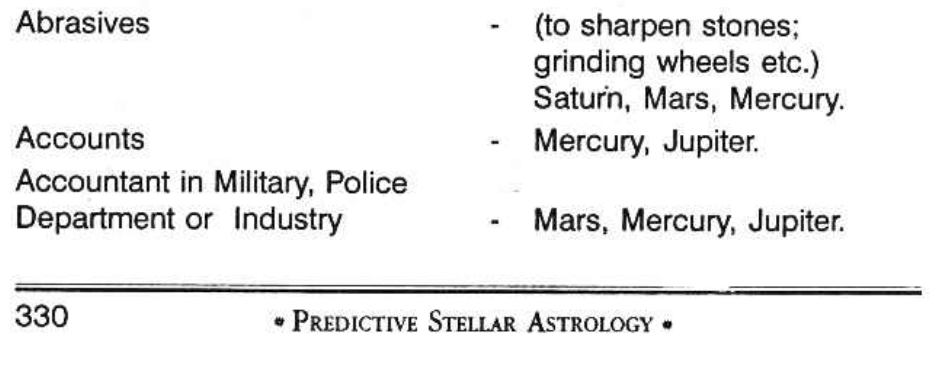
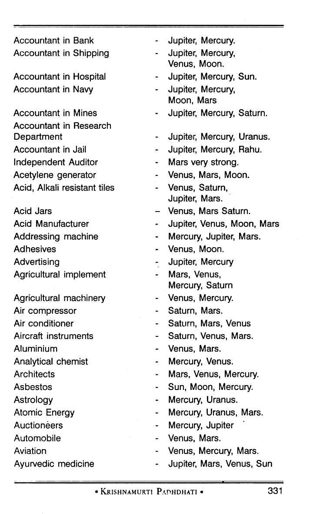
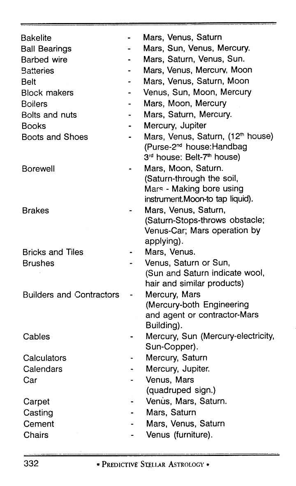

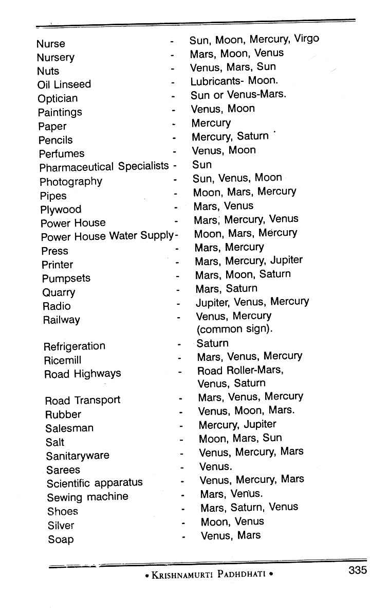
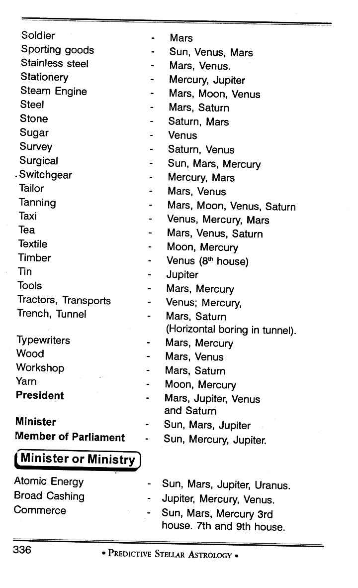
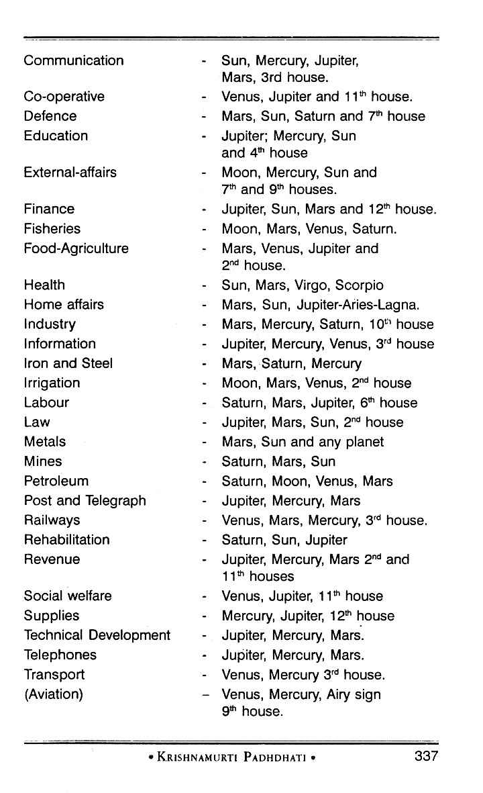
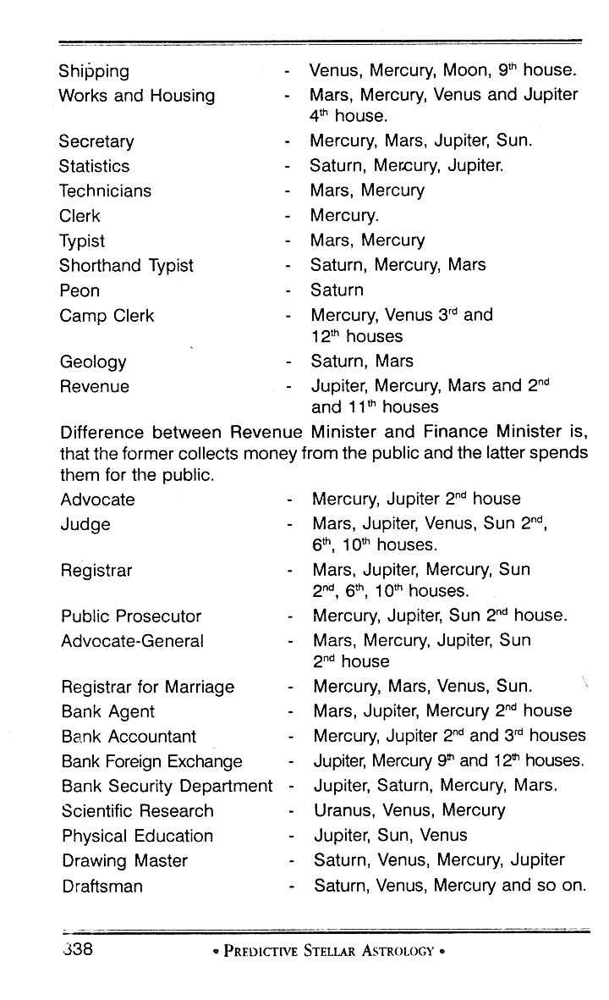

## Nature of Service

Following is the horoscope of a person born on 19th March 1937 at 6.14 PM at Madras: 

He is a surgeon practising in Bombay. Normally, when one tries to find out the profession of a person, he has to note:

1. The planet occupying the 10th house and also the lord of the 10th house
2. The Navamsa signs occupied by them
3. The lords of the Navamsa signs in which the occupant of the 10th house and the lord of the 10th house were
4. Judge the profession signified by the lords of the Navamsa signs occupied by the occupant of the 10th house and the lord of the 10th house.

This is the principle which is being generally followed but requiring correction by the application of Krishnamurti Padhdhati. According to K.P. method:

1. One should note where exactly the meridian falls
2. The lord of the sign, the star, and sub. Also take into account the planet very close to the meridian. The profession is indicated by the combination of these planets and the dasa lord in progress.

Applying Krishnamurti Padhdhati, the meridian in Gemini 5 degrees means that the sign is ruled by Mercury, the star by Mars and sub by Sun. Therefore, his profession will be indicated by Mercury, Mars and Sun. Sun and Mercury give him the intelligence, quick understanding, grasp, and because both of them were in a watery sign, correct intuition is indicated. One of the main occupations indicated by Sun is medicine. Mars is for surgery and Mercury for quick action and also correct diagnosis. Hence, from the position of the meridian, one can say that he is a surgeon.

The other alternative would be that Mars and Mercury indicate mechanical engineering, and Sun for service in the Government. Also one can predict that he may be serving in a Government Press, as Sun indicates Government, Mercury paper as communication and Mars machinery. Thus, a few avocations may be indicated by the combination of the lord of the sign, star, and sub, where he had his meridian (10th Bhava). By applying Krishnamurti Padhdhati one can minimise the alternatives and determine the exact nature as disclosed by Sub lord.

The 10th house is occupied by Moon. Moon governs the stars Rohini, Hastham, and Sravanam. No planet is found occupying any of the three stars. Therefore, Moon must be taken as one of the significators of profession. Consider what Moon can do. It is in the constellation of Mars and aspected by Mars and Jupiter (both are in their own signs and strong). Therefore, Moon is to offer the results of Mars and Jupiter. Mars and Scorpio suggest chemical or medical and Jupiter in Sun's constellation suggests medical. Mars in the constellation of Saturn and in Scorpio indicates that he will carry out post-mortem also as Saturn denotes the dead. Hence, the occupant Moon also promises that he will be a surgeon.

But if we were to apply the general principle, the lord of the 10th house is Mercury. It occupies Cancer in Navamsa which is owned by Moon. Moon is posited in the 10th house and it is in Scorpio Navamsa. Therefore, the lords of Cancer and Scorpio (Moon and Mars) indicate the profession. Normally, one cannot expect medical profession for the combination of Moon and Mars as the rule is to find the lord of the Navamsa sign and read out the profession in the traditional way.
- Length of Service
Let us examine the following chart to determine the length of service. Balance of Moon Dasaat the time of birth is 6 years, 2 months, 26 days. Self-acquisition is judged from the houses 2, 6 and 10. So one has to consider the strength of the significators in the following order:

1. The planets in the constellation of the occupants of the houses 2, 6 or 10.
2. The occupant of these three houses 2, 6, or 10.
3. The planets in the constellation of the lords of the houses 2, 6 and 10.
4. The lords of these houses.
5. The planets conjoined with the significators.
6. Those receiving aspect from the significators.

Before proceeding further, it is necessary to mention clearly what a Bhava-House is, and which planet is to be taken as the lord of a Bhava-House. A house commences from the cusp of a house and ends with the succeeding cusp. The cusp of the ascendant is 1° 00’. So the Lagna commences at 1° 00’ Cancer. The next cusp falls at 26° 56’ cancer. Hence Lagna Bhava is ruled by Moon. It extends from 1° 00' to 26° 56’ in cancer. Further Moon is also the lord of the second house as the second cusp falls at 26°56’ cancer. The cusp of the 3rd house is 25°56’ in Leo. Hence the 2nd house extends from 26° 56' cancer to 25° 56’ Leo. Even though only 3°-4’ in Cancer happens to be in the second Bhava and 25° 56' is the extension of the second house in Leo owned by Sun, the lord of the second house for predicting finance, fortune etc. is Moon only.

Further, the traditional method of erecting the Bhava Chakra - Chaleeth as it is called in North India - needs some consideration as it is misleading. Suppose one’s Lagna Bhava commences at 21° in Cancer and extends up to 20° in Leo; also presume that the planet ‘A’ was in 10° Cancer, the planet ‘B’ was in 25° Cancer and the planet ‘C’ in 10° Leo. In the chart which is erected by the Hindu astrologers in Bhava-Chakra, they show the planet ‘A’ in Gemini, and planets B and C in Cancer. It is misleading.

No doubt planet ‘A’ is in the 12th Bhava. Planets B and C are in Lagna Bhava. To represent these clearly and correctly, it is advisable to follow the table as under.

In the above horoscope, it will be seen that the second house extends from 26° 56' in Cancer to 25° 56' in Leo and the second house is owned by Moon. The sixth cusp commences from 1° 56' in Sagittarius and extends up to 1° in Capricorn and the 6th house is governed by Jupiter. The Meridian, i.e., the cusp of the 10th house falls at 27° 56' in Pisces, extends all the 30° of Aries and ends at 0° 56' Taurus and the lord of the tenth house is Jupiter.

No planet occupies any of the three houses 2, 6 or 10. Hence there is no need to note the constellation ruled by the occupants and also the planets occupying those constellations. Therefore take the planets in the constellation of the lords of 2, 6 or 10. Moon rules the second house. Jupiter governs 6 and 10. Moon's stars are Rohini, Hastha and Sravana. Moon and Jupiter alone occupy Hastha. The stars of Jupiter are Punarvasu, Visaka and Poorvapathra. There is no planet in any of the three stars. Therefore, Moon and Jupiter are the significators.

Nodes are stronger than the planets. Hence find out whether Rahu or Ketu occupies their houses or conjoin with them or receive aspects from either Moon or Jupiter. Then, they also will be the significators. Ketu is in Cancer in Moon's sign. So Ketu is stronger than Moon. Rahu receives the beneficial 5th aspect from Jupiter. Hence Rahu acquires the strength of Jupiter, other than what it has to offer, as an agent of Saturn, by occupying Capricorn owned by Saturn and also by receiving aspect (3") from Saturn.

Moon and Jupiter, the significators, are in the third house, in a common sign showing that you will be having a transferable post. Moon and Jupiter indicate Departments of Finance, Education or Politics. The third house does not show Education. Generally the fifth house indicates Politics. Third house occupied by Moon and Jupiter in Mercury’s sign indicate short tour, transfer, inspection of accounts, auditing etc. Further, the Meridian was in Jupiter's sign, Mercury star, and Saturn sub. It is clear that the native will be a journalist, correspondent or working in the department of Finance.

When was the first appointment? Find out the dasa that runs between the age of 16 and 30 to all persons, as, generally people enter service only then. This native was running Rahu Dasa from the age of 13 years 2 months and 26 days, till 31 years, 2 months and 26 days. It is found that Rahu and Ketu are the strongest significators. Hence the native ought to have entered service during Rahu Dasa, Ketu Bhukti, Ketu Anthra, or Rahu Anthra on the day when Moon was transiting in one of the 3 stars governed by Rahu, viz., Arudhra, Swathi and Sathabhisa. Actually the native joined the Finance Department during Rahu Dasa, Ketu Bhukti, Ketu Anthra on Swathi star day. Viz., 6-9-1921.

When he was running Jupiter Dasa, Saturn Bhukti, Mercury Anthra, he was selected and from Ketu Anthra promoted in 1932. For 9 months during the Bhukti ruled by Ketu in Jupiter Dasa, the native had a transfer with an additional allowance in 1936. Again during Jupiter Dasa, Venus Bhukti, Ketu Anthra the native was offered a special duty in the Central Board. During Jupiter Dasa, Sun Bhukti, Ketu Anthra, he was posted to a far off place. In 1955, the native retired once for all during Saturn Dasa, Sun Bhukti. In Saturn Dasa, Moon Bhukti, Ketu Anthra he set up practice.

What next? This native was running Mercury Dasa from 16-2-64. Mercury Bhukti ended on 13-7-66 when the very favourable Ketu Bhukti started. Popular and prosperous Venus Bhukti followed Ketu’s period for 34 months from 10-7-67. Only from 10-5-70 Sun Bhukti commences. It is Sun which will give the native the mind to take rest and give up private practice.

# Business

The main difference between business and service is that in business, there is speculation in income; it is unsteady; but in service, for honest people, not receiving bribery, the income is steady and it is once a month, a week, or daily. For dishonest people, plurality of income is shown and such a planet will have connection with Saturn, Mercury, and a dual sign.

Sun in 7 shows steady business with a little fluctuation. Moon in 7 indicates a change in the nature of business and income, most unsteady. Even the business locality will be changed now and then. Mars in 7 shows impulsive action. In auction, you may pay a fancy price and lose ultimately. Indiscreet and rash action bring loss. You will start in a flash, to end in a crash. Mercury in 7 indicates speedy turnover and larger profits. Jupiter in 7 indicates honesty, improvement, expansion, and thriving. Venus in 7 indicates good luck and popularity. Saturn in 7 is very bad for business. Uranus and Neptune in 7 are not favourable.

For partnership, judge the horoscopes of the partners for harmony, happiness, profit, luck, etc., just like it is done for marriage. Judge the 7th house. The above appears to be as advice. But one should know whether one will do business or not. Also, one should understand how the above general rule is to be applied according to Krishnamurti Padhdhati. Planets in 7 in the constellation of lords of 2, 10, and 11 show success, whereas whatever be the planet, if it is in the constellation of lord of 8 or 12, it is bad.

Will it continue in service? Or will one take up business?

An active and ambitious person who puts the above query was born at 7 PM on 15-11-1933, a Poppy Day. His chart is furnished below: At the time of birth, Ketu dasa Balance was 2 years, 11 months, and 5 days.

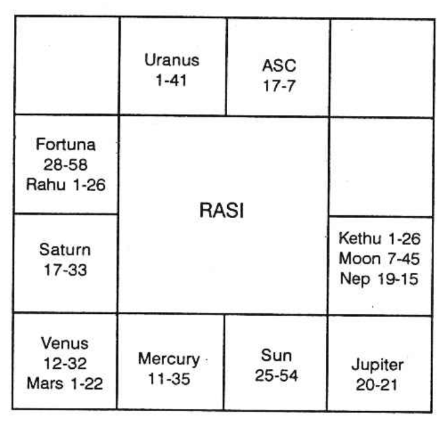

# Profession: Principle Judge

The houses 2, 6, and 10 should be judged: No planet is in 2 and 10. Mercury is in the 6th Bhava, and its stars are Ashlesha, Jyeshta, and Revathi. No planet is in any of the 3 stars, so take Mercury as the strongest significator.

The lords of 2, 6, and 10 are Mercury, Venus, and Saturn. Rahu is in Saturn's sign, so take Mercury, Venus, and Rahu as the 3 significators. 3, 9, and 12 indicate changes. Ketu and Moon, conjoined with Ketu, are in 3. Saturn is in 9 in the constellation of Moon. Therefore, Moon, Saturn, and Ketu show changes.

Mercury, Venus, and Rahu indicate that you will be attached to Sanitary Engineering or Public Health Engineering. You will be dissatisfied when Moon (a planet for changes, contemplation, planning, and scheming) dasa is on, and dissatisfied when Saturn sub period operates. At the same time, Saturn does not give courage and confidence to kick off the job, as it is in its own sign and the wavering Moon's constellation, Sravana. Jupiter, lord of 11, aspecting Saturn shows that friends and benefactors will suggest and encourage you to entertain hopes and be optimistic, especially when Jupiter Anthra rules. Immediately after Saturn Anthra, Mercury follows, which is in the constellation of Saturn. Mercury in Mars' sign gains courage, though it is in the constellation of Saturn. Moon brings about change in career, and Mercury creates chances. Mars fulfils his desire.

Therefore, during Moon Dasa, Mercury Bhukti, Moon Anthra, he will leave the service, and during Moon Dasa, Mercury Bhukti, Mars Anthra, he will start a business. Therefore, he will leave the job in April 1969 in Ashlesha or Hastha Nakshatra day. He will take up business in May 1969 when Mrigasira star second half will be transited by Moon.

Mercury, Venus, and Rahu show that he will take up contract business connected with water supply fittings. Mercury in a watery sign and in Scorpio, as the 8th sign of the Zodiac, and the 8th denotes lavatory, waste, squatting, etc. Does not the 8th house indicate in the part of the body, rectum and anus? Therefore, one should take that the 8th house denotes water-closet. Therefore, he will quit the job and do business. Mercury in 7th, in the constellation of lord of 10 and 11, is very good. Sub of Moon shows speculative income.
General Rules Followed by Westerners:

1. If the Meridian or tenth cusp falls in a fiery sign, the person is ingenious, active, learns mechanism, bold and takes ventures.
2. If the Meridian or tenth cusp falls in an airy sign, the person is likely to be involved in science, literature, agency, advising, art, reporting, or publishing.
3. If the Meridian or tenth cusp falls in a watery sign, the person is likely to be involved in liquid, spirit, shipping, or overseas.
4. If the Meridian or tenth cusp falls in an earthy sign, the person is likely to be involved in land, agriculture, building, mining, politics, or business.
5. If the Meridian or tenth cusp falls in a movable sign, the person is likely to have the ability to be a leader, pioneer, or discover something new and original.
6. If the Meridian or tenth cusp falls in a fixed sign, the person is likely to be perseverant, industrious, and involved in service or well-established concerns.
7. If the Meridian or tenth cusp falls in a common sign, the person is likely to be a broker, tour agent, or involved in public commodities.

Sri V.S. Ramaswamy, B.E., Superintending Engineer, PW.D., Parambikulam Project, Pollachi, wrote to Mr. K.S. Krishnamurti regarding a double event and uncanny prediction.

Ramaswamy consulted Krishnamurti in the first week of January 1966 regarding his promotion to the post of Superintending Engineer from Executive Engineer, and for some reason or the other the proposal was shelved. As a regular reader of Krishnamurti's magazine "Astrology and Athrishta", Ramaswamy fixed up an appointment with him and was pleased to hear that he would receive his order of promotion on 1-2-1966, which he did. Krishnamurti also predicted that Ramaswamy would take charge on 3-3-1966 on Thursday and Punarvasu star day since he was running Rahu Dasa, Guru Bhukti, which also happened.

Krishnamurti also predicted that Ramaswamy's son-in-law would get a better job on a salary of Rs.1800/- plus allowance in an Engineering firm at Bombay in Sani Dasa soon after Mars Bhukti commenced, which also happened.

Ramaswamy expressed his wonderstruck at the exactness of Krishnamurti's predictions and thanked him, saying that he was not able to express his feelings in words regarding the accuracy of the predictions. He also said that he found that none could predict the date of event so exactly, giving out satisfactory scientific explanations. He wished Krishnamurti a very long and prosperous life so that he may enrich the sublime science more and enlighten the public.
- **Profession: Principle-K.P**

In the Hindu Traditional Astrology, we take Brihat Jataka as the greatest authority and therefrom we quote and offer our predictions. Then there are various books written by various authors and also so many translations with their comments. Let me reproduce that which is mentioned in the text-book Brihat Jataka as regards the acquisition of wealth.

Count from the sign where your lagna falls or where Moon was. Find out the tenth sign counted from these two signs, if Moon is not in the lagna. If Sun occupies the 10th house counted from the lagna, sign or Moon sign then one gets wealth through father; if Moon is so deposited one gets from mother; if Mars, from foe; if Mercury from friend, if Jupiter from brother; if Venus wife; if Saturn through inferiors.

The other rule is, note the ruler of the 10th house. Also find out in which navamsa sign it is deposited and not the owner of the navamsa sign in which lord of the 10th house is situated; You should not forget to note that the 10th house that you have to count is from (a) Lagna sign, (b) Moon sign, (c) and the sign occupied by the Sun. Hence you have got three signs. So the tenth house will be three. The navamsa signs occupied by them will be three. The owners of the signs occupied by the three planets in rasi and in navamsa sign will be six. Then you should find out what the lord of the navamsa sign indicates.

If Sun indicates then one will make money by dealing in grass, gold, wool, medicine and the like. If Moon is the lord of the sign then one will gain through agriculture, pearls, fish etc. If it is Mars, metallurgy, by violent actions, like fighting etc. If Venus one makes money by dealing in gems, silver and cows and buffaloes. If Saturn, one will do tiresome work, cooly in prison, dealing with criminals, etc. Again the author emphasises saying that a person does such a work as is indicated by the owner of the navamsa sign occupied by the lord of the 10th house.

More or less in the same lines the other books written by Hindu sages give us the knowledge to ascertain one’s profession. Actually the text books are not helpful. Twins are born. One is a medical person and the other a lawyer, educationist. If we follow the tradition, you cannot answer. You must and must fail. But follow K.P and you get the real answer.
- Note the Meridian i.e., the 10" Cusp:

If the sub-lord of the Meridian is in the constellation of the planet in Aries, generally you are attached to the Army or military or Police or Fire-brigade or any such job. In the boundaries you can volunteer yourself to carry out the territorial work; otherwise you will be inclined to use the nature of Mars and metal indicated by Mars who is the lord of your sign; that is, if you will manipulate with fire and also with metal, steel. Many butchers, barbers, surgeons, chemists, gum-makers, cutlers, engine-drivers, stokers, chauffeurs, smiths, cooks and all workers using sharp instruments or using fire are governed by the sign Aries. Therefore, you would have one of these avocations.

Even though you are really one of the most able executive types, yet it is advisable that you leave the management to somebody else and you take up planning, scheming and putting through the same, because you never stop working till you get exhausted; and also you take up some other work while the previous one is half done. Therefore, you should be above the manager directing others to carry on your ideas. You should be a pioneer. Do not think that other people cannot do the work as perfectly as you can. Leave some of your work to them and try to reduce your amount of work which you think that you should do yourself personally. If by chance, you are not the head of the show but you accept a subordinate post, there will be a tendency for you either to be insubordinate or to be undiplomatic with your higher officials. If anyone would like to know your weakness then if you are given a subordinate position, your weakness will be brought to the front.

You are really a leader to plan for new business and also apply your mind to produce more or extend the existing industry. Your ability is more to contemplate, plan and scheme yourself; so leave the other work as regards administration, organisation, etc. to others. Be a pioneer. You hate to apply for any clerical post or any secretarial post. You do not like to accept any routine work which you have to carry on for long number of hours. You do not partake in any other office affairs or strike or politics. If you are appointed as secretary in a branch office, you can shine better than in any other place. You are an able worker. You grasp the work of the whole business gradually and it is sure that when time arises you will be able to run the whole show singly if needed.

A great defect in you is that while your work has been appreciated by the boss, you thereby gain the confidence and also influence. Slowly you develop such a mind to boss your boss. As an office manager you prove to be a good disciplinarian and also an able administrator. As a salesman you will never allow the customer to think for a minute but you will be going on talking so fast that the customer will be convinced and he will make purchases. No person can leave you without having some transactions with you. Any customer coming to your business shop will totally miss to buy what he wanted to, but he will be carried away by your ability. You will thrust on him those to your gains and to his satisfaction. As an advertisement agent, you will prove to be an able director. As a tailor, you will have new designs and you can command a good market. As a dealer in instrumental music, you will find successful commercial artist and painter. You will be able to perform any duty far above average and satisfy the customer. You find that work keeps you always alive as you find the pleasure therein and you never get exhausted.

You are a good mechanic, even any new machine handed over to you for repairs, will be handled by you, will set right whenever something goes wrong. You do not waste much time; you consider that there is no charm in returning an article or a tool or machinery, after delaying for a long time. You believe that speedy turnover and quick return will be most welcome to the customer; you know that it increases the number of customers. Some of you (unfortunate group) may take up an ordinary mechanic’s post or an operator's post in an industry. You may be most popular mechanic in that shop; but there can be no opportunity when your ability is recognised and appreciated by the top person. So you may not have your promotion when you expect it.

If you take up medicine or engineering or law, you will shine. It is very important that you forget about your independence, authority and superiority complex. You cannot be very blunt and straight forward but you should develop diplomacy. Neither the customer nor the executive head of the department where you serve, cannot relish such an outspoken and blunt way of dealing with people. You should know how to move with others; be patient. You should be smiling and encouraging them, otherwise you cannot be a successful businessman. If you are tactful and diplomatic, you will be the leader among the surgeons or among the advocates or the engineers.

If you take up the educational line you have got very good opportunities to show your abilities. You are best fitted to handle higher classes. You are capable of explaining things in a simple way and demonstrate to them in the most impressive manner and give enough of practical instructions. You are not fit to coach up students who are dull-witted and very slow to grasp.

If you take up independent business it is absolutely necessary to have either a partner or immediately next to you an assistant who will be offering advice, now and then and whenever you go at top speed, he will retard it. You are so ambitious and also impulsive that you want to do all the work in a very short time. Is it possible to put all the eggs in one basket at one stroke? When you select the partner in business try to choose the good natured person who is patient and persevering.

As a technician you will be very able to carry out the work in a stylish way. Even a barber can be a very capable person but his style in using the knife or the blade will threaten the customer.

As a nurse, you will attend to the child or the patient patiently for some time but if you are irritated, then you will never hesitate to retort; normally this duty does not suit you but when once you have passed this stage and you continue to be a nurse then you will be the topmost. As a housewife you should avoid to dominate and also to dictate; but cultivate modesty and whenever something is to be done, you put forth your suggestion in such a way that he thinks that the whole idea is his. This is the way how you have to get happiness through such a person who will be less strong minded than yourself. This is nothing but your tact and in a way without his knowledge, you fool him. You can have greater pleasure in this life if you prove yourself to be an excellent hostess by entertaining his higher officials and friends. Actually your independent nature and irritant temperament must vanish.

You do not find much pleasure in moving with people and you do not want to go to society and waste your time, so you will be using your leisure time on useful hobbies and in sports, to have health and peace.

When many jobs are mentioned for one sign, how to select a few and thereby be useful to the querist.
You note the sub-lord of the meridian; the lord of the constellation in which it is and the lord of the sign. Then you have three planets, i.e. the lord of the sub; its star lord and the sign lord. This combination gives a correct clue. It eliminates many and guides to select a few.

Aries: Lord is Mars. If the other two planets, i.e. lord of the sub and the constellation lord were to be:

1. Both Sun, then Government service, Defence department or surgical department.
2. Sun and Moon: i.e. either Sun or Moon is the sub-lord and the other is the lord of constellation, then Navy, Boiler feed, Steam engines, Nurse in the surgical wards.
3. Sun and Mars: One who goes to the front during war, Military; Sun and Mars connected with Jupiter, Law and order, Police. Connected with Venus also, Traffic Police.
4. Sun and Mercury: Postal, communication, telegram, telephone. If Jupiter is connected press and publicity, journalism. If Venus is also connected Radio, Mechanical Engineering, Works and Housing.
5. Sun and Jupiter: Education department. Even in Military, Military School, Law department, Judge, Religious Endowment Board, Finance department, Nationalised banks, Reserve Bank.
6. Sun and Venus: Transport, Air force, Music, Medicine, Chemical, Veterinary department; if Saturn is connected leather industry or birth control. If Jupiter is connected, animal husbandry. Saturn shows slaughter house, lethal chamber and cremation ground, burial ground.
7. Sun and Saturn: mines, metals, coal, mine ores, jailers, sextons, grave diggers, watchmen, night duty.
8. Moon and Mars: Navy, Sailors, dealing in petroleum products.
9. Moon and Mercury: interpreters, secretaries, Marine engineers, messengers.
10. Moon and Jupiter: Physicians, overseas bank, foreign exchange.
11. Moon and Venus: Painters, Milk dairy farm, Toilet makers, silk mercers, Tailors for woman, nurses, butlers, cooks.
12. Moon and Saturn: Excavation of wells, reinforcing the bund of the lakes, geologists, Petrol dealers, Oil Pumpsets, etc.
13. Mercury and Jupiter: Councilors, clergymen, advertising agents, Press, Accountants in Finance as bank.
14. Mercury and Venus: Music, Radio, Sanitary engineering, artists, automobile engineers.
15. Mercury and Saturn: Hand-writing experts, thumb impression experts, mine engineers, geologists.
16. Jupiter and Venus: Income-tax, Sales-tax, commercial-tax Judges, Law Court, Food Department. Agriculture, fertiliser.
17. Jupiter and Saturn: Philosophy department, politicians, Trustees especially for the money of the deceased.
18. Venus and Saturn: Leather, skins and hides, Slaughter house, Lethal Chamber, etc.

For Rahu and Ketu, one is to note in which constellation it is and then according to the lord of the constellation in which Rahu or Ketu were, one is to offer the prediction.
- Which profession will suit me? - K. P.

To ascertain one's profession, note whether the sub-lord of the meridian is Sun, and the Ascendant of the gentleman is Aries (for Aries-borns):

1. If Sun is the significator of the first house and it is the sub-lord of the 10th cusp, then you will gain by your own efforts and personal contacts. Your frank and outspoken nature will bring you success in your matters. You will not depend on others to act on your behalf. You will prove to be a good organiser and administrator. If you are an advocate, appear in the court of law and do not entrust the job with your juniors. If you are a surgeon, you should attend the patients personally. You understand the mind of the seniors and that of the colleagues and carry out your work efficiently and have harmony. You prefer to be independent and firm. As a doctor, you will prove to be good for treating cerebral cases, neuralgia, coma and head injuries. Avoid rash action.

2. If Sun is the significator of the second house, you will be industrious and you gain money by your work, hard work and that too for long number of hours. You will deal in cash and you can serve in a bank in the currency exchange department. You are also best suited to be an auditor or cost accountant etc. As years pass on, you will be promoted as Director. You are good in collecting the public money for any cause. Your sincere work and earnestness will be amply rewarded. You will find it to save much as you are generous and you find pleasure in social intercourse. It is good for trade and business. You will gain through investment and speculation.

3. If Sun is the significator of the third house, you can be a good journalist. You can edit and publish books; or serve in the transport department or postal or telegraph or any other “communication departments. You will prove to be a good salesman. Clearing agency for shipping, supplies to transport and traffic departments or to serve in bus, tram, railway or in any press or paper mill will be advantageous. You can rise to a good position in the university by having the goodwill of the seniors. Your relatives and neighbours will contribute for your success. As a lawyer, you can draft intelligently, contracts, agreements, notices, correspondence, etc. As a liar, you will be very clever in drafting false reports or writing anonymous letters. You can thrive as an ambassador or messenger or one to inspect the branches from the headquarters or to be a camp clerk or a tourist guide. Hence, travel, transport, sport and drama are advantageous.

4. If the sub-lord of the 10th cusp is Sun and he is also the significator of the 4th house, you are best fitted to have your residential quarters and your office in the same building. You can own boarding and lodging house or manage them. You can prove yourself to be an expert in interior decoration. You can make fortune by being the broker for buildings, lands, estates, cars, etc. Further, you can manufacture such of those materials useful to furnish the house or for kitchen purposes. You can gain through mother or her relatives and take them as partners. You can invest money on constructing living quarters as colonies, instead of building for office purpose. You can deal in real estates.

5. If the sub-lord of the 10th cusp is Sun and it is the significator of the 5th house, you can work in stock exchange or in any other speculative market; also you can work in cinema-theatres, dramatic field and other places of amusements. You also can work in family planning. As a doctor, you will specialise in paediatrics; you, as a manufacturer, produce things, toys, etc. for the use of children. As an author of books, you will be fortunate in publishing those useful for children. Also in love affairs and matters chiefly connected with every day life. As a teacher to young children, you will shine more than for adults. If Sun is strong, you can become a cinema star. You can also invest and become famous. You can become the leader of the scouts.

6. If Sun is the significator of the sixth house, you are best suited for the labour or public health department. 6th house gives the desire to serve all, especially those who are suffering from physical ailment or mental torture: You can have promotions in service if you are attached to the medical relief in any concern. In a factory, you can specialise in repairing instruments and tools and machines. You will prove to be a good agent in emigration department. In a bank, you prefer to be in the deposit department. Speculation will pay. Music, opera and cinema can be a good source of income.
If the Sun is the significator of the 7th house, you are best fitted to be a peacemaker. You are invariably fair in your dealings; you consider both sides and do justice. Therefore, you can be a judge, or you can hold the post of a public relations officer or one to mediate between two enemies or an officer for arbitration. In the government, the best position for you is the embassy. As a social worker, you can undertake to bring about marriage among couples. You can work as a marriage broker. If you are an advocate, you gain by appearing for divorce cases, or of such crimes committed on the sexual side. You can manage with all in a friendly way so that you are the friend of all. As a doctor, you gain through the other sex. One defect is that there can be loss by theft.

If the sub-lord of the 10th cusp is also the significator of the 8th house, you gain by partnership and legacy. You will have steady fortune after marriage. You work very hard and you do business using other's money. You can be an executive director. You may deal in public funds, pension papers, gratuity, bonus, taxes, etc. If you are an advocate, you will deal in estates and wills. In government service, finance and revenue departments are beneficial. As an independent person, you practice income tax and you are the best advisor. As an auditor, you can make fortune. You can deal with the money of the dead and insurance. You may attend to death duty, estate duty, etc. Do not speculate.

If the Sun is the significator of the 9th house, you are ever hopeful and charitable. You will have the desire to investigate science. As a businessman, you will make long tours and have connections with foreigners. Export, import, foreign trade and to have branches in the foreign are all advantageous. University is the best place for you. Service in religious places is also well suited. Make fortune in a foreign land. You can even permanently shift to foreign. You will reach a covetable position in any technical line of business. Branches in the foreign will give you larger profits than all the business put together in your native land. You will develop taste for fine arts, handicrafts and science.

If the Sun is the significator of the 10th house, you can manage and execute whatever you wish. You work hard for long period and realise your ambition. You can plan and put through your schemes to a great magnitude. Though you do not meet with any disappointment, you will continue to be industrious. You can have a business of your own. You can deal with foreigners. Export and import will also pay you satisfactorily. In government service, you will have your legitimate improvement in status; your claim will never be ignored. You will have advancement in your career. You can reach the topmost rung of the ladder to which you are entitled to. In politics also, you will hold a decent position commanding respect from others. In speculation or in theatrical field, you will be successful with good gains.

If the Sun is the significator of the 11th house, one can be a successful politician and businessman, as you will have lofty ambitions, desires and dignity and also many friends who are reliable and faithful and be the benefactors. Your colleagues will co-operate and they will never betray you. You can serve in clubs, societies, restaurants, lodging houses, so that you will have many opportunities to come in contact with new people and increase the number of friends. You will succeed in such a pursuit where you have to apply your mind and concentrate. You will show your inventive genius in every action of yours. You can be a legislator or ambassador or messenger or peace maker or arbitrator or a sportsman.

If the sub-lord of the 10th cusp is Sun and it is also the significator of the 12th house, then you will prefer to work singly, undisturbed in an unfrequented place. You can do your job successfully and most satisfactorily by avoiding the company of others. As an organiser, you will instruct others politely and calmly. You will prefer to serve in jails or hospitals or asylums. If you are an advocate, you furnish all points to the senior and you remain behind the scene. You will have one tuitioned by you; and let him represent you. In an army, you remain in headquarters and give instructions to the people in the war front. If you start a factory, it will be away from the town and also the industrial estate. Invest on government bonds to have steady gains than to take a risk of buying other speculative shares. Speculation causes ruins. You will find pleasure through investigation of things of mysterious or research nature. You can carry on such a work without anybody's knowledge and collect information. For secret activities, you are best fitted.

Thus, one should know the sub-lord of the 10th cusp. Then to each lagna-born, how that particular planet will behave and how its indications get changed according to the houses which it signifies. When the profession is in millions, to classify and group them into nine alone is never helpful to the querist. But in this method, you can find that there are 249 cusps and each may be ruled by any of the nine planets and each planet can be the significator of any of the 12 houses. Hence, you have 249 x 9 x 12 classifications. It comes to nearly 26,892 divisions. This is the only proper method.

One cannot commit all the 26,892 combinations. But one should understand how it is analysed and then the result arrived at. If one understands the principle, then it is easy to pinpoint.

# Independent Business

The horoscope is as follows:

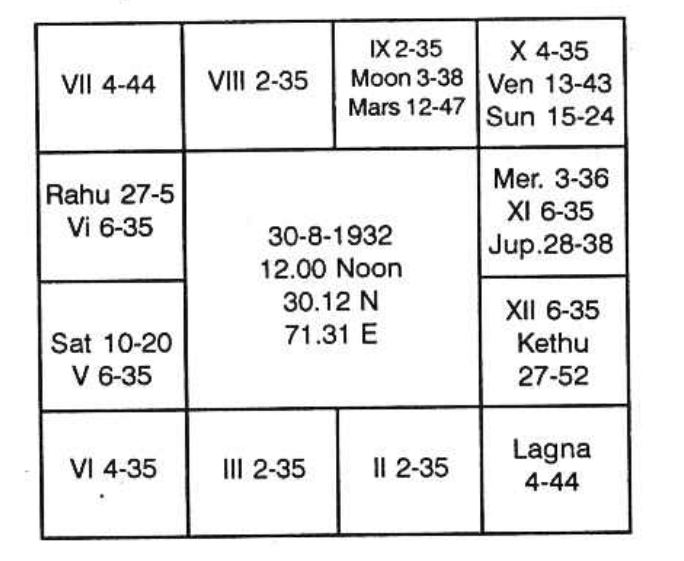

Sun dasa balance 2 years 10 months 1 day.

On 11-5-1970, Jupiter dasa has started.

For business, judge houses 2, 7, and 10. The second house shows self-acquisition. The seventh denotes customers and partners. It gives good indication about the nature of the people with whom you will have to deal; houses 6 and 7 indicate those from whom you buy; 7 and 12 denote those to whom you sell.

Further, one is to note the dasa period which one runs. Because in one period and sub period, one may be in service; in another subperiod in the same major period keep idle; in the third subperiod do business; in the next subperiod, have gains, in another lose and so on. Hence one is to note what each planet can contribute. Always consider the sublord.

Western authors say that Saturn in the 7th house is not favourable to undertake any business. But according to Krishnamurti Padhdhati, Saturn sub occupied by lord of 7 or significator of 7 is disadvantageous for a successful business. Opposition and loss in public affairs are threatened. Whether there is success or not, whether one will do business, is to be judged from the significator of 7 and the 7th cusp sublord. Mars gives one the courage to undertake. Mercury shows one’s tact, skill, ability and publicity. Venus indicates that due to his sweet smile, pleasing words and social success by being a Lion, a Rotary Club member, or Cosmopolitan Club member, or a member in any club or society, due to friendship and contact, one can be successful; if Venus is evil, it will spoil him due to such activities. Thus, for each planet according to its nature and disposition one is to judge how one can thrive or will meet with loss and failure.

Further, planets occupying earthy signs make a person businesslike and care for material welfare by doing business. If the earthy sign happens to be 12th, 5th, or 8th, and the sublord of the 7th cusp is in 5th, 8th, or 12th in the earthy sign, one loses. If the significator of the 7th house is in the sub of a planet who is either by occupying the 5th house or deposited in the constellation of a planet in 5th, 8th, or 12th, winds up business due to loss.

In this chart, 7th cusp is in 4° 44' in Pisces. It is in Saturn’s star and Saturn's sub. Further, Saturn is in earthy sign in 5th to the ascendant i.e. in 11th to 7th. No planet is in 7th. Lord of the sign in which 7th cusp falls is Jupiter. It is in the sub of Saturn in 5th. Hence business is no good to this person.

As neither the dasanath, nor the sublord is connected with Mars, this native will not have the courage to start a business. “Neither there is opportunity, nor there can be success if he does independently the business” is the promise of the planets. This person will not do business.

Since years, he wants to do business. At the same time he is hesitant. Yet he has not started (K.S.K. 3-7-71).

# Music

Music is an art. It has its own beauty. It directly appeals to one of the five senses, i.e. the sense of hearing. A musician changes the rhythm and observes that the audience is much pleased. Also, the musician finds that the variations of the pitch are enjoyed by those who listen to it and can follow it. Blending of notes in harmony is an art.

In instrumental music, rhythm is very essential, especially in stringed ones. But in wind instruments such as nadaswaram and flute, pitch adds beauty. It offers the power of melody. One can develop harmony very nicely in stringed instruments.

According to Krishnamurti Padhdhati, the 5th house indicates whether one can learn music, one can appreciate music, one can become a musician, one hates music, or one is reluctant.

1. If the sublord of the 5th cusp is deposited in the constellation of a planet situated in Leo or Aquarius, one will be a popular musician. Venus will also contribute to one’s grand success in the field of music.
2. If the lord of the constellation in which the sublord of the 5th is deposited is connected with Moon and Venus, one will have the taste for improving their talent in music. If it is connected with Venus and Mercury, one will be supremely intelligent even to compose songs for musicians. If it is also connected with Mars (i.e. if these planets are the significators of the 5th house), one will be bold and will never have stage fear. Much of harmony is indicated by Neptune. In Krishnamurti Padhdhati, we do not include Neptune. Yet if a planet, the significator of the 5th house, is conjoined with Neptune, then they will render it with great harmony and will be able to present fine notes. For thalam, rhythm, Mercury should be predominant.
3. If the lord of the constellation in which the sublord of the 5th is posited occupies either Gemini or Sagittarius, one can render the music to appeal to the senses of the audience.
4. If it were to occupy Cancer or Capricorn, one can simply enjoy music by hearing and Saturn will be predominant.
5. For changes in the rhythm, the lord of the constellation in which the sublord of the 5th is situated should be in Aries or Libra.
6. The pitch can be changed at appropriate time if the lord of the constellation in which the sublord of the 5th cusp is deposited is in Aries or Libra.
7. Notes can be blended and harmony can be produced if that lord is tenanted in Virgo or Pisces.

Music had its origin even in Vedic age. Sama Veda is rendered in such a melodious tune that it is said that Lord Siva, the Destroyer, could be pleased with reciting Sama Veda (notorious Ravana pleased Lord Siva only by reciting Sama Veda). It has got its own peculiar rhythm, tune, and melody. Goddess Saraswathi is known as the only Goddess having the most melodious veena held in her hands. Lord Krishna is known for his melodious tune in flute which enthralled not only the Gopis but also all the creations of God.

Even in Western countries, there is a story that Muses instructed how to play the lyre which was obtained from Apollo and when he played, even the trees and the rocks on Olympus along with the wild beasts enjoyed the music from his golden harp. When Thracian ladies killed him, Zeus kept the lyre in the heavens and the constellation is called ‘LYRA’. All these go to show that music was there in some form or the other from the very great antiquity.

In history, the first significant period for music was that of David. His psalms were sung by groups of people wonderfully. It was about 1000 B.C. Later, around 1100 A.D., modern music had its origin in the North. In 585 B.C., Pythogoras found the inter-connection between the rhythm of the music and the disposition of the planets. He created interest to study music and astronomy. Kepler developed his knowledge by musical parallels which led to his important three laws. Herschel was first a great musician, then only he became an astronomist.

In Shakespeare's period, only six notes were prevalent. In ‘The Taming of the Shrew’, Act III Scene I, he personifies the six notes. The astrologers then omitted Saturn and attributed each note to one planet. They did not know Uranus and Neptune then. Further, the references made by Shakespeare about astrology in his own line were not correct. One commits a mistake if one relies on it.

Around 550 A.D., Boetius published a book on music which was the textbook in English universities. Later, Sebastian Bach developed the music in 1700 A.D. He was called the father of modern music. Mozart began to render music in a very enchanting manner and he started composing from his age of 9.

In India, the greatest flutist Mr. T. R. Mahalingam also proved himself to be a genius with great talent. None was born before him and it is doubtful whether anyone will be born after him. So also, Mrs. M. S. Subbalakshmi had hypnotized the whole world by her gifted melodious tune and the scientific rendering of the music. It is only Mrs. M.S. Subbalakshmi who had pocketed innumerable honors from various nationalities, and also given away most of the collections for improvement of institutions.

Nowadays, famous Radha Jayalakshmi are forward in the field and people leave even their urgent works to attend their concert. The greatest devotee of Sri Rama, Sri Thiagaraja was both a great musician and composer of songs of Lord Rama. Venkata Subbiah of Uthukuli and Shri Deekshadar are the other two devotees who have composed prayers.

Astrologers can predict which variety of the instrument or vocal is suited to one. Astrologers may not be musicians but mostly be talkative people as Mercury and Uranus will be predominant in their chart for their profession. They will not allow the consultant to talk. But the astrologer will talk and talk. A few astrologers alone can compose astrological principles in poems and render it in melodious tune. But many traditional astrologers commit to memory the slokas and render them.

# When Will I Get My First Salary?

Number given: 150  
Place of judgment: 28°-38' N.  
Time: 7-30 A.M.  
Date: 14.08.1970

Position of 12 cusps and the planets are tabulated below:

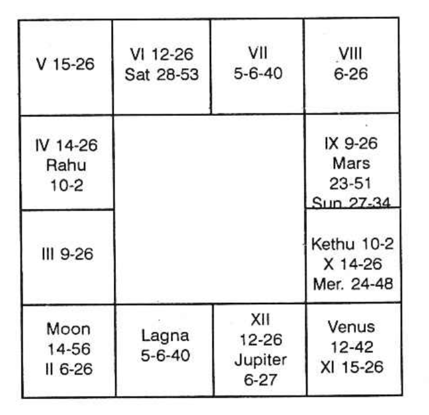

Second house indicates receipt of money; it may be by any means: by drawing salary, by borrowing, by selling anything, etc.  
Sixth house denotes getting money by loan or loan repaid by one who borrowed or by receiving one’s dues due to service rendered to another.  
Tenth house brings money by profession. Eleventh is the net profit - the gains.  
Second house is occupied by Moon; Venus is in the constellation of the occupant of the second house.  
Sixth house is occupied by Saturn. No planet is in its star.  
Tenth house is occupied by Mercury and Venus; Mars and Sun are in Mercury star; Mercury and Moon are in Venus star.  
Jupiter is owner of second house.  
Hence Venus, Moon, Saturn, Mercury, Mars, Sun and Jupiter are the Significators. Rahu acts as an agent of Saturn; Sun is represented by Kethu.  
Venus is in the sub of Rahu; Moon in the sub of Venus; Saturn in the Sub of Mars; Mercury in its own sub; Mars in its own sub; Sun in the sub of Jupiter, Jupiter in the sub of Moon.  
Venus, Mercury, Sun, Jupiter and Moon are the most fruitful ones.

Ruling Planets (on 14.08.70):

Friday governed by Venus  
Moon's star lord Venus  
Rasi lord Jupiter  
Lagna lord Sun  
Lagna constellation lord Venus  

Hence consider Venus, Jupiter and Sun. None is retrograde, none in the constellation of retrograde planet.

There are three sensitive points governed by the above:

(a) Sun sign Venus star Jupiter sub 21° Leo.  
(b) Venus sign Jupiter star Sun sub 29° Libra.  
(c) Jupiter sign Venus star Sun sub 16° Sagittarius.

Hence when the strongest fruitful Significator of the luminaries pass any or many of sensitive points, the matter fructifies. Further, Sun, lord of Lagna at the time of query, is lord of 10. It is in the sub of Jupiter, lord of 2 in 11. Hence, take the transit of Sun. It is in the movable and fruitful sign. So, it will yield the result quickly. Hence out of the 3 sensitive points, it will pass through the first sensitive point on Monday 7th September, 1970. Sun will be in his own sign in Venus star Jupiter sub. Moon will be in Jupiter star.

Therefore on 7-9-1970 he will receive his first salary.

It is not uncommon that some are appointed or transferred and they are not sure of the date on which they will receive their salary.

# Reinstatement in Service

At 10:28 PM on 23-7-'70, a person asked, "Sir, I have been placed under suspension from my service for more than two years. Please, tell me whether I shall be reinstated in my service or not; if so, when?"

"Give me a number within 249 please."

"Take it as 145."

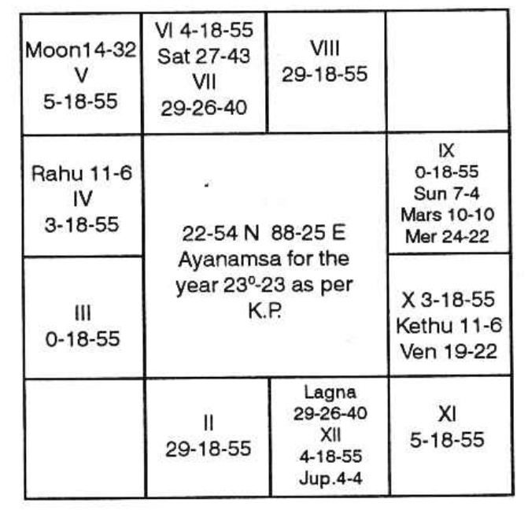

The time, at the time of judgment was noted as 10:31 PM on 23-7-'70. The lagna falls in Libra 29°26'40" with the number 145. And, the other cusps calculated as per rule of K.P. Balance of Saturn Dasa 3 yrs. 14 days as on 23-7-'70.

## Planetary Conditions

| Planet & Bhava | Constellation Lord | Sub Lord |
| -------------- | ----------------- | -------- |
| Sun (9)        | Saturn            | Mercury  |
| Moon (5)       | Saturn            | Rahu     |
| Mars (9)       | Saturn            | Venus    |
| Mercury (9)    | Mercury           | Rahu     |
| Jupiter (11)   | Mars              | Venus    |
| Venus (10)     | Venus             | Rahu     |
| Saturn (6)     | Sun               | Moon     |
| Rahu (4)       | Rahu              | Saturn   |
| Ketu (10)      | Ketu              | Saturn   |
| XI Cusp        | Sun               | Mercury  |

## Analysis of the Horary Chart

The moon indicates the mind of the consultant. Here Moon is posited in 5. The houses 5, 9, 1 indicate suspension, Thus the Moon has the relation with suspension of the consultant.

Again, Moon is in the constellation of Saturn. The Saturn is posited in 6 and is aspected by the Jupiter posited in 11. The sub of Moon is Rahu which is aspected by the Venus and Jupiter. They are posited in 10 and 11 respectively. The houses 6, 10, 11 and 2 indicate promotion or reinstatement as per K.P. Hence the query is justified which related with the Question of reinstatement in the service as well.

The sub lord of the cusp of 11 is connected with any one of the houses 2, 6, 10 and 11 in any manner, the consultant will have the positive answer. Here Mercury is the sub lord of the 11th cusp. Mercury is conjoined with Sun and Mars, the lord of 10 and 6 respectively. Mercury is the sign lord of 11. The sub of Mercury is Rahu- represents Saturn as well as Venus and Jupiter by aspect and occupation. Saturn, Jupiter and Venus are posited in 6, 11 and 10 respectively. Hence, the consultant must have a positive answer and he will be successful in his attempt. Ultimately, he will be reinstated in his former position without any monetary loss.

## Reinstatement - When?

"Judge the significators of the house 2, 6, 10 and 11 for promotion or reinstatement in service." The reinstatement is a kind of promotion as it enhances the status of a person from the position of suspension; income also increases.

2nd House is vacant; lord is Mars. Jupiter is in Mars star, 6th house is occupied by Saturn. Sun, Moon and Mars are posited in Saturn star. Lord of 6 is Mars.

10th house is occupied by Ketu and Venus. Ketu and Venus are posited in their respective stars. Lord of 10 is Sun. Saturn is in Sun's star.

11th house is occupied by Jupiter. No one is in Jupiter star. Lord of 11 is Mercury. Mercury is its own star.

Hence, all the planets have come under the list of Significators, except Rahu. But Rahu by aspect will also become a significator. Jupiter and Venus both aspect Rahu. Rahu is in the sign of Saturn.

When this position arises, our Gurujee has suggested to us to eliminate those which are not the ruling planets at the time of judgment. The ruling planets at the time of judgment are as follows:

- Rising lagna Pisces Lord Jupiter
- R/Lagna star U.P. Pada Lord Saturn
- Moon’s sign Pisces Lord Jupiter
- Moon's star U.P. Pada Lord Saturn
- Day Thursday Lord Jupiter

Hence, take Jupiter and Saturn. As Rahu occupies Saturn sign and is aspected by Jupiter take Rahu as the strong significator with the above. Therefore, during the conjoined period of the above, the consultant will be reinstated without fail and the transit will agree.

At present, the consultant is running Saturn dasa Rahu bhukti Sun anthra and it is up to 30-8-1970 (around) Sun is the constellation lord of 10-signifies the 6th house matter. During this period, Saturn shukshma will start from 3-8-1970 will be up to 11-8-1970. Moon will transit Scorpio on 11-8-70 through Saturn star. Mars is the sign lord of 2 and 6, and signifies the 6th house matter. Its sub signifies the 10th house matter. Saturn is the dasa lord and is posited in the 6th house. On 10th August, Moon will transit in Venus sign Libra, (Venus is the sign lord of 1, 8 and 12) and in the star of Jupiter (posited in 11th house). Besides this, all other planets on 11-8-70 are in the sign or star of the significators of 2, 6, 10 and 11.

So, it is declared to him after the selection of the date. "Sir, don’t worry! You will be reinstated on 11-8-70", and you will rejoin duty on 11-8-70", "Sure, Sir" "Certainly". "Thanks".

Days passed on. On 10-8-70, in the evening, that very gentleman came and said, "Your prediction is very correct. I have received the reinstatement orders today. I have been asked to rejoin on 11-8-70".

# Photography

Can I do photography?

Horoscope is as follows:

- Rahu Dasa balance 10 years 9 months 10 days
- Mercury Dasa starts on 6-9-69

Let us judge why he took photography. 10th cusp is in Venus star Jupiter sub. Venus, by nature, denotes photography. Prosperity depends on the period which is to run. If we analyse, Mercury (11th cusp sub lord) and its results, then one can know how the gains would be. Mercury is posited in the 8th house. It is in Saturn star Jupiter sub. Saturn is lord of 11th and 12th. It is in 7th house. It is exalted. Saturn shows that one will invest money (lord of 12th and no planet is in 12th). Saturn as lord of 11th promises gains. It is in 7th. So it threatens that you should not have any partner for any business. Because it is significator of 7th and also 12th. Mars suggests independent venture. Saturn and Mars encourage your independent business and denote mixed results as Saturn owns the 11th and 12th houses. But in 11th Bhava Ketu is deposited. Venus alone is in Ketu stars. Hence Venus promises success and prosperity through the matters which Venus indicates. Photography is one of those which Venus indicates. Hence during Mercury Dasa, there will be speedy turnover, larger profits, satisfactory bank position, etc., and also during the sub periods of Saturn in July, August 1983 some worry especially through Tax Department. Otherwise, the whole of Mercury Dasa from 6-9-69 is beneficial. Customers increase. You will appoint more assistants. You will not be in difficulty to get materials. Costly ones will be purchased by you during Mercury Dasa Venus Bhukti Saturn Anthra in November 1974. Expansion and improvement from November is promised. Between 1969 and 1974 every year will show steady improvement.

According to Western System Sun just progresses in 10th house. It will be there for 25 years more when name, reputation, prestige, prosperity in profession, etc. are promised. Moon by progression, now passes in 12th house, after 2 years Moon assures that Luck starts. According to transit, from 7 March, 1969, financial position will be good - photography will be your profession.

# Transfer

Example 1

A lady puts a question about transfer and promotion of her husband. She furnishes her horoscope which is given below:

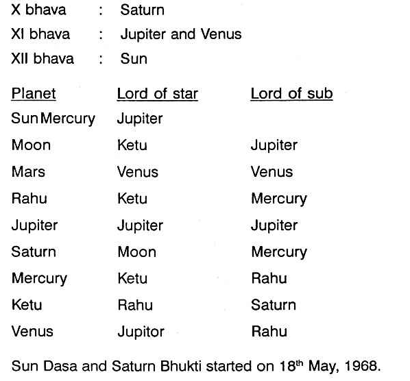

For transfer we have to consider houses 3, 9, and 12. Therefore for husband’s transfer, consider houses 3, 9, and 12 from 7th house, i.e. 9th, 3rd, and 6th.

9th house: It is vacant. Lord of 9th is Mars. No planet in any of the three stars of Mars. So take Mars. But Rahu is conjoined with Mars. So take Rahu and Ketu in the constellation Sathabisha of Rahu. Therefore Rahu and Ketu are significators.

3rd house: It is vacant. Lord of 3rd is Venus. Mars is in Venus star. We have already discussed Mars.

6th house: It is vacant. Lord of 6th is Saturn. No planet in any of the three stars of Saturn. Take Saturn. Saturn’s sign is occupied by Ketu who is aspected by Saturn and in the sub of Saturn. Therefore take Ketu and Rahu, Moon and Mercury are in Magha ruled by Ketu.

Planet showing transfer are Rahu, Ketu, Saturn, Moon and Mercury. As Moon and Mercury are conjoined with Rahu, reject them and take Rahu. Therefore, Rahu, Saturn and Ketu are very strong significators.

Sun Dasa (Sun is with Venus in the same sign) and Saturn Bhukti is on. Select Rahu Anthra and Ketu Shookshma. Ketu Anthra cannot be taken as Ketu is in Saturn’s sign and aspected by Saturn, a planet of delay.

Dasa Bhukti = Anthra Period

- Sun Sat Sat 18th May to 12th July 1968
- Sun Sat Mercury 12th July to 1st Sept. 1968
- Sun Sat Ketu 1st Sept. to 20th Sept.1968
- Sun Sat Venus 20th Sept. to 17th Nov.1968
- Sun Sat Sun 17th Nov. to 4th Dec.1968
- Sun Sat Moon 4th Dec. 1968 to 3rd Jan.1969
- Sun Sat Mars 3rd Jan.69 to 23rd Jan. 1969
- Sun Sat Rahu 23rd Jan.1969 to 14th March 1969

Rahu Anthra operates from 23rd January 1969 to 14th March 1969. Ketu Shookshma rules between 23rd Feb. 1969 to 27th February, 1969. Look at Sun’s transit. Sun on 19th February enters Saturn’s sign Rahu star. Select Ketu sub, i.e. on 27th February, 1969. Sun will be in Saturn’s sign, Rahu star, Ketu sub. Moon will be in Mercury's sign Rahu star. Mars in Mar's sign, Saturn star. Saturn will travel in Mercury star, Saturn sub. Rahu will transit in Saturn star. So he will be transferred on 27th February 1969. As Rahu operating as Anthra lord, is conjoined with Mars, lord of 9th house which happens to be 3rd from 7th (husband’s) he will be transferred to a place not far off. A short travel is shown.

For promotion take houses 2, 6, 10 and 11 from 7th house i.e., 8th, 12th, 4th and 5th from lagna of the lady.

8th house: It is vacant, Lord of 8th is Jupiter. Jupiter and Venus are in Punarvasu ruled by Jupiter. Jupiter is in its own sub and so gains strength. Take Jupiter and Venus.

12th house: Occupied by Sun. No planet in Sun’s star, Sun in Jupiter's sub. So take Sun: Sun's sign is occupied by Rahu: Take Rahu and Ketu in Rahu star: Rahu and Ketu, Sun are significators;

4th house: Owned by Mars. We have already discussed Mars;

5th house: Owned by Jupiter; We have discussed Jupiter. So significators are Jupiter, Venus, Rahu, Ketu, Sun.

Sun Dasa Saturn Bhukti is going on. Saturn Bhukti lord is in constellation Rohini ruled by Moon owner of 12th house. So Saturn Bhukti will give promotion. We would have selected Jupiter's Anthra as Jupiter is very powerful in its own constellation and sub and aspecting 5th bhava. But Rahu a node is transiting in Pisces a sign ruled by Jupiter and hence whatever Jupiter has to give Rahu will give in his period. Therefore the period of transfer and promotion coincides and he will be promoted at the same time. As Rahu is in lagna, i.e. 7th house from 7th his immediate boss will be helping him in transfer.

Example 2

Horoscope is given in the next Page.

Budha Dasa Balance 16 years 2 months 9 days.

Moon Dasa started on 18th-12-68.

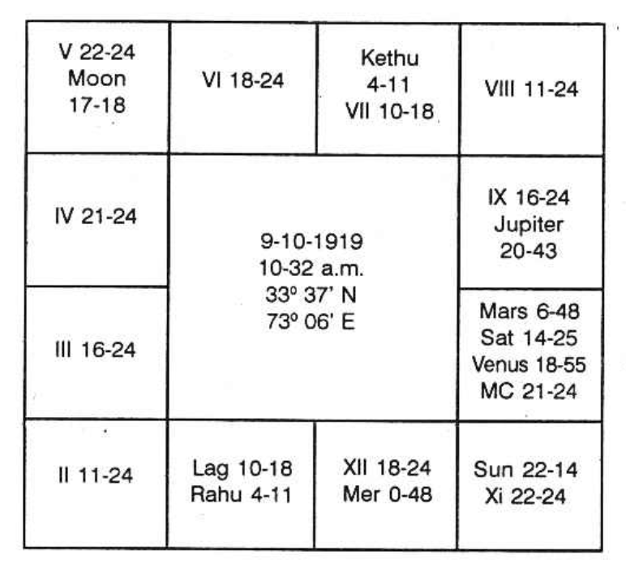

For transfer judge houses 3, 9 and 12 which includes change of residence also. They should be connected with house 6 or 10. If connected with 11th house, it shows increase in income and improvement in status.

Third house is vacant. It is owned by Saturn; Pushya, Anuradha and Uthrapadra are governed by Saturn-Rahu is in Anuradha.

Ninth house is occupied by Jupiter, Mars, Saturn and Venus. No planet is in Jupiter star. Mercury is in Mars star. Rahu is in Saturn star; Saturn and Venus are in Venus star. Rahu is in 12th. No planet is in Rahu star. Rahu is the strongest.

When majority of planets denote a particular matter, how to eliminate many and select those which will act. A matter may be indicated by any number of planets. That particular affair may be one which repeats now and then in one's life, just like birth of child, purchase of jewel, transfer, change of residence, journeys, etc. Then the significators at the moment of judgement clearly shows the immediate next repetition of the matter. In one's life birth and death alone happen only once. Other affairs repeat themselves according to one’s horoscope.

Today it is Tuesday, ruled by Mars. Lagna is in Cancer, owned by Moon, Star is Poorvapadra governed by Jupiter in whose sign, at the time of judgment, Rahu is deposited who represents Jupiter. Rasi is owned by Saturn. Hence Moon, Mars, Rahu, Jupiter and Saturn are the significators. Lord of lagna is the strongest and his dasa is on.

Lord of star represented by Rahu. So take Rahu Bhukti. Next select Jupiter, lord of the star, i.e., Jupiter Anthra, Saturn Shookshma is the last sub sub period (that it will be around 17th August, 1970.)

# Termination of Service

Birth Details

A Native - Male.  
Born on 18th July, 1922, Tuesday at 8:18 A.M. I.S.T. (8:28:40 A.M. L.M.T.)  
Place - Lat. 24° 48'N. Long. 85° 01'E.  
K.P. Ayanamsa - 22° 40'  

| Planets | Star    | Sub     |
|---------|---------|---------|
| Moon    | Ketu    | Mercury |
| Mercury | Rahu    | Mercury |
| Venus   | Ketu    | Saturn  |
| Sun     | Jupiter | Rahu    |
| Mars    | Mercury | Mercury |
| Jupiter | Moon    | Mercury |
| Saturn  | Sun     | Venus   |
| Rahu    | Moon    | Moon    |
| Ketu    | Saturn  | Sun     |

For termination of service, the houses 1, 5, 9 & 12 are to be judged. The 1st house is negation of 2nd (self-acquisition). The 5th is negation of 6th (service). The 9th is negation of 10th (status). The 12th is the general house of loss. Termination of service takes place under the conjoined period of the planets connected with these houses. The following Scientific Method is to be pursued uniformly to judge such a problem. Let us take up one by one.

The 1st house is unoccupied. Its lord is Sun. In its constellation Saturn is posited. Therefore, Saturn is a strong significator.

The 5th house is also unoccupied by any planet. Its lord is Jupiter. Sun is in Jupiter’s star, but it happens to be in the 11th house - the house of gains. Jupiter being in the constellation of the Moon, lord of 12 and occupant of 9th is stronger than the Sun.

The 9th house is occupied by the Moon. Rahu and Jupiter are in the constellation of the Moon. Mars, the lord of 9th, in the constellation and sub of Mercury - lord of 2 and 11, is in 4th and so only a feeble significator.

The 12th house is occupied by Venus. Saturn is posited in the Sub of Venus. The Moon rules the 12th and is placed in the 9th, Rahu and Jupiter, in the constellation of the Moon are stronger than the Moon, to give the effects of the 9th and 12th houses.

The readers will be surprised to note that the significators discussed above conjointly brought about Termination of Service during Rahu Dasa, Jupiter Bhukti, Saturn Anthra, i.e., from 18th March, 1969 to 5th August, 1969. The houses 1, 5, 9 & 12, fully played their role. It is a sufficient proof of the efficacy of K.P.

# When Will I Retire?

Horoscope is as follows:

Rahu Dasa balance 6 years 3 months 2 days.

Sir, retirement from service shows permanently ceasing connection with the office in which you were hitherto employed and also a thorough change in one's surroundings and environment. It includes, also change of one's residence. This is applicable to Govt. Employees who surrender the quaotens allotted to them, after retirement. Therefore, the houses to be examined are 5 and 9, i.e., 12 (negation) to 6 and 10, ruling service and occupation, as well as the 3rd house which is the 12th counted from 4. In your chart, 3rd house is occupied by Rahu. Saturn and Moon are posited in Rahu's constellation. The fifth house is unoccupied. Its owner is Jupiter, and Mercury alone is in Jupiter's constellation. The ninth house is occupied by Ketu with no other planet in its star. Thus, the significators are Saturn, Moon, Rahu, Mercury and Ketu. So in Mercury Dasa, Saturn Bhukti, and Mercury Anthra, when Sun, by transit, passes the position 6 occupied at birth by Mercury, i.e., around 20th November, 1970, will cause your retirement.

Jupiter, whose period you are now running, happens to be lord of 2 and is deposited in the constellation ruled by Mars, lord of 1 and 6 and hence has to benefit you financially which would not otherwise be the case if you were to retire. Jupiter in the constellation of lord of 6 (service) shows continuity in that respect.

In fact, it is because of Mars connection you found yourself into the Navy - Mars occupying a watery sign and owning the 6th house aspects Saturn as well as the Moon (Mars-Moon: Navy).

Further, in my experience, I have found that if two or three planets together indicate a department and also entering into service in youth, whenever their conjoined periods operate in future there will be definite improvement or change or retirement.

In your case, the planets which are connected with houses 3, 5 and 9 are also connected with houses 6 and 2; because Rahu is to offer the results of the planet with which it is in conjunction or by which it is aspected. Rahu is not conjoined with any planet but it is aspected by Mars who, by virtue of its governance over the 6th house, denotes monetary gains as a result of service in departments connected with Army, Navy, Air Force, Police, etc. Rahu thus gains strength to indicate the 6th house results also.

I am sure that, as in the case of many other people, the three planets - Saturn, Mercury and Moon which saw you entering service on 21st May, 1941, will, in their conjoined period again (Saturn Bhukti, Mercury Dasa), indicate retirement.

In traditional astrology, the rule is that planets which are in shasthashtama (quincunx or 150 degree aspect according to Western astrology) to each other, i.e., in 6 and 8 to each other, cannot offer desirable results whenever their conjoined periods operate. Actually, you entered service and also got married only when you were running Saturn Dasa, Mercury Bhukti, - the two planets which are in 6 and 8 to each other. Again, you were confirmed in the Commission when you run the bhukti of Venus which was in 6 to dasanatha Saturn. Another planet, Sun which is also in 6 to Saturn offered, in its bhukti, a voyage to a foreign country at the end of 1947. Also the same Sun's period, before it ended, saw your promotion. Again, in traditional astrology, planets in the 8th house threaten untold miseries, but actually Saturn and Moon in 8 to your lagna which operated when you entered the Navy, again caused another promotion in December 1948 (Saturn Dasa, Moon Bhukti, Saturn Anthra). Has traditional astrology been helpful in explaining your events? You enjoyed diametrically opposite results.

Since Mercury Dasa, Saturn Bhukti and Mercury Anthra is the period of retirement and Mercury is the lord of 8 and 11 houses, it shows that when one retires during Mercury Anthra one will have his accounts settled quickly and will get his accumulated provident fund, etc. no sooner after retirement date. (Mercury is a speedy planet and connected with accounts, etc.) In many cases, people having accumulated arrears during Saturn sub period have their arrears received or entangled money obtaining during Mercury sub period.

# Regaining Lost Position and Retirement

Time of birth was 5:45 PM on 20th February, 1924 at 8° 11' North and 77° 29' East. The horoscope is as follows:

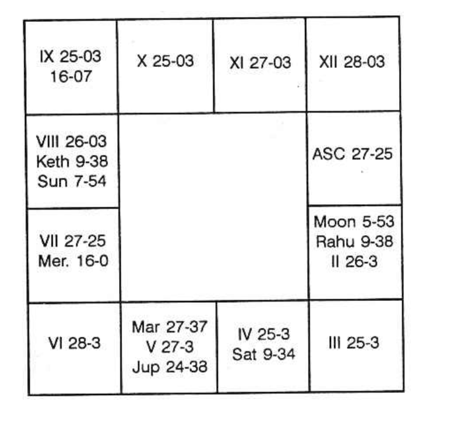

Ketu Dasa balance at the time of birth is exactly 4 years.

Sir, the query is to find out whether your seniority will be restored, if so when? Or will you resign and leave the job, if so when?

To regain one's position, one has to judge the 10th and 11th houses, as the 10th house indicates the position, fame, reputation and honour in profession and also the 11th shows one's realization of ambition. Both the houses are vacant. The lords of the cusps of the 10th and 11th are ruled by Mars and Venus. It will be surprising for you to note that I am taking your horoscope at a time when Bharani Nakshatra is on. It means Moon is transiting in Mars' sign and Venus' star. Therefore the two planets which are to fulfill your desire will be Mars and Venus. The other planet which will also contribute for your success will be the lord of the day and the lord of the lagna in which I am now dictating. Now the lagna is Kataka, ruled by Moon and the day is also ruled by Moon, being Monday. Therefore, one can boldly declare that you will have your desire fulfilled. You are running Mars Dasa, Ketu Bhukti up to 14th January, 1969. Mars Dasa, Venus Bhukti commences on the happy Pongal day of the Hindus. Moon sub period in Venus will be in April-May, 1969. I am sure that the day of order for regaining the lost position would be 3rd May, 1969, when Sun transits in Bharani Nakshatra.

According to this horoscope, there is no planet in Mars' star, no planet in Venus' star. Therefore, Mars and Venus are the two, who in their conjoined period, will do good. No node is conjoined with either of the two or occupying any of the four signs owned by those two planets. Therefore, it must come through and you must regain as the sub lords are favorable.

Regarding the second question, one has to find out when you will be running the period of the significators of the 1st, 5th and 9th houses. Moon and Rahu are in 1st. Mars alone is in 5th and no planet is in 9th. The lord of the 9th is Jupiter. Budha is in Moon's constellation. Sani and Ketu are also in Rahu's star, Guru's star is not occupied by any planet and Mars' star is also not tenanted by any. Taking the ruling planet at the moment of judgment as lagna is in 2° of Cancer, you will retire from the service after the full term during Rahu Dasa, Budha Bhukti, Ketu Anthra, i.e. in 1979. Hence the question of resigning the present post during Mars Dasa or in the first half of Rahu Dasa is out of question.

# Time of Sanction of Pension

Even though one is entitled to pension from the time of retirement, why is there a delay in a few cases? Whose fault is it? Government or your action in the previous birth or your service in this birth?

A member puts this question to himself after he has become dejected with the slow speed of the authorities concerned regarding the settlement of his pension. His horoscope and the facts are as follows:

- Born on 1-11-1908
- Entered into service on 14-7-1927
- Gave notice for retirement in June 1961
- Retired on 19-9-1961
- Pension is not yet settled

Indeed, four years and three months have passed and the pensioner has waited for 51 long months in these costly days. Now, he puts the question: “Whose fault is it?”

The correct answer is his “Fate”. Why? When some are receiving their pension regularly and their accounts are settled around the time of retirement, if this person is put into inconvenience, what will a few philosophers and fatalists say except to confirm that he would have been working probably as an officer in his previous birth and he would not have paid in time either the salary or the pension to the servants, then. That is why, his delayed action in his previous birth has caused this undue delay in this birth. This is the appropriate answer in accordance with Karma and Reincarnation Theory.

In practical life, the above is for consolation. But the same can be explained by the astrologers applying the various principles of astrology.

The appointment was made when the person had been running Rahu Dasa, Jupiter Bhukti and Venus Anthra on 14-7-1927, on a Poorvashada star day when Moon was transiting (though in the 12th sign) yet in the sign owned by Jupiter and the star governed by Venus, lord of the 10th house, indicating profession.

The date of retirement came in Saturn Dasa, Mercury Bhukti, Venus Anthra, Rahu Shookshma. Mercury is the lord of 6, indicating service and is also lord of 9 (12th house to 10), i.e. retirement or leave.

Now, when can he have his account settled? Saturn is lord of 1 and 2. It is in its own constellation. It is strong and hence it can never deny; but, according to its nature it must delay. Generally for settlement of an account one has to scrutinize the houses 2 and 11. If it is pension, as it is concerned with benefit through service the 10th house also is to be included. The 2nd house is not occupied, but it is owned by Saturn. Saturn governs the three stars, Pushya, Anuradha and Uthrapathrapada. No other planet except Saturn occupies the constellation of Saturn.

So, Saturn is a very strong indicator. Therefore, the astrologer can boldly declare that whatever may be the delay and however much it can throw obstacles, Saturn must give the full pension before its dasa is over as it is the lord of finance and it is beneficial for money matters. The total dasa period of Saturn is only 19 years and so far the pensioner has enjoyed nearly 8 1/2 years, and another 10 1/2 hopeful years alone are left over. As regards the 11th house, there is no planet situated in the 11th bhava. But the node Ketu is in 11th house and the stars governed by Ketu are Aswini, Makam and Moolam; Ketu alone is in Moolam. Ketu is a significator. Mars is the lord of the 11th cusp. It governs Mrigasirisha, Chitra and Dhanishta stars. Of the planets and the nodes posited in any group of constellations, the nodes are always stronger than the planets and therefore, Rahu in Mrigasirisha is to be taken. When the horoscope is scrutinized, Venus conjoined with Mars and aspected by Saturn and also in the constellation of Sun - representing the Government - shows that in Venus Bhukti itself, it will be settled and sanctioned.

Therefore, Saturn Dasa, Venus Bhukti and Rahu Anthra commencing on 12th December, 1965 shows that in its period of 171 days it will receive the attention of the authorities and will be disposed. Mostly the date of disposal would be in Ketu Shookshma. So, the pensioner gains confidence that he will have the pension between 10-3-66 and 18-3-66.

According to transit, the so-called sade-sati i.e. the evil 7 1/2 years Saturn period will be coming to an end and Saturn, the dasanatha will be in Jupiter's star and Ketu sub. Jupiter will be transiting in the constellation of Mars and in the sub of Saturn which is the lord of 2nd house. Venus, the bhukti lord, will conjoin with the Ascendant in direct motion and transit in Lagna Bhava.

Therefore, astrology offers both peace of mind and also a consolation for the delay as well as the mind to live on hopes till 42-3-1966, when it will be sanctioned. Even here Saturn will play its role, 12th March happens to be a Saturday. What if? A second Saturday in the month of March. So, it is a holiday and hence one is to wait for next Monday. Now one may ask “Is not the lord of the star stronger than the lord of day”? If it is to be strictly followed, should not one find out where Moon will be transiting on that Saturday and note the lord of the star. “Oh God!” says the astrologer, leaning back on the easy chair - The star is Anuradha. It is governed again by the delaying Saturn. That is why probably, our ancestors have given Saturn, the last day of the week, to be governed by it. Otherwise, in the middle of the week, it may throw obstacles and cause difficulties. Saturn is a friend for people who are very slow and a foe for fair deal.

If this paper moves slowly similar to Saturn in the Heavens it is only due to his Saturn Dasa and not the Government. He gathers courage and asks the astrologer “If my pension will be settled before this official year, then shall I get the increment due to me, when I was in service? The authorities regularly gave me increment in the same scale of pay for the same post held by me from September, 1955 till 1960. Only the increment for 1961 remains to be paid”.

The astrologer says within himself “I pity with you. God also hears your prayers. Authorities are reminded periodically. But what God or the Government can do, when your fate is so strong that the authorities cannot settle your account in these 51 months and another couple of months to come.

At any rate, on the above date, Saturn will knock at your gate and say “Late is due to your fate”. Actually, the date of sanction was 26-3-66.

# Politics

Politics is not poly tricks played for one's prosperity, but it is a science of or a treatise on the organisation of a nation and execution of the policy after discussion for the welfare of the nation and not the native alone. As one is to live happily in this world and enjoy ika loka-sukha-venus, the chief governor for worldly pleasures is called one of the ministers of the celestial bodies. Since the uplift of the soul and para-lokha sadhana are the ultimate aims, Jupiter, the karaka for these is said to be the chief minister of the celestial bodies. If a person is expected to be the representative of the public, Mercury, called the winged messenger of God or agent, should indicate in one's chart whether he will be a member, a councilor, a mayor, a minister and so on.

As ministers are empowered with power and authority, Mars must be well placed and strong. As ministers hold the position of trust, Saturn also must be beneficially posited and strong. A politician needs mostly oration, convincing tactics, popularity and mainly fortune to come out successful. One can be a good orator, if Jupiter and Mercury are favourable and if Mars is auspicious then he can place before the public, the facts in meticulous detail, analyse and explain, whether one is right or wrong, one will be capable of convincing the people and carry the mass with him.

Vaidhyanatha Dikshita says in Jataka Parijatha that one can become a minister:

1. If Sun, Mars, Mercury and Saturn are conjoined, the person will be a minister. (If you want to apply Krishnamurti Padhdhati Sun in Saturn sign, Mars star, Mercury sub or Mercury in Aquarius in Sun Sub, in Mars star, or in Anuradha star governed by Saturn, in Mars sign and the sub belonging to either Sun or Mercury at the time of birth makes one a minister in the period or sub period of the occupant).
2. If Moon, Mercury, Jupiter, Venus and Saturn are conjoined in a House (not a sign) they make the person a minister. [According to Krishnamurti Padhdhati Venus in Jupiter sign, Mercury star, Moon sub, aspected by Saturn by 3" aspect produces the above result: or Saturn in Mercury sign, Jupiter star, Moon sub aspected by Venus causes the above effect; or Saturn in Venus sign, Moon star, Venus sub aspected by Mercury etc. They need not be conjoined. What results are promised by conjunction will be produced by being situated in a position where the sign lord, star lord and sub lord are the same planets.]
3. Jupiter in 9 contributes: aspect of Mars is also beneficial.
4. Three planets in their own sign (Swakshetra) makes one a minister. He or she may be tactful, diplomatic and clever or cunning and hypocrite.

In Sanketanidhi, Ramadayalu says that one becomes a minister even in youth, if lord of 5 is in 4. He will be honest. (Lord of 5 in the constellation of lord of 4 is good). One a minister. So also Jupiter in 6, or Venus in 5, or Venus in 10.

In Horasara, Prithuyasas that Sun in the 6" house makes gives a lift to the person to become a minister. Also he says that when all the benefics are situated in 3 or 6 or 10 or 11 and the malefics in 1 or 10, one can become the chief minister.

In Jataka Dasa Marga, Podumanni Chomadiri says that benefics in 6, 7 and 8 counted from the sign occupied by Moon, causing Chandra Adhiyoga makes one a minister. So also one born in Lagnadhiyoga will be benefitted. He also adds that lord of 10 in exaltation makes one a minister.

Mantreswara in Phaladeepika mentions that Mercury makes one a good politician, The 5" house is to be judged to find out whether one can become a minister and also Jupiter, Sun and Moon.

To become a minister or a politician, first of all, one should be lucky. One need not be rich to spend money on elections. One need not be educated much. Among ministers do not we see, engineers, doctors, lawyers, teachers, officials, business people, etc. Caste and creed do not count excepting in certain cases.

As per Krishnamurti Padhdhati, Fortune to become a minister is to be judged as follows. Cusps of the Houses 1, 6, 9 and 10 should receive beneficial aspects. The occupants of those houses must be in the constellation of benefics by lordship and the sub is to be ruled by such benefics connected with houses 1, 6, 9, 10 and 11. House 1 shows that he enjoys the benefit. 6" house promises failure and loss to the opponent, thereby victory over enemies. 9" house is the bank position of the meritorious deed done in the previous birth, thereby there is the Bagya, the Providential help etc. 10" house indicates name, fame, reputation, popularity and profession. 11 house promises success in election, realisation of ambition and fulfilment of one's desire. Thus one is to judge.

[How planets portray the ministers resigning with black mark, ministers re-entering service again, ministers resigning honourably on a policy with prestige, ministers again called for to occupy a better position, changes in their portfolio, lift in rank, honest or otherwise will be discussed in my magazine Astrology and Athrishta.]

Dated 6-12-1968.

Dear Sir,

Please refer to your letter dated 10-12-67 in reply to my letter dated 6-12-67 wherein you had written that “I will not be given ... ... ticket for Rajya Sabha Seat”. This proved to be correct. Is there any astrological indication of my getting any Political uplift in 1969?

Yours sincerely,

(Sd.) B. Prasad, M.A.

# Will Politics Suit Me?

A young man with a keen aptitude for politics wants to know if he would be successful in political ventures. The number furnished by him for analysis is 206. The question is taken up for analysis at Lat. 16° 31' N and Long. 80° 39' E on 13-9-1969, 8.30 A.M. I.S.T.

Since the querist has given number 206, the nirayana horary ascendant is the commencement of 206° sub of Krishnamurti Padhdhati. Hence the lagna is Capricorn 26° 6' 40". Adding 23° 20' being Krishnamurti ayanamsa for 1969, we find that the sayana ascendant is Aquarius 19° 26' 40". The other cusps are obtained from Raphael's Table of Houses as usual. The values given by Raphael are tropical. But, we work with sidereal (nirayana) values. Hence, from each of the sayana cusps, we must deduct Krishnamurti ayanamsa (23° 20' for 1969). The following chart shows the different cusps and planetary positions at the moment of analysis.

Balance of Moon Dasa: 8 years; 6 months 5 days.

Rahu represents... Saturn

Ketu represents... Sun

| Planet & Bhava | Star Lord | Sub Lord |
|----------------|-----------|----------|
| Sun (7)        | Jupiter   | Venus    |
| Moon (8)       | Moon      | Rahu     |
| Mars (11)      | Ketu      | Venus    |
| Mercury (8)    | Moon      | Venus    |
| Jupiter (8)    | Moon      | Saturn   |
| Venus (6)      | Mercury   | Rahu     |
| Saturn (8)     | Venus     | Venus    |
| Rahu (1)       | Jupiter   | Venus    |
| Ketu (7)       | Jupiter   | Venus    |

The essential qualifications for a successful politician are:

1. He must be a good orator
2. He must be able to tactfully win over masses by meticulously placing before them facts and figures and explaining in detail
3. He must win public confidence
4. He should have an element of fortune to bless him with popularity and prosperity

Well-placed Jupiter, Mercury and Mars give oratory capabilities and Saturn gives positions of trust. For politics, the most auspicious houses are 1, 6, 9, 10 and 11. Winning over rivals is indicated by house 6 because it is the 12th to 7th, the rivals. Popularity and prosperity are to be read from houses 10 and 11. An element of fortune and benefits are shown in houses 1 and 9.

Therefore, if Jupiter, Mercury, Mars and Saturn are strong and signify houses, 1, 6, 9, 10 and 11, either jointly or independently, then the querist will be a successful politician. In the present chart, Jupiter and Mercury are in conjunction, Jupiter owns 11 and Mercury owns 6. Both are in the constellation of Moon, lord of 7 in 8. This indicates victory of opponents. Lord of 10 Mars is in 11 and in the star of Ketu who is in 7. This shows popularity that gains. Lord of 1, Saturn is in the star and sub of Venus, who owns 9 and is in 6. By this, the querist will win over his rivals by luck and will be benefitted. Lord of 9, Venus is in the star of Mercury in 6 and sub of Rahu in 1 indicating gains to opponents.

We therefore find that Mars and Saturn are well placed for politics, Jupiter and Mercury, though apparently well placed, do not promise success. Saturn signifies 1 (by lordship), 3 (by occupation), 6 and 9 (by position in Venus's star, who owns 9 and is in 6). So, houses 1, 6 and 9 are brought out by Saturn. Mars signifies 10 (by lordship), 11 (by occupation), 7 (by occupation of Ketu’s star), 6 and 9 (by a position in the star of Venus, who owns 9 and is in 6). So, Mars signifies houses 6, 9, 10 and 11.

Mars and Saturn will bless the querist with success in politics. He can, therefore, go ahead confidently. But look! What is the dasa now running? It is Moon Dasa, Rahu Bhukti. Moon Dasa runs up to 18th March, 1978. Therefore, the querist should not be in haste. He should wait till that date in 1981. Whenever Mars and Saturn offer a result, it will be at a time when Sun transits Anuradha or Dhanishta star.

# Will I Be Selected as a Minister?

A popular person, hoping to become a minister, anxiously puts the question “Will I be selected as a minister? Give number 37 for your analysis by Krishnamurti Padhdhati”. The question is taken up on 29-8-1969 at 9.20 A.M. IST at Lat. 16° 31' N and Long. 80° 39' E.

Number 37 implies that the horary ascendant is Taurus 22° 40' on the nirayana zodiac. The sayana lagna is, therefore, Gemini 16° 0', since Krishnamurti ayanamsa for 1969 is 23° 20'. From Raphael's Tables of Houses, we find that the other sayana cusps at the Lat. 17° N are:

Adding 6 signs to each of the above, we get the cusps for the other 6 houses. Since we require nirayana cusps, we should deduct 23° 20' from each of the above values. The following chart shows the complete horary nirayana map of the Heavens at the moment of analysis.

Nirayana Horary Chart

| Planet & Bhava  | Star Lord | Sub Lord |
|-----------------|-----------|----------|
| Sun (3)         | Kethu     | Mercury  |
| Moon (10)       | Saturn    | Mercury  |
| Mars (7)        | Mercury   | Mars     |
| Mercury (4)     | Sun       | Venus    |
| Jupiter (4)     | Moon      | Jupiter  |
| Venus (2)       | Saturn    | Mercury  |
| Saturn (11) (R) | Venus     | Sun      |
| Rahu (10)       | Jupiter   | Venus    |
| Kethu (4)       | Sun       | Mars     |

Saturn represent Rahu  
Kethu represents Sun  

Analysis: Moon in 10 in the star and sub of Saturn, lord of 9 and 10 in 11 shows the mind of the querist concentrated on political success. According to Krishnamurti Padhdhati, Jupiter, Mercury, Mars and Saturn signifying houses 1, 6, 9, 10, 11 indicate political prosperity and also ministership.

In the chart, lord of 1 and 6, Venus is in 2 in the star of Saturn, lord of 9 and 10 in 11 and sub of Mercury, lord of 2 and 5 in 4. Hence Venus promises success. Lord of 11 Jupiter is in the star of Moon, who is occupant of 10 and sub of Jupiter himself. Jupiter therefore promises success. Saturn, lord of 9 and 10, is in 11 in the star of Venus, lord of 1 and 6 and sub of Sun, occupant of 3. So, Saturn provides positions of confidence.

Mars owns 7 and 12 and is in 7. He is in the star of Mercury in 4 and sub of Mars himself. Therefore, Mars is not well placed for political prosperity. The meridian falls in the star of Rahu and sub of Saturn. Rahu is in Saturn’s sign and so represents Saturn. Since the sub lord of the 10th cusp, Saturn is retrograde, the result will be negative inspite of apparently favourable development.

The querist need not entertain any hope of becoming a minister, even though he will enjoy popularity and prosperity.

# Choice of Friends (Friend or Foe)

By friendship, it does not mean that everyone can expect something or other from the friend; either by his physical labour or correct advice or by assisting at the time when one needs. But a person is to be considered as a friend:

1. If he never thinks evil, never does harm, or be observing the mischievous action of the evil-doers, though he may not connive at it;
2. If he gives moral support and acts as an intelligent minister;
3. If possible, lend assistance when one demands or needs it.

One is a real and useful friend if he understands the situation of a person and helps the person to fulfil his desire. Astrologically, 11th house indicates realisation of one’s ambition. It also denotes elder brother, real friends, permanent friends, one’s gains or the assistance received by one.

1. If lord of 11 is in the constellation and sublord of 1, 2, 3, 6, 10 or 11, that person will have friendship with one who will be helpful.
2. If lord of 11 is in the constellation and sub of planets signifying the matters of a houses 4, 5, 7, 8, 9 or 12, the person be a loser through his friend. Lord of 11 or planet signifying 11th house matters in the sub of 1 denotes sincere and permanent friend who will materially help. Lord of 11 or planet signifying 11th house matters in the constellation of lord of 2 or sub of 2 indicate that one can make money and gain through friends.

Some will give encouragement by offering mental solace while the person is depressed and in many words give the person confidence. Lord of 11 or planet connected with 11th house matters in the constellation of lord of 3 or sub of 3, give chance to make friends during short journey or by correspondence and it may be for a short time. If lord of 3 is also lord of 12, then this person, on a later date will prove to be a scoundrel, cheat and secret enemy. Never talk to such rogues. In weak moment if you hint anything they will build up, give shape to it and either write anonymous letters or betray the person.

A person born in Cancer Lagna, had his Venus in Revathi constellation ruled by lord of 3 and 12. He had a friend born in Virgo owned by Mercury. The friend knowing every secret of the person gave information at such a time that the person was arrested a couple of hours before his daughter's wedding, when there was a large gathering. This scoundrel did not attend the marriage. Hence those who are born in Cancer or Capricorn should never make friendship with those whose ruling planets are Mercury and Jupiter, respectively. If lord of 11 or significator of 11th house matters were to be in the constellation of lord of 4 and 9, do not make friendship with those whose ruling planets are the lords of 4 and 9. Such friends are for taking money and material and never remaining grateful.

If it were to be in the constellation of lord of 5, you will always lose, the so-called friend will ever gain. It is very true, if lord of 5 is also lord of 8 or 12. This is invariably true for Gemini borns who will ever lose through friends born in Venus constellation, so also Sagittarius-born through those born in Mars constellation; similarly Aquarius-borns lose through those whose ruling planet is Mercury; Leo borns lose through Jupiterians. If it were to be in the constellation of the lord of 6, he never loses: the native gains. The friend gives and the native receives. Suppose you are weak minded and you want to play cards. You play with such people who are born in that constellation, lord of which is the lord of either 1 or 2 or 3 or 6 or 10 of 11. You will win. But if you play with those born in that star (Nakshathre) lord of which rules the houses 4, 5, 7, 8, 9, or 12 in your chart you have to lose.

If the lord of 11, or planet signifying 11th house is in the constellation of lord of 7 or 8 or 9, you cannot rely on him. He will be time-serving. Lord of 11 in the constellation of lord of 10, most helpful and faithful friends. Reputation, honour, and prestige will be on the increase. Such persons born in the constellation of lord of 10 will be a good propagandist to make the person popular. Lord of 11 in its own constellation brings permanent friends who are very useful. Lord of 11 in the constellation of lord of 12 is dangerous. Never rely on persons born in the constellation of lord of 12. They are your secret enemies. They cannot but be silly towards you. They will behave as though they are low-born and ill-bred. They will talk pleasantly but be planning to do harm. Never allow them inside. Stop them near the gate. Talk and send them away. They do not deserve a better treatment from you.

Generally one can have good friends if lord of Lagna and lord of 11 form good aspects. Planets forming adverse aspects with lord of Lagna show that people born with those planets as their ruling planets cannot be good friends. Malefics in the constellation of lord of 12 threaten that those born in their constellation can never be a faithful friend. Ketu in 11 is also not auspicious. Cheating will be the motto. Benefics in the constellation of lord of 12 indicate expenses with pleasure or purchases or investment. Planets in the constellation of lord of 12 (benefics) show pleasant expenses, buying materials or investing on lands, building, business, etc. But if lord of 12 is a malefic and a planet is in its constellation whichever house the planet may own or occupy, the ultimate result is loss.

If lord of 3 is in the constellation of lord of 12, the loss or waste or anxiety or secret inimical activity will be through neighbours or cousins or while making a short journey or by editing publishing, etc. If lord of 4 is in the constellation of lord of 12, the loss may be through mother, conveyance, change of residence, building, failure in education etc. if it is lord of 5, loss may be through visitors, companions, music or musicians or children or through speculation or pleasurable pursuits. 6th house lord denotes loss due to disease; 7th house lord denotes loss through litigation, partner, wife or husband; 8th house lord denotes loss by repaying prohibitive interest on the money borrowed. Lord of 9 indicates expenses through strangers, father, long journey, high studies, etc. Father himself may prove to be untrue to the person especially when lord of 9 is also lord of 12. A friend of mine is born in Libra. Lord of 9 Mercury owns the 12th house also. Saturn was in Ashlesha ruled by Mercury. During Saturn dasa, Mercury Bhukti, his father gave away his possessions to another son and did not give anything to my friend.

Lord of 10 shows change in service: illegal gratification given for promotion. Lord of 11 in the constellation of lord of 12 indicates loss through elder brother or friend or son-in-law or daughter-in-law. If lord of 12 is stronger than lord of 1 or 11, the secret enemy is more powerful. If lord of 7 is stronger than lord of Lagna, opponent is powerful. If lord of 1, 2, 6 and 11 are stronger than lords of 7, 8, 12 and 5, the native ever gains, wins the litigation, comes out victorious in election, passes through competitive examination, wins in competition, etc.

# Giving or Receiving

Says that a person will give gifts liberally if Moon is in 7th Bhava. But I say that planet in the constellation of Moon when Moon is in 7th or when it owns the 7th house, will give opportunities to the person to donate liberally during the period and subperiod of such planets. Similarly, Mercury in the 10th house shows that the person liberally gives gifts. Sun, Venus and Jupiter conjoined in any house show that the person will offer gifts. People born in Punarvasu give gifts beyond their capacity. Moon in Gemini is favourable to offer gifts. Also people born having their Lagna in Virgo Navamsa will be liberal in gifts.

(Mahadev: Jataka Tatwa says that:

1. If lord of 9th aspects Mercury in exaltation in 11th or in a Kendra one gives liberally.
2. Lord of 9th in exaltation and also aspected by a benefic.
3. Lord of Lagna in a Kendra and lord of 9th in 1st or aspecting Lagna.
4. Lord of 9th in Simhasanamsa aspected by lords of 1st and 10th.
5. Lord of 9th in good Varga, aspected by Jupiter and lord of Lagna aspected by Venus.
6. Lord of 9th in 4th, lord of 10th in Kendra, lord of 12th, aspected by Jupiter gives rich presents (Donates landed property gives away building).
7. Lords of 1st and 2nd in mutual exchange-liberal in gifts.
8. Jupiter in the Navamsa sign occupied by Atmakara.
9. Jupiter in 1st or 5th and Moon in 10th.

Suggests that one is to judge gifts from 7th house. Saturn indicates receipts of gifts; but 5th house indicates feeding others; gift for people affected by natural catastrophe.

(Vaidyanatha in Jataka Parijata says:

1. Jupiter in the second house, or
2. Moon in 9th or if one’s horoscope, 5 planets occupy their own sign, or
3. If one is born during cool season, winter, giving or accepting.

# Accepting Gifts

1. If the planet signifying the 10th house matters were to be in Navamsa either in Sagittarius or Pisces, one has their living by accepting gifts.
2. Lord of Lagna strong in 11th and aspected by lords of 9th and 10th.
3. Lord of 5th in 9th, lord of 9th in 10th and aspected by lord of Lagna.
4. Lord of 9th in a Kendra or Kona and aspected by lord of 10th.

Gifts according to Westerners are to be judged from the 8th house. According to me, receipts are judged from the houses 2nd, 3rd, 6th and 11th; giving away is to be judged from the houses 8th, 9th, 12th and 5th.

Second house indicates increase in bank position. Third house shows Sahaya (assistance, help etc.) from others (represented by 7th house). Sixth house denotes parting away by the person who gives and 11th house is the gains. 7th house shows one who receives or one who gives i.e. a transaction done with another: the person with whom one transacts. Therefore, houses 2nd, 3rd, 6th and 11th counted from the 7th indicate the benefit to the other, i.e. giving the gift to another. Therefore, houses 8th, 9th, 12th and 5th indicate giving the gift.

Rule is ever universal to find out the significators: 

1. The strongest significator is that planet which is situated in the constellation of the occupants of the houses 2nd, 3rd, 6th or 11th. 
2. If none, the occupants of these houses. Their strength is less than those in their constellations. 
3. The planets in the constellation of the lords of these houses. 
4. The lords of these houses. 
5. Planets conjoined with or aspected by them. 

All these give opportunities to give gifts. The strength is to be judged in the above manner. Similarly, planets connected with houses 8th, 9th, 12th and 5th indicate the gift one gives.

# Imprisonment

Hindu sages give various conditions under which one will be imprisoned. Ganesa, son of the artist Gopal and grandson of Kanhajee, the Court astrologer in Gujarat, in Jataka Alankara says that a person will be imprisoned if all the malefics are posited in 2, 5, 9 and 12. If the Lagna is Aries or Taurus or Sagittarius he will suffer rigorous imprisonment. Mahadeva in Jataka Tatwa gives the same rulings. He adds that persons born in Scorpio having malefics in 2 and 12, and 5 and 9 will be kept in cellars. If malefics are in 2 and 12, also 5 and 9 to Aries, Gemini, Virgo and Libra-borns they will be put in fetters. Cancer, Capricorn and Pisces-born will be kept in a fort without fetters if the Lagna is hemmed between malefics, occupying 2 and 12, and also forming trine aspect to Lagna from 5 and 9 i.e. they will not be tied over the legs or chained.

If lords of 1 and 6 are conjoined with Saturn in a Kendra (1, 4, 7 or 10) or in a Kona (1 or 5 or 9) one will be imprisoned. In Brihat Jataka Varahamihira says that a man will be lathi charged and imprisoned if Saturn is in Scorpio. Vaidyanadha Dikshitha in Jataka Parjjata mentions that one will suffer imprisonment during the period of the Chakradasa of the 6th rasi. Kalidas in Uthra Kalamitra says that one is to judge imprisonment from 12th house. Ramadayalu in the Sanketanidhi says that a person will commit murder and undergo imprisonment if Venus is in 2, Moon in 1, Sun and Mercury in 12 and Rahu in 5. He also suggests that one should judge the houses 6 and 12 for imprisonment.

Thus these authors are of opinion that 12th house signifies imprisonment; 5, 6, 8 and 9th houses are also to be judged. The scientific explanations for imprisonments and how to judge according to Krishnamurti Padhdhati are given below:

Will I ever go to Jail? If so, what is the duration? When will I be released? Will I be imprisoned off and on? Why?

Imprisonment includes separation from the family, not having free movement, being confined within 4 walls, change of residence and bedding, and no Suka Sayana. 2nd house shows life with the members of family. Restrictions in the movement are indicated by the 12th house. Change of residence: 3 and 12. Bedding: Desirable or undesirable, 12th house.

Therefore, malefics occupying the constellation of the planets situated in the houses 2 and 12, occupants of these two houses owning evil houses, evil planets in the constellation of the lords of these houses, and lords of these bhavas threaten imprisonment. If lord of 1 is also connected with any of these, one courts imprisonment. If lord of 6 is connected, due to inability to return the loan, civil suit and imprisonment. Jupiter, Venus or lord of 9 and 1 connected with the significator, indicates imprisonment on political grounds. Mars, lord of 8 connected with any of these significators show that one will be punished for theft. Saturn and Mercury threaten imprisonment due to forgery, falsification of accounts and misappropriation. Mars, Saturn and Venus threaten imprisonment due to rape, kidnapping and brothel. Mars and Saturn give imprisonment due to murder.

Release includes reunion with kith and kin, free movement and independence: 24th and 11th house indicate the above results. Therefore, benefics in the constellation of the significators of the houses 2 and 11 indicate the release. Hence the period or subperiod governed by evils connected with the houses 2 and 12 show the time of imprisonment and the period and subperiod of the benefics connected with the houses 2 and 11 indicate the time of release. The interval is the duration of the imprisonment.

If the evil planet connected with the houses 2 and 12 were to be in 3 or 6 or 9 or 12 and in a fixed sign, the duration is long. If the evil planet be lord of 1 (like Saturn for Aquarius Lagna) and owning another evil house 6 or 12 and is in 4 or 7, or 8 or 12, connected with the significators for imprisonment, is combust or retrograde, one will be a jail bird. If lord of 8 is strong and afflicted one will die in the jail. Rahu, the ascending node is the chief significator for jails. Good aspects to 12th cusp or to the significator of the 12th house and evil aspect to the second cusp or the significators of the second house forebode confinement.

In the course of my official tours to inspect the water supply to the prisoners in the jails in Madras State, I had the occasion to collect materials, horoscopes, etc., from both the supervisory staff and convicts. In majority of the cases, there was strong indication of imprisonment because of the occupation of an evil planet in 2 or 12 and in the constellation or sub of Rahu which is also connected with 2 or 12. Again I checked my horoscope and found how mysteriously the periods agree whenever I visit jails without committing any crime and without being so punished. So, whether on duty or due to punishment, only when the periods agree, then alone one can visit a jail.

# Spiritual Life

Spiritual life brings about an attachment to the unknown and unseen, but about which we have read or heard much. It also brings about, slowly and steadily or surprisingly and suddenly, separation from the family or detachment towards material worldly pleasures.

Mostly, all of us get initiated by a person - a Guruji - who has been experienced in those lines, who had the dynamic urge within him to seek the Truth by penance and deep meditation, regularly, systematically, and continuously for a pretty long period. Only a few solitary individuals have the urge from birth and even without a Guruji, they attain a high status in spiritual life. They will be a very few in many, many millions of people, who will have Mukti or progressive emancipation. Of them, a few will merge themselves with Nirguna Braman.

For such an attainment, one has to cultivate serenity, sincerity, and simplicity. No university degree or diploma can give this, but these are to be either inborn or obtained by cultivating these virtues. Also, one should avoid audacity, irritability, cruelty, and impurity.

One should keep the body fit, hale, and healthy by regular habits and practice. One can enjoy fullness, peace, and bliss only through meditation by trying to attain God-realisation, developing a detached attachment feeling towards wife, etc. It does not mean that one should ignore her or forget her or get separated from her. The noblest way of enjoying bliss by developing spiritual side is (as is said in Tamil ‘Illaramay Nallaram’) to give due respect and regard to one’s wife, considering her as Goddess Lakshmi, as the embodiment of patience, sacrifice, service, and love, as one who contributes for the building up of the nation by moulding the children, as one who assists in our attempts. So one can lead a family life and at the same time go on progressing on the spiritual side.

There are a very few people who desert the family, run away, and wait for the choultry bell for their daily meal - wretched! What a Sanyasi he is! Nowadays, criminals after committing the crime try to hide themselves and hence lead a Sanyasin life without allowing anyone to know their whereabouts. Saffron dress alone does not make one a Sanyasin. Development of the spiritual side by regular meditation and prayers is needed. ‘If one becomes a Sanyasi, in true sense, he is not denied of absolute necessities. He will be respected and honoured. In that situation, if need be, without a pie in the bank in his name, he can operate on the purses and cheques of the rich people, without a car, he can travel in latest modern car, without a house of his own, he can be in a palace, though he does not pray for it, but it comes automatically.

Hence, lead a family life and at the same time reduce Ika-Lokha-Sukha and improve the Para-Lokha-Sadhana. (Therefore, one has to judge a horoscope for the above virtues and vices). Let us take an example. Can this native achieve his aim in spiritual side? The horoscope is as follows:

- Sun Dasa balance 2 years 9 months 11 days. Now he is running Jupiter Dasa Ketu Bhukti from 1-12-68.
- (a) Will he be sincere? Benefic in the 4th house, in the constellation of another benefic and sub of a benefic makes one true, reliable, and sincere. In this chart, Jupiter is in the 4th Bhava. It is in Mercury’s star and Jupiter sub. So he cannot afford to entertain evil thoughts.

Westerners claim that Saturn helps concentration. According to their theory, Saturn forms sextile aspect with the ascendant and it promises that he will be able to concentrate. But according to Krishnamurti, mind which is normally ever wavering is never at rest.

Hence, one is to find out the sub lord of the position occupied by Moon. Moon is in 3° 48’ in Taurus. Hence, Moon is in the sub of Saturn. So anyone having Moon in the sub of Saturn can concentrate. This native also will meditate and concentrate. It is possible.

# Will He Be Arrogant?

One can be arrogant only when Mars is connected with the ascendant, or at least with the lord of the ascendant. As Mars has no connection at all, he will neither be arrogant, nor have the egoism. If Mars is in Saturn sub, one will be unassuming and simple. Here, Mars is in Saturn sub. So, he will not have the vices which are to be avoided.

So, when one has no vice, but has the necessary virtues, then we have to judge whether one will have the opportunity to have a good Guruji to initiate; if so, when. The fifth house denotes initiation. It is occupied by Mars. No planet is in Mars' star. The fifth house is owned by Jupiter. Sun alone is in Jupiter's star. Therefore, he will have initiation during Jupiter Dasa, Sun Bukti, Mars Anthra, i.e., in September 1972.

Will He Practise?
Whenever Saturn is in the third house, there will be interruption. Yet, it is the tenth house which shows one’s Yoga, Karma, Yagna, etc. No planet is in the tenth house. Venus is the lord of the tenth cusp. It is in Ketu star, Saturn sub. Therefore, he will practise.

Progress depends on the eleventh house. It is not occupied by any planet. Mercury is the lord of the eleventh cusp. Jupiter alone is in Mercury's star. Therefore, during Jupiter Dasa itself, he will have satisfactory progress. Saturn Dasa follows. Saturn is in Jupiter's sub. Hence, it will continue - progress during Saturn Dasa will be like an inclined plane ever increasing in height.

According to Westerners, Jupiter forming a trine aspect with Neptune in the twelfth house is very favourable for the awakening of spiritual faculties. The inspirational nature will be marked. This aspect is good for material success, worldly pleasures, and vast advancement in spiritual life.

# About Dress

Dress helps you to retain an air of distinction in a party or gathering. You can eat to please yourself; but you have to please others by dress. You may be a great orator. Yet if you do not dress properly people will laugh at you rather than admire your eloquence. For that reason, one should not be the first for fashion nor the last. But one should use comfortable, cheap and tasteful dress. Only fools will have the variety of loving fine clothes and new fashions and value themselves by such dress. Avoid all things extravagant. Exquisite neatness is required. Outsiders can see only how we dress but they can’t see how we live or what we eat.

So, you should be clever in making selection of perfume, cosmetics, dress, etc. Your dress should be much pleasing and also attracting the attention of others. You should have the knack for choosing clothes which are not only attractive but also serving you long; others should try to copy you. To enhance the personality, buy diamonds, jewellery, flowers, etc. Your appearance will be stately if you put on such a colour which suits your birth sign. Dignity is to be maintained.

The colour of the dress varies with the birth sign so also the perfumery, jewels, etc. It is not only the attractive colour that is to be chosen but one should find out, astrologically, such a colour which will bring fortune and which will be helpful to enjoy life with peace and pleasure.

Further, each sign-born should know which day is the best to put on new dress. You should know that one should observe the day when a new thing is used for the first time. One can buy on any day but choice of the day to use it alone should be strictly observed.

If one puts on a new cloth when Moon is in Aswini, one will have the fortune to get more and more dress. If Moon is in Bharani and one uses a new cloth then it will be stolen. If it is in Karthik there is danger from fire. Moon in Rohini improves the bank position. Moon in Mrigasirisha threatens that the dress will be spoiled by rats. If Arudra is the star then one loses money. If the day is Punarvasu, there can be no trouble. Pushyam star promises wealth. Avoid Aslesha which will destroy the cloth. Magham star threatens danger to life. Poorvapalguni day threatens troubles from Government. Uthrapalguni increases income and offers good health. Hastham gives success. Chitra shows that one will have more and more new clothes. Swathi is good for rich food. Visakam increases popularity. Anuradha is for good friendship and social success. Jyeshta shows loss. Moolam star loss of dress in water through dhoby. Poorvashada, health lost. Uthrashada, sumptuous feast. Sravanam star-eye disease. Dhanishta star-good yield from field. Sathabhisha star-danger from poison. Poorvapathrapada star-danger through water. Uthrapathrapada star-child birth; those who have no children make it a point to use new cloth on Uthrapadra star day. Revathi star becomes rich, purchases gems.

Therefore the auspicious stars are Aswini, Rohini, Punarvasu, Pushyam, Uthrapalguni, Hastham, Chitrai, Swathi, Visakam, Anusham, Uthrashada, Danishta, Uthrapathrapada and Revathi.

The inauspicious asterisms are Bharani, Krithika, Mrigasirisha, Arudhra, Ashlesha, Magha, Poorvapalguni, Jyeshta, Moolam, Poorvashada, Sravana, Sathabisha and Poorvapathrapada.

Exceptions:

If a star day is considered to be inauspicious one can use new clothes if the happy occasion is a marriage or birth day at the time when others give them as presents.

# Which Gem Can I Use?

Gems look like fragments of Heaven. They are beautiful, costly, and attractive. Their colors penetrate deeply like the perfumeries. Some believe that by using the gem, the disclosed knowledge is gained by divine grace or supernatural agency. Some believe that one can dodge fate by using them. Such a superstition or belief was transmitted to us from time immemorial.

Thousands of years ago, Aaron, the Priest of Israel, used to put on a breastplate in which 12 different gems were set and these 12 gems were assigned to the 12 signs of the Zodiac, the pathway of the planets in the Heavens. Nowadays, most of the people use the gems mainly for two reasons: it is beautiful and during the time of emergency it can fetch currency. Only some use that particular gem which will suit him or her so that they can have peace, pleasure, prosperity, and success. The fact is that the planets radiate different colors. Each stone is sympathetic to the nature and vibrations of each planet.

* Agate: pleases God; confers wisdom and eloquence; safeguards from deception; strengthens the heart; cures fever, scorpion bites, and snake-bites. Removes obstacles in receiving the legitimate inheritances.
* Amethyst: is a preventive for the evil results of devils and ghosts. If one keeps this gem in the water and drinks, one will be cured from sterility. If one drinks intoxicating liquid and spoils his or her health, by using amethyst one will have his thoughts subdued and gradually give up drinks. Health improves. Warriors become calm and act wisely even during danger.
* Aquamarine: It is very rare gem. It is considered to be a pure one and it was generally given to the girls at the time of their wedding with the belief that both of them can lead a happy and harmonious wedded life. Some believe that Aquamarine prevents one from suffering from the throat, liver, and stomach. Musicians, wise people, and those who lack courage can have advantage by using Aquamarine.
* Beryl: Keep it in water and drink; mutual affection will be increasing.
* Caral: It gives one courage, success in litigation, cure from epidemic disease. It is a preventive for the evil effects of devils and ghosts; it protects one from lightning and thunder.
* Diamond: No doubt a costly one; it makes the wearer purer and more virtuous. It repeals poison, gives firm mind and promises pleasant family life. If a lady puts it round her neck, safe delivery is assured. Diamond also adds beauty to the person and protects the wearer from many diseases.
* Emerald: is used by chaste people. It improves one's memory, retentive power, and reproductive ability. Some believe in grinding emerald to powder and give it as a curative measure for the bites of venomous animals. Some administer it for dysentery, hysteria, and epilepsy. Some believe that one can discover any evil, as emerald will lose its brilliance, if there is deception and treachery. Emerald is best suited for those who undertake higher studies, overseas travel, and foreign trade. It increases domestic happiness.
* Garnet: It is believed that this gem protects one from poison and plague. It contributes for health and peace. It saves one from lightning. There is also this danger in garnet. If a person is not entitled by his birth sign to put garnet, it will bring misfortune. But if proper person uses it, it cures ulcer and inflammation. It improves the business, increases the income, and adds reputation as well as popularity. It is auspicious for the married couple. One can be successful in his dealings with the Government.
* Opal: is generally used by astrologers and such of those who want the power of foresight to enable one to predict. It also improves one's ambition. It is helpful to form permanent tie of friendship. It adds happiness to the married couple. Mediators to settle any dispute will find success by using this gem. One can win in litigation and give fresh life to the business. The brilliance of opal if affected by weather and by humidity whenever it is brilliant and very bright, it is sure that the wearer comes by good fortune.
* Pearl: Pearl is useful to preserve chastity by wearing it round the neck.
* Perth (yellow color): If a person holds it firmly in his hand it will burn the hand. It is useful to cure gout.
* Ruby: It is good for gathering courage and banishing gloom as long as it is bright. It will attract friends and offer good fortune. If the luster is gone, misfortune will follow. Ruby drives out dirty thoughts, give the mind to control passion, allows one to preserve health. It brings good cheer. It helps to form good friendship and also have permanent love.
* Sapphire: It has deep religious significance. Even in olden days it was in use and King Solomon had it set in his jewel. This is dedicated to God. It is useful to maintain harmony and good relationship among the partners. Saints and pious people who would like to concentrate, meditate, and pray to God wear it for the realization of their ambition on the Spiritual side. So it is good for fortune, peace, and pleasure.
* Sardonix: This gem is a carved one. In it some figure is generally engraved. It protects one from poisonous animals, reptiles, and insects. It is used as a curative when one suffers from infectious disease. This gem will be useful to form new good friend, improve self-control, etc. It is also used by lawyers, actors, orators, and educationists.
* Topaz: Topaz is the island in the Red Sea. This gem was first of all found here. It works as a talisman to cure various diseases including mental derangement, hysteria, madness, suicidal tendency, etc. One becomes sane, generous, and wealthy. It is also used in the necklace or in the left arm. One becomes more brilliant and intelligent and leads a peaceful, pleasant, and contented life. Dreams also will be pleasant. There will be real attachment between husband and wife and each will be faithful to the other.
* Turquoise: The meaning of this word is Turkish. It was originally found in Turkey and taken to Europe, later. This is very powerful in curing headache and reducing enmical activity. This gem will also change its color if either the health or life of the person who used it or his life is in danger. As soon as the health is cured and the danger comes to an end this gem regains its original color. It makes one generous, magnanimous, liberal, dutiful, honest, and be a Jupitarian.

Which of the gems can I use? Note the sub-lord of the ascendant and that of the 11th cusp. Note which houses are signified by them. If they are not at all connected in any manner with 6 or 8 or 12 then use that color or that gem which is indicated by the sub-lord of 1 or 11 or both. If the sub-lord of the ascendant or the 11th cusp happens to be the significator of 6 or 8 or 12, reject the color indicated by such a sub-lord. Similarly, one has to make selection of the color and also the metal.
If such a minute calculation could not be done, then one can note the sign in which the ascendant has fallen and one can make his selection according to the gems suitable for each sign as given below:

1. Aries: Amethyst, Diamond
2. Taurus: Emerald
3. Gemini: Aquamarine, Agate
4. Cancer: Ruby
5. Leo: Ruby, Diamond, Sardonix
6. Virgo: Sapphire
7. Libra: Opal, Diamond
8. Scorpio: Topaz
9. Sagittarius: Turquoise
10. Capricorn: Garnet
11. Aquarius: Sapphire, Amethyst
12. Pisces: Aquamarine

If one knows which planet is favourable to him, then according to the nature of the planet he can use that gem, which is mentioned below:

1. Sun: Ruby
2. Moon: Pearl
3. Mars: Coral
4. Mercury: Emerald
5. Jupiter: Topaz
6. Venus: Diamond
7. Saturn: Sapphire
8. Rahu & Ketu: Agate or Turquoise

The metal which is considered to be governed by each planet is as follows:

1. Sun: Gold and Copper
2. Moon: Silver
3. Mars: Copper
4. Mercury: Quick-Silver
5. Venus: Silver and Copper
6. Jupiter: Tin
7. Saturn: Lead
8. Rahu & Ketu: Alloy

# Which houses are we to judge for the engagement of marriage?

The significators of the houses 2, 7, and 11 denote marriage in their conjoined periods. But if the planets which are the significators of 2, 7, or 11 are also the significator of 3 and 9, then marriage will be engaged in their conjoined periods. Because the third house shows the agreement of the native and the ninth house indicates the consent and agreement of the other party.

# To Proceed on Deputation with an Increase in Emoluments

This shows that there is a transfer, a change in the surrounding, colleagues, etc. and also an increase in income. Here, Houses 5, 9, and 11 are to be judged. The significators of 11 will also be the significator of the 12th, denoting life or service in a new place.

# Selection of a Person for a Higher Post

This selection will be given effect to either immediately or at a later date. Yet, once one is selected for a post, it is the decision of the appointing authority and the news is good to the native. Therefore, one will hear about the selection when the significator of the 11th house is also the significator of the 3rd house. Actual promotion will come when the conjoined periods of either the 2nd, 6th, 10th, or 11th house operate.

# Confirmation in a Post

It will be done during the conjunct period of the planet, which is deposited in the sub of the planets in a fixed sign.

# When will the CBI take action 

and find out, without our knowledge, what crime we have committed, what bribe we have received, or what illegal gratification was received? The planets connected with your 10th and 12th houses will operate. When will they take action and suspend us? When the conjoined period of the planets connected with the 5th, 9th, and 12th houses operate.

# When Will One Person's Desire Not Be Fulfilled in Horary?

If the sub-lord of the 11th cusp is retrograde, then whatever the person desires to have will not be had. Ambition cannot be realized.

# How to Find Out Whether a Man Speaks Truth or Not?

Shakespeare has said, “The cheek is apter than the tongue to tell an errand.” This means that truth makes the face of a person who speaks shine. It is the second house which governs the face and also the tongue. 

If the sub-lord of the second cusp is governed by Mars in any manner connected with Mercury, then one speaks untruth. If the sub-lord is Saturn, who is in any manner connected with Mercury, then one hides some news and thereby omits to mention it. 

If the sub-lord is Mercury and no other planet is connected with it, then one gives the information in meticulous detail. If Venus governs, then he is the peacemaker. If Venus is connected with Mercury, then as a peacemaker he will be clever to find out the strength and weakness of both parties. 

If the Sun governs the sub of the second, then one does his duty nobly and never lies. Thus, one is to find out whether one utters a lie, whether one carries the information and presents it correctly, or how he conducts himself.

# How to Find Out Whether One Will Be Economical or a Spendthrift?

Note the sub-lord of the 2nd cusp. If it is either Mars or deposited in the constellation of Mars, one will be a spendthrift. If Mars is also the significator of the 10th house, then one will earn more and also spend more. But if the sub-lord of the 2nd cusp is Saturn, one will be economical. One is overly liberal and spends away much more than one's income if the sub-lord of the 12th is Mars, which is also connected with Jupiter.

# Will I be bold enough to undertake this job?

First one should know whether what they do is right. If they find it is right and if they do not do it then they lack courage. True courage is not the brutal force; but is the firm resolve of virtue and reason.

For this you should judge the sub-lord of the third cusp. It shows consideration of pros and cons. One can weigh the merits and demerits and then take a decision. True courage is the result of reasoning. Resolution lies more in the head than in the veins.

Mental calibre and courage are shown by the third house. Consider the sub-lord of the 3rd house. Any planet being the sub-lord of 3rd is also the significator of 2nd, 10th, or 11th, one will surely undertake, do, come out successful and gain thereby.

# Who is Contented and Who is Not?

A poor man wants only something, and if they are given he is contented. The luxurious person wants many things which he may or may not get, so he cannot have contentment. An avaricious man wants everything, so he will ever remain discontented.

Contentment or otherwise depends on one's mind. The fact is that the contented man is never poor, whereas the discontented person is never rich.

One should judge only the sub-lord of the third cusp. One is never contented if the sub-lord of the third house is Mars. Legitimate and reasonable ambition will be there if the sub-lord is Jupiter, but Saturn shows no ambition at all, nor does it give contentment. Lazy, sluggish temperament or jealousy will be there. Thus, we should judge from the nature of the planets connected with the third cusp in the horary chart.

# When can I get rid of the present partner?

Partner is indicated by the 7th house, permanent tie is shown by the 11th house. The significators of the 6th house show when he will leave. The significator of the 12th house indicate when you will drop him. Also, those significators of the 7th house is in the sub of the significator of the 6th house; one leaves in that period; if the significator of the 7th house is in the sub of 12th, partnership will be broken by you. Or, if the significators of the 7th house is also the significator of the 6th house, then in its period one gets separated. But if the significator of the 7th house is also the significator of the 12th, you sever connection with him. Similarly, the significator of the 11th house indicates.

# When can I have a new partner in business?

You can have a new partner when the period of the planet signifying the 7th house is also the significator of the 11th house and the significator of the 11th should be connected with 2nd or 10th house. Or the significator of the 7th house should be in the sub of the 11th house and the 2nd or 10th.

# Will I meet with any accident in my journey?

You have to consider the 3rd house for a short journey, and the 9th house for a long journey. If the significator of the 3rd house for a short journey and the significator of the 9th house for a long journey happen to be the significator of the 6th and 8th houses, one must meet with an accident. The injury will need hospitalization if it is also the significator of the 12th house.

# When will my tenant vacate?

The 6th house indicates tenant. The 4th and 11th houses counted therefrom, denote the occupation of your house. If he is to vacate, the 3rd from the 6th should operate. Hence the significator of the 8th (3rd from the 6th) should, be connected with the 6th, i.e. the significator of 6th also. Hence during the conjoined period of such of the significators of both 6th and 8th he must vacate.

# When can I get a tenant for my newly built house?

When the period of the significators of 6, 9, and 11 from 6, i.e. 4, conjointly operate. That is, the significators of 6, 9, and 4 must rule conjointly for a time.

# Am I the first person whom the other person loves?

If the lord of the sign, lord of the star and the lord of the sub, of the 8th cusp is your ruling planets at the moment of your birth, then you are not the first. You will be `N` plus 1. You can request the other person if you decide to marry him, to stop with `N` plus one and do not add any more. But if the lord of the sign, the star and the sub of the Ascendant happen to be the ruling planets of yourself at the moment of your birth then you are the first person.

One thing you should also know. From your query the astrologer can find out whether you were in love with anybody else. How?

Sir, if the star lord, sign lord and sub-lord of the second cusp happens to be the lover's ruling planets at the moment of his birth, then you had already intimacy with another person. This person will be `N` plus 1 to you. Oh God! Then to consult an astrologer is dangerous. Really, if one wants to keep his or her secret activities within himself or herself then for them an astrologer is dangerous as per your term.

I have borrowed so much that the liabilities are much more than my assets. Now the creditors bring pressure on me every moment. What shall I do?

Do not consult astrologer at this stage. Go to the court and have relief by filing an insolvency suit after necessary arrangements, etc. with your advocate and friends. Astrologer ought to have been consulted before you borrowed. Then you would have been given proper advice. He knows that poverty is hard but debt is horrible. It is a horror to be going on borrowing like some speculators. To live in a smoky house with ants, cockroaches, rats, scorpions, bugs, mosquitoes and flies or to live with a scolding and violent wife is much better than to live on borrowing. You lose your liberty. When you return home late in the night, your wife submits a list of the creditors who were waiting till late in the night and narrate all what they told. She will exaggerate also. You will be ashamed to see the creditors. You avoid taking the route passing through the creditor's house or office, with great fear you talk to him if accidentally you are met by him. You have to make poor pitiful sneaking excuses. It leads you to utter falsehood and speak lie without any admixture of single truth. Your spirit and virtue are deprived. You are like a squeezed orange. How can it maintain its beautiful shape? Rather you will be like an empty bag. How can you stand erect? Do not you know that out of debts, is out of danger. That is, debt is said to be a danger to one. Hence before proceeding to borrow consult an able astrologer. He will suggest you a time to take the cheque from the creditor, so that loan will not multiply and you will come by fortune to repay that which you have borrowed on the advice of the astrologer.

# Is the 8th House Ever Evil?

It is said that the 8th house indicates receipt of gifts, legacy, money of the deceased, unearned income, insurance, bonus, gratuity, provident fund, arrears of pay, entangled money, etc. Also it is said that the repayment of loan is indicated by the 8th house. If the period of the planet owning and occupying the 8th house operates, will I receive money or will I issue a cheque towards the loan amount which I borrowed?

The 8th house is the second to the 7th and the 7th house indicates those with whom you transact. Either he who pays you or he who receives from you, both are indicated by the 7th house. The 8th house shows the money of the person with whom you transact.

If the significator of the 8th house is also the significator of the 12th house, then you issue the cheque and the other person puts the cheque in his bank. If the significator of the 8th house is also the significator of the 6th and 11th houses, then he gives (6th) and you gain (11th). Therefore, the significator of 8th and 12th show repayment of loan or lending loan whereas the significator of 6th, 8th and 11th indicates gain of money.

# 8 and 12" houses indicate imprisonment:

Is it not? Unless the third house operates, imprisonment will never take place. Imprisonment or confinement in prison means leaving one's permanent place of residence and making a short journey. Therefore, 3, 8, and 12 indicate imprisonment. Detention in one's own house is judged from the houses 4, 8, and 12.

# Will I submit a thesis for a Ph.D.?

You can submit a thesis for a Ph.D. only when the conjoined period of the significators of 4 and 9 operate. If the significator of 9 is also the significator of 11, you will pass and get the Doctorate. But if the significator of 9 is the significator of 12, you cannot come out successful in your attempt. Again, if you add something more and submit again because of Saturn's connection, then if the period of the significator of 9 and 11 operates, you will get through.

Sir, you say that an 11th house indicates success in the examination. When the 4th house shows study, then is not the 11th house 8th to the fourth? Correct. If you pass the examination because of the 11th house significator, does it not mean that the course of study you had due to the fourth house significator ends?

Can you study again the same course when you have completed once?

# According to you, the 5th house is gain to the opponent, but you say that the 5th house significator must operate to make money by speculation. How do you reconcile?

If the significator of the 5th (giving you the mind, money and opportunity to speculate) is also the significator of the 6th and 11th, you gain in speculation. But if the significator of the 5th is the significator of the 8th and 12th, you lose. The 5th house shows the mode of gain or loss. The other houses indicate how you fare.

How to declare that one cannot have a child at all?

Ask for a number within 249. Erect a map for that latitude of the place of judgement. Note the sub lord of the 5th cusp. If it is the significator of the 2nd or 5th or 11th, he will have a child. But if the sub lord of the 5th cusp is the significator of the 1st, 4th or 10th, he can never have a child at all. Houses 1, 4, 10 are detrimental to the birth of children, being the 12th (negation) to houses 2, 5 and 11.

# Can I publish a book?

You must put the query in the following manner: Will I be able to write a book? Will I complete the manuscript? Then you should know if you will be able to publish. Hence you should ask for two numbers. The first will refer to the completion of the book. The second number will indicate whether you can print and publish. 

One can complete writing a book if the significator of the third and the eleventh houses operate and Mercury is in any manner connected with them. It can be published if Jupiter is one of the planets connected with the third and the eleventh house. One can print it only when Mars and Mercury are connected with the third and the eleventh house. Hence the above rule is applicable both to the natal horoscope and to the horary chart. If you take it as a business, then the significator of the third should also be the significator of the tenth house. Even to write articles and hand them over to the publisher, one should have the significator of the third to be the significator of the tenth house also. The tenth house is for earning some money or for having the publicity, or for becoming popular.

# Tap Water from a Well

1. Want to have a well sunk. Should get water even during drought season. Where and when can drive a borewell? First you should know whether you would be going on spending and continuing to drive the borewell till you tap the subsoil water-bearing strata; if it is very deep whether you will patiently preserve or not. Then only the question arises whether you will have it and if so at what depth. Natal Astrology will not help you much. Take Horary. Ask for a number. Query is to be taken as “Will my desire to tap water, within my means be fulfilled?

2. It is said that in the year Paridhabi there will be much of dearth for water. If you want to have water at all times, then it is better to have a well erected in this year as you can go very deep into the earth and never it will get dried up because you operate when the subsoil water bearing strata will be at the bottom most level.

3. Whenever Saturn is in Sathabisha or Ashlesha or Jyeshta or Moola, there will be less of rain and hence the water-bearing strata will go down. At that time you can dig.

4. Again select that year when the year lord is Sun. If you would like to know where to make a bore and at which depth you will get water, you read Brihat Samhita Chapter 54 on the finding of water springs. There are 125 slokas. These give an idea of finding out a place where you can have a well and at what depth you can get water. Also it tells you whether the quantity of water will be copious or not. It also gives you information whether the water will be wholesome, potable and palatable or not. When one goes through all the rules, he will find that it cannot be used where the land is without a plant or tree or anthill.

5. Only when one goes through these slokas, one can realise the difficulty. Further one should try these rules, verify and then give one's opinion. But what I had been doing and I do nowadays is as follows: Ask for a number between one and two hundred and forty-nine. If the sub-lord of the 11th cusp or the lord of the constellation in which the sub-lord of the 11th cusp was situated, were to be in a watery sign, one will tap water. If it is in a barren sign, one cannot tap water. He will leave it. If the sub-lord is deposited in the constellation of Moon or Venus or Mercury, one will get water quickly. If Moon is in any manner connected with Jupiter then there will be copious supply. If Moon is connected with Venus, the water will be sweet and palatable. If Moon is connected with Saturn then the spring will not be sufficient enough to maintain the head and the level of water will fall down quickly, so that one should resort to intermittent pumping. If Saturn and Mars are connected with the sub-lord then there will be free ammonia and much of nitrites threatening that the water has been recently polluted; if it is connected with Mars alone there will be iron in the water; though at the time of pumping the water may appear to be clear, in a few minutes it will turn to be red due to the formation of ferric salts. If Moon is connected with nodes there will be much of sulphates so that the water is both brackish and also there would be much of permanent hardness thereby total solids will be beyond permissible limits. If Saturn and Sun are connected with Moon, the flourine content will be more than 1 part per million and continuously drinking such a water will cause mottied enamel, overgrowth of bones, rigid bones, indigestion and rigid vertebral column. If Mercury is connected with the sub-lord, one will have another well also sunk so that there will be plurality of wells. The depth at which one can get, cannot be predicted by me. It is just like asking how many miles will I travel. Is it a long journey or short journey? Are we to consider the distance or the time taken to cover the distance? One will be able to go to Bombay and come back to Delhi before one who goes to a village near Meerut and come back. Astronauts went to Moon and returned before the train leaving Delhi arrived at Madras in that week. Here who has made a short journey, and who has gone a long journey. Similarly, one may take days to blast the rock and find out water at a depth of 30 feet whereas another can find water even 40 or 50 feet below the ground level and he can tap water much earlier than the other person, who has to bore through the rock. Therefore, it is possible to say whether one can get water with less of exertion or after great efforts. Research must be done to find out the exact depth where one can find water.

6. Sub-soil water level, will be gradually changing according to season.

# Which Child Will Help Me in My Last Days? With Whom Will I Live?

One may have many children and none may help. So the query should be whether I will be a dependent on my children in my old age; if so, which of my children will support me. It is both from the natal horoscope and horary one can find out whether one will have sufficient finance in his old days to meet his expenses or one will borrow or have the deficient amount supplemented by the children or friends.

To know which child will support, one has to note down the dasa and bhukti running. These planets offer the results of the lord of the constellation in which they are deposited. Hence, note down the dasa lord, bhukti lord, the lords of the constellation where they were at the time of birth in the birth chart. That child who has been born with such ruling planets at the time of his birth who happen to be the dasa lord or bhukti lord or the lords of the constellation where the dasa lord and bhukti lord were situated, will support, provided they are advantageous to you, promising help; but if the dasa and bhukti indicate separation then there will be separation from that child then.

In the same dasa ruled by a planet, one child may invite the father to the place of his residence depending on his job. He can keep him and be of great assistance during a particular bhukti. When the bhukti changes, the son will show negligence, silence, and reluctance, and the father will feel embarrassed to further stay. It means the previous bhukti lord promises help whereas the next bhukti lord indicates withdrawal of support. Both the lord of the bhukties will be the ruling planets of that son or daughter, indicating what one experiences through that individual i.e., son or daughter.

Similarly, in a particular dasa a fellow marries a girl. They live happily. But in the same dasa in another bhukti or anthra, there is a difference of opinion; dispute arises and both get separated. This is shown by that sub-lord who operates, whereas dasa lord has both portfolios; i.e. wedding and also separation.

If the sub-period is ruled by the planet connected with harmony and life with wife, then he lives together and her ruling planets at the time of her birth will be the lords of the dasa bhukti or the lords of the constellation in which they are deposited. When separation comes, he gets separated with the same lady. Therefore, now also the period that runs will be governed by her ruling planets; but the sub-period lord will be the significator of 6 or 10 or 12. Therefore, one has to take into consideration the ruling planets of a person with whom we will be friendly or not, who will lend support or not.

# Will that person vote for me or vote against me?

Note the ruling planets of the person about whose action you doubt. If his ruling planets are to support you, i.e., if they happen to be the significator of 6 or 11 you can be sure that he will vote for you. You need not doubt. But if the ruling planet of that person is the significator of your houses 5 and 12 he will vote against you. If the planet is the significator of both 11 and also 12, then find out the sub-sub period which is to run for you. If the sub-sub period lord is connected with 6 or 11 you are sure to get his vote. But if the sub-sub period is ruled by a planet which is the significator of 5 or 12 in that sub-sub period he will vote against.

Have we not seen people who support one now and then the other? It is not his or her wish. It depends on the period which one runs. Therefore the readers should note that the events change according to the lord of the dasa, bhukti, anthra etc. and such an advantageous or disadvantageous results can be had through the friendship or enmity of the person depending on his ruling planets and the houses to which they are the significators.

While comparing the horoscopes of bride and bridegroom, how to predict that this boy will marry only this girl or whether this girl will marry only this boy?

Answer: First of all, erect the horoscope according to my instruction. Judge individually all the horoscope and find out the time of wedding. When the time of marriage of both agree then there is the likelihood of both getting married. But if a chart shows that for years the marriage cannot come up but either of the two will get married now, reject that chart which indicates late marriage on a different date.

Note the significators of marriage in all the charts. If either is running A dasa, B bhukti and C anthra, note whether A, B and C are the ruling planets at the moment of the birth of the other; or the planets deposited in the constellation of A or B or C will be the ruling planets at the moment of the birth of the partner. This is a certainty.

When a child is born, the father runs A Dasa B Bhukti C Anthra and the mother X Dasa Y Bhukti and Z Anthra. The child will have the ruling planets at the moment of the birth which will agree with the period which the father and the mother run or those deposited in the constellation of the dasa lord, bhukti lord and anthra lord. This rule also will never fail.

For a business you may be in search of a partner. A few may come forward. You have to make the selection as follows: When do you take a partner? What are the planets ruling this period? Either these planets or those deposited in the constellation of these lords must be his ruling planet. If the other party's ruling planet is not one of the significators according to your chart then he cannot be your partner. Finally, follow Horary astrology as expounded by me. Ruling planet at the moment of judgement will correctly guide.

Sir, how to find out why a marriage which was about to be settled was prevented from fructifying?

In Horary astrology the querist gives a number and you calculate the nirayana position of the lagna. Exactly 180° away is the seventh cusp. The sub-lord of the 7th cusp should be the significator of the houses 1, 6, 10 or 12. It shows that the marriage will not take place with the party in question. If the sub-lord is not only the significator of 1 or 6 or 10 or 12 but also the significator of 2, then the marriage is stopped due to want of money to meet the expenses. It is mainly due to lack of means. If the sub-lord of 1 or 6 or 10 or 12 is also the sub-lord of the 3rd house, then the marriage is dropped due to interference of neighbours or cousins or due to any information received by the other party, against the interest of the querist. If the sub-lord is also the significator of the 4th house, then the mother is on the way of fixing the marriage; or it may be due to disagreement in giving a house or estate or vehicle. If the sub-lord is also the significator of the 5th house; then the previous love affairs of the querist will be brought to light and due to his bad reputation, the marriage will not take place.

If the sub-lord is also the significator of the 7th, then on hearing that a law suit pending against the querist, the other party will disagree. If the sub-lord is also the significator of the 8th house, then the marriage is stopped as the querist does not get as much dowry as he demands from the other party. Or it may be due to the death of the relative which will be taken as an ill-omen.

If the sub-lord is also the significator of the 9th, marriage will not take place as the party could not come in time and he does not get leave or in a foreign country and could not come or one's examination will be taking place or the relations of the other party will stop it.

If the sub-lord is the significator of both 1 and 10 then the wedding does not come through the interference of elders or officers or superiors or due to his professional status which in the eyes of the other party is inadequate.

If the sub-lord of these houses 1 or 6 or 10 or 12 is also the significator of the 11th house, the marriage is stopped due to the interference of friends or elder brother.

If the sub-lord of the 12th is also the sub-lord of 1 then it is certain that there is some tale carrying, and secret enemies hover round making false propaganda. So the marriage does not come up.

# Why is Lagna Considered Alone?

Dear Sir,

I have noticed in your magazine that for the past couple of years, you have not suggested taking the Moon sign into account if the Lagna is afflicted and the Moon sign is not. Why is this?

Answer: Sir, I had been following the method of taking the unafflicted ascendant or Moon sign. However, in my research, I only understood in late 1965 that when twins are born, the Moon does not move even a single minute, whereas the Lagna alone moves. When my research on the sub-lord yielded diametrically opposite results for the twins, I gave up the idea of taking the Moon sign if the Lagna is afflicted. This needed reconsideration. Therefore, we must take only the exact position of the Lagna, whether it is afflicted or not. If the Lagna is afflicted, then the horoscope has certain defects, and we should not jump to the Moon sign which is auspicious simply because of this defect. After having found this out, I have stopped writing in the manner mentioned by you.

Therefore, I request all readers to take only the Lagna and never the Moon sign, whether the Lagna is afflicted or not. Not only is the Lagna important, but the exact position of all 12 cusps is also important to note the advantageous or disadvantageous results signified by the houses (Bhava). The sub-lord of the cusp above offers the correct solution of that house. The significators show the time of event when the matter will be favourable or not.

# Road to Success

We want peace and pleasure; progress and prosperity. How can we have them? All of us have some weakness or fault or defect in us. Never mind what they are; never worry about them; waste no time in learning them and correcting ourselves. Can anybody have sound sleep having bug in the bed and lice in the head? Do not we try to eradicate them? Similarly, we should take all measures to correct ourselves and cultivate desirable habits. Otherwise, look how they appear in others.

Find out one’s weakness and what he should do. The sign occupied by the lord of the constellation in which the sublord of the Ascendant is situated will give the clue. That is, you note who is the lord of the sub in which the lagna falls. As a planet offers the result of the lord of the constellation in which it is deposited, note in which constellation, the sub lord of the Ascendant is tenanted. Then find out in which sign the lord of the constellation is. The characteristic of that sign is to be understood and noting down the weaknesses one should improve. The argument is that when twins are born within 10 minutes difference and the lagna is in the same sign and in the same star which is it that changes, except the sub in that star. This method is really surprising, correct and useful.

1. If the sub-lord of your Ascendant is in the constellation of a planet in Aries:
You would change your views quite suddenly without any consideration; at last you will realise that such a change has not done any benefit to you. Hence, consider every matter deeply, calmly and wisely. You will not relish others’ suggestion. But cultivate to take the advice of the wise and experienced persons who proceed steadily in all matters. You will be dogmatic in religious matters. You will be a fanatic and an extremist. This will create many enemies and cause varieties of troubles. Whenever you meet with opposition, you lose your temper. Use your militant nature and abuse others. You will sweep aside every obstacle that confronts your way without scrutinising the means you employ to get rid of it. So, give up that fighting tendency and be considerate. Whenever there is litigation about your land or building or the boundary, try to compromise. In married life, do not widen the gap by repeatedly finding fault with your partner for silly things and picking up quarrels. So, have a control over your temper. Do not get elated when someone talks high of you. Consider why he talks so and judge properly. Neither be extravagant nor impulsive. Suppose you do, as you like then you yourself will say that you had wasted a great deal of time, energy and money. Do not you realise that hasty action takes you by wrong route and the whole attempt was a waste? Hurriedly, only one thing which you can do, is to catch flies, as the Russians say. So, cultivate Patience, Perseverance will follow. Prosperity will be the result. But if you never hear others, how can you expect others to answer your call when you need it? That is why, in politics, none can be a successful person for a long term. Always you should have a long range policy. Follow the above advice. Will you do? Then you are the Leader.  
2. If the sub-lord of your Ascendant is in the constellation of a planet in Taurus:
Your feelings will be extremely concentrated and they will create many enemies —all undesirable. Further, hatred and jealousy will be the outcome. You are generally stubborn, rigid and reserved. But there should be the occasions when you should relax also. Always to be very stubborn will surely do you harm. People with this position may be perverse also. It is not as bad as another, born being very obstinate. You do not admit that you are a fatalist. But you are always more or less a fatalist. Do not be very selfish. You are called selfish not for pursuing your own good but for neglecting your neighbour. However virtuous you may be, the virtues will not shine if you are selfish just as the sweet water in the river loses its quality by emptying into the brackish sea water. It is good that you do not lose your temper quickly. But it is very bad of you when you are vindictive, revengeful as you retain it for a long period. Even after some years have passed, you can't forget. The sign Taurus (Bull) represents this also, i.e., even after biting the grass once, it brings back the cud and minces it again and reduces grass to nothing. Thus, due to your slow, steady and solid attack, you do much harm to your opponent. This is too much. You should cultivate forgiving habit. Without any pain and strain you want to do everything easily. You never work hard and are never painstaking. So, you meet with failure. At least necessary activity is essential. Heavens will never help you if you do not act. Be active, you will be happy. Also, do not be over cautious and exasperatingly deliberate. Do not be fond of easiness and thereby develop laziness. Sloths will smother many virtues. When you develop such a habit and lead such a life for some years then, you will find when necessity for work arises, that you are unfit and every thing will appear to be difficult. So, cultivate industry; everything will become easy. So, get up early; be active, cultivate to help others. Forget others’ faults and Forgive. You will be blessed with a pleasant good life.  
3. If the sub-lord of the ascendant is in the constellation of the planet occupying Gemini:
You will be prone to speedy and thorough changes in your point of view. You are deplorably lacking in persistence and also in taking a quick decision in any matter. You will consider the pros and cons, merits and demerits for such a long time that you miss the bus. The father of a Gemini boy suggested his son to select one of the three girls whom he had contacted. Before the Geminian could take a decision, all the three girls got married and when this boy wrote that he would prefer to marry one of them, he was surprised to be informed by the other party “sorry, he was too late”. You do not have the deliberate determination to do any job and stick to it till it is completed. But none can do things more easily, gracefully and successfully than yourself. So also none can be a better adviser than you. When such is the case why should you take undue time to take any decision in your personal matters? The other great defect in you is that when once you have started to do any work, you are very nasty and anxious to know the results then and there. Suppose you have sown some seeds, you will irrigate, nurture and do all that is needed. It is good. But your anxiety or curiosity would be to dig the earth and note then and there, how far it has progressed. As you are intelligent you always find out shortcuts to finish a job. You cannot work in the same way as others do in their routine method. You adopt improved methods to do it quickly. It is, no doubt, advantageous. But you do not take rest; nor you take exercise. Your health fails due to restlessness. So, if you develop coherence, steadiness, quick decision and patience to hear others without resenting their suggestions and give up irritability, impatience, etc., then you will be the best intellectual to offer advice and to successfully complete many projects, big or small.  
4. If the sub-lord of the ascendant is deposited in the constellation of the planet situated in Cancer:
You have the tendency to imagine slights, think over and over again about others' failure in showing courtesy or respect to you. So you have your feelings and get hurt easily. Ignore failures on other's part. As you ponder over again and again before making any attempt, you miss many opportunities like the Gemini occupants. Before you decide which state lottery ticket you can buy, that would have already been drawn. If you will think and think and at last decide to buy a raincoat, the season will end. Hence the delay has not served you any purpose; within yourself, you will feel that your delayed action ended in a waste. You are completely ruled by emotions and imagination. So it leads to a wandering and restless life. Rolling stone never gathers moss. A stenographer applied for a post. To prove his experience, he had enclosed certificates received from the departments where he had served previously. The number of the companies he had served was much more than the number of years of his service, on the whole. You may be moody, so you waste your time, energy, and talent. You always think of the future and worry about money matters. You become old prematurely because of such anxiety from youth. Take out an insurance policy and open a recurring deposit account in a bank. Avoid anxiety.  
It is a pity that you are a constant prey to sensationalism and exaggerated emotion. So for days, you shun your friends and relatives and then emerge out as usual. You have a good memory. You never forget the past. You can tell how you lived in a very poverty-stricken condition in youth and how you built up by steady savings, etc. Again, you will never forget any harm done to you by anybody; nor do you have the mind to forgive. In the case of Scorpio occupants, they then and there retort and forget. But, oh God! You will be going on pinching like a wicked mother-in-law. Hence, read this and improve yourself. God will grant you fortune.  
5. If the sub-lord of your Ascendant is in the constellation of a planet in Leo:
Your thirst for personal glory is unquenchable. Even though you are absolutely unfit to hold a very high responsible position with authority, you are over-ambitious and it is ridiculous. Can everybody expect to marry a princess? You will attack your enemies when unguarded and that too from behind. Even though such tactics are good for a military officer, they are not good in civil life. You should not pose yourself like a lion and attack others. Cultivate being modest and polite. Some authors view that lion is not a warrior but a fraud. You will show favoritism to some. It means you deny the legitimate claim to the other. It is never honorable nor agreeable. You do not consider both sides of the question. You do, as you decide to do. Whenever you are crossed, you become contumacious. Just like the sun is always in direct motion and never retrograde, so also you always go on and on, and never look back. You wrongly feel that those whom you had helped remain ungrateful and over-liberal. So you will be ever in want. Cultivate cutting the coat according to the cloth. You hate mean petty actions and you expect others also to follow your footsteps. Your type is ever in the minority in this world just like the lions among all animals. You become bitter, suspicious, and over-critical as you find that you had been deceived. Otherwise, you are proud; you presume much of self-importance and gradually become arrogant. Hence, other reasonable people view this with contempt. You are over-ambitious; you have your own fears whether you would be overlooked; so, you forcibly make your presence felt. You try to develop the mind to love one and all, universally, and judge things impartially. Avoid forcing conclusions at your own risk. Do not spend away all that you have and all that you get. Manage to maintain a comfortable-sized bank position. Try to have an attractive home. Then you are the king, the uncrowned king.  
6. If the sub-lord of your Ascendant is in the constellation of a planet in Virgo:
Your nature is to be chatty. You will be analytical and during conversation, you generally give disgustingly lengthy descriptions, including all meticulous detail which will be boring to others. You keenly observe others' faults and idiosyncrasies and you find pleasure in passing your remarks. You cannot be at rest until such time the criticism is passed by you. Members of your family will never relish. You should not have nervousness and self-doubt. You are intelligent. You quickly perceive. Yet you need steadiness in going after what you want. Remember, you can achieve your goal only when you avoid changing tactics, now and then whenever needed. Try to complete one work and then take up the other. Your bad habit of consulting everybody and confusing yourself should be given up. Therefore, you should consult only one doctor, only one astrologer, and so on. Otherwise, you will be confused. Develop true consistency of purpose. Forget and forgive others' faults. In married life, unless great care is taken to avoid the failings of your type, there is always the danger of matrimonial shipwreck. You care more for money and hence you will be absorbed in your business. You always think of it, work very hard and return home very late and go next morning very early which creates an impression in your wife's mind that you are indifferent. Hence, your partner looks outside for sympathy and company. So if you continue to live a strongly personal life, it will lead to selfishness and, at the same time, another walk of life will get shattered. Do not neglect hygiene. You need much relaxation. Prefer walking or swimming. If not, keep the company of books which you may relish. Do not waste your energy. Try to encash the same. No man in this world is perfect. So you congratulate yourself for your good qualities and note down your weaknesses. Correct yourself by avoiding the undesirable qualities and your lot will definitely improve.  
7. If the sub-lord of your Ascendant is in the constellation of a planet in Libra:
You have to keep your emotions in check. You should not allow things to get out of your hands. You should not appoint persons of opposite sex as your private secretaries, as you will be wasting much of your time. You generally mix business and pleasure, which will prove to be harmful in the long run.  
You have a fertile brain; many ideas will flash in your mind and they spring up one after another quickly. Therefore, you should try to take quick decisions then and there and act. It is your habit to observe how others dress; also you note the mannerisms of others. You try to copy them and waste a lot; it is advisable to know your ability and have a limit. You are generally unassuming and simple. Therefore, clever people will take advantage of your innocence and try to fool you. So, you have to consider carefully and make the best choices of the associates. You should deal with them carefully because you have a broad outlook and even when you find them to be wrong, you forgive and forget the faults of such people; they may act against your interest; you can come to know of it and forgive them, but don't forget their action.  
You should know what harm is done by a person and how he had misbehaved, understand that the individual cannot be relied upon. You also believe that every new occasion demands a new dress and, therefore, you will spend much more than what you can afford, on cosmetics and perfumes. You should know that God has given you enough charm. A little of the makeup may do, but you do not require so much as you use. You waste money on that score. You have to be very careful with the other sex as you are gentle, soft and weak with the opposite sex; if you remain for a long period unmarried and if you live in a hostel or away from your home for some length of time, then you will be tamed by an unscrupulous person of opposite sex who has desire to dominate and possess you. In case of a woman, the peril is graver. Therefore, try to avoid the company of the other sex. You may have appendicitis or uterus trouble; kidney may be affected. To maintain good health it is necessary for you to take rest and retire whenever you feel like that; have balanced diet; keep yourself cheerful; be happy; enjoy life by listening to light music.  
8. If the sub-lord of your Ascendant is in the constellation of a planet in Scorpio:
You generally over-estimate yourself and thereby invite trouble. You do not care for others’ opinion or how others would receive your criticism. So, it is better to have a control and do not pass any sarcastic remark. You wrongly expect that everybody should be as intelligent as you are. And, therefore, there will be dissatisfaction and irritation. So, do not expect all your subordinates to be either as clever or as hardworking as you are. Don't be over critical; they will feel dejected. So, whenever there are occasions for you to lose your temper, try to overcome them. Whenever you move with ladies, be a little careful; try to avoid the secret enmity of the other sex. Don't stoop to foul play or wrong accounting or any other unlawful action. Even if you have to lose, allow the loss; if you wait for sometime, you can regain all that lost by you. For that purpose, do not adopt any unfair means.  
Do not cultivate the habit of drinking, otherwise you would require a swimming pool of the intoxicating drinks. As you do everything with energy and might, if you are bad, you are really very bad and there is no mistaking about it. Your courage never fails, your will is ever strong and your patience is many-fold stronger than those of others. Don’t make shipwreck of your life, developing into that of a reckless insatiable drinker or heartless profligate. If you are a doctor, generally you give strong dose of medicine weakening the patient's heart while dosing him for rheumatism and also you weaken his digestion. So, always try to give the minimum dose to your patients. Whenever your health fails, you have to strictly follow the instructions of your medical attendant. Whenever you suffer from dysentery etc. you generally take hot stuff with much chilly, pickles etc. You must avoid. In your office, you must avoid mixing with people who advocate to go on strike. If you take any part in it, then you will lead them. Naturally, you will become a social fire-brand and a dangerous person in the eyes of the community.  
9. If the sub-lord of your Ascendant is in the constellation of a planet in Sagittarius:
Generally, you are inherently selfish and inconsiderate. You may lack loyalty and sympathy. You easily forget the good done to you in the past by others. You may do anything to please yourself which may be undesirable and you do not care for your prestige or honour, yet, the faults of your type are not serious. They are flimsy and hence easily pardonable. You will be excused; you do not forget and leave it. You continue to feel jealous and remain vindictive. You are absolutely incapable of uttering a lie cogently and coherently or cheat anybody successfully. You will have no face to meet them again, since you will be caught during your attempts. Otherwise, whenever you talk, you go tangentially and also during the conversation introduce needless extraneous matter which will bore others.  
Lack of purpose, shallowness, lack of ability to concentrate are your weaknesses. You waste a lot, not realising that it is a great sin. You ever waste your energy, your money and also your materials. You go round a circle without serving any purpose.  
You are very courageous and you act; you feel satisfied if the result follows your own boasting. If you are unable to fulfil, if there is opposition, you lose your temper. You have vanity. You do not accept failure. You do not enjoy that much which you can because of your hasty actions.  
You may be indifferent to your family life. You do not attend upon them properly. You create such an impression that you forget to do your duty. It is also not uncommon to commit a blunder while selecting a partner.  
You are in a haste while settling the marriage and later in leisure and in solitude, you repent. Why? You could have gone slow, have some persons in view, observe them before taking a decision and then select the best out of the lot. You may say “Hanging and wiving go by destiny”. Let it be, you try to improve and make your honest attempts to avoid troubles in future. As regards health, you have to take care of your pulmonary system. Bronchitis is your common disease. Do not expose to severe cold. Do not give much of over-activity to your mind or body. There should be a limit in having exercise also. Read the above carefully. Correct yourself properly. Never be in a hurry. Then no more worry. Be ever merry.  
10. If the sub-lord of your Ascendant is in the constellation of a planet in Capricorn:
You are overambitious both to make money and to acquire power. You assert yourself in your work where you serve and you always think of yourself alone. You are not unaware of your worth and your capacity. You are efficient and realistic; you are very selfish, especially in search of power. You contemplate, dream, and you make efforts entertaining hopes. You live on hopes, you are mostly optimistic. But you become desperate and broken-hearted whenever you meet with failure and when there is undue delay in the realization of your ambitions; this leads you to overwork and exert too much. Your health will not permit so much strain. Further, mentally also you always contemplate, meditate, and tax yourself very much. Due to overstrain, you will feel fatigued. You should develop dignity and diplomacy and avoid nervousness and discontent. You have an intense desire to influence others, to manage them, direct them, and also persuade them. You meddle with others in one way or the other. This causes irritation in your friends and also in your close relatives. You must learn to understand and control yourself. As regards sex, you are incorrigible. You should know that you will have the best period between your age of 56 and 70, therefore, you have to be working without much expectation in your early days and ultimately you will find that your patience has paid you amply in the end. You may become lazy and sluggish due to the poor results you have in earlier days; but cultivate activity. Never be worried and be gloomy; otherwise, your digestive system will become weak and flatulence may be caused. Your health is also so fragile and weak that very easily you are upset by pulmonary affection also. It is also not uncommon that people working with much anxiety and overstrain at last suffer from heart disease. None has gained anything by merely worrying. Be active. Do not be selfish. You will have grand success in your life.
11. If the sub-lord of the Ascendant is in the constellation of the planet in Aquarius:
You always prefer solitude; generally, you do not relish being in the midst of a crowd nor work in the midst of a group of workers where there is much noise. You try to be lonely, but you should know that you would become lazy and lethargic when you are left alone. You should cultivate activity and promptness, especially when things do not shape as you expect. What is the use of getting worried or feeling gloomy? Do not be a pessimist; but you have to repeat the process with greater earnestness, when you will surely be successful. You should never lack in the push nor in the courage. Be alert, have confidence, and work with pleasure. You may not follow the tradition; you may act in a way which indicates that the laws are not intended for you. You will not hesitate to do any unusual and irregular things. Even in dress, you are a peculiar person. You have your own individuality and mannerism. You should know that we have to live in a world where we have to keep with certain standards and we have to be one in the society. On some occasions, you have the tendency to vacillate and thereby take a long time to do a thing since you cannot come to a decision before judging the advantages and disadvantages of anything that you have to undertake or do. You may have sluggish circulation of blood, manifesting in cold hands and feet. The best remedy would be to have fresh air and good friendship. It is advisable to walk amidst beautiful scenery with a pleasant companion. Do not be contemplating and planning over and over again; give rest to the mind and to the body. Then a pleasant life is promised.
12. If the sub-lord of the Ascendant is in the constellation of the planet in Pisces:
You have a very bad tendency of brooding over things and becoming gloomy whenever matters don't come up as you expect. All can't have artesian wells. You have to exert yourself, pump, and get water. You also mistake that to whomsoever you have rendered help, they have not reciprocated to you properly in time. Therefore, whatever you want to do for the people, do it without any thought of reward or gratitude. You are sensitive, timid, and afraid of any trouble. There is also another defect in you; you approach friends, one after another, for advice, but later, you do not make use of any of the advice offered to you; you pay no attention to it. It is really very bad. You try to gain sympathy from others by narrating your series of troubles. This ultimately weakens your position.
You are aware that you are moody. So what is the use of worrying for some time and becoming normal again? Never belittle yourself nor be slow in your action; have confidence, be pushful; be generous; you need not be over-liberal; don't entertain hopes on other's promises, as some of them may be fulfilled, whereas others may be found to take promises. Don't be building castles in the air. You should also realize that it is really very difficult for your partner to understand you and equally difficult to cope up with you. Have a control upon your romantic life. Otherwise, like a rudderless boat, you will be drifted on into the sea of sensual pleasures. Every wind which blows, will bring you new experiences to spoil you more and more. You will be very sensitive to the influence of alcohol. Your health will be weak and muscular power deficient. Pay attention to cleanliness of your person, habitation, and clothing. Try to have plenty of fresh air and sunshine. This will react favorably on the emotional and mental plan. A simple vegetarian diet is often advisable, include cereals and fruit. You may develop your psychic power. You will enjoy your life with good health having a large number of friends. Peace and pleasure be upon you.

# Vimshothari Dasa - Udu Dasa

Calculation etc. is given in Reader No. 1. Now in Reader No. 3 let us know the principle and the method to be followed:

The following principle is to be strictly and universally applied. Suppose planet 'D' rules the dasa.

1. What is the nature of the planet? It indicates how the result happens; how a matter is fulfilled. If the dasa lord is Jupiter, and if the result is “gains i.e., profit” one has lawfully by honest means that which one is entitled to it, legitimately, by fair deal he gets. But suppose the dasa lord is Saturn, he gains by foul means, the unaccountable money by receiving under the table or by knocking away without other's knowledge or uttering falsehood or committing forgery, etc. Thus how one enjoys a result is indicated by the general nature of the planet who rules the period or sub period.

2. Which houses are owned by dasa lord ‘D’? Which are the matters signified by those houses owned by dasa lord? (The dasa lord may own only one house or 2 or 3 depending upon the number of cusps falling in the signs owned by them). The source of the results is indicated by the house or houses, owned by it. One may gain or lose, come out successful or meet with failure whatever it is, how this happens, who brings about such results who are the cause or which is the cause is clearly shown by the matters signified by the houses owned by Dasa Lord ‘D’.

3. In which constellation is ‘D’ posited? Who rules this constellation? Which houses are owned by the lord of the constellation? What are the matters signified by those houses. The dasa-lord ‘D’ will predominantly offer those results indicated by the Houses owned by the lord of the constellation in which the dasa lord was posited at birth. Suppose a person is born in Leo. Taurus is the 10th sign. Suppose Meridian is in the beginning of Taurus. Planets in Karthikai ruled by lagnadhipathi give or affect health depending on the sub. One comes out victorious or loses miserably depending on the sub. Planets in Rohini, give changes, threatens loss, or repays loan or invests on property, issues cheques or goes on pilgrimage lives in secluded place or is admitted in the hospital or given a room in the prison. Because Rohini is ruled by Moon who owns the 12th house. The sub decides whether the results are desirable or undesirable. Planets in Mrigasira governed by Mars owning houses 4 and 9 give higher education, professional study, etc.
Suppose to the same Leo-born a planet is in the 12th house Cancer, in Ashlesha ruled by Mercury which owns the houses 2 and 11, he will make profits by speedy turn over, gets married, has a child born, makes new friendship and realises his ambition. Also imagine that a planet, even Mercury lord of 2 and 11, in exaltation in 2nd to Leo, is in Hastham star, he enjoys such results- mostly-as is indicated by the planet in Rohini. [Readers must observe, study and ultimately agree. One sharebroker lost all he had during Mercury dasa [Lagna Leo-Mercury in Virgo in 10 - 36’)]

4. If the sub occupied by the planet ‘D’, the dasanatha, belongs to a benefic, there is no disappointment. The native realises it. But if the sub belongs to a malefic, in its conjoined period, it does harm, it denies, disappoints and causes anxiety, misery, etc.

5. If the dasa lord is a benefic and the bhukti lord is also a benefic, as judged above, and if they form, according to Western system good aspects among themselves, one enjoys.

6. If the dasa lord ‘D’ is a benefic according to its occupation of a constellation belonging to a planet, owning good houses and if it forms evil aspect with another benefic, in the subperiod of the latter in the dasa of ‘D’, every matter will appear to be advantageous but ultimately, one cannot enjoy any beneficial result. It will cause delay; it will deny and disappoint.

7. If the dasa lord is a malefic by occupying the constellation of an evil planet, and the bhukti lord is similarly a malefic their good aspect is dangerous. It is similar to two common enemies agree to cooperate with each other, become friends and both jointly attack the native.

8. If the dasa lord is a malefic and it receives adverse aspect from another malefic, the ultimate result is favourable to the native during their conjoined period.

9. Do not be carried away by kendra, kona, shasta ashtama and so on. The above rules strictly observed will prove to be correct, provided the cusps are also included.

10. The cusp receiving good aspect improves the matters of the house. The cusp exclusively indicates that house matters alone. But planets, in any manner connected with the matters of those houses have something more to offer, by lordship, by constellation, sub and house. Thus, if one judges, one can get the clue even in twin births where their experiences are opposite.

In the text books available, the literature is not sufficient to categorically predict the events in ‘A’ dasa and ‘B’ bhukti. Such rules which are available, unfortunately, fails in the case of births at short intervals in the same Lagna.
The general rules given in Padma Deepika by Mantreswara are as follows (these are general, but K.R. does not advocate these, as they fail):

# Results of Dasas of Planets in Retrogression, own sign, Exaltation and Friend's camp:

1. During the period of the lord of Lagna, if Janma Lagna of the native be strong, he will enjoy prosperity like the waxing Moon. He will have increased wealth. His bodily strength will improve. He will have worldly fame. His complexion will be good.
2. During the dasa of the Lord of the second house, the marriage of the native will take place if he is not already married. If married, good-natured daughters will be born. He will get wholesome food. His profession will be through speech (lawyer, teaching and the like). He will be an eloquent speaker. He will acquire wealth.
3. If the 3rd bhava be strong, during the dasa of the Lord of that bhava, the native will receive help through brothers. He will be always hearing of good and auspicious things. He will act courageously. He will have good command over men. He will win the affections of great men. He will serve the public well. He will be in possession of virtuous qualities.
4. During the period of the lord of the 4th house, the native will receive help through relatives. He will get good income through land. He will have association with the other sex. He will have pleasure through conveyance. He will acquire a new house and/or land. He will accumulate wealth. His prestige in profession will increase.
5. During the dasa of the lord of the 5th house, the native will be blessed with the birth of children. His relatives will be happy. He will give timely and useful advice to government. He will be the recipient of royal favour. He will get wholesome food. He will receive praise from great men in recognition of his good deeds and hospitality.
6. During the period of the lord of the 6th house, he will overcome his enemies tactfully. He will be free from diseases. He will have a noble outlook. He will possess rare courage. He will have much wealth.
7. During the period of the lord of the 7th house, the native will effect purchases of clothes and ornaments. He will have comfortable bedding. His vitality will increase and he will derive pleasure from sexual union. He will experience pleasure through celebration of marriages and other auspicious functions in the house. He will make journeys and pilgrimages.
8. The period of the powerful lord of the 8th house will be marked by rise in the prestige of the native. He will clear his debts. He will have no quarrel with anybody. He will get income through cattle and servants.
9. During the dasa of the lord or the 9th house, the native will enjoy good fortune and will have long-lasting happiness with his wife, children, grand-children and near and dear relatives. He will be favoured by Government. He will be engaged in virtuous acts and divine worship.
10. During the period of the lord of the 10th house, the native will realise the successful completion of all acts of benefience commenced during the dasa. He will have honourable means of livelihood. He will engage himself in acts of lasting benefit to mankind and earn name and fame for himself.
11. During the dasa of the lord of the 11th house, the native will enjoy unmitigated wealth. He will have happy association with friends, relatives and servants. He will experience increased happiness with his wife and children.
12. During the period of the lord of the 12th house, the native will spend his wealth on virtuous acts. He will be inclined to do auspicious rites. He will be the recipient of royal favour.

# Results of Dasas of Planets in inimical signs, in Debilitation, in eclipse and posited in 6th, 8th or 12th House

2. During the dasa of the lord of lagna posited in 6th, 8th or 12th house, the native will lead the life of a recluse. He will be bodily and mentally afflicted. He will engage himself in funeral rites. He will have change of place. He will have change of position for the worse. He will experience danger.
2. The lord of the 2nd house posited in 6th, 8th or 12th house will make the native act foolishly in public and in the midst of respectable persons. He will indulge in harsh words. He will be miserable at home. He will receive discouraging letters. He will suffer from eye disease. He will incur wasteful expenditure. He will court royal displeasure.
3. The lord of the 3rd house posited in 6th, 8th or 12th house will cause during his dasa death or misery to the brothers of the native. Bad thoughts will always cross his mind. He will experience secret inimical activities, insults and loss of pride through respected persons.
4. During the dasa of the lord of the 4th house, if afflicted, the native's mother will suffer from illness. He will receive news of death of near and dear relatives. There will be sale of house or lands. There will be loss of cattle. He will experience danger through water.
5. The lord of the 5th house, if weak, will cause danger to the child of the native. He will experience mental affliction. He will be the victim of deception. He will have disease of the stomach. He will incur royal displeasure. There will be loss of energy. He will be roaming about.
6. The lord of a weak 6th house, during his dasa will cause fear through robbers. There will be danger and imprisonment. He will commit sinful acts. He will be engaged in servile acts. He will receive insults. He will have bodily injury. He will experience loss of prestige.
7. The lord of the 7th house, devoid of strength, will cause to the native, during his period, sorrow through his son-in-law. He will be away from his wife. He will experience danger through women. He will evince a desire for indecent things. He will suffer from disease in his private part. He will feel the strain of out-door life.
8. During the dasa of the lord of 8th house, if weak, the native will experience mental anguish and depression. He will be arrogant and jealous. He will be stricken with poverty. He will be roaming about aimlessly. He will experience loss of prestige. He will suffer from illness, shame and danger.
9. A weak 9th house lord during his period will cause evil results to the native. He will incur the wrath of his family deity. Danger will be caused to his wife and children, father and preceptor. He will be disposed to do vile acts. He will be stricken with poverty.
10. A weak 10th house lord during his period will make the native engage himself in unproductive and fruitless activities. The native will experience loss of reputation. He will have evil disposition. He will live in a foreign place. He will undergo danger through indulging in ignoble deeds.
11. During the dasa of the lord of the 11th house the native will hear unpleasant and sinful news. He will experience misery through brothers. He will be stricken with poverty. He will suffer from ear trouble.
12. During the dasa of the lord of 12th there will be all round decrease in wealth and prosperity to the native. He will suffer from increased illness. He will experience loss of reputation. He will undergo danger like the waning Moon.

1. A planet that has attained Vargottamamsa will do well during its dasa. If that planet is eclipsed or in debilitation, mixed results will be enjoyed during the dasa of that planet. If that planet happens to be the lord of 6th, 8th or 12th house then bad results are to be predicted.
2. During the dasa of a benefic planet, the bhukti of the lord of the 3rd, 5th and 7th star to the star of birth and the bhukti of the lords of 1st and 8th houses will cause misery through robber and the enemy and the native will undergo lot of troubles.
3. Counting from the Dasa of the native at the time of birth, if the 4th dasa be Saturn, the 6th Jupiter, the 5th Mars or Rahu, then these dasas will prove harmful. Likewise, the dasa of a planet at the end of a Rasi (i.e. if posited at 30°) and the dasa of the Lord of 6th, 8th or 12th house will be harmful.
4. If Capricorn happens to be the 10th or 11th house and if Mars were to be posited therein which is its house of exaltation, then during the dasa of this planet the native will have all-round prosperity, victory over enemies and vehicular comforts. He will command an army, will attain high status in life and will have a charitable disposition. Note: Natives born in Aries and Pisces will have Capricorn as the 10th & 11th houses respectively. If in their horoscope Mars were to be posited in Capricorn and if Mars dasa, be not the 5th dasa, then the results enumerated above will be enjoyed by the native during Mars dasa.
5. If Venus is posited in his exaltation sign Pisces and if Pisces happened to be the 12th, 10th or 11th house then, during Venus dasa, if he is not eclipsed or associated with malefics, the native will enjoy good reputation, will possess great wisdom and intellect, will obtain costly ornaments and pearls and will be very wealthy and popular. Note. The above result is applicable to the natives who have Aries, Taurus or Gemini as Lagna.
6. Benefic planets in debilitation or posited in the 6th, 8th or 12th house will give inauspicious results during their dasas. Malefic planets similarly situated will give inescapable misery during their Dasas. Note: From the above the inference is that the inauspicious results effected by benefic planets could be warded off by performance of Shanti whereas the misery caused by malefic planets will certainly have to be experienced and cannot be warded off by performance of Shantis, etc.
7. During the Bhukti of a planet who is inimical to Dasa lord or who is posited in enemy's camp of the Dasa lord or who is inimical to Lagna lord the native will experience fear from enemy. There will be change of dwelling or profession. Even the erstwhile friend will turn out to be an enemy.
8. During the period of the Bhuktinatha, the result experienced will be that of the Bhava in which the Bhukthinatha is placed, counted from the house of the Dasanatha. If the enemy’s camp of the Dasa lord happens to be 6th, 8th or 12th house, the native will have inauspicious results. If in other houses, the results will be good.
9. If a planet is posited in his house of exaltation, Moolathrikona, own house, friend’s house, enemy's camp or in debilitation, the auspicious results experienced by the native will be full, three quarters, half quarter, very little and negligible, respectively. If the planet is to give inauspicious results, then the proportion given above will be reversed, i.e. in the house of exaltation inauspicious result is zero, in Moolathrikona very little, own house one-fourth friend’s house one-half, enemy’s camp three quarters and in debilitation full. Further, if the planet is eclipsed, the result that will be obtained will be as for the planet in debilitation.
10. Death will occur to the native during the period of the planet which is the weakest of the following and when Saturn transits evil signs: 
    - Saturn, Gulika, Rahu, Lord of 22nd Drekkana (counted from the Drekkana at the time of the birth), Lord of 8th or,
    - Lord of Navamsa of Saturn, Gulika, Rahu, Lord of 22nd Drekkana and Lord of 8th.
11. Death will occur to the native during the period in the strongest of the following and when Jupiter transits the trine of the sign and navamsa of the lord of 8th.
    - Lord of sign and navamsa in which the lord of 8th is posited, lord of 22nd Drekkana and Janma Drekkana.
12. During the dasas of Jupiter, if the lord of Chandra lagna and the lord of Janmalagna occupy kendra positions, the result will be enjoyed in the middle of the dasa. Planets situated in Prishtodaya Rasis will give their results at the end of the Dasa, those in Udayodhaya rasi in the middle of the Dasa and those in Sirshodaya rasis at the beginning of the Dasa.  
    Note:
    1. Aries, Taurus, Cancer, Sagittarius and Capricorn are Prishtodaya Rasis.
    2. Gemini, Leo, Virgo, Libra, Scorpio and Aquarius are Sirshodaya Rasis.
    3. Pisces is Ubadhaya Rasi.
4. The Dasa lord transiting in a Bhava counted from the Chandra Lagna happens to be his own house, exaltation house or friend's camp then he gives strength to that bhava. Further, in nativity, if the Dasa lord was strong, he will give strength during his dasa in whichever bhava he transits.
5. In nativity if the Dasa lord is eclipsed or is in debilitation or posited in enemy's camp, then during his dasa, he spoils the bhava in which he transits, counted from Chandra lagna.
6. If Moon, during his transit passes through the Dasa lord's exaltation sign, friend's sign or the 3°, 6°, 10°, 11°, 5°, 9° and 7° house of the Dasanatha, he will improve the auspicious results. If he transits in other houses the results will be reversed.
7. When the Bhuktinatha, during transit, passes its house of debilitation or enemy's camp or is eclipsed, he will cause misery. On the other hand, if the Bukthinatha, during its transit, passes through its exaltation house or own house or if he is retrograde, he will give auspicious results.
8. When Sun transits the exaltation sign of the lord of the benefic dasa the native will get the good results of the dasa lord. Similarly is the case of Jupiter's transit. On the other hand, when Sun transits the debilitation sign or enemy's camp of the lord of the malefic dasa, the native will experience bad results of the dasa lord.
9. Rahu will give good or bad results according to the good or bad effects attributed to the planet with which it is conjoined. The planet that is conjoined with Rahu even if he be a benefic will cause misery particularly at the end of the dasa.
10. The 2° and 4° house and the 7° house are death inflicting houses. If the lords of the 2° or 7° house be strong and if posited in the same 2° or 7° house then that planet will cause death during his dasa. If the lord of 8° or 12° house be very weak and if posited in 2° or 7° house this planet will cause death during his dasa.
11. If the Lord of a quadrant be a benefic he will give bad results during his dasa. On the other hand, if he be a malefic, good results will accrue. If the lord of 3°, 6° or 11° even though he be a benefic he will cause only misery during his dasa. If the lord of the 8° house happens to be the Lagna lord also, then he will give good results during his dasa.
12. Kendra lord posited in Kona and a kona lord posited in Kendra will cause yoga. These two planets during their dasas and bhuktis will act in co-operation with each other and will give yoga.
13. All planets do not give good or bad results attributed to their bhava during their dasas or bhuktis.
14. All planets will give good or bad results associated with their dasas in the bhuktis of planets that are conjoined with them, or aspect them. Also results similar to those associated with the Dasa lord will be experienced in the Bhuktis of planets that are by lordship placed similar to dasa lord.
15. The association of a strong quadrant or trine lord will cause yoga even though these planets become malefic by virtue of their lordship of the other house.
16. If a strong kendra lord gets the association of any one of kona lord, then the associated planet gives raja yoga.
17. If the same planet be the quadrant as well as the trine lord, then that planet cause raja yoga. If, in addition to this, this planet gets the association of another trine lord, there is certainly no doubt about the raja yoga result.
18. Planets, even though they become malefic by lordship of the 3°, 6°, 8° or 11° house, will give raja yoga results according to the results indicated in their Bhukthis if they get the association of the yoga - producing planets.
19. A trine lord, if he does not happen to own the 3°, 6° or 41° house also, will give auspicious results during the sub period of kendrathipathi even though the planet does not get the association of the kendrathipathi.
20. Jupiter and Venus by virtue of their lordship of houses 1, 4, 7 and 10 are strong in doing harm. The harmful effects are intensified if they also happen to occupy Marakasthanas 2 and 7; Mercury as lord of Kendra is next to Jupiter and Venus in the order of strength in doing harm. Next to Mercury in strength to do harm is Moon. But malefics, if they happen to own houses 1, 4,7 and 10 will increase the good effects.
21. Rahu and Ketu, if posited in Kendra or Kona, will give tajayoga based on the association of the Lord of Kendra or Kona with the planets.
22. Rahu and Ketu, if posited in an auspicious rasi and unassociated with any other planet, will give rajayoga results during the period of benefic planets.
23. During the period of planets producing raja yoga the beginning of the raja yoga will take place. This beginning will be improved upon during the sub period of malefic planets.
24. The planet that is posited in the 8° house, the planet that aspects the 8° house, the lord of the house where Gulika is posited all these will cause misery. Among these planets the weakest planet will cause danger during its period and sub period.
25. The period of planet that has left its exaltation sign and is in a house on its way to its depressing sign is termed Avarohi. The period of a planet that is posited in its exaltation sign or friend's camp is termed Madhya. The period of a planet that has left its depression sign and is in a house on its way to its exaltation sign is termed Arohini. The period of a planet in its debilitation sign, enemy's camp, in debilitation navamsa or inimical navamsa is termed Athama.
26. Death will be caused during the period of the week planet by the planet posited in the 12° bhava and the lord of the 12° bhava.
27. While judging the results, occasionally interpretations are found to be incorrect. Doubts arise. So they are discussed below.

# Kendra Adhipathyana

Q: What is Kendra Adhipathyam? Are benefics, by nature, owning Kendra signs, always evil in their dasas? Do they invariably end one's life?

Answer: "Kendra" is a Sanskrit word. It is also called Chatustaya and Kantaka. The sign in which the Ascendant (Lagna) falls, the fourth sign counted from the birth sign, the seventh sign from the Ascendant (Lagna) and the tenth sign counted from the Ascendant are termed Kendra signs or Kendra houses. It may also be used with reference to the position of the sign occupied by Moon or other planets. On such occasions, it is said that a planet is in a Kendra to Moon or in a Kendra to any other planet. By that, it is meant that they are conjoined with it in the same sign, or in the fourth, seventh or tenth signs counted from the sign occupied by the Moon or any other planet.

1. The exact longitude of the Ascendant in a sign or that of the Moon is not at all taken for calculation. But only the sign in which the Ascendant falls is taken whether it is zero degree one minute or 29 degrees 59 minutes in that sign. So also when counted from Moon or any other planet, only the sign occupied will be taken for judgment and not the Bhava (the House). In most of the horoscopes, the first part of a sign may be included in a House (or Bhava); whether the planet is in the first part or in the second part of the Sign and in whichever house it is, it is not at all taken to find Kendrasthana, but only the sign in which the planet is found. For example: There are two births. One is born in Mithuna Lagna in the 29th degree and the other in the 3rd degree in Pisces (Meena) Lagna. The former has Moon in the second degree in Sagittarius (Dhanus), and the latter has Moon in the 25th degree in Gemini (Mithuna). In the first instance, Moon is said to be in the seventh Kendra even though the longitude is only 153 degrees and in the other case, the longitude is 112 degrees and Moon is said to be in the fourth Kendra.

In the first birth chart, as Gemini happens to be the Lagna, the Kendra houses are Gemini (the First), Virgo (the Fourth), Sagittarius (the Seventh) and Pisces (Meena the Tenth). In the second case, Pisces the Lagna is called Lagna Kendra, Gemini the fourth, Virgo the seventh and Sagittarius the tenth Kendra.

Meridian according to one's latitude of birth may fall in the neighbouring sign to the tenth sign; yet the tenth sign alone should be taken as the Kendra sign. For example, one may be born in the second degree in Cancer (Kataka Lagna) at Lucknow. Actually, the meridian will be 24 degrees (Meena) Pisces. But, yet Mesha should be taken as the tenth sign or otherwise called Dasama Kendra House and not Pisces (Meena) as calculations are made, sign to sign and not house (Bhava) to house.

Therefore, when one counts the Kendrasthanas from Lagna, the Ascendant, the fourth sign, the seventh sign and the tenth sign are the four Kendra houses. Each sign has its own lord and the owners of the first, fourth, seventh and tenth houses are called as Kendra-Athi-Pathis. When one desires to assess the nature of a planet, whether it is a benefic or a malefic by owning a Kendra house, it is to be counted only from the Lagna and not from the Moon or any other planet.

It is said that Jupiter (Guru), Venus (Sukra), the waxing Moon (Chandra) and the unafflicted Mercury (Budha) are the natural benefics and if they happen to own either the first or the fourth or the seventh or the tenth house, they turn out to be unfavourable in their disposition. It is also added that if they occupy either the second or the seventh house, they cause untoward results and death to the native. It is further stressed that Jupiter and Venus are more evil than Moon and Mercury when they own the Kendra signs.

The malefics by nature, Sun (Surya), waning Moon, Mars (Sewai), afflicted Mercury (Budha), and Saturn by owning the Kendra houses become auspicious and will offer desirable results.

Kendrathipatya Dosha refers only to one's health and longevity, whereas it will not prove to be either ineffective or undesirable as regards the results indicated by the houses they own. Ascendant denotes one's health and longevity. Lord of the Ascendant will invariably protect the native and improve his health and position provided he does not occupy the evil houses i.e., sixth or eighth or twelfth. Lord of the fourth house indicates one's permanent possession, one's vehicle and one's mother. The seventh house shows the characteristics of the partner in life, the time of marriage, and other matters indicated by the seventh house. The tenth house indicates one's profession, name, fame, reputation, honour, ancestral property, etc.

When one does research, taking the horoscopes of people born in Mithuna (Gemini) and in Virgo (Kanni), Mercury is considered to be a Kendhrathipathi by owning the Kendra houses, one and four for Gemini-born and one and ten for Virgo; Jupiter (Guru) becomes the owner of the seventh and the tenth houses to Gemini and fourth as well as the seventh houses to Virgo. People born in Gemini generally take up a profession indicated by Jupiter being lord of ten and prosper, especially during Jupiter's Dasa. One is born in Mrigasirisha Nakshathra third pada when Gemini was rising in the east. When he completed 22 years during Guru dasa, he appeared for the competitive examination and passed the I.A.S. at the first attempt itself. He got married at his age of 26 during Mercury sub-period he had a child born in Visaka Nakshathra (Jupiter's star in Venus sign Libra). The birth of the child coincided with his promotion. During Mars sub-period he enjoyed another promotion and during Rahu sub-period he had the opportunity to go overseas. Horoscopes of such favourable experiences show that Kendrathipathya does not make a planet necessarily evil, offering only adverse and unfortunate results, even though there are a few instances of death during the Dasa or Bhukti of the Kendradhipathi.

Many with their Ascendant in Virgo (Kanni) having Jupiter in the second or in the seventh house have out-lived Jupiter Dasa. Similarly, many people born in Aquarius (Kumba), Leo (Simha) and Scorpio (Vrischika) have Venus in the second or in the seventh house. They also enjoyed satisfactorily during Venus Dasa and a few are now running Sun Dasa, a few Moon Dasa, and a few Mars Dasa, etc. Therefore, one need not unnecessarily entertain any fear when an astrologer repeats the proverbial Kendrathipathya Dosha of Jupiter and Venus and says that they are very evil and one will not survive these Dasas. They will be at a loss if they come across with people out-living such so-called Kendrathipati's Dasa. Dy. Prime Minister Shri Morarji Bhai Desai aged 75, Dr. A. Lakshmanaswami Mudaliar aged 85, Sir Dr. A. Ramaswamy Mudaliar aged 85.

A person born in Aquarius Ascendant (Kumba Lagna) and Poorvabatra Patha (Purattadhi) Nakshatra third Pada (Kumba Rasi) was able to have his own car only when he entered into Venus Dasa (who owns the fourth Kendra house) at his age of 52, whereas in the earlier Dasas he could not own even a bicycle. How far Venus as Lord of four has denied him the beneficial results which it indicates by owning the fourth house, is for you, to judge.
Another person born in Scorpio as Ascendant and in Jyeshta Nakshathra third pada gets married during Venus Dasa, Jupiter sub period (Bhukti-apahara) and Mercury sub sub-period (anthara) with a bride born in Poorvashada Nakshathra, Lord of which is Venus. Has Venus as Lord of seven denied him the pleasure through marriage in his Dasa? Also, who is the lord of the constellation Poorvashada in which the bride is born? Is it not Venus? Yes, as the lord of 7, it has done its good, by offering the person a beautiful wife born in its own star.

It is known that the Lord of the eighth house is the worst evil, but the exception is that the lord of 8th house cannot be a malefic if it is also owns the Ascendant or Lagna (Jathakchandrika) when the 8th house indicates one’s longevity, death, etc. When such an evil can be warded off by owning the first house, why will not Kendrathipatya Dhosha be mitigated if a planet owning either the 4th or the tenth house also happens to be the lord of the Ascendant or Lagna? We are of strong conviction that planets owning the Ascendant and not ill-posited can never do harm, but ever be a saviour just as a father will protect his child, whether he is a butcher or a robber.

It is also mentioned that a planet becomes evil by owning 3rd, 6th, 8th, or 11th house; if they have any connection with Rajayoga Athipathis either as Lord of 9 or Lord of 10, they also will cause beneficial results in their sub-periods, in the Dasa of the Rajayoga Athipathi. From this, one can understand that Lord of 10 is capable of rendering the evil planets favourable. Lord of 10 is to offer the most desirable and lucky results causing Rajayoga. Therefore, if they own any other Kendra house they not only offer beneficial results indicated by the 10th house but also reduce the evil attributed to the results of the other Kendra house. For example, to Gemini Lagna, Jupiter is Lord of 7 and 10. He will invariably do good to the native in matters relating to the 10th house and to a great extent modify any evil indicated by the 7th house, if Jupiter is not afflicted otherwise.

Therefore, only when they own the houses 4th and 7th they may be considered as evil for one’s health as well as longevity and not to the other results denoted by the 4th or the 7th house.

## Doubt 2

Have you heard people say that the birth of a child at an auspicious time may modify the troublesome period of the father and bring him fortune; the favourable and lucky period to the wife will compensate for the miserable one of the partner; and that marrying a girl in whose horoscope birth of children is strongly indicated, will be advantageous for a man of evil influence unfavourable to the begetting of children? What is your opinion?

Answer: I differ, it is not correct to say that the varying fortunes of the parents get modified by the birth of the child. Whatever a native is to enjoy or suffer from is already pre-destined, and it will run its own course. Birth of children on a particular date is also already found in his horoscope. If one enjoys luck only after the birth of a particular child, it is clear that according to his own horoscope, the evil days have ended and lucky days have started; unless this statement is correct, he cannot have a child at the commencement of his fortunate days. The birth of the child at the auspicious moment and the beginning of his brilliant times are indicated in his map.

If fate is otherwise termed as something written on the head by Brahma, then the Creator will not be going on changing the fate as and when one elects a propitious time to undertake any venture or by marrying or by birth of children, etc. Once written is never erased or modified.

If a person is to suffer, while his wife has to enjoy favourable results, according to their horoscopes, each will have the results as indicated by the planets at the time of their birth, and one cannot cancel the other’s fortune or misfortune. If ‘A’ has married ‘B’ and ‘A’ runs the most unfavourable period, whereas ‘B’ has a lucky time, and if both were to go to races and bet, ‘A’ will be going on losing, whereas ‘B’ will gain. The loss of ‘A’ cannot be prevented by 'B’. Nor the benefits to 'B’ can be robbed away by the evil influence of ‘A’.

If the husband's chart denies children and the wife’s chart promises many issues according to the prediction offered by an Astrologer, we have to say that the so-called Astrologer has not understood the science of Astrology, or there is something wrong somewhere. Anyhow, when an expert Astrologer were to scrutinise the horoscopes, he will boldly declare that both the horoscopes indicate birth of children or the children born may be a ‘ara Putra” or natural children. But, to say that marrying a lady whose horoscope promises children whereas that of her husband has no clear indication of it, is not wise.

Therefore, one’s luck or ill-luck cannot be altered or modified, by electing a propitious time for the commencement of any venture, or by marrying one, or by birth of children, and so on. Everything is an occurrence as predestined.

It is correct to predict that a native will go overseas at the age of 26, and he will have a child at his 25th year of age, whereas it is not wise to say that because the native had a child at a brilliant time at his age of 25, it is due to the luck of the child the father had the fortune to go overseas. In the wife’s chart, it will be shown that the husband will go overseas; in the boy's chart, planet will portray that the father will go overseas at his birth anniversary, and in his own chart, he will find that he has to go overseas at the age of 26.

If the results may be compared to that of a flower, then the indications from each chart may be compared to the light thrown from the torch (horoscope). Nobody's light can change the flower to fruit or to seed. Every light will show that it is a flower. Similarly, every horoscope will indicate the same result and never change it.

## Doubt 3

Except for the Sun and Moon, each planet is assigned two houses. If a planet, owning two houses, occupies a particular sign in the chart of a person, and if its dasa operates, what will be the nature of the results enjoyed by him? Is it the result of the houses owned by the planet, or that occupied by it? Or is it the result of the first house which it owns in the first half of its period and that of the other house, ruled by it in the second half? The results of which house will be favourable and which will prove to be evil? Or will both be good or both be bad?

Answer: Sun owns the house Leo (Simha) and Moon rules Cancer (Kataka). Mars governs Aries (Mesha) and Scorpio (Vrischikam), Mercury is assigned Gemini (Mithuna) and Virgo (Kanni), Jupiter governs Sagittarius (Dhanus) and Pisces (Meena), Venus rules over Taurus (Rishaba) and Libra (Thulam), and Saturn owns Capricorn (Makaram) and Aquarius (Kumba). Rahu and Ketu are omitted by the Westerners but Hindus include them, though they have not agreed in allotting any house for them.

There is difference of opinion about their ownership. Let us confine ourselves to these seven planets who also rule the seven days in the week. The owners of a house indicate the source of certain results, as each house governs certain affairs. So, it is necessary to note for what houses counted from the ascendant, the planet in question is the lord, whichever house it may accidentally occupy, at the time of the birth of the native. For example, to Vrischika Lagna, Saturn is the lord of the third and the fourth houses, and whatever may be the house it occupies, Saturn has, by its lordship, the strength to give the results through the sources signified by the third and the fourth houses (i.e. brothers and mother; short journeys and permanent place of residence; communication and transport respectively). The same Saturn if it is in its own constellation to Mithuna Lagna-Gemini Ascendant, will be the lord of the 8th and 9th houses, and so Saturn as lord of 8th indicates mental worries, difficulties, sickness and mode of death whereas lord of 9th it shows Father (according to Hindus which is to be followed), higher education, long journey, overseas, etc. In the case of Scorpio or Vrischika Lagna Saturn in its own constellation shows gain or loss, through brother as lord of 3, and through mother as lord of 4. To Gemini-borns gain or loss through father as lord 9, and through insurance, bonus, gratuity, legacy, etc., as lord of 8 are indicated. Also friendship or enmity with such a relative, is indicated by lordship. Favourable or unfavourable results are to be judged by the house which it occupies. Here, the question is whether it is favourable to the native of the chart or adverse to him; and also to the matters or relatives indicated by the houses owned by the planet? One is to note the various houses owned by a planet and include this also into account while interpreting the results.

The results of the house occupied by a planet will be indicated more by the planet which occupies the house, than by that which owns the house. In giving the results of a house, the planet occupying it is considered as the strongest. The owner is taken as next only in strength. The results of the house occupied by the planet will get modified by the planet which aspects it, and also by the planet which is conjoined with the lord and which aspects the lord of the house.

If a planet occupies a sign which is the 6th or the 8th or the 12th from the sign which it owns, it loses strength to offer such results as are indicated by that house, but will give results just opposite to the indications of the house owned by it.

1. If the 6th house indicates dispute and drain of purse, the 6th therefrom shows harmony, friendship and profit which is the 12th from the ascendant. If the 8th house denotes obstacles, hindrance and difficulties, the 8th to the eighth denotes “Sahaya”, assistance and courage. If the 12th house shows loss the 12th to the 12th house shows gains, by that, it may be observed that planets occupying a sign which is 6th or 8th or 12th to what it owns, will offer results opposite to what they indicate by ownership.
Lord of 1st shows health. If he occupies the 6th house, it indicates ill-health to the native. If it occupies the 8th, longevity is not much promised. If it is 12th, he will spend away whatever he has, and the planet does not allow him to continue to live in his own place and keep up the bank position.
2. The occupant is stronger than the owner of the sign:
a. only when the lord of the sign does not gain more strength by occupying its exalted sign or by being Vargothama
b. when the lord of the sign is not conjoined with the planet or is occupying its other sign, and
c. when the occupant is exalted, whether the owner is in its own sign, or exaltation or Vargothamamsa.
3. The occupant is weaker than the owner:
a. if the occupant is in its enemy's camp or neecha, i.e., debilitated.
b. If the lord of the sign is exalted and the occupant is not,
c. If the lord of the sign is conjoined with the planet in its own sign and the occupant is not exalted there i.e., the owner is in swakshethra, whereas the occupant is neither exalted nor Vargothama there.

For example, if Moon and Jupiter are conjoined in Cancer (Katakam), moon, even though it is in its own sign, yet the exalted Jupiter is stronger in giving the results (in its period) indicated by the house Cancer (Katakam) than what Moon can do in its period. Mars and Moon conjoined in Cancer denote that Moon is stronger. Moon's exaltation in Taurus (Rishaba) and Jupiter exalted in Cancer (Kataka) and Venus exalted in Pisces (Meena) in a horoscope, indicate that Jupiter, the tenant, will give the results of the house Cancer in his period, much more than Moon who rules Cancer; the results indicated by Taurus to that native will be offered by Moon, as he occupies, to a greater extent, in its period, than Venus, the lord of the Sign; Venus bestows on him the results indicated by Pisces (Meena) to a greater extent, that Jupiter who owns the house, in Venus periods, than what he enjoys in Jupiter's periods and sub-periods. That is, if the strength of the planets remains more or less the same by their occupation, then the occupant is really stronger than the owner in offering the results of the house to that person, whenever its periods and sub-periods operate.
The results of the house given by the planet occupying a house will be modified by its nature, ownership of the house, and other connections, like conjunction with, or aspect from other planets.

Nature of the planet: If the lord of the 3rd house is in the 11th and its period is running, then he will gain (11th house) through his brother (3rd house). If the owner of the third house is Saturn, then the brother who helps him will be economical and calculative (nature of Saturn), whereas if the third house is ruled by Mars, the help will be received with pleasant surprise and the brother will be extravagant, and over-liberal (nature of Mars). Jupiter as lord of the 2nd in 11th indicates gains by lawful means (nature of Jupiter), whereas Saturn as lord of the 2nd in 11th, may give profit by fair or foul means (nature of Saturn). So, the nature of the planet also should be included when one interprets the results.

Ownership of various houses: Again the ownership of a house suggests, through which source he will have the gain or loss. If the lord of the 5th is in the 11th, one can predict that at the time he runs the period of the lord of the 5th house who is in 11th, the person will have the gains through speculation or cinema or pleasurable pursuits or through children, as these are indicated by the 5th house. So, the occupant offers the results of the house it occupies including the above indication.

Let us see how the results of the house it owns, will improve or get destroyed. If it is either weaker or stronger than the planet occupying its house, or if there is no planet in its house then one is to note the relative disposition between this planet and the houses it owns. If it is not in 6th, 8th, or 12th from the house which it owns, it will give the results of the house in the manner which the house indicates. But if it occupies a sign 6th, 8th, or 12th from the house it owns, the planet will give adverse results to the matters indicated by the house.

Suppose one’s Lagna is Scorpio (Vrischika) and Saturn, the lord of the 3rd and the 4th houses, occupies the 11th house Kanni (Virgo), then the matters indicated by the 3rd house, will flourish, as it is in the 9th from the 3rd house, and it is a very favourable disposition. But during the period of Saturn the matters indicated by the 4th house will suffer. The 4th house indicates mother, the 8th from it is the 11th house. So, mother will have difficulties and worries though the native will gain then through brother. The native may study in a school and he may receive a letter from the mother that she is ill, and also money order remitted by her, whereas the younger brother may write saying, that he has got a seat in the college for higher studies, or that he is selected to go overseas. Here the mother will send money and not brother, because it is only to the 4th house, the 11th house happens to be the 8th. But to the 3rd house, it is the 9th. His purse cannot be drained. Brother and correspondence (indicated by the 3rd house) give him pleasure, (shown by the 11th house).

Further, one having lord of the 3rd in 11th, may have gains through editing, publishing, publicity, correspondence, or working as a sales representative, agent, or by making short journeys or through youngsters and neighbours. Further the 3rd house results also will thrive, and brother will have prosperity. But the lord of the 4th house, while occupying the 11th house, is in the 8th from its own. In such cases, the native, no doubt, will gain through the 4th house matters i.e., he may gain through permanent possessions, through mother (according to Hindus, which alone is to be followed) and also by dealing in vehicles, etc., or through produce of mine. But mother's health will be affected and her mind will be disturbed.

Similarly, Saturn as lord of the 6th and 7th occupying the 11th house shows that he may come out successful in the litigation, which will end in that planet's sub-period, whereas his partner may have a child born at that time, as 11th house is the 5th from the 7th.

Therefore one has to note whether the planet which occupies a beneficial house in the chart, is in the 6th, 8th, or 12th from the house which it owns or occupies a favourable position from its house. If the house occupied happens to be 6th, 8th, or 12th from the house which it rules, the indications of the house which it governs, will turn contrary; otherwise through the matters indicated by the other house the native will gain.

If the house occupied is favourable to one of the houses owned by the occupant, and unfavourable to the other, then, not only will he gain through the house to which the planet is in a favourable position, but also the results of the house owned by the planet, will prosper. But if the house occupied is unfavourable to its own house, the results of the house owned will suffer, deteriorate and the relatives, indicated by that house, will undergo difficulties, when the native runs the period of the planet. These results will not operate throughout one's lifetime. They can be enjoyed only when its period runs.

If the planet may be compared to a light, the house it occupies to that of a coloured slide (the colour depending on the house), then, the extent of the result will depend on the strength of the planet, and the source of the result will be indicated by both the houses which it owns, and its Karakathvam, i.e., certain matters and events of which the planet is the chief governor. The nature of the result will depend on the house it occupies. As per Krishnamurthi Padhdhati, the nature depends mainly on the lord of the constellation. The occupation will show gain or loss, whereas the house owned shows the source. It is similar to the light which illuminates the slide, and throws that colour of the slide, indicating the house occupied.

House — Vacant: If a house is not occupied at all, then the owner of the house, the planets aspecting the house, indicate the results of the house. They will get modified by the planets which conjoin or aspect the lord of the house. According to Krishnamurti Padhdhati, planets in the constellation of the lord of the house will bestow the matters signified by that vacant house.

A father is born in Virgo Ascendant (Kanni Lagna) and he runs Sani Dasa (Saturn's period). His Nakshatra is Chithra 1* pada, and Moon occupies the Ascendant. At the time of birth, Saturn was in Aries and in the 8th house. In this instance, one is to interpret as follows:

- Saturn owns Capricorn and it is the 5th house from the Lagna, Virgo. By occupying Aries, it squares the 5th house. (Various authors have declared that planets, evil by nature occupying the 4th or the 8th house, spoil the results of the house and will do harm to that native). Hence, difficulties experienced by the person, will be related to, and signified by, the 5th house. Thus he loses in games and incurs loss through his children, especially the first issue. His son will not keep mental equilibrium and good health. He will be worried about his self-acquisition. (Saturn also owns the second from the 5th house). Saturn as lord of 6 in the 8th, forms favourable aspect with its house from the 8th, and hence he will have to raise loan, and he will not find it difficult to do so, as the disposition is favourable.

If a planet owns both the house of profit and that of loss in its period, during the sub-period of beneficial planets, he will then gain, and during the sub-period of the evil planets, he will lose. Some divide the period into two halves, and predict that, during the first half of the period, the planet will be giving such results as are indicated by the house which is nearer to the ascendant, counting the houses from lagna, 1, 2, 3 and so on and the second half of the period will indicate the results governed by the other house. For example, if Jupiter owns the 5th and the 8th houses to the ascendant Leo (Simha), it is incorrect to foresee that the first half of Jupiter's period will be good, because it will be the results of the 5th house, Dhanus-Sagittarius, and the second half of the period will be harmful, as it is the effect of the 8th house Pisces. Actually, he has not enjoyed anything during the first half of Jupiter’s period, except during Mercury sub-period. Whereas Venus, Moon and Rahu sub-periods, covering most of the second half of Jupiter's Dasa, proved to be very auspicious, by giving marriage, promotion, children, voyage with family to foreign land and satisfactory increase in income, by keeping him in good cheer, and by making him feel jubilant, buoyant, and contented.

Some are of the opinion that the beneficial effects which result by owning a favourable house, will get cancelled, as it owns the unfavourable one also. This statement is not correct. He will have both the results experienced. He will gain through one source and also lose through the other source. In his ledger, he should have two entries, one crediting to his account and another debiting him. It will not pass on without giving both the results. The ultimate balance sheet may show zero. If one house denotes health, and the other house threatens accident, during its period, and the sub-period of an evil planet, he will meet with an accident and have some injuries and during the sub-period of a beneficial planet, he will have the cure and maintain good health. The good results of a house will not get cancelled by the evil results of the bad house, if a planet owns both the houses.

Malefics in 4th, 6th, 8th and 12th to any house, will destroy the indications of the house, whereas planets in other houses, improve the matters of the house.

## Doubt 4

Will a native born at a time, having Raja yoga in his horoscope, enjoy the yoga results throughout his life? Does the Raja yoga promise no difficulties to him and will he lead a princely and aristocratic life throughout?

Answer: Hindus alone judge the prosperity of a horoscope considering the various yogas present in it. The ancient Hindu astrologers have mentioned (a) certain combinations of planets, or (b) lords of certain houses, or (c) the relative disposition of a planet to the ascendant, or to the Moon are termed as Rajayogas, and such combinations will produce most brilliant results. Those who are born in the royal family will become Emperors and those born in the middle class family will attain power, be popular and prosperous, enjoying all the fruits of life in this world.

It is regrettable that the readings given by a few of the present astrologers who reproduce the slokas relating to the yoga, without considering whether or not all the conditions mentioned therein fit in with the charts they have taken for reading, and have translated those slokas only which are pleasing to the consultant at the time of going through them, and do not mention about the unpleasant things indicated therein. But the beneficial results predicted do not come to pass. People, having similar combinations of planets, will be quoted by these astrologers, to arouse confidence in the minds of the consultant, without going into greater detail as to why, in their cases, events came true, while in the case of the querist, similar favourable results have not come about in spite of strong planetary combinations, indicating Rajayoga and the other planets occupying different houses.

There are a few important facts which are to be taken into consideration. A thorough study is needed:

1. One should note circumstances, environments and surroundings, under which a native is born.
2. Whether in his life time, he runs the Dasa of the planets which cause Rajayoga.
3. Whether there are planets in 6 or 8 or 12 to the planet producing Rajayoga.
4. Whether the planet causing Rajayoga is conjoined with Nodes, Rahu or Ketu or with lords of 6, 8 and 12.
5. Whether Rahu or Ketu occupies the sign owned by the planet which produces Rajayoga.
6. Whether he will live to the age at which the mutual dasas and bhuktis of the planets, producing Rajayoga will operate, and lord of 6 or 8 or 12 is not conjoined with them; or majority of planets are not in 6 or 8 or 12.
7. Whether the planet producing Rajayoga is not in the constellation (nakshathra) of the fords of 6 or 8 or 12, to them or in their sub.

It is said that person who has Rajayoga by the combination of a few planets, will have the following results—“The person who has his birth in Rajayoga will be a king who will be accompanied by elephants, horses, litters, palanquins and the like, the roaring of the kettle drums and the sounds of the conch shell with a circular umbrella made of soft woolen cloth, held over him, praised by bards and ministrel, and solicited by eminent men with various kinds of presents in their hands. The person will enjoy all comforts in the company of many beautiful damsels”. Honestly, the majority of these can be noticed, when some people, belonging to a few Indian communities, pass away and use such drums and conch shells, umbrella, palanquin, or cot, etc. But one should consider how many can become kings, though not of a country, yet at least at home, where normally they can be. How long can they continue to be so? And in a country where brothel is more or less eradicated, how can one be in the company of many damsels. Has he no other work?

The astrologer has to consider the limitations and then assess the extent to which the combination can do good to the native. If he were to interpret correctly, in the majority of the cases, where the other planets are not strong, and very favourably posited, but only this yoga exists, he can predict that the native will get over all the difficulties he had suffered from the time, the Rajayoga planet commences to operate and during its period he will be able to realise his ambition and fulfil his desire. He may enjoy desirable results, and look forward to a satisfactory advancement in his life. The percentage of improvement may be common to those, having the same Rajayoga, but the extent of its enjoyment will vary according to the environments in which he is born. A person, worth a million, may be having a lakh as profit for a year, whereas, another with a similar planetary combination born at the same time, in a middle class family, can have a few thousands or hundreds a year. The swelling in the little finger, due to witlow, will be proportionately less than the swelling in the thumb, when the witlow affects the thumb.

1. A person may not see the bright days at all in his life time, and pass away, if he does not run the period of the planets which cause such a Rajayoga.
2. Planets in 6, 8 or 12 to the planet producing Rajayoga, will destroy the beneficial results in their sub-periods in the dasa of the Rajayoga planet and in their periods the Rajayoga results will be absolutely absent. (Vipareetha Rajayoga is exempted).
3. Lords of 6 or 8 or 12, conjoined with planets producing Rajayoga will rob away the beneficial results of the yoga adhipathis.

Let us take, for example, one who is born with Aries as his ascendant, and Moon and Mars posited in Kumbha (Aquarius). The combination of Moon and Mars termed as Chandramangala yoga, has to produce favourable results to him. It will not be correct to argue that this native will become an engineer and will amass wealth due to this yoga.

An astrologer should first note the nakshatra in which he is born, what dasa he has at the time of birth, and what dasas follow. Next, he has to find out in what age, he will enter into the dasa of the yoga-producing planets. In this case, even if one born with Moon in the first degree of Kumbha of Aquarius, he can enjoy the period of Mars to a maximum of 3¾ years during his life time; then he can have Moon dasa only after 96¾ years of his age. If one would have been born when Moon was at the 30th degree of Kumbha (Aquarius), then he would have had 4 years of Jupiter dasa to start with and only at the age of 69, he will enter into Moon dasa. Therefore this native would not have become an engineer or earned and saved money as an engineer, because of Moon/Mars combination. A yoga caused by two planets will be enjoyed only when their periods operate in one’s lifetime.

There is a Rajayoga in a person's chart, it does not guarantee that he will never suffer in his life, and that he will ever prosper.

## Doubt 5

SWA BHUKTI

At present, I am running Saturn dasa Venus bhukti. During Saturn dasa, Saturn bhukti, in those three years and three days, on the whole, I was fortunate. My salary was increased satisfactorily and my status also improved very much.

A student of astrology threatened me saying: “If a planet does good to a person in its swa-bhukti, i.e., own Bhukti (own sub-period); the remaining eight sub-periods will be harmful.” Is it a fact? What is your opinion and scientific explanation?

Answer: The statement of that student may be forgotten. That is incomplete and incorrect. Let me suggest to you the best method of finding out the beneficial sub-periods and also the adverse ones.

1. Have your horoscope correctly cast.
2. Have a dasa-bhukti reference table in which the period of Saturn bhukti running for three years and three days is sub-divided and let the duration of each antara of sub-sub-period be also calculated and submitted for your use.
3. From your diary, note down in which antara (sub-sub-period) you had fortune and in which antara you had disagreeable results. Similar results alone will repeat when their bhukties operate for longer periods.

Suppose, you entered Saturn dasa on 10-3-1956. The first sub-period, otherwise called bhukti or apahara, is ruled by Saturn, the dasa lord himself, for 3 years and 3 days from 10-3-56. So, from 10-3-56, you had Saturn dasa, Saturn bhukti. Then, for 2 years 8 months and 9 days from 13-3-59 to 22-11-61 Saturn dasa, Mercury bhukti operated. For 1 year 1 month and 9 days from 22-11-61 to 1-1-63, Saturn dasa Ketu bhukti had been running.

Then in Saturn dasa of 19 years from 1-1-63 to 1-3-66 Venus bhukti, from 1-3-66 to 13-2-67 Sun bhukti, from 13-2-67 to 10-9-68 Moon bhukti, from 13-9-68 to 22-10-69 Mars bhukti, from 22-10-69 to 28-8-72 Rahu bhukti and finally, from 28-8-72 to 10-3-75 Jupiter bhukti.

If you sub-divide Saturn bhukti in Saturn dasa, Saturn antara extends from 10-3-56 to 1-9-56. Saturn bhukti Mercury antara 1-9-56 to 4-2-57 Saturn bhukti Ketu antara 4-2-57 to 8-4-57 Saturn bhukti Venus antara 8-4-57 to 8-10-57 Saturn bhukti Sun antara 8-10-57 to 2-12-57 Saturn bhukti Moon antara 2-12-57 to 3-3-58 Saturn bhukti Mars antara 3-3-58 to 6-5-58 Saturn bhukti Rahu antara 6-5-58 to 18-10-58 Saturn bhukti Jupiter antara 18-10-58 to 13-3-59

Note all the events between 10-3-56 and 13-3-59. Suppose you had promotion in January, 1957, it was in the fag end of Mercury sub-sub-period. Therefore, during Saturn dasa, Mercury sub-period (or bhukti) which ran between 13-3-59 and 22-11-61, in the last portion, you ought to have been promoted. If during Saturn dasa, Saturn bhukti, Ketu antara, running between 4-2-57 and 8-4-57, if any of your close relatives had passed an anxious time, then mostly the same person or a similar relative will again cause anxiety during Saturn dasa, Ketu bhukti in between 22-11-61 and 1-1-63.

If during Venus sub-sub-period between 8-4-57 and 8-10-57 you had your wedding, during Venus Bhukti, between 1-1-63 and 1-3-66, you will lead a happy and harmonious life with your wife. Or, if you had fallen in love in the middle of 1957, then in Venus bhukti, it will be intimate and marriage will take place.

If during the next sub-sub-period of Sun between 8-10-57 and 2-12-57 you were transferred to a mining department, then during Sun bhukti, you will surely have a decent promotion in such a department. If during Moon's sub-sub period, your younger sister got married, then during Moon bhukti, between 13-2-67 and 13-9-68, she will lead a pleasant life and she may give birth to a child.

If during Mars sub-sub period, between 3-3-58 and 6-5-58 you purchased a plot of land with the idea of constructing a house at a later date, you will surely build one during Mars bhukti, between 13-9-68 and 22-10-69. If Saturn dasa, Saturn bhukti, Rahu antara, caused you trouble through eczema; you can look for similar troubles in Saturn dasa, Rahu bhukti, between 22-10-69 and 28-8-72.

If you had a child in Saturn dasa; Saturn bhukti, Jupiter antara, between 18-10-58 and 13-3-59, the child will be fortunate when you run Saturn dasa, Jupiter bhukti between 28-8-72 and 10-3-75.

## Will it be correct?

Why not? Any event in your life is indicated by the relative position between two planets, or one planet and the cusp of a house. They are the significators and they indicate the results. Such occurrences will happen to you whenever those planets jointly rule your time. Similar ones will repeat whenever their periods again and again operate.

This is the simplest and most accurate method of finding out how the dasa will be, provided your horoscope is correct. There are many general rules. They should not be strictly applied; modifications are many and they are to be included. When a particular dasa runs for many years, during that period, by transit, all the planets move in many signs and houses. They will indicate separately some results. By progression, Moon will be forming various aspects. Other planets also will form some aspects. They will only confirm the results obtained by following the simplest method suggested by me. There will never be a contradictory indication; they will agree. That is the wonder of vimshodhari system.

Suppose one runs Saturn dasa, Saturn bhukti and Saturn transits in the 8th house, or happens to be ardhaashtama (the 4th), or there is seven and a half years Saturn otherwise called sade-sati one should not conclude that the time is evil and the person will suffer. There are various other aspects to be taken for consideration before passing a judgment.

For beginners my suggestion is the best, fairly accurate and the simplest. An author has said that if a planet were to offer Rajayoga result and has also to cause Maraka, it gives the yoga first and then alone death. By that, the author means that the Rajayoga planet is your strong benefic and hence it allows you to enjoy the fruits of this life to your satisfaction and then alone, it will do harm to your life. Even in law, there are many rules. The spirit of the law is to be properly understood. One has to apply it properly and be practical. Analytical study, correct intuition and good judgement are needed for successful astrologers. Good astrologers will have in their horoscopes strong and favourable Mercury conferring all the qualities of a good astrologer. Moon-natives, devoid of beneficial aspects from Mercury, cannot become scientific astrologers. Moon may be compared to a mirror and Mercury to a lens. Moon can simply reproduce those which are committed to memory, just as a mirror shows the image of the object without any alteration or improvement. But a lens is different. So also, unlike Moon, Mercury gives sharp intelligence, thorough study, practical application and correct judgment.

Read the results given by sages for the sub-periods of Jupiter in Jupiter dasa, Mercury bhukti in Mercury dasa, Venus bhukti in Venus dasa, and so on. All the authors give pleasant results. Why? They are natural benefics. For you, Saturn, by ownership becomes a benefic. Further, note down whether the entire period of two years, one month and eighteen days of Jupiter bhukti, in Jupiter dasa was good. No, only certain sub-sub-periods in Jupiter bhukti would have been favourable while a few might have been troublesome. Yet, on the whole, it will be good. If you observe, you will understand that the antaras of those planets which were good in Jupiter bhukti, will prove to be very beneficial to a great extent when their bhuktis in Jupiter dasa operate. Similarly, the adverse antaras of the few planets will be undesirable during their bhuktis to a great extent.

A thorough study of Dasa system, progression and annual horoscope are needed to pass correct judgment. As proper and exhaustive explanation is needed and each may cover many pages, separate books on “Dasa Phala Nirnayam”, “Progression”, and “Annual Horoscope” will be published one after the other if possible by me or by my son guided by me.

# Progression

What is Progression?

The birth chart, or the Radix, is the fountain from which springs events in one's life. What is promised in the radical chart in accordance with one's karma will unfold itself in the form of good or bad events at some time or other in one's life. Hindu sages have devised several methods to predict the time of events, of which the Udu (Nakshathra) Dasa system propounded by Maharishi Parasara is most widely followed. In the West, however, they resort to a system known as Progression or Directions to find out when the events indicated by the natural horoscope will crystallize.

The planets are ever moving in the Zodiac, each in its own orbit and are never stationary though at times they appear to be standing or still, retrograde as viewed from the Earth. No two planets perform a revolution in the Zodiac in the same period, speed being varied. Thus, when we observe from the Earth a planet sometimes appears to overtake and pass another planet, then stop and later begin to move forward. After birth, the planets move away, each at a different rate, from the original positions occupied by them at the time of birth. In this process, they take up new places in the signs (Zodiac) and in the houses wherefrom they form certain aspects not only among themselves producing certain events in the mundane sphere but to their own radical positions, the positions of other planets at birth and to other sensitive points in the radical horoscope such as the Fortuna and the cusps of the houses. The movement of the planets after birth measures the time when the events denoted by the birth chart will culminate. This motion of the planets after birth is called Progression.

The birth horoscope is all important. The progressed horoscope is only a projection of the birth chart and indicates the changes taking place in the individual within the imposed limits at birth. As Sepharlimits says, “It is the root in the soil which the tree of life grows”.

Progression is one of the useful methods to time events. In India, we mainly follow the Vimshodhari Dasa system which offers astoundingly accurate results when Krishnamurti Padhdhati is employed. Progression can help supplement the Udu Dasa system. Transits also serve a very useful purpose in finding out the actual month and date when a certain event will crystallize.

A separate book on progression is being published shortly.

# Annual Horoscope

A horoscope is erected for the moment when the Sun during its course comes back to the original degree, minute, and second of the zodiac where it was at the time of the birth of a native. To find out such a moment, it is necessary to have the ephemeris of that year for which one is to read the results and erect a map for that year. But those who follow Krishnamurti Padhdhati find the difference in the ayanamsa between the year of birth and the year chosen for the annual horoscope, add this to the Sayana in of Sun at birth, and note the time when Sun comes to this position.

Using the ephemeris and Raphael's Table of Houses, one has to calculate, deduct the Ayanamsa given by Krishnamurti, and make out a map. [Only when an ephemeris with “Sayana position of planets” is used, the above exercise is needed.]

It may be asked, at the moment when Sun enters into the original degree and minute, if the person were to be in a foreign place, then how to erect the horoscope; is it for the latitude and longitude of the birth place or are we to take the latitude and longitude of the place where the person is at that time? We have to erect only to the locality where the person is at that moment and not the original birth place.

While judging the annual horoscope, the astrologer has to give the orb (a range) of 5° for the aspects among Sun and Moon, and the aspects among the major planets should be only 2°. The conjunction, the opposition, the trine, etc., give only one degree. Other aspects are considered to be weak.

Compare the original horoscope with the position of the planets for that particular year. Beneficial aspects between those in the radical chart and in the annual horoscope promise fortune in that year. The position of the luminaries Sun and Moon are considered to be vital. If either of the luminaries were to be either in 1, 4, 7, or 10 and if they form good aspects with each other, then the coming year is to be declared as a fortunate one. If the majority of planets are deposited in the angles, it is also an indication that the year is an important one. If Jupiter or Venus or lord of 2, 10, or 11 were to occupy the 10th house or both exactly in the meridian and if they also receive beneficial aspects either from Sun or Moon, that promises prosperity in that year. But if the lagna is occupied by Saturn, Mars, Rahu, or Ketu or Uranus and Neptune, then it indicates that in that year there will be disease, difficulty, dispute, debt, etc. If evil planets occupy the 6th house and also form evil aspect to lagna, it is sure that one will suffer in that year both in health condition and in financial position.

Luminaries Sun and Moon, if they are conjoined with benefics both by nature and by lordship, the year is in general a pleasant one. Moon, if it were to be afflicted by malefics, then it is a bad year. If Moon with Mercury or Uranus happen to occupy the lagna bhava, then the native will be making frequent travels and he cannot stick on to one place. If they occupy the 12th house along with lord of 2 or 10, he will have a change in the profession. Saturn has a peculiarity. Whenever it occupies the lagna bhava, the chronic disease from which one had been suffering will in that year frequently flare up and cause misfortune.

If lord of lagna occupies the 7th house in the annual map, there is a chance for marriage. If one is already married, if the wife had gone on camp or tour, she will come and rejoin. The lord of the 2nd house in the annual map, if it were to be either in lagna or the 10th or the 11th house, it shows peace, pleasure, and prosperity. If lord of 5 has such similar disposition and if it receives good aspects from the lords of 2, 6, and 11, one can come by fortune, unexpected advantages will accrue. If the lord of 8 were to occupy either the lagna or the 6th house, there is always difficulty and danger. If lord of lagna similarly occupies 6 or 8 and if it is afflicted, it is also dangerous. If the lagna in the annual horoscope happens to be the 7th house in the radical horoscope, then that year will prove to be adverse.

If Moon or lord of 12th were to occupy the 9th house, it indicates long journey, overseas, and life in a foreign place; if evil planet with Mercury owning the 12th house is afflicted and occupies the 7th house, one will lose by transaction or by theft or cheating.

To find out the time of an event according to an annual horoscope, it is said that every result in one's life is indicated by at least a house and a planet. Therefore, whenever the luminaries either conjoin or square or oppose a planet, one will face difficulties. But if the Sun, Moon, and the significator form beneficial aspects to the house signifying the matter in query, or if they form good aspects with the lords of those houses, then his desire will be fulfilled. 

So one has to take the transit of the planets from the moment of the erection of the horoscope till it again comes to the same degree next year. One has to judge taking into consideration the various aspects formed by the transiting planets to the position of the planets erected in the annual horoscope, and this is what the Westerners generally do.

In the Hindu system, Kalidas has given one in the book Uthra Kalamirtham. There is another system, 'Tajik'. Let me give what Kalidas says. Erect the horoscope as mentioned above. Give importance to the position of the Moon at that moment. Calculate the portion that is to be covered by the Moon. Work out the following periods as the dasa period of the planets for that year: Sun is allotted 110 days, Moon 60 days, Mars 32, Mercury 40, Jupiter 45, Venus 56, Saturn 4, Rahu 5, and Lagna 10 days. These periods, just like Udu Dasa, follow in a cyclic order. 

To find out which dasa commences first and how many days it has to run, note the position of the Moon in the star. The dates allotted to each planet is to be multiplied by the portion that is left over that is to be covered by the Moon, divided by the whole star which is equal to 13° 20’. This gives the number of days of a particular dasa which is to run from the time of the erection of the horoscope.

The star in which the Moon was does not indicate the first dasa lord. To find out which dasa operates, follow a separate system. In which star the Moon was at the time of the Solar year day. Count it from the natal star. So the Natal star is taken as I, then 2, 3, and so on. Find out in which number of the star the Moon is posited. Divide by 9. Note the remainder. Sun dasa starts first. If the remainder is 2, Moon dasa of 60 days; if 3 is the remainder then 32 days of Mars. If 9 is the remainder, or 0 is the remainder, take lagna and 10 days for lagna dasa. That portion which is to be covered multiplied by the total number of days allotted to the planet, divided by 13° 20’ will be the number of days of the dasa left over. It is to operate first from the moment of the erection of the chart. 

Suppose the remainder is 4, then Mercury Dasa will be the 1st, and suppose 1/4 of the asterism is left over then of the 40 days 1/4 is 10 days. Therefore 10 days of Mercury Dasa is to run from the time of the birth. After Mercury, Jupiter, Venus, and Saturn follow, pass on, and then Sun, Moon, Mars. Now only 335 days will be over. So the other 30 days will be the 30 days of Mercury Dasa which was first rejected. Because that portion was already traveled by the Moon. Thus one is to find out the dasa period.

Kalidas says that one has to include the transit result of the planet during that year in relation to the position of the Moon in one's horoscope and then the results of the various dasas in that year.

If the Sun is beneficial, accumulation of wealth, purchase of jewels, and new house. Weak Sun threatens committing of sin, loss by enemies, litigation, loss of wealth, and troubles. Beneficial Moon gives royal favour, improvement in bank position, prestige, and honour. Weak Moon shows that there will be inimical activities and irritation, disease, change of residence, and misunderstanding with all. Favourable Mars indicates favour from the Government, success in attempts, happiness, purchase of land, etc. (commencement of an industry may be included). Weak Mars shows dispute, litigation, quarrel even with own children, partition, no harmony among the couple, extra expenses, etc. 

Mercury well posited shows an active, alert, energetic action to enjoy one's life and have larger profits. Weak Mercury brings misunderstanding with one's cousin or uncle and also gives the mind to take all bad ways and be unfriendly with good-natured people. Strong Jupiter indicates purchase of vehicle, house, property, and also come out successful in education and litigation. Weak Jupiter indicates change of residence and expenses outweighing income, take bad ways, and associate with dirty fellows. Strong Venus shows that the native will enjoy the fruits of life in the world with much wealth and fame. Venus also indicates that there is every probability of marriage in that year during its dasa period. Weak Venus threatens loss of health, enmity, disharmony, dispute, disease, etc. Strong Saturn indicates that one can acquire estate, building, house, and may hold a position of trust, and the chronic disease which he had been suffering from will flare up. Strong Rahu shows that the native may marry in its dasa period and he will have promotion and prosperity. If it is bad, it may include the demise of the parents.

When the lagna dasa is on, generally the result will be good. But it depends upon the planets which occupy the lagna. While predicting, include the various aspects to the cusp of the ascendant and also the planets in the ascendant. So far, both the Western and Hindu systems of erecting the annual horoscope and reading out the result have been given.
But according to Krishnamurti Padhdhati, the erection of the horoscope remains the same. One has to follow the following principles. Note down:

1. What can Sun contribute to you? Where is your lagna? To which Bhava is Sun the lord? In which house is it posited and in which constellation and sub? So note down what Sun can contribute for you. Similarly, note down what Moon, Mars, Mercury and so on indicate by their nature, lordship, occupation of a bhava, constellation, sub etc.
2. What are the constellations governed by these planets? That which is indicated by Sun will be given by the planets situated in or transiting in the constellation belonging to Sun i.e., Karthika, Uttaram, Uttradam; Moon representing certain matters will be given by the planets to one, according to annual horoscope posited in or transiting Rohini or Hastham or Sravana. Each planet rules three stars according to Udu dasa system. Whatever a planet signifies, the same is indicated by the stars governed by them. Those results will be enjoyed while a planet transits there and the source is shown by the transiting planet. So, whenever a planet transits in a constellation, the planet is the source of the result; the constellation lord indicates the nature of the result and the sub lord shows how he enjoys, what the source is and whether such a result contributes for pleasure or displeasure; whether it is successful or failure.

For example, if Venus indicates one’s marriage and if Venus star Barani is transited by lord of 2 or 7 or lord of 11 in that year, then whenever the significator moves in favorable sub, negotiations regarding marriage will come nearer and whenever it transits unfavourable sub, result at that time will be delayed or one may reject the offer and a fresh attempt will be made when it moves into another beneficial sub.

Though the matter relates to marriage as is indicated by the lord of the constellation, the various events about marriage is clearly shown by the sub, transited by the significator. Annual horoscope is made use of by the majority of the people in North India. But this annual horoscope is not worked out to that extent in South India, especially in Tamilnad and Kerala. So many people were under the wrong impression that Solar map was introduced by Westerners. It is not correct. In olden days, even Kalidas in Uthra Kalamritham has mentioned ‘Tajik’ system is an elaborate one. Whether the results are beneficial or adverse, in full they agree with Udu Dasa system, progression etc. One does not contradict the other. It is mysterious.

# Ashtaka Varga

In Hora Makaranda it is said that planets moving in the zodiac produce such results which they indicate as they pass from one sign to the other and in the twelve signs. By Janma Rasi, it is meant that the Moon was in a particular sign for that person. They take the Lagna and only the seven planets from Sun to Saturn which rule the seven days of the week. Therefore, they judge from the eight positions. So, the astrologer is to prepare different maps called Sun Ashtaka Varga; Moon Ashtaka Varga; Mars Ashtaka Varga and so on up to Saturn Ashtaka Varga.

While calculating, one need not consider whether the planet is in the beginning or in the middle or in the end of the sign. Calculations are made from sign to sign. The houses are not taken (this is defect number one). Let me take for any one planet and explain. When one prepares Sun Ashtaka Varga; one makes a map of the zodiac with twelve signs in it. Sun contributes beneficial results as are indicated by it when it passes in the signs one, two, four, seven, eight, nine, ten and eleven counted from the sign it occupied in the birth chart. Similarly, Moon contributes for beneficial results in Sun Ashtaka Varga when Sun passes through the signs three, six, ten and eleven counted from the sign occupied by Moon. Mars contributes for favourable results in Sun Ashtaka Varga when Sun passes through the signs one, two, four, seven, eight, nine, ten and eleven counted from the sign occupied by Mars in the birth chart; similarly for Mercury, three, five, six, nine, ten, eleven and twelve from the position of Mercury; for Jupiter, count from Jupiter's sign, the signs five, six, nine and eleven; for Venus six, seven and twelve; for Saturn one, two, four, seven, eight, nine, ten and eleven. The seven planets are over. But Ashtaka Varga means eight vargas. So, the eighth varga belongs to Lagna. Lagna contributes in Sun Ashtaka Varga, the signs counted from Lagna - three, four, six, ten, eleven and twelve. Mark it as ‘L’.

Satyacharya says — ‘Janma kalae, Graha yatra Sthitha Thath Sthana tho’ nganyaeth Raeka Bindhooscha Thathrarkshae Chara ch chaeth Palam Graha”. Bhadarayana, Devakirti, Yavaneswara, Gunakara have advocated this method. Varahamihira and Vaidyanatha Dikshithar have mentioned in the books Brihat Jataka and Jataka Parijata.

Modern Astrological Research Institute, Madras has found —

1. Ashtaka Varga is incomplete: hence incorrect.
2. It needs more research to make it correct.

Therefore, full details are not furnished. But why I declare that the literature available at present is insufficient to get correct results is given below:

(a) Longevity or Ayus is calculated from Ashtaka Varga. Let one calculate for three people born on the same day, in the same hospital at an interval of 40 minutes, all the three having the same Lagna. Then the Lagna sign is the same. The positions of planets also remain same. Hence, by calculation, all the three will get the same Ashtaka Varga figure. Ekadipatya reduction, Rasi Gunakara, remain the same. Therefore, if we calculate longevity, all the three persons should have the same figure, same span of life. Of the twins born in the same sign as Lagna, one lives and one dies. Longevity is not the same. They do not die on the same day after having lived for some years. When such is the case, days of toil to erect so many Varga tables, reduction, calculation etc., will be found to be useless. For transit results also it is not applicable to twins.

My first principle is that one can follow any system which is applicable to twins or persons born in the same sign as Lagna on the same day in the same locality.

As regards prosperity, it is said that persons born in Mesha-Aries Lagna having Sun in Aries - Mesha in exaltation and Jupiter in four in Cancer-Karkata in exaltation will become a King and will have 100,000 horses in his command. Jupiter remains for one year in Cancer, on an average. In that year, Sun will be in Aries for a month. In that month on an average 1/12 of the births may be in Aries. Therefore, one in 1728 births will be having such a disposition. How the above rule can be quoted? To whom and when? Probably, one living or dead centuries ago, having had such a position, will be taken and this rule applied and appreciated. I pose this. There are horoscopes of persons living and suffering born in 1955, 1943, 1932, 1920, 1907 and so on, between 13 April and 13 May at the time of sunrise in Aries Lagna. Just like this rule is not universally applicable to all, Ashtaka Varga is.

(b) Take the horoscopes of husband and wife born on different dates. Calculate the number of the children. Harmony among the couple will be affected as the figures never tally. Hence, Ashtaka Varga is not explained. Yet to convince the readers, in my magazine Astrology and Athrishta, we shall deal three different cases and convince the readers. If by God's Grace any improvement to make it perfect, dawns in our mind, we will publish.

# Horary Astrology

This is the sublime art of predicting events from the position of the heavenly bodies, the signs and houses occupied by them at the moment of query. Any question may be seriously or anxiously propounded, and a correct solution can be had by following this system. One must know all about the signs, houses, aspects, planets, etc. After thoroughly understanding them and clearly following the principles of judgment mentioned in this book, one must erect a map at the time the astrologer has the urge to answer, take the houses which signify the matter (the question) and judge.
The constellation and the sub play an important role and they guide one to come out correctly.
As this branch of the Science takes a minimum of 400 pages, important questions, illustrations and examples are published in a separate book titled "Horary Astrology - Advanced Stellar System (K.P.)". The main problems with examples are treated.

# Rains and Electric Supply

Rains to relieve the pains of the public and the government to have its normal gains is the desire of one of the highest officials in Madras. Agricultural, food, water supply, and the electricity departments, depending on the impounded reservoirs and lakes on the hills, want timely rains.

The meteorological department is mostly similar to a newspaper, giving the particulars after the event, such as maximum and minimum temperature, rainfall, etc. If at all, they can only expect a storm after a depression in the bay. They can say how much it has rained, but they cannot foresee how much it would rain.

Astrology, after developing it by carrying out a little research, can clearly state when and where, and how much rain the people can have, years, decades, and centuries in advance. Research is to be done by collecting the rainfall charts, noting down the position of planets, and applying the rules given in Brihat Samhita, to definitely state the rainfall.

If it is found that there will be breaches, engineers may be forewarned. Prevention is better than cure. A small sum spent on reinforcing the bund of the lake and the bank of the river will save the people from varieties of difficulties; no loss of life of the villagers in the inundated areas; no loss of life of animals, etc.; no loss of vegetables and other crops; no loss of buildings; no dislocation, etc. It prevents loss and saves money.

The water supply department can regulate the supply. The food department can avoid famine. The electricity department can also make wide publicity much in advance and regulate the supply. If mills are closed, so much of labour suffers without a job. The newspaper cuts the news; publishers delay in bringing out the books - (I am one of the sufferers) - those who want to buy electric motors for pump-sets may go in for diesel oil engines and irrigate their fields from wells in that year. Next year they can switch on to electric motors. What is the use of appointing one when one knows astrologically that he will fall ill from typhoid and for a month he will be absent? Instead, appoint someone first and have your own man after he recovers from the disease.

Thus, astrology can be made very useful to the government and to the public. Indeed, some more research is needed.

To-day at 11.50 a.m., one of the important members, holding a very high position and desirous of serving the public, most anxiously phoned and wanted to know how this year will be. He asked, “Please say when there will be rain in the Nilgiris and in Mercara. Will it be sufficient? Will it be better than last year or worse?” “Please give a number within 249, Sir.” “206 please.” “I shall give a ring at 1 p.m. after my calculation.” “Good or bad, please state as the planets portray.” “Certainly.” “Alright.”

The horoscope is as follows: For number 206, the Lagna will be 26°.6’.40” in Capricorn. Moon represents the nature of query. It is in its own constellation. It is a watery planet. So the question may be about water. Varahamihira, Garga, Parasara, Kasyappa, Maya, Brihaspati have discussed about the Moon’s conjunction with Rohini to predict the good and bad effects of rain. Therefore, Rohini indicates ‘Rains’.

To-day, it is Monday, ruled by Moon (28-2-66). The star is ruled by Moon-Rohini. The sign is governed by Venus. Hence, Venus and Moon rule the moment of query. Rohini is the star in which Lord Krishna was born, and in His time there was plenty of milk and food. Rohini itself suggests “Plenty”.

According to progression, Moon conjoined Rahu seven months ago; therefore, from August and up to this time, the rains were scanty. By progression, Moon conjoins Jupiter in a year, and next year, 1967 March, there will be unusual, unprecedented, uncommon heavy rains.

“It is a good news. But what will happen in between?” Benefit is denoted by 11th house. 11th house to the 7th is the 5th house. It is occupied by Jupiter. Hence, planets in the constellation of Jupiter and Jupiter itself indicate that in their conjoined periods and sub-periods, and whenever planets transit their constellations, there will be good rains at the time they are in the sub of the significators.

It is found that unusually there will be clouds and occasional showers between 22-3-66 and 3-4-66. On 6-4-6, there will be good rains. Between 24-4-66 and 19-5-66, there is no rain. Between 19-5-66 and 1-6-66, it starts raining. It increases. On 18-7-66, the lakes overflow.

Normal supply of electricity will be resumed on 10-7-66, and there will be no cut in the near future. Further, Moon conjunction with Jupiter indicates that there will be expansion, improvement, and addition to the present power houses. Mars, as lord of 11th, aspecting Moon indicates (being a fiery planet) that you will erect a thermal station also. Mars, conjunction Saturn and Sun portray that from mine areas (Neyvell) you will get electricity to augment the supply. (All these predictions came true).

# Rectification of Birth Time

When one is doubtful about their exact time of birth, but says that it may be around 15 minutes this way or that, is there any method by which one can find out the exact moment of birth? I shall give some of the methods which are available. How far you can rely on them is left entirely to you, to the readers, and to the research scholars.

1. Convert the approximate time of birth given in I.S.T., to Vighatis after Sunrise (Sunrise will be given in L.M.T. convert to L.S.T.). Multiply by 4 and divide by 9. The remainder is the number of the star counted from Aswini, Makham, or Moolam. Suppose Sun rises at 6 A.M. Birth is at 8 A.M. That is, the birth took place 2 hours after Sunrise. Remainder is 3. That is, it means that Moon at the time of birth should be in the Nakshathra which is the 3° from Aswini, Makham, or Moolam i.e., it may be Karthikai, Uthrapalguni, or Uthrashada.

But, suppose the star is Chithra, then one is to find out that Vighati, next to the number of Vighatis given by consultant. He mentioned 8 a.m. = 300 Vighatis after sunrise. So you should add or subtract 1 Vighati or 2 or 3 and so on till you get the remainder 5 which shows the three stars Mrigasirisha, Chithra, and Dhanishta. Therefore, if one is born at 305 Vighatis or 296 Vighatis, the remainder after multiplying by 4 and dividing by 9 will be only 5.
But the person says that it may err to a maximum of fifteen minutes either way. Then find how many Vighatis will yield the same result. The following Vighatis will give the remainder 5. 278; 287; 296; 305; 314; 323; 332; 341 and so on. 278 Vighati is after 7.45 A.M. and 341 Vighati is before 8.15 A.M. Which will you give?
2. Another method mentioned is as under -- Note where Mandi was at the time of birth. The Lagna sign will be either 5 or 7 or 9 or 1 when counted from the sign occupied by Mandi (Then alternatives are given — either to Moon or Lagna, either in Rasi or Navamsa). If Mandi and Lagna are to be in 1, 5, 7 or 9 the consultant asks, why then the same author gives the results of Mandi occupying any house from Lagna i.e., the first, second, third, fourth etc., up to 12. How to reconcile?
If the sign is to be either 5 or 9 (for example) it can be useful to find the Lagna, correct to 30. If Navamsa is taken, the position of Lagna is correct to 3° 20’. As the Navamsa Lagna changes roughly once in 13 or 14 minutes, how far will this calculation give a precise answer?
3. In Uthra Kalamrita, it is said that the interval between Sunrise and the time of birth is to be converted into Vighatis. Divide by 225. Then males are born if the remainder is between 0 and 15; or 45 and 90; or between 150 and 225. Females are born if the remainder is between 15 and 45 or between 90 and 150.
“According to this method, we have to multiply 53 % Ghatis by 60 (he has taken the time of birth as 53 % Ghatis) to convert them to Vighatis, thus 53 % x 60 or 215 x 15. This has to be divided by 225. Thus, 215 x 15 divided by 225 gives a quotient of 14 and remainder of 75. This falls within the second Group (45 to 90) which shows that the sex is ‘Male’.  
In the first example taken, when a first principle is applied, the birth may be between 278 and 341 Vighatis. So the remainder may be 53 or 62 or 71 or 80, or 89 or 98 or 106 or 115. So if the consultant is male (presuming that the horoscope belongs to the consultant) then 55; 62 or 71; 80 will be one of the timings. If the consultant is a lady, then the number of Vighatis will be 98 or 106 or 115 when both the rules 1 and 3 will be satisfied.  
4. Pre-natal-Epoch. Much is said about this. Very briefly let me state how it is not useful to one and all. Suppose two persons are born with the Ascendant and Moon as shown below, say they are born at an interval of 30 minutes on the same day. According to the rules, find where Lagna and Moon at the time of Epoch to A and B are. Moon is passing 10° and 17° in Aquarius, on the same day, which is the position of Moon on the day of Epoch.

What is the rule, find out the exact time on the day of epoch when Lagna for A will be Gemini 6 and for B Lagna will be Gemini 6° 15’. It can be only one minute. If the Lagna of Epoch were to be, say 2 PM. to A, then for ‘B’ it will be only 2-01 PM. Now we have to calculate where Moon would be, on the day of epoch, for A at 2 PM. and for B at 2.01 PM. It is more or less the same position; probably it moves by 0.5 minute.

So, in the Epoch Chart it is worked out and found that when Gemini 6 rises, on the day of Epoch, Moon was actually in 13° 15’ 40”. Whereas for B, when the ascendant is in 6° 15’ Moon was in 13° 16’ 20”. Now, we have to take that, for ‘A’ in his horoscope, the Lagna should be 13° 15’ 40” and for the chart B, Lagna is 13° 16’ 20”. Think, awhile. If one’s Lagna on a particular day is 13° 15’ 40” and the other’s Lagna on the same day is 13° 16’ 20” what should be the interval between one's birth and the other. It can only be two minutes. But what is the actual interval, 30 mts. Then how far we can boldly declare this to be a method for rectification is to be judged by the readers.

Let us take two births actuals. In a hospital on 8-11-1945 there were two births. One child was born at 5.30 PM. the same nurse went to the next room and attended upon another lady and another child was born at 6 PM. on 8-11-1945. Both want to find out the correct time of birth by applying Prenatal Epoch. The horoscope of the child born at 5.30 PM. on 8-11-1945 at 25° 19’ N and 82° 30’ E and that of the other at 6 PM. in the same hospital are as under:

A couple may have a pleasant time every night, yet one cannot say which night would have been fruitful. The day itself is not definite. Further, the male spermatozoa can enter into female ova at any time after copulation within a period of 38 hours. Therefore, at which moment the epoch commences, nobody can say, even though one knows the period of few minutes of pleasure.

Generally, from the time of epoch, the growth commences and the intra-uterine life will be around nine months, i.e. nine solar months or ten lunar months. There may be an increase or decrease in this period. It is found that it depends upon four factors:

Whether the Moon was waxing (Sukla Paksha, increasing in light) or waning (Krishna Paksha, decreasing in light), and

Whether the Moon is found above the horizon (in houses 12, 11, 10, 9, 8, or 7) or below the horizon (in houses 6, 5, 4, 3, 2, or 1).

Then, the period of intra-uterine life is above nine solar months if (a) the Waxing Moon is below the horizon (houses 1 to 6) or (b) the Waning Moon is above the horizon (houses 7 to 12), and it is less than nine solar months if (a) the Waxing Moon is above the horizon (houses 7 to 12) or (b) the Waning Moon is below the horizon (houses 1 to 6).

To find out which sign would have been occupied by the Moon on the day of Epoch and which part of the Zodiac will be rising at the time of Epoch, one is to follow the following rules. Suppose, at the time of birth, it was Sukla Paksha (i.e. Waxing Moon), then the Ascendant at the time of Epoch will be the sign and the position of Moon at the time of birth. The day of Epoch is that day on which (around 9 months prior to birth) Moon transited in that sign and around the degree of the Lagna at the time of birth.

In the above examples, Moon gets separated from the Sun. The New Moon was over and it was increasing in light (i.e. Waxing Moon). As the Lagna in the first example is 21° 6' Taurus, the 7th Cusp will be 21° 6' Scorpio. Therefore, Aries, Pisces, Aquarius, Capricorn, Sagittarius, and the portion between 30° Scorpio and 21° 6' Scorpio are above the horizon. Hence, the position of Lagna at the moment of Epoch should be 24° 11' Sagittarius (which was the position of Waxing Moon at the time of birth). Further, the day of Epoch will be 18th February 1945 (9 months before the birth time) when Moon was transiting around 21° 6' Taurus.

In the second example, the position of Lagna at the time of Epoch will be 24° 26' in Sagittarius (as it was Waxing Moon at the time of birth) and the day of Epoch will be 19th February 1945 when Moon transited 29° 29' Taurus.

To find the exact time on the day of Epoch when that part of the Zodiac will rise in the East on the day of Epoch (which is the position of Moon at the time of birth), one is to take the table of houses for the Latitude at which the mother stayed during those pleasant days. Here in these examples, the mother was during the pleasant days and the painful day, all along, in the same place. So from the table of Houses for Latitude 25° 19', note the sidereal time given for the Ascendant in Sagittarius 24° 11'. When you come to the 7th line on the right side page, you will find Asc. 24° 15' Sagittarius when the sidereal time would be 12 hours 22 minutes and 2 seconds. If you calculate, you will find that 24° 11' Sagittarius would have risen when the sidereal time was 12 hours 21 minutes 44 seconds. Suppose a child is born on 18th February 1945 and you find the sidereal time at the time of birth of a child is 12 hours 21 minutes 44 seconds, then what is the actual time of birth.

If you calculate the rectification for the interval at 10 seconds per hour, you will get the figure 14 hours 27 minutes as the interval between previous noon and the time of birth, i.e. 2:27 am on 19-2-1945.

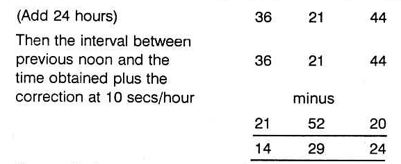

Find out the position of the Moon at 2:27 am on 19-2-1945. The Moon at 2:27 am on 19-2-1945 will be 23° 30' in Taurus.

Similarly, if one works for the time on 19-2-1945 when Asc. 24° 26' Sagittarius rises, it will be found that the sidereal time would be 12 hours 22 minutes 50 seconds. And the time of birth will be 14 hours 30 minutes 30 seconds added to previous noon, i.e. 2:28:05 am on 19-2-1945.

Calculate the position of the Moon for this time 2 hours 28 minutes 5 seconds am 19-2-1945. It is 23° 36' 1" in Taurus. Therefore the Lagna at the time of birth for one born at 5:30 pm is arrived at as 23° 30' Taurus and for the other born at 6 pm it is found to be 23° 36' 1", as the position of the Moon at the time of Epoch is the position of Lagna at the time of birth, if the Moon at birth was waxing.

Will this method of rectification be useful? According to Krishnamurti Padhdhati and the simplest method of multiplying the number of Vigatis from sunrise to the time of birth by 4, dividing the product by 9 and counting the star from Aswini trine will give the exact Vigati. This method gives confidence, convinces one and proves to be correct.

In Brihat Jataka, written by Varaha Mihira in Chapter 26, there are 17 stanzas to cast the horoscope of a person whose time of epoch (impregnation) and also the time of birth is not known. He gives the method to erect a horoscope from the time of query. From this, one can understand that the time of birth and the urge to work out and erect the horoscope of a native from the moment of query has a direct bearing. They are inter-linked. There can be no second opinion.

Therefore one is to follow the following method:

1. Note the lord of the day when the query is answered;
2. Note the star at that time, i.e. the lord of the constellation in which the Moon transits;
3. Find the lord of the sign in which the Moon is;
4. Who is the lord of the Lagna.

These planets will be the same who govern the sign in which the Lagna is, the constellation in it, the sub and the sub sub.

## Examples

1. A person wanted to know whether his Lagna is Taurus last degree or Gemini first degree, so that he may know whether Venus or Mercury is the lord of the Lagna. This person visited at 9-5 A.M. on 27-4-1966. The Lagna at the time of query was Gemini owned by Mercury. The day is Wednesday governed by Mercury. Moon is in Punarvasu star ruled by Jupiter. It is in its own sign and is aspected by Mars. Hence Mercury, Jupiter, Moon and Mars are the ruling planets at the time of query.  
The doubt is whether it is Venus sign, Mars star, Saturn sub i.e. between 27° 53' 20" and 30° Taurus or between 0° and 1° 53' 20" which is jointly ruled by Mercury lord of the sign. Mars is the lord of the constellation and Mercury lord of the sub. The ruling planets at the time of query having nothing to do with Venus and Saturn. But Mercury and Mars agree. Then what about Jupiter and Moon. As Jupiter is in Lagna at the time of query, take as Jupiter sub sub. Calculate the time when sub sub of Jupiter will rise on the day of the birth of the native. That is the time of his birth. His Lagna is Gemini and its lord is Mercury. Venus is not the lord. No other rule can categorically eliminate one and correctly give the true Lagna. Is not this method convincing? 32 of my students who are very intelligent tried to put this method to test. They tested on their horoscopes and their children which they know. They are convinced and this is published for the readers to use this method and be benefited.  
2. Another person on 3-5-66 asked whether he is born in Scorpio or Sagittarius. The day is Tuesday ruled by Mars, Moon in Virgo owned by Mercury, the constellation is Chitra governed by Mars; Moon is aspected by Saturn, Mercury and Venus. The doubt is whether the lord of the sign is Jupiter or Mars. Actually the birth will be at Mars sign, Scorpio, Mercury star Jyeshta Saturn sub between 27° 53' 20" and 30° Scorpio. It cannot be Sagittarius as the time of query has nothing to do with Jupiter.
Next after finding out the sub, one is to calculate when that sign, constellation and sub will rise in the East on the day of birth and when it will be over. In the first case, Gemini sign rose in the East 5 Ghatis 16 Vigatis after sunrise i.e. 316 Vigatis after sunrise. Multiply 316 by 4 and divide by 9. 4 is the remainder. Count from Aswini trine. His star in which Moon transited at the time of birth should be, according to this calculation Rohini or Hastham or Sravanam. But his star is Jyeshta. The remainder should be 9. Then you add or deduct one, one Vigati from the time of birth. The nearest one shows the actual Vigati of birth. If you add one to 316, multiply by 4 and divide by 9, balance is 8; if you add one more, balance is 3. If you add one more and do the process remainder is 7 and so deduct one from 316. You get 315. Multiply by 4. The product is 1260. Divide by 9. It goes 140 times which may be taken as 139 times and the remainder is 9 when you count from Aswini trine, it agrees. Therefore, declare that his time of birth was 315 Vigatis after sunrise on that day to that locality.  
The above method alone can clearly fix the position of Lagna, give the correct time of birth and convince the consultant.  
(An Astrologer has to pray: gain the Divine Grace: develop intuition: but treat this science scientifically: God never fails to guide. He gives the tip to correctly eliminate the incorrect one and select the right one accurately).  
3. Another example to decide time of birth:
 
Note down the time of analysis, It is 7-35 A.M. on 7-4-66. Find out the ruling planets. Since the chart is taken only to find out whether it is correct or not, the ruling planets at the time of analysis should have ruled the birth time also. In other words, the analysis is to find out the birth time only. Hence when the birth occurred, the planets ruling should also rule the moment of analysing the horoscope also; otherwise the horoscope is wrong.

By ruling planets, it is meant as follows:

1. The lord of the day.
2. Lord of the star in which Moon transits.
3. Lord of the sign (Rasi) in which Moon transits.
4. Lord of the lagna sign or the sign in which the Ascendant transits.
5. The lord of the star rising in the east i.e. the star, in which the Ascendant transits.

On 7-4-66 at 7.35 a.m., the ruling planets are as below:

1. Jupiter - Lord of the day Thursday
2. Rahu - Lord of the star Swathi.
3. Venus - Lord of Libra-Thulam (Rasi) in which Moon was transiting.
4. Mars - Lord of the lagna Aries-Mesha.
5. Venus - Lord of the star Bharani rising in the east at 7.35 a.m.

Rahu, unaspected by any planet, represents lord of the sign Taurus - Rishaba in which it is posited. Lord of Taurus - Rishaba is Venus. Rahu represents Sun, since it is in the constellation Karthik ruled by Sun on 7-4-66. Hence, Sun, Mars, Jupiter and Venus should have ruled native's time of birth. The native was born on Sunday ruled by Sun.

At 4-26 a.m. on 9-11-1942 (birth day) exact time, the lagna was Libra-Thulam. Star rising was Chitrai. The sign Libra-Thulam is ruled by Venus. The constellation rising is ruled by Mars. Moon was transiting in Visakam star ruled by Jupiter at the time of birth. Hence at 4-26 A.M. exact time on 9-11-1942 the ruling Planets were Sun, Mars, Jupiter and Venus.

If the birth were to be at 3-26 a.m. (exact time) lagna would have been in Virgo-Kanni ruled by Mercury, the star rising in the east would have been Hastham ruled by Moon. Since Mercury and Moon do not rule the moment of analysis, the native could not have been born at 3-26 a.m. exact time.

Let us find out whether 5-26 a.m. exact time corresponding to clock time of 6-26 A.M. might have been the birth time. At 5-26 A.M. (exact) the star rising was Swathi ruled by Rahu in the sign Libra-Thulam ruled by Venus. Since Rahu and Venus rule the present moment this could have been the birth time.

Now how to select? Was it 4-26 a.m. or 5-26 a.m. (both) time exact time, when the birth took place?

1. Find out the lord of the lagna at the moment of analysis. This should have been the sub sub lord rising in the east at the time of birth.
2. At 4-26 a.m. on 9-11-1942 find out lord of star rising, lord of the sub rising and lord of the sub sub rising. Lord of the sub sub should be Mars (lord of lagna at the moment of analysis) if 4-26 a.m. exact time were to be correct.
3. At 5-26 a.m. on 9-11-1942 (exact time) sub sub lord of the star rising in east was not Mars. Hence the native should have been born at 4-26 a.m. on 9-11-1942 corresponding to the clock time 5-26 A.M. since the clock showed one hour in advance of actual of exact time.

# Hora and Its Use

The ecliptic is the apparent pathway of the Sun in the heavens. The planets and the other luminary, the Moon, follow their own individual tracks which lie along the ecliptic, north and south of it. This width on either side is about 7°12' and hence the pathway of the planets is around 15° in width, having the ecliptic in its centre. This is called the Zodiac.

If one observes, it will appear that the whole Zodiac goes round the earth once a day, i.e., once in 24 hours and the same portion of the Zodiac rises in the east in 23 hours 56 minutes and a few seconds.

As the Zodiac is divided into 12 equal parts called Solar mansions (signs or rasis) (Mesha-Aries to Meena-Pisces), each division will be appearing in the east, roughly for a duration of 2 hours. In other words, the previous sign will appear to rise up in the heavens and the next sign will commence to rise nearly two hours after the previous sign began to rise. Hence the 12 signs rise in the east, roughly at an interval of 2 hours.

The Hindu astrologers have subdivided each sign into two halves and called such a division as a Hora. Hence roughly one hour is needed for each Hora to rise in the east or pass through the Meridian. But the Hindu astrologers, in olden days, did not calculate the time in hours and minutes. They used to measure in Ghatis and Vigatis or Naligai and Vinadi. Hence a day is of 60 Ghatis. Hence each sign is approximately 5 Ghatis and half a sign or a Hora will be about 2¼ Ghatis.

Pharos in Chaldean star lord says: In remote and ancient Chaldean, the knowledge of the stars and the framing of the Zodiac were the results of the divinely inspired gifts to the wise men. The books of Genesis, the Mosaic Era, the Babylonian and Hindu Empires were non-existent when the Chaldean sages laid down the axiom that ‘Astral spheres exert continual influence on terrestrial life.’ Chaldeans followed the Hora and found out the influence of the planets over the affairs of the people. Also, it was said that certain hours are advantageous for certain matters and certain hours are unfortunate for some affairs. This method of prediction is called ‘Hora’.

The ‘Hindus’ also were aware that certain matters thrive in some hours (i.e. 2¼ Ghatis periods) and some fail in certain hours (2¼ Ghatis periods).

Both the Hindus and the Chaldeans do not follow the same calculations to find out which planet rules a particular time though the order of the planets is the same.
First, let us know something about the days and then about the hour or otherwise called ‘Hora’. The names of the days are derived from both the luminaries and the other five planets, e.g.

1. Sunday — Tamil (Nyayiru) Telugu (Adhivaram) others — Bhanu varam, Ravi varam etc. in India. Planet in English (Sun), Tamil- Suryan, Sanskrit-Ravi, German-Sonnag (Sonne), Dutch Zondag (Zon).
2. Monday — Thingal, Somavaram, etc. in India. English (Moon). German Montag (Mond), French Lundi (Lune), Italian Lunedi (Luna), Dutch Maandag (Maan) etc.
3. Tuesday — Sevvai-Mangalvar etc. English (Mars), French Mardi (Mars), Italian Martedi (Mars).
4. Wednesday — Bhuda; English (Mercury), Italian Mercoledi (Mercury), French Mercredi.
5. Thursday - Guru, Brihaspathi, Viyazhan, English (Jupiter), Italian Glovedi (Jove), Dutch (Donderdag), German (Thor).
6. Friday - Sukra, Brigu, Velli; English (Venus), Italian Venerdi (Venus), French Vendredi (Venus).
7. Saturday — Sani, Mandha, English (Saturn), Dutch Zaterdag (Saturn).

The results signified by the planets do predominate in the above order. Hence the names of these days are arrived at according to the effects agreeing with the particular planet. Probably, the same effects repeat once in 7 days and hence only seven days in the week are fixed; e.g., on Sunday some matters flourish; on Monday some other affairs thrive and after 7 days the same matters have advantage on Sundays, Mondays, etc.

As regards the Hora division, the Hindus do not take the time of sunrise for their calculations. They follow strictly according to the time mentioned below. 

From the table it may be observed that the planets rule the hours in an order which is the alternate days in the reverse order, Suppose Sun rules a particular hour. Then note in the reverse order, the days of the week. The alternate one is Friday ruled by Venus. Hence Venus rules the hour, after that of the sun. Similarly, Thursday is before Friday and Wednesday is the alternate one in the reverse order to Friday. Wednesday is ruled by Mercury. Hence Mercury rules the hour after Venus. Thus the order of the hours is worked out.

It will be a pleasant surprise to note that after 24 hrs. that planet which rules between 6 and 7 A.M. is the same planet which governs the day. Therefore, irrespective of sunrise, the locality and the part of the year in which one wants to find the planet ruling a particular time, simply refer to the above table.

But Westerners and Chaldeans calculate in a different manner. They divide the interval between the time of sunrise and noon into 6 equal parts and each will be little more or less than an hour depending upon the interval between sunrise and noon. Similarly the interval between moon and sunset is divided into 6 equal parts. Likewise, the time from sunset to midnight and from midnight to sunrise is worked out. But the order of the planet ruling the first hour (a little more or less according to this calculation) is ruled by the lord of the day. The other hours are ruled by the other planets in the same order as is followed by the Hindus. Only the duration of each planetary hour division varies. (Readers are also expected to note that the Hindus adopt this hora division in an arbitrary manner and it has no connection with the rising of the sun Hora or Moon Hora in the East. Kala Hora or planetary hours are different from Hora division of a solar sign.)

Then, the doubt arises whether the hours mentioned are the standard time or the local meantime. What is an astrological day? It is the interval between the sun-rise on a day at a particular locality to the next succeeding sunrise. As a planetary hours commence from the time of sunrise which varies according to the Latitude and Longitude of the place, one is to take the timings in the local meantime.

As we to take that each planet rules exactly one hour or are we to find out the interval between sun-rise and noon and divide it by 6, likewise noon to sunset, sunset to mid night and midnight to sun-rise? So, a research was necessary to ascertain which is to be followed. The Modern Astrological Research Institute has found that ine second method is correct and the one hour systematic division needs modification.

The sun rises in the northern latitudes, according to the season, any time between 4.30 a.m. and 7.30 a.m. If one is to consider that a day commences from sunrise and the first hour is governed by the lord of the day, then one is to follow the Chaldeans and should not follow the table published in almanacs etc., which is also reproduced in this article to learn and unlearn. Therefore, planetary hours will be exactly one hour, throughout the world only on two days in a year, i.e., when Sun passes the vernal and autumnal equinoxes on or around 22nd March and 23rd September. On other days, the duration of each planetary hour varies.

When one calculates the interval between sunrise and noon, divides by six and takes the first portion as the hora of the Lord of the day, it does not matter whether it is Local Mean Time or Standard Time. It is preferable to follow Standard Time, as the clocks are set to Indian Standard Time.

Further division of the day will be the division of the Hora. To trace the exact time when the various events in the planetary hours governed by different planets occur, it is necessary to know not only the main division day and night called Hora hours or planetary hours but also the subdivision of the planetary hours of different duration. Suppose one wants to note the time when Saturn will rule its hour on Wednesday, so that one can avoid (a) to sign an agreement in that period or (b) to fix the marriage during that time or (c) to meet a person to negotiate any transaction etc. Adopt the following principle:

1. What is the Indian Standard Time of sun-rise in that locality on that day? Let it be 5-10 A.M.
2. What is the Indian Standard Time at noon in that locality on that day? Let it be 11-59 A.M.
3. Therefore, the difference between sun-rise and noon will be 6 hrs. 49 min.
4. Divide this by 7. Then you get 1 hour 7 min. for each division.
5. The day selected is a Wednesday. Hence from sunrise 5-10 a.m. to 6.17 a.m. Mercury rules the time. The next is governed by Moon. Hence 6-17 a.m. to 7-24 a.m. is ruled by Moon. The next belongs to Saturn; i.e. Saturn is the lord for the duration from 7-24 a.m. to 8-31 A.M. Therefore this period is governed by Saturn on a Wednesday ruled by Mercury. Therefore this conjoined period of Saturn and Mercury are to be avoided for such actions as mentioned above.

When this conjoined period operates in the night and one spends his pleasant time with his wife, he can avoid birth of children. This is an effective method of ‘Birth Control’ as both Saturn and Mercury are effeminate planets. But people, planting fruit bearing trees in such conjoined planetary hours, will have very poor yield; the loss will be not only due to locust, pest, rats, etc., but also due to the scarcity of water-supply and fertiliser. Hence for every action, one is to note which planet will contribute for peace, prosperity, success, etc., and which planets are detrimental. Accordingly one can make a selection and enjoy the fruits.
Now the question arises, whether one can come out successful by selecting such periods, even though he runs a very bad period according to dasa or according to progression. People, running bad time (a) will never follow this, or (b) even if he tries to follow he will do in the evil sub-division of the planetary hour.

What is the sub-division? The planetary hour is sub-divided among the 7 planets (just as, a dasa is divided among 9 planets as Bhuktis and each Bhukti is again subdivided among the same 9 planets called antharams). The first subdivision belongs to the planet which rules the hour and then the subdivisions are governed by the other planets in the same order. Suppose the hora hour is ruled by Venus, then the first subdivisions belong to Venus and the other 6 subdivisions will be governed by Mercury, Moon, Saturn, Jupiter, Mars and Sun.

What is the use of this sub-division?

1. Just as on a Wednesday, the hora of Saturn is to be avoided for some actions and transactions, so also, in the few minutes of the conjoined periods of Saturn sub-division in the Mercury hora and Mercury sub-division in Saturn’s hora are to be avoided.
2. If a person enjoys Jupiter Dasa, Moon Bhukti, he can undertake to do any important work during the Hora of Jupiter and sub of Moon.
3. If Mars Dasa, Jupiter Bhukti operate to one, and if the judge announces the judgment favourable to one, then the time at which he passes it, will be during Mars hora, Jupiter sub or Jupiter hora Mars sub or Mars day (Tuesday) and Jupiter Hora or Jupiter day (Thursday) and Mars Hora. In the latter case the sub will be ruled by either of the two or any other significator contributing to his success.
4. If one wants to construct a building, he prefers the conjoined Hora of Mercury and Mars.
5. One desiring to get married, will select the conjoined Planetary Hour of Venus and Jupiter.

The above is general. Further while selecting a Hora, the most important factor is omitted. Which is a serious mistake, i.e. (a) one does not take into consideration which part of the Zodiac rises in the East and what the Lagna is (b) nor does one consider the position of planet at the time and their relative position to the ascendant, to the cusp or that house which signifies the particular matter and to the Karaka planet which also rules the same matter. Indeed, these three are the important investigations to be made while electing a Muhurtha.

But for common undertakings and the usual daily business, Hora will be helpful to offer confidence, peace of mind and mostly success.

## Sun Hora

Sun is the lord of Sunday. The Hora of Sun will be most potent whenever Sun is strong: i.e. whenever Sun transits in its exalted or own sign and in its constellation, Karthikai, Uthram, Uthradam.

Sun governs vitality, immunity and speedy recovery from disease. Hence, to take medicine or to undergo surgical operations, the solar hour is auspicious.

As Sun indicates power, authority, influence, dignity, honour and reputation, either to take charge of the following posts or to meet such people for assistance, select Sun Hora:

1. Father, Government officials, President (Sun, Mars and Jupiter combination);
2. Vice-President (Sun, Mercury and Mars);
3. Governor (Sun, Mercury and Jupiter);
4. Mayors, Judges (Sun, Jupiter and Venus);
5. Physicians (Sun, Mercury and Jupiter);
6. Surgeons (Sun, Mercury and Mars), etc.

Sun Hora is beneficial for signing contracts (Sun, Mercury and Jupiter); to commit forgery or to undertake Hand-writing, Thumb impression expert post (Sun, Mercury and Saturn); to register documents, to approach for favour, to execute a will, to let on lease, to appeal for promotion, to complain to the Police about the lost property, to have mantras initiated and to concentrate, to enter into politics, etc., to purchase rice, cardamom, pepper, chilly, almond, groundnut, coconut, aromatic herbs trees with thorns, orange coloured articles, etc.

One can commence praying to Suryanarayana Lord Vishnu and also give gold to make jewels, etc. For vaccination, inoculation etc., prefer this hour. Also, people who are governed by Sun or who have Sun as their ruling planet may pray to God for peace and prosperity during Sun's Hora.

## Moon Hora

Moon is the lord of Monday. The Hora of Moon will be very predominating on:

1. Monday
2. Rohini star day
3. Whenever Moon transits in its own sign, exalted sign and in Hastham and Sravanam star days.

Also it is advantageous to note whether Moon occupies the Kendra position counted from the ascendant during the Hora of Moon, when it is strong.

Approach people during Moon Hora. Even the strong-willed persons will yield. If you have to carry out the orders of a lady and if she is a strict, straightforward lady who may be moody also, arrange an interview during Moon Hora. The hard paraffin will become the soft paraffin.

If you are an agriculturist, all wet land cultivation, plantation, digging wells, excavating canals may be done in these hours. Moon Hora on Friday is good for harvesting sugarcane.

If you deal in milk and milk products, dairy farm etc., Moon Hora on Sundays, Tuesdays and Thursdays are auspicious to sell boiling milk. Fridays are auspicious to deal in genuine milk. On Mondays for adulterated milk, Saturdays for ice cream, etc.

Those who deal in resins, greens, food materials, gur, and those who do business in oils, kerosene, petrol, acids, etc., can start business during Moon Hora. Moon Hora on a Monday and Rohini star day is ideal especially during Gothooli Lagna.

Pearls, jewels, ornaments, corals, salt, fish etc., can be purchased in this Hora. Suppose you buy a marshy land, knowingly or unknowingly during Moon Hora, you will have much appreciation of capital value.

Moon, the fastest moving planet, suggests that Moon Hora is advantageous for safe and successful overseas journey. Divers should select Moon Hora, but the Lagna should not be afflicted by Saturn, if they want fortune.

Musicians select Moon Hora, on Mondays or Fridays for fertile imagination and melodious tune. Tuesdays are beneficial for those who use drum, Mridangam Thabla, etc. On Wednesdays Moon Hora is favourable for Jalatharangam. If Neptune is in 5" from Lagna, during Moon Hora and if it is in a sign of long ascension, learn Veena. If it is of short ascension, take to Fiddle. If Moon is in an airy sign and it is of long ascension, start Nagaswaram; if the ascendant is of short ascension prefer flute. Thus, analyse and judge.

Moon Hora is preferable for those who get appointment as midwife, nurse, etc. Also it is good to take up service in the Defence Department. You can plan, contemplate and scheme during Moon Hora when the merits and demerits will dawn in your mind and you cannot decide on an impulse or rashly. Moon Hora in the night is good. What for, need not be elaborated.

For public activities and popularity, for platform speeches etc. Moon Hora is good, especially Thursday. If your mother is rich or your maternal relatives, discuss during Moon Hora, you will become their favourite and you will have gains without pains.

On Wednesdays during Moon Hora, you can take appointment in the Textile Department and you may put on new dress. Hotels may be opened on Tuesdays during Moon Hora. So also for drinks.

During Moon Hora, pray to Goddess Gouri and Lalitha for peace.

## Mars Hora

Mars rules over Tuesdays. It governs Aries-Mesha and Scorpio-Vrischika. It is the lord of the star Mrigasirisha, Chitra and Dhanishta. It gets exalted in Capricorn-Makara. Hence the Hora of Mars will be most potent whenever Mars is strong by transiting in its own or exalted signs or in its stars and on Tuesdays. 

Suppose on a Tuesday, when Mars is in 23° 20’ to 24°-6'-40” in Capricorn in exaltation, in its own star and own sub it is in its most potent position, especially when it happens to be the 10th house to the Lagna rising then during Mars Hora.

It is auspicious for the Commander-in-Chief to prepare for war. It is good to file any suit in a court of law. It is advantageous to argue during Mars Hora and win the case. On a Thursday, during Mars Hora try for compromise and fair settlement; purchase lands, start a brick kiln. On Saturdays commence trench or tunnel work. (Trench means, you excavate the earth vertically down whereas Tunnel is horizontal earth rather rock, removal mostly for railways, Saturn and Mars indicate Trench and Tunnel).

If you want to use manure, Mars Hora on a Monday is auspicious. To purchase surgical instruments. Sunday-Mars Hora or the day of the lord of 12 and Mars Hora. To join duty in the Military, Police or Factory, Mars Hora on Tuesday is advantageous it is lucky to start a press, mechanical engineering, industry, building, construction, or open electronics shop on a Wednesday in Mars Hora. To join duty in a court of law or take oath as a President, Judge etc., Thursday is propitious.

Goldsmiths, jewellers, may have opening ceremony on Thursdays, Fridays are also good. Mars Hora on a Thursday is beneficial for executive officers of temples or industry or church or colleges and schools and those who say that they relinquish the world and start preaching to others whether they practise or not. But those who want to practise, but are not very anxious to reach other can have it on a Saturday. On Friday, Mars Hora gives vitality and satisfies the partner. It is good for union, for jewellery, for animal husbandry, for leather and hides, for coffee, tea boarding, lodging, cinema theatre, games, luxury goods, automobile, bullock carts, jutkas, agriculture, timber, furniture etc., to learn telegraphy: to deal in telephone accessories. To open a mill or factory prefer Wednesday. To prepare arms, spears, instruments, dagger to excavate, to construct a slaughter house, lethal chamber, to have lead or copper industry, to deal in hides, skins, shoes, etc., Saturdays are fortunate.

Those who buy land during Mars Hora, and sign the document in the morning, say, between 6-30 A.M. and 7-30 A.M. having Sun in the 12th Bhava will not enjoy the benefit of the appreciation of land value, as the Government will acquire the land. But those who sign and purchase the property between 8 and 10 A.M. having Sun in the 11th house supposing that Sun rises at 6 A.M. will have the full advantage of the high price.

You can buy coral, ruby and red coloured articles. Best time to construct a house would be at a time when Mars is exalted; when Mars Hora is on and the ascendant is Scorpio and the degree in Scorpio is between 0° 33’ to 1° 20’ which will be Vishaka 4th pada governed by Jupiter and the sub is Mars. In that case there will be no difficulty for the availability of money, building materials etc. There will be the Blessing of Providence.

For peace and prosperity pray Lord Subramanya or Muruga or Narasimha or Kali or Ganesh. For Subramanya — Begin on Sunday or Tuesday especially when you serve in a military department. On Mondays, start Kali; Badrakali. On Tuesdays-Ganesh or Muruga-Veerabhadran; on Wednesdays-Narasimha; On Thursdays-Dhakshinamurthi, Raja Rajeswari; On Fridays-Veera Lakshmi and Lakshmi Narasimha. On Saturdays-Venkatesa, Venkatachalapathy, Iyyappan.

## Mercury Hora

Budha (Mercury) is the lord of Wednesday. Mercury Hora is very strong and powerful on Wednesdays during the time when Mithuna or Gemini or Kanni-Virgo, rises in the East and on Ashlesha, Jyeshta and Revathi star days especially Revathi.

1. Admit boys and girls in schools and colleges on a Mercury day during Mercury Hora. Even the dull witted will come out in rank.
2. One can start memorising from poetry, important stanzas, etc. Prefer Mercury Hora to deliver a speech especially on Thursdays. So also, accept the post of a teacher or professor.
3. Accountants, auditors, mathematicians can select Thursdays and Mercury Hora. Painters, drawing masters, artists and dancers can commence on Fridays in Mercury Hora. Editors, publishers, book-sellers, printers, press owners, publicity organisations can start functioning on Tuesdays in Mercury Hora — most efficient work will be done if one commences during Mercury Hora.
4. Daily newspapers, almanacs, ephemeris, ambassadors, agents, representatives, brokers, auctioneers can begin on Wednesdays in Mercury Hora.
5. Typists should prefer Tuesdays, and shorthand writers should select Saturdays.
6. Treat neurasthenic patients and those who suffer from Vitamin B deficiency during Mercury Hora.
7. Those who commit forgery or fraud, do it during Saturdays, Mercury Hora or Wednesdays Saturn Hora.
8. Those who take service in the Postal department, Telegraph and Telephone Offices, overseas communication, Engineering, correspondence, etc. or purchase lottery tickets, bonds, securities, shares, or prize bonds etc., must do so on Wednesdays in Mercury Hora or on the day of the lord and Mercury Hora.
9. If you desire to float a company or to underwrite, Mercury Hora is the best.
10. For those who deal in paper, stationery, oil seeds, jute, wheat, quick-silver, emerald, green stone, onions, green gram, watches, telescopes and microscopes, Mercury Hora is very advantageous.
11. If you proceed overseas as an ambassador or as a representative or for foreign studies or for foreign collaboration, prefer Wednesdays or Thursdays and never miss Mercury Hora.
12. Important documents can be drafted during Mercury Hora with advantage.
13. Pray to Lord Vishnu, Rama, Krishna, Anjaneya, etc.
14. Try to concentrate. Vacillation is the only defect.

## Jupiter Hora

It is otherwise called Guru, Viyazhan, Brahaspathi, etc. It rules over Thursday. The Hora or Jupiter will be very predominating on:

1. Thursdays
2. When Moon transits in Poorvapathrapada 4th quarter
3. When Moon transits in Cancer (exalted sign of Jupiter) and in Sagittarius and Pisces (owned by Jupiter)
4. When Moon transits in Punarvasu, Visakha and Poorvapathrapada stars.

Approach people during Jupiter Hora. Do you want overdraft facilities from a bank? Meet the proper authorities during Jupiter Hora. Is Jupiter a benefic to you? Are you running Jupiter's period? Then, never miss to meet the ministers or high officials in the Government during Jupiter Hora. Success in your attempts is certain. Have you the desire to study Veda, Astrology, Philosophy, Religion, Law, Economics, Banking etc.? Purchase books and begin to read on a Thursday, preferably on Jupiter's star day and in Jupiter Hora.

Do you deal in Gold and Silver? Is your income not satisfactory? Are you depressed? Open a branch on a Thursday in Jupiter Hora when Jupiter is in direct motion and is strong. You must have decent increase in income. Always make it a point to meet commercial tax and Income-tax officials during Jupiter Hora. The interview will be pleasant, peaceful and profitable.

If you are ill and if a physician offers any specific medicine to be taken internally, prefer this Hora. Even to buy a tonic, to take ayurvedic medicine, Jupiter Hora on a Tuesday is advantageous. Establishment of Stri Sadhana office for the prevention of prostitution, animal husbandry, construction of temples and charitable institutions, colleges, mutts, libraries, banks, etc., in Jupiter's Hora will prove to be advantageous.

This Hora is very essential to purchase vehicles especially on Fridays during Jupiter Hora, or refrigerators on Saturdays during Jupiter Hora or lay foundation for houses on Fridays during this hour or take up minister's post on Sundays or Tuesdays in this hora or borrow money on Thursdays or invest on shipping or Petrol Shares on Mondays or take up a job in the educational department or air travel on Wednesdays, etc.

Depending on the God or Goddess on its day, during Jupiter Hora, have the initiation of mantras. Note down Jupiter's hora in the night hours. Be friendly with your partner in life, wife or husband. Even if you had no chance to have a child so far, Jupiter will not let you down. It will fulfil your desire by giving you a child. If you have already many, avoid this hour.

Open bank account, take up the junior auditor's post or accept the profession signified by Jupiter during its Hora. Take up Insurance policy on Saturdays during Jupiter Hora. Your endowment policy will mature and you can enjoy the benefit. But if the insurance agents were to obtain the signature of a person, in a Life Policy during the conjoined period of Saturn and Mars, the Insurance company will lose heavily, whereas it will be a fortune to the members of the family who outlive the person who has signed his policy during Mars Hora on a Saturday or Saturn Hora on a Tuesday.

The Government has to choose Jupiter Hora if they lay foundation for hospitals (on Sundays), Shipping (on Mondays); Buildings for Police, Military Magistrate-Court, Law Courts, Industry etc. (on Tuesdays); for educational Institution, Postal Departments, Communication, All India Radio, Textiles Engineering, etc. (on Wednesdays); for Law College or legal department, Temples, Churches, charitable institutions, Banks, Treasury, Revenue department, International Trade, etc. (on Thursdays); Animal Husbandry, Food department, Agriculture, Tea Board, Coffee Board, Prohibition department, Gold Decontrol etc. (on Fridays); Insurance Corporation, Labour department, mines and minerals, control department, Intelligence Dept. Retrenchment, famine, refugee, quarters for servants, slaughter house, etc. (on Saturdays). Such a beginning promises:

1. No delay and difficulty in completing the project
2. Expansion and improvement
3. Co-operation from the public and their wholehearted support
4. Fulfilment of the desire of the Government and benefit to the subjects.

## Venus Hora

It is otherwise called Sukra, Birgu, Velli, etc. It governs Friday.

The Hora of Venus is very strong for Venusian matters:

1. On Fridays
2. On the days when Moon transits in Bharani, Poorvapalguni and Poorvashada constellations
3. When Moon transits in Taurus or Libra or Pisces which is its exalted sign

If on a Friday, during Venus Hora, when Moon transits in its own star, one commences to do any of the matters signified by Venus, knowingly or unknowingly, success is sure. Peace and prosperity are promised. Harmony and happiness can be had.

Prefer Venus Hora if you want to meet an officer who is generally impatient, who is a hard task-master and who is moody. You will find that he is calm and co-operating. Even a militant type of person, arrogant, foolhardy and rash will give a patient hearing and will be helpful. The temper gets softened during this hour. A cobra may be ferocious due to Mars. But if it takes its food, which is shown by Venus, it is harmless. The fiery nature of Mars will be toned down by Venus.

If you have to look at the girl or at the boy before fixing up your marriage, you select Venus Hora if you want to select this partner, but if you do not like the alliance you select Mars or Satum Hora when the negotiation will fall through and you can be happy. Venus Hora promises harmony and happiness.

If you feel that you are exhausted and you have lost much of your vitality, take medicine, especially Ayurvedic (especially from Sadhana Ayurveda ashramam at Calcutta) on Thursday or Friday during Venus Hora: it will rejuvenate you.

Write love letters during Venus Hora: You start writing after this hour starts and finish it before this hour is over. Even though you may not normally have command of language to give expression to your love, during Venus Hora, appropriate words will be used by you which will appeal to the partner. If you receive a reply during other Horas, do not be impatient. Wait till Venus Hora starts. Then open the sealed cover and read. You will be very happy.

Now you may ask, “She had already written and posted the letter. How can the Hora change the contents of the letter”? The answer is this. Knowingly or unknowingly you can open the letter at any Hora. According to the Hora, you will find the letter. If it is Saturn Hora, then the partner would have mentioned the inability to meet you and she will fix up some other time. If it is Mars Hora, the tone of the letter will upset you. So, why should you take a chance? Venus Hora will arrange for tea, dinner, cinema, music party, meeting in an unfrequented place, etc.

Those who would desire to cultivate love, must prefer Venus Hora. Buy jewels, silk sarees, costly dress, diamond and costly gems, sandalwood, glass, powder, scented oils and scents, eyelash, lipstick etc., during Venus Hora. It will add beauty by moderate use.

Buy a scooter or car or any vehicle during Venus Hora, preferably on a Friday. Start agricultural operations or open the industry to manufacture agricultural implements for tilling, ploughing, etc., especially on a Tuesday. If you desire to have a poultry farm, cattle breeding or possessing race horses, etc., prefer Venus Hora. Contractors to supply spare parts, etc., to Railway, shipping, airport, etc., have to sign the agreement during Venus Hora on a Wednesday and those who would like to have honey-moon, have to commence their journey during Venus Hora.

During Venus Hora, have the initiation of Manthras on Goddess, especially Goddess of Wealth, Lakshmi. On Sunday during Venus Hora, you can worship Chaya Devi; on Monday, Parvathi; on Tuesday Lalitha; Raja Rajeswari, Kali; on Wednesday, Lakshminarasimha; on Thursday, Dhana Lakshmi; on Friday Sowbagya or Dhanyalakshmi; On Saturday, Alamelumangai thayar, etc.

Those who start milk dairy should have it during Venus Hora on a Monday. For rice business, Venus Hora on a Tuesday. For story writing, love letters, pleasant journey, shipping clearance agency, agency for Textiles, Rayons, silk, perfumery, toilet, pharmaceutical products, cotton, fancy articles, hosiery for woman, biscuits, chocolates, confectioner, fruits, flowers, vegetables, etc., on Wednesday during Venus Hora.

Lay foundation for women and children Hospital, animal husbandry, accountant-General’s office, Income-tax office, Law court, etc. during Venus Hora on Thursdays. Or join duty in such departments on those days and hours.

Music Colleges, Cinema Theatres, Studios, Photographic Studios, Railway, Air Travel, Shipping, Stri Sadhana Hostels for ladies, Schools and Colleges for girls may, with advantage, be started during Venus Hora on Fridays.

Vigilance Home, Famine Shed, refugee Campus, Slaughter house, leather, skin and hides departments on Saturdays during Venus Hora.

## Saturn Hora

Saturn is otherwise called Neelan, Mandhan, Sani, or Yama. The Hora of Saturn is strong for the matters signified by Saturn:

1. On Saturdays
2. On the days when the Moon transits in Saturn's signs Capricorn and Aquarius
3. When the Moon transits in Pushya, Anuradha, or Uthrapadra stars
4. When the Lagna at that hour is in Saturn's sign or star

If you want to handle a violent person, prefer the hour of Saturn. You can practice yoga or meditate during Saturn Hora so that you will be able to concentrate. Write letters to Saturnians, Yogis, sages, mine-owners, landowners, etc. in this hour. Sow the seed-bulbs, potato, tapioca, groundnut, or sesame in this Hora. If you want to sever connection with anybody, this hour will help you. For illegal intimacy, this is the best hour. Start petrol, oil, coal, skin, leather, and hide business in Saturn Hora. Lay the foundation for such business then.

If you find it impossible to lead your life with your wife, do not tell her your programme but disappear during Saturn Hora. If you tell her, she will come to the secluded place selected by you and continue to give trouble. Pray for Lord Venkateswars or Lyappa during Saturn Hora. Prefer this Hora to become a Sanyadi.

# Dictionary for astrological terms

