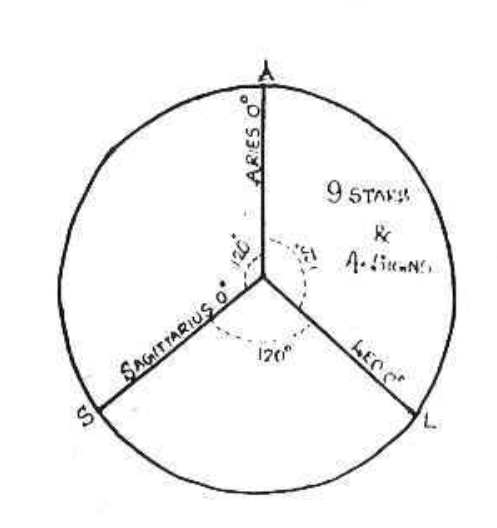
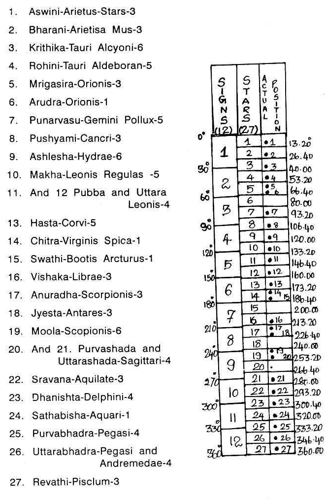
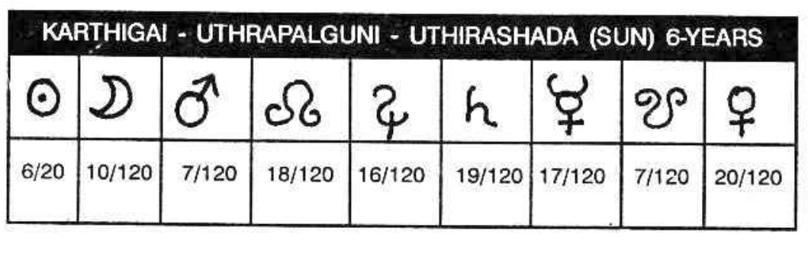
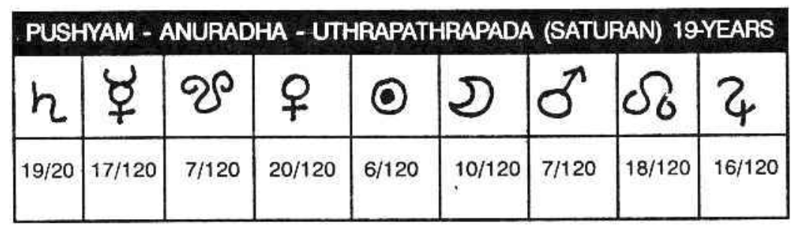
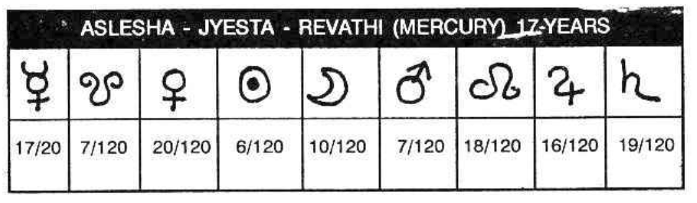

## KRISHNAMURTI SYSTEM

DIVISION OF ZODIAC :  
The Zodiac is divided into twelve equal parts; each division is called a Solar mansion (or Rasi or Sign). They are:

* Aries
* Taurus
* Gemini
* Cancer
* Leo
* Virgo
* Libra
* Scorpio
* Sagittarius
* Capricorn
* Aquarius
* Pisces

The Hindus have another division also. The Zodiac is divided into twenty seven equal parts, each measuring 13°-20’. They commence from Aries 0° and end by Pisces 30°. The 27 divisions are called Lunar Mansions (Nakshatras, Asterisms, Stars Constellations). They are called Ashwini, Bharani, Krithigai, Rohini, Mrigasira, Arudra, Punarvasu, Pushyami, Aslesha, Makha, Pubba, Uttara, Hasta, Chitta, Swati, Visakha, Anuradha, Jyestha, Moola, Poorvashada, Uttarashada, Sravana, Dhanishta, Satabhisha, Poorvabhadrapada, Uthrapathrapada and Revathi.

The explanation that can be offered why they have taken 9 planets and divided the Zodiac into 27 Nakshatras is as follows: The Zodiac is 360° in Longitude. What is the sanctity in the number 360? Probably, Sun moves in between the stars, in its path the Ecliptic - daily on a average about 1/360° of the circle. So, every day in 24 hours Sun moves 1°. Further, 360 is divisible by 1, 2, 3, 4, 5, 6, 8, 9 and 10 when it will be easy for other calculations. It is first divided into 3 equal parts of 120° each. The four signs Aries, Taurus, Gemini and Cancer make up 120° in the segment AEL. The next four signs Leo, Virgo, Libra and Scorpio form 120° and they are in the segment LES; Sagittarius, Capricorn, Aquarius and Pisces are the last 4 signs in the segment SEA measuring 120° (A is Aries 0°, S is Sagittarius 0° and E is earth).

All planets moving from the point A (Vernal Equinox) Aries (Mesha) according to Nirayana System get their results modified as they move in the Zodiac.
* In the first 13°-20’ i.e. 0 degree to 13°-20', and planet transiting in Mesha (Aries) will be influenced by Kethu, and the constellation is called Ashwini. 
* Then when it passes on, between 13°-20' and 26°-40', Venus influences it; this area is called Bharani. 
* Between 26°-40' and 30° of Aries and 0° Taurus to 10° Taurus, the planets results will be modified by Sun. Karthigai is the name of the star, or constellation which is called as Zone. 
* Then from 10° Taurus to 23°-20’ Moon modifies the results of the planet occupying this Zone or Lunar Mansion called Rohini. 
* Between 23°-20’ in Taurus and 30° Taurus as well as 0° Gemini to 6°-40’ in Gemini, the mansion called Mrigasirisha is ruled by Mars and the planet in this Zone will be under the control of Mars.

The next 13°-20’ called Arudhra is governed by Rahu; next Punarvasu is ruled by Jupiter (Guru). It is followed by Pushya and Ashlesha governed by Saturn and Mercury respectively. Similarly, from Simha 0° (Leo) up to the end of Scorpio, the four signs are divided into 9 lunar mansions (called Nakshatras, Stars or Constellations). They are:

- Makam
- Poorvapalguni
- Uthrarpalguni
- Hastham
- Chithrai
- Swathi
- Visakam
- Anuradha
- Jyesta 

which are ruled by the planets in the same order, viz. Kethu, Venus, Sun, Moon, Mars (Sewvai, Mangal, Angaraka, Kuja) Rahu, Jupiter (Guru), Saturn (Sani) and Mercury (Budha). The remaining 1/3 of a Zodiac SA contains the 4 signs Sagittarius, Capricorn, Aquarius and Pisces and the nine constellations in it are:

- Moolam
- Poorvashada
- Uthrashada
- Sravana
- Dhanishta
- Sathabisha
- Poorvapathrapada
- Uthrapathrapada
- Revathi

The planets Kethu, Venus, Sun, Moon, Mars, Rahu, Jupiter, Saturn and Mercury rule the stars in the same order.

Planets between 0° and 13°-20' in Aries (Aswini), 0° and 13°-20' in Leo (Makam), and 0° and 13°-20' in Sagittarius (Moolam) are under the sway of Kethu. Planets between 13°-20' in Aries to 26°-40' (Bharani), 13°-20' in Leo to 26°-40' (Poorvapalguni), and 13°-20' to 26°-40' in Sagittarius (Poorvashada) are ruled by Venus. Planets transiting in these zones are under the influence of Venus and the results of Venus will be offered by the planet transiting in this zone. Thus, each planet governs three zones in the Zodiac.

If a planet were to be in Aswini, another in Makam and the third in Moolam, all are under the influence of Kethu and are in Kethu’s zone. If the astrologer says that a planet is modified by the lord of the constellation, Kethu, then the statement is not complete and clear. He has to add whether it is in Aries, or Leo, or Sagittarius, otherwise one cannot locate the position of the planet correctly.

Suppose a father has three sons: Brahma, Vishnu and Sive. Presume that each son has nine children and every son gives the same order of names: Rama, Baratha, Lakshmana, Sathrugna, Dharmaputhra, Bhima, Arjuna, Nakula and Sahadeva. The first issue of all three are called "Rama", the second issue each of is called "Bharatha" and so on, and the last issue each of them will be "Sahareva".

If a postman has to deliver letter with the address Rama atune, how can he exactly fix up which Rama it refers? The moment he calls out Rama, three Ramas will respond. Instead, suppose all the 27 children are given different names, like Aswini, Bharani etc., how easy it is to identify.

Similarly, instead of calling each lunar mansion as Keth (Aswini), Kethu 2 (Makam), Kethu 3 (Moolam), Venus 1 (Bharani), Venus 2 (Pooram), Venus 3 (Pooradam), and so on, or as Kethu in Mesha-Aries, Kethu in Simha-Leo, Kethu in Dhanus (Sagittarius) and so on; the ancients gave different names to all the 27 stars (27 zones of 13°-20') commencing from Aswini and ending Revathi.

They were aware that the stars are not equally elongated from 0° to 13°-20' and then another from 13°-20' to 26°-40'. The Zodiac does not give the appearance of a circular wheel made of a cane with 27 rings in it. But the Zodiac is an imaginary pathway in the heavens, 360° in length and 15° in width, with stars scattered all over, in and outside the Zodiac, and these stars appear as dots and not rods. The constellations selected by our sages are either a group of stars or any single bright star so that they can be first identified easily. 

A few of them are in the Zodiac itself but the majority of the groups are around the constellations which are named after these groups. These stars (constellations) may be very close to the 27 divisions of the Zodiac or far away, and they may be either to the North or to the South of the Zodiac. A few groups are very near and in the next constellation and yet they are chosen because they can be identified easily and they will be useful for reference and calculation to locate where a particular constellation would commence and end in the Heavens; further, there is no other constellation within or near the zone which can be unmistakably identified. Therefore, these 27 stars are to guide us, so that we can calculate and ascertain the position of the 27 zones in the Zodiac, each measuring 13°-20’.

These 27 constellations are governed by the nine planets. Hence, each planet rules over three zones at an interval of 120° (e.g. Kethu - Aswini, Makam, Moolam; Venus - Bharani, Pooram, Pooradam, etc.). These zones modify the results of the planets transitting the Zodiac and not the stars, scattered in the Heavens which are far, far away. Planets are the immediate neighbours of our Mother Earth and these belong to one family. 

Probably this is the reason why they have selected only 27 groups of stars even though there are numberless stars in the sky which can influence the earth as much as these 27 groups. Suppose: 

- there is a light in the centre of a circular room provided with 12 glass panes of different colours 
- around the room there is a verandah and outside it, there are 27 glass panes of which the colour 1, 10 and 19 is the same; 2, 11 and 20 differ from 1, 10, 19 but these three are of the same colour; 3, 12 and 21 differ from others but these three of the same colour as they belong to one group. Similarly, all the 27 panes are of nine different colours.

If a person walks outside the circular verandah looking at the light inside, they will find the colour of the light changing according to the colour of the coloured panes. Similarly, the results of the planets are modified by the lord of the sign and indicated by the lord of the Nakshathra or constellation. If a planet is compared to a torch light, then the influence of the sign - Solar Mansion occupied by it and the influence of the Zones of 13°.20’ called stars, change the colour of the light.

Suppose a railway guard shows the light, it may be plain or green or red according to the background mirror. Similarly, imagine that the mirror used behind the bulb is the lord of the sign. It may be clear and it may illuminate to a maximum or it may be dull, rendering the light weak. The strength and modification of the colour depends on the mirror behind the bulb (which is the reflector) which denotes whether a planet is exalted and strong or debilitated and weak.

Also suppose one coloured slide is inserted between the torch light and the observer. This colour depends on the lord of the constellation "C" when 'P' is the planet (which is the bulb). Therefore, the results of a planet in different positions in the Zodiac, in different signs and different constellations, is similar to the light from the torch getting modified and the resultant becoming absolutely different from the original light, unless all the colours are similar to that of the planet.

In my research, I found that one should not be satisfied with the modification of the lord of the constellation alone. But one has to find out further subdivisions, which should be scientific, so that one can explain the differences between twin births. So I have divided each star in a manner which will be explained shortly. 

Suppose, we do not subdivide, then we offer prediction taking into consideration the situation of a planet in a particular sign and star. It will be similar to saying that a particular dasa of a person will be brilliant. The dasa lord may be Venus. It will run for 20 years. Even though, in general, these 20 years might have proved to be beneficial, yet there would have been occasions when he could have had difficulties, trials and tribulations also, but these difficulties when compared to the beneficial results, may not be much. It may be similar to a person being foretold that he would gain in a race on a particular day. No doubt he may lose in the first race, lose in the second, gain in the third, again lose in the fourth and gain in the last few races. When we calculate, we may find that he had gained on that particular day. But consider his anxiety whenever he lost, especially in the first two races. It is similar to taking a planet, the sign and the star in which it was and passing judgment. 

But according to the “Krishnamurti System” it will be possible to say that he will gain at a particular time and also conclude that it is a day of profit. This method of forecast is not merely advantageous, but correct and convincing as well.

Suppose a person is told that during Venus Dasa, he will be fortunate. No doubt during Venus Dasa, Venus Bhukthi he gets married. Venus Dasa Sun Bhukthi he starts business; Venus Dasa, Moon Bhukthi he goes Overseas; Venus Dasa, Mars Bhukthi he has a son; Venus Dasa Jupiter Bhukthi there is expansion in the business and he has another child. During Venus Dasa, Saturn Bhukthi there is some labour trouble and minor losses. In Venus Dasa, Mercury Bhukthi he opens branches, takes up agencies and during Venus Dasa, Kethu Bhukthi he visits various pilgrim centres. On the whole, no doubt, the person gets married, starts business, goes overseas, expands business and stabilizes it.

Also, one would not forget that he had lost a member of the family, had labour trouble, suffered some loss and had worries for some time. If a person is informed that in these 20 years, Venus will cause Rajayoga it will not help him much. But indeed, it would be useful only when he is informed both; the time of event and also the nature of event, both good and bad. So, the dasa of 20 years is subdivided into subperiods otherwise called bhukthis.

On the same analogy, it has been established that the division of a constellation is necessary if correct results are to be forecast. Suppose a person is informed that he will have very good business and profit on a particular day; he feels depressed till 2 PM, as there was no business till then and in these hours he loses his faith in astrology. But the planets so adjust that a few marriage parties enter his shop and make purchases from him for an amount much greater than what he had been normally collecting daily. If the same astrologer could tell him that only between 2 and 4 PM on that day he would do excellent business, it would have been advantageous for both. So, the subdivision of the constellations is an imperative necessity to predict exact time of event. 

Again, as a result of intensive research, it has been possible to find out why a person receiving a few letters on a day in a particular moment, feels very happy when he goes through the contents of a letter, then feels dejected and depressed when he reads the other, gets irritated when he goes through the third and so on. It was found that the Ascendant and the cusp of the houses move faster than the planets and it is the Ascendant and the cusp of the houses which explain such rapid changes, though the relative position among planets and their occupation of the star and sub remain the same.

The ascendant can move in a sign for about two hours, but in a constellation, it can only be for about fifty to fifty-eight minutes. However, certain events may happen within an interval of ten or fifteen minutes. Therefore, there should be some other minute factor which brings about varying results in a very short time. It was found that the ascendant in that constellation (star) showed that he would receive letters. But to indicate which moment he would read a pleasant letter, which moment he would read a letter which would irritate him, and so on, further divisions of the constellation were necessary. This method was found to be convincing and scientific.

Let us take another example. Suppose we judge the results according to the transit of the planets. It is generally stated that Saturn while transiting the eleventh house will produce most desirable results.

Saturn will be passing through the 11th house, roughly for a period of two and a half years. Saturn signifies certain matters to the person according to their chart and only those matters will be expected by them. It is not uncommon that for a long time after the entry of Saturn into the 11th house, the person continues to suffer and is not able to reconcile. Some actually suffer all the time whereas they enjoy when Saturn transits in the 12th sign. When Saturn is in 11, what one will actually enjoy or experience depends on the lord of the constellation and the lord of the sub, according to the Krishnamurti System, and this would explain why the general rule fails.

I would like to say emphatically that all persons having Saturn in 11 cannot expect favourable results because the ascendant may be different and the lords of the constellations in the 11th house may be ruling evil houses to that lagna-born. Thereby the person will experience difficulties through the source indicated by Saturn (the transiting planet). 

But, according to my technique, when Saturn is passing in a constellation, throughout that period, he neither enjoys nor suffer uniformly but during certain periods he finds beneficial results compensating for the difficulties. The method which I advocate will prove to be very correct and it can never fail; because, I take the subdivision of the constellation. The constellation indicates the matters signified by its lord; the planet transiting influences such results denoted by the lord of the star through the source denoted by the transitting planet (by nature, lordship and occupation) and it is the sub-lord which decides whether the result is favourable or unfavourable. 

The lord of the constellation is similar to the lord of a dasa of the Vimshothari system, whereas the sub is the lord of the subperiod or Bhukthi. So, I have evolved a method to divide the constellation based upon the sound principle of astrology, which will appeal to one and all.

- In Aswini, the first sub is allotted to Kethu, the second to Venus, the third to Sun, the fourth to Moon and so on until the last sub is given to Mercury. Aswini is ruled by Kethu, so the first sub is allotted to Kethu.

Suppose the Moon enters a particular constellation, say Bharani (the second star of the 27 stars), the longitude of which extends from 13°-20' to 26°-40' of Aries (Mesha) and a child is born at that moment. What do we say? Is it not that the child is to run Venus dasa and it will have 20 years of Venus dasa left over at the time of the birth? The child is having Venus dasa, Venus Bhukthi at the time of the birth. 

If the Moon moves a little further, say 1° (i.e. 14°-20" in Aries - Mesha), we say that the child has a balance of 18 years 6 months and also that the child will have Venus dasa, Venus Bhukthi at the time of birth. But, when the Moon has moved 20/120 of Bharani and a child is born then, we say that the child has a balance of 16 years 8 months and that the child is having Venus dasa, Sun Bhukthi just starting. If the Moon further moves by 16/120 of the star, we say the child will be having Venus dasa, Mars Bhukthi. 

The Moon moves further by 7/120 of Bharani. So, Mars sub is also over; Rahu sub-starts. Let it go on. When it completes 18/120 of this star, Rahu sub is over and Jupiter starts. Thus it will be seen that the Moon is influenced by the exact position which it occupies in the constellation.

Therefore, the Moon in the beginning is under the sway of Venus and the sub of Sun. Next it passed in the same constellation belonging to Venus but to the sub of Moon. It is followed by the sub of Mars, then by Rahu, Jupiter, Saturn, Mercury, and lastly by Kethu. So according to Krishnamurti System each constellation is subdivided into 9 parts. They are not equal in the longitude but the longitude of each sub is in the proportion in which they are allotted the total number of years in Vimshothari dasa system.

The longitude of each constellation is 13°- 20’ equal to 800 minutes. Therefore, in every constellation of 800 minutes each planet will have an area equal to the number of years allotted to each in the dasa multiplied by 6²/³, minutes (800/120). Therefore, Sun's sub extends to 40 minutes (6x6²/³), whatever be the constellation. Mars and Kethu extend for 46²/³, minutes (7x6²/³). Moon extends for 1°- 6-40", Saturn 2°-6'-40”, Rahu extends for exactly 2°. Jupiter has an area of 1°-46'40", Mercury 1°-53’-40”, Venus 2°-13'-20”.

Eventhough the area allotted to each planet is the same in each star, yet the order in which they occupy the constellation differs. To note the order, one has to find out which planet rules the constellation, then the beginning of the constellation is used by the lord of the star, just like in any dasa, the first sub period or bhukti is ruled by the dasa lord. The second sub is ruled by the Bhukti lord who will follow the dasa lord. Then in the same cycle order the subs will be ruled as in the bhukthi. 

If the star is Karthika, note the lord of the star. It is Sun. Hence, allot the first sub to Sun. In the cyclic order, who will follow Sun? It is Moon. So the second sub is given to Moon, the third to Mars, the fourth to Rahu and so on, till the last sub is governed by Sukra.

If the star is Punarpoosam, otherwise called Punarvasu, the first subdivision is governed by Jupiter; next by Saturn and the last by Rahu.

If the star is Pushya, the lord is Saturn. Therefore, the first sub is governed by Saturn, the second sub is ruled by Mercury, the third is allotted to Kethu and so on till the last sub is under the sway of Jupiter. 

If the star is Ashlesha, otherwise called Ayilyam, the first subdivision is governed by Mercury, the next by Kethu and so on, till the last subdivision is allotted to Saturn. Thus all the twenty seven stars are divided among the nine planets. 

It may appear as though the whole Zodiac is divided into 27 multiplied by 9 parts. Actually, the lord of the sign, the lord of the star and the lord of the sub will be 249 instead of 243, due to the change in the sign lord (lord of the sign), as certain subs are found in two adjacent signs. 

Furthermore, one can sub-divide and record the results. This is for research students.

A few stars are called by different terms. They are:
- Krithik - Karthikai
- Mrigasira — Mrigashirisha 
- Arudhra — Thiruvadhirai
- Punarvasu — Punarpusam 
- Poorvapalguni — Pooram — Pubba
- Uthrapalguni — Uthram 
- Anuradha — Anusham 
- Jyeshta - Kettai 
- Poorvashada — Pooradam 
- Uthrashada - Uthradam 
- Sravana - Thiruvonam 
- Dhanista — Avittam 
- Sathabisha - Sathayam 
- Poorvapathra — Poorattadhi 
- Uthrapathra — Uthrattadhi 

The other 11 stars are called by the same name.