# About the Author
The author of this book, (Late) Professor K.S. Krishnamurti, was born on 1st November 1908 at Thiruvaiyaru in Tanjore District, Tamilnadu. After his successful schooling, he graduated from St. Joseph College, Trichy in 1937. He moved to Chennai in 1941 and joined the Government Service as a Sanitary Inspector. During this period, he developed an interest in occult science and studied in depth the available literatures on Indian and Western Astro-Science. He observed that the predictive principles enunciated in those books were very general, ambiguous, and full of alternatives, and even if properly applied, never pinpointed precisely the nature and time of the event in question. This prompted him to vow to find a solution to make Astrology a perfect science, revive its fair name and reputation, and restore its importance and utility to mankind.

He started collecting numerous horoscopes including twin births for study and analysis. He spent more than thirteen years in research work and finally succeeded in discovering a unique formula of his own, which could be applied universally to Natal/Annual/Horary horoscopes to predict events very accurately. He verified his new found ‘Stellar’ and ‘Sub’ theory for its accuracy by applying it on various horoscopes including twins and got fully convinced himself. He titled his discovery as ‘Krishnamurti Padhdhati’.

In 1951, he was fortunate to receive an idol of 'Lord Uchishta Mahaganapathi' from His Holiness Sankaracharya of Kamakoti, Kanchi Mutt. Inspired by the blessings of Jagadguru and divine graces of Uchishta Mahaganapathi, he started vigorously to transmit the fruits of his research and knowledge to all, unmindful of criticisms about his theory voiced by a few. To fulfill his aspirations, he took voluntary retirement from service in 1961 and undertook long journeys to all parts of India and propagated his findings. He delivered lectures daily for two weeks at the North Indian Cities, Junar, Poona, Kirkee, Kolhapur, Sholapur, and Ahmednagar, in response to wishes of number of Astrologers there.

Finding his method scientific, convincing, clear, and very correct, more and more people approached him for Astrological counselling and they were flabbergasted by his quick, accurate, and uncanny predictions. To make further development and research on his system, Sri K.S.K. established the "Modern Stellar Astrological Research Institute" at Madras. In 1963, he started publishing a monthly magazine, "Astrology and Athrishta" to spread his system not only in India but also in many countries of East and West.

Convinced by his scientific explanations and uncanny predictions, Kulapati K.M. Munshi, Chancellor of Bharatiya Vidya Bhavan, appointed Sri.K.S. Krishnamurti as visiting professor of Astrology in India, to deliver lectures regularly at Delhi, Bombay, and Madras and occasionally in other kendras. They also honoured him by conferring the title ‘Jyothish Marthand’ with a gold medal, through Dr. P.V. Cherian, the then Governor of Bombay. In June 1970, he visited Kuala Lumpur on being invited by ‘The Malayan Astrological Society’ which conferred on him the title “Sothida Mannan’ with a gold medal. He stayed there for about six weeks and delivered lectures at various places. He visited Sri Lanka in November 1970, to fulfill the wishes of the people there.

Sri K.S. Krishnamurti had written and released six books styled “Krishnamurti Padhdhati Readers’ (including 'Horary Astrology’ and “Gocharapala Nirnayam') in which he explained exhaustively his principles and methods of predicting any event very accurately. In spite of his eminence, he was very simple in his thought and living.

After passing away of 'Guruji' (as Prof.K.S.K. was then called with reverence) in March 1972, his son Sri K. Subramaniam, who was groomed by his father, took over the editorship of ‘Astrology and Athrishta. He successfully ran the magazine until 1994, after which it was converted to a yearly publication instead of a monthly one. Further, with a view to propagate the K.P. System effectively, he established his own Publication company, Krishman & Co, at Chennai, through which he published not only Prof. K.S.K's readers periodically but also many books written by himself and by other eminent present day K.P. Astrologers.

# KRISHNAMURTI SYSTEM

DIVISION OF ZODIAC :  
The Zodiac is divided into twelve equal parts; each division is called a Solar mansion (or Rasi or Sign). They are:

* Aries
* Taurus
* Gemini
* Cancer
* Leo
* Virgo
* Libra
* Scorpio
* Sagittarius
* Capricorn
* Aquarius
* Pisces

The Hindus have another division also. The Zodiac is divided into twenty seven equal parts, each measuring 13°-20’. They commence from Aries 0° and end by Pisces 30°. The 27 divisions are called Lunar Mansions (Nakshatras, Asterisms, Stars Constellations). They are called Ashwini, Bharani, Krithigai, Rohini, Mrigasira, Arudra, Punarvasu, Pushyami, Aslesha, Makha, Pubba, Uttara, Hasta, Chitta, Swati, Visakha, Anuradha, Jyestha, Moola, Poorvashada, Uttarashada, Sravana, Dhanishta, Satabhisha, Poorvabhadrapada, Uthrapathrapada and Revathi.

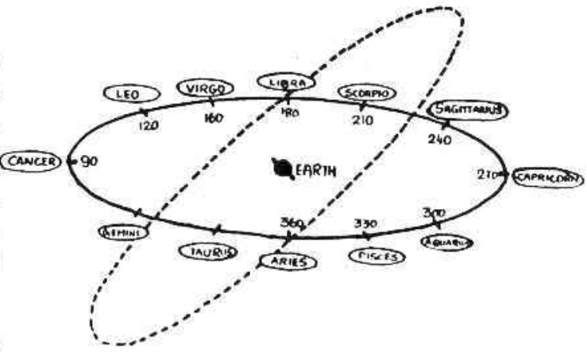

The explanation that can be offered why they have taken 9 planets and divided the Zodiac into 27 Nakshatras is as follows: The Zodiac is 360° in Longitude. What is the sanctity in the number 360? Probably, Sun moves in between the stars, in its path the Ecliptic - daily on a average about 1/360° of the circle. So, every day in 24 hours Sun moves 1°. Further, 360 is divisible by 1, 2, 3, 4, 5, 6, 8, 9 and 10 when it will be easy for other calculations. It is first divided into 3 equal parts of 120° each. The four signs Aries, Taurus, Gemini and Cancer make up 120° in the segment AEL. The next four signs Leo, Virgo, Libra and Scorpio form 120° and they are in the segment LES; Sagittarius, Capricorn, Aquarius and Pisces are the last 4 signs in the segment SEA measuring 120° (A is Aries 0°, S is Sagittarius 0° and E is earth).

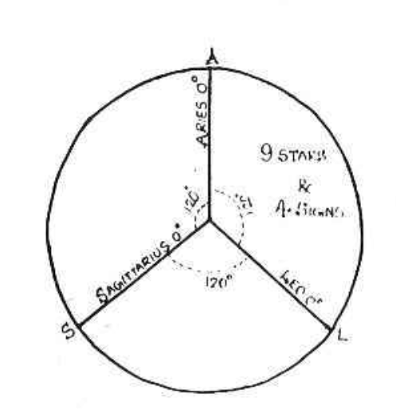

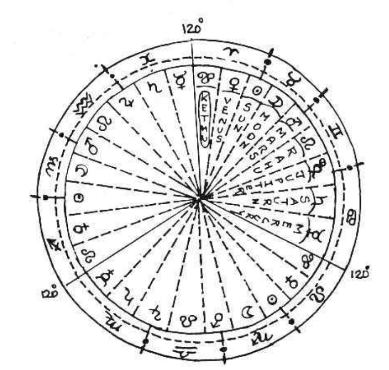

All planets moving from the point A (Vernal Equinox) Aries (Mesha) according to Nirayana System get their results modified as they move in the Zodiac.
* In the first 13°-20’ i.e. 0 degree to 13°-20', and planet transiting in Mesha (Aries) will be influenced by Kethu, and the constellation is called Ashwini. 
* Then when it passes on, between 13°-20' and 26°-40', Venus influences it; this area is called Bharani. 
* Between 26°-40' and 30° of Aries and 0° Taurus to 10° Taurus, the planets results will be modified by Sun. Karthigai is the name of the star, or constellation which is called as Zone. 
* Then from 10° Taurus to 23°-20’ Moon modifies the results of the planet occupying this Zone or Lunar Mansion called Rohini. 
* Between 23°-20’ in Taurus and 30° Taurus as well as 0° Gemini to 6°-40’ in Gemini, the mansion called Mrigasirisha is ruled by Mars and the planet in this Zone will be under the control of Mars.

The next 13°-20’ called Arudhra is governed by Rahu; next Punarvasu is ruled by Jupiter (Guru). It is followed by Pushya and Ashlesha governed by Saturn and Mercury respectively. Similarly, from Simha 0° (Leo) up to the end of Scorpio, the four signs are divided into 9 lunar mansions (called Nakshatras, Stars or Constellations). They are:

- Makam
- Poorvapalguni
- Uthrarpalguni
- Hastham
- Chithrai
- Swathi
- Visakam
- Anuradha
- Jyesta 

which are ruled by the planets in the same order, viz. Kethu, Venus, Sun, Moon, Mars (Sewvai, Mangal, Angaraka, Kuja) Rahu, Jupiter (Guru), Saturn (Sani) and Mercury (Budha). The remaining 1/3 of a Zodiac SA contains the 4 signs Sagittarius, Capricorn, Aquarius and Pisces and the nine constellations in it are:

- Moolam
- Poorvashada
- Uthrashada
- Sravana
- Dhanishta
- Sathabisha
- Poorvapathrapada
- Uthrapathrapada
- Revathi

The planets Kethu, Venus, Sun, Moon, Mars, Rahu, Jupiter, Saturn and Mercury rule the stars in the same order.

Planets between 0° and 13°-20' in Aries (Aswini), 0° and 13°-20' in Leo (Makam), and 0° and 13°-20' in Sagittarius (Moolam) are under the sway of Kethu. Planets between 13°-20' in Aries to 26°-40' (Bharani), 13°-20' in Leo to 26°-40' (Poorvapalguni), and 13°-20' to 26°-40' in Sagittarius (Poorvashada) are ruled by Venus. Planets transiting in these zones are under the influence of Venus and the results of Venus will be offered by the planet transiting in this zone. Thus, each planet governs three zones in the Zodiac.

If a planet were to be in Aswini, another in Makam and the third in Moolam, all are under the influence of Kethu and are in Kethu’s zone. If the astrologer says that a planet is modified by the lord of the constellation, Kethu, then the statement is not complete and clear. He has to add whether it is in Aries, or Leo, or Sagittarius, otherwise one cannot locate the position of the planet correctly.

Suppose a father has three sons: Brahma, Vishnu and Sive. Presume that each son has nine children and every son gives the same order of names: Rama, Baratha, Lakshmana, Sathrugna, Dharmaputhra, Bhima, Arjuna, Nakula and Sahadeva. The first issue of all three are called "Rama", the second issue each of is called "Bharatha" and so on, and the last issue each of them will be "Sahareva".

If a postman has to deliver letter with the address Rama atune, how can he exactly fix up which Rama it refers? The moment he calls out Rama, three Ramas will respond. Instead, suppose all the 27 children are given different names, like Aswini, Bharani etc., how easy it is to identify.

Similarly, instead of calling each lunar mansion as Keth (Aswini), Kethu 2 (Makam), Kethu 3 (Moolam), Venus 1 (Bharani), Venus 2 (Pooram), Venus 3 (Pooradam), and so on, or as Kethu in Mesha-Aries, Kethu in Simha-Leo, Kethu in Dhanus (Sagittarius) and so on; the ancients gave different names to all the 27 stars (27 zones of 13°-20') commencing from Aswini and ending Revathi.

They were aware that the stars are not equally elongated from 0° to 13°-20' and then another from 13°-20' to 26°-40'. The Zodiac does not give the appearance of a circular wheel made of a cane with 27 rings in it. But the Zodiac is an imaginary pathway in the heavens, 360° in length and 15° in width, with stars scattered all over, in and outside the Zodiac, and these stars appear as dots and not rods. The constellations selected by our sages are either a group of stars or any single bright star so that they can be first identified easily. 

A few of them are in the Zodiac itself but the majority of the groups are around the constellations which are named after these groups. These stars (constellations) may be very close to the 27 divisions of the Zodiac or far away, and they may be either to the North or to the South of the Zodiac. A few groups are very near and in the next constellation and yet they are chosen because they can be identified easily and they will be useful for reference and calculation to locate where a particular constellation would commence and end in the Heavens; further, there is no other constellation within or near the zone which can be unmistakably identified. Therefore, these 27 stars are to guide us, so that we can calculate and ascertain the position of the 27 zones in the Zodiac, each measuring 13°-20’.

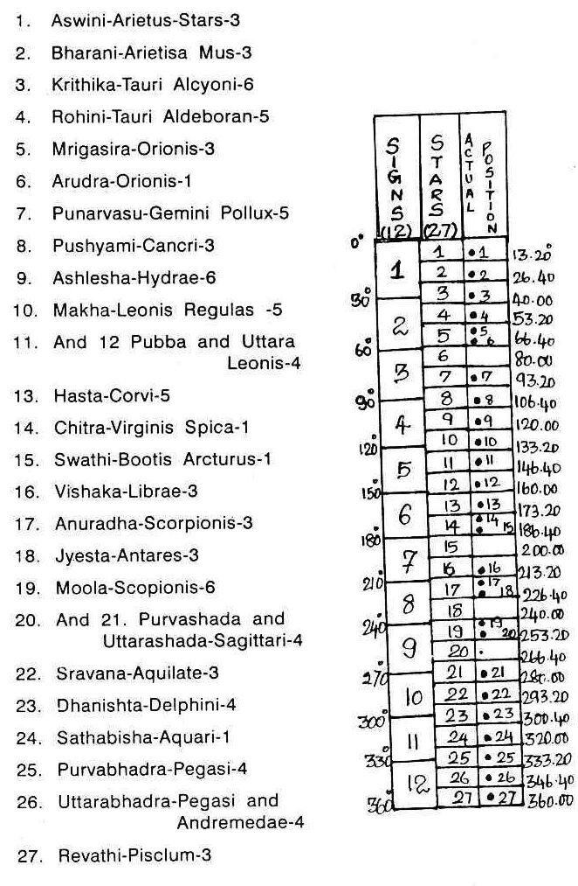

These 27 constellations are governed by the nine planets. Hence, each planet rules over three zones at an interval of 120° (e.g. Kethu - Aswini, Makam, Moolam; Venus - Bharani, Pooram, Pooradam, etc.). These zones modify the results of the planets transitting the Zodiac and not the stars, scattered in the Heavens which are far, far away. Planets are the immediate neighbours of our Mother Earth and these belong to one family. 

Probably this is the reason why they have selected only 27 groups of stars even though there are numberless stars in the sky which can influence the earth as much as these 27 groups. Suppose: 

- there is a light in the centre of a circular room provided with 12 glass panes of different colours 
- around the room there is a verandah and outside it, there are 27 glass panes of which the colour 1, 10 and 19 is the same; 2, 11 and 20 differ from 1, 10, 19 but these three are of the same colour; 3, 12 and 21 differ from others but these three of the same colour as they belong to one group. Similarly, all the 27 panes are of nine different colours.

If a person walks outside the circular verandah looking at the light inside, they will find the colour of the light changing according to the colour of the coloured panes. Similarly, the results of the planets are modified by the lord of the sign and indicated by the lord of the Nakshathra or constellation. If a planet is compared to a torch light, then the influence of the sign - Solar Mansion occupied by it and the influence of the Zones of 13°.20’ called stars, change the colour of the light.

Suppose a railway guard shows the light, it may be plain or green or red according to the background mirror. Similarly, imagine that the mirror used behind the bulb is the lord of the sign. It may be clear and it may illuminate to a maximum or it may be dull, rendering the light weak. The strength and modification of the colour depends on the mirror behind the bulb (which is the reflector) which denotes whether a planet is exalted and strong or debilitated and weak.

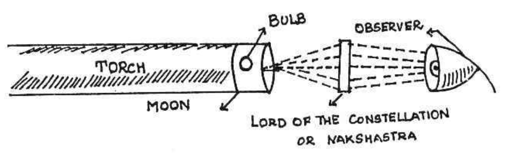

Also suppose one coloured slide is inserted between the torch light and the observer. This colour depends on the lord of the constellation "C" when 'P' is the planet (which is the bulb). Therefore, the results of a planet in different positions in the Zodiac, in different signs and different constellations, is similar to the light from the torch getting modified and the resultant becoming absolutely different from the original light, unless all the colours are similar to that of the planet.

In my research, I found that one should not be satisfied with the modification of the lord of the constellation alone. But one has to find out further subdivisions, which should be scientific, so that one can explain the differences between twin births. So I have divided each star in a manner which will be explained shortly. 

Suppose, we do not subdivide, then we offer prediction taking into consideration the situation of a planet in a particular sign and star. It will be similar to saying that a particular dasa of a person will be brilliant. The dasa lord may be Venus. It will run for 20 years. Even though, in general, these 20 years might have proved to be beneficial, yet there would have been occasions when he could have had difficulties, trials and tribulations also, but these difficulties when compared to the beneficial results, may not be much. It may be similar to a person being foretold that he would gain in a race on a particular day. No doubt he may lose in the first race, lose in the second, gain in the third, again lose in the fourth and gain in the last few races. When we calculate, we may find that he had gained on that particular day. But consider his anxiety whenever he lost, especially in the first two races. It is similar to taking a planet, the sign and the star in which it was and passing judgment. 

But according to the “Krishnamurti System” it will be possible to say that he will gain at a particular time and also conclude that it is a day of profit. This method of forecast is not merely advantageous, but correct and convincing as well.

Suppose a person is told that during Venus Dasa, he will be fortunate. No doubt during Venus Dasa, Venus Bhukthi he gets married. Venus Dasa Sun Bhukthi he starts business; Venus Dasa, Moon Bhukthi he goes Overseas; Venus Dasa, Mars Bhukthi he has a son; Venus Dasa Jupiter Bhukthi there is expansion in the business and he has another child. During Venus Dasa, Saturn Bhukthi there is some labour trouble and minor losses. In Venus Dasa, Mercury Bhukthi he opens branches, takes up agencies and during Venus Dasa, Kethu Bhukthi he visits various pilgrim centres. On the whole, no doubt, the person gets married, starts business, goes overseas, expands business and stabilizes it.

Also, one would not forget that he had lost a member of the family, had labour trouble, suffered some loss and had worries for some time. If a person is informed that in these 20 years, Venus will cause Rajayoga it will not help him much. But indeed, it would be useful only when he is informed both; the time of event and also the nature of event, both good and bad. So, the dasa of 20 years is subdivided into subperiods otherwise called bhukthis.

On the same analogy, it has been established that the division of a constellation is necessary if correct results are to be forecast. Suppose a person is informed that he will have very good business and profit on a particular day; he feels depressed till 2 PM, as there was no business till then and in these hours he loses his faith in astrology. But the planets so adjust that a few marriage parties enter his shop and make purchases from him for an amount much greater than what he had been normally collecting daily. If the same astrologer could tell him that only between 2 and 4 PM on that day he would do excellent business, it would have been advantageous for both. So, the subdivision of the constellations is an imperative necessity to predict exact time of event. 

Again, as a result of intensive research, it has been possible to find out why a person receiving a few letters on a day in a particular moment, feels very happy when he goes through the contents of a letter, then feels dejected and depressed when he reads the other, gets irritated when he goes through the third and so on. It was found that the Ascendant and the cusp of the houses move faster than the planets and it is the Ascendant and the cusp of the houses which explain such rapid changes, though the relative position among planets and their occupation of the star and sub remain the same.

The ascendant can move in a sign for about two hours, but in a constellation, it can only be for about fifty to fifty-eight minutes. However, certain events may happen within an interval of ten or fifteen minutes. Therefore, there should be some other minute factor which brings about varying results in a very short time. It was found that the ascendant in that constellation (star) showed that he would receive letters. But to indicate which moment he would read a pleasant letter, which moment he would read a letter which would irritate him, and so on, further divisions of the constellation were necessary. This method was found to be convincing and scientific.

Let us take another example. Suppose we judge the results according to the transit of the planets. It is generally stated that Saturn while transiting the eleventh house will produce most desirable results.

Saturn will be passing through the 11th house, roughly for a period of two and a half years. Saturn signifies certain matters to the person according to their chart and only those matters will be expected by them. It is not uncommon that for a long time after the entry of Saturn into the 11th house, the person continues to suffer and is not able to reconcile. Some actually suffer all the time whereas they enjoy when Saturn transits in the 12th sign. When Saturn is in 11, what one will actually enjoy or experience depends on the lord of the constellation and the lord of the sub, according to the Krishnamurti System, and this would explain why the general rule fails.

I would like to say emphatically that all persons having Saturn in 11 cannot expect favourable results because the ascendant may be different and the lords of the constellations in the 11th house may be ruling evil houses to that lagna-born. Thereby the person will experience difficulties through the source indicated by Saturn (the transiting planet). 

But, according to my technique, when Saturn is passing in a constellation, throughout that period, he neither enjoys nor suffer uniformly but during certain periods he finds beneficial results compensating for the difficulties. The method which I advocate will prove to be very correct and it can never fail; because, I take the subdivision of the constellation. The constellation indicates the matters signified by its lord; the planet transiting influences such results denoted by the lord of the star through the source denoted by the transitting planet (by nature, lordship and occupation) and it is the sub-lord which decides whether the result is favourable or unfavourable. 

The lord of the constellation is similar to the lord of a dasa of the Vimshothari system, whereas the sub is the lord of the subperiod or Bhukthi. So, I have evolved a method to divide the constellation based upon the sound principle of astrology, which will appeal to one and all.

- In Aswini, the first sub is allotted to Kethu, the second to Venus, the third to Sun, the fourth to Moon and so on until the last sub is given to Mercury. Aswini is ruled by Kethu, so the first sub is allotted to Kethu.

Suppose the Moon enters a particular constellation, say Bharani (the second star of the 27 stars), the longitude of which extends from 13°-20' to 26°-40' of Aries (Mesha) and a child is born at that moment. What do we say? Is it not that the child is to run Venus dasa and it will have 20 years of Venus dasa left over at the time of the birth? The child is having Venus dasa, Venus Bhukthi at the time of the birth. 

If the Moon moves a little further, say 1° (i.e. 14°-20" in Aries - Mesha), we say that the child has a balance of 18 years 6 months and also that the child will have Venus dasa, Venus Bhukthi at the time of birth. But, when the Moon has moved 20/120 of Bharani and a child is born then, we say that the child has a balance of 16 years 8 months and that the child is having Venus dasa, Sun Bhukthi just starting. If the Moon further moves by 16/120 of the star, we say the child will be having Venus dasa, Mars Bhukthi. 

The Moon moves further by 7/120 of Bharani. So, Mars sub is also over; Rahu sub-starts. Let it go on. When it completes 18/120 of this star, Rahu sub is over and Jupiter starts. Thus it will be seen that the Moon is influenced by the exact position which it occupies in the constellation.

Therefore, the Moon in the beginning is under the sway of Venus and the sub of Sun. Next it passed in the same constellation belonging to Venus but to the sub of Moon. It is followed by the sub of Mars, then by Rahu, Jupiter, Saturn, Mercury, and lastly by Kethu. So according to Krishnamurti System each constellation is subdivided into 9 parts. They are not equal in the longitude but the longitude of each sub is in the proportion in which they are allotted the total number of years in Vimshothari dasa system.

The longitude of each constellation is 13°- 20’ equal to 800 minutes. Therefore, in every constellation of 800 minutes each planet will have an area equal to the number of years allotted to each in the dasa multiplied by 6²/³, minutes (800/120). Therefore, Sun's sub extends to 40 minutes (6x6²/³), whatever be the constellation. Mars and Kethu extend for 46²/³, minutes (7x6²/³). Moon extends for 1°- 6-40", Saturn 2°-6'-40”, Rahu extends for exactly 2°. Jupiter has an area of 1°-46'40", Mercury 1°-53’-40”, Venus 2°-13'-20”.

Eventhough the area allotted to each planet is the same in each star, yet the order in which they occupy the constellation differs. To note the order, one has to find out which planet rules the constellation, then the beginning of the constellation is used by the lord of the star, just like in any dasa, the first sub period or bhukti is ruled by the dasa lord. The second sub is ruled by the Bhukti lord who will follow the dasa lord. Then in the same cycle order the subs will be ruled as in the bhukthi. 

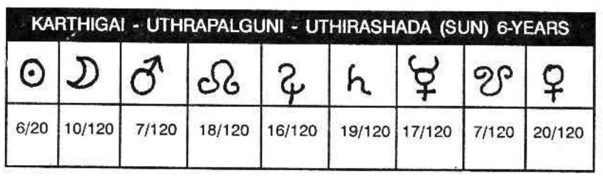

If the star is Karthika, note the lord of the star. It is Sun. Hence, allot the first sub to Sun. In the cyclic order, who will follow Sun? It is Moon. So the second sub is given to Moon, the third to Mars, the fourth to Rahu and so on, till the last sub is governed by Sukra.

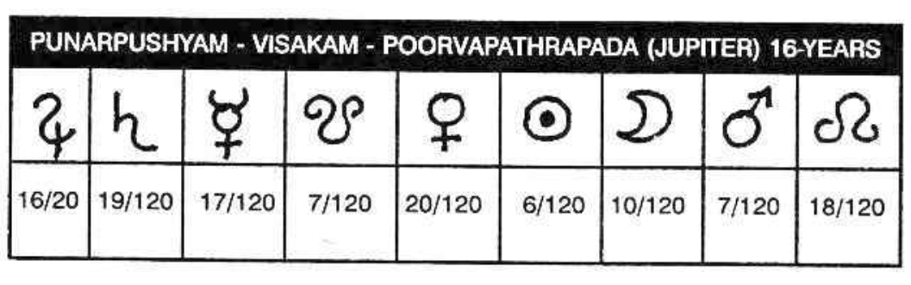

If the star is Punarpoosam, otherwise called Punarvasu, the first subdivision is governed by Jupiter; next by Saturn and the last by Rahu.

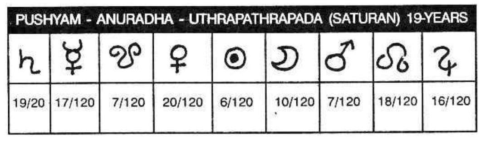

If the star is Pushya, the lord is Saturn. Therefore, the first sub is governed by Saturn, the second sub is ruled by Mercury, the third is allotted to Kethu and so on till the last sub is under the sway of Jupiter. 

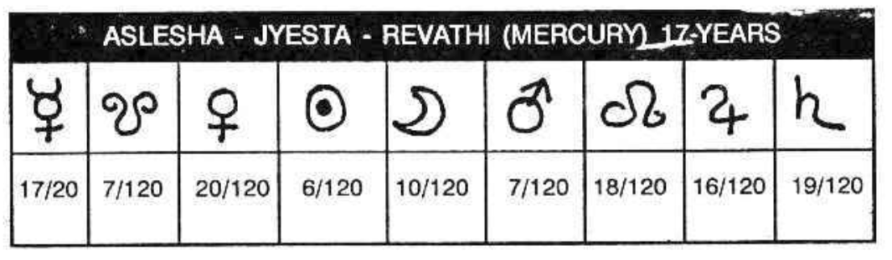

If the star is Ashlesha, otherwise called Ayilyam, the first subdivision is governed by Mercury, the next by Kethu and so on, till the last subdivision is allotted to Saturn. Thus all the twenty seven stars are divided among the nine planets. 

It may appear as though the whole Zodiac is divided into 27 multiplied by 9 parts. Actually, the lord of the sign, the lord of the star and the lord of the sub will be 249 instead of 243, due to the change in the sign lord (lord of the sign), as certain subs are found in two adjacent signs. 

Furthermore, one can sub-divide and record the results. This is for research students.

A few stars are called by different terms. They are:
- Krithik - Karthikai
- Mrigasira — Mrigashirisha 
- Arudhra — Thiruvadhirai
- Punarvasu — Punarpusam 
- Poorvapalguni — Pooram — Pubba
- Uthrapalguni — Uthram 
- Anuradha — Anusham 
- Jyeshta - Kettai 
- Poorvashada — Pooradam 
- Uthrashada - Uthradam 
- Sravana - Thiruvonam 
- Dhanista — Avittam 
- Sathabisha - Sathayam 
- Poorvapathra — Poorattadhi 
- Uthrapathra — Uthrattadhi 

The other 11 stars are called by the same name.

# CONSTELLATIONS AND THEIR SIGNIFICANCE

Each star is divided into 4 equal divisions. Each part is called either pada or quarter =3°-20'. Half of a star = 6°-40’. When a constellation commences in one sign and extends in the next succeeding one, it is mentioned as ‘a’ and ‘b’. The numeral number given for each star is the number of the star in the 27 constellation starting from Aswini.

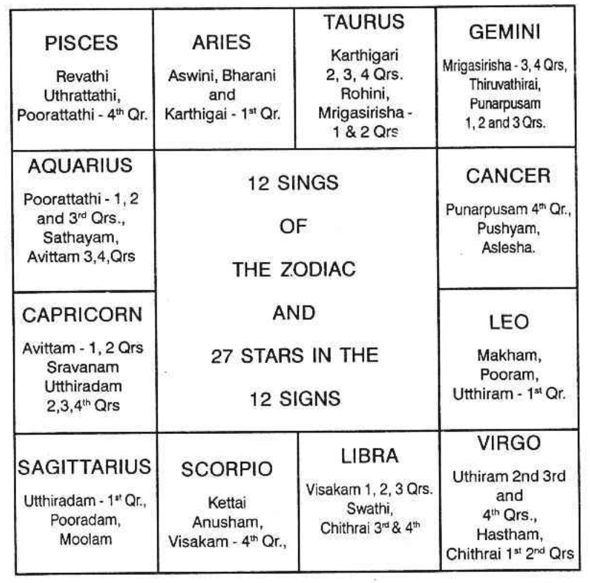

1. Aswini : 0° Aries to 13°20’ Aries (Mesha). The first constellation. The sign Aries is ruled by Mars and the constellation is governed by Kethu. Hence, this zone indicates the following matters in general:
* Part of the body: Head, Cerebral hemispheres.
* Diseases: Injury in the head, congestion in the brains, thrombosis, cerebral anaemia, faintings epilepsy, violence, spasms, severe headache on any one side, neuralgia, coma, trance, cerebral haemorrhages, paralytic stroke, insomnia, malaria, meningitis, smallpox.
* Mental qualities: Avarieous, extravagant, worried about landed properties, brother’s ailment, dispute with brother, Partition, black magic, can pray Lord Ganesh or Subramanya or Narasimha or Anjaneya. (Will be fond of Ornaments, lovely in appearance, liked by all, clever and intelligent).
* Profession: Service in factory, police, military, medical, surgery, criminal courts, jail, railways, machinery, iron, steel, copper (Commandants, Physicians, Attendants, horses, horse-riders, horse-dealers, horse-groom, handsome persons as traders).
Does not contribute to child birth unless Kethu happens to be a benefic to the individual. May induce abortion, surgical aid for fertility but mostly remaining barren. When strong benefits form favourable aspects, the evil results will be warded off.  
When one runs Mars Dasa Kethu Bhukthi or Kethu dasa, Mars Bhukthi, the matters signified by Mars and Kethu to that native will materialize when either of them or either of the luminaries transit in the Zone. Sun will transit in this area between 14" April and 27" April every year. Moon will transit on Aswini star once in 27 days.  
 
2. BHARANI : 13°-20’ Aries to 26°-40’ Aries (Mesha) the second star. Sign ruled by Mars, Star governed by Venus.
* Part of the body : Head, Cerebral hemisphere, organs within the head, eyes.
* Diseases : Injury in the head, mostly in the forehead and just around the eyes, cold venereal distemper, syphilis affecting face and vision, catarrh in the head, moist humours, mucus, reins afflicted, weakness due to gratifying one’s tastes and pleasurable emotions in dissipating habits.
* Mental qualities : Chain smoker (Mars Venus.fiery sign) (Tobacco cultivator) — mind, always fond of pleasure, enterprises, aspiring, amorous, avaricious,-(cruel men, those that feed on blood and flesh, slayers, low-born persons, cudgellers, husk grain and wanting in character. Will carry out his purpose to the end, will be truthful, free from malady, clever and happy).
* Profession : Makes money through pleasure, sports, music or musical instruments, art advertisement, show display, exhibition, silver utensils, ever silver, silk, mobile, automobile, fertilizer, industry, railway, factory, wrestler, cinema theatre, studio, mansion for marriage, animal husbandry, veterinary doctor, slaughter house, tea or coffee estates, caterers, hotels, restaurants, criminal lawyer, judge, leather manufacturer, skins and hides, building contractors, engineer, those who assess and pass orders, revenue department, surgeon, maternity, venereal expert, optician, agriculturist.
Whenever one runs Mars dasa Venus Bhukthi or Venus dasa Mars Bhukthi, then the matters signified by these two planets will materializes, when either of these planets transit-in this zone or in Mrigasira first half or Chithrai second half or Venus star Mars sub or Mars star Venus sub : Also when the luminaries Sun and Moon transit in these areas, one can enjoy those results. Sun will transit between 27" April and 10" May every year, and Moon transits in Bharani constellation once in 27 days.

3. KARTHIGAI
    1. 1st QUARTER : 26°-40' Aries to 30° Aries Sign owned by Mars and the star by Sun.
       * Part of the body : Head, eyes, brain, vision.
       * Diseases : Sharp fever, malaria, filaria, plague, smallpox, wounds, cerebral meningitis, brain fever, injury, cuts, accident, explosions, carbuncle, fire accident.
       * Mental qualities : Normally robust health, good strength, great enthusiasm, push-up, go ahead spirit, militant temperament, leading nature, commanding appearance, competitive mind, argumentative ability etc. (will eat much, will be drawn to other peoples’ wives, will be ebullient in appearance ana iamous).
       * Profession : Acquisition of lands, buildings or possession of patrimony, bold punter, dauntless, escalator, military, police, industry, medical, surgical, navy (Moon in this position or a planet in this star and Moon Sub) Defence department, travels, resignation, retirement, manufacturing chemicals, bombs, crackers, explosives, match boxes, iron and steel utensils, war material (Saturn in this area makes one listless and rapid. He will never amount to anything. But Mars in this area promises that the person will not hesitate to fight at the drop of his hat, especially, when Mars is in between 28° — 26'4C" and 29°-6’-40”, i.e. Mars Sing, Sun Star and Mars sub). (Brahmins and particularly those performing daily Agnihotra, reciters of sacred hymns, white flowers, grammarians, barbers, miners, priests, astrologers, potters and those who know the sacrificial rules).  
       If one runs Sun Dasa Mars Bhukthi or Mars Dasa Sun Bhukthi, what results these two planets indicate to that person, will be enjoyed when either of them transit in Karthigai 1* quarter. Sun will be there between 10" May and 13" May every year. It is most likely that this sub period which will run only for 4 months and 6 days may be in the other months. In such cases Sun will transit on the day of enjoying the result in Mars star Sun sub or Sun's star Mars Sub. This is applicable to similar circumstances. If one expects a promotion during Sun Dasa Mars Bhukthi or Mars Dasa Sun Bhukthi, though the period runs for 126 days, one can pitch up the exact date as mentioned above.
    2. 2, 3 and 4th Quarter: 0° to 10° Taurus (Rishaba). Venus is the lord of the sign and Sun is the Lord of the star.
       * Part of the body: Face, neck, larynx, tonsils, lower jaw, occipital region.
       * Diseases: Pimples, cuts, reddish eye, eyesore, throat troubles, tumours in the knees, quinsy, swelling above neck polypus of the nose.
       * Mental qualities: Always fond of company, sociability, hospitality, pleasure, comfort, luxury, generous, courteous affectionate, cheerful and impressionable, creative mind, fruitful action, best fitted for business, smooth profession, speculative tendency, popular and prosperous.
       * Profession: Benefit through Government, Victory over enemies, acquires costly jewels and dress, contacts with foreigners, realization of even bad debts, pleasant functions, music, dance, drama, opera, poet, artist, drawing master, draftsman, sculpture, silk, photography, international trade, installation of parks, decoration, industry, medical department, engineer, tax collector, wool dealer, export of hair, assessment, venereal expert.  
       If a person expects the date on which he can enjoy the results of Sun Dasa Venus Bhukthi or Venus Dasa Sun Bhukthi, one has to select the time when the significators transit in that part of the Zodiac, as below.
          * The Lord of the sign Venus and the zone star-ruled by Sun i.e. Karthigai 2,3,4 padas.
          * The lord of the sign Sun and the zone-star-Poorva-palguni (Leo 13°-20' to 26°-40’) governed by Venus or
          * Venus star, Sun sub or
          * Sun star, Venus sub.
          Important events indicated by these two planets cannot happen on other dates. These will be explained in detail in the book “Udu-Dasa”.

4. ROHINI : 10° Taurus to 23°-20' Sign ruled by Venus star governed by Moon.
* Part of the body : Face, mouth, tongue, tonsils, palate, neck, cerebellum, atlas, cervical vertebrate.
* Diseases : Sore-throat, cold, Cough, pain in the legs and apoplexy, irregular menses, sweating.
* Mental qualities : Pleasant manners, good nature, enjoys nature, taste in music, art, drama, literature, public function, maternal affection, sympathetic, enjoys life in the company of other sex. (Will be truthful, pure, sweet-tongued, with a settled mind and lovely appearance).
* Profession : Caters to the need of the public, hotels, restaurants, lodging-houses, bakeries, boarding houses with comforts and conveniences, bar attached, dealers in houses, lands, fruits, automobile, petrol, oils, milk, dairy farm, ice cream, glass, plastic, scents, perfumeries, soap, sandalwood, oil, paints, water, colour, dyes, liquids, acids, marriage broker, dress and pearls dealer, navy, shipping, clearing agent, judge, politician, tannery, yarn merchant, sugar, sugarcane, sugarcoated tablets, etc. (King, Wealthy person, observers of vows, merchandises, cartmen, cows, bulls, aquatic animals, agriculturists, yogis, mountains and men in authority).

5. MRIGASIRA 
    1. First Half : 23° -20’ in Taurus to 30° Taurus ruled by Venus. Star governed by Mars.
       * Part of the body : Face, chin, cheeks, larynx, palate, carotid, arteries, jugular veins, inflamed tonsils.
       * Diseases : Pimples, cuts and injuries in those parts, pain in the throat, adenoids, diphtheria, weak loins and king's evil, nose-bleed, goitre, constipation, venereal distemper polypus.
       * Mental qualities :
       * Profession : Estate owners, land, building, instrumental music, exhibition, display, eversilver, platinum, tailor, dressmaker, mobile structurals, fertilizer, automobile engineering, income tax and sales tax department, skins and hides, tobacco, snuff, confectionery, marriage mandapam owners, veterinary doctors, animal husbandry, lethal chamber, cartmen, rickshaw pullers, taxi drivers, fruit sellers like apple, banana, etc., whereas Rohini shows oranges, grapes and juicy ones, gains through business, textiles, cinema industry, sound engineer, photography, diamonds, rubies, corals, jewellery, vaseline, snow, face powder, sandal powder, tooth paste, brush etc. 
    2. Second Half : 0° to 6°-40’ Gemini sign owned by Mercury and star governed by Mars.
       * Parts of the body : Throat, vocal cord, arms, shoulders, ears, thymus gland, upper ribs.
       * Diseases : Corrupted blood, itches, wounds, and fracture of arms, collarbone, fractured femur, sciatica, surfeit, fever, pains in the shoulders near collar bone, arms, disorders in secret parts, inflammation of pericardium.
       * Mental qualities : Gives mental energy, enthusiasms, dexterity, quick-witted, sharp, fluent, alert, quick, magnetic, impulsive, excitable, vitriolic in their wrath, tongues more poisonous than rattlesnake, acme of selfishness. (Will be fickle, sharp-witted, timid, eloquent, industrious, wealthy and indulging in sexual pleasure).
       * Profession : Dealing in machineries, tools, instruments, electrical goods, surgical instruments, telephones, telegraph cables, wires, engineers, surgeons, soldiers, mathematicians, ambassadors, astronomers, building contractors, highways, bridge or damsite constructors, textile engineers, tape-record, gramaphone, radio dealers, press, publication, computers, calculators, salesman, representatives, agents, brokers, jobbers, thieves, etc. (Aquatic products, fragrant things, flowers, fruits, garments, gems, birds, beast, forests, drinkers of Soma juice, letter-bearers, lovers and musicians).

6. ARUDHRA : 6°-40' in Gemini to 20°. Lord of the sign Mercury. Lord of the star Rahu.
* Part of the body : Throat, arms, shoulders.
* Diseases : Septic throat, mumps, asthma, eosinophilia, dry cough, diphtheria, ear trouble, pus in the ear.
* Mental qualities : Active mind, initiative perception, ingenious and critical, unsuccessful in literary pursuits, or a scholar depending on Rahu in the individual's horoscope, good character reader, resourceful mind. (Slayers, adulterers, chasers, thieves, liars, cruelminded people, men versed in the art pertaining to goblins, catchers, rogues, sowers of discord, charmers, sorcerers, and husk-grain. Will be perfidious, haughty, ungrateful, mischievous and sinful).
* Profession : Salesman, bookseller, shopkeeper, Post & Telegraphs Department, Communication, transport, atomic energy, aerial, radio, advertising, publicity, writer, author, research department, explorer, dealing in drugs, beverages, canned goods, handwriting expert, finger print expert, public appointments, finance broker. Any how this zone of 13°-20' is barren. (Planets signifying birth of children, in this zone get weakened and mostly become barren). This area is good for statistics, physics, dynamics, gravitation.

7. PUNARVASU 
    1. 1,2,3 PADAS : Gemini 20° to 30° sign ruled by Mercury. Star by Jupiter.  
       * Part of the body : Ear, throat, shoulder blades.  
       * Diseases : Pleurisy, bronchitis, pneumonia, reins disorder, pericardium inflammated, swelling and pain in the ear, goitre due to iodine deficiency, infiltration in the upper lobe the lungs, pulmonary apoplexy.  
       * Mental qualities : Broad outlook, sharp intellect, good memory, worldly wisdom, correct intuition, clear in sight, proper jedgment, practical adaptability, mental balance, desire to learn more and more. (Pure, truthful, highborn, charitably disposed, handsome, intelligent, renowned and rich men, servants, artisans, merchants and valuable grain. Will be self-controlled, happy, amiable, dull, afflicted with disease, thirsty and easily contented).  
       * Profession :; Success in journalism, editing, publishing correcting, inspecting, story-writing, advertising, publicity, religion, law, literature, poetry, insurance agency, finance broker, accountants, auditors, civil judge, civil engineer, mayor, counsellor, school master, preceptor, interpreter, secretary, registrar, messenger, Tamil Pandit, astrologer, mathematician, clerk, postman, clothes, woolen merchant, provision, dealer, planets which signify pregnancy in one’s chart gains beneficial strength when they are in this zone.
    2. 4th Quarter: In the sign cancer between 0° and 03°-20’. Lord of the sign is Moon. Lord of the Star Jupiter (Brahaspathi).
       * Part of the body : Lungs, respiratory system, chest, stomach, oesophagus, diaphragm, pancreas, mammae, lacteals, upper lobes of liver, thoracic.
       * Diseases : Dropsy, beriberi, stomach upset, irregular appetite, corrupt blood, tuberculosis, pneumonia, bronchitis, liver complaint, jaundice, gourmandize, dyspepsia.
       * Mental qualities : Fertile imagination, honest, true, sincere, reliable, forgiving temperament, appreciates beauty, correct judgement and effective argument, given good vitality, resourcefulness and fertility, just and benevolent, compassionate, sympathetic, born rich, prince, politician.
       * Profession : Banker, physician, religious head, temples, economics, statistics, advocate, judge, professor, principal, merchant, sailor, traveller, manager of public conveyance, dealers in fluids, salesman, nurse, midwife, water supplier, female officials.

8. PUSHYAM
Between 3°-20' and 16°-40' in Cancer. Sign ruled by Moon and star governed by Saturn.
- Part of the Body
  * Lungs
  * Stomach
  * Ribs
- Diseases
  * Tuberculosis
  * Ulcerations in the respiratory system
  * Gastric ulcer
  * Gallstones
  * Nausea
  * Belching
  * Obstruction
  * Bruises in the breast
  * Scurvy
  * Cancer
  * Phythisis
  * Jaundice
  * Cough
  * Hiccough
  * Eczema
  * Pyorrhoea
  * Dyspepsia
- Mental qualities
  * Economical
  * Prudent
  * Frugal
  * Conservative
  * Sober
  * Contemplative
  * Careful
  * Attentive
  * Self-reliant
  * Has a systematic and methodical action
  * Patiently works with perseverance
  * Attains position of trust (Minister, King, fisherman and the like)
  * Persons engaged in big and small sacrifices
  * Honest folk
  * (Forests, wheat, sugarcane, rice and barley)
  * Will be composed in mind
  * Liked by all
  * Learned
  * Wealthy
  * Inclined to be virtuous
- Profession
  * Deals in mine products
  * Kerosene
  * Petrol
  * Petroleum products
  * Coal
  * Lands
  * Produce
  * Wells
  * Excavations
  * Canals
  * Trenches
  * Deals in agricultural lands
  * Holds position of trust
  * Plumber
  * Sexton
  * Jailer
  * Gravedigger
  * Engineer digging wells, tanks, etc. and constructing bridges, dams, tunnels
  * Those who work at night and underground
  * Dealers in oils
  * Working in submarine

9. ASHLESHA (9" Star) 16°-40' to 30° Cancer, Sign ruled by , Moon and Star by Mercury.
- Part of the body
  * Lungs
  * Stomach
  * Oesophagus
  * Diaphragm
  * Pancreas
  * Liver
- Diseases
  * Vitamin ‘B’ deficiency
  * Cold stomach
  * Windiness
  * Wind pressing the diaphragm making it difficult to breathe
  * Distillation of the rheum
  * Pain in knees and legs
  * Drunkenness
  * Jaundice
  * Nervous
  * Indigestion
- Mental quality
  * Quick wit
  * Ingenious
  * Reasonable
  * Versatile
  * Fluent and copious in speech
  * Good writer
  * Acquires other languages easily
  * Can imitate others
  * Mimicry
  * Has the desire to learn art, music and literature
  * Fond of travels
  * Will be in-sincere
  * Inclined to eat everything
  * Sinful
  * Ungrateful
  * Deceitful
- Profession
  * Sale man
  * Agent
  * Representative
  * Business
  * Commerce
  * International trade
  * Clerk correspondent
  * Author
  * Writer
  * Manufacturer
  * Water supply engineer
  * Textile engineer
  * Dealer in yarn
  * Paper
  * Pen
  * Ink
  * Traveling agent
  * Guide
  * Hostess
  * Astrologer
  * Mathematician
  * Water diviner
  * Midwife
  * Nurse
  * Pulps
  * Roots
  * Fruits
  * Reptile
  * Poison
  * Worms
  * Counterfeits
  * Robbers
  * Huskgrain
  * All classes of physicians

10. MAKAM : (10" Star) 0° to 13° -20' in Leo-Simha, Sign ruled by Sun, Star governed by Kethu.
* Part of the body : Heart, back, spinal cord, spleen, dorsal region of spine, aorta.
* Diseases : Heart affected by sudden shock, grief or poison, pains in the back, cholera, humerous, gravel in kidneys, palpitation, regurgitation, faintings, signal meningitis.
* Mental qualities : Outspoken, assertive, combative, defensive, forceful, audacious, sensual, impulsive, proud short-tempered, hasty, fiery temper, enthusiastic and energetic, eminently fitted to occupy a position of trust both in public and private concern, good sportsman, contact with people in very high position, good appointment, undertake lofty plan, (Will be wealthy and have many servants, will enjoy life, worship the Gods and the Manes and be very industrious).
* Profession : Contracts big factories, chemical drug manufacturer, criminal lawyers, defence department, surgeons, medical department, Government service or security in service, manufacturer of imitation jewellery, cheap ornaments, electroplating, manufacturers of nickel and chromium plated surgical instruments, weapons (depending on the planet in this position or the sub in which it is or where the meridian falls select that department in Government service. Just like Sun's rays includes “VIBGYOR’, so also government service includes from menial to minister, peon to president.
* (People rich in money and corn, men who are devoted to their elders and manes, granaries mountaineers, heroes, women haters, carnivorous beings).

11. POORVAPALGUNI : 11" Star. 13°-20' to 26°-40’ in Leo sign ruled by Sun, star governed by Venus.
* Part of the body: Heart, Spinal Cord.
* Diseases : Due to disappointment in love, heart affected, Loss of children affecting hearts, all due to shocks and irreparable loss, Curvature of the spine, anaemia, hydremia, pain in legs, swelling of ankle, blood pressure, aneurism, swelling of heart, valves affected.
* Mental qualities: Competence in music, art, Kavi-poet, Generous, warmhearted, affectionate, fond of pleasure, luxury and comfort, temptation to speculate, true, honest, cautious, able to fulfil his desires, self-centred, desire to at least attend dramas or dance, taste in drawing, sculpture and paintings, acquires fancy and costly jewels, dress, photography as hobby (artists, actors, young damsels, musicians, amiable persons, merchandise, cotton, salt, honey, oil many boys. Will speak sweetly, will be liberal in gifts, bright in appearance, fond of wandering, and loyal to his sovereign).
* Profession: Government service, Transport, Radio, Music, renovation of ancient paintings, preservation of monuments, museums, sports, mobile, automobile, disinfectant for crops, cinema theatre, studio, film section, photography, animal husbandry, slaughter house, lethal chamber, veterinary surgeon, leather, skin, hides, hotels, canteens, revenue department, house- building, maternity surgeon, venereal expert, educationalist, Vice-Chancellor, service in women’s colleges or jails, optician, glass dealers, cigarette manufacturers.

12. UTHRAPALGUNI - 
    1. I* Pada: 12" Star. 26°-40’ to 30° in Leo. Sign ruled by Sun and the Star also governed by Sun.
       * Part of the body : Spinal Cord.
       * Diseases : Pains in the back and the head, spotted fever, plague, hyperaemia, faintings, blood pressure, becomes mad temporarily due to clotting of blood in the capillaries in the brain, palpitation, backache.
       * Mental qualities: May or may not be violent. It depends on the planet in this area. Very violent if mars is in between 28°-26’-40’, and 29°-13'-20' in Leo. Ambitious, authoritative, boastful and domineering, energetic and enthusiastic, gaudy and generous, haughty and hopeful, illustrious, joyful, kingly, loyal, magnanimous, optimistic, proud, royal, stately and zealous (Charitable and learned persons, mild, modest, pure, heretical, highly wealthy men, those intend on their duties and kings, fine corn. Will be loved by all, earn money by his own learning, will be voluptuous and happy).
       * Profession: Any service under government. Medical, defence, shipping, navy, industry, commerce, stock exchange-share business, maternity home, heart specialist.
    2. 2™ 3° and 4" Padas: In Virgo 0° to 10°-12" Star. Sign ruled by Mercury and star governed by Sun.
       * Part of the Body: intestines, bowels, liver.
       * Diseases: Tumours in the bowels, obstructions, stomach disorder, sore throat and swelling in neck.
       * Mental qualities: Good reasoning, intelligent, tactful, business minded, studious, industrious, good in mathematics or engineering, astronomy, astrology, book keeping, clever and critical, dexterous and diplomatic, eloquent and educated (hygiene and sanitary engineering), ingenious and intellectual, accounts, business, acumen, advertising.
       * Profession: Amalgamating a few companies, astronomer, astrologer, communication department, education department, handwriting expert, governor, tourist department, engineering, press, lecturer, correspondent, publication, public relation officer, megaphone, loudspeaker, manufacturer, telephone, mine engineering, State Trading Corporation, contractors, agents, industry, chemical engineering, physician, public health department, hospitals, Registrar of Newspaper, Registrar of birth and death, ambassadors, postal department.

13. HASTHAM: In Virgo 10° to 23°-20’. 13" Star. Sign ruled by Mercury and Star governed by Moon.
- Part of the body:
  * Bowels, intestines, secreting glands, enzymes.
- Diseases :
  * Vitamin B deficiency, gas formation, flatulence, loose bowels, pain and disorder of the bowels, obstructions, arms and shoulders weak, short breath, worms mucus, cholera, diarrhoea, typhoid, amoebic, and bacillary dysentery, neuralgia (imagination), fear complex, hysteria.
- Mental qualities:
  * Man versed in the Vedas, merchandises, traders and energetic men, Will be industrious, impudent, fond of drinking, merciless and thievish, charioteers, elephant drivers, robbers, elephants, artisans, husked-grain.
- Profession:
  * Salesman, commerce, overseas, communication, mail order business, shipping, clearing agent, textile, yarn, engineer, bridges, damsites, canals, tunnels, ink, press, ink manufacturer, advocate, sanitary engineer, export, import, artist, painter, politician, ambassador, embassy, messenger.

14. CHITHRAI-
    1. First Half: 14" Star. In Virgo 23°-20' to 30°. Sign Lord is Mercury. Star lord is Mars.
       * Part of the body : Belly, Lower part.
       * Diseases: Ulcers, sharp and acute pains, choleric humours, worms, irritation and itching, legs paining, dry-gripping pain, wounds from insects, reptiles and animals.
       * Mental qualities: Humorous, dexterous, practical, business like, enthusiastic, bold, courageous, energetic, enterprising, active or quick tempered, sarcastic, argumentative, impatient, resentful, overworking and irritable. (Will wear beautiful) garments and flowers and will have beautiful eyes and limbs.
       * Profession: Mechanical Engineer, Press, Publication, Building contractor or broker, Supplier to jail, criminal lawyer, tax department, Sales Tax, Income-tax, revenue, finance department, factory, industry, electricity, mine, tunnel, trenches, finger print expert. Police of Law and order and traffic, defence department, military accounts, cost accountant. Persons skilled in the art of ornamenting, painting, jewellery, singing, writing, perfumery, as well as mathematicians, weavers, physicians).
    2. 3° and 4" Padas: In Libra 0° to 6°-40’. Sign ruled by Venus and the Star by Mars.
       * Part of the body: Kidney, loins, hernia, appendicitis, lumbar region of the spine, vasomotor system.
       * Diseases: Polyuria, inflammation of ureter connecting kidney and bladder, Bright's diseases, lumbago, kidney trouble, excess of urine, hemorrhage of the kidneys, renal stories, sunstroke, brainfever, pains in head.
       * Mental qualities: Ambitious, aspiring, adventurous, amorous, faculties of perception and observation, clear vision, refined tastes, idealistic temperament, intuitive mind, loves, science and refined occupations.
       * Profession: Lawyer, surgeon, scientist, philosopher, religious, endowment board, business, military, defence department, industry, partnership in business, building contractor, litho press, artistic advertisement, decorators, scents, perfumeries, powders, marriage broker, registrar of marriages, sports materials, music, telescope, microscope, radio, television, tape-record dealers, lady doctors, surgeons, tailors, cigarette and snuff merchants, petroleum products, automobile spare parts, dress, jewels.

15. SWATHI: 6°-40' to 20° Libra Sign ruled by Venus. Star by Rahu.
* Part of the body : Skin, kidneys, ureter, appendicitis, hernia, bladder.
* Diseases: Polyuria, urinary trouble, ureters ulcerated, pus formation, Bright's disease, eczema, skin trouble, leprosy.
* Mental qualities: Compassionate, honest, courteous, just, clear, intellect, initiative, perceptive, ability, powers of comparison, upright, sympathetic, flexible, sensitive, slow to lose temper, anger soon pacified, sweet nature, humane, fond of company, partnership, slow to grasp but remembers well. (Traders, feeble characters, ascetics and connoisseurs of wars, fickle-minded friends). (Will be modest, clever in trade, will be compassionate, sweet in speech and virtuous).
* Profession: All imitations, mobile, automobile, transport, tourist, music, opera, drama, art, paint, decoration, exhibition, tube light, fan, frigidaire, hot water equipments, hot air blower, Xray instrument manufacturer, scientists, service in clinics, judge, Poet, toilet set manufacturer, confectionery, bakery, women’s apparel, fancy goods, perfumeries, readymade dress, maid servant, plastic, mica, ground glass scents, pasteurized milk, leather goods, Nadaswaram, bugles, cooks, butters, silk-mercers, embroiderers, gloves, bonnets.

16. VISAKAM 
    1. — 1,2, and 3 Padas: 20°to 30° Libra. Sign ruled by Venus and Star governed by Jupiter.  
       - Part of the body: Lower abdomen, part near bladder, kidneys, and pancreatic gland.  
       - Diseases: Deficiency of Adrenal secretion, renal abscess, skin eruption, diabetes, kidney sluggish, insulin deficient, congestion of brain, coma, vertigo.  
       - Mental qualities: Pleasant manners, attractive appearance, polite, faith in God, conventional, universal love, brotherhood, generous, magnanimous, true, just, equanimous, broad-minded, talented, cultured. (Will be envious, covetous, of bright appearance, clever in talking and quarrelsome).  
       - Profession: Business with partners, travelling agent, tourist officer, shipping, air travel, dealings with foreigners, pawn - broker, banker’s speculator, race goer, works in building construction, fruit gardens, Tax and revenue departments, foreign trade, floats big companies, judge, auditor, professor, principal, physician, manufacturers, coloured papers, cinema publicity, advertisement through slides, actor, costly dress, lace, jewellery, perfumeries, minting, etc.  
(Green gram, sesamum, black gram, Bengal gram, tree with red blossoms and fruits, cotton and men devoted to Indra or Agni).
    2. 4th Quarter: In Scorpio 0° to 3°-20' Sign ruled by Mars. Star governed by Jupiter.
       - Part of the Body: Bladder, urethra, genital organs, rectum, descending colon, prostate gland.
       - Diseases: Diseases of the womb, fibroid tumour, prostate gland enlargement, urinary trouble, frequent micturition, abnormal bleeding during menses, rupture, renal stones and gravel, uterine tumour, urethral abscess, dropsy, hydraemia, urates in excess, strangury, apoplexy, nosebleed.
       - Mental Qualities: Somewhat conservative, dignified, enthusiastic, influential, noble, sincere, honest, straightforward, free will, independent, candid, convincing, reasoning, extravagant, generous, overliberal, an extremist.
       - Profession: Bank Judge, Criminal Lawyer, Insurance Company, chemical and drug manufacturer, land, estate owner, agriculturist, share market operations, more by jobbing than by investing, racing, cards, betting, dice, customs, industrial units, labour, port trust, defence department, defence Minister, village Munsiff, Ayurveda medicine.

17. ANURADHA: In Scorpio 3°-20’ to 16°-40', 17 Star, Sign ruled by Mars, Star governed by Saturn.
- Part of the body: 
    - Bladder 
    - Genital organs 
    - Rectum 
    - Nasal bones 
    - Bones near genital organs
- Diseases: 
    - Suppression of menses 
    - Poor bleeding and severe pain 
    - Stricture 
    - Sterility 
    - Constipation 
    - Piles 
    - Painful and not bleeding 
    - Nasal catarrh 
    - Phlegm 
    - Sore throat 
    - Fracture 
    - Hipbone
- Mental qualities: 
    - Determined 
    - Energetic 
    - Dominant 
    - Forceful or selfish 
    - Violent 
    - Harsh 
    - Cruel 
    - Vindictive 
    - Untruthful 
    - Dishonest 
    - Unscrupulous 
    - Enthusiastic 
    - Practical 
    - Men of prowess 
    - Those dealing in assemblies 
    - Heads of Corporations 
    - Travellers 
- Profession: 
    - Mines engineer 
    - Criminal lawyer 
    - Medicine 
    - Surgeon 
    - Instrumental music 
    - Industries 
    - Mechanical engineer 
    - Lead type foundry 
    - Actor 
    - Homeopathy 
    - Brothel 
    - Leather trade 
    - Skins and hides 
    - Woolen articles 
    - Water diviner 
    - Kerosene merchant 
    - Oil engine 
    - Oil crusher 
    - Amputating surgeon 
    - Dentist 
    - Service in jail 
    - Judge 
    - Watchman 
    - Undertaker 
    - Plumber 
    - Laborious work 
    - Arduous nature 
    - Coal 
    - Mine ores dealers 
    - Linseed 
    - Groundnut 
    - Mustard 
    - Cottonseed

18. Jyesta: In Scorpio 16°-40’ to 30°, sign ruled by Mars and star governed by Mercury.
- Parts of the body:
  - Colon
  - Anus
  - Genital organs
  - Ovaries
  - Womb
- Diseases:
  - Leucorrhoea
  - Bleeding piles
  - Fistula
  - Tumour
  - Distemper in secret parts
  - Affliction of bowels
  - Pains in arms and shoulders
- Mental qualities:
  - Studious
  - Quick in action
  - Ingenious
  - Good humour
  - Bold
  - Blunt
  - Never hesitate to fight at least by words
  - Resourceful
  - Learned
  - Indefatigable worker
  - Practical persons
  - Inexhaustible
  - Fond of wit
  - Quick-tempered
  - Exaggeration
  - Poisonous tongue
  - Great marital heroes
  - Endowed with noble family, wealth, and fame
  - Monarchs
  - Intent on consequent
  - Commandant
  - Thieves
  - Will not have many friends
  - Contented
  - Will be virtuous
  - Exceedingly irritable
- Profession:
  - Chemical Engineer
  - Press, publication
  - Ink
  - Typewriter
  - Textile mill machinery
  - Industry
  - Domestic
  - Canals
  - Thermal station
  - Power house
  - Impounded reservoir
  - Music instrument
  - Jalatharangam
  - Insurance Agent
  - Surgeon
  - Surgical instrument
  - Tonics
  - Scrums manufacturer
  - Military
  - Navy accounts
  - Advertisement
  - Publicity
  - Boilers
  - Pumpsets
  - Sessions judge
  - Gallows
  - Jails
  - Postmortem
  - Calculators
  - Telegraph sets
  - Cable and wire manufacturer
  - Boatman representatives

19. MOOLAM: In Sagittarius 0° to 13°-20’, 19" Star sign ruled by Jupiter. Star governed by Kethu.
- Parts of the Body:
  - Hips
  - Thighs
  - Femur
  - Illium
  - Sciatic nerves
- Diseases:
  - Lecomotor ataxia
  - Rheumatism
  - Lumbago
  - Hip diseases
  - Pulmonary troubles
- Mental Qualities:
  - Generous
  - Honest
  - Respectful
  - Commanding others' esteem
  - Cordial
  - Genial
  - Jovial
  - Law-abiding
  - Superstitious
  - Forgiving
  - Philanthropic
  - Benevolent
  - Charitable
  - God-fearing
  - Religious
  - Hopeful
  - Buoyant
  - Humane
  - Always contemplative
  - Social
  - Proud
  - Wealthy
  - Happy
  - Firm-minded
  - Luxurious in living
- Profession:
  - Religious endowment
  - Advocate
  - Judge
  - Teacher
  - Purohit
  - Puranas
  - Ambassador
  - Congressman
  - Literate
  - Cabinet official
  - Physician
  - Ayurveda
  - Social worker
  - Councillor
  - Provision dealers
  - Horse-racing
  - Gain through big ventures
  - International trade
  - Assembly Speaker
  - Exchange
  - Imports
  - Medicines
  - Deacon of Corporations
  - Very rich man
  - Persons dealing in flowers, roots and fruits
  - Seeds
  - Those that feed on fruits and roots

20. Poorvashada: 20th Star. In Sagittarius 13°-20 to 26°- 40’ Sign lord Jupiter. Star Lord Venus.
- Part of the body: Thighs, hips, the coccygeal and sacral regions of the spine, the iliac arteries and veins.
- Diseases: Sciatica, diabetes, rheumatism, respiratory diseases, cancer in lungs, hip gout, surfeits cold, moist, putrefaction of blood, swellings above the knees.
- Mental qualities: Magnanimous, overly liberal, broad-minded, educated, pleasing manners, polite, honest, loves others, just, compassionate, moderate, optimistic, tolerant of others' views, loves expensive and ultra-comfortable things, refined mind, fond of drama and art (tenderhearted men, fishermen, navigators, aquatic animals, etc. those that live by water, those devoted to truth, purity and wealth, constructors of bridges and aqueducts, fruits and flowers). Will have an amiable wife, will be proud and firm in friendship.
- Profession: Judge, advocate, banker, cashier, accountant, director, revenue and finance department, food, sugar, silk, cotton, rubber, railways, roads, building, air travel, Goddess temple, social studies welfare officer, animal husbandry, garden, nursery, transport, music, film show, foreign trade, foreign exchange, stock exchange, restaurants, hostels, business partner, ayurveda medicine, physician, women and children hospital, health centre.

21. Uthrashada 
    1. 1st Quarter: In Sagittarius 26° -40’ to 30°. Sign ruled by Jupiter. Star governed by Sun.
       - Part of the body: Thighs, femur, arteries.
       - Diseases: Sciatica, paralysis of limbs, pulmonary diseases, eye affected.
       - Mental qualities: Lofty ideals, noble aspiring disposition, benevolent, philanthropic, success in religion, law-abiding, expansive mind disposition, funny and jovial, cheerful, hopeful, no mind to have “tainted money”. Pillars of good society, optimistic outlook, cheerful, proficiency in some branch of learning.
       - Profession: Mahouts, wrestlers, horses, elephants, immovables, warriors, devotees of Gods, persons enjoying pleasure and militant persons. Will be well-behaved, righteous, will have many friends, will be grateful and amiable. Arbitrator, judge, politician, bank, finance department, shipping, education, religion, international trade, embassy, export promotion, free trade, physician, Ayurveda medicine, port trust, customs, jail department, refugee camp, hospitals, charitable institutions.
    2. 2nd, 3rd and 4th Padas: In Capricorn 0° to 10°. Sign ruled by Saturn and star by Sun.
       - Part of the body: Skin, Knees, Patella.
       - Diseases: Eczema, skin diseases, leprosy, chrysipeas, digestive trouble, uneasiness due to gas in the stomach, dull pain, rheumatism, palpitation of heart, cardiac thrombosis.
       - Mental qualities: Methodical, organizing with foresight, diplomatic during execution, carrying out any work with moral stamina, sincere, reliable, economical, prudent, indomitable will, calculative, best fitted to reduce expenses and hold a position in retrenching department, or such departments to say “No” to lengthen correspondence, to delay as much as possible and at last sanction to the dissatisfaction of the applicant.
       - Profession: Position of trust, estate, mine, coal, income-tax officer attending to wealth duty, estate duty, scientific research, finance department, curtailing expenses, control department, archaeology, monuments, antiquities, wool, Homeopathy, Jail, Engineer, ancient language, skins, hides.

22. Sravana: In Capricorn 10° to 23°-20'. Sign ruled by Saturn and star by Moon.
- Part of the body: Lymphatic vessels, knee, skin.
- Diseases: Filaria, eczema, skin diseases, leprosy, boils, pus formation, rheumatism, tuberculosis, pleurisy and poor digestion.
- Mental qualities: Sober, conservative, pessimistic, cautious, economical, prudent, contemplative, careful, a little funky, lacks courage, true, sincere, faithful patient worker, perseverance, attentive (Jugglers, ever-active, able, devotees of Vishnu, energetic and righteous men and truthful persons. Will be learned, possess a generously-disposed wife, will be wealthy and famous).
- Profession: Mine, mine products, liquids, oil, kerosene, petrol, coal, wet lands, wells, trenches, excavation, tunnels, fisherman, minister, king, agriculturist, plumber, mine engineer, ice cream, refrigerator, air cooler, those who serve at night and work underground, driver, pearls, submarine.

23. Dhanista:
    1. First Half: In Capricorn 23°-20’ to 30°. Sign ruled by Saturn and star by Mars.
       - Part of the body: Kneecap bones.
       - Diseases: Injury in the leg, boils, eosinophilia, dry cough, hiccough, flying gout, lameness, amputation.
       - Mental qualities: Firm will, decisive, active, alert, careful and forceful, cautious and courageous, selfish, vindictive and violent, extravagant, occasionally ambitious, greedy, liberal, in gifts, fond of music, men without arrogance or pride, eunuchs, rich people, trying to maintain peace and avoiding disputes.
       - Profession: Mine and ground engineer, death duty, estate duty, insurance, philosopher, homeopathy, ayurvedic, jail department, gallows, murderer, slaughter house, surgeon dealing with fractures, amputation, labourer, labour department, welfare department, refugee camp, rehabilitation, industry, tools, spare parts, etc., distilleries, zinc, cement, metallurgy, lead, quarry, jute, barley, potato.
    2. 2nd Half (i.e. 3rd and 4th Padas): Aquarius 0° to 6°-40', sign ruled by Saturn and star by Mars.
       - Part of the Body: Ankles, limbs, portion between knees and ankles.
       - Diseases: Fracture of the leg, Varicose Veins, blood poisoning, heart failure, cardiac thrombosis, high blood pressure, overheated blood, palpitation, fainting.
       - Mental Qualities: Quarrelsome, cantankerous, short tempered or quick witted, scientific minded, research worker, sincere in religion, faithful in affections, fond of society, will try to start many clubs and organise, fickle friends, charitable, becomes rich.
       - Profession: Agriculture, tea, coal, steel plants, explorer, mine, lead, ferruginous, control and ration office, reclamation of waste lands, Retrenchment office, engineer, leather, skin, hides, postmortem, slaughter house, police, military, communication, press, foundry, rehabilitation of sufferers from floods, earthquake and war or riots and revolts, monuments, archaeology, building contractor, television, telegram, telephone, electricity, atomic energy, all research stations, silk, hessain.

24. Sathabisha: In Aquarius 6°-40' to 20° sign ruled by Saturn and Star by Rahu.
- Part of the body: Portion between knees and ankles, calf muscle.
- Diseases: Rheumatism, rheumatic heart, eczema, leprosy, palpitation, high blood pressure, fracture, amputation, lame, guinea worm.
- Mental qualities: Sincere, strong, forceful, independent, original, patient, persevering, lethargic, lazy, fond of leisure and holidays or fond of working separately.
- Profession: Scientist, occult subject, gravitation, dynamics, electricity, atomic theory, air travel, astronomer, astrologer, amputator, stretcher-carrier, renovation of the ancient science, history, ration office, census, censor, statistics, stock exchange, technician, jail department, translation, and transliterations of old manuscripts, laboratories, factories, tanneries, counterfeit.

25. Poorvapathrapada 
    1. 1st, 2nd, and 3rd Quarter
       - Part of the body: Ankles.
       - Diseases: Apoplexy, irregularity of heart, dropsy, milk-leg, swollen ankles, palpitation, dilated heart, low blood pressure.
       - Mental qualities: Humane, hopeful, philosophic, optimistic, fond of friends, truth, honest, sincere, reliable, interest in science, philosophy, astronomy, astrology, literature, criticism, systematic action, yet lethargic, capable of extracting work from others, liberal, helpful, unselfish. If a malefic is in this zone, in the ascendant: robber, murderer, devoid of virtue, irreligious, ever fighting, courtbird, hen pecked, miser, clever.
       - Profession: Teacher-Dynamics, Statistics, Astronomy, Astrology, medicine, aeroplane, municipality, corporation, public limited concerns, stock exchange, share broker, air travel, research worker, planning commission, international trade, overseas bank, foreign exchange, education, finance, revenue department, insurance, temple, trustee, executive officer, mint, currency, mining, Anti-corruption department, intelligence department (C.I.D.).
    2. 4" Quarter: In Pisces 0° to 3°-20’. Sign ruled by Jupiter and star governed by Jupiter.
       - Part of the Body: Feet, toes.
       - Diseases: Swelling, perspiring feet, enlarged liver, abdominal tumour, intestines affected, hernia, jaundice, sprue, corns.
       - Mental Qualities: Magnanimous, liberal-minded, charitable, veritable, angels of mercy, fond of music, art, philosophy, literature, law-abiding, true, a little vacillating, pleasing disposition, polite behaviour.
       - Profession: Politician, profession, minister, councillor, president, legal education, religious and finance department, judge, criminal lawyer, arbitrator, trustee, visitor of jails, hospitals, famine and refugee camps, planning commission, decontrol, tourist, explorer, physician and surgeon, bank, foreign exchange, prisoners of war, risky investments, associations, public companies.

26. UTHRAPATHRAPADA: In Pisces 3°-20’ to 16°-40’. Sign ruled by Jupiter and star governed by Saturn.
- Part of the body: Feet.
- Diseases: Rheumatic pains, drop foot, indigestion, constipation, hernia, flatulence, fracture in the foot, coldfoot, tuberculosis, dropsy.
- Mental qualities: Strong character, benevolent disposition, philosophical mind-likes seclusion-hates disturbance, found of society, desire to help the poor and invalid, Visitor of jails, Sanatoriums, independent, original (fraud if afflicted).
- Profession: 
    - Home department, prisons, Asylum, Sanatorium, Isolated hospitals, prisoner of war, civil jail, political jail, mines, excavator, Engineer, export, import, harbour storekeeper- inheritance, traditional business, gains through societies, clubs, companies, public appointment, hospitals, religious and charitable institutions, submarine, shipping, foundaries, legal, insurance, intelligence department, C.I.D., education, tourist home, manufacturer of Rain coats, umbrella, sponger, boats, life boats etc. oils, fishers, breweries, river and canal constructor, tunnel construction, trench excavators.

27. REVATHI is Pisces 16°-40’ to 30°. Sign ruled by Jupiter and star governed by Mercury.
- Part of the body: Feet and toes.
- Diseases: Abdominal disorders, troubles, deformities of the feet, intestinal ulcers, mostly due to drinks and drugs, gout in the feet, cramps, Nephritis, Lassitude, deafness, pus in the ear.
- Mental qualities: Vacillation, indecisive, flexible, and impressionable mind, intuitive, human sympathetic, shrewd, clever, religious and philosophical, ripe judgement, fruitful mind, honest and honourable, studious, mental balance, sober, proficient and competent, honest, caring more for integrity.
- Profession: Publisher, editor, religious, legal, civil engineering departments, Share broker, advertisement, publicity, propaganda, communications, lawyer, judge, professor, politician, ambassador, representative, telephone, typewriter, radio, tape-recorder, currency notes, international trade, messengers, embassy, accountant, auditor, trustee, governor, university, employment exchange, newspapers, clerk, shipping, import, export, excise, customs, harbour, port trust, religious head-purohits, preachers, industry, finger print expert, successful diplomats, astrologer, mathematician, broker, agent, bank, etc.

# What each star signifies to each Lagna or Rasi borns

Normally, when we judge a horoscope, we prefer to follow the Vimshottari system and also include the Gochara (Transit). We judge the lord of the dasa, and consider him to be either favourable or not,

- by the house it occupies
- by its lordship
- by its nature
- by the planets conjoined with or aspecting the dasa lord

Further, to find out to what extent a planet is capable of bringing out the result, it is estimated according to Sadbala or as per Astagavargha. In practice, it is found that the dasa lord offers certain nature of results in its period which is not indicated by its nature, lordship or occupation in a sign or house. For example, a person born in the Ascendant Libra (Thulam) having Mars in the constellation Jyesta in Scorpio in its own sign, a fixed one, has given an opportunity to leave his kith and kin, get separated from his family, go overseas, learn how to manufacture press ink and return. Mars, as lord of 2, in the 2nd/4th house itself has to allow him, being a fixed sign, to stay in his own place. As it is neither in 9th nor in the movable, watery sign, or in 12th, normally one cannot expect overseas journey during Mars Dasa. But if one finds out in which constellation Mars was and then read out the matters signified by the lord of the constellation by its lordship, then the other results enjoyed by him will agree with the indication of the lord of the constellation to that particular lagna born. Mercury is the lord of Jyesta; it owns the houses 9th and 12th indicating overseas. Mars in Mercury star shows press, writing, printing, etc., and in a watery sign indicates ink and the results do agree in full.

In another horoscope, a gentleman born in Aquarius having exalted Saturn in the beginning of Libra (Vargothama) entered into military service during Saturn dasa. Neither Saturn nor the lord of the sign (Venus) in which Saturn was in rasi and Navamsa indicate Defence department. But if we note in which constellation Saturn was, we find that it was in Chitra ruled by Mars, which rules the 10th house and also indicates military service. Thus, in every horoscope, one can understand that a planet offers the result of the lord of the constellation more predominantly than those indicated by the sign or house which it occupies. Therefore, constellation is the main and important division of the Zodiac to read the results of a horoscope. Therefore, what results normally one can expect from a planet,

- by its occupation
- ownership
- nature

will be actually enjoyed during the periods and sub-periods of the planet in its constellation, during its own period and sub-period, the results of the lord of the constellation will predominate in addition to what it has to offer by occupation of house etc.

Hindus classify and call a planet to be good or bad according to its lordship of a sign counted from the sign where lagna falls. Westerners judge a planet whether it is favourable or unfavourable according to the nature of the aspect the planet receives and, according to its situation. But I do not attach importance to the name of the planet or its position etc. I give importance to the 27 zones in the zodiac and to the subdivisions, as these are capable of thoroughly changing a benefic (according to Hindus and Westerners) to a malefic (which is actually experienced and confirmed by the native) or changing a malefic (according to Hindus and Westerners) to a benefic (which agrees with the results enjoyed).

A father is good to his son. He may occupy a good position, say (exalted) judge; so a Sagittarius-born is confident that he will escape, whatever crime he commits. During Venus dasa the son forges a document... The case is posted under his own father. He regrets saying that his hands are tied up by the law and he punishes his own son. Sun may be a benefic by owning 9th house. It gets exalted and is in a kona. It has to do good. But during Sun dasa Kethu Bhukthi Mars anthra, the native is punished as Sun was in Aswini Star whereas Mars and Kethu were in 9. Kethu is to give the results of Mars which owns 12th house imprisonment. Therefore, the sub divisions and the stars are to be classified as good or bad: Planets cannot overrule the indications of the lord of the star and sub.

## ARIES BORNS
Aswini, Makam, Moolam: Stars are ruled by Kethu. As Kethu does not own any house, find out the planets with which it was in conjunction or by which it is aspected or the sign and constellation in which Kethu was at the time of birth. If it is not conjoined with or aspected by any planet, the results of the lord of the constellation and sign will be experienced if a planet was in any of these three stars at the time of birth or during transit in one's life time.

Bharani, Pooram, Pooradam: Venus is the ruler of the three stars. As Venus owns the second and seventh houses to Aries, the results of these two houses, i.e. second and seventh are to be predicted if any planet occupies these stars or transit in these. If Venus, at birth occupied a sign favourable to both Taurus and Libra, both the houses will be represented by Bharani trine. If Venus at birth occupied 6 or 8 or 12th sign to either Taurus or Libra and if Venus improves the matters of either of the two houses and is weak to offer the results of another house, planets occupying these stars or transiting in these stars will give such results as is denoted by Venus.

Anithigal, Uthram, Uthradam: If a planet occupies these three stars or while it moves on in these constellations, the results of the 5th house is to be predicted to Aries borns, as these stars are governed by Sun who owns Leo, the 5th house counted from the Ascendant of Aries-borns.

Rohini, Hastham, Sravanam: As Moon rules the 4th house for the Aries-borns the results indicated by the 4th house will operate while a planet transits in these three starts or if any were to be therein at the time of birth of the person. (Also 4th house matters will be offered by the planets, occupying the constellation of the planets situated in the 4th house).

Mrigasirasha, Chithrai, Avittam: Mars is the owner of these stars. Mars is the lord of 1 and 8 to Aries. So we have to presage the results of the houses 1 and 8 during the period of the planet in any of these three stars at birth or while in transit. These results will predominate. (Planets in the constellation of the occupants of these houses are very strong to give the matters of these houses).

Arudhra, Swathi, Sathabisha: Rahu is allotted these three stars by our sages. As Rahu does not own any sign, find out with which planet it is conjoined or aspected by and the sign and the constellation where it was at birth. The results of Rahu will operate when a planet was posited in these stars at birth, or when planets transit in these stars. (Rahu or Kethu will give the results of the planets with which it is conjoined then those of the planet which aspects them. Lastly, those of the lord of the sign).

Punarspusam, Visakam, Poorattathi: These three stars are governed by Jupiter who owns the 9th and 12th houses to Aries borns. You have to offer the results of the 9th and 12th houses, if a planet has occupied any of these three stars at birth whatever may be the house. When a planet transits in these stars whatever may be the nature, lordship or occupation of the transiting planet, the results enjoyed, depend on the lord of the constellation whereas the transiting planet indicates the source and explains how he gets such results. Suppose lord of 5 transits. Daughter delivers a child. The native spends money, How? 5th house is the 5th to the 5th. So, daughter will have a child. 12th house is 8th to 5th. So, she has temporary suffering. 12th house is expenses to the native. Therefore, Sun transiting in any of these stars or sub will cause expenses. If Moon transits, through mother expenses.

Pushyam, Anuradha, Uthrattathi: Saturn is allotted these three stars. If a planet were to be in these at birth or when any planet transit through these, you have to give the results of the 10th and 11th houses, as Saturn rules these houses to Aries borns. Eventhough Anuradha happens to be in the 8th sign, it is observed the Aries-borns have substantial gains when slow moving planet transit in the star Anuradha. Threatening Ashtama Sani gives pleasant shock and surprisingly good fortune.

Ashlesha, Jyesta, Revathi: Mercury who is the lord of the 3rd and 6th houses to Aries rules over these stars. Foretell the results of the 3rd and 6th houses when a planet is therein at birth or when a planet transits in these stars, whenever a particular planet transits in a particular sub in a star, the same nature of results will be experienced through the same or similar sources, the extent depending on the dasa then running.

## Taurus Borns

Aswini, Makam, and Moolam are ruled by Kethu, who does not own any sign in the Zodiac. Find out with which planet Kethu is conjoined or which planet aspects Kethu; also the sign and constellation where Kethu was at the time of birth. You have to offer the results according to the lord of the constellation and the sign which Kethu occupied if it is not conjoined with or aspected by any, if a planet were to occupy one of these three stars or transit in any of these three stars to Taurus borns.

Bharani, Pooram, and Pooradam: These stars are governed by Venus which owns the 1st and 6th house to Taurus borns. When a planet moves on in these three stars or occupy any of them at the time of birth, we have to predict the matters signified by the houses 1 and 6. For example, lord of 10 in any of these three stars gives ill health, causes enmity, offers success in competition, etc. instead of giving promotion and maintaining good relationship.

Krithigai, Uthram, and Uthradam: Sun, the major strong luminary, governs these stars and owns the 4th house to Taurus persons. If a planet is in these stars during transit or is occupying any of the three at birth, presage the 4th house matters to this native. Even when a planet transits in the 8th or 9th house in Uthradam or occupies at birth, the planet offers the results of the 4th house to the native. Suppose Mars is in Sagittarius, in Uthrashada star. As Mars is lord of 12, one may invest on an industry or factory and buy land, building etc. If Venus is there, one may have a car on hire purchase as Venus rules 6th house-debts.

Rohini, Hastham, and Sravanam: If a planet occupies any of these stars at the time of birth or transit in any we have to predict 3rd house matters to Taurus borns as Moon owns the 3rd house. Suppose Mars transits in these stars, Mars indicates as lord of 7, wife and as lord of 12, expenses; but if a planet transits in Rohini in Lagna; the native makes short travel. But when Mars transits in Hastham, Mars indicates expenses through wife and being the 11th to the 7th, it indicates gains to her, or purchases for her. It is the general predictions it does not happen. But the partner goes on a long journey; has treatment for the disease and gets cured.

Mrigasirasha, Chithrai, (Avittam or) Dhanishia: Mars, lord of 7 and 12 owns these three stars. The astrologer must give the results, signified by the 7th and 12th house to Taurus borns if a planet were to be in any of the above said three stars at birth or during transit. If a Taurus-born has married a talkative partner, then during the periods and sub-periods of the planet occupying Mars star may cause even violence, and separation.

Rahu, who does not own any house, rules over Arudhra, Swathi, and Sathabisha. Ascertain the combination of planets with Rahu, the sign and star where it was at birth in the chart. Those results indicated by lordship of the star and sign where Rahu was, will be experienced by the persons born in Taurus, during the periods and sub-periods of the planets in the constellation of Rahu.

Jupiter, a natural benefic, is the owner of the three stars Punarvasu, Visaka, and Poorattathi. As Jupiter is the lord of 8th and 11th house, you have to read the results of the 8th and 11th house matters if a planet was in these stars at birth or while a planet transits in any of these stars.

Pushyam, Anuradha, and Uthrattathi are governed by Saturn who owns the 9th and 10th house to Taurus natives. If a planet were to be in any of these stars at birth or if a planet transits in any of these three stars, the native will have the results of the 9th and 10th houses; Suppose, Jupiter was in Anuradha. It is in 7th. 7th house does not show overseas and higher education. But these are shown by lord of 9th and 10th. Jupiter, instead of giving troubles as lord of 8th, it causes the most beneficial and agreeable results, and gives higher education and long journey.

Ashlesha, Jyesta, and Revathi are ruled by Mercury owning houses 2nd and 5th to Taurus borns. The native will experience the results signified by these houses, if a planet occupies any of these stars at birth or when a planet moves on in these three stars. Suppose Moon was is Jyeshta. Moon is lord of 3rd. It has nothing to do with children. But if a person has a child in moon sub-period, in Hastham Star, which are we to take: either the sign lord or the star lord or the house it owns or occupies.

## Gemini borns

Kethu owns the stars Aswini, Makam, and Moolam, but it has not been allotted any sign. Find out the star and house where Kethu was at birth, the planets conjoined with it, or the planets aspecting it. If a planet occupies these stars at birth or in transit, offer the predictions signified by the lord of the constellation and the sign where Kethu was.

Bharani, Pooram, Pooradam are ruled by Venus, who is lord of 5 and 12 to Gemini borns. If a planet occupies these stars at birth or in transit, the results of the 5th and 12th houses are to be offered. Even though Bharani is in the 11th sign, which is to give pleasure, profit, and only desirable beneficial results, yet the matters of the 5th and 12th houses are experienced. Mostly Gemini borns go overseas and enjoy life even during the periods of evil planets, because they are in any of the 3 stars.

Krithigai, Uthram, Uthradam are ruled by the Sun, lord of 3, who owns these three stars. If a planet was in any of these three stars at birth or during its transit, the results of the 3rd house are offered to Gemini borns.

Rohini, Hastham, Sravanam are owned by the Moon, a weak luminary, who owns the 2nd house and also these stars. Even though Rohini is in the 4th sign, Sravanam in the 8th sign to Gemini, yet the results signified by the 2nd house are experienced if a planet is in these stars at birth or when it transits in any of them.

Mrigasirasha, Chithrai, Avittam are ruled by Mars, who owns the 6th and 11th houses to Gemini borns. If a planet were to occupy these stars at birth or passes in these stars, the results indicated by these houses 6th and 11th are offered to Gemini borns.

Arudhra, Swathi, Sathayam are owned by Rahu, the Ascending Node. So find out where Rahu was at birth, i.e. the sign and constellation it occupied. Offer the results of the lord of the sign and constellation where Rahu was, if you find any planet is in these stars at birth or during transit and provided the node is not conjoined with or aspected by any planet.

Punarpusam, Visakam, Poorattathi are ruled by the benevolent Jupiter, who is the lord of these 3 stars and owns the 7th and 10th houses to Gemini borns. If a planet occupies any of these stars at birth and passes these stars in transit, it offers the results signified by the 7th and 10th house results. It will prove to be a strong maraka.

To Gemini borns, Jupiter is the Bhadhakasthana adhipathi. If there is no planet in Sagittarius at the time of birth, then Rahu in the constellation of Jupiter is the strongest evil to affect one’s longevity, though it is very beneficial for marriage and business.

Pushyam, Anusham, Uthrattathi are owned by Saturn, the slow-moving planet, who owns the 8th and 9th houses to Gemini borns. If a planet occupies any star at birth or transits these stars, the results of the 8th and 9th house are to be presaged.

Ashlesha, Jyesta, Revathi are ruled by Mercury, lord of 1 and 4, who owns these three stars. The native will enjoy the results signified by these houses if a planet occupies or transits these stars.

## Cancer Borns

Ketu or Dragon's tail govern the stars Aswini, Makam, Moolam. Ascertain which sign and constellation Ketu occupies or transits in the horoscope. The results will be indicated by the lord of the constellation and sign. These will be experienced by Cancer borns if a planet occupies or transits these stars.

Venus owns the stars Bharani, Pooram, Pooradam and also the houses 4 and 11 to Cancer-borns. If a planet occupies any of these stars at birth or in transit, the results signified by the lordship of 4 and 11 house is to be predicted. A person has Moon in Pooradam, born in Cancer Lagna, acquires land in Moon dasa. Neither as lord of 1 nor as the planet in 6, it has anything to do with property. But, if one studies the lord of the constellation, he gets the scientific explanation.

Krithigai, Uthram, Uthradam are allotted to Sun. Sun owns the 2" house. Any planet in these stars at birth or while in transit, the native will enjoy the results of the 2" house.

Rohini, Hastham, Sravanam: Lord of lagna governs these three stars. When a planet was in any of these three stars at birth or while in transit, offer the results signified by the first house to the native.

Mrigasirisha, Chithrai, Avittam: Ruled by Mars, lord of 5 and 10, to Cancer-borns. The astrologer has to predict the results signified by the 5 and 10 houses to the native if he finds any planet in these stars in the horoscope or when it transits, in any of these three stars. Mercury, lord of 3 and 12, was in Mrigasira in Gemini. The native has gained money during Mercury sub period in speculation.

Arudhra, Swathi, Sathabisha: Rahu, the node, has been allotted these three stars. Find out with which planets it was conjoined or aspected by and the sign and constellation in which it was posited at birth. The results indicated by the lord of the constellation where Rahu was, will operate when a planet is in any of these stars. Suppose, Rahu is in the 10" house. A planet in the 12" house in Arudhra gives increase in income during this planet’s sub-period, instead of loss indicated by 12" house.

Punarpusam, Visakam, Poorattathi are governed by the benevolent planet Jupiter who also owns the houses 6 and 9. If a planet occupies any of these stars at birth and transit in any of these, the results signified by the 6 and 9 houses are offered to the native.

Pushyam, Anuradha, Uthrattathi: Saturn the delaying planet owns the houses 7 and 8 and also these three stars. Eventhough these stars are in the houses 1, 5, 9, which are said to be Kona houses which will indicate only good results, yet the persons born in Cancer will have the results signified by the 7 and 8 houses alone, during the periods and sub-periods of planets in these constellations, eventhough they may own good houses. A person having Venus in Pushyam, had untold miseries and worries during Venus sub-period; as lord of 11, Venus caused worry through fourth son. Source is shown by the planet. Worry is indicated by the lord of the constellation.

Ashlesha, Jyesta, Revathi: Mercury is the ruler of these stars. It also owns the 3 and 12" houses to Cancer borns. If a planet passes in these stars, the results indicated by the houses 3 and 12 will be enjoyed. For instance, Revathi is in the 9” sign. But if a planet occupies this star at birth or transits, the native will enjoy the results of the 3 and 12" houses and not the results indicated by the 9" house. (That is why people born in Karkata lagna do not enjoy favourable results during the period of the planets in 5 or 9 as the lord of the constellation in these signs are ruled by either lord of 6 or 8 or 12. But they are fortunate during the period of the planets in the constellation of Mars eventhough the houses may be 3 or 8 or 12).

## Leo Borns

Aswini, Makam, Moolam stars are ruled by Kethu, the Moon's node. As it does not own any sign, note the planets which are conjoined with it or aspect it and also the lord of the constellation in which it is. The results signified by the planet with which it is conjoined or by which it is aspected or lord of the constellation will be experienced by the native if a planet transits through these stars.

Bharani, Pooram, Pooradam are governed by Venus which owns the 3rd and 10th houses to Leo-borns. If a planet occupies any of these stars at birth or transits through these, the results signified by the houses 3rd and 10th will be enjoined.

Krithigai, Uthram, Uthradam: The lord of lagna Sun is the ruler of these stars. So, when a planet is noticed in any of these stars, you can offer the results of the 1st house and not the results of the sign in which it transits. It promises success and speedy recovery from disease.

Rohini, Hastham, Sravanam: The luminary owns these three stars who also owns the 12th sign to Leo-borns. So the results indicated by the 12th house alone will be enjoyed by the native if a planet occupies these stars. For instance, Hastham, is in the second sign to Leo. Instead of enjoying the results indicated by the second house (i.e. increase in income and improvement in status) the querist will experience only the result of 12th house (i.e. loss of money and position. Transfer and changes during the period of the planet in Rohini).

Mrigasirisha, Chithrai, Avittam are allotted to Mars who owns the 4th and 9th house to Simha lagna-borns. The astrologer has to offer the matters signified by the houses 9th and 4th to the native when he notices any planet in any of these stars at birth or while in transit.

Arudhra, Swathi, Sathabisha: Our sages mentioned that Rahu is the owner of these stars which has not been given any sign. Find out in which rasi and constellation Rahu was at birth. The results signified by Rahu will be enjoyed or experienced by the native.

Punarpusam, Visakam, Poorattathi: Even though the beneficial planet Guru is the ruler of these stars, yet the native cannot enjoy any other result when a planet passes on in these three stars except the results indicated by the 5th and 8th houses as Guru is the lord of the 5th and 8th to Leo-borns.

Pushyam, Anuradha, Uthrattathi: Saturn lord of 6th and 7th is the owner of these three stars. If you note any planet in these stars, the results indicated by these 6th and 7th will be experienced by the native.

Ashlesha, Jyesta, Revathi: Mercury, lord of 2nd and 11th, owns these three constellations. So the results signified by the houses 2nd and 11th will be enjoyed by the native when a planet transits in any of these stars. For instance, Revathi is in the 8th sign. Normally, planet in the 8th sign will not produce desirable results to the native. Yet, as Revathi is ruled by Mercury, the native receives even the bad debts, becomes popular in his society and realizes his ambitions during the sub-period of the planet in Revathi stars, as Budha owns the houses 2nd and 11th.

## Virgo Borns

Aswini, Makam, Moolam: Find out where Kethu was at birth, i.e. the constellation, and the sign it occupied, as it does not own any sign. The results signified by that constellation and sign will be enjoyed by the native when a planet transits in any of these three stars.

Bharani, Pooram, Pooradam: Venus, the lord of 2nd and 9th houses, owns these stars. So, when you find a planet in any of these stars, offer the results of the 2nd and 9th houses and not the result of the sign where it is. For instance, Bharani star is in the 8th sign. Normally one will offer the result of the 8th house, when a planet transits Bharani. This goes wrong, as the native will go on long journey, appear for interview, will be selected and have monetary gains, as Venus, the governor of Bharani, is the lord of 2nd and 9th, and promises desirable results.

Krithigai, Uthram, Uthradam: Sun, the strong luminary, rules over these three stars and also the 12th house. If a planet occupies any of these stars in whichever house it may be, yet the results indicated by the 12th house alone will be enjoyed by the native and not the results of the sign where the planet transits.

Rohini, Hastham, Sravanam: These stars are ruled by Lunar (Diana, i.e. Moon). Moon rules the 11th sign to Virgo-borns. If we notice any planet in any of these stars at birth or during transit, the native will realise his/her ambition, be popular, have substantial gains, etc., as the planet is in the constellation of lord of 11th.

Mrigasirsha, Chithrai, Avittam: Mars, lord of 3rd and 8th to Virgo, is the owner of these three stars. If a planet be posited in any of these stars in the horoscope or move through these stars, it offers the results signified by the houses 3rd and 8th. It will be adverse.

Arudhra, Swathi, Sathayam: Caput, otherwise called Rahu, is the governor of these stars. Find out the planets conjoined with Rahu, planets aspecting the sign and stars where Rahu is in the chart at birth. The results denoted by the lordship of the star and sign Rahu occupied will be experienced by the native.

Punarpusam, Visakam, Poorattathi: Guru is the chief governor of these stars. It also rules over the 4th and 7th houses to Virgo-borns. If a planet is noticed in any of these stars at birth or while transit, the native will enjoy the results of the 4th and 7th houses. Example: Visakam star is in the 2nd house. If a planet goes through it, the native can enjoy the result signified by the 4th and 7th house only and much less the results of the 2nd house.

Pushyam, Anuradha, Uthratiathi: Saturn rules over these three stars, who also happens to be lord of 5th and 6th. If you find any planet either at birth or during transit, in any of these stars, predict the results signified by the 5th and 6th houses.

Ashlesha, Jyesta, Revathi: Lord of 1st and 10th Mercury is the owner of these stars. Planets in any of these three stars in whichever sign it may be, will offer the results indicated by the 1st and 10th houses to the native. It is very good.

## Libra Borns

Aswini, Makam, Moolam, which are governed by Cauda (otherwise known as Kethu), do not own any sign in the Zodiac. Ascertain in which constellation and sign Kethu is in the chart. The results indicated by the lord of the constellation where Kethu was will be experienced by the native.

Bharani, Pooram, Pooradam: Venus, lord of 1 and 8, rules over these stars. If you find any planet in any of these stars, you have to predict the results indicated by the 1st and 8th houses only. For instance, Pooram is in the 11th sign to Libra. If a planet transits in that star, the general principle of saying a planet in 11th will do only good will not operate, but the native will enjoy the results of the 1st and 8th houses only. He will fall ill, face danger and fail.

Krithigai, Uthradam, Uthram: Sun is the owner of these stars, which also owns the 11th sign. Any planet in any of these three stars in the horoscope will produce the result of the 11th house, i.e. profit, pleasure, realization of ambition, etc., even though the stars fall in any sign. For example, Krithigai in the 8th sign, Uthram in the 12th house does not offer the result of that sign but assures the results of the 11th house only.

Rohini, Hastham, Sravanam: Moon, the other luminary, is allotted these stars, which owns the 10th house to Libra. Any planet in these stars produce the result of the 10th house and not the sign where it is at birth or while in transit.

Mrigasirisha, Chitrai, Avittam: Mars is lord of 2 and 7 and also the owner of these stars. A planet in these stars in the chart given by the native will bring out the results indicated by the houses 2 and 7 and does not produce the results of the sign in which it is or it transits.

Ascending Node (Rahu) rules over the three stars Arudhra, Swathi, Sathayam. As our sages have not offered any sign to Rahu, find out in which sign and constellation Rahu was at birth. The results signified by these constellations and sign will be offered to the native if any planet passes through these stars.

Punarpusam, Visakam, Poorattathi: Stars are ruled by Guru, who owns houses 3 and 6 to Libra-borns. If a planet is in any of these stars at birth or transit through stars, you have to predict the results indicated by the 3rd and 6th houses only.

Pushyam, Anuradha, Uthrattathi: Stars are allotted to Saturn, the only benefic to Libra-borns, as it rules over the 4th and 5th houses. Planets in the stars ruled by Saturn will offer the results signified by the 4th and 5th houses and not the results of the sign where it transits.

Ashlesha, Jyesta, Revathi: Budha, the wavering planet, governs over these three stars and also the houses 9 and 12 to Libra-borns. You will find that these stars fall in the 2nd, 6th and 10th signs, but the native will experience the results of the 9th and 12th houses only.

## Scorpio-borns

Aswini, Makam, Moolam: As the descending node (Kethu) does not own any sign but rules only these stars in the Zodiac, find out the planets that are conjoined with Kethu, aspecting Kethu and constellation and sign where it was at birth. The results signified by the lord of the constellation and sign will be enjoyed by the native, in whichever sign the stars may be.

Bharani, Pooram, Pooradam: These are governed by Venus who owns the 7th and 12th houses to Scorpio-borns. If a planet is noticed in any of these stars at birth or during transit, it will offer the results of the 7th and 12th houses. For instance, Pooradam is in the 2nd sign to Scorpio. Generally, while a planet moves on in his star you will predict the results indicated by the 2nd house only, i.e., free flow of cash, increase in the members of the family, peaceful atmosphere at home, but the native will have secret inimical activities, ill-health to partner in life or business, as Venus happens to be lord of 7th and 12th to the native and lord of 1st and 6th to the 7th house which indicated wife or partner in business also death in a foreign place. 7th house shows death to the native, 12th house indicates far off place, separation from family members.

Krithigai, Uthram, Uthradam are allotted to Sun, the strongest planet which rules the 10th house also to Vrishchika-borns. Any planet in the star ruled by Sun at birth or during transit will produce the results of the 10th house.

Rohini, Hastham, Sravanam are governed by Moon the Queen of Night. It rules the house 9th to this rasi-born. The astrologer has to offer the results which will be produced by the 9th house to the native and not the sign in which the stars are posited.

Mrigasirisha, Chithrai, Avittam are ruled by the lord of 1st and 6th, Mars. Planets in these stars produce the results of the houses 1st and 6th.

Arudhra, Swathi, Sathayam: Our sages did not allot any sign to Rahu. But it governs these stars. Rahu produces the results indicated by the lordship of the constellation and sign where it is at birth or during transit. Planets in these stars give the results indicated by Rahu.

Punarpusam, Visakam, Poorattathi are ruled by Jupiter who owns the 2nd and 5th houses to Scorpio. Even though Punarpusam and Visakam are in the 8th and 12th Signs, yet the results enjoyed by the native will be the results allotted to the 2nd and 5th houses by ancient astrologers, when a planet passes through these stars.

Pushyam, Anuradha, Uthrattathi are governed by Saturn. Houses 3rd and 4th also are governed by the same planet, Saturn. So when a planet occupies the star ruled by Saturn either at birth or during transit, it will produce the results of the 3rd and 4th houses.

Ashlesha, Jyesta, Revathi: Mercury is the ruler of these three stars and owns the 8th and 11th houses to Scorpio-borns. If you find a planet in the stars ruled by Mercury, you have to portend the results indicated by the 8th and 11th house to the native forgetting the sign in which it is. It is very bad in the ascendant.

## Sagittarius - Born

Aswini, Makam, and Moolam were given to Dragon's Tail (Kethu) by our ancients, but they did not allot any sign to it then. Find out the sign and constellation where Kethu was at the time of birth or during transit. The results of the lordship of the star and sign where Kethu was will operate if a planet is in Aswini, Makam, or Moolam.

Bharani, Pooram, and Pooradam: These stars are ruled by Venus, which rules the 6th and 11th houses to Dhanur-borns. If a planet occupies any of these three stars at birth or transit through these, then the results indicated by the 6th and 11th houses will be enjoyed by the native.

Krithigai, Uthram, and Uthradam are governed by the Sun, the ruler of the 9th house to Sagittarius. Results produced by the 9th house will be enjoyed by the native, if a planet is in any of the stars.

Rohini, Hastham, and Sravanam are allotted to the Moon, who is the owner of the 8th house. Planets in these stars at birth or while in transit will produce the results indicated by the 8th house and not the sign where the planet is. For example, Sravanam is in the 2nd house. When a planet moves on in it, the result of the 24th house will not be experienced, but the result of the 8th house alone will operate. Hastham brings ill repute.

Mrigasiasha, Chithrai, and Avittam are allotted to Mars. Mars rules over the 5th and 12th houses to this rasi-born. In whichever sign these stars may be, yet the result of the 5th and 12th houses alone will be enjoyed. For instance, Chithrai in the 11th sign will make the native spend for his children, invest money, and have worry due to inimical activities, but the 11th sign shows all-round success and popularity, peace of mind. Hence, the lordship of the constellation alone should be taken into consideration while predicting.

Arudhra, Swathi, and Sathabisha: The results signified by the constellation and sign lords where Rahu was at birth or is during transit will be enjoyed by the native, if a planet transits through the stars ruled by Rahu.

Punarpushyam, Visakam, and Uthrattathi: Stars are governed by the benefic Jupiter, who happens to be the lord of lagna and also lord of 4. The results allotted to the houses 1 and 4 will be experienced by the native if a planet transits or occupies these three stars.

Pushyam, Anuradha, and Uthrattathi; Saturn rules these three stars. Saturn owns the 2nd and 3rd houses to Sagittarius-borns. So, the results of the 2nd and 3rd houses will be enjoyed by the querist during the period when a planet moves on in the stars governed by Saturn.

Ashlesha, Jyesta, and Revathi are governed by Mercury, who owns the houses 7 and 10 to Dhanur rasi-borns. Results indicated by the 7th and 10th houses will be enjoyed by the person if a planet occupies these stars at birth or during transit and not the results indicated by the sign it occupies where these stars are posited. Planets in Jyesta give promotion, transfer, and position. It also indicates severing connection with one institution and accepting a better job in another institution.

## Capricorn - Borns

Aswini, Makam, and Moolam are governed by the descending node Kethu. Find out the lord of the constellation and sign which Kethu occupies. What Kethu promises to do, will be done by the planet which occupies its star or which transits in any of the three stars.

Bharani, Pooram, and Pooradam stars are ruled by Venus which owns the 5th and 10th houses also. If a planet occupies any of these stars at birth or transits through these stars, results indicated by the 5th and 10th houses will operate. For example, Pooram falls in the 8th sign to Makaram. When Moon transits in that star (Chandraastama day) the native will receive money and be happy.

But, general prediction of the astrologers that the native cannot have any beneficial results and cannot have peace of mind during Chandraastama days will fail.

Krithigai, Uthram, and Uthradam stars are governed by Sun who is the lord of the 8th House. So, when a planet occupies any of these stars the native cannot have desirable results but unnecessary impediment and worries in his attempts may be experienced.

Rohini, Hastham, and Sravanam stars are ruled by the lord of 7th, Moon. If a planet occupies any of these stars at birth the native should be offered the results of the 7th house and not the matters signified by the house or sign.

Mrigasirisha, Chithrai, and Avittam; Mars governs over these three stars. It also owns the houses 4th and 11th to Makara borns. If you find any planet occupying any of these stars, then the native will have the results signified by the lordship of the 4th and 11th houses.

Arudhra, Swathi, and Sathayam: Ascertain the strength of Rahu by noting the constellation and sign which it occupied. The results indicated by the lord of the constellation will operate whenever a planet moves on, in the stars ruled by Rahu, the Dragon's head.

Punarpusam, Visakam, and Poorattathi: Jupiter rules the houses 3rd and 12th and also these three stars. Whenever a planet occupies any of these stars or transits through these, then the native will have results of the 3rd and 12th houses.

Pushyam, Anuradha, and Uthrattathi stars governed by Saturn also rules the 1st and 2nd houses to Makaram borns. If the astrologer finds planets in these stars, he has to offer the results indicated to the lordship of the 1st and 2nd houses to the native.

Ashlesha, Jyesta, and Revathi: Mercury is given these stars and also houses 6th and 9th. Planets in the stars of Mercury give the results of the 6th and 9th houses. For example, Jyesta is in the 11th Sign. If a planet moves on in this star instead of enjoying the results indicated by the 11th house, the native will have the results of the 6th and 9th more prominently.

## Aquarius-borns

- Ashwini, Makam, Moolam stars are governed by Kethu, who does not own any sign in the Zodiac. Find out in which constellation and sign Kethu is. Judge what Kethu can do; that will be given by the planet in any of the three stars.
- Bharani, Pooram, Pooradam: Venus governs over these stars, which also rules over the 4th and 9th houses. When a planet occupies any of these stars at birth or during the transit, the native should be offered the results indicated by the 4th and 9th houses only.
- Krithigai, Uthram, Uthradam stars are allotted to Sun. 7th house results will be experienced by the native if a planet moves on the constellations ruled by Sun, as Sun happens to be the lord of 7th. Uthram in the 8th sign, Uthradam in the 12th sign do not offer the results of the 8th or 12th house but give only the 7th house results.
- Rohini, Hastham, Sravanam: Moon, the other luminary, governs over these stars which owns only the 6th sign to Kumbha-borns. Hence, the results signified by the 6th house has to be predicted to the native if a planet moves on through these three stars.
- Mrigasirisha, Chithrai, Avittam: Mars, the governor of these stars, rules the 3rd and 10th houses to the Aquarius-borns. So, when a planet is seen in any of these stars, you portend the results allotted to the 3rd and 10th houses to the native.
- Arudhra, Swathi, Sathabisha: Rahu, the Moon’s North Node, rules over these asterisms. Find out the strength of Rahu by its occupation of the star and Rasi where it was at birth. The results due to lordship of the constellation and sign where Rahu was, will operate when a planet transits in Arudhra, Swathi, Sathabisha.
- Punarpusam, Visaka, Poorattathi are ruled by the benevolent planet Jupiter, who also owns the 2nd and 11th houses. So, the results indicated by the 2nd and 11th houses will be enjoyed by the person if a planet moves on in the stars of Guru, in whatever sign it may be.
- Pushyam, Anuradha, Uthrattathi: Saturn, lord of 1st and 12th, happens to own these stars. Results denoted by the 1st and 12th house will operate if a planet occupies at birth or transits in the three stars governed by Saturn.
- Ashlesha, Jyesta, Revathi: Mercury, lord of 5th and 8th, rules over these stars. Results of the 5th and 8th houses also should be predicted to the native if a planet passes through them. For example, Revathi is in the 2nd house. General prediction of the results if a planet transits in the 2nd house will do good to native does not operate but the results of 5th and 8th, i.e. mixed ones will be experienced, when a planet moves on in Revathi.

## Pisces-borns

Aswini, Makam, and Moolam are ruled by the descending Node. Kethu, who does not own any house in the Zodiac, has to be ascertained by its occupation in the constellation. The results denoted by the lord of the constellation and sign where Kethu was at the time of birth will predominate.

Bharani, Pooram, and Pooradam are ruled by Venus, who also happens to be the owner of the 3rd and 8th houses to Pisces-borns. Results signified by the houses 3 and 8 will operate if a planet occupies the constellation of Venus when we consider the horoscope.

Krithigai, Uthram, and Uthradam are governed by the lord of the 6th. Sun, the strong luminary, has to offer the results of the 6th house while predicting if he finds any planet in the stars owned by Sun, at birth or while it transits.

Rohini, Hastham, and Sravanam are owned by Moon, the night queen, who also governs the 5th sign. So portend the results allotted to the 5th house when a planet passes through the constellation of Moon. For instance, Rohini is in the 3rd sign to Pisces. When practically seen during the period of the planet in Rohini, the native enjoys the results of the 5th house and not the results indicated by the 3rd house.

Mrigasirisha, Chithrai, and Avittam are governed by Mars, lord of the 2nd and 9th to this rasi-borns. Matters signified by the 2nd and 9th houses alone will be enjoyed by the querist while a planet moves on in the stars owned by Mars, in whichever sign it may be.

Arudhra, Swathi, and Sathabisha are governed by Rahu, who does not own any sign. Ascertain in which constellation and sign Rahu is. The results indicated by the constellation and sign where Rahu is will operate if a planet would have occupied that star during its period.

Punarpusam, Visakam, and Poorattathi are governed by the lord of the 1st and 10th. The results indicated by the houses 1 and 10 will operate during the period of the planets that has occupied the stars governed by Jupiter either at birth or when in transit. For example, Visaka is in the 8th sign and Poorattathi is in the 12th sign. If you notice any planet in these stars, general prediction of the 8th and 12th houses where the planet will fail but the results of 1 and 10 will operate.

Pushyam, Anuradha, and Uthrattathi are allotted these three stars to Saturn, who also was given the 11th and 12th houses to Pisces. If a planet were to occupy any of these stars, either at birth or during transit, it will produce the results of the 11th and 12th houses only and not the results of the houses in which it is.

Ashlesha, Jyesta, and Revathi are governed by Mercury. Mercury owns the 4th and 7th houses to Pisces. Hence, results of the 4th and 7th houses alone should be declared when you find a planet in the constellation of Ashlesha, Jyesta, and Revathi either in the horoscope made for the time of birth or during transit.

Always judge who is the Lord of the constellation and note to the native what it can offer. Those results indicated by the lord of the constellation will be enjoyed during the period of the planet in that constellation and whenever a planet transits in that star, through the source indicated by the planet in the star.

# ROLE OF SUB

Sign: A sign is one of the 12 equal divisions of the zodiac. Each sign has its own characteristics and the planets occupying such signs offer results modified by the characteristics of that sign. The strength of planets is judged by noting the sign occupied by it - whether it gets exalted or debilitated; whether it is Swakshethra or Vargothamamsa or in friendly quarters or enemy's camp, etc. The planet in a sign is the source of the result which it bestows according to the lord of the constellation in which the planet was tenanted. The nature of the results which the planet gives includes whether the planet is in a positive or negative sign; in a fiery or earthy or airy or watery sign; in a movable or fixed or common sign, in a fruitful or a barren sign; in mute or voice sign; in violent or human sign; in a bestial or dual sign etc. All these must be taken into consideration before judging what a planet can do. The Rasi occupied by a planet indicates the strength of the planet.

Star: In every sign, even though there are only 2 1/4 constellations, yet the lords will be three in number. A planet in any of the constellations will be under the sway of the lord of the constellation. Therefore, a sign is divided into 3 major divisions. If a sign were to indicate many results it is classified into 3 groups by the 3 constellations. For example, Taurus is ruled by Venus and all the results indicated by Venus coupled with an earthy, fixed and negative sign are attributed to Taurus. But in the same sign, there are 3 constellations called Karthik, Rohini and Mrigasira. Karthik is ruled by Sun, Rohini by Moon and Mrigasira by Mars. Therefore the result indicated by Taurus are classified into 3 groups; a part of it is governed by Venus and Sun (Karthik Star; if a planet were to be between 0° and 10° of Taurus at the time of the birth or at the time of the query or when a planet transits between 0° and 10° of Taurus, its results are modified by Venus and Sun). The second part is under the influence of both Venus and Moon. (Rohini Star 10° Taurus to 23° 20 Taurus). The results indicated by the planets in this area are under the influence of Venus and Moon. And the third part is governed by Venus and Mars; those matters signified by both of them are grouped together and the planets occupying 23° -20' to 30° Taurus will be influenced by Venus and Mars. The matters signified jointly by them will be offered by the planet occupying the star or transiting in this area. Therefore, instead of giving many probabilities according to the sign, the three constellations divide them into three groups.

Sub: As regards the sub, it is the 9 divisions of each constellation in the proportion in which they are allotted total number of years in Vimshottari dasa. What results the lord of the sign and the lord of the constellation jointly indicate are again divided into 9 groups. Therefore the sign Lord, the star Lord and the Sub Lord reduce the number of probabilities to be chosen for prediction. Such subdivision is found necessary not only to differentiate the results indicated by two planets but also the cusps in the same constellation. For example, twins are born; one having its meridian in Venus sign Taurus in Moon Star-Rohini and in the sub of Saturn. This person deals in Petrol. But, the next born will have his Meridian in Venus sign Taurus in Moon star-Rohini and in the sub of Mercury. This brother deals in Cotton and Silk products. Let us take another example. One of the twins born with Meridian in 21° Leo is an educationist and an advocate. Because the Meridian has fallen in Leo ruled by Sun in Poorvapalguni Star governed by Venus and in the sub of Jupiter who indicates Law and Education. But the other twin whose Meridian was in 27° is a Medical gentleman because this point in the zodiac in Leo is owned by Sun, in Uttrapalguni Star governed by Sun and also in the sub of Sun. Thus twins born at an interval of a few minutes having the lagna in the same sign at different degrees, the position of the planets in the same degree, experience different results. While joining the College, one gets admission in the Law college whereas the other studies in Medical College and later their profession also is entirely different.

Third example: Twins were born, one in 7° 41’ in Moon sign Cancer, Saturn Star Pushya and in the sub of Kethu, the other twin was born in 12°-20' in Moon sign Cancer, Saturn Star Pushya and in the sub of Mars. The earlier born in Kethu sub died immediately after birth whereas the 2nd born lived long. No doubt, the second born had a fragile constitution in youth and later he picked up. Therefore, even though a constellation may indicate many results, it is the sub which decides which of them applies to an individual. A constellation extends to 13°-20’ whereas a sub extends between 0°-40' to 2° 13-20”. Therefore the broad prediction indicated by a constellation is specifically defined by the sub. A person may have his Meridian in 23°. If we take only the sign for the prediction for their processing we consider the sign Aries and its Lord Mars, the navamsa lord, etc. But if we include the constellation, then we take into our judgement both the planets Mars and the Lord of the Constellation Venus who rules between 13°-20’ and 26°-40" Aries. But if one uses this sub, then one finds, that a person has his Meridian in Mars sign, Venus Star and Jupiter sub whereas the other person has meridian in Mars, sign, Venus Star, Saturn sub. Both are Sanitary Inspectors. One works in Animal Husbandry Department who has his meridian in Mars sign, Venus Star, Jupiter Sub, as Jupiter is the chief governor for production and progeny whereas the other is working in the slaughter house where animals are killed, as Saturn the sub-lord is the Karaka for “Death”. So, a person causes production of animals whereas the other causes destruction of them. Hence health, disease, longevity, education, profession etc., can be clearly and correctly predicted only when the sub is included. If it is not taken into consideration, an astrologer is to predict that a person may deal with quadrupeds. He cannot say as to whom of the two is in animal husbandry and who in the slaughter house. A third person having his Meridian in 15°-50' of Aries thus having it in Mars sign, Venus star, sun sub works as Veterinary Surgeon. To clearly indicate the profession, one can find that the sub serves useful purpose and gives correct and clear prediction. This alone is needed.

Suppose planets A, B, C, and D are in Sagittarius (Dhanus) between 26°-40' to 30°. Dhanus is ruled by Jupiter. Longitude 26°40’ to 30° is governed by Sun. The star is Uthrashada. Both rasi and Navamsa are Dhanus. The modification to the planet A, B, C, and D is the same according to our ancient science. But according to Krishnamurti Padhdhati, planet ‘A’ which is between 26°-40’ and 27°-20’ gains strength or gets weakened according to the sign. Dhanus, ruled by Jupiter, the planet ‘A’ instead of giving results according to its nature and lordship, offers the results indicated by the lord of the constellation, Sun. The lord of the constellation may indicate many matters, but the lord of the sub eliminates many of them and specifies a particular matter.

Planet ‘B’ in between 27°-20' and 28°-26’-40” is in Jupiter’s sign, Sun’s star Uthrashada, and sub of Moon. Planet ‘C’ in between 28°-26’-40" and 29°-13'-20" is under the sway of Jupiter, lord of the Sign, Sun, lord of the star, and Mars, lord of the sub. Planet ‘D’ in between 29°-13’-20" and the end of the sign is in Rahu sub, the sign lord and star being Jupiter and Sun respectively.

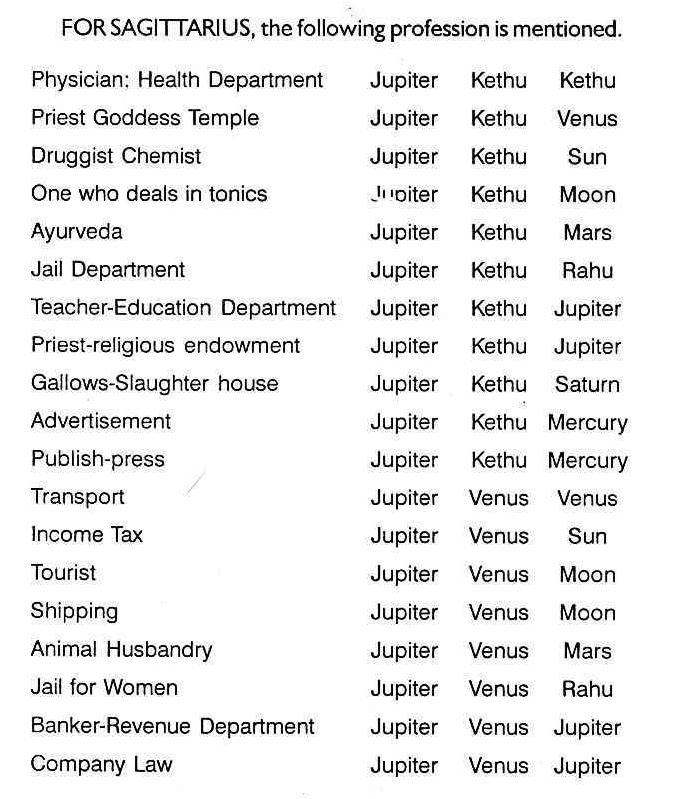

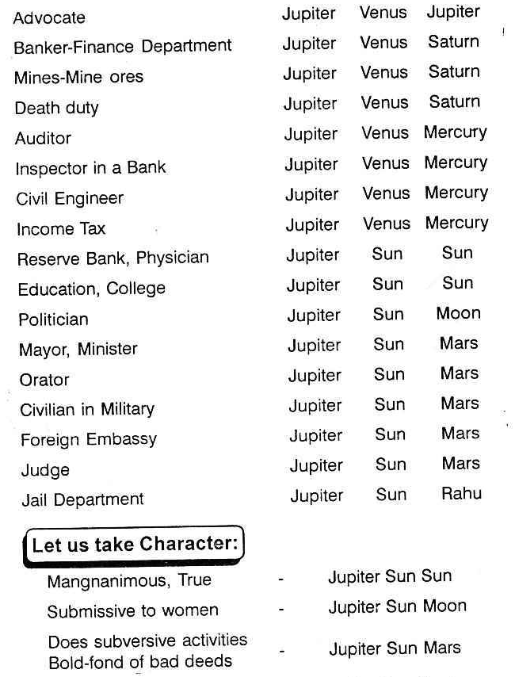

Therefore, one can note that hundreds of professions are indicated by the sign Sagittarius-Dhanus. But if we take constellations, each represents a few dozens of them. Sub exactly fixes the profession. Therefore, he who has the planets A, B, C, and D and if he runs ‘A’ dasa, he will then be magnanimous, reliable, honest, serve in Education Department or bank or be a physician. But when he runs the period of the planet ‘B’ he may be a politician or benefitted by a politician, then, if it is a benefic. When he runs the period of the planet ‘C’ he may be a civilian in Military, Defence Department, or an orator or a mayor or a minister. Planet ‘D’ may authorize him as one of the visitors of jails. Thus, the planet within these 3°-20' has to indicate many varieties. When the sub is applied, one can eliminate most of them and pinpoint on very few items which alone is helpful to the querist.

If one gives a list of appointments assigned to a sign just like the server presents a large number of items in a ‘Menu’ card in a hotel, what a task it is to make further selection. Specific ones are needed in those days, just like one wants to know the special dish of the day. Suppose there is a planet in a sign. Then, the planet is the source of light. It indicates the source of a result which a native enjoys by its nature, ownership, etc. If the planet is significator of 1, he gains by his own efforts and influence. If it is significator of 3, through brother or publication, he gains or loses, depending on the sub. If it is significator of 4, through mother or the matters signified by the 4" house, he has that result. If it is significator of 5, through speculation, music, or children he enjoys the result. Thus, the planet who transits or the planet whose period is running, shows how one gets the result, how a result is brought about, etc.

The sign indicates the extent to which one can enjoy as it shows whether the planet is strong or weak in that Sign. The lord of the constellation is that which shows the nature of the RESULT, i.e. in which house, the lord of the constellation is deposited and the house or houses it owns. Then the matters signified by those houses will manifest. Suppose the lord of the constellation owns the houses 3 and 10, i.e. Mars to Aquarius-borns or Venus to Leo-borns and they are occupying 3 house from Aquarius or Leo respectively, then the planet in Mars constellation to Aquarius-borns or that in Venus constellation for Leo-borns shows that one corresponds, interviews, or makes a short journey for a job. Then the favourable or unfavourable sub denotes whether he is successful or not. When? It will be during the conjoined period of the planet, star lord, and sub-lord.

Suppose a planet transits in a sign, e.g. take Jupiter. According to the principles available one cannot definitely state when one can have its beneficial results and also what result one can expect at a particular time. But by studying this book one can give correct prediction. Suppose in a small post office, one posts, say, 44 letters. All the 44 are put in one bag. So the contents indicate 44 places. If these are distributed into 3 bags, one may contain 19, the other 19, and the third 6. If there are 22 bags each for different places, these 44 will be distributed to the 22 bags on an average at two per bag. If one bag is missing, only now, it is easy for one to mention from the missing bag, to which places the letters belong. If all are thrown in one bag, one can say, that two of the 44 are missing and it is not possible to specify. But if it is distributed in 2 bags, even then, it cannot be specified. But if it is distributed to 22 bags (22 subs in one sign) it is easy to pitch up.

Further, a planet in the sub of an evil planet indicates loss, difficulty, or failure whereas the same planet, in the same star, but in the sub of a benefic, promises success, gain, and pleasure. The lord of the constellation may indicate the matters of the 7" house. The planet in the sub of a malefic causes enmity whereas that in the sub of a benefic brings in harmony and happiness. Also, the planet in the sub of an evil one threatens loss in litigation whereas that in the sub of a benefic indicates victory even though the constellation lord denotes litigation. If a planet indicates business, the stars governed by this planet show business and the planet in beneficial sub promises profit whereas that in the sub of an evil one threatens loss. The lord of the constellation may show any one walk of life to the native. It is the sub which decides whether that area is advantageous or not and thereby indicates whether the planet occupying or transiting therein will offer desirable results or adverse ones.

# Significance of Each Sub

The Zodiac is divided into 27 constellations and each constellation is subdivided into 9 parts. This subdivision is called "SUB". In this Textbook wherever SUB is used, it means one of the 9 divisions of the star.
Each star indicates many matters and when a prediction is to be offered, taking into consideration a planet and its situation in a constellation, one has to give many alternatives and hence the prediction will not be of much use to the querist. But if the sub is also included then, one can eliminate many of them and select a very few, out of the many indicated by the constellation.
What each sub indicates is given below:

**Aries**

1: Mars, Kethu, Kethu: (0-00-00)-(0-46-40). Always injury Scar in the head, congestion in the brains, epilepsy, Coma, worries about enmity, jealousy, abortion, Military, machinery.

2: Mars, Kethu, Venus: (0-46-40)-(3-00-00). Service, headache, trance, eye trouble, eruptive fever, worried about ladies, not his own, Venereal affection, Railways, Industry, Slaughter house, Butcher, Horse rider, jockey.

3: Mars, Kethu, Sun: (3-00-00)-(3-40-00). Faintings Cerebral anaemia, Reddish sore eyes, Severe headache on one side, Thrombosis, Veterinary surgeon, Criminal, Court, Jail, copper, Barren, Effeminate.

4: Mars, Kethu, Moon: (3-40-00)-(4-46-40). Congestion in the brains, boils, dispute in the family, Hysteria, Neuralgia, boilers, Steamboiler, Railways, Cerebal Haemorrhage, Insomnia, Worried about landed property and cultivation-poor yield.

5: Mars, Kethu, Mars: (4-46-40)-(5-33-20). Accident, Scar in the head-Haemorrhage, epilepsy, dispute, violence, Military, Police, Industry, Independent, Managing Director.

6: Mars, Kethu, Rahu: (5-33-20)-(7-33-20). Note what Rahu denotes to a person. Irritable, quarrelsome, diseased-Military Jail, Criminal Jail, Police Department, dogbite, Rabies, fear of black magic, litigation and landed property.

7: Mars, Kethu, Guru: (7-33-20)-(9-20-00). Brave, Congestion in the brains, malaria, meningitis, manager of factory, bank agent, religious endowment, executive officer, Criminal Session Judge.

8: Mars, Kethu, Sani: (9-20-00)-(11-26-40). Scar in the head, Small pox, boils, injury, Cerebral operation, coma, Insomnia, Filarial fever, Severe headache, Section Officer, Maistry, Iron, Steel Factory, Mine or land owner-Barren, abortion, false pains, irregular monthly periodicity.

9: Mars, Kethu, Mercury: (11-26-40)-(13-20-00). Epilepsy, Violence, Spasm, paralytic Stroke, quarrelsome, Petition writer, Typist, Mechanical Engineer, Land, Building Broker-Barren, no child.

10: Mars, Venus, Venus: (13-20-00)-(15-33-20). Amorous always fond of pleasure, chain smoker, injury above the eye, sportsman, deals in musical instrument, exhibition, maternity.

11: Mars, Venus, Sun: (15-33-20)-(16-13-20). Will carry out his affairs to the end. Magnanimous, Catarrh, injury around the eyes, dissipating habits, visual publicity, advertisement, railway, industry, Veterinary doctor, Criminal Lawyer and judge, Surgeon.

12: Mars, Venus, Moon: (16-13-20)-(17-20-00). Fond of hot drinks, avaricious, wanting in character, clever, silk, cotton, Fertilizer, Tea, Coffee, Hotel, Agriculturist, Shipyard.

13: Mars, Venus, Mars: (17-20-00)-(18-6-40). Ever active very healthy, fond of pleasure, Venereal distemper, Syphilis, barber, Sportsman, dealer in silver vessels and eversilver vessels, Cinema theatre, Studio, Mansion for marriage, Venereal experts.

14: Mars, Venus, Rahu: (18-6-40)-(20-6-40). Aspiring, lowborn person, Leucoderma, Leprosy, Automobile Industry, Slaughter house.

15: Mars, Venus, Jupiter: (20-6-40)-(21-53-20). Indulges in pleasure, clever and happy, escapes from accidents, has higher studies, sits for competitive examination, Successful sportsman, Goldsmith, owner of theatres, animal husbandry judge, Incometax Officer, Estate owner, Farms.

16: Mars, Venus, Saturn: (21-53-20)-(24-00-00). Lowborn, Mean minded, fond of other ladies, meeting with accident, ill repute, Veneral distemper, Catarrh in the head, Mucus, Noise to humour, lean due to gratifying one’s taste, Fertilizer, wrestler, Slaughter house, Mine products, Transport for mine, ores, Venereal expert, Agriculturist.

17: Mars, Venus, Mercury: (24-00-00)-(25-53-20). Wavering, author of books on Surgery, Maternity, and Sexual side, Engineering Contractor, Export import, Caterer.

18: Mars, Venus, Kethu: (25-53-20-26-40-00) Jealous, Diseased, Leucoderma , Syphilis, Poor vision, Catarrh, Veterinary Surgeon, Skins and hides, dealer in roots and pulps.

19: Mars, Sun, Sun: (26-40-00)-(27-20-00). Bold, active, dauntless, speculator, Plague, brain fever, Military, Police, surgical, defence department.

20: Mars, Sun, Moon: (27-20-00)-(28-26-40). Muscular body, Carbuncle, poxes, competitive mind, famous, pushful, acquires land, Navy, Travels, manufactures, Chemicals, Tonics.

21: Mars, Sun, Mars: (28-26-40)-(29-13-20). Robust health, Militant temperament, commanding appearance, argumentative ability, sharp fever, Malaria, eruptive fever, Cerebral Meningitis, injury, cut, accident, explosion, Match box, iron and steel vessels, war materials.

22: Mars, Sun, Rahu: (29-13-20)-(30-00-00). Leading temperament, eats much, attracted by others, wives, Plague, Filaria, Fire accident, burns in the body, Chemical Industry, Police, jail department.

**Taurus**

23: Venus, Sun, Rahu: (0-00-00)-(1-13-20). Speculative tendency, selfish; eye-sore, reddish eye, photographer, wool dealer, works in leper clinics.

24: Venus, Sun, Jupiter: (1-13-20)-(3-00-00). Social, generous, cheerful, swelling above neck, victory over enemies, costly jewels and dress, international trade, music, artist, decoration, tax collector.

25: Venus, Sun, Saturn: (3-00-00)-(5-6-40). Selfish, dishonest, pimples, throat troubles, poor voice, loss by bad debts, drawing master, draftsman, sculpture, industry, wool dealer, hair dressers or export of hair.

26: Venus, Sun, Mercury: (5-6-40)-(7-00-00). Intelligent, cheerful, best fitted for business, creative mind, tumor in the knee, polypus of the nose, broker, representative of drugs and pharmaceuticals, bill collector, engineer, valuation officer, assessor.

27: Venus, Sun, Kethu: (7-00-00)-(7-46-40). Discourteous, ill repute, enimical, jealousy, cataract, nose trouble, photographic, venereal expert, executive officer, religious endowment.

28: Venus, Sun, Venus: (7-46-40)-(10-00-00). Speculative mind, popular, prosperous, fruitful action, fond of company, benefit through government, realizes bad debts, acquires jewels and dress, decoration, poet, artist, silk, decoration, maternity, dance music, manners, sweet-tongued, lovely appearance, dairy farm, milk, scented oil, shipping, sugarcane.

30: Venus, Moon, Mars: (11-06-40)-(11-06-40). Taste in instrumental music, arranges public functions, pleasant life in the company of other sex, caters to the needs of the public, hotel, lodging house, bar attached, sandalwood, navy, cows, dealer of pearls, or acids.

31: Venus, Moon, Rahu: (11-53-20)-(13-53-20). One is to note down the position of Rahu in the horoscope and judge which planet is represented by Rahu. Then the results or the sub of planet is to be taken for the sub of Rahu. But generally one is to take that Venus Moon Rahu shows no settled minds, lacking in manners, lives on others, deals in plastic, dyes, tannery, fishermen.

32: Venus, Moon, Jupiter: (13-53-20)-(15-40-00). Apoplexy, swellings, maternal affection, sympathetic, steady person, lovely appearance, bakeries, shipping, judge, politician, sugar and sugar-coated tablets. Very good for higher education, and high position politics.

33: Venus, Moon, Saturn: (15-40-00)-(17-46-40). Selfish, funky, mischievous, stealthy action, cough, cold, irregular menses, pains in the legs, hotels with bar and all attached, petrol, oil, ice-cream, paint, submarine, tannery.

34: Venus, Moon, Mercury: (17-46-40)-(19-40-00). Tonsils, cerebellum, tongue, goitre, sore-throat, can argue both sides, enjoys nature, addresses public functions, at least vote of thanks: broker, engineer shipping, nurse, yarn merchant, pearls dealer, broker, contractor, clearing agent, water works engineer.

35: Venus, Moon, Kethu: (19-4)-00)-(20-26-40). Pimples, quinsy, tumor, defective voice or mui», unsettled mind, always worried, fear complex, dealer in fruits, tannery, skins, hides, observer of vows, yogins, service in petrel products.

36: Venus, Moon, Venus: (20-26-40)-(22-40-00). Very beautiful, attractive, sweet-tongued, humorous, fertile imagination, pain in the breast, swellings, cold, glass, plastic, dairy farm, petrol, oils, paints, shipping, aquatic animals, fishermen, wealthy person.

37: Venus, Moon, Sun: (22-40-00)-(23-20-00). Sore-throat, irregular menses, scanty bleeding, enjoys life in the presence of other women, reads light literature, bakeries, perfumeries, synthetic ones, acids, shipping department, sugar industry, agriculturist.

38: Venus, Mars, Mars: (23-20-00)-(24-6-40). Inflammation of pericardium, inflamed tonsils, dexterity, excitable, industrious, indulges in sexual pleasure even against the will of the partner, selfish, deals in machines, automobiles, tailors, corals.

39: Venus, Mars, Rahu: (24-6-40)-(26-6-40). Mark in the cheeks, jugular veins, dirty pimples, king's evil, tobacco, snuff, taxi driver, hire purchase, cinema, sound engineer, photography.

40: Venus, Mars, Jupiter: (26-6-40)-(27-53-20). Beautiful cheek, less of hair growth, carotid arteries, adenoid, goitre, estate owner, exhibition, platinum, animal husbandry, apple and bananas income tax and sales tax department.

41: Venus, Mars, Saturn: (27-53-20)-(30-00-00). Injury in the cheek and chin, pain in the throat, weak loins, constipation, venereal distemper, polypus, deals in lands and buildings, ever silver, dressmaker, estate duty, death duty, rickshaw puller, taxi driver, sandal powder, face powder, lethal chamber, slaughter house.

**Gemini**

42: Mercury, Mars, Mercury: (0-00-00)-(1-53-20). Injury in the shoulder and defective vocal cord. Surfeit, most energetic, alert, dealing in tools, electrical goods, telephone, telegraph, building contractor, radio, computers.

43: Mercury, Mars, Kethu: (1-53-20)-(2-40-00). Thymus gland, corrupted blood, fever, collar bone, excitable, vitriolic in their wrath, tongues more poisonous than rattle snakes, deals in surgical instruments, mechanical engineering, telegraph, dam site construction, thieves.

44: Mercury, Mars, Venus: (2-40-00)-(4-53-20). Vocal cord, throat, ears, itches, disorders in secret parts, inflammation of pericardium, fractured femur, sciatica, quick, imaginative, enthusiastic, sharp-witted, wealthy, indulges in sexual pleasure, ambassadors, astronomers, textile engineer, tape record, electronics, beasts, foresters, fruits, flowers, letter bearers, cables.

45: Mercury, Mars, Sun: (4-53-20)-(5-33-20). Shoulders, upper ribs, arms, excitable, fluent, eloquent, dexterity, telephone, telegraph, electricity, surgeon, soldier, press publication, All India Radio, surgical instruments.

46: Mercury, Mars, Moon: (5-33-20)-(6-40-00). Throat, thymus gland, mental energy, impulsive, mischievous, disorder in secret parts, inflammation, boils, ambassadors, mathematician, bridge construction, salesman, broker, bus.

47: Mercury, Rahu, Rahu: (6-40-00)-(8-40-00). Septic throat, eosinophilia, unsuccessful in literary pursuits, liar, ungrateful, sinful, atomic energy, research department.

48: Mercury, Rahu, Jupiter: (8-40-00)-(10-26-40). Septic throat, ear trouble, mums, ingenious, scholar, good character, reader, stock keeper, writer, explorer, finance broker, statistician.

49: Mercury, Rahu, Saturn: (10-26-40)-(12-33-20). Asthma, puss in the ear, education poor, handwriting expert, or committing forgery, finger print expert, physics.

50: Mercury, Rahu, Mercury: (12-33-20)-(14-26-40). Hicough, ear trouble, active mind, critical scholar, salesman, communication department, transport, aerial, atomic energy, writer, author, dynamics.

51: Mercury, Rahu, Kethu: (14-26-40)-(15-13-20). Septic throat, diptheria, jealousy, adulterer, thief, cruel minded, pseudonymous, petition writer, ungrateful, no child birth, research department, deals in poisonous drugs, canned goods, gravitation.

52: Mercury, Rahu, Venus: (15-13-20)-(17-26-40). Septic throat, dry cough, ear trouble, ingenious, humorous, artist, salesman, post and telegraph department, transport, radio, bus.

53: Mercury, Rahu, Sun: (17-26-40)-(18-06-40). Eosinophilia, pain in the shoulder, cruel minded, man versed in the art pertaining to boglings, holy, perfidious, atomic energy, research department, public appointment.

54: Mercury, Rahu, Moon: (18-06-40)-(19-13-20). Ear trouble, puss in the ear, asthma, intuitive, thief, boatman, deals in drugs, explorer, nurse, engineer.

55: Mercury, Rahu, Mars: (19-13-20)-(20-00-00). Septic throat, injury in the shoulder, critic, murderer, robber, rogue, mischievous, mechanical engineer, handwriting expert, finger print expert, police department.

56: Mercury, Jupiter, Jupiter: (20-00-00)-(21-46-40). Swelling in the ear, pulmonary apoplexy, broad outlook, proper judgment, true, rich, merchant, journalism, story writing, advertising, religious, finance broker, mayor, astrologer.

57: Mercury, Jupiter, Saturn: (21-46-40)-(23-53-20). Injury in the shoulder blade, inflammation, pain the ear, iodine deficiency, infiltration in the upper lob of the lungs, worldly wisdom, sincere, servant, insurance agent, messengers, postman, woolen merchants, provision dealers.

58: Mercury, Jupiter, Mercury: (23-53-20)-(25-46-40). Hiccough, asthma, active mind, ingenious, scholar, salesman, book seller, high official, competitive examiner, auto, research scholar, public appointment, service in the head of the department registrar, astrologer.

59: Mercury, Jupiter, Kethu: (25-46-40)-(26-33-20). Pleurasy, pneumonia, pulmonary apoplexy, poor judgement, abortive tendency, no peace of mind, worried, religious, interpreter, secretary, astrologer.

60: Mercury, Jupiter, Venus: (26-33-20)-(28-46-40). Bronchitis, arins disorder, good memory, proper judgment, well disposed, intelligent, rich, easily contented, inspector, poet, auditor, civil judge, civil engineer, Tamil pandit, clothier.

61: Mercury, Jupiter, Sun: (28-46-40)-(29-26-40). Throat affected, pain in the ear, broad outlook, clear in sight bronchitis, eosinophilia, advertising, visual publicity, judge, income-tax inspector, auditor, registrar, deputy secretary.

62: Mercury, Jupiter, Moon: (29-26-40)-(30-00-00). Pleurasy, pneumonia, good memory, correct intuition, merchant, estate broker, finance broker, politician, mayor, councillor, schoolmaster, interpreter.

**Cancer**

63: Moon, Jupiter, Moon: (00-00-00)-(00-33-20). Lungs, breast, lacteals, dropsy, beriberi, corrupt blood, jaundice, fertile imagination, honest, true, forgiving temperament, resourceful, sympathetic, banker, advocate, judge, traveller, sailor, dealer in fluid, nurse, midwife, water supply, tuberculosis.

64: Moon, Jupiter, Mars: (00-33-20)-(01-20-00). Pancreatic gland, mammae, diaphragm, beriberi, irregular appetite, corrupt blood, liver complaint, gourmandize, appreciates beauty, effective argument, good vitality and fertility, politician, born a prince, banker, physician, religious head, statistics, judge, professor, manager of public conveyance.

65: Moon, Jupiter, Rahu: (01-20-00)-(03-20-00). Stomach, oesophagus, thoracic, stomach upset, T.B., dyspepsia, reliable, resourceful, compassionate, politician, economics, principal, sailor, dealer in fluid, salesman, female official, jail for women.

66: Moon, Saturn, Saturn: (03-20-00)-(05-26-40). Lungs ribs, T.B. obstructions, cancer, eczema, pyorrhoea, economical, contemplative, patient, persevering, deals in kerosene, canals, jailer, tunnels, works in submarine, driver.

67: Moon, Saturn, Mercury: (05-26-40)-(07-20-00). Both lungs affected, nausia, phthisis, dyspepsia, self-reliance, systematic and intelligent action, position of trust, barely, canals, water works engineer, pumping set dealer, constructing bridges, kerosene agent.

68: Moon, Saturn, Kethu: (07-20-00)-(08-06-40). Gallaping, tuberculosis, belching, scurvy, jaundice, pyorrhoea, fisherman, deals in mine products or agricultural lands, plumber, grave digger.

69: Moon, Saturn, Venus: (08-6-40)-(10-20-00). Bruises in the breasts, cough, eczema, prudent, careful, liked by all, wealthy, petrol, petroleum products, trenches, engineers and draftsman, constructing dams.

70: Moon, Saturn, Sun: (10-20-00)-(11-00-00). Ulceration in the respiratory-system gallstone, methodical action, attains position of trust, learner, mine ores, copper, sexten, those who work underground.

71: Moon, Saturn, Moon: (11-00-00)-(12-06-40). Tuberculosis nausia, obstructions, attentive, contemplative, fisherman, kerosene, agricultural, digging wells, constructing tanks and impounded reservoirs, those working in the night.

72: Moon, Saturn, Mars: (12-06-40)-(12-53-20). Ulceration in the respiratory system, injury in ribs, gastric ulcer, bruises in the breast, petroleum products, coal, lands excavations, canals, trenches, tunnels.

73: Moon, Saturn, Rahu: (12-53-20)-(14-53-20). Galstone, tuberculosis, hiccough, agriculturist, jailer, grave digger, dealer in oil.

74: Moon, Saturn, Jupiter: (14-53-20)-(16-40-00). Gastric trouble, ulcer on the breasts, jaundice, economical, conservative, liked by all, learned, wealthy, virtuous, agriculturist, hold position of trust, works in the head of the department, deals in mines.

75: Moon, Mercury, Mercury: (16-40-00)-(18-33-20). Both the lungs and the stomach will be defective. Gas forming in the stomach will push the diaphragm up and breathing will be difficult, vitamin B deficient, hysteria, quick wit, versatile, mimicry, clown, fond of travels, hypocrite, agent, commerce correspondent, dealer in yarn, ink, water diviner.

76: Moon, Mercury, Kethu: (18-33-20)-(19-20-00). Hysteria, fear complex, dull liver, acquires other languages easily, failure, ungrateful, sinful, guide, hostess, midwife, nurse, plurality in everything.

77: Moon, Mercury, Venus: (19-20-00)-(21-33-20). Windiness, drunkenness, hypochondria, dropsy, imitates other, good in music, art, insincere, fond of honeymoon, picnic, other’s company, international trade, paints, ambassador, travelling, agent, midwife, hostess, nurse, very good painter.

78: Moon, Mercury, Sun: (21-33-20)-(22-13-20). Dull liver, poor digestion, constipation, jaundice, textile department, nurse, mental hospital.

79: Moon, Mercury, Moon: (22-13-20)-(23-20-00). Cold, drunkenness, hysteria, dropsy, imitates others, mimicry, salesman, ink, artist, water supply engineer, textile engineer, midwife, versatile.

80: Moon, Mercury, Mars: (23-20-00)-(24-06-40). Flatulence, nephritis, pain in the stomach, ulcer, correspondent, manufacturer of ink, textile, travelling agent.

81: Moon, Mercury, Rahu: (24-06-40)-(26-06-40). Typhoid, vitamin ‘B’ deficiency, jaundice, phaent, copious in speech, fond of travel, insincere, sinful, ungrateful, good businessman, depending on the position of Rahu predict the profession.

82: Moon, Mercury, Jupiter: (26-06-40)-(27-53-20). Diaphragm, pancreas, liver, wind pressing the diaphragm, makes it difficult to breathe, dropsy, beriberi, good writer, learns art and literature, always travels, grateful, author of books, writer, international trade, commerce, banking, accounts, ambassador.

83: Moon, Mercury, Saturn: (27-53-20)-(30-00-00). Lungs, stomach, vitamin ‘B’ deficiency, pains in knees and legs, phlegm, deceitful, underhand dealings, water diviner, manufacture of ink, service in textile department, hostess, nurse.

**Leo**

84: Sun, Kethu, Kethu: (0-00-00)-(0-46-40). Disease in the heart, Palpitation, Giddiness, Congestion, chemical, Medical, Government, Security in service, Physician.

85: Sun, Kethu, Venus: (0-46-40)-(3-00-00). Spinal Meningitis, Syncop, Epilepsy, Swelling, Optician, Skin expert, Leucoderma, Leprosy, Transport, Automobile, Women & Children Hospital, Chemical.

86: Sun, Kethu, Sun: (3-00-00)-(3-40-00). Thrombasis, Sunstroke, Unconscious, Eye trouble, Medical, Hospital, Service, Permanency.

87: Sun, Kethu, Moon: (3-40-00)-(4-46-40). Boils, Thrombosis, Headache, Trouble in Aorta, Vena Cavae, Neuralgia, Shipping, Navy, Boilers, Regurgitation in the heart, confusion.

88: Sun, Kethu, Mars: (4-46-40)-(5-53-20). Epilepsy, Heart Disease, Locomotor Ataxia, Interspinal muscles, Spinal marrow, Dispute, litigation, Defence, Police, Industry.

89: Sun, Kethu, Rahu: (5-33-20)-(7-33-20). Note what Rahu indicates to that native. Disease, Blood Poisoning, Wrong Medicine, Black-magic, Meningitis, Dorsal Vertebra, Jail Department, Lethal Chamber, Fear, Depression, Disharmony.

90: Sun, Kethu, Jupiter: (7-33-20)-(9-20-00). Philosophical Religious, Cancer, Congestion, Enlargement, Regurgitation, Bank Administrator, Advocate, judge, Religious Endowment.

91: Sun, Kethu, Saturn: (9-20-00)-(11-26-40). Rheumatic fever, Rheuniatic heart, Affection of bony system, Chronic ailment, High fever, smallpox, position of trust, head of the department, factory, -copper, steel, mine, real estate, abortive, denial of children, irregular monthly periodicity, defect in generative system, homeopathy.

92: Sun, Kethu, Mercury: (11-26-40)-(13-20-00). Nervine trouble, Palpitation of the heart, Meningitis, Giddiness, Pestilence, Ingenia, Audita, petition, writer, typist, journalist, advertising — no issue, barren.

93: Sun, Venus, Venus: (13-20-00)-(15-33-20). Good complexion, beautiful, fondness for company, pleasure, generous, eye defect, mother or wife falls ill, gains money through business, speculation, social affairs, music, fine arts and chemistry.

94: Sun, Venus, Sun: (15-33-20)-(16-13-20). Most generous, amiable, affectionate, eye-defect, palpitation of the heart, bright disease, service in Hospital, Chemistry department, music, radio, women and children hospital, government service, stock exchange.

95: Sun, Venus, Moon: (16-13-20)-(17-20-00). Pleasure, sociability, comfort, impressionable, warm attraction, love affairs, disease of ovaries, enlarged tonsils, mucous diseases, service in cosmetics, navy, shipping, petrol refineries.

96: Sun, Venus, Mars: (17-20-00)-(18-6-40). Fond of pleasure, adventure, amorous, sports, music, instrumental, artistic, extravagant, wastes money, veneral diseases, cataract, good for advertisements, display, automobile, independent, chemical engineering industry, transport, surgical instruments, petroleum products, medicinal soaps.

97: Sun, Venus, Rahu: (18-6-40)-(20-6-40). Find out the position of Rahu. One is to find out the health and the profession. If Rahu were to be in Moon star Mercury sub one will suffer from brain disorder. So it is necessary for us to note down what Rahu can do and the result must be modified.

98: Sun, Venus, Jupiter: (20-6-40)-(21-53-20). Indicates that the native will have much bloods, obstructions, corrupt blood, fever, boils, tumours inflammations judge, income tax department, ladies college, women and children hospital, administrator in transport, animal husbandry.

99: Sun, Venus, Saturn: (21-53-20)-(24-00-00). Much afflicted by bad things or poison, weakness, pains in the duct, leather, skin, hides, physician for skin diseases, lethal, chamber, slaughter house, canning the non vegetarian food.

100: Sun, Venus, Mercury: (24-00-00)-(25-23-20). Troumblings, palpitation of the heart, pains in the back, nervous debility, sanitary engineer, chemical engineer, salesman for drugs.

101: Sun, Venus, Kethu: (25-23-20)-(26-40-00). According to the position of Kethu, one is to give the results.

102: Sun, Sun, Sun: (26-40-00)-(27-20-00). Generally healthy constitution, rapid recovery when ill, seat of affection, heart, spinal column, thereby causing palpitation, heart disease, spinal meningitis, sunstroke, disease of eye, brain fever, typhoid, etc. Permanent position in life, seeks highest position in commerce or Government, Managing Director, Chief Administrator, ruler, dictator, gets cooperation from subordinates, dauntless speculator, earnest lover, passionate, jeweller, precious metals, physician, medical department, police, cinema and games etc.

103: Sun, Sun Moon: (27-20-00)-(28-26-40). Blood pressure, dropsy, eruption on faces, poxes, dysentry, boils, pusturation. Service in shipping, navy commander, ship master, deals in liquids, tonics, marine engineer, mechanical engineer.

104: Sun, Sun, Mars: (28-26-40)-(29-13-20). Robust health, good appearance, fair complexion, hotty disposition, energetic, very violent, over optimistic, bold, unfit for subordinate jobs, always tendency to boss over others, wealthy, stock-exchange, loss in lottery, war material. Military or police, defence department, military high command, successful surgeon, pain in back, venereal distemper, gives landed property, higher education, frequent long journey.

105: Sun, Sun, Rahu: (29-13-20)-(30-00-00). Leading tendency, disposed towards other's wife, plague, jail department, heart disease, giddiness, high fever, unpleasant domestic environments, palpitation, regurgitation.

**Virgo**

106: Mercury, Sun, Rahu: (0)-(1-13-20). Careless about diet, abdominal diseases, intestinal trouble, typhoid, cough due to gas, a little nervous debility. Accountant in jail or in such department indicated by Rahu according to its position in horoscope, medical department, nervous system, designer, engineer, consultant, contractor for supplies to the above departments.

107: Mercury, Sun, Jupiter: (1-13-20)-(3-00-00). Flatulence, never careful about diet, overeating, defect in assimilation on absorbtive system, schoolmaster, interpreter, registrar, journalist, inspector of schools, banks, income tax office, revenue department, preacher of religion.

108: Mercury, Sun, Saturn: (3-00-00)-(5-6-40). Reckless about diet, eats anything and everything, tapeworm (it is only in those who take mutton), mines engineer, coal dealers, watchmen night workers. In press, they deal with lead, that is: linotypist, composer, handwriting expert, forgery.

109: Mercury, Sun, Mercury: (5-6-40)-(7-00-00). Nervous breakdown, ulcer in mouth due to ulcer in stomach, irregular intake of food at short intervals, writer, literature, literary people, interpreter, messenger, postman.

110: Mercury, Sun, Kethu: (7-00-00)-(7-46-40). Food poisoning, diarrhoea, sprue. For profession see the position of Kethu in the horoscope and then predict.

111: Mercury, Sun, Venus: (7-46-40)-(10-00-00). Good diet, very active, good health, vitamin ‘B’ deficiency and gas formation. Dance, artist, worker, sweetmaker, confectionery.

112: Mercury, Moon, Moon: (10-00-00)-(11-6-40). Trouble in the intestine and also in the breast. Hypochondria (think while walking and imagine being ever sick), Chyle defective, avoid worries and discontentment, avoid alcohol, clearing agency (mostly shipping), textile, engineer in water works.

113: Mercury, Moon, Mars: (11-6-40)-(11-53-20). Bleeding piles, irritation, ulcer in intestines, dealers in fluids, boilers, mechanical engineers, and marine engineers, those who manufacture printing ink (press ink). Agent to supply fish, prefers very hot drink and food.

114: Mercury, Moon, Rahu: (11-53-20)-(13-53-20). Predict according to the position of Rahu in the horoscope.

115: Mercury, Moon, Jupiter: (13-53-20)-(15-40-00). Overeating, diarrhoea, cancer in intestines, poor assimilation (without Jupiter cancer cannot appear. Jupiter also always covers absorbtive system and gives excess, expansion fat etc.) Those who print for others, publisher, and gives royalty. Navy accountant, connected with port-trust and also manage in textile mill, cloth merchant or agent.

116: Mercury, Moon, Saturn: (15-40-00)-(17-46-40). Causes constipation, completely dries up, flatulence, pain, chronic disease, gas formation. Diggers (of wells, canals). Excavators, geologists, mine engineers. Those who are agents to supply liquid fuel to railways, Kerosene, diesel oil. Advisers to give courage to commit forgery.

117: Mercury, Moon, Mercury: (17-46-40)-(19-40-00). Nervous breakdown, very poor digestion, very poor memory, feeling uneasy and restless, irregular timing for diet, disorder of bowels. Personal assistant, personal clerk, camp clerk, messenger, engaged orator (who are paid money for speeches), engineer, salesman, midwife (moon for nurse and mercury for assistance).

118: Mercury, Moon, Kethu: (19-40-00)-(20-26-40). Predict after finding out the position of Kethu in the horoscope.

119: Mercury, Moon, Venus: (20-26-40)-(22-40-00). Excessive intake of greens, sweets, drinks, Round worms. Due to drinks upset of bowels, sugarcane juice rather all sweet juices, shipping, marine, textile engineers, manufacturers of glass or spectacles. Artificial textiles like silk (soft, bright, beautiful), painting on cloth.

120: Mercury, Moon, Sun: (22-40-00)-(23-20-00). Mechanical engineer, marine engineer, nurse in medical department, agent to supply goods to Government, Nervous department in a Hospital.

121: Mercury, Mars, Mars: (23-20-00)-(24-6-40). Ulcer in intestinal part, surgical aid needed, mostly duodenal ulcer, takes care of diet, typing, printing press, military accounts, mechanical or military engineer, mind to save money by blackmarket, attaches more value to money, finds fault with others.

122: Mercury, Mars, Rahu: (24-6-40)-(26-6-40). Note which planet is represented by Rahu and then whatever that planet and Mars and Mercury combination indicate is the result. Suppose the sublord is Venus, this combination is in Gemini so the result will be given accordingly. Suppose sublord is Saturn then this combination is in Virgo and result is given accordingly. This is the way how you should proceed in the case when node is a sublord of any combination in any sign of the Zodiac.

123: Mercury, Mars, Jupiter: (26-6-40)-(27-53-20). Mentally very quick, commercial instinct (Mercury-instinct, lord of 1 and 10), Jupiter (Bank Administration and lord of 4 and 7 and Mars industry) Good health. If Jupiter, the sublord is also a significator of 6th house, then only Cancer in old age. Profitable investment, automatic accumulation of money. Has own ideals in selecting a partner in business or wife/husband. Publisher, accountant in a bank, vice principal, professor, administrative department in engineering, accounts or defence department. A person who goes round and round and preaches religion.

124: Mercury, Mars, Saturn: (27-53-20)-(30-00-00). Most fish, commits forgery, theft, black market, health not good, worms in intestines constipation, works very hard, miserly, feels shy in a crowd, avoids or shuns society. Good in mathematics, statistics, physics, dynamics, mines engineering, Hookworm, chronic disease (finger print office, CID, CBI (for government service SUN should also be connected) If ascendant falls at this point he himself is a thief, forger and if 6th or 10th houses are connected then in CID/CBI department.

**Libra**

125: Venus, Mars, Mercury: (00-00-00)-(1-53-20). Care more for peace and pleasure and harmony (Libra being for balance) mental equilibrium, compares and contrasts, correct intuition. Brilliant, good health. Boring people by giving meticulous details. Very good to write and publish books (Mercury to write and paper, Mars and Mercury to print), hernea. Being 7th sign of the Zodiac, business with partners as sublord mercury is for plurality, advises and assists hence a good adviser. Story writer, Venus for love and beauty and passion and the 7th sign hence good in love affairs. Mercury being wavering and lord of 12th to this sign, he never gives his opinion, keeps it secret and never makes selection. Uterus removal why, because this sign shows the part and sublord Mercury being lord of 12 is for loss and Mars is to cut, hence removal.

126: Venus, Mars, Kethu: (1-53-20)-(2-40-00). To whomsoever Kethu represents in the horoscope that planet along with Mars and Venus should indicate the result. Spines would be affected.

127: Venus, Mars, Venus: (2-40-00)-(4-53-20). Level headed, dispassionate personal comforts, helps others, pleasant nature, fond of opposite sex (Mars & Venus indicate greens) Venus shows eatables hence appendicitis due to eating of green vegetables etc., spendthrift, able salesman, popular. Business with partners. Why? Because Venus is lord of 1 and 8 (partner's money and Mars lord of 2 and 7, your money and 1 and 6 show self and partner. Dealer in 2nd and 4th hand goods (vehicles Venus and Mars for 2nd hand goods and their repairs). Venus being indicator of pleasantness and Mars lord of 2 and 7 (2nd is for speech) so when both speak it is conversation hence pleasant conversationalist. Sincere, enjoys in full.

128: Venus, Mars, Sun: (4-53-20)-(5-33-20). Ulcer in the urinary tract, lower abdominal region, transport department (Sun for Government office, Venus for vehicle and Mars for authority, administration). Locoshed, military truck/van, magnanimous and sincere. Mars is for muscles and Sun for energy hence very good health. Such people should not employ opposite sex as their private secretary because they have no control. Here if the sublord Sun is deposited in the constellation of a planet in fixed sign then locoshed service as fixed is for service which gives fixed income. If it is deposited in the constellation of a common sign they fly, goes and comes back, if it is in movable sign then he leaves and takes that job. Movable sign shows business.

129: Venus, Mars, Moon: (5-33-20)-(6-40-00). Helps others, politician, fertile imagination, gentle, susceptible to all disease as there is no resistance, if Moon is a significator of 6th house then difficulty in monthly period for ladies. Satisfies the partner. Most lovable. If Moon is the sublord of 5th cusp, then sincere in love affairs.

130: Venus, Rahu, Rahu: (6-40-00)-(8-40-00). Whatever planet is represented by Rahu, that planet and the combination of Venus should offer the result, Venus and Rahu go in for not productive and barren hence birth control. Jupiter & Rahu is for birth control and if Rahu is connected with Mars then they will have surgical aid to see that no more child is produced. Similarly see what other planets are connected with Rahu and predict accordingly.

131:-138: As it is done for Arudra, you can predict for each sub in Rahu star (Swathi) from 8-40-00 to 20-00-00.

139: Venus, Jupiter, Jupiter: (20-00-00)-(21-46-40). Health very good, spendthrift, beautiful and a charming figure, very generous and noble, always for plenty, if Jupiter is significator of 6th house then the diseases it gives is Cancer. Hernea, enlargement of glands in lower abdominal region. Judge, income tax/hire purchase, broker, money lender, professor in ladies college, cashier in ladies club. True and honest people, marries one who may love.

140: Venus, Jupiter, Saturn: (21-46-40)-(23-53-20). If Saturn is significator of 2, 7 and badakasthana then infantile mortality otherwise very good life with all comforts. Chronic (Sat) disease, kidney, loins trouble, internal part damaged hence uterus removed. Insincere, unreliable, most diplomatic, hypocrite, never an extreme, selfish, self-centered. Any subordinate in revenue department, bank, court, law, transport departments as Saturn is for servant, Jupiter for administration, skin/hides merchant as Venus is for skin, Saturn for death, Jupiter for trade/shop. If Jupiter is significator of 2nd house, he deals with money purse, 3 with gloves. 12 shoes and 7th belts. Hence supplier/manufacturer/shopkeeper dealing with these items.

141: Venus, Jupiter, Mercury: (23-53-20)-(25-46-40). Supremely intelligent. Very noble master for his servants, always touring, pleasant conversationalist, enjoys life in full. Most lovable. Very good adviser — legal or income-tax. Takes enough precaution (Mercury) hence avoids diseases, especially epidemic. Able salesman, comedy/novel writer. Propaganda, publicity. If Mercury is the sublord of 5th house then many children, or love affairs with many, wealthy, income-tax, high-court, AGCR, audit/accounts departments, twin birth, plastic, glass, mirror, engineers.

142: Venus, Jupiter, Kethu: (25-46-40)-(26-33-20). Kethu is for abortion, faces difficulties, blackmailing, secret enemies, signs papers which he should not have signed and gets into trouble.

143: Venus, Jupiter, Venus: (26-33-20)-(28-46-40). Ever trying for peace, never quarrelling, proper judgement, correct action, good judge, assessment in income-tax office. Transport or loan department in a bank. Air travel/airport as Jupiter is for air, ether, akasa. Very good health, normally does not suffer from disease, everything takes easy and everything is prearranged for him, has all comforts, becomes very rich. Neither with brother nor with neighbour he will have peaceful life.

144: Venus, Jupiter, Sun: (28-46-40)-(29-26-40). Robust health. Very beautiful to look at, generous and magnanimous, chemical/drugs/pharmaceutical dealer, income tax, salestax, revenue department, court, religious endowment, hospitals (nurse-Sun and Moon for common cusps for this), marries one whom he loves, Jupiter for development, Sun and Venus a combination for social gathering. Security in service because of Sun (steady, stability).

145: Venus, Jupiter, Moon: (29-26-40)-(30-00-00). Nurse, midwife, navy/shipping as Moon is for liquid, water, politician because Jupiter and Venus are called celestial ministers, kidney trouble, bladder trouble, puss in urine if Saturn aspects; clubs, society, crowds etc. Administrative officer in petrol, liquids, refined oils. Moon, Sun and Venus being luminaries hence for vision, manufacturers of glasses, spectacles, mirrors etc. Moon is for business hence successful businessman.

**Scorpio**

146: Mars, Jupiter, Moon: (00-00-00)-(00-33-20). Plump (Jupiter for fat) tall in figure. Very clever as Jupiter is for worldly wisdom, God's grace, Moon for mind and Mars for quickness, always optimistic, likes and dislikes strong. Disease in the bladder. For ladies, profuse bleeding during monthly period. Complex mood in love affairs, politics, banker, judge, vice principal as Moon is for advice, Jupiter for education and Mars for authority, as also it is the 8th sign of the zodiac which shows him to be a family member of the institute/office he is employed in (7).

147: Mars, Jupiter, Mars: (0-33-20)-(1-20-00). Commanding (Mars) appearance, sharp and curly hair. Muscular body (Mars) never mindful of obstacles because Mars is for rash, dash and crash. Overcritical, self assertion, impulsive action. Get excited, quick recovery from disease as Mars is for quickness as well as resistance and Jupiter is God's grace. Veneral distemper. Prostrate glands. Makes large money, no mind to save, fortune favours. Expects appreciation from lover. Keeps the partner in good cheer, energetic.

148: Mars, Jupiter, Rahu: (1-20-00)-(3-20-00). According to the planet which Rahu represents in his horoscope, prediction should be made.

149: Mars, Saturn, Saturn: (3-20-00)-(5-26-40). Lean (Saturn for emaciation) tall, appear older than age (Saturn for old, chronic, labour, idle etc) hence hardworking, gossip, funky (Saturn for no courage), never interfering with others. (Scorpio being the sign of sexual organ and watery also) hence piles and ovary diseases, scanty flow of monthly to ladies. Very stingy (scorpion), miserly (Saturn), mine and its products (Saturn for underground), metals. As Saturn is for underground material and Scorpio is a Mars sign for lands and estate so also Saturn therefore, deals with agricultural estate and specifically for underground bulbs like potatoes, onions, carrots, turnips, groundnut etc., lacks sympathy from lover.

150: Mars, Saturn, Mercury: (5-26-40)-(7-20-00). Long nose (Mercury), lean (Saturn) thin chin (Saturn lord of 3 cusp for this lagna), ever wavering because of Mercury. Never idle because of Mars and Saturn and Mercury lord of 8th and 11th and 8th is for labour. Resourceful (Mars for authority, power, Saturn for confidence, trust and Mercury for talk, contact) successful bargain. Mars and Mercury for forgery in talk and documents and Saturn knows no law. Service in fingerprint bureau, CBI, CID if meridian falls at this degree but if ascendant falls at this point then he himself a fifth columnist, spy, Saturn is always for stone and bone hence diseases he would have are gravel, stone in bladder, adenoids, (Mercury for paper), inspection, accounts, plurality and being lord of 8th and 11th, Mars lord of 6th house keeps more than one account to hide black money from government/partner in business etc. Gives expression to his attachment to the lover but wavering (Mercury), fluctuating bank position that is when 2nd cusp falls at this position in Scorpio then Mercury is lord of 12th which shows expenses etc.

151: Mars, Saturn, Kethu: (7-20-00)-(8-6-40). Predict according to the planet which is represented by Kethu in his horoscope.

152: Mars, Saturn, Venus: (8-6-40)-(10-20-00). Good health, robust, veneral distemper as Scorpio denotes sexual organ and Saturn a chronic, Mars for boils and Venus kama hence ever dreaming other sex. Impulsive due to Mars, appears to be plain due to Venus but Saturn who knows no law and Mars is force, therefore actually he is not. Venus for Kama, Saturn for secrecy, Mars for force and therefore very loose in character, pleasant (due to Venus lord of 12th) expenses. Sympathetic. Enjoys all comforts. Drinks much (Scorpio is a watery sign, Mars and Saturn for intoxication and Venus also for liquid. Service in slaughter house as Scorpio is 8th sign (for death,) grave digger; Saturn is through the ground, to dig and also to do labour or service. Officials in Secret Police because Mars is for police, Saturn for secrecy. Gallows, jail, causality ward, Scorpio 8th sign to show danger and injury by Mars. Bone fracture because Saturn is for bone. Remember 6th and 8th show disease and danger 6th and 10th for the doctor who cures that disease.

153: Mars, Saturn, Sun: (10-20-00)-(11-00-00). Healthy body, steady due to Sun, gets irritated due to Mars and Sun. Interested in psychic (8th sign) subjects. Never follows old custom, deals in wool/hair dealer as Mars is for trade and also to cut, Saturn for hair. 8th sign being a generative organ hence only when Sun is significator of 6th house. Sun is for Govt. Dept., Saturn for underground metal hence dealer in mines and metals. Mars for authority, Saturn for death and Sun for Govt. Dept., hence Death Registrar. Saturn for Secrecy, Mars for Police, Military and authority, power and Sun Govt. hence CID, CBI departments of the Govt., Blackmailing.

154: Mars, Saturn, Moon: (11-00-00)-(12-6-40). Good personality, broad face, medication/concentration as Moon is lord of 9th. Interest in mysteries of nature when 12th cusp falls here. Lazy due to lame Saturn and puts off things to the last moment. Proper intuition, prompt action, puss (Moon liquid and Saturn puss and Mars boil/cut etc.), gonorrhea, chronic ailment. Renal stone (Saturn for stone) miserly, Moon for liquid Saturn for underground and to pierce through it for boring/excavation etc., hence petrol, oil tank or well excavator. A little reserved, funky, partner leaves when Ascendant or lagna falls here. Steady in love affairs.

155: Mars, Saturn, Mars: (12-6-40)-(12-53-20). Independent (Mars) arrogant and revengeful (Mars) intelligent, never mindful of obstacles, muscular body (Mars), good personality. If sixth cusp falls here then bleeding piles. (Mars for blood and boil and Saturn shows a chronic disease and Scorpio sign shows the part of the body.) Saturn for stone, bladder shown by the sign hence stone in bladder. Saturn is Yama, to cause death and level by piercing through the ground, Mars is for land and machinery hence bulldozer/tractor to plough and also level the ground/fields, also all implements used to pierce the land like spade etc., Saturn also shows filth hence to lay pipes for drain and sullage underground. Saturn is through the ground and hidden and Mars is also for roads and building hence a hidden road is a tunnel. Proves to satisfy the partner. Deep meditation, working in cremation/burial ground. Scorpio is 8th sign (for death,) grave digger; Saturn is through the ground, to dig and also to do labour or service. Officials in Secret Police because Mars is for police, Saturn for secrecy. Gallows, jail, causality ward, Scorpio 8th sign to show danger and injury by Mars. Bone fracture because Saturn is for bone. Remember 6th and 8th show disease and danger 6th and 10th for the doctor who cures that disease. 

156: Mars, Saturn, Rahu: (12-53-20)-(14-53-20). As Rahu indicates, so shall be the prediction. 

157: Mars, Saturn, Jupiter: (14-53-20)-(16-40-00). Well-built body, clever, good imagination. Manager/administrator, owner of mines. Philosopher (SAT). Interest in psychic subjects/will not accept any theory. Non-interfering, analytic, thoughtful and resourceful. Steady in love affairs and never a cheat. Jupiter when sublord and a significator of 6th cusp, it gives Cancer. Incurable disease in the sexual organ denoted by Scorpio. 

158: Mars, Mercury, Mercury: (16-40-00)-(18-33-20). Long nose, clever, over critical, sharp in intelligence, quick grasp, versatile, good lawyer/actor/salesman/representative/liaison officer. Revengeful due to Mars. Typist, proof reader, press (as Mercury is for paper, type, print, publish and Mars is for machinery). 

159: Mars, Mercury, Kethu: (18-33-20)-(19-20-00). As per Kethu you may offer the prediction. 

160: Mars, Mercury, Venus: (19-20-00)-(21-33-20). Beautiful, muscular body, marine engineer, good personality, intuitive, frank and plain. Fistula, complicated disease, venereal distemper, makes large money and spends much also. Fortunate, sympathetic, expects appreciation from partner. Most comfortable life, smooth life. Works in power house, sanitary engineer, bridge construction. Lays bricks for lakes. Railway bridge construction. Tailor, readymade cloth, goldsmith. 

161: Mars, Mercury, Sun: (21-33-20)-(22-13-20). Military engineer, mechanical engineer, adviser, healthy, round face, intelligent, steady, methodical, rational, practical, quick recovery. Steady income and steady expenses. No fluctuations, steadiness in love affairs. Government press, mint. Reserve Bank/incinerator to destroy currency notes. Mercury is for paper and print and currency and Mars a fiery planet to set fire to it. Sun and Mercury indicate notes and 8th sign is for death. Epileptic (Mars and Mercury for fits), violent hysteria as Mars is for violence. 

162: Mars, Mercury, Moon: (22-13-20)-(23-20-00). Very healthy body, changeability due to Moon. Crossing floor. Fistula, bleeding piles. Fisher in rectum. Moon and Mercury for textile, electric engineering, powerhouse engineering, boiler and its inspector. Ink (Mercury to write, Moon the liquid and Mars for ribbon), dye, bridge/construction contractor. 

163: Mars, Mercury, Mars: (23-20-00)-(24-6-40). Well built body, short and curly hair, intense feeling, emotion, self-assertion, impulsive action, surgeon, stone in bladder, kidney, surgical aid for the womb/ovaries. Extravagant, ever borrowing, purchases doubly (in multiplicity, each item in plural numbers). Mechanical engineer. Press technology, iron bridge construction using girders. Swinging bridge, suspension bridge etc., cost accountant, inspector. 

164: Mars, Mercury, Rahu: (24-6-40)-(26-6-40). Typhoid, warden/superintendent in jail. Apart from this any other result given by that planet which Rahu represents. 

165: Mars, Mercury, Jupiter: (26-6-40)-(27-53-20). Hale and healthy, stalwart. Talkative, versatile. Meditation (preacher and not practising philosophy as Jupiter is to preach and Saturn to practise it). Income-tax officer, auditor, chartered accountant, press manager, administration department of engineering. Head in postal department. Tele, cable and all forms of communication. Incurable disease-complicated disease. 

166: Mars, Mercury, Saturn: (27-53-20)-(30-00-00). Eyes deep set, long nose, no cheek at all. Mercury is for both sides, Saturn is for emaciation. Injury in hip bone. Chronic piles. Stone in bladder. No comfort of bedding. No good furniture. Great interest in mysteries of nature. Philosophical. Can meditate, concentrate, pray and also hypnotise others. Forgery master. Handwriting experts. Service in press. Mines engineer, metal dealer. Stenographer Mars and Mercury for typing and Saturn to shorten. Deals in lead (Saturn), drainage, sewerage. Saturn for cold, ice and watery sign also hence frigidaire. Mars and Mercury for mechanical engineering.

**Sagittarius**

167: Jupiter, Kethu, Kethu: (00-00-00)-(00-46-40). High eyebrows and bushy hair. KETHU is for hair and abortion and this sign being dual in nature it may be two abortions and also it may be stillborn child and only delayed menses and no child, at all. Bold, greedy, God-fearing, Karma yoga, lung trouble, hiccough, asthma, physician, speculation, spends much, cares more for society than for family life. Allows much freedom to wife.

168: Jupiter, Kethu, Venus: (00-46-40)-(3-00-00). Well-proportioned body, beautiful, enthusiastic and energetic, sincere, true, honest, diabetes, earns by fair means, no black money, cares equally for society and for wife.

169: Jupiter, Kethu, Sun: (3-00-00)-(3-40-00). Well-developed body, broad eyes, aspiring, ambitious, honest good vitality, good health, quick recovery, bank, education, revenue, religious Departments, steady in love affairs.

170: Jupiter, Kethu, Moon: (3-40-00)-(4-46-40). Timid, lack of confidence, plumpy body yet charming appearance, wavery, lacks decision, changeability, leading to TB, politics, bank-export, long journey, change of residence, lacking morality, cannot be relied upon in love affairs.

171: Jupiter, Kethu, Mars: (4-46-40)-(5-33-20). Well-proportioned body, muscular, optimistic, bold, dauntless, overconfident, invalid children, eosinophilia. Blood poisoning, surgeon, makes plenty of money and equally spending it. Speculation fails. Abortion, wife enemic, impulsive. Neither integrity nor morality. Manager/Director/traveller makes fortune in a foreign place.

172: Jupiter, Kethu, Rahu: (5-33-20)-(7-33-20). Find out significators of Rahu and Kethu and offer the prediction accordingly.

173: Jupiter, Kethu, Jupiter: (7-33-20)-(9-20-00). Well-built body, commanding appearance, ambitious, confident, enthusiastic, never gets disheartened, lumbago, trouble in lungs, CANCER, earns by fair means, false prestige, donates much, revenue, religion, college, physician.

174: Jupiter, Kethu, Saturn: (9-20-00)-(11-26-40). High and bushy eyebrows, lean, beautiful, poor vitality, lazy, lethargic, failures, obstacles, fracture in hip, rheumatic pain, asthma philosopher, black money, speculation failure, miserly, beneficial friends, very jealous of others, keeps accounts of other’s money, suspicious about wife/partner in business activities/character.

175: Jupiter, Kethu, Mercury: (11-26-40)-(13-20-00). Graceful look, beautiful, lacking decision, versatile, crossing of floor, affection of lungs, asthma, earns by all means. Many accounts to hide black money. Successful speculation, gains through partner in business, interest in games. Gives freedom to his wife. Accountant, author, revenue/bank, teacher, journalist, astrologer.

176: Jupiter, Venus, Venus: (13-20-00)-(15-33-20). Very handsome, well-proportioned body, charming appearance, graceful look, victory over enemies, becoming more and more confident, sincere, not wavering, diabetes, gains in speculation, lottery, midwife, good in business, profitable, true to wife. 

177: Jupiter, Venus, Sun: (15-33-20)-(16-13-20). Round face, broad eyes, good complexion, energetic, good vitality, magnanimous, hiccough, long journey, higher studies, success in competitive examinations, steady income, profitable speculation, true to wife, integrity and morale. 

178: Jupiter, Venus, Moon: (16-13-20)-(17-20-00). Plumpy body, ear trouble, puss in ear, little, timid, fears unnecessarily, diabetes, T.B., slow recovery, unreliable, many love affairs, makes money by all means. Satisfactory income, speculation, failure, false prestige. Petrol pump, deals in rubber and milk. \

179: Jupiter, Venus, Mars: (17-20-00)-(18-6-40). Well developed body, graceful look, commanding appearance, most enthusiastic, greedy, courageous, stealthy mind, quick recovery from disease. Vomiting blood, loss by speculation earns by all means, most extravagant, temper flares up. Both husband and wife very free. Most social, person of non-integrity and no morals, automobile, transport, auditor, income tax officer, agent of bank, principal of a college, religious head. 

180: Jupiter, Venus, Rahu: (18-6-40)-(20-6-40). Predict according to the planet Rahu signifies. 

181: Jupiter, Venus, Jupiter: (20-6-40)-(21-53-20). Plumpy body, charming appearance, tall, gigantic figure, very fair complexion, bold, pushful, overconfident, goddess-fearing, most religious, traditional, conventional, law-abiding, true, sincere, most enthusiastic and optimistic, quick recovery, cancer in lungs, earns by fair means, possesses estates but broker in estates if 7th cusp falls here. Man of sterling character. Most harmonious wedded life, affectionate, judge, assessment officer, estimate officer, architect, designer, good in art, music, drawing, animal husbandry, breeding and expanding, manager, choultry to feed others, minister, popular, successful politician. 

182: Jupiter, Venus, Saturn: (21-53-20)-(24-00-00). Very fair but lean, asthma, fracture of hips of bones. A man who has no sperms (zoospermia) hence barren and cannot produce children. Also cannot satisfy the partner in life. Stealthy connections, slaughter house, abortions, mine and its products, transport, draftsman (Saturn and Venus for drawing), statistics, intelligence department in the Revenue department, enforcement staff in foreign exchange (Mars also must be connected). Very mean in love affairs. Blackmailing, writing anonymous letter. 

183: Jupiter, Venus, Mercury: (24-00-00)-(25-53-20). Long nose, impressive eyes, charming appearance, changing ideas, very bad subordinates as PA/PS/peon if the ascendant falls in this position. Railway engineer, accountant, auditor, income tax, vice principal, vice chancellor, All India Radio (propagating and giving information etc.), Jupiter and Mercury for journalist, Mercury for music. Engineering, transport, income tax and Revenue departments, assistant, deputy, joint, additional secretary or secretary himself, mint, currency, assistant editor. 

184: Jupiter, Venus, Kethu: (25-53-20)-(26-40-00). Find out what Kethu signifies and predict accordingly. 

185: Jupiter, Sun, Sun: (26-40-00)-(27-20-00). Plumpy body, round face, commanding appearance, physician, medical department, highly qualified, foreign qualification, quick recovery from disease, much of vitality. In Reserve Bank, Government Colleges, nationalised banks, ever progressing, prosperous, no invalid child whereas in Jupiter, Kethu, Mars combination invalid child only when Mars is sublord of 5th cusp and lord of 5 and 12. That is, for Sagittarius Lagnas, Mars is lord of 5 and 12. 

186: Jupiter, Sun, Moon: (27-20-00)-(28-26-40). Graceful look, fair complexion, changeability, never steady, never friendly with parents, hates relatives, slow recovery from disease, lung trouble, unsteady in love affairs, politician, minister, export/import, foreign trade, foreign assignment, higher education, sudden death, interest in games and society. 

187: Jupiter, Sun, Mars: (28-26-40)-(29-13-20). Well proportioned body, commanding appearance, fair complexion, over optimistic, avaricious, energetic, injuries, venereal distemper, high fever, fracture of arms, officer of Government service, success in competitive examinations. Speculation failure, lawyer, judge, agent, love affairs with high-class people. Waste of money, overseas, fortune in a foreign place, divorce, cheat, industrialist, principal, chief judge, manager of a bank, animal husbandry. 

188: Jupiter, Sun, Rahu: (29-13-20)-(30-00-00). You have to see the planet connected with Rahu. And then offer the prediction.

**CAPRICORN**

189: Saturn, Sun, Rahu: (00-00-00)-(01-13-20). Predict according to the planet represented by RAHU. Rahu represents jails and this being a 10th sign, his profession may be connected with jails.

190: Saturn, Sun, Jupiter: (1-13-20)-(3-00-00). If ascendant falls here then the fellow should be magnanimous, materialistic, true, honest and sincere. Not thin and lean but fatty as JUPITER is for fatty bulky. Religious minded as SUN denotes uplift of soul, Saturn for concentration and JUPITER for religion. In Education Department, a philosopher, SUN for medical, JUPITER for progeny, SAT for science, hence biology department also. Religious preacher, fond of change. JUPITER being lord of 3rd and 12th for this lagna Agent/representative, touring job. When 2nd cusp falls here then Jupiter is lord of 1st and 4th, receipt of money through agriculture and teaching professions. When 4th cusp falls here JUPITER is lord of 6th and 3rd and SUN lord of 11th house, gains through agency. Not good relations with his neighbours. When the 5th cusp falls here, then JUP is lord of 4th and 7th, SUN lord of 12th and SATURN lord of 5th and 6th, hence children birth in hospital under doctor's care. Speculative gains through estate brokerage. When 6th cusp falls here, it is definitely service in a bank (Nationalised or Reserve/State). As it is the movable sign and for 10th also, In a reputed bank with name, fame and reputation. Famous politician, economist, educationist, religious head or its cap, JUPITER lord of 5th and 8th Cancer in the knee and bone emaciation of fat at that part. Chronic gout, if 8th cusp falls here, then JUP is lord of 7th and 10th shows business in partnership. Ever changing place because it is a movable sign and JUPITER is lord of 3rd and 12th. SUN being lord of 8th, would meet with obstacles, 1st, 2nd, 3rd, 8th and 12th being the houses conjointly denoted by this combination, issue of cheque to the neighbour younger/brother/sister is indicated. As far as name, fame and reputation shown by 10th sign of the zodiac are concerned, because of 8th and 12th, loss of all this. No honour, no award. SATURN gives position of trust, Sun for Govt, Jupiter for religion, Education, Revenue, Law etc. also administrator, therefore, MLA, MLC, MP etc. but not a minister as Mars being absent he can’t have any authority, Service in high-court, judge, education or revenue depts. Or religious endowment boards. Honest, municipality, health/sanitary inspector, councillor. If JUPITER is significator of 6th cusp then CANCER in breast/lower part of lung or dislocation of knee cap etc., Timid partner promised with gains. 

191: Saturn, Sun, Saturn: (3-00-00)-(5-6-40). This combination denotes 1st, 2nd, 8th. Ever in danger, SATURN, a death inflicting cold, chronic planet, chronic disease, structure of bold bones, Bushy eyebrows and profuse hair growth. Dealer in hair, cement, metals, geologist. Archives, monuments antiques etc. CID, CBI. Thin and lean, dishonest, cheat. Sun for meditation and Saturn for concentration, therefore concentrated meditation. Disease would be chronic due to SATURN, only when the 6th cusp falls at this point. It can be bone fracture at the knee joints etc. or fracture of ribs of breast, collapse of heart or lung, eosinophilia, pneumonia.

192: Saturn, Sun, Mercury: (5-6-40)-(7-00-00). If Ascendant falls here then MERCURY is lord of 6th and 9th. Saturn is for unlawful, science, geology, bones, stones, cement, chronic etc. and SUN, lord of 8th. Tall, chronic sickness, fake currency, Gains from foreigners/father, long journeys, CID, CBI Depts, P & T Dept, Business in partnership. Nervous debility, speech affected, Talks less, underground tunnel/communication. Liar, Astrologer. Export of hairs, cough, chronic asthma, orator, Govt., secret propagandist, Govt. Publications. Scientific adviser to the Govt. heart attack. Inheritance of willed property of a stranger or father. Labour in IAC.

193: Saturn, Sun, Kethu: (7-00-00)-(7-46-40). See which planet is represented by KETHU and then offer the result according the combination thus formed in the zodiac, sign, star and sub. Kethu is abortive and confusion creating planet. Infantile death, congestion in the heart and its collapse or uncertain heartbeat are the resultant effects.

194: Saturn, Sun, Venus: (7-46-40)-(10-00-00). Sun and Venus for Air India and Saturn for Labour hence labour in the Air India. Chronic skin diseases, deepset eyes. SUN & VENUS for social, Saturn to hide hence wants loneliness and away from the crowd. Unsocial, Saturn for secrecy, Venus for passion, so secret passions, love affairs, Venus being lord of 5th and 10th, gains from speculation with other's money (8th), skin/hide dealer. Sweet in talk but reserved, thin and lean but beautiful: Govt. transport dept. Chronic disease of skins at breast/patella, kneecaps etc., eatables which grow underground like potato, groundnut, turnip, etc. Very popular.

195: Saturn, Moon, Moon: (10-00-00)-(11-6-40). Timid, ever changing, wavering, short life if MOON is also connected with Badhakashthana. Never successful in first attempt, disappointed and trading mind, adaptable. Puss in the knee or congestion in the knee gout or dislocation of the knee cap/joint. Water in the lower part of the lung, pessimist, business with partner. Partner also timid. Very thick and thin with each other. Bony structure, thin and lean, Ice, Business in cement, hair. Sanitary/sewerage dept.; or electricity dept. in a municipality/corporation etc. Devastating storm, Disease in the chest/breast specifically puss in any part of the breast. Broken rib, Electronic dept.

196: Saturn, Moon, Mars: (11-6-40)-(11-53-20). Muscular, Susceptible to accidents/injuries when moving in a vehicle, Wool dealer, emaciation of the muscles of the knee cap. Blood poisoning/clotting in the heart etc. Agriculture, tea estates, intoxicating liquids. Popular, Military/Police, dealer in second hand goods, bicycles. Gains from lands and estates and also from transport. Boring equipment. Agricultural implements. Deficiency of red blood corpuscles. Success in litigation/examination. This 10th sign being movable popular, minister, building contractor, railways, estate broker. This earthy sign makes the native move only when that act would give him some benefit otherwise not. Partner, may be working girl. Hire/purchase of furniture etc.

197: Saturn, Moon, Rahu: (11-53-20)-(13-53-20). The same rule for nodes should apply here. Delayed ambition. Disappointed mind and pessimist. Confused, Service in Jail dept.

198: Saturn, Moon, Jupiter: (13-53-20)-(15-40-00). 1st, 2nd, 7th and 3rd and 12th are the houses shown by this combination. Repayment of loan, dangerous life leading, loss to the native and gain to the partner, Partner in danger and sick. Frequent tours/short journeys or changing of the house, Loss of prestige. Pujari in a Mandir/Masjid or Gurudwara/Church Eminent judge, educationist, propagandist, publicity officer. Religious head. Revenue Department dealing with death/estate duty etc. If JUPITER is the significator of 6th cusp, if 6th cusp falls here, then Cancer in the lung.

199: Saturn, Moon, Saturn: (15-40-00)-(17-46-40). Deadly Saturn and Moon combination, as Moon is lord of 7 and Saturn gives life as well as is prepared to take it out also being lord of 1 and 2. Thin and lean, a bony structure. Secretive and depressed mind, timid and distressed partner. Short life, separation from the partner. Pus in the lung, injuries to knee or breast, emaciation of liquid in bones. Profuse hair growth on the head and breast.

200: Saturn, Moon, Mercury: (17-46-40)-(19-40-00). Coarse varieties of cloth merchant, accountant in agricultural department. Sanitary engineer. Wavering mind, depressed mind. Tall gains from foreigner, father, wife's younger brother. Writer of secret novels, weak nervous system. Bookseller, talkative, collation of secret information. Shuns crowd, chronic mental case, only if Mercury is a significator of 6th cusp.

201: Saturn, Moon, Kethu: (19-40-00)-(20-26-40). As per the rule applicable to nodes. Infantile death.

202: Saturn, Moon, Venus: (20-26-40)-(22-40-00). Speculative mind, exchange broker, beautiful eyes, deepset, profuse hair growth on eyes, head and breast. Petrol, oil, excavation. Business in cement, metal dealer. Soap, skin, hide dealer. Sexually loose. Happy, popular, musician, etc.

203: Saturn, Moon, Sun: (22-40-00)-(23-20-00). Short life, heart attack, eosinophilia, chronic headache, injury to knees and pus formed therein. Ever with obstacles danger to life. Slow and steady, position of trust. Business in partnership.

204: Saturn, Mars, Mars: (23-20-00)-(24-6-40). Muscular body but thin and lean. Thief if lagna falls here but police to catch the thief if Sun is also connected and the 6th/10th cusp falls here. Repairer of old/ancient goods. Gains from land property and machinery parts. Death by attack from thief/dacoit etc. using sharp weapons etc. Dealer/manufacturer of weapons. Agricultural equipment implements. Geologist, farmer, owner of landed property. Labour on the farm. Sanitary attachment to the house. Fertilizer, success in agriculture acquisition of landed property, and gain therefrom. Success in education, examinations also (4811). Danger to your vehicle. Tractor/leveller, injury to knee, deficiency of red blood corpuscles.

205: Saturn, Mars, Rahu: (24-6-40)-(26-6-40). As per the rules of nodes, jail department for thieves and dacoits and law breakers.

206: Saturn, Mars, Jupiter: (26-6-40)-(27-53-20). Ever changing his permanent residence. Principal/Headmaster. Philosopher of name, fame and reputation. Department of Finance. Head of Police/Military/Finance Department, Religious endowment. Education Department Expenditure on younger brother. Acquisition of landed property, house, old furniture etc. If 6th cusp falls here then manufacturer/dealer in these goods. Old and repaired goods dealer.

207: Saturn, Mars, Saturn: (27-53-20)-(30-00-00). Weapons of stone age. Ancient and old weapon. Arms/Ammunition dealer or manufacturer. Liar, thief/dacoit. Knows no law and quarrelsome. Deals in lands and estates. Old hand goods or machinery dealer. Thin and lean but stout and muscular body. Liar, secretive, will not give his opinion. Successful in disputes.
Aquarius

208: Saturn, Mars, Mercury: (00-00-U0)-(1-53-20). Running pains in different parts of the body, arthritis, rheumatism, disorder in the bowels. Mechanical Engineer, Mines Engineer, Industrialist, Death Registrar.

209: Saturn, Mars, Kethu: (1-53-20)-(2-40-00). Find out the position of Kethu and accordingly read.

210: Saturn, Mars, Venus: (2-40-00)-(4-53-20). Pains and swellings in the legs, knees, heart also afflicted. Deals in skins and hides, manufacturer of shoes. Dealer in Antiques, Archaeology.

211: Saturn, Mars, Sun: (4-53-20)-(5-33-20). Blood inflamed, rains, disorder, Gravel, Stone, Strangury, Geology, Mine, Defence Department, disposes the dead.

212: Saturn, Mars, Moon: (5-33-20)-(6-40-00). Hysteria, boils, swellings, pain in the legs and also in secret parts. Excavation of wells, tanks, tunnels, pumpsets, dealing liquids.

213:-221: Saturn, Rahu: (6-40-00)-(20-00-00). Note down the houses signified by Rahu and the planet with which it is connected. Accordingly, you have to read the results for 6 degrees 40 minutes to 20 degrees, in Aquarius. Refer to Arudra star in Gemini and you can predict like that for each sub in Rahu Star (Sathabisha in Aquarius).

222: Saturn, Jupiter, Jupiter: (20-00-00)-(21-46-40). Much of blood in the body and corrupt one, many diseases, Lumbago, hip pains. Philosopher, religion, teacher, banker, advocate, postmortem, Surgeon.

223: Saturn, Jupiter, Saturn: (21-46-40)-(23-53-20). Disorder in the head and teeth, defect in the ear, pains in the joints, swelling in the leg, bruises, sore-throat. Service, no independent business, college, Law Court, Schools, night school.

224: Saturn, Jupiter, Mercury: (23-53-20)-(25-46-20). Windy, pain in the body, daily changing from one place to the other, imaginative pain, upset of the digestive system. Journalist, Novelist, Editor and Publisher, Bank Agent, Estate Broker, Consultant.

225: Saturn, Jupiter, Kethu: (25-46-20)-(26-33-20). Note down the position of Kethu and accordingly predict.

226: Saturn, Jupiter, Venus: (26-33-20)-(28-26-40). Due to excess, indigestion, pains, flatulums, appendicitis, also heart afflicted. Legal Adviser, Judge, Girls School, Drama, Cinema, Music.

227: Saturn, Jupiter, Sun: (28-46-40)-(29-26-40). Enlarged heart, palpitation, low blood pressure, gravel, physician, Government Service, Inspector, Education Department, Legal, Steady income.

228: Saturn, Jupiter, Moon: (29-26-40)-(30-00-00). Epilepsy hysterical trouble, fits, lumbago, dull pain in the lower abdominal region, irregular menstrual complain. Politics, service in Bank, Senator, fond of travels, constant change, roaming about, love / romance.

**Pisces**

229: Jupiter, Jupiter, Moon: (0-00-00)-(0-33-20). Fair complexion, courteous disposition, ever changing habits, unsteady, tries to lead a peaceful life, affable, hospitable, tries to avoid anxiety, reliable people, medium stature, fleshy face, full eyes, hair dark brown to black, passionate, mysterious in their way of doing things, love music and scenery, like occupations that bring some kind of change or where attention to details and completeness is necessary, works in gardens, clothing, deals in fish, milk, etc., marine navy, (if Mars connected) liver trouble, tumor in abdomen, intestine overworks, etc.

230: Jupiter, Jupiter, Mars: (0-33-20)-(1-20-00). Bold, emotional, good health, independent, married life may be short (if Venus and Saturn are badly placed). Quick in understanding, inspirational, independent auditors, ministers, judges, advocates, administrators, etc.

231: Jupiter, Jupiter, Rahu: (1-20-00)-(3-20-00). Predict as per the position of Rahu.

232: Jupiter, Saturn, Saturn: (3-20-00)-(5-26-40). Imaginative, reserved nature, anxious, patient discontentment, economical, deals in corns, rich person.

233: Jupiter, Saturn, Mercury: (5-26-40)-(7-20-00). Stature more than average, medium complexion, imaginative, hospitable, intelligent, studious, learns without any instructor, traveller, mathematician, learns occult sciences, respects others, married life unhappy, often marries twice as first marriage ends in divorce, suffers from malaria, round worms, hook worms, works as engineer, accountant in mines, statistics.

234: Jupiter, Saturn, Kethu: (7-20-00)-(8-06-40). Predict as per the position of Kethu.

235: Jupiter, Saturn, Venus: (8-06-40)-(10-20-00). Diplomatic, selfish, chronic sufferers, damage to internal parts, works on administrative side in oil companies, petrol pump (if Mars is connected), disinfectants, condensers (if Moon connected).

236: Jupiter, Saturn, Sun: (10-20-00)-(11-00-00). Liberal, proud and generous, fond of jewels, works in government in any capacity like magistrate, goldsmith, mint, etc. Suffers from sunstroke, rehabilitation.

237: Jupiter, Saturn, Moon: (11-00-00)-(12-6-40). Pale complexion, reserved person, cool temper, wavery and vacillating, obstruction of lymphatic circulation. (If Saturn and Moon connected unfavourably) intestinal defects and diseases, varicose veins, constipation, complication due to excess of drinks, works as a mechanical engineer in water works, sewerage, sanitary inspector, deals in kerosene, agriculturists, preacher of oil ideas, follower of tradition, serves in museum, stadium.

238: Jupiter, Saturn, Mars: (12-6-40)-(12-53-20). White complexion with a red shade, muscular, bold and courageous but not rash, impulsive or aggressive, patient, endurance, healthy, suffer from smallpox. (If Mars/Saturn connected badly). One commits murder due to some provocation, ulcers in the intestines, hernia, appendicitis, mines, mine ores, leather, works as an engineer in mines, mason, engravers, surveyors.

239: Jupiter, Saturn, Rahu: (12-53-20)-(14-53-20). Predict as per the placement to Rahu.

240: Jupiter, Saturn, Jupiter: (14-53-20)-(16-40-00). Healthy body, (if Saturn and Jupiter are afflicted) impotent, constipation, nausea and cancer, physician, broker of landed property, service in banks, scientific laboratories, political offices, mines owners, societies, clubs, birth control appliances, propagandists.

241: Jupiter, Mercury, Mercury: (16-40-00)-(18-33-20). Optimistic, always in spirits, broad minded, versatile, slow in forming an opinion, but the decision is in-controversial, law, literature, contract with engineers, journalist, export, import, editing, civil engineer, mathematician, accounts, auditing, banking, good astrologer, (bad disposition of Mercury and Jupiter) brings out disputes, leading to litigation and troubles; suffers from vitamin ‘B’ deficiency, lack of enzymes, dyspepsia.

242: Jupiter, Mercury, Kethu: (18-33-20)-(19-20-00). Predict as per the position of Kethu.

243: Jupiter, Mercury, Venus: (19-20-00) (21-33-20). Cheerful, beautiful, handsome, many partners in business, social prestige, ever smiling, large hearted, will have many friends, liked by all, fond of fine arts and refinements, transport, deals in scented articles, painting, earns through music, radio, transistor, gramophone, jewellery, dress making, deals in rubber, opticians, stands surety for anybody and never gets entangled. Affliction in the eyes, nervous disease, hysteria, injuries may be caused by any vehicle, animals or birds governed by Venus. Cinema, analytical chemist, broadcasting.

244: Jupiter, Mercury, Sun: (21-33-20) (22-13-20). Generous, courteous, cheerful in nature, social, feels pleasure in easy life, fond of company of opposite sex, art, music and poetry, if Sun and Venus in conjunction are placed in 5, 7 or 9” shows wife having some disease in generative system, if Sun and Venus have adverse aspect unpleasant domestic life is indicated (depends on other aspects) eye sight, heart disease, low blood pressure if afflicted by Saturn and high blood-pressure if afflicted by Jupiter, cardiac thrombosis, sharp fevers, typhoid, epilepsy, sunstroke, chief engineer, accountant-general, publicity officers, inclination to study astrology, astronomy, engineering, mathematics, ambitious, studious, capable and inspiring.

245: Jupiter, Mercury, Moon: (22-13-20) (23-20-00). Average height, stout body hands, long and slender, dark hair with expressive eyes thin and shrill voice, often looks younger than one’s age, intelligent, fertile imagination, deep feelings, emotion (if moon and mercury are having bad aspect) lack of mental balance, indecision, spreads false rumors, suffers from over anxiety, frequently changes, learns many languages, short journeys, pessimistic imagination and intuition increases with the advancement of age, speculative, upset due to troubles in nervous or digestive system, by entering into a wrong contract public criticism etc. unhappy dealings with relatives. Persons suffer from eye trouble, asthma, cold, cough, colic pains, worms, typhoid, gastric, nervous debility. Serves in shipping department, water analysis or water supply department, deals in fish, perfumes, kerosene, milk, farmers, vegetable and fruit growers, an engineer in water works, novel writings, inspectors of accounts, internal auditors.

246: Jupiter, Mercury, Mars: (23-20-00) (24-6-40). Medium stature, healthy body, round eyes, waist narrow, lover of work, completes duties assigned quickly, never lazy or lethargic, has an ability to organise, humorous, ingenious, constructive, practical and business like, great mental activity and intellectual powers, impulsive and rash, gets irritated and irritates others also, suffers from fits, epilepsy, brain disorders, piles, fissure, disputer, litigation, risky venture, hasty decision leading to public scandal and criticism (if aspects are bad); serves in the accounts or audit department; military or mechanical engineering if aspects are good, person makes fortune by quick buying and selling, by becoming a broker, bad aspects make him loose through speculation, fraud, cheating etc., adding machine. If Mars or Mercury has any connection with significator or of marriage or partner in life, disharmony and manhandling of each other are indicated, microscope, printer, post and telegraph.

247: Jupiter, Mercury, Rahu: (24-6-40) (26-6-40). Predict according to the position of Rahu and the planet indicated by it. Work in jails as accountant.

248: Jupiter, Mercury, Jupiter: (26-6-40) (27-53-20). Well built persons, in youth good growth, tall, stout, look younger than the actual age, clear thinking, forethought and good judgement, dealing in accounts, accountant in bank, advertising agent, auctioner, books, calendars, salesman, stationary, god fearing, law abiding, honest, religious minded, liberal, journalist, correspondent, good astrologer, administrative department in engineering, treasury, literature, commerce, suffer due to excesses, frequent heart trouble, liver complaints, jaundice abscess, dermatites, catarrh and carbuncles.

249: Jupiter, Mercury, Saturn: (27-53-20) (30-00-00). Thin built, pale complexion, person looks older than the age, eyes deepset, if mercury afflicted by Saturn produces ear troubles, fear complex, deafness (puss in the ear). If Moon also is afflicted then, defective speech, paralysis etc. Works as engineer, old puran writers, censor department, shorthand writer (if Mars connected) stenographer, intelligence department, tale carriers (if Venus connected) wood cutters, teachers, scientists, mines owner, landed properties, scientific laboratories, clubs, societies.

# Sub useful for detailed reading

(a) What each constellation signifies and (b) to each rasi born which constellation are beneficial and which are disadvantageous are to be understood first.

1. A planet offers the results indicated by the lord of the constellation more predominantly than what it denotes by its occupation, ownership and nature. It is true that the expectations according to the occupation and ownership of a planet fail in many cases whereas certain events not indicated as above, happen which in full, agree with those foreshadowed by the lord of the constellation. Whenever there are planets in the constellation of the occupant or the owner, such planets deposited in the constellation offers the result. Occupants or owners do not offer the results of the houses but they offer the results of the lord of the Constellation in which they are deposited.

2. When one carries on research, one comes to know that the constellation needs further subdivision. Such a subdivision is called “Sub”. If the constellation is compared to the bed of the river then the ups and downs in the bed of the river is similar to the sub. The Thirupaur Kadal, i.e. the milky ocean was not genuine and unadulterated. It contained both the Nectar and the deadly poison. Similarly there are some portions (sub) in a constellation which are most beneficial to a person and certain areas in the same constellation which are disadvantageous to the same individual.

This can be explained by taking an example. Suppose in one’s horoscope Mars and Venus are the two significators for one’s marriage. Mars governs the stars Mrigasira, Chithrai and Dhanishta; Venus rules the constellations Bharani, Poorvaphalguni and Poorvashada. Marriage proposal, negotiation, arrangement settlement, celebration, etc., can happen only when the significators transit in these constellations. But the sub in these stars show precisely which will be done during the period when the significator transits in a sub.

Mars transits in Poorvaphalguni, Poorvaphalguni extends between 13°20' and 26°-40' in Leo. The first sub of 2°-13'-20" is allotted to Venus, Negotiation stars: Elders discuss, when mars passes on to the next sub, governed by the life giving Sun’s sub, they decide to proceed and fix up the marriage. When the significator moves to the next sub, allotted to Moon, the terms are further finalised. During the occasion when it passes in Mars sub, the marriage Pandal is erected; goldsmith is asked to prepare Thirumangalyam; silver and eversilver vessels are purchased; music is arranged. When Mars is in Rahu’s sub, invitation is posted. A few close relatives arrive. When it passes on in Jupiter's sub, Marriage is celebrated. Mars, during its stay in Saturn sub shows separation from close relatives, departure of guests, etc., The couple is left alone without interference or disturbance. Mars passes on the Mercury sub and the couple go on short journeys. It may be said as ‘Honey Moon’. Then followed the days when Mars in Venus star Kethu sub and they visit Vallabha Ganapathi’s temple. Thus, one of the significators transiting in the constellation of another significator indicates one particular affair. The sub in that constellation shows how the above matter takes shape, its progress, etc., and how it materialises.

Suppose a person has litigation in the court of law. Litigation will be indicated by a few plants in his horoscope. When a planet transits in a constellation ruled by the significator, it shows the various stages as it passes sub after sub. Let Mercury be a significator denoting dispute. When a planet, say the other significator Saturn, transits in Mercury sub, the person gives lawyer notice. When Saturn transits in Kethu’s sub the person receives a rejoinder. When it passes in Venus sub, he tries for compromise. When it further proceeds and is in Sun’s sub, he files the suit. During the time when it is in Moon’s sub, summons are served. During the period when it passes in Mars sub, the judge takes up the case; both sides go on arguing till Rahu sub is over. When it moves in Jupiter’s sub the parties enter to a compromise. Thus, it will be seen that Mercury which indicates litigation, shows that when a planet transits in its constellation, it refers all about the litigation. But the sub mentions specifically and precisely the minute details of the matter and gives useful and correct picture.

Suppose in the natal chart, there are two planets in one constellation, but one is in the sub of a beneficial planet and the other planet, is in the sub of an evil one. Then during the period of the planet, in the sub of a benefic, it gives success, whereas during the period of the planet in the sub of a malefic, it does harm in the same affair. If the lord of the constellation indicates married life, when a planet transits in favourable sub, one enjoys pleasure; if the same planet or any other planet transits in unfavourable sub, results in displeasure though constellation remains the same.

Suppose one is born in Pisces with Rahu and Jupiter in the constellation Hastham ruled by lord of 5, Moon. Suppose, Rahu is in the sub of Moon itself and Jupiter is in the sub of Saturn in Hastham star. Then the lady will have a child born during Rahu Bhukthi and none in Jupiter’s sub period. Generally one will expect abortion during Rahu’s period and birth of child in Jupiter’s period, as Jupiter is the chief governor for children.

Let one be born in Virgo with Jupiter in Poorvaphalguni star ruled by lord of 2 and 9, Venus; the sub, is that of Sun who owns the 12th house and Saturn is in the same star Poorvaphalguni but in the sub of Moon. Then during Jupiter’s sub period, the native goes on a long journey as sub of sun shows separation and life in a foreign place. That which is in the sub of Moon, lord of 11, promises reunion. Hence during Saturn’s sub period he returns home. Both the planets are in 12. Both are in the same constellation. Because the sub is different, the result is different.

A person born in Aquarius purchases a car during the period of the planet occupying the constellation belonging to the lord of i.e. 4, Venus (Poorvaphalguni) and the sub of Jupiter ruling 11th house, But, he disposes the same car when he runs the period of a planet in the same star but the sub of Mars which owns the 3rd house. The constellation lord refers to an object. Acquiring it or disposing it depends on the sub.

Thus, if one verifies, one can understand that the lord of the star shows a particular matter and the sub indicates the details about the same i.e. the success or failure; progress or not; whether one’s application is shelved or whether it is moving; that too favourably or unfavourably. This method of prediction is indeed, a discovery.

This alone comes correct. Tradition is no good: never useful; nor scientific. So tradition cannot be applied universally.

# Behaviour of Planets

To make the book handy, this chapter is written in a concise form. One can find that different results are offered by the same planet as it occupies the constellation owned by those ruling different houses (Bhavas) in the chart. There are 12 houses and 27 constellations. These 27 constellations are governed by 9 planets. Therefore, a planet offers results after the corresponding modification due to its position in a particular constellation, which is ruled by planet governing certain house or houses in the chart.

One should take the following delineations into account at the time of judgement:

- Whether the planet is strong or weak by noting the sign in which it is.
- Whether it is in a favourable and beneficial sub or in unfavourable sub.
- Whether it is conjoined with any other planet.
- Then nature of the planet whether it is a benefic or a malefic.
- Whether the sign occupied by the planet is fiery, earthy, airy or watery; cardinal, fixed or common; fruitful or barren, masculine or feminine; human or bestial; mute or voice; etc. and any house give the results as is changed by the constellation lord. What results are indicated by a planet in that star or while a planet transits in that asterism.

Suppose one is born in Taurus - Rishbaha Lagna, also suppose Sun is in Rohini, Venus in Mrigasira; Saturn in Ashlesha, Then Sun gives the results of Moon governing Rohini, owning 3rd house to Taurus. Sun gives such results given under “Moon as the constellation lord of 3”. Venus in Mrigasira governed by Mars owning the 7th and 12th houses. Hence Venus will give both the results given under “Mars as the constellation lord of 7” and “Mars as the constellation lord of 12”. Saturn in Ashlesha, for Taurus born, will give the results given under “Mercury as the constellation lord of 2” and “Mercury as the constellation lord of 5” as Ashlesha is governed by Mercury.

But, it is found, that the occupants are much stronger. So one is to note down which houses are occupied by each planet. If Sun occupies the 3rd house to say, Aquarius-born one is to read the results given under Sun as the constellation lord of 7 and in 3rd; the results indicated by Sun in 3rd will be more predominant than Sun as lord of 7. Both results will be enjoyed.

Let us take another example, Suppose one is born in Virgo; Sun owns the 12th house; suppose it is occupying the 7th house. Then the results given under “Sun constellation lord (of 7 or) in 7” will predominantly operate. Also results given under Sun, constellation lord of the 12th house to Virgo born will be experienced. Thus one is to consider in which house a planet is posited.

Thus, one has to analyse, blend and modify the indications. The following delineation is a general one. In our experience after a long research, it is found that a planet may occupy a house, for example, the 11th house; but the result offered by that planet during its dasa or bhukthi or anthra and at the time when it receives aspects from other planets is different, it causes loss and separation instead of profit and pleasure. But the result that is experienced is not the same as the house signifies. But one experiences predominantly the results of the bhavas, signified by the lord of the constellation in which the planet is posited in the horoscope. Therefore, the following results without any other modification are given for each planet owning different houses influencing the constellation lords of the 12 houses. It will be helpful to the students to understand how a planet offers results, completely changed by the lord of the constellation and it is the lord of the sub which indicated whether the matter signified by the planet is advantageous or disadvantageous. It may be mentioned hereafter a planet as the constellation lord of 1 or 2 or 3 and so on. It means that the planet to that person, owns a particular house, either Lagna or 24th house or 3rd house and so on. It governs three constellations.

Any planet may occupy one of the 3 stars. So, this planet indicates the results of the lord of the constellation who may own one house or two houses. Then give importance to the house occupied by the planet. Read the results given for that planet.

Let us take a third example. Suppose one is born in Capricorn, Mars is occupying the 6th house. If a planet were to be situated in one of the 3 stars governed by Mars Mrigasira, Chithrai Or Dhanishta, then one is to read (a) Mars as constellation lord in 6th and (b) the results given under Mars, constellation lord of 4th and constellation lord of 11th. Of these results the planets in the constellation of Mars will predominantly give the results of the 6th house. It also includes the other results given as the lord of 4th and 11th.

Rahu and Kethu will occupy a house. They govern the stars Arudhra, Swathi, Sathabisha, Aswini, Maka and Moola. So planets situated in these stars will offer the results as indicated by either Rahu or Kethu according to the house occupied by them. Further one should include the results of the lord of the constellation and then the lord of the sign in which Rahu and Kethu is posited, it is explained in the end of this chapter.

Summing up the explanation, let me put all these in a nutshell. Note in which star a planet is; who is the lord of the constellation; in which house this lord is posited and to which houses he is the owner. Then read as follows; Lord of the constellation...... in... house (occupant). Lord of the constellation owing..... houses (lordship). All the results indicated will be experienced during the period of the planet situated in that constellation.

## SUN
Sun governs the stars Karthigai, Uthrapalguni and Uthrashada stars. Whatever be the planets and whichever house they own or occupy, they will, when situated in Sun's star, will predominantly offer results of the house portrayed by Sun only.

Suppose one is born in Karkata Lagna and Sun is occupying Aries in the 10th house. A planet, whatever it may be, will bestow the results indicated by Sun i.e. 10th predominantly, than Sun as Lord of 2. Suppose Venus occupies Karthikai star, then Venus gives the matters signified by 10th house more predominantly than the matters indicated by 2nd/4th house. Venus is the source to fulfil such matters, according to its own ownership, nature and occupation.

By Sun in 1 or lord of 1 means if Sun occupies the Lagna Bhava or if Sun happens to be Lord of Lagna, the results given under Sun in 1 or Lord of 1 are offered by a planet in Sun's stars to all Lagna borns when, Sun is in 1 and to Leo borns when Sun is lord of 1. Similarly a planet, in Uthrapalguni star will offer the results of the 5th house matters, whatever be the Bhava it occupies, if Sun is in 5, to all Lagna borns. Also the same results will be given if Sun is Lord of 5 i.e., for Aries lagna born alone.

Therefore, the results that are given below as Sun in 1 or lord of 1 means that these results will be given by any planet, situated in any of the 3 stars of Sun viz. Karthikai, Uthraphalguni and Uthrashada when its period or subperiod runs. If it is said merely 2 or 3 or 4 it means a planet in the constellation Sun will give the results of the 2nd/4th house matters when Sun occupies or owns the 2nd house. By 3 it is meant that a planet will give the matters of the 3rd house if it occupies the constellation of Sun and when Sun either occupies or owns the 3rd house. Similarly for all planets one to read the results. Any planet in Karthik or Uthraphalguni or Uthrashada Stars will offer the results according the house occupied by Sun and also owned by Sun, as below.

1. Sun in 1 or lord of 1, Generous, determined, frank, dignity, independent, hopeful, good constitution, satisfactory immunity, successful attempts, good relationship with officers, promotion, smooth life, defective vision, boastful.
2. Inheritance, gain by one's Industry or through Government or holding responsible position. Generous, social, fond of sports and pleasure. If afflicted, loss of money, immoral life, nasty talk, extravagant and impulsive expenses.
3. Commands respect, bold, courageous, gains through relatives, good understanding with neighbours, success in agency, good for business, creative, victory over enemies, good health, reputation and honour. If afflicted, troubles, anxious, anonymous petitions, false reports, difficulties.
4. Realise ambition, purchase of property, land or gain through estate, inherits property. If afflicted, obstacles, troubles, difficulty in old age, blood pressure, undomestic environments and loss of property.
5. Gains through speculation, children, amusement, cinema etc., During child birth difficulty. May go on journey to forest region, intestinal disorders. If afflicted, loss, rivalry in courtship, difficulty through love affairs and trouble with children.
6. Not good for health, weakness, gain through service, promotion, chemistry, medicine, hospital, heart trouble, organic trouble, intelligent, bold, victory over enemies, big family, self-esteem.
7. Success after marriage, magnanimous, determined, permanent attachment, popular, litigation averted by arbitration, compromise, gains through partners in business, if afflicted loose morals, late marriage, henpecked, travels, both partners character questionable; beneficial aspect shows virtues, two wives, illness to partner, venereal disease, defective vision, displeasure from officials.
8. Better luck after marriage, gains by partnership. End by self-sacrifice or any heroic action. Improves vitality, contributes long life. Few children, if afflicted weak constitution, defective vision, economical, violent end, in a female's chart the husband passes away first, loss of wealth, immoral connection, litigation and poverty.
9. Religious, connection with colleges or legal department, gains through travels, desire to carry out research, success in overseas, sincere, constant in religious beliefs, self-reliance, increase in popularity, does meritorious deeds, success in attempts, much self-acquired properties.
10. Increase in income, improvement in status, honour, and authority. Independent, decent Inheritance, very steady improvement in business, profession, promotion, good vitality, possesses jewels, tactful, fond of music, arts, head of small society or village, success in political life.
11. Ambitious, fulfils one's desire, respectful, loyal, honest connection with people in power, hopeful, permanent friends, social success, good business, many conveyance, unfriendly with politicians, principled.
12. Success in medicine, chemistry, occult science. Association with hospital, prison, sanatorium etc., Prefers to lead a secluded life, self-sacrificing. If afflicted poverty, not straightforward, likes widows, unscrupulous, dispute with parents, danger to children, loss in foreign land.

## Moon

The results of planets in Rohini, Hastham, or Sravanam governed by Moon change according to Moon's occupation or ownership.

1. Weak constitution, dyspepsia, disease in micturition, defect in the ear, many brothers and sisters, worries, never steady, ever changeful, fertile imagination, gains in business, happy domestic life, good dreams. If afflicted, mental disease, danger from water and liquids.
2. Increase in income, larger profits, happy sexual life, versatile, handsome, intelligent, break in education, respected by all, sweet speech, gains through ladies, mother etc.
3. Popular, many sisters, good health (if afflicted, dyspepsia), good education, bold, mind ever engaged and alert, fond of journeys, changes, new surroundings, social life.
4. Gains through parents, happy domestic life, inherits, popular, change of residence, over indulgence, gains from wet land, possesses building, vehicle, etc. If afflicted, disappointment, difficulties, theft, fraud, estrangement, loss of parents, complications etc.
5. Fond of pleasure, enjoys life in the society of children, speculative mind, fond of music, opera, swimming pool, handsome wife, affects education, birth of many daughters, a good adviser, wise decision, changeable affection, unsteady.
6. Weak health, susceptibility for infectious disease, lazy, henpecked, suffers from dysentery, gas trouble, diarrhoea, loss of money, pressure from bank, misunderstanding with mother, loves widows, pilfering habits, changes service, treachery, loss through pet animals, poultry etc.
7. The partner will be fond of change and travel. Unsettled nature; engaged in public work; early marriage; fond of other ladies, two wives, narrow outlook, jealousy; short journey and honeymoon.
8. Danger to mother, disharmony with maternal people, ill health, lack of comforts, agony, loss through ladies, gains venereal disease. Profitable transaction; receives the goods of the debt, lean body, defective vision and short life.
9. Does meritorious deeds, success in attempts, becomes popular, intelligent, builds temples and charitable institutions, possesses lands, jewels, becomes wealthy, makes long voyages, lives in foreign land, romantic and fanciful mind, good dreams, psychic experiences.
10. Public life, changes business or profession, unstable, becomes popular, increases inheritances, makes voyages, charitable, loves widows, long life, respect for elders.
11. Many friends, mostly reliable, only a few permanent ones, gains through social life, politics, realizes ambition, lucky children, wideawake, well informed, gains by agriculture, principled.
12. Fond of occult subject, romance, indiscrete love affairs, loss, gains through hospitals or isolated positions, makes voyages, ill-repute, loss of money, mean behaviour, defective organ.

If a planet, say Mars, is in Hastham, and the Lagna of the person is Scorpio and Moon occupies 11th house, Virgo, one has to consider as follows: Moon is lord of 9th; Moon is in 11th; the latter is more predominant. So, the planet that is situated in Hastham (or Rohini or Sravanam) offers the matters signified by 11th House bhava more predominantly than the matters indicated by 9th house. These matters are fulfilled through Mars, lord of 1st and 6th. The source of fulfillment or accomplishment is Mars, according to its nature, occupation and ownership. The result is given by Moon when Moon's period or Sub period runs.

## MARS
Mrigasira, Chithrai and Dhanishta are governed by Mars. Planets in these stars will offer such results as given below depending on the occupation or lordship of Mars.

1. Ambitious, aspiring, assertive, bold, rash, cruel, wicked, burn or scar in the head, pilfering habits, commands respect, danger to elders, wandering, both constructive and destructive.
2. Irritable, extravagant, increase in income, equal expenses, education affected, mixes with wicked people, danger to partner, gains through iron, steel, timber and chemicals, skill, promotion.
3. Very bold, danger to brother, wealth increases, success in enterprise, victory over enemies, adulterous, fond of dancing girls, danger during journey, if afflicted thoughts of suicide.
4. Loss of wealth, unhealthy to mother, chest pain, danger during journey, danger to parents, dispute in the family, brutal and indecent in the treatment of ladies, loss by theft, fire, litigation in property.
5. Surgical aid during delivery, good sportsman, muscular exercise, rash, attraction to the opposite sex, over indulgence, danger of injury to first child, loss in speculation, dispute with children, government displeasure, criminal activities, scandal.
6. Rich, plenty of lands, political life, success, victory over enemies, unhealthy uncle, active, careless, inflammation or injury, loss through animals and poultry.
7. Unhealthy wife, piles, many brothers, intelligent, dispute with ladies, evil friendship, long journey. If afflicted death of partner, impetuous in love, loss through litigation, competition in business.
8. Defective vision, short life, loves dancing girls, loses partner, danger to father, misery, unhappy, partner extravagant, loss by fire and theft.
9. Loss in agriculture, short tempered father, sickly, international trade, export, power and prestige increases, danger of violence, dreams distressful, a fanatic, skeptic, does not pay respects to early religious teachings, enterprising, self-made.
10. Impulsive, intellectual, reasonable, independent, courageous, gains through business, promotion, salesman, industrial pursuit, head of a society, colony or town, makes money in agriculture, owns estate.
11. Gains through agriculture, income increases, promotion, prosperity, progress, popularity, well-informed elder brothers, self-made, possesses property, a few reliable friends.
12. Danger, injury, scandal, treacherous, visits jails, liability to imprisonment, cheat, loss of partner, sore eyes, difficulties.

## Mercury

If a planet is situated in any of the 3 stars Aslesha, Jyesta and Revathi, governed by Mercury, judge the result according to the occupation and ownership of Mercury.

1. Good speech, learned, well informed, learns magic, astronomy, astrology, mathematics, engineering etc., Studious habits, changeable, artist, adaptable, fertile imagination, journeys.
2. Gains by teaching, writing or by commission. Advertising, stationery, books, press. Many children, acquires property, stores, grain, happy.
3. Frequent short journeys, broad outlook, fond of reading, teaching, anxious, mental development, many brothers, weak body, deception.
4. Good in education, robust health; pleasant mother, new friends, happy domestic life, but change of residence, no fixed abode, gains money through land, mine, estate, newspaper, library, registrar office, etc., Intelligent mother, ever changes the car.
5. More of mental pleasure than of muscular one. Anyhow worry, anxiety and obstacles. A Minister or an adviser, intelligent children, success in attempts.
6. Petty quarrels, labour trouble, studies hygiene, chemistry, medicine, active mind, overworks, nervous breakdown; suicidal tendency, stomach trouble, dispute with maternal uncle; loss of money through litigation; education affected, disease in the tips of fingers.
7. Unsettled wedded life, partner more intelligent, shrewd, partner younger, may be employed, marriage by advertisement, litigation and legal dispute, if afflicted. Loss of vitality, showy, happy mother, many vehicles, adulterous.
8. Troubles, difficulties, dispute, litigation with partners, misunderstanding with neighbour; journey to attend funeral ceremony, nervous breakdown; paralysis; long life, few children, much wealth, popular, helps relatives.
9. Studious, higher education, success in long journeys; life in foreign place; indecisive; high position; respected by public; fortunate father; learns music.
10. Success in business; promotion; additional charge public life; novelist; teacher; reporter, electrician-railway, antiquities, research, promotion, possesses good house and vehicle, success in education.
11. Owns much property, increases wealth, prosperous, generous, charitable, respectful, many acquaintances, only a few permanent friends, associates with youngsters; good in mathematics and astrology.
12. Adulterous, danger to mother and uncle, poor number of children, lazy, poverty, fond of occultism, secret arts, unusual thoughts, petty quarrels, anxiety, scandal.

## Jupiter

Punarvasu, Visaka and Poorvapathrapadha are governed by Jupiter. If a planet is situated in any of the 3 stars one is to judge the results according to the house occupied by Jupiter and also owned by it.

1. Robust health, satisfactory financial position, providential help, birth of children, reputation, advancement in career, good education, grammar, politician, long life, stout body, optimistic, jovial, honest, true, banker, physician, judge lawyer, teacher, theologian, cashier, if afflicted suffers from cancer, impure blood, excessive stoutness, plephorea.
2. Successful career, increase in income, prosperous, good for business, gains influence, eloquent, liberal, charitable, gains through banking, religion, education, insurance etc.
3. Philosophical, sympathetic, courteous, many brothers, adopts all methods unscrupulously to gain one’s object, addicted to evil, likes the company of the other sex, gains through 3 house matters, advertising, publicity etc.
4. Happy domestic life, gains through parents, successful estates, possession of building, vehicle, cattle etc. Lucky mother, success in education, happy end.
5. Good children, gains through love affairs, pleasant life, fond of amusement, cinema, music etc., gains in speculation, wholesale merchant, social success, political career, wise counsel.
6. Maintains health, if indisposed well attended, all comforts given and gains during unhealthy period (One may ask how it is possible to gain when one is ill. A friend of mine admitted himself in a hospital during the period of the planet in the constellation of Jupiter, occupying the 6th house in his horoscope. During the time, he made friendship with a foreigner. On a later date the foreigner was responsible to arrange foreign collaboration for his business. Thus planets in the constellation of Jupiter when it is occupying the 6th house good to the native.). Victory in election, adulterous, dyspeptic trouble.
7. Partner well behaved and true, magnanimous, increase in wealth, become very rich, reputation, success in agriculture, gains through partners, good business, wins in litigation.
8. Loss of property, secret activities, narrow outlook, fond of drinks, never afraid of misappropriation especially public money, pretends to be honest and generous, prosperity after marriage, gains by legacy, handle other’s money freely.
9. Reputation, religious, lawful, correct intuition, clear thought, philanthropic, good for travel, logical, optimistic, luck to father, association with foreigners, a good adviser consultant, many children.
10. Noble birth, optimistic, influential, good business, political life, sportsman, timely promotion, good relationship with higher officials, social and financial success, does meritorious deeds, possesses lands, vehicle, head of a village, command many servants.
11. Good friends, well placed in life, gains through Jupiterians, social success, popularity, realizes ambition, birth of children, learns music, masters it, possesses building, enjoys all comforts.
12. Gains through law, medicine, occult subjects, service in public institutions, visits hospitals and asylums. Connections with foreigners, danger to children, or limited number of children, enlargement of spleen, evil tendencies and scandal if afflicted. Wanders, becomes a sanyasi, pious, in the end of life Moksha.

## Venus

Barani, Poorvaphalguni and Poorvashada are the three stars governed by Venus. Planets occupying any of the three stars will give the following results corresponding to the house which Venus has occupied or owns.

1. Reliable, affectionate, emotional, social, fond of arts, pleasure, music, fortune, fruitful, successful, mathematician, poet; if afflicted, defect in ovaries, kidneys, cheeks affected, diabetes, accumulates wealth, purchases jewels, costly dress, etc. Please the partner in sex affairs.
2. Fortune, favour from ladies, higher officials, artists, etc.; social success, marriage pleasant, purchases jewels, runs hotels, fond of adornment, luxuries, increase in wealth, happy married life, charming wife, musician.
3. Brothers prosperous, liking for painting, cheerful, optimistic, relatives and neighbours are favourable, saves money, keeps health; if afflicted, unhappy, poor, economical, unpopular, dissatisfaction in married life.
4. Happy domestic life, prefers his own native place, easily gets inheritance, possesses property, fortune, glutton, beautiful mother, possesses cattle, plenty of milk and milky products, owns estates, cars, service in transport, educational institution.
5. Birth of beautiful children especially daughters, talented in music, gains through love affairs, speculation, investment, music, summer resorts, etc.; a good administrator and adviser, danger to mother.
6. Can maintain health, avoid excesses, no labour problem, gains in maternity, nursing and maintaining pet animals, poultry, etc.; skin disease, kidney or ovary troubles, diabetes, wins in election, victory over enemies, fond of ladies of all kinds.
7. Social and financial success, good partners, success in business, public relations satisfactory, very clever in adultery, fond of other women, overthinking of sexual pleasure, happy domestic life, pleasant journey, extravagant expenses.
8. Increase in income, ill-health to mother, successful business, wealth through partner, God-fearing, profit by legacy, insurance, fuel, forest, deals in wood, closet bathroom fittings.
9. Sympathetic, obliging, higher education, successful, good in music, arts, happy long journey, success in foreign land, may marry out of caste or a foreigner, reputation, good fortune, head of infantry, may fall in love with teacher's or priest's daughter, high position, honour.
10. Pleasing manners, popular, success with other sex, permanent friends, never rubs on the wrong side, gain through elders, and through music, happy domestic life, harmonious wedded life, gain through jewellery, luxury, amusement, speculation, decoration, possesses house, conveyance, some breaks in education, few elder sisters, success in litigation.
11. Very rich, luxurious comforts, learned, possesses lands, gains in agriculture, uses good conveyance, pleasant friend, social success, prosperity after marriage.
12. Romantic life, investigates secret arts, gains through charitable and public institution, enjoys peaceful life in seclusion, happy and satisfactory sexual bliss, immoral tendencies in plenty, does not reject women though low born, pleasant promises and unworthy performance.

## Saturn

Pushyam, Anuradha, and Uttarapathrapada (Uttrattathi) are governed by Saturn. Saturn may occupy any house and own two of the 12 bhavas. Whatever Saturn indicates by its occupation of a particular bhava and the ownership of the two bhavas, will be offered by the planets, in any of the 3 stars.

1. Lazy, lethargic, abortive tendency, loss of children, unscrupulous, adulterous, obstacles, wandering, poor, loss of wife if afflicted, methodical, industrious, if ill-placed affection of the bone, teeth, right ear, knees, spleen, constipation, rheumatism, stone in gallbladder etc.
2. Maximum labour, minimum wages, uphill struggle, lack of money, success in estate, mine, investment, coal, lead refrigeration etc. More than one wife. Break of education, fond of drinking.
3. Increase in income, gains wealth, death of brother, victory over enemies, success in litigation, diplomatic, mental control, concentration very cautious, cares for truth.
4. Chronic disease to mother, loses ancestral property, voyage to distant places, misfortune in his own land, scandal, incomplete education, gains through oil seeds and black grains, enmity with politician, seclusion at the end of life. If well posited and if it receives good aspects from lords of 2, 7, 11 comes by treasure.
5. Abortive tendencies, stillborn child, may adopt, disappointment in love affairs, likes only old people, in a female chart it shows attraction to widowers, troubles through children, loss in speculation, cinema, criminal prosecution, wandering often, depressed, tale bearer.
6. Deaf, adamant, victory over enemies, court bird, increase in income, popular, greater authority, chronic disease, loss through animal and poultry, labour trouble.
7. Late marriage, sickly wife, fond of other's wives, pain in the ear, prudent and faithful wife, steady in affection, poverty, misery, loss by partnership, unsuited for business, always meets with opposition, failure in litigation, miserable in election, scandal.
8. Loss of wealth, criminal activities, disputes, untold misery, obstacles, disappointment, dejection, slow death, chronic disease, distressing dreams, death of father, danger of drowning, unwieldy sexual organ, adulterous, fond of drinks, leprosy, consumption, asthma, danger to brother, dishonest, black marketer, secret activities.
9. Philosophical minded, detached attachment, scientific, meditative, geology, mineralogy, occult subject, metaphysics, renovates temple, irreligious, misfortune, unpleasant domestic life.
10. Speedy promotion to a high level, sudden reversal and adversary, ambition for power and prestige. Industrious, yet financial loss in business ultimately (in few cases it is found that Saturn in 10 for cinema actors and actresses, had given a very good lift and income. But everything is lost and they lead a miserable life. So also great politicians, and powerful people had Saturn in 10, reached the highest position and fell down to a depth much greater than the height they climbed. It is similar to a person climbing up a tree on the shore of the sea, walking along the branch and falling into the sea, the depth of which is much greater than the height that he climbed). Chances to visit holy places, enjoys life in foreign land, becomes the head of religious institutions and ultimately becomes a sanyasi as he does not own anything.
11. Select friends, mostly elders, hopes fulfilled, becomes rich, owns lands, political power, obstacles in education, danger to elder brother, enjoys conveyance, vehicle, commands authority, success in enterprises, promotion, influence, increase in income.
12. Life in a secluded place, danger of imprisonment, secret inimical activities, downfall, loss, accidents, injury, secret sorrows, disappointment in love affairs, dissatisfaction in sexual life, wasting money for nasty purposes, vision defective, ill-health to children, weak constitution, misery.

## Rahu & Ketu

As regards Rahu and Ketu, they indicate the results of the planet with which they are conjoined. If no planet is in conjunction with them, they bestow the results of the planets aspecting them. If Rahu or Ketu is neither conjoined with, nor aspected by any planet, it offers the results of the lord of the constellation in which it is deposited, and lastly the results of the sign. So one is to include the results of Rahu or Ketu in a particular house along with those of the lords of the constellation. If the lord of the constellation is a benefic, one can expect advantageous results. If the lord of the constellation or the planet conjoined with or aspecting be a malefic, only undesirable results will be experienced.

Rahu or Ketu gives the results to a much greater extent than what the lord of the constellation can offer. Therefore, imagine as though the lord of the constellation is posited in that house in which Rahu or Ketu was tenanted. Also imagine that the lord of the constellation is posited in that bhava and it gives the results to a greater extent. Suppose one is born in Kumba lagna, Rahu is posited in the 10th house in Anuradha constellation. And suppose there is no planet in conjunction with nor any planet aspecting it; then Rahu will produce the results of Saturn owning the 18th and 12th houses and the results of the matters signified by the house occupied by Saturn. When one has to give the results of Rahu one has to imagine as though Rahu which is in Anuradha star will act as an agent of Saturn or as though Saturn itself is in Anuradha. But if Rahu were to be in Jyesta, then it has to represent Mercury. So, imagine as though Mercury is in Jyesta and include the matters signified by lord of 5th and 8th: give more importance to the matters indicated by that bhava occupied by Mercury. Thus one has to blend the results and judge properly before venturing a prediction.

# HOW TO JUDGE WHETHER A PLANET IS A BENEFIC OR A MALEFIC

Hindus are of the opinion that Jupiter is the greatest benevolent and fortunate planet, with Venus coming next. Unaffiliated Mercury and waxing Moon are weak benefics. Hindus consider Sun and the other planets (Mars, Saturn, Rahu, and Kethu) as malefics. Further, according to lordship, in Jathaka Chandrika the author claims that the lords of the houses 3, 6, 8, and 11 are malefics. By that, he means (according to me) that these are evil only for one's health and longevity and not for other aspects in one's life. The same author says that the lords of the houses 1, 5, 9, and 10 will produce advantageous results to a native and classifies them as benefics.

Westerners do not agree with Hindus in considering Sun as a malefic. They have classified Sun, Jupiter, Venus, Waxing Moon, and Mercury as benefics and the other planets (excluding Rahu and Kethu, the Nodes, including Uranus and Neptune) as malefics. They do not attach importance to the houses which they own, except that the planet which forms an evil aspect is adverse, and they judge a planet as a benefic or malefic only from the aspects which they receive. They claim that a planet, even though by nature a malefic and by lordship also owning the houses signifying undesirable matters, becomes a benefic if it receives beneficial aspects and is devoid of adverse ones.

But according to the Krishnamurti system, the differentiation and the proper judgement to classify whether a planet is a benefic or a malefic is as follows:

1. A planet may be a benefic to the native but at the same time it will cause evil results to his own near relative and thereby be a malefic to such a relative. Food for one man is poison to the other. Similarly, a benefic to a person does not mean that it can give good results to him, to all his relatives and friends. For example, the lord of 2 can give promotion and also increase the income, whereas the same planet may cause death to his wife. Are we to call this planet as a benefic or a malefic? A person may mint money by releasing a book at a time when the significator of the 3rd house operates. But it may cause separation from mother or bereavement. In some cases where the lord of 3 is a ruling planet to father, father passes away. Can we call the planet ruling the 3rd house or signifying the matters of 3rd house as a benefic to him when he loses one of his parents? Again, the significator of the 4th house may operate. The native may construct a house and occupy. On the day he occupies the house, his son by mistake touches a live wire and passes away. Both events happen on the same day. Can we call the lord of 4th as a benefic or a malefic? Acquisition of a house is really pleasant but losing a son on the same day appears to be not only an ill-omen but it is actually an irreparable loss.

A person goes on a pilgrimage, with his two sons and has a dip in the river Ganges, as lords of 9, 10, and 12 jointly operate. At the same time, both the children are washed away in the speedy current of the Ganges. No doubt, until he had the dip in the Ganges, it was a pleasant journey to him, but the loss of the children due to the lordship of 6th and 8th houses counted from the 5th house denoting health and longevity of children is worse than the pleasure he had.

Thus it can be said that a benefic to the person may be a malefic to one of his near relatives forming a member of the family.

2. If a person wants to find out which planet is a benefic and which one a malefic to him without taking into consideration what it does for others, then first of all we have to note down which he considers as desirable results, agreeable to him. Every one, however old he may be, would like to live for some more years. So, all would wish to have a longer span of life to enjoy all the fruits of life. When one is 60 years old, he would like to see that his responsibilities are over by celebrating the marriage of his youngest daughter. He does it and lives for some more years. Then he has the desire to celebrate the marriage of the great granddaughter and so on. Thus there is no end for one's ambition and one never feels contented.

One may be wealthy, he may possess some crores of rupees. Even then, he has got the ambition to multiply it. How does he think? When my father left me 'X' crores of rupees and I have got 6 children, then is it not my duty to make it '6X' crores of rupees and give each child, 'X' crore rupees; then alone I will be doing my duty just like my father did. Look at his ambition. He wants to multiply his wealth by six times.

When one tries to select a girl for marriage, what series of qualifications he prescribes. No doubt ultimately he may marry one whom others will avoid even to look at. Here also he wants to find out whether the planets will please him by giving one Urvasi for him to marry.

When children are born, he wishes that every child must come out successful in competitive examinations, hold high positions, etc. Thus, in every walk of life and to every relative of his, he expects most brilliant results. Therefore, one is to judge which planet signifies the various matters and also the different relatives.

To ascertain, first of all, one is to take each planet and consider in which constellation it is, the lord of the constellation and note in which houses the lord of the constellation is, ownership and find out the matters signified by the lord of the constellation according to its ownership of the Bhava (never take into consideration where it is posited, its nature, etc.). Suppose you find that Sun rules the 8th house then the stars governed by Sun are Karthigai, Uthiram and Uthrashada. Hence, any planet occupying any of these 3 stars will be under the sway of Sun. Similarly, Mars to that native will rule the 4th and the 11th houses.

It is said that planets owning or occupying the 11th house will satisfy the native by offering such results he expects. Therefore, planets under the sway of Mars by occupying one of these stars of Mars i.e., Mrigasira, Chitra or Dhanishta will offer brilliant results. Now if a planet were to be in Chithrai and according to Krishnarmurti system is in the sub of Saturn then the native will surely gain and be happy because there will be neither delay nor disappointment. But if the same person has got another planet in the same star just prior to it in the sub of Jupiter, this planet even though it is under the sway of Mars and indicates the matters signified by the houses 4 and 11, yet it brings loss, failure in attempts, disappointment in life, partition, separation from partner, etc. as the sub lord is Jupiter, i.e., the sub is governed by the planet indicating the matters of the 12th house. Therefore, it is necessary to note whether a planet is in the sub of a planet which promises agreeable results to him or disadvantageous.

The planet must be considered as the source by which one’s desire may be fulfilled or may be disappointed. The planet is the source of that event. The lord of the constellation, i.e., the matters signified by the houses governed by the lord of the constellation, will indicate the matters. The lord of the constellation clearly shows what results one is going to enjoy or experience. Therefore, the nature of the result is indicated by the lord of the constellation.

The nature of the result may be viewed by the person as desirable or undesirable. If the sublord is a benefic, then when the matter indicated by the lord of the constellation if agreeable, the person will enjoy in full. But if the lord of the constellation indicates beneficial results and the sub lord shows adverse ones, then the star of lords of 6 or 8 or 12 are evil.

If the planet is in a constellation denoting evil results but the sub lord is a benefic, then even though he may suffer yet temporarily, during the period of the sub lord he has a little relief from the adverse results. Suppose a camp clerk is serving under a hard task master who uses to be harsh and short-tempered; then this poor man curses his fate and years pass on. When the sub period of a planet occupying the beneficial sub operates, during that time, the officer goes on leave and he has temporarily no worry or he himself may proceed on leave and ‘forget the office for sometime. Similarly, a temporary relief will be given if a planet were to occupy a beneficial sub in that of the constellation governed by the planet owning undesirable houses to a person.

Now one may ask which are the undesirable houses to a person?

(a) As regards health, the significator of the ascendant should not be the significator of the houses 6, 8, or 12. Significators of beneficial houses in the ascendant in good sub contribute to maintain good health and allow him to live long.

(b) Lord of the second house will prove to be a benefic to the matter signified by the second house, if it does not occupy the constellation and sub of the significator of the houses 6, 8, and 12 counted from the lagna. Similarly, for each house we have to note whether the significator of the house is posited in the constellation and sub of the significator of the houses 6, 8, and 12 counted from that particular sign. If any planet is so posited or if it is conjoined with the lords of such houses, the planet will bring adverse results signified by it by lordship. The above is the general principle.

But according to the Krishnamuriti system, the planet which is considered to be a benefic by lordship offers the results signified by it through the planet deposited in its constellation. Beneficial planets offer their results through the depositors in their constellation only when the sub is also governed by a benefic. If the sub is ruled by a malefic, the depositors cannot bring out favourable results. For example, to a Scorpio-born, Jupiter is the lord of 2 and 5. Jupiter is not only the chief governor for children but also by owning the houses 2 and 5 it signifies the birth of children to that person. Jupiter rules the stars Punarvasu, Visaka, and Poorvapathrapada. If a planet occupies any one of these stars then that planet has to offer the results indicated by Jupiter. If the sub is governed by the lord of 11 then the person gets a child. But if the sub is ruled by the lord of 12, no child will be born during the period of the planet in the sub governed by the lord of 12. Therefore, a planet occupying Punarvasu Nakshathra and Mercury sub will give a child. So one is to understand that the planet which either occupies a constellation or transits in a constellation is the source by which one has his desire fulfilled. The lord of the constellation indicates the nature of the result, the sub shows whether it is desirable or undesirable.

Hence, planet is the source, constellation indicates the nature of the result, and the sub is a deciding factor whether the matter is favourable or not. Unless the matter is favourable, we do not call it benefic. Therefore, benefics are those which allow a native to enjoy and occupy the constellation of the lords of those houses through which he expects a result. A person who wants to publish books would like to see that the third house is well fortified. Therefore, he considers the third house as a beneficial one for him. A press owner, an agent, a representative, a secretary, a broker, a contractor—all these people should have a beneficial 3rd house. Therefore, planets occupying the constellation of those signifying 3rd house matters will be his benefics.

If we dispassionately observe, we find that certain beneficial results to us are disadvantageous to our relatives, etc. Each house has to contribute certain aspects in one’s life and so every house is important. Therefore, the planet signifying the matters of each house has to be well posited so that through such matters he can have pleasure. If a house is afflicted, through that source, he will have worry. If the 5th house is spoiled, then the general principle that lord of 5 will do good cannot be correct. Lord of 5 may be a benefic; it can be by nature also a benefic, yet it need not necessarily offer beneficial results to him as the lord of the constellation in which it is posited will be detrimental to the child thereby causing anxiety to the native. Hence no planet is wholly a benefic nor in full a malefic. It is similar to the rose with thorns. A planet is said to be a malefic when thorns are many. A planet is a benefic when the thorns have fallen down and the rose alone looks bright, without any bee, which may perchance sting.

# Cusps and Subs - How to Judge

If the point which rises in the east, which is called the ascendant, happens to fall in a sub, the lord of which is the significator of the ascendant itself, it indicates whether one can maintain good health or not; whether one can resist against infectious disease or not; whether one’s efforts will be successful or not; whether one’s younger brother will gain; whether one’s mother can command the esteem of others; whether one’s children will have higher studies or go overseas; or make a long journey; whether one’s wife or competitors or partner will meet with any adverse results or any danger to their lives, etc.

If the sub lord of the ascendant is the significator of the ascendant and second house, one gains money; enters into service or increases their bank position. Benefit accrues through industrious activity.

If the sub lord of the ascendant is the significator of the ascendant and third house, one has good mental development; gains more knowledge by making frequent short journeys; is attached to brothers, neighbours, etc. and relatives are also useful and helpful.

If the sub lord of the ascendant is the significator of houses one and four, one has good education, is studious, gains through estates, mines, etc. and will be benefitted by ancestral property; may entertain occult investigations.

If the sub lord of the ascendant is the significator of houses one and five, one has much delight in sports, speculation and pleasurable pursuits. One will be much attached to children.

If the sub lord of the ascendant is not only the significator of the lagna but also that of the sixth house, one will have sickness; be susceptible to infection; have poor resistance; recuperation takes time; will not attend to laws of hygiene; one will always have pets; one will be attached to maternal uncle; servants, servant maids, etc. and will win litigation, elections, etc.

If the sub lord signifies one and seven, public enemies disappear; there will be union; partnership; one will have benefit through wife or partner; one would like to be always in the midst of the other sex and there will be marital happiness.

If the sub lord is the significator of one and eight, one will meet with danger. There will be accidents and injury. One can have legacy, or entangled money or gratuity, bonus, insurance, share of profit, arrears of pay, etc. One will accumulate money; do business for others; there will be occult experiences; and be mediumistic.

If the sub lord of the ascendant is the significator of one and nine, one likes their father, loves long journeys; will have psychic experiences, be religious - philosophical; have higher thought subjects; graduates may get doctorate; one likes science and research; one may have prophetic dreams; and gains through brother-in-law or wife’s relatives.

If the sub lord of the ascendant is the significator of one and ten houses, one does meritorious deeds and is held in high esteem; one will have honour, awards, and prestige; one can come to the front of the public and be popular; will rise to a high social and professional position. There can be no indignity, no dishonour but high ambitions, very auspicious for business and to be a statesman.

If the sub lord of the ascendant is the significator of four and eleven, there will be large profits; a large number of benefactors. One will assist others and also be assisted by friends; enjoy one’s life; and failure is out of the question. Cure to disease, speedy recovery and taking prophylactic medicines preventing diseases, are promised. Hopes and wishes will be fulfilled. Marriage to children; prosperity and satisfaction.

If the sub lord of the ascendant is the significator of one and twelve, there will be enough of troubles, jealousy, secret inimical activity, sorrows, everywhere hindrance and thereby impediments. One will like to study occult science, practise yoga, go to unfrequented places; prefer isolation; even for minor ailments, hospitalisation; there is the danger of imprisonment. One will be the cause of their own undoing; one will be a victim for being cheated, swindled, etc. and should guard against treachery, conspiracy, etc. One believes in purchasing and investing money than to keep in a bank.

If the sub-lord of the 2nd cusp is the significator of 1 and 2 then the native will find it easy to make money by their personal efforts; they will serve or do business and try to increase their bank position. If the sub-lord of 2 is the significator of the houses 1, 2 and 6 one enters into service or it should be significator of 10 without being the significator of 7. If the significator of the 2nd cusp is the significator of the houses 1, 7 and 10 one does business. If the sub-lord is the significator of 1, 2 and 12 and is connected with Sun or Moon or Venus one loses their vision. If connected with Saturn one suffers from toothache. If Saturn and Moon are connected then one’s mouth will be foul smelling and they will have pyorrhoea.

If the sub-lord of the second cusp is the significator of the second and the third, one can gain through education, writing, publicity, publication, journalism, brothers, colleagues, neighbours and by taking up agencies, commission business, touring, salesmanship, representation, short tours etc. But to younger brother there will be loss. This sub-lord is very lucky to one’s children.

If the sub-lord of the second cusp is the significator of the second and the fourth house, then one gets estates and money as inheritance and one will be anxious to own buildings, houses, land, mines, etc. One gains by such investments. One is successful in their own place, permanent place of residence, automobile, transport, etc.

If the sub-lord of the second cusp is the significator of 2 and 5 houses, one gains through music, opera, cinema, pleasant amusements, sport, entertainments, through younger people and children. This planet will prove to be very lucky to children and mother.

If the sub-lord of the second cusp is the significator of the second and the sixth, one makes profit in any transaction. One can have enough of overdraft facilities; come out successful in the election and gain. One can deal with pet animals, poultry, public health departments, medicine, all humanitarian service, gains through labour and labour department. This is also very good to one’s children.

If the sub-lord of 2nd cusp is the significator of 2 and 7 one gains through partner in business or by marriage, one makes good profit in contract business and in any manner dealing with others, success in litigation. One receives seniority, enemies meet with danger, slightly good to children.

If the sub-lord of the second is the significator of the houses 2 and 8 one can gain by legacy, insurance bonus, gratuity or by will. If the same planet is the significator of the 9th house one loses money due to bank failure. But if this is the significator of 11, gain is a certainty. Children make fortune in their own place and possess property.

If the sub-lord of 2 is the significator of 2 and 9 one makes money by export, and import by publication of books, by making long journeys, by contacting foreigners, or by discovering some improvements and by patenting the same. One gains through religion, temples, churches, science, relatives of partner, etc. Speculative gains to children.

If sub-lord of the 2nd cusp is the significator of the second and the tenth house, one makes steady progress, ever prosperous, gets into government service, or undertaking any business, has honours, awards, increase in reputation, success in all undertakings. Children get into service or come out successful in competitive examination or election or litigation.

If the sub-lord of the second cusp is the significator of the houses 2 and 11 one makes money without much effort, gains without pains, through speculation; friends oblige. There will be accidental fortune like lottery where the investment is the minimum and the gain is substantial. Equally it is lucky to children to gain by business or win in litigation.

If the sub-lord of the second cusp is the significator of 2 and 12, one can make money by serving in a sanatorium, asylum, hospital, occult investigations, circus, jails, etc.; not good to children.

Thus one is to find out to which house a planet is the significator and calmly judge what it can do.

# CONSTELLATION AND SUB

Since the zodiac is of 360° and it is equally divided into 12 signs, each extending to 30” exactly, in each sign there will be, on the whole 2 1/4, constellations, as shown below.  
In Aries : Aswini, Bharani and 1/4 of Karthik;   
In Taurus : Karthik 3/4, Rohini and Mrigasira 1/2   
In Gemini : Mrigasirisha 1/2, Arudhra, P. Vasu 3/4.   
In Cancer : P Vasu 1/4, Pushya and Ashlesha.   
In Leo : Makha, P. P Guni and 1/4 of U. P. Guni   
In Virgo : U.P Guni 3/4, Hastha, Chithra, 1/2   
In Libra : Chithra 1/2, Swathi, Visaka 3/4   
In Scorpio : Visaka 1/4, Anuradha and Jyesta.  
In Sagittarius : Moola, P Shada and U. Shada 1/4   
In Capricorn : U. Shada 3/4, Sravana, Dhanishta 1/2.   
In Aquarius : Dhanishta 1/2, Sathabisha, P P Pada 3/4   
In Pisces : PP Pada 1/4, U.P Pada, and Revathi.  

Constellation needs consideration. The sign occupied by a planet is not as important as the constellation it is in. If a planet is in the 12th house, it is said to cause separation, loss, and the issuing of cheques, etc., but actually there can be reunion, gain, and receipt of cheques.

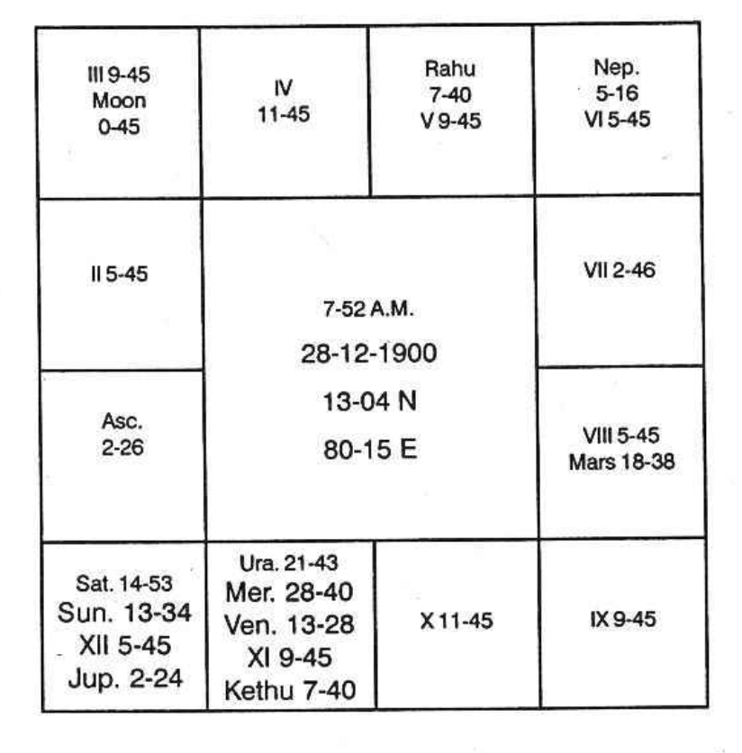

Example: Jupiter Dasa 3 years 1 month 6 days. This gentleman had gains, fortune, and success during Saturn, Mars, and Sun sub-periods; desirable benefits during Jupiter and Mercury sub-periods. But Kethu in 10, Venus in 11, and Rahu in 4 gave untoward and undesirable results.

According to traditional system, Saturn and Sun must be the worst, and Jupiter, being in the 12th house, ought to have been very bad. Venus and Budha causing Dharma Karmadhipathi Rajayoga should have given brilliant results. Rahu, representing Venus, should have caused Rajayoga. Mars should have been dangerous. This person was my friend for a long number of years, and such results alone opened my eyes.

In 1939, when I visited Coimbatore, I heard one Nadi reader reading the results of a few persons in his cottage. I understood that planets' results were read as they were found in the bhavas. Then I heard many Nadi readers. None made use of the constellation. While reading the Nadi, I understood that without assigning the reason, the results were read and they were astoundingly and meticulously correct. For the future, they gave the reasons taking the traditional methods of the bhavas, and the future proved to be mostly a failure. So I started the research, collecting the horoscopes of old people with past events.

Such horoscopes as shown above threw the light. What is it? A planet ‘A’ offers the results of the house occupied by that planet ‘B’, which is the lord of the star wherein this planet ‘A’ is deposited.

Again trouble arose when two, three, or four planets are found in the same constellation, as all the planets in the same star, though referring to the same matters, yet gave diametrically opposite results. For example, if planets A, B, C, and D are in one constellation, in the same house, A and C gave pleasant results whereas B and D gave just opposite results. This made me think further. I found that a particular dasa is to cause Rajayoga. But yet, he gets most desirable results in some bhukties and disadvantageous results in some bhukties. Then I started doing research and in all cases I found that planets, though they are in the same constellation, yet a few are beneficial and a few unfavourable. This caused me to further carry on the research.

I found that every constellation must be divided in the manner I have said into nine subs and each sub having that area in a constellation in the proportion in which they are allotted the number of years in Vimshodhari dasa. I proved that planets occupying any one constellation have connection with the bhava occupied by the lord of the constellation. These planets in that constellation are termed as the “Significators” of the bhava occupied by the lord of the constellation. Thus, if one works out for all the planets, then each planet is found to signify the matters of a few houses.

Then judge each planet. The planet signifies a matter. Whether it votes for the progress and prosperity of that matter or, due to the sub lord, it is not capable of doing good, and further it does harm to that bhava signified by the planet, is to be studied. This discovery has crowned me with success.

I say “if a planet is the significator of lagna bhava, it gives long life, success in attempts; it helps to maintain good health, if the sub lord is not the significator of 6 or 8 or 12. If the sub lord of the planet signifies 6th house and if a planet shows lagna results and occupy such a sub ruled by the significator of 6, he falls ill. The constellation refers to his health, sub signifying 6 gives disease. If a planet signifies lagna bhava and it is in the sub of the significator of 8, he meets with danger. If the sub lord signifies 12th house and the significator of lagna is in such a sub, one runs away, or one is imprisoned, or hospitalized.

Therefore, the constellation lord shows which matter it refers. But the deciding factor, good or bad, success or failure, is shown by the sub occupied by the significator.

Then, in which sub each planet is posited. Finally, one should take each house and judge, to which bhavas the planets are the significators and the sub lords. Judge calmly how each bhava is receiving good results from a few and adverse from the rest.

Suppose a planet is the significator of second bhava and it is in the sub of 6 one borrows, but if it is in the sub of 8 or 12, he lends to others or repays loan. If it is in the sub of 11, there is gain; of what? Either money or son-in-law or daughter-in-law or child birth to the person. If the significator of the second house is in the sub of the significator of 3, through brother one gains, brother loses or gives away. If it is in the sub of 4, one may have car or house during the period of the significator in 2, in the sub of 4th house significator, in their conjoined periods. If the significator of the 4th house which rules the sub and if it is also the significator of 11, he purchases or acquires. If the sub lord who is also the significator of 12 other than 4, he sells and converts the permanent possession as liquid cash and his bank position improves by losing the car or building. If the sub lord of the planet signifying second house is the significator of 10 and 12, then he lets his land for tenancy or lets the house for rent. Why? 10th house is the 4th to the 7th with whom you transact, so that which he takes is given by you (1 2) and he is indebted (6).

Suppose a planet is the significator of 7th house and if it is in the sub of 2 or 11 one gains, there is reunion, one gets married, etc. If it is in the sub of the significator of 12, separation or ill health to wife. If it is in the sub of 1 and 2, danger to partner’s life.

There can be three or four or any number of significators for the 7th. Therefore, during the period or sub period of a planet in such a sub whose lord signifies 12th house, wife fails ill or the native goes away and separation is caused. If the sub lord signifies 6th house, the wife goes away, thereby there is separation.

If the planet is the significator of 7th house and sub of 4, partner gains, makes money and earns name. If the significator of 7 is in the sub of 5, partner makes money, friendship and enjoys pleasure. If the sub is ruled by the significator of 8th house, there is either income or danger to life. If that significator of 8th house is also significator of 5, partner gains. But significator of 8 is also significator of 1 and 7, it means death as 8 and 1 are maraka house to the 7th.

Thus, one should note separately what each planet signifies. Then, in which sub each planet is posited. Finally, one should take each house and judge, to which bhavas the planets are the significators and the sub lords. Judge calmly how each bhava is receiving good results from a few and adverse from the rest.

Say, mother, father, child, etc. Mother is shown by 4th house, father by 9th house, and child by 5th house. So, note the significators of 4, 9, and 5.

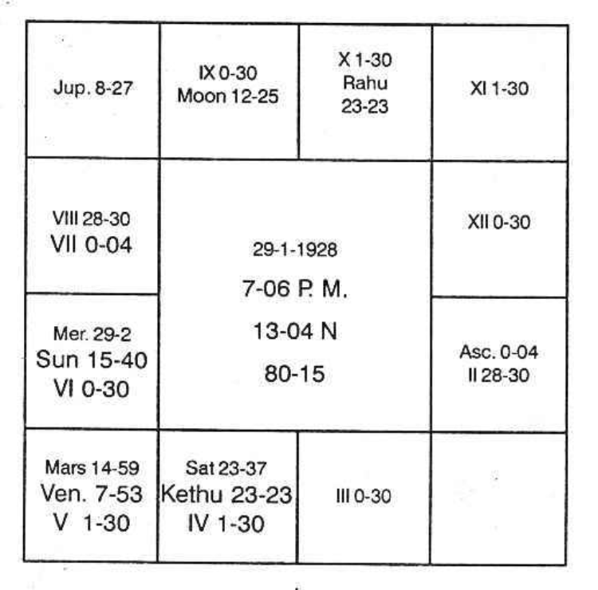

Let us take the above chart. Kethu Dasa balance 0-5-23. The constellation ruled by a planet indicates the matters signified by the bhava occupied or owned by it. The sub lord occupied by a planet denotes whether it is auspicious for the progress of that Bhava or inauspicious so that one has obstacle or faces disappointment or negation of the matter. This applies to all bhava results.

If lagna is occupied by a planet or owned by one and if a planet either the same lagnadhipathi or any other planet is deposited in the occupants or owner's star, then they indicate first house matters. If the depositor in that constellation is in the favourable sub matters indicated by lagna will thrive. If the depositor in that constellation is in unfavourable sub the matters indicated by the lord of the constellation as per its occupation or ownership will suffer.

Lord of lagna is Sun: no planet is in lagna, Sun's stars are Karthik, Uthraphalguni and Uthrashada. Planets, if deposited in these stars will refer the matters signified by first house. If there is no planet, Sun gives lagna bhava results. In the above chart, there is no planet in Sun's star. Hence Sun gives lagna results. Sun is in Moon’s star. Moon is in 9 and owns 12. Hence Sun mostly refers to the matters signified by 9 and 12 i.e. long journey, staying outside, loss of father, permanent possession of father, separation from father. Let us judge the death of his father.

Note the sub occupied by Sun. It is in Jupiter's sub, what can Jupiter do to the 9th house? What can Jupiter do to the 12th house? Jupiter is in Saturn's star. As Saturn is the Bhadhakasthanaadhipathi to 9, Jupiter indicates Bhadhaka to father. Therefore if a constellation indicates father, then the sub of Jupiter in that constellation indicates danger to father. Therefore Sun in the constellation of Moon in 9 and sub of Jupiter - the Bhadhaka to father, promises danger to father.

9 house is owned by Mars. It governs Mrigasira, Chithra and Dhanishta stars. Rahu and Mercury are in Mars star. Rahu is in the sub of Mars who denotes longevity to father. Mercury is in the sub of Saturn Bhadhaka to father. Hence Rahu is a benefic whereas Mercury is evil. To the longevity of father houses 2 and 7 counted from 9th is evil. Both are owned by Venus. Rahu occupies 2 (to 9). Mars occupies Venus star; none in Rahu star. Mars is in the sub of Venus. So it is harmful: Rahu is in the sub of Mars; it is good. Therefore Sun, Mercury, Mars are evil. Venus is in Jupiter sub. Venus is also evil. (Venus is in the constellation of Kethu who represents 4th and 9th houses. Therefore Venus indicates the houses 9, 10 and 3 - danger to father.)

His father died during Sun Dasa Mercury Bhukthi Venus Anthra in July 1952.

Let us judge 4th house. It is occupied by Sani and Kethu. It is owned by Mars. SO planets in Saturn’s stars Kethu stars and Mars stars are those which refer 4th house matters. Venus In Kethu star, Jupiter in Saturn star, Mercury in Mars star indicate 4th house matters. Venus is in the sub of Jupiter, Marakasthanadhipathi and Venus is in Marakasthana to 4 (2™ from 4). Jupiter is in Venus sub. It is evil. Mercury is in Saturn sub. As Saturn is in rapt conjunction with Kethu and Saturn is in the Constellation of (Mercury, lord of 8" from 4") Mercury is evil: Saturn is also evil.

Now Venus, Mercury, Mars, Saturn, Moon, etc. refer 4th house matters. It is the lord of the sub which indicates whether 4th house matter will thrive or not. Venus is in 2 in the sub of lord of 2. Mercury in the constellation of planet in 2 to 4, owner of 4 and in sub of evil in 4. Saturn in the sub of Jupiter and Kethu in the sub of Jupiter, both occupying 4th house are evil. Hence he lost his mother during Venus Dasa Mercury Bhukthi Saturn Anthra on 27-4-47.

Let us analyse the date of death of his mother. It was on 11-4-47 when Venus Dasa (in the constellation of occupant of 4 and sub of the occupant of 10) Mercury Bhukthi (constellation of planet in 2 to 4 and sub of planet in 4) and anthra of Saturn which refers the 4th house (to give life or cause death depending on the sub which Saturn occupied) and it is in the sub of Mars and Shookshma of Rahu in 10 which is also in the constellation of Mars in 2 to 4 and sub of Mars. 

Day of demise: Friday. Star Moolam where Dasanatha was (Jupiter rasi Jupiter significator of 4 in Saturn star and sub of Venus in 2 to 4) at night when lagna was in Poorvashada 15° in Dhanus. 

Death of child happened during Moon Dasa Jupiter Bhukthi Rahu Anthra. Moon is in the constellation of Kethu and sub of Mercury. Kethu has to give the results of planet with which it is conjoined, as it is a node. Saturn is lord of 2 to 5 and situated in 12 to 5. Hence Moon is definitely evil as it is in the constellation of the node representing the second house to the 5th and in the sub of lord of 7 to 5, situated in 2 to 5. 

Jupiter is in the constellation of Saturn, lord of 2 in 12 to 5th house and sub of Venus, which is the occupant of 5 in the constellation of node in 12 to 5. Venus itself is evil to 5. Mars in Venus star Venus sub is also evil. Rahu in Venus sign Mars star and Mars sub is definitely evil. 

Hence, Moon Dasa Jupiter Bhukthi Rahu Anthra was evil. 

Let us take pleasant functions. Marriage 

Judge houses 2, 7, and 11 counted from lagna. 2, 7 and 11 are vacant. 2 is ruled by Sun, 11 is ruled by Mercury. 7 is owned by Saturn. 

Saturn and Kethu are in Mercury star. Jupiter is in Saturn’s star. Kethu is stronger than lord of 7. Moon and Venus are in Kethu star. Sun is also strong as there is no planet in Sun’s star. 

Marriage took place during Venus Dasa, Kethu Bhukthi, Venus Anthra, Moon Shookshma on 6-7-1947 on Sravanam star day. 

Venus is in Kethu star. Kethu is stronger than Saturn, lord of 7 (7th house vacant). 

Kethu is in the star of Mercury (lord of 2 and 11). Both houses, vacant.

Moon is in Kethu star. Kethu stronger than Saturn, lord of 7. 

Kethu has to predominantly indicate Saturn's result; then only that of Mars. Moon's star is not in Mars sign. Hence, Sravanam star governed by Moon in Saturn's sign gave marriage. 

Normally when one finds Saturn and Kethu in 4 and 9th house occupied by lord of 12, one following traditional Astrology must say that the native will have no tendency towards education. Also that he cannot come up nicely in studies. 

But according to Krishnamurti Padhdhati, Saturn and Kethu in 4 are in the constellation of Mercury, lord of 11 and sub of Mars owner of 4, education and 9, higher education. 

According to my method, if the dasanatha is connected with houses 4 and 9, they will give education. 

Venus in the constellation of node in 4 gave studies throughout Venus Dasa. 

Sun in the constellation of Moon in 9 gave higher studies. As Moon is also significator of 12, Sun in the constellation of Moon, gave the break and ended his studies. 

He discontinued his studies after successfully completing Medical College course during Sun Dasa Saturn Bhukthi Sun Anthra in December, 1952.

Service:
Take houses 2, 6 and 10. Sun and Mercury are in 6. Rahu is in 10. Kethu indicates what Saturn is to do, and Saturn is lord of 6. Sukra is lord of 10. 

First appointment was in Sun Dasa (in 6). Saturn Bhukthi (lord of 6). Sun has no planet in its star. Hence Sun has to give surely 6” house results. Saturn in the constellation of Mercury (lord of 2) and owner of 6 has to offer. Kethu can give. Also Moon and Venus. 

Moon in mercury sub is very strong. First appointment was in Sun Dasa Saturn Bhukthi and Moon Anthra in January, 1952.

Thus various instances can be quoted.
